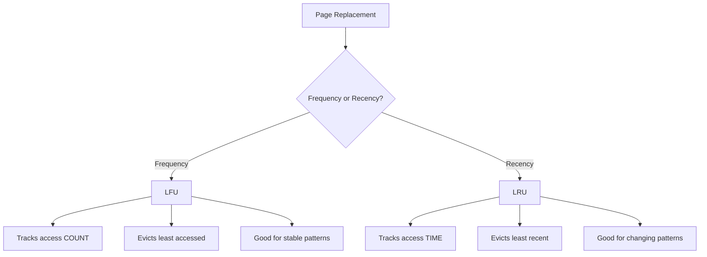

# LFU Page Replacement

## Overview

**LFU (Least Frequently Used)** is a page replacement algorithm that evicts the page with the **lowest access frequency** — the page that has been used the fewest times. It is based on the idea that pages accessed frequently in the past are likely to be accessed frequently in the future.

LFU is a **counting-based** algorithm (as opposed to stack-based like LRU or time-based like FIFO). While it captures frequency well, it has significant drawbacks including susceptibility to Belady's anomaly and difficulty adapting to changing access patterns.

---

## How LFU Works

### Algorithm

1. Maintain a **counter** for each page in memory
2. On each page access (hit): increment the counter
3. On a page fault (miss):
   - If a free frame exists: load the page, set counter to 1
   - If no free frame: evict the page with the **lowest counter**
   - If tie: use a secondary policy (FIFO, LRU, or random)

### Key Property

LFU does **not** have the stack property — it can exhibit **Belady's anomaly**.

---

## Detailed Example

**Given:** 3 page frames, reference string: `7, 0, 1, 2, 0, 3, 0, 4, 2, 3, 0, 3, 2, 1, 2, 0, 1, 7, 0, 1`

| Step | Ref | Frames | Counters | Page Fault? | Action |
|------|-----|--------|----------|-------------|--------|
| 1 | 7 | [7, -, -] | {7:1} | ✅ Fault | Load 7 |
| 2 | 0 | [7, 0, -] | {7:1, 0:1} | ✅ Fault | Load 0 |
| 3 | 1 | [7, 0, 1] | {7:1, 0:1, 1:1} | ✅ Fault | Load 1 |
| 4 | 2 | [2, 0, 1] | {2:1, 0:1, 1:1} | ✅ Fault | Evict 7 (count=1, tie→oldest) |
| 5 | 0 | [2, 0, 1] | {2:1, 0:2, 1:1} | ❌ Hit | Increment 0 |
| 6 | 3 | [2, 3, 1] | {2:1, 3:1, 1:1} | ✅ Fault | Evict 0... wait, 0 has count 2 |

Let me redo. At step 6, we need to load page 3. Frames are [2, 0, 1] with counts {2:1, 0:2, 1:1}.
- 2: count=1
- 0: count=2
- 1: count=1

Lowest count is 1 (pages 2 and 1). Tie-breaking: evict the one loaded earliest (FIFO among ties). Page 2 was loaded at step 4, page 1 at step 3. So evict **1** (loaded earlier).

| 6 | 3 | [2, 0, 3] | {2:1, 0:2, 3:1} | ✅ Fault | Evict 1 (count=1, loaded earliest) |
| 7 | 0 | [2, 0, 3] | {2:1, 0:3, 3:1} | ❌ Hit | Increment 0 |
| 8 | 4 | [2, 0, 4] | {2:1, 0:3, 4:1} | ✅ Fault | Evict 3 (count=1, loaded earliest among {2,3}) |
| 9 | 2 | [2, 0, 4] | {2:2, 0:3, 4:1} | ❌ Hit | Increment 2 |
| 10 | 3 | [3, 0, 4] | {3:1, 0:3, 4:1} | ✅ Fault | Evict 2 (count=2... wait) |

Hmm, at step 10, frames are [2, 0, 4] with counts {2:2, 0:3, 4:1}. We need to load 3.
- 2: count=2
- 0: count=3
- 4: count=1

Lowest count = 1 (page 4). Evict **4**.

| 10 | 3 | [2, 0, 3] | {2:2, 0:3, 3:1} | ✅ Fault | Evict 4 (count=1) |
| 11 | 0 | [2, 0, 3] | {2:2, 0:4, 3:1} | ❌ Hit | Increment 0 |
| 12 | 3 | [2, 0, 3] | {2:2, 0:4, 3:2} | ❌ Hit | Increment 3 |
| 13 | 2 | [2, 0, 3] | {2:3, 0:4, 3:2} | ❌ Hit | Increment 2 |
| 14 | 1 | [2, 0, 1] | {2:3, 0:4, 1:1} | ✅ Fault | Evict 3 (count=2, lowest) |
| 15 | 2 | [2, 0, 1] | {2:4, 0:4, 1:1} | ❌ Hit | Increment 2 |
| 16 | 0 | [2, 0, 1] | {2:4, 0:5, 1:1} | ❌ Hit | Increment 0 |
| 17 | 1 | [2, 0, 1] | {2:4, 0:5, 1:2} | ❌ Hit | Increment 1 |
| 18 | 7 | [2, 0, 7] | {2:4, 0:5, 7:1} | ✅ Fault | Evict 1 (count=2, lowest) |
| 19 | 0 | [2, 0, 7] | {2:4, 0:6, 7:1} | ❌ Hit | Increment 0 |
| 20 | 1 | [1, 0, 7] | {1:1, 0:6, 7:1} | ✅ Fault | Evict 2 (count=4... wait) |

At step 20, frames are [2, 0, 7] with counts {2:4, 0:6, 7:1}. Need to load 1.
- 2: count=4
- 0: count=6
- 7: count=1

Lowest count = 1 (page 7). Evict **7**.

| 20 | 1 | [2, 0, 1] | {2:4, 0:6, 1:1} | ✅ Fault | Evict 7 (count=1) |

**Total page faults: 10**

---

## LFU Problems

### 1. Cache Pollution (Frequency Cache Problem)

Once a page accumulates a high frequency count, it becomes very difficult to evict, even if it's no longer being used.

```
Example:
Access pattern: A×100, B×50, then repeatedly access C

After initial phase:
- A: count = 100
- B: count = 50

Now C needs frames, but A and B have high counts.
LFU keeps A and B even though they're no longer accessed.
```

### 2. Slow Adaptation

LFU considers the **entire history** of accesses. A page that was heavily used in the past but is no longer needed will stay in memory because of its high count.

### 3. Belady's Anomaly

Unlike LRU and Optimal, LFU is **not** a stack algorithm and can exhibit Belady's anomaly (increasing frames can increase faults).

---

## LFU Variants

### 1. LFU with Aging

To address cache pollution, add **aging** — periodically reduce all counters:

```python
def lfu_with_aging(page_references, num_frames, aging_factor=0.5):
    frames = {}
    page_faults = 0

    for i, page in enumerate(page_references):
        # Periodic aging
        if i % 10 == 0:
            for p in frames:
                frames[p] = int(frames[p] * aging_factor)

        if page in frames:
            frames[page] += 1
        else:
            page_faults += 1
            if len(frames) >= num_frames:
                victim = min(frames, key=frames.get)
                del frames[victim]
            frames[page] = 1

    return page_faults
```

### 2. LFU with Dynamic Aging (TinyLFU)

Used in modern caches (e.g., **Caffeine** cache in Java). Combines frequency with recency:

```
admission_score(page) = frequency(page) + recency_bonus(page)
```

### 3. W-TinyLFU (Window TinyLFU)

Used in **Caffeine** (Java's best cache library):

```
┌─────────────────────────────────────┐
│  Window Cache (LRU, small)          │
│  New entries land here              │
└──────────────┬──────────────────────┘
               │ Admission filter
               ▼
┌─────────────────────────────────────┐
│  Main Cache (SLRU or Segmented LRU)│
│  Frequency-based eviction           │
└─────────────────────────────────────┘
```

---

## Implementation

### Basic LFU

```python
import collections

def lfu(page_references, num_frames):
    """Basic LFU page replacement."""
    frames = {}  # page -> frequency
    page_faults = 0

    for page in page_references:
        if page in frames:
            frames[page] += 1
        else:
            page_faults += 1
            if len(frames) >= num_frames:
                # Evict page with lowest frequency
                victim = min(frames, key=frames.get)
                del frames[victim]
            frames[page] = 1

    return page_faults
```

**Time complexity:** O(n) per replacement (finding minimum). Can be improved to O(log n) with a min-heap.

### LFU with O(1) Operations

```python
class LFUCache:
    """LFU with O(1) operations using frequency buckets."""

    def __init__(self, capacity):
        self.capacity = capacity
        self.freq_map = {}       # page -> frequency
        self.freq_to_pages = collections.defaultdict(collections.OrderedDict)  # freq -> {page: None}
        self.min_freq = 0

    def access(self, page):
        if page in self.freq_map:
            self._increment_freq(page)
            return False  # Hit

        # Page fault
        if len(self.freq_map) >= self.capacity:
            self._evict()

        self.freq_map[page] = 1
        self.freq_to_pages[1][page] = None
        self.min_freq = 1
        return True  # Fault

    def _increment_freq(self, page):
        freq = self.freq_map[page]
        self.freq_map[page] = freq + 1

        # Move to next frequency bucket
        del self.freq_to_pages[freq][page]
        if not self.freq_to_pages[freq]:
            del self.freq_to_pages[freq]
            if self.min_freq == freq:
                self.min_freq = freq + 1

        self.freq_to_pages[freq + 1][page] = None

    def _evict(self):
        # Evict from min_freq bucket (FIFO within bucket)
        victim_page, _ = self.freq_to_pages[self.min_freq].popitem(last=False)
        del self.freq_map[victim_page]
```

**Time complexity:** O(1) for all operations.

---

## LFU vs LRU



| Property | LFU | LRU |
|---|---|---|
| Tracks | Access count | Access time |
| Evicts | Least frequent | Least recent |
| Adaptability | Slow (stuck on history) | Fast (recency changes) |
| Belady's anomaly | Yes | No |
| Cache pollution | Yes (high-count pages stick) | No |
| Best for | Stable, skewed workloads | General workloads |
| Implementation | O(1) with freq buckets | O(1) with hash+DLL |

---

## Interview Questions

### Q1: What is the LFU page replacement algorithm?
**A:** LFU evicts the page with the lowest access frequency. Each page has a counter that increments on every access. On a fault, the page with the smallest counter is evicted. Ties are broken by secondary criteria (FIFO, LRU, or random).

### Q2: What are the disadvantages of LFU?
**A:** Two main issues:
1. **Cache pollution**: A page that was heavily accessed in the past but is no longer used will stay in memory due to its high count.
2. **Slow adaptation**: LFU considers the entire history, so it can't quickly adapt to changing access patterns.
3. **Belady's anomaly**: Unlike LRU, LFU is not a stack algorithm and can exhibit Belady's anomaly.

### Q3: How would you improve LFU?
**A:** Add **aging** — periodically decay all frequency counters (e.g., halve them). This allows pages that are no longer accessed to gradually lose their high counts. Modern variants like **TinyLFU** and **W-TinyLFU** combine frequency with recency for better performance.

### Q4: What is the difference between LFU and LRU?
**A:** LFU counts **how many times** a page is accessed (frequency). LRU tracks **when** a page was last accessed (recency). A page accessed 1000 times in the past but not recently would be kept by LFU but evicted by LRU.

### Q5: How can LFU be implemented in O(1)?
**A:** Use a map from frequency to a list of pages (frequency buckets) and a map from page to its current frequency. Maintain the minimum frequency. On access, move the page to the next frequency bucket. On eviction, remove from the minimum frequency bucket. All operations are O(1).

---

## Common Mistakes

1. **Confusing LFU with LRU**: LFU = frequency (count). LRU = recency (time). They are fundamentally different metrics.
2. **Not handling ties**: Multiple pages can have the same frequency. You need a tie-breaking policy (FIFO, LRU, or random).
3. **Forgetting about cache pollution**: LFU's biggest weakness. In interviews, always mention aging as a mitigation.
4. **Not knowing LFU has Belady's anomaly**: Unlike LRU and Optimal, LFU is not a stack algorithm.
5. **Assuming LFU is better than LRU**: For most general workloads, LRU outperforms LFU because it adapts faster to changing patterns.

---

## Summary

LFU is a counting-based page replacement algorithm that evicts the least frequently accessed page. While it captures frequency well for stable workloads, it suffers from cache pollution (stuck high-count pages) and slow adaptation to changing patterns.

**Key points for interviews:**
- Evicts page with lowest access count
- O(1) implementation: frequency buckets + min frequency tracking
- Weaknesses: cache pollution, slow adaptation, Belady's anomaly
- Mitigation: aging (periodic counter decay), TinyLFU (frequency + recency)
- LRU is generally preferred over LFU for general workloads
- LFU is a counting-based algorithm, not a stack algorithm
