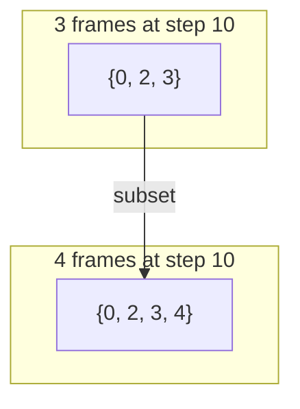
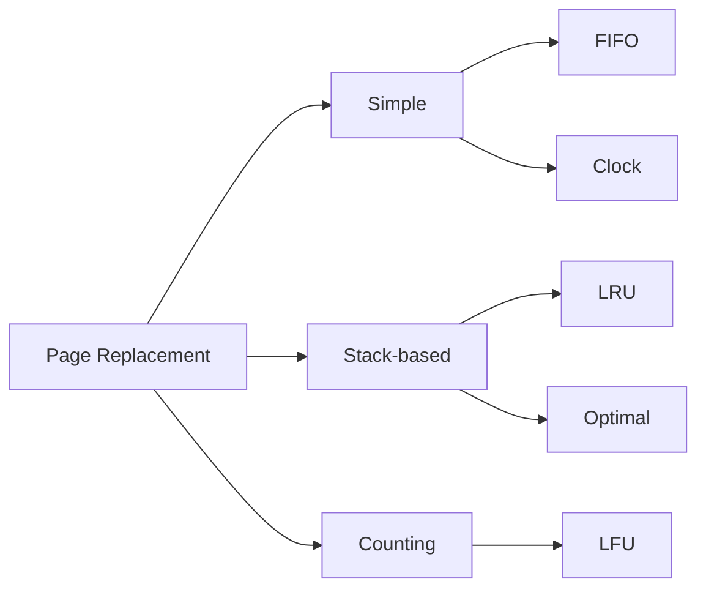

# LRU Page Replacement

## Overview

**LRU (Least Recently Used)** is one of the most important page replacement algorithms. It evicts the page that has **not been accessed for the longest time** — the page whose last use is farthest in the past.

LRU is a **stack algorithm** (immune to Belady's anomaly) and closely approximates the theoretically optimal algorithm. It is widely used in practice, though exact implementation is expensive, leading to various approximations.

---

## How LRU Works

### Core Principle

When a page fault occurs, replace the page that was used **least recently**. The intuition: a page accessed recently is likely to be accessed again soon (temporal locality).

### Algorithm

```
On page access(page):
    if page in memory:
        // Hit — update access time
        update page's last_access_time to current_time
    else:
        // Fault
        if memory is full:
            victim = page with minimum last_access_time
            evict victim
        load page into memory
        set page's last_access_time to current_time
```

---

## Detailed Example

**Given:** 3 page frames, reference string: `7, 0, 1, 2, 0, 3, 0, 4, 2, 3, 0, 3, 2, 1, 2, 0, 1, 7, 0, 1`

| Step | Ref | Frame 0 | Frame 1 | Frame 2 | Last Used (step#) | Page Fault? |
|------|-----|---------|---------|---------|-------------------|-------------|
| 1 | 7 | **7** | - | - | 7→1 | ✅ Fault |
| 2 | 0 | 7 | **0** | - | 7→1, 0→2 | ✅ Fault |
| 3 | 1 | 7 | 0 | **1** | 7→1, 0→2, 1→3 | ✅ Fault |
| 4 | 2 | **2** | 0 | 1 | 2→4, 0→2, 1→3 | ✅ Fault (evict 7, used at step 1) |
| 5 | 0 | 2 | 0 | 1 | 2→4, 0→5, 1→3 | ❌ Hit |
| 6 | 3 | 2 | **3** | 1 | 2→4, 3→6, 1→3 | ✅ Fault (evict 0... wait) |
| 7 | 0 | 2 | 3 | **0** | 2→4, 3→6, 0→7 | ✅ Fault (evict 1, used at step 3) |
| 8 | 4 | **4** | 3 | 0 | 4→8, 3→6, 0→7 | ✅ Fault (evict 2, used at step 4) |
| 9 | 2 | 4 | **2** | 0 | 4→8, 2→9, 0→7 | ✅ Fault (evict 3, used at step 6) |
| 10 | 3 | 4 | 2 | **3** | 4→8, 2→9, 3→10 | ✅ Fault (evict 0, used at step 7) |
| 11 | 0 | **0** | 2 | 3 | 0→11, 2→9, 3→10 | ✅ Fault (evict 4, used at step 8) |
| 12 | 3 | 0 | 2 | 3 | 0→11, 2→9, 3→12 | ❌ Hit |
| 13 | 2 | 0 | 2 | 3 | 0→11, 2→13, 3→12 | ❌ Hit |
| 14 | 1 | 0 | **1** | 3 | 0→11, 1→14, 3→12 | ✅ Fault (evict 2, used at step 13... wait) |
| 15 | 2 | 0 | 1 | **2** | 0→11, 1→14, 2→15 | ✅ Fault (evict 3, used at step 12) |
| 16 | 0 | 0 | 1 | 2 | 0→16, 1→14, 2→15 | ❌ Hit |
| 17 | 1 | 0 | 1 | 2 | 0→16, 1→17, 2→15 | ❌ Hit |
| 18 | 7 | **7** | 1 | 2 | 7→18, 1→17, 2→15 | ✅ Fault (evict 0, used at step 16) |
| 19 | 0 | 7 | **0** | 2 | 7→18, 0→19, 2→15 | ✅ Fault (evict 1, used at step 17) |
| 20 | 1 | 7 | 0 | **1** | 7→18, 0→19, 1→20 | ✅ Fault (evict 2, used at step 15) |

**Total page faults: 12** (better than FIFO's 15 for the same input)

---

## LRU Stack Property

### Why LRU Has No Belady's Anomaly

LRU is a **stack algorithm**: the set of pages in *n* frames is always a **subset** of the pages in *n+1* frames.



This is because LRU tracks access recency. With more frames, you simply keep more of the most-recently-used pages. The oldest page in *n* frames must also be the oldest among the same pages in *n+1* frames.

**Formal proof**: For any reference string, let `S(n, t)` be the set of pages in memory with *n* frames at time *t*. For LRU, `S(n, t) ⊆ S(n+1, t)` for all *t*. This means adding frames can only reduce page faults, never increase them.

---

## Implementation Approaches

### 1. Counter-Based (Timestamp)

```python
def lru_counter(page_references, num_frames):
    """LRU using timestamps — O(n) per replacement."""
    frames = {}  # page -> last_access_time
    page_faults = 0

    for time, page in enumerate(page_references):
        if page in frames:
            frames[page] = time  # Update access time
        else:
            page_faults += 1
            if len(frames) >= num_frames:
                # Find page with minimum access time
                victim = min(frames, key=frames.get)
                del frames[victim]
            frames[page] = time

    return page_faults
```

**Time complexity:** O(n) per replacement (finding minimum), O(1) per hit.

### 2. Stack-Based (Doubly Linked List + Hash Map)

```python
from collections import OrderedDict

def lru_ordered_dict(page_references, num_frames):
    """LRU using OrderedDict — O(1) per operation."""
    frames = OrderedDict()
    page_faults = 0

    for page in page_references:
        if page in frames:
            # Hit — move to end (most recent)
            frames.move_to_end(page)
        else:
            page_faults += 1
            if len(frames) >= num_frames:
                # Evict least recently used (first item)
                frames.popitem(last=False)
            frames[page] = True

    return page_faults
```

**Time complexity:** O(1) per operation (using ordered dict or doubly linked list + hash map).

### 3. Using a Doubly Linked List (Classic Implementation)

```python
class DLLNode:
    def __init__(self, page):
        self.page = page
        self.prev = None
        self.next = None

class LRUCache:
    def __init__(self, capacity):
        self.capacity = capacity
        self.cache = {}  # page -> DLLNode
        self.head = DLLNode(None)  # dummy head
        self.tail = DLLNode(None)  # dummy tail
        self.head.next = self.tail
        self.tail.prev = self.head
        self.page_faults = 0

    def _add_to_front(self, node):
        """Add node right after head (most recent)."""
        node.next = self.head.next
        node.prev = self.head
        self.head.next.prev = node
        self.head.next = node

    def _remove_node(self, node):
        """Remove node from list."""
        node.prev.next = node.next
        node.next.prev = node.prev

    def _move_to_front(self, node):
        """Move existing node to front (mark as recently used)."""
        self._remove_node(node)
        self._add_to_front(node)

    def access(self, page):
        if page in self.cache:
            # Hit — move to front
            self._move_to_front(self.cache[page])
        else:
            # Fault
            self.page_faults += 1
            if len(self.cache) >= self.capacity:
                # Evict LRU (node before tail)
                victim = self.tail.prev
                self._remove_node(victim)
                del self.cache[victim.page]
            # Add new page
            new_node = DLLNode(page)
            self._add_to_front(new_node)
            self.cache[page] = new_node
```

**Time complexity:** O(1) for all operations — this is the optimal implementation.

---

## LRU Approximations

Exact LRU requires hardware support (timestamps or stack manipulation on every memory access), which is expensive. Real systems use approximations:

### 1. Clock Algorithm (Second-Chance)
- Uses a reference bit (R bit) instead of timestamps
- O(1) per operation with circular buffer
- See: [Clock Page Replacement](./clock.md)

### 2. NFU (Not Frequently Used) with Aging

```
Each page has a counter.
On each clock tick:
    For each page:
        counter = (counter >> 1) | R_bit
        R_bit = 0

On replacement: evict page with lowest counter.
```

The counter approximates LRU by shifting in the R bit from the left, so recent accesses have more weight.

```
Example (8-bit counter, 4 accesses):
Access pattern: R=1, R=0, R=1, R=1

After tick 1: 10000000
After tick 2: 01000000  (shift right, R=0)
After tick 3: 10100000  (shift right, R=1)
After tick 4: 11010000  (shift right, R=1)

Higher counter = more recently/frequently accessed
```

### 3. Linux: Active/Inactive Lists

Linux uses a two-list strategy:

```
┌─────────────────┐     ┌─────────────────┐
│  Active List     │     │  Inactive List   │
│  (hot pages)     │◄───►│  (cold pages)    │
│  Recently used   │     │  Candidates for  │
│                  │     │  eviction         │
└─────────────────┘     └─────────────────┘

- Pages accessed: stay in/move to Active list
- Pages not accessed: move to Inactive list
- On memory pressure: evict from Inactive list
```

```bash
# View LRU lists info in Linux
cat /proc/vmstat | grep -i lru
# nr_active_anon   — active anonymous pages
# nr_inactive_anon — inactive anonymous pages
# nr_active_file   — active file pages
# nr_inactive_file — inactive file pages

# Tune LRU behavior
cat /proc/sys/vm/swappiness           # Controls anon vs file eviction preference
echo 10 > /proc/sys/vm/swappiness

# Check page reclaim activity
cat /proc/vmstat | grep -E "pgactivate|pgdeactivate|pgscan|pgsteal"
```

---

## LRU vs Other Algorithms



| Property | LRU | FIFO | Optimal |
|---|---|---|---|
| Eviction criterion | Least recently used | Oldest loaded | Farthest future use |
| Belady's anomaly | No | Yes | No |
| Implementation cost | O(1) with hash+DLL | O(1) with queue | Requires future knowledge |
| Performance | Good | Poor | Best (theoretical) |
| Practical use | Widely used (approx.) | None | Benchmark |

---

## Simulation

```python
def lru_simulation():
    """Simulate LRU with detailed output."""
    reference_string = [7, 0, 1, 2, 0, 3, 0, 4, 2, 3, 0, 3, 2, 1, 2, 0, 1, 7, 0, 1]
    num_frames = 3

    from collections import OrderedDict
    frames = OrderedDict()
    page_faults = 0

    print(f"Reference String: {reference_string}")
    print(f"Number of Frames: {num_frames}")
    print(f"{'Step':<5} {'Ref':<5} {'Frames':<20} {'Stack (MRU→LRU)':<20} {'Result'}")
    print("-" * 75)

    for i, page in enumerate(reference_string):
        if page in frames:
            frames.move_to_end(page)
            result = "HIT"
        else:
            page_faults += 1
            if len(frames) >= num_frames:
                evicted = next(iter(frames))
                del frames[evicted]
            frames[page] = True
            result = f"FAULT (evict {evicted if 'evicted' in dir() else '-'})"

        stack = list(reversed(list(frames.keys())))
        print(f"{i+1:<5} {page:<5} {str(list(frames.keys())):<20} {str(stack):<20} {result}")

    print(f"\nTotal Page Faults: {page_faults}")
    print(f"Fault Rate: {page_faults}/{len(reference_string)} = {page_faults/len(reference_string):.1%}")

# lru_simulation()
```

---

## Interview Questions

### Q1: What is the LRU page replacement algorithm?
**A:** LRU evicts the page that has not been accessed for the longest time. It uses the principle of temporal locality: a page accessed recently is likely to be accessed again soon. LRU is a stack algorithm, meaning it's immune to Belady's anomaly.

### Q2: How would you implement LRU efficiently?
**A:** Use a **doubly linked list** + **hash map** for O(1) operations:
- Hash map: O(1) lookup to check if a page is in memory
- Doubly linked list: O(1) insertion, deletion, and movement
- On hit: move the node to the front of the list
- On fault: evict the node at the tail (least recently used), add new node at the front

This is the same data structure used for LRU caches in system design interviews.

### Q3: Why is LRU not used directly in OS page replacement?
**A:** Exact LRU requires updating timestamps or a stack on **every memory access**, which would add overhead to every load/store instruction. Instead, OSes use approximations like the Clock algorithm (reference bits) or NFU with aging.

### Q4: What is a stack algorithm?
**A:** A stack algorithm has the property that the set of pages in *n* frames is always a subset of pages in *n+1* frames: `S(n) ⊆ S(n+1)`. This guarantees that adding frames can never increase page faults, eliminating Belady's anomaly. LRU and Optimal are stack algorithms; FIFO is not.

### Q5: Compare LRU and LFU.
**A:** **LRU** evicts based on **recency** (how long since last access). **LFU** evicts based on **frequency** (how many times accessed). LRU adapts to changing workloads better; LFU can get stuck with historically popular but no-longer-used pages.

---

## Common Mistakes

1. **Confusing LRU with LFU**: LRU = least recently used (recency). LFU = least frequently used (frequency). They are fundamentally different.
2. **Assining LRU is O(1) without specifying the data structure**: With a simple array, LRU is O(n). The O(1) implementation requires a hash map + doubly linked list.
3. **Not knowing the stack property**: In interviews, you should know that LRU is a stack algorithm and therefore immune to Belady's anomaly.
4. **Confusing LRU with Optimal**: LRU looks at the **past** (last access time). Optimal looks at the **future** (next access time). Optimal is theoretically best but impractical.
5. **Forgetting that real OSes approximate LRU**: No real OS implements exact LRU. They all use approximations (clock, NFU with aging, active/inactive lists).

---

## Summary

LRU is the gold standard page replacement algorithm — good performance, immune to Belady's anomaly, and the basis for real OS implementations. The key implementation is the hash map + doubly linked list for O(1) operations.

**Key points for interviews:**
- LRU evicts the page with the oldest last-access time
- Stack algorithm: `S(n) ⊆ S(n+1)`, no Belady's anomaly
- Implementation: hash map + doubly linked list → O(1) per operation
- Real OSes use approximations (Clock, NFU with aging, two-list strategy)
- Compare with FIFO (simpler but worse) and Optimal (best but impractical)


## Cross References

- [Page Replacement](page-replacement.md)
- [Clock Algorithm](clock.md)
- [Cache Replacement](../../arch/memory-hierarchy/replacement.md)
- [Buffer Pool](../../dbms/caching/buffer-pool.md)
