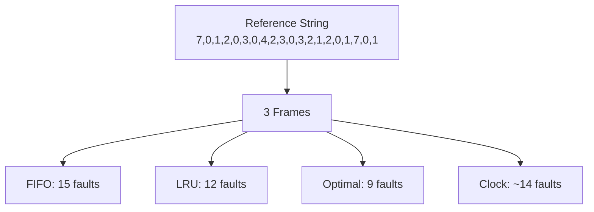
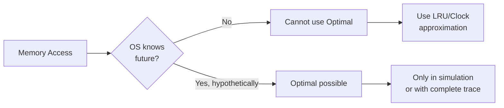

# Optimal Page Replacement (MIN Algorithm)

## Overview

The **Optimal page replacement algorithm** (also called **MIN** or **Belady's optimal algorithm**) evicts the page that **will not be used for the longest time in the future**. It was proposed by László Bélády in 1966 and produces the **minimum possible number of page faults** for any given reference string.

The Optimal algorithm is **theoretically perfect but practically impossible** — it requires knowledge of future references, which is unavailable in real systems. It serves as a **theoretical benchmark** against which other algorithms are measured.

---

## How Optimal Works

### Algorithm

```
On page fault:
    For each page currently in memory:
        Find when it will next be referenced
    Evict the page whose next reference is FARTHEST in the future
    (If a page is never referenced again, it is the best victim)
```

### Key Property

The Optimal algorithm is a **stack algorithm**: `S(n) ⊆ S(n+1)` for all reference strings, meaning it is immune to Belady's anomaly.

---

## Detailed Example

**Given:** 3 page frames, reference string: `7, 0, 1, 2, 0, 3, 0, 4, 2, 3, 0, 3, 2, 1, 2, 0, 1, 7, 0, 1`

**Algorithm:** on each fault with no free frame, evict the page whose **next future use** is farthest away. A page never used again is treated as ∞ (the maximum).

**Reference string:** `7, 0, 1, 2, 0, 3, 0, 4, 2, 3, 0, 3, 2, 1, 2, 0, 1, 7, 0, 1`

**Next-use table** (for each position, when is each page next referenced):

| Position | 1 | 2 | 3 | 4 | 5 | 6 | 7 | 8 | 9 | 10 | 11 | 12 | 13 | 14 | 15 | 16 | 17 | 18 | 19 | 20 |
|----------|---|---|---|---|---|---|---|---|---|----|----|----|----|----|----|----|----|----|----|----|
| Page | 7 | 0 | 1 | 2 | 0 | 3 | 0 | 4 | 2 | 3 | 0 | 3 | 2 | 1 | 2 | 0 | 1 | 7 | 0 | 1 |
| Next 7 | 18 | 18 | 18 | 18 | 18 | 18 | 18 | 18 | 18 | 18 | 18 | 18 | 18 | 18 | 18 | 18 | 18 | ∞ | ∞ | ∞ |
| Next 0 | 5 | 5 | 5 | 5 | 7 | 7 | 11 | 11 | 11 | 11 | 16 | 16 | 16 | 16 | 16 | 19 | 19 | 19 | ∞ | ∞ |
| Next 1 | 14 | 14 | 14 | 14 | 14 | 14 | 14 | 14 | 14 | 14 | 14 | 14 | 14 | 17 | 17 | 17 | 20 | 20 | 20 | ∞ |
| Next 2 | 9 | 9 | 9 | 9 | 9 | 9 | 9 | 9 | 13 | 13 | 13 | 13 | 15 | 15 | 15 | 15 | 15 | 15 | 15 | 15 |
| Next 3 | 10 | 10 | 10 | 10 | 10 | 10 | 10 | 10 | 10 | 12 | 12 | 12 | 12 | 12 | 12 | 12 | 12 | 12 | 12 | 12 |
| Next 4 | ∞ | ∞ | ∞ | ∞ | ∞ | ∞ | ∞ | ∞ | ∞ | ∞ | ∞ | ∞ | ∞ | ∞ | ∞ | ∞ | ∞ | ∞ | ∞ | ∞ |

**Trace:**

| Step | Ref | Frames | Next uses of current pages | Evict | Fault? |
|------|-----|--------|---------------------------|-------|--------|
| 1 | 7 | [7] | — | — | ✅ |
| 2 | 0 | [7, 0] | — | — | ✅ |
| 3 | 1 | [7, 0, 1] | — | — | ✅ |
| 4 | 2 | [2, 0, 1] | 7→18, 0→5, 1→14 | **7** (18, farthest) | ✅ |
| 5 | 0 | [2, 0, 1] | — | — | ❌ Hit |
| 6 | 3 | [2, 0, 1] | 2→9, 0→7, 1→14 | **1** (14, farthest) | ✅ |
| 7 | 0 | [2, 0, 3] | — | — | ❌ Hit |
| 8 | 4 | [2, 4, 3] | 2→9, 0→11, 3→10 | **0** (11, farthest future use) | ✅ |

At step 8, the pages in memory are [2, 0, 3] and we need to load 4. Next future uses:
- 2 → step 9
- 0 → step 11
- 3 → step 10

Farthest future use is page 0 at step 11, so evict 0 and load 4.

| 9 | 2 | [2, 4, 3] | — | — | ❌ Hit |
| 10 | 3 | [2, 4, 3] | — | — | ❌ Hit |
| 11 | 0 | [2, 3, 0] | 2→13, 3→12, 4→∞ | **4** (∞, never used again) | ✅ |
| 12 | 3 | [2, 3, 0] | — | — | ❌ Hit |
| 13 | 2 | [2, 3, 0] | — | — | ❌ Hit |
| 14 | 1 | [2, 0, 1] | 2→15, 0→16, 3→∞ | **3** (∞, no more 3s in the reference) | ✅ |
| 15 | 2 | [2, 0, 1] | — | — | ❌ Hit |
| 16 | 0 | [2, 0, 1] | — | — | ❌ Hit |
| 17 | 1 | [2, 0, 1] | — | — | ❌ Hit |
| 18 | 7 | [0, 1, 7] | 0→19, 1→20, 2→∞ | **2** (∞, no more 2s) | ✅ |
| 19 | 0 | [0, 1, 7] | — | — | ❌ Hit |
| 20 | 1 | [0, 1, 7] | — | — | ❌ Hit |

**Total page faults: 9** (compared to FIFO's 15 and LRU's 12 for the same input!)

---

## Optimal vs Other Algorithms



| Algorithm | Page Faults (3 frames) | Relative Performance |
|---|---|---|
| FIFO | 15 | Worst |
| Clock | ~14 | Poor |
| LRU | 12 | Good |
| **Optimal** | **9** | **Best (theoretical)** |

---

## Implementation

### Brute Force (O(n × m) per replacement)

```python
def optimal(page_references, num_frames):
    """Optimal page replacement — requires future knowledge."""
    frames = []
    page_faults = 0

    for i, page in enumerate(page_references):
        if page in frames:
            continue  # Hit

        page_faults += 1
        if len(frames) < num_frames:
            frames.append(page)
        else:
            # Find page not used for longest time in future
            farthest = -1
            victim = None
            for f in frames:
                # Find next use of frame f
                try:
                    next_use = page_references[i+1:].index(f)
                except ValueError:
                    # Never used again — best victim
                    victim = f
                    break
                if next_use > farthest:
                    farthest = next_use
                    victim = f
            frames[frames.index(victim)] = page

    return page_faults
```

### Optimized with Precomputed Next-Use Table

```python
def optimal_precomputed(page_references, num_frames):
    """Optimal with precomputed next-use table — O(n + m) per replacement."""
    n = len(page_references)

    # Precompute next use for each position
    next_use = {}
    next_use_table = [{} for _ in range(n)]

    for i in range(n - 1, -1, -1):
        page = page_references[i]
        next_use_table[i] = next_use.copy()
        next_use[page] = i

    frames = set()
    page_faults = 0

    for i, page in enumerate(page_references):
        if page in frames:
            continue

        page_faults += 1
        if len(frames) < num_frames:
            frames.add(page)
        else:
            # Find victim: page with farthest next use
            victim = None
            farthest_pos = -1
            for f in frames:
                next_pos = next_use_table[i].get(f, float('inf'))
                if next_pos > farthest_pos:
                    farthest_pos = next_pos
                    victim = f
            frames.remove(victim)
            frames.add(page)

    return page_faults
```

---

## Why Optimal is Impractical



1. **No future knowledge**: The OS cannot predict which pages will be accessed next
2. **Dynamic programs**: Access patterns change based on input, user behavior, and system state
3. **Practical alternative**: LRU approximates Optimal well for most workloads
4. **Used as benchmark**: Optimal provides the theoretical lower bound on page faults

### Where Optimal IS Used

- **Offline analysis**: When you have a complete trace of memory accesses (e.g., from profiling)
- **Comparison baseline**: To evaluate how close other algorithms come to optimal
- **Teaching**: To understand the theoretical limits of page replacement
- **Cache simulation**: In hardware cache design, traces can be analyzed offline

---

## Mathematical Properties

### Stack Property

Optimal is a **stack algorithm**: for any reference string and any number of frames *n*:

```
S(n, t) ⊆ S(n+1, t)  for all t
```

Where `S(n, t)` is the set of pages in memory with *n* frames at time *t`.

**Proof sketch**: If a page is in the optimal set with *n* frames, it must also be in the optimal set with *n+1* frames because having more frames gives more room and can only help.

### Minimality

For any reference string, Optimal produces the **minimum number of page faults** among all algorithms. This is proven by contradiction: if another algorithm produced fewer faults, it must have made a different replacement decision at some point, but Optimal's choice (farthest future use) is provably at least as good.

---

## Interview Questions

### Q1: What is the Optimal page replacement algorithm?
**A:** Optimal (MIN) evicts the page that will not be used for the longest time in the future. It produces the minimum possible page faults for any reference string. It's a theoretical benchmark because it requires future knowledge, which is unavailable in real systems.

### Q2: Why can't the Optimal algorithm be implemented in practice?
**A:** It requires knowing future memory references, which is impossible for a running program. The OS cannot predict which pages a process will access next. However, it's useful as a benchmark to evaluate other algorithms.

### Q3: How does LRU compare to Optimal?
**A:** LRU approximates Optimal by assuming that the page not used recently won't be used soon. For many workloads with temporal locality, LRU performs close to Optimal. However, LRU can perform poorly when there are scanning patterns (sequential access to more pages than fit in memory).

### Q4: What is the time complexity of Optimal?
**A:** The brute-force implementation is O(n × m) per replacement, where n is the remaining reference string length and m is the number of frames. With a precomputed next-use table, it can be reduced to O(m) per replacement.

### Q5: Can you give an example where FIFO performs worse than Optimal?
**A:** For the reference string `1, 2, 3, 4, 1, 2, 5, 1, 2, 3, 4, 5` with 3 frames: FIFO gives 9 faults, while Optimal gives 8 faults (by evicting pages that are not needed for the longest time). The gap widens with more pathological reference strings.

---

## Common Mistakes

1. **Confusing Optimal with LRU**: Optimal looks at **future** references; LRU looks at **past** references. They are fundamentally different.
2. **Assuming Optimal is always much better**: For many real workloads, LRU performs within a few percent of Optimal.
3. **Not knowing it's a stack algorithm**: Like LRU, Optimal is immune to Belady's anomaly.
4. **Trying to implement Optimal in a real system**: You can't. Use it only for offline analysis and comparison.
5. **Forgetting the "never used again" case**: A page that will never be referenced again is always the best victim — it's the special case where next use is infinity.

---

## Summary

The Optimal algorithm is the theoretical gold standard for page replacement — it achieves minimum page faults by evicting the page with the farthest future use. While impractical for real systems (requires future knowledge), it serves as an essential benchmark.

**Key points for interviews:**
- Evicts page with farthest next use (or never used again)
- Produces minimum page faults — provably optimal
- Stack algorithm: no Belady's anomaly
- Cannot be implemented in practice (needs future knowledge)
- Used as benchmark to evaluate LRU, FIFO, Clock, etc.
- Time complexity: O(m) per replacement with precomputed table


## Cross References

- [Page Replacement](page-replacement.md)
- [LRU](lru.md)
- [Cache Replacement](../../arch/memory-hierarchy/replacement.md)
