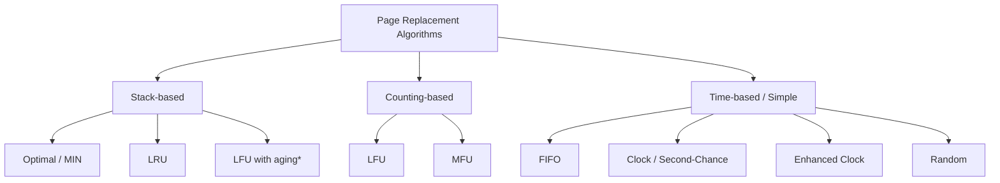
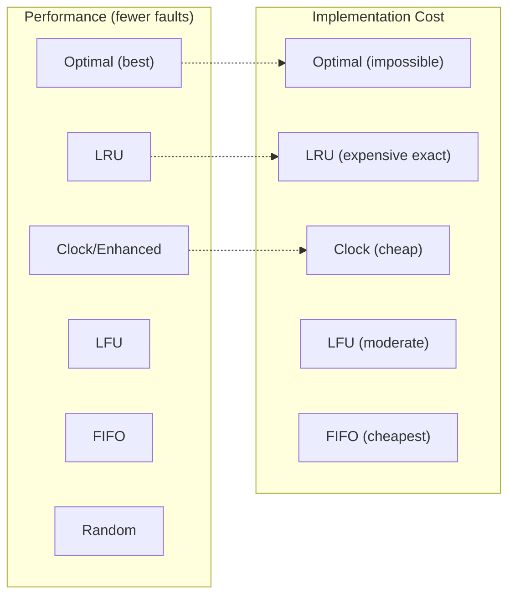

# Page Replacement Overview

## Overview

When physical memory (RAM) is full and a new page needs to be loaded, the OS must choose which existing page to **evict** (replace). This decision is made by the **page replacement algorithm**. Choosing the right algorithm is critical — a poor choice can dramatically increase the page fault rate and degrade system performance.

This page provides a comprehensive overview and comparison of all major page replacement algorithms.

---

## The Page Replacement Problem

```
Physical Memory (3 frames):
┌─────┬─────┬─────┐
│  A  │  B  │  C  │   ← All occupied
└─────┴─────┴─────┘

New page D needs to be loaded → Page fault!

Which page do we evict?
├── A? B? C?
└── The answer depends on the algorithm!
```

### Goal

Minimize **page faults** — the number of times a referenced page is not in memory and must be loaded from disk.

### Why It Matters

A page fault from disk costs **~10 ms** (HDD) or **~100 μs** (SSD), while a RAM access costs **~100 ns**. A page fault is **100,000× slower** than a memory hit on HDD. Choosing the right algorithm can mean the difference between a responsive system and one that's unusably slow.

---

## Classification of Algorithms



---

## Algorithm Summary Table

| Algorithm | Eviction Criterion | Data Structure | Time Complexity | Belady's Anomaly | Practical? |
|---|---|---|---|---|---|
| **Optimal (MIN)** | Farthest future use | Next-use table | O(n) or O(1) precomputed | ❌ No | ❌ No (needs future knowledge) |
| **LRU** | Least recently used | Hash + DLL | O(1) | ❌ No | ✅ Yes (via approximation) |
| **FIFO** | Oldest loaded | Queue | O(1) | ✅ Yes | ❌ No (too simple) |
| **Clock** | R=0 (not recently used) | Circular array | O(1) amortized | ✅ Yes | ✅ Yes (LRU approximation) |
| **Enhanced Clock** | (R=0, M=0) preferred | Circular array | O(1) amortized | ✅ Yes | ✅ Yes (reduces I/O) |
| **LFU** | Lowest frequency | Freq buckets | O(1) | ✅ Yes | ⚠️ Limited (cache pollution) |
| **MFU** | Highest frequency | Freq buckets | O(1) | ✅ Yes | ❌ No (counterintuitive) |
| **Random** | Random selection | None | O(1) | ✅ Yes | ⚠️ Surprisingly decent |

---

## Detailed Comparison

### Performance Ranking (Typical Workloads)

```
Best ──────────────────────────────────────────────── Worst

Optimal > LRU > Clock > LFU > FIFO > Random

         ▲              ▲              ▲
    Theoretical    Practical      Baseline
    best           best           comparison
```

### Comparison Diagram



### Belady's Anomaly Comparison

| Algorithm | Belady's Anomaly? | Why? |
|---|---|---|
| **Optimal** | No | Stack algorithm: S(n) ⊆ S(n+1) |
| **LRU** | No | Stack algorithm: S(n) ⊆ S(n+1) |
| **FIFO** | Yes | Not a stack algorithm |
| **Clock** | Yes | Approximates LRU but not a stack algorithm |
| **LFU** | Yes | Counting-based, not a stack algorithm |
| **Random** | Yes | No consistent ordering |

### Working Set Compatibility

| Algorithm | Adapts to Working Set? | Notes |
|---|---|---|
| **LRU** | Yes | Naturally tracks recent usage |
| **Clock** | Yes | Via reference bits |
| **FIFO** | Poorly | May evict active pages |
| **LFU** | Slowly | Stuck on historical frequency |
| **Optimal** | Yes | By definition |

---

## Workload-Specific Performance

### Sequential Scan (Baptist Flooding)

```
Reference: 1, 2, 3, 4, 5, 6, 7, 8, 9, 10, 1, 2, 3
Frames: 3

All algorithms perform POORLY — every access is a fault!
This is called "baptist flooding" or "sequential scan overflow."

Solution: Working set detection or page fault frequency (PFF)
```

### Locality-Based (Most Real Workloads)

```
Reference: 1, 2, 3, 1, 2, 3, 1, 2, 3, 4, 5, 1, 2, 3
Frames: 3

LRU: Excellent (keeps locality {1,2,3})
FIFO: May evict 1 while it's still needed
Optimal: Best (knows 4,5 are temporary)
```

### Loop with Working Set Larger Than Frames

```
Reference: 1, 2, 3, 4, 1, 2, 3, 4, 1, 2, 3, 4
Frames: 3

All algorithms: 100% fault rate (working set = 4 > 3 frames)
No algorithm can help — need more frames!
```

---

## Detailed Example: All Algorithms Compared

**Reference string:** `1, 2, 3, 4, 1, 2, 5, 1, 2, 3, 4, 5`
**Frames:** 3

### FIFO Trace
| Step | Ref | Frames | Evict | Fault? |
|------|-----|--------|-------|--------|
| 1 | 1 | [1, -, -] | - | ✅ |
| 2 | 2 | [1, 2, -] | - | ✅ |
| 3 | 3 | [1, 2, 3] | - | ✅ |
| 4 | 4 | [4, 2, 3] | 1 | ✅ |
| 5 | 1 | [4, 1, 3] | 2 | ✅ |
| 6 | 2 | [4, 1, 2] | 3 | ✅ |
| 7 | 5 | [5, 1, 2] | 4 | ✅ |
| 8 | 1 | [5, 1, 2] | - | ❌ |
| 9 | 2 | [5, 1, 2] | - | ❌ |
| 10 | 3 | [3, 1, 2] | 5 | ✅ |
| 11 | 4 | [3, 4, 2] | 1 | ✅ |
| 12 | 5 | [3, 4, 5] | 2 | ✅ |

**FIFO: 9 faults**

### LRU Trace
| Step | Ref | Frames | Evict | Fault? |
|------|-----|--------|-------|--------|
| 1 | 1 | [1, -, -] | - | ✅ |
| 2 | 2 | [1, 2, -] | - | ✅ |
| 3 | 3 | [1, 2, 3] | - | ✅ |
| 4 | 4 | [4, 2, 3] | 1 | ✅ |
| 5 | 1 | [4, 1, 3] | 2 | ✅ |
| 6 | 2 | [4, 1, 2] | 3 | ✅ |
| 7 | 5 | [5, 1, 2] | 4 | ✅ |
| 8 | 1 | [5, 1, 2] | - | ❌ |
| 9 | 2 | [5, 1, 2] | - | ❌ |
| 10 | 3 | [3, 1, 2] | 5 | ✅ |
| 11 | 4 | [3, 4, 2] | 1 | ✅ |
| 12 | 5 | [3, 4, 5] | 2 | ✅ |

**LRU: 9 faults** (same as FIFO for this specific string)

### Optimal Trace
| Step | Ref | Frames | Evict | Fault? |
|------|-----|--------|-------|--------|
| 1 | 1 | [1, -, -] | - | ✅ |
| 2 | 2 | [1, 2, -] | - | ✅ |
| 3 | 3 | [1, 2, 3] | - | ✅ |
| 4 | 4 | [1, 2, 4] | 3 | ✅ |
| 5 | 1 | [1, 2, 4] | - | ❌ |
| 6 | 2 | [1, 2, 4] | - | ❌ |
| 7 | 5 | [1, 2, 5] | 4 | ✅ |
| 8 | 1 | [1, 2, 5] | - | ❌ |
| 9 | 2 | [1, 2, 5] | - | ❌ |
| 10 | 3 | [1, 2, 3] | 5 | ✅ |
| 11 | 4 | [4, 2, 3] | 1 | ✅ |
| 12 | 5 | [5, 2, 3] | 4 | ✅ |

**Optimal: 7 faults** (fewer than both FIFO and LRU!)

---

## Implementation Comparison

### FIFO — Queue
```python
from collections import deque
def fifo(refs, frames):
    q = deque()
    s = set()
    faults = 0
    for p in refs:
        if p not in s:
            faults += 1
            if len(s) >= frames:
                old = q.popleft()
                s.remove(old)
            s.add(p)
            q.append(p)
    return faults
```

### LRU — OrderedDict
```python
from collections import OrderedDict
def lru(refs, frames):
    d = OrderedDict()
    faults = 0
    for p in refs:
        if p in d:
            d.move_to_end(p)
        else:
            faults += 1
            if len(d) >= frames:
                d.popitem(last=False)
            d[p] = True
    return faults
```

### Clock — Circular Array
```python
def clock(refs, frames):
    buf = [None] * frames
    ref = [0] * frames
    hand = 0
    faults = 0
    for p in refs:
        if p in buf:
            ref[buf.index(p)] = 1
        else:
            faults += 1
            while ref[hand] == 1:
                ref[hand] = 0
                hand = (hand + 1) % frames
            buf[hand] = p
            ref[hand] = 1
            hand = (hand + 1) % frames
    return faults
```

### Optimal — Future Lookahead
```python
def optimal(refs, frames):
    buf = []
    faults = 0
    for i, p in enumerate(refs):
        if p in buf:
            continue
        faults += 1
        if len(buf) < frames:
            buf.append(p)
        else:
            farthest = -1
            victim = buf[0]
            for f in buf:
                try:
                    nxt = refs[i+1:].index(f)
                except ValueError:
                    victim = f
                    break
                if nxt > farthest:
                    farthest = nxt
                    victim = f
            buf[buf.index(victim)] = p
    return faults
```

---

## Real-World Implementations

### Linux: Multi-Strategy Approach

Linux doesn't use a single algorithm. It combines:

```
┌──────────────────────────────────────────┐
│           Linux Page Reclaim              │
│                                          │
│  ┌─────────────────┐                     │
│  │  Active List     │ (recently used)    │
│  │  (hot pages)     │                     │
│  └────────┬────────┘                     │
│           │ Deactivation                  │
│           ▼                               │
│  ┌─────────────────┐                     │
│  │  Inactive List   │ (candidates)       │
│  │  (cold pages)    │                     │
│  └────────┬────────┘                     │
│           │ Eviction                      │
│           ▼                               │
│  ┌─────────────────┐                     │
│  │  Reclaim         │ (free or swap)     │
│  └─────────────────┘                     │
│                                          │
│  Uses: Access bits (A bit) in PTE        │
│  Aging: periodic clearing of A bits      │
│  This is essentially Clock + two lists   │
└──────────────────────────────────────────┘
```

```bash
# Monitor page replacement in Linux
cat /proc/vmstat | grep -E "pgfault|pgmajfault|pgscan|pgsteal"
# pgfault — total page faults (minor + major)
# pgmajfault — major page faults (requires disk I/O)
# pgscan — pages scanned for reclaim
# pgsteal — pages successfully reclaimed

# View active/inactive lists
cat /proc/vmstat | grep -E "nr_active|nr_inactive"
```

### Windows: Working Set + Clock

Windows uses a variant of the clock algorithm with working set trimming:

```
Working Set = set of pages a process currently has in RAM
Each process has a working set size limit (min/max)

On memory pressure:
1. Trim working sets of processes exceeding their max
2. Use clock-like algorithm to select pages for removal
3. Modified pages → pagefile.sys
4. Clean pages → discarded (can be reloaded from file)
```

---

## Interview Questions

### Q1: Compare FIFO, LRU, and Optimal page replacement.
**A:**
- **FIFO**: Evicts oldest page. Simple O(1), but poor performance and has Belady's anomaly.
- **LRU**: Evicts least recently used page. Good performance, no Belady's anomaly, but expensive to implement exactly (O(1) with hash+DLL).
- **Optimal**: Evicts page not used for longest future time. Best possible performance, but requires future knowledge (impractical).

### Q2: Which algorithm does Linux use?
**A:** Linux uses a **two-list (active/inactive) strategy** with **access bits** — essentially a Clock algorithm variant. Pages in the inactive list with cleared access bits are candidates for eviction. It also uses **memory compression (zswap/zram)** and can swap to disk.

### Q3: What is Belady's anomaly and which algorithms suffer from it?
**A:** Belady's anomaly is when increasing page frames increases page faults. Algorithms that are **not** stack algorithms (FIFO, Clock, LFU, Random) can exhibit it. Stack algorithms (LRU, Optimal) are immune because S(n) ⊆ S(n+1).

### Q4: Why is Optimal used as a benchmark?
**A:** Optimal provides the **theoretical lower bound** on page faults. By comparing other algorithms to Optimal, we can measure how close they come to the best possible performance. LRU typically performs within 10-20% of Optimal for real workloads.

### Q5: How would you choose a page replacement algorithm for a new system?
**A:** Consider:
1. **Performance needs**: LRU or Clock for general use
2. **Implementation constraints**: Clock for simplicity, LRU for performance
3. **I/O costs**: Enhanced Clock to minimize dirty page writes
4. **Workload characteristics**: LFU for stable frequency patterns, LRU for temporal locality
5. **Real-world**: Most OSes use Clock variants (Linux uses two-list with access bits)

---

## Common Mistakes

1. **Assuming Optimal is practical**: It's a theoretical benchmark only. No real system can predict future references.
2. **Confusing LRU and LFU**: LRU = recency (when). LFU = frequency (how often). They optimize for different properties.
3. **Not knowing Belady's anomaly**: Be prepared to demonstrate it with a concrete example for FIFO.
4. **Thinking one algorithm is always best**: Different workloads favor different algorithms. There's no universally best algorithm.
5. **Forgetting about implementation cost**: A perfect algorithm that's too expensive to run is useless. Real systems trade accuracy for speed (e.g., Clock approximates LRU).

---

## Summary

Page replacement is a fundamental virtual memory concept. The choice of algorithm directly impacts system performance through the page fault rate.

**Key comparison dimensions:**
- **Performance**: Optimal > LRU > Clock > LFU > FIFO > Random
- **Implementation cost**: FIFO/Cheap < Clock < LFU < LRU < Optimal (impossible)
- **Belady's anomaly**: FIFO, Clock, LFU, Random have it; LRU, Optimal don't
- **Real systems**: Linux uses Clock-like (two-list + access bits), Windows uses working set + clock

**For interviews, know:**
- How each algorithm works (trace a reference string)
- Which are stack algorithms (LRU, Optimal) vs. which aren't (FIFO, Clock)
- The trade-off between accuracy and implementation cost
- How real OSes implement page replacement (approximations, not exact algorithms)


## Cross References

- [Page Replacement](page-replacement.md)
- [Thrashing](thrashing.md)
- [Working Set](working-set.md)
