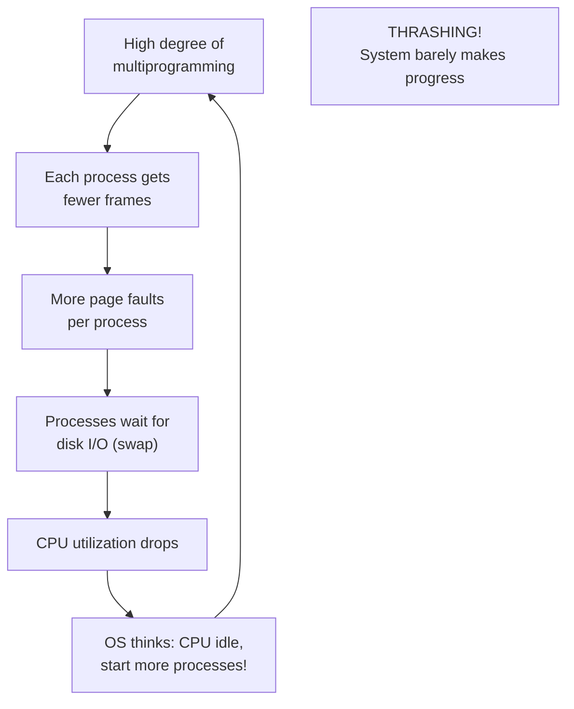

# Thrashing

## Overview

**Thrashing** occurs when a system spends more time **handling page faults** than executing actual instructions. The CPU utilization drops dramatically as processes constantly swap pages in and out of memory, creating a vicious cycle where the system is busy but accomplishes nothing useful.

Thrashing is one of the most severe performance pathologies in virtual memory systems. Understanding its causes, detection, and prevention is essential for systems programming and interviews.

---

## What is Thrashing?

### The Vicious Cycle



### Visual Representation

```
CPU Utilization
    ▲
100%│          ╱╲
    │         ╱  ╲
    │        ╱    ╲
    │       ╱      ╲
 50%│      ╱        ╲
    │     ╱          ╲
    │    ╱            ╲  ← Thrashing begins
    │   ╱              ╲
  0%│──╱────────────────╲──────────▶ Degree of Multiprogramming
    │  Optimal           Overloaded
```

### Timeline Example

```
Without thrashing:
Time: ──────────────────────────────────────────
CPU:  [████████][████████][████████][████████]
Disk: [        ][        ][        ][        ]
→ CPU busy, disk idle. Good.

With thrashing:
Time: ──────────────────────────────────────────
CPU:  [█][█][█][█][█][█][█][█][█][█][█][█][█]
Disk: [█][█][█][█][█][█][█][█][█][█][█][█][█]
→ CPU and disk constantly busy with page faults.
   No useful work gets done.
```

---

## Causes of Thrashing

### 1. Too Many Processes (Insufficient Memory)

When the combined working sets of all processes exceed available memory:

```
Available frames: 100

Process A working set: 30 frames
Process B working set: 25 frames
Process C working set: 20 frames
Process D working set: 15 frames
Process E working set: 30 frames
Total needed: 120 frames > 100 available

→ Processes steal frames from each other
→ Constant page faults
→ Thrashing!
```

### 2. Poor Page Replacement Algorithm

Some algorithms are more susceptible to thrashing:

```
FIFO with Belady's anomaly:
- Adding frames can sometimes INCREASE page faults
- This can trigger thrashing even with more memory

LFU with cache pollution:
- Old, no-longer-used pages accumulate high counts
- They stay in memory, starving active pages
- Active pages thrash
```

### 3. Working Set Larger Than Allocated Frames

```
Process needs pages {1, 2, 3, 4, 5} (working set = 5)
Process has only 3 frames allocated

Access pattern: 1, 2, 3, 4, 5, 1, 2, 3, 4, 5, ...
Every access is a page fault! (100% fault rate)
```

### 4. Sequential Scanning (Baptist Flooding)

```
A process scans through a large array (larger than its frames):

for i in range(large_array):
    process(array[i])

If the array doesn't fit in allocated frames:
- Every access evicts a page that will be needed later
- 100% page fault rate
- Other processes get their frames stolen
→ System-wide thrashing
```

---

## Detecting Thrashing

### Method 1: CPU Utilization vs. Page Fault Rate

```bash
# Monitor CPU and page faults
vmstat 1
# Look at:
# - us (user CPU) + sy (system CPU) — should be high normally
# - si (swap in) + so (swap out) — should be near zero normally
# - If CPU is low but si/so is high → thrashing!

# Example output during thrashing:
# procs  ---swap-- -----io---- -system-- ------cpu-----
#  r  b  si   so   bi   bo   in   cs  us sy id wa st
#  2  8  500  600  800  900  1500 2000  5 10 10 75  0
#                                              ^^
#                            High wait (wa) = disk I/O bottleneck
```

### Method 2: Page Fault Frequency (PFF)

```
Monitor page fault rate per process:

If faults/time > upper_threshold:
    → Process needs more frames (thrashing risk)

If faults/time < lower_threshold:
    → Process has too many frames (can donate)

Algorithm:
    measure fault_rate for each process
    for each process:
        if fault_rate > UPPER_THRESHOLD:
            allocate more frames
        elif fault_rate < LOWER_THRESHOLD:
            take frames away
```

### Method 3: Working Set Size Monitoring

```bash
# Check process memory usage
ps aux --sort=-%mem | head -10

# Check swap usage
free -h
# If swap is heavily used and CPU is idle → possible thrashing

# Detailed memory info
cat /proc/meminfo | grep -E "MemTotal|MemFree|MemAvailable|SwapTotal|SwapFree|Cached"

# Per-process swap usage
for pid in /proc/[0-9]*/; do
    name=$(cat $pid/comm 2>/dev/null)
    swap=$(awk '/VmSwap/{print $2}' $pid/status 2>/dev/null)
    [ -n "$swap" ] && [ "$swap" -gt 0 ] && echo "$name: ${swap} kB swap"
done | sort -t: -k2 -n -r | head -10
```

### Method 4: Disk I/O Monitoring

```bash
# High disk I/O + low CPU = potential thrashing
iostat -x 1
# Look at:
# - %util: should not be 100% constantly
# - await: average wait time (high = thrashing)
# - r/s, w/s: read/write per second

# If disk is 100% utilized with swap I/O:
# → System is thrashing
```

---

## Preventing Thrashing

### 1. Working Set Model (Denning's Approach)

Allocate enough frames to each process to hold its **working set**:

```
For each process:
    Track the working set W(t, Δ) = pages referenced in last Δ references
    Allocate |W(t, Δ)| frames to the process

If total working sets > available frames:
    Suspend some processes (reduce multiprogramming)
```

See: [Working Set Model](./working-set.md)

### 2. Page Fault Frequency (PFF) Control

```python
def pff_control():
    UPPER_THRESHOLD = 10  # faults per second
    LOWER_THRESHOLD = 2   # faults per second

    for process in processes:
        fault_rate = measure_fault_rate(process, interval=1)

        if fault_rate > UPPER_THRESHOLD:
            # Process is thrashing — give more frames
            allocate_more_frames(process)
        elif fault_rate < LOWER_THRESHOLD:
            # Process has excess frames — take some away
            take_frames(process)
```

### 3. Limit Multiprogramming

```
Instead of running 100 processes with 1 frame each:
Run 20 processes with 5 frames each

Total frames used: same
But each process has enough frames for its working set
→ No thrashing
```

### 4. Swap to SSD

```
If swapping is unavoidable:
- SSD swap: ~100μs per fault
- HDD swap: ~10ms per fault

SSD makes thrashing less catastrophic (100× faster)
Still bad, but not as devastating
```

### 5. Memory Compression (zswap/zram)

```
Instead of swapping to disk:
- Compress pages in RAM (zswap/zram)
- Compression/decompression: ~10μs
- Much faster than disk swap

See: Memory Compression
```

---

## Mathematical Model

### Degree of Multiprogramming vs. CPU Utilization

```
Let n = number of concurrent processes
Let L = average page fault time (disk access)
Let s = average service time between faults (CPU time)

If n * L < s:
    → CPU is busy most of the time
    → Good utilization

If n * L > s:
    → Processes spend more time waiting for pages than computing
    → CPU utilization drops
    → Thrashing begins

Optimal n = s / L

Example:
    s = 10ms (time between faults)
    L = 10ms (disk access time)
    Optimal n = 10/10 = 1 process

    With 1 process: CPU utilization ≈ 50%
    With 2 processes: CPU utilization ≈ 33%
    With 10 processes: CPU utilization ≈ 9% (thrashing!)
```

### CPU Utilization Formula

```
U(n) = n * s / (n * s + L)  (simplified)

Where:
    U = CPU utilization
    n = number of processes
    s = service time (CPU between faults)
    L = fault time (I/O)

As n increases, U initially increases (more work done)
But after a point, U decreases (more time waiting for I/O)
```

---

## Linux-Specific Thrashing Prevention

### OOM Killer (Out of Memory Killer)

When thrashing becomes severe, Linux's OOM killer activates:

```bash
# View OOM killer activity
dmesg | grep -i "oom\|out of memory"

# Check OOM scores
cat /proc/<pid>/oom_score
cat /proc/<pid>/oom_score_adj  # Adjustment (-1000 to 1000)

# Make a process immune to OOM (use with caution!)
echo -1000 | sudo tee /proc/<pid>/oom_score_adj

# Example OOM message:
# [12345.678] Out of memory: Killed process 1234 (chrome)
#   total-vm:4096000kB, anon-rss:2048000kB, file-rss:0kB
#   oom_score_adj: 0
```

### swappiness

Controls the kernel's preference for swapping vs. reclaiming file cache:

```bash
# Check current swappiness
cat /proc/sys/vm/swappiness
# Default: 60

# Lower = prefer keeping anonymous pages in RAM
# Higher = prefer swapping to free memory
# 0 = almost never swap (may cause OOM more easily)
# 100 = aggressively swap

# For databases (avoid swap latency):
echo 10 | sudo tee /proc/sys/vm/swappiness

# Make persistent:
echo "vm.swappiness = 10" | sudo tee -a /etc/sysctl.conf
```

### Memory Limits (cgroups)

```bash
# Limit memory for a process group
# Using cgroups v2:
sudo mkdir /sys/fs/cgroup/mygroup
echo 512M | sudo tee /sys/fs/cgroup/mygroup/memory.max
echo <pid> | sudo tee /sys/fs/cgroup/mygroup/cgroup.procs

# This prevents one process group from consuming all memory
# and causing system-wide thrashing
```

### Memory Overcommit Control

```bash
# Control memory overcommit behavior
cat /proc/sys/vm/overcommit_memory
# 0 = heuristic (default, may overcommit)
# 1 = always overcommit (dangerous)
# 2 = never overcommit beyond swap + RAM*overcommit_ratio

echo 2 | sudo tee /proc/sys/vm/overcommit_memory
echo 80 | sudo tee /proc/sys/vm/overcommit_ratio
# Only commit up to swap + 80% of RAM
```

---

## Interview Questions

### Q1: What is thrashing?
**A:** Thrashing occurs when a system spends most of its time handling page faults instead of executing useful work. It happens when processes don't have enough frames to hold their working sets, causing constant page faults. The CPU sits idle waiting for disk I/O, and if the OS starts more processes (thinking the CPU is idle), the situation worsens in a vicious cycle.

### Q2: How do you detect thrashing?
**A:** Monitor:
1. **CPU utilization** — low despite high demand
2. **Page fault rate** — very high (both minor and major)
3. **Swap I/O** — high `si`/`so` in `vmstat`
4. **Disk utilization** — 100% with swap I/O
5. **Process wait time** — high `wa` in CPU stats

If CPU is low but disk is saturated with swap I/O, the system is thrashing.

### Q3: How do you prevent thrashing?
**A:** Several strategies:
1. **Working set model**: Allocate enough frames for each process's working set
2. **PFF (Page Fault Frequency)**: Monitor fault rates and adjust frame allocation
3. **Limit multiprogramming**: Don't start more processes than memory can support
4. **Use faster swap**: SSD instead of HDD
5. **Memory compression**: zswap/zram to avoid disk swap
6. **OOM killer**: As a last resort, kill memory-hogging processes

### Q4: What is the relationship between multiprogramming and thrashing?
**A:** Higher multiprogramming means more processes sharing memory. Each process gets fewer frames. If the total working sets exceed available memory, all processes start thrashing. There's an optimal degree of multiprogramming — beyond it, adding more processes reduces overall throughput.

### Q5: How does the OOM killer decide which process to kill?
**A:** The OOM killer assigns each process an **oom_score** based on its memory usage, runtime, and other factors. Processes with higher scores (using more memory, running less time) are killed first. The `oom_score_adj` file allows administrators to adjust scores (-1000 to +1000). Root processes and those with `oom_score_adj = -1000` are protected.

---

## Common Mistakes

1. **Confusing high memory usage with thrashing**: A system can use 99% RAM without thrashing if processes have enough frames. Thrashing is about page fault rate, not memory usage.
2. **Thinking more swap prevents thrashing**: Swap space doesn't prevent thrashing — it just provides more space for swapping. More swap can actually make thrashing worse by allowing more processes to run.
3. **Not monitoring the right metrics**: CPU utilization alone doesn't indicate thrashing. You need to correlate CPU usage with page fault rate and disk I/O.
4. **Assuming thrashing only happens with low RAM**: Thrashing can happen on systems with lots of RAM if the workload exceeds memory (e.g., many large processes, memory leaks).
5. **Forgetting about the OOM killer**: In Linux, the OOM killer is the last line of defense against thrashing. Understanding how it works is important for production systems.

---

## Summary

Thrashing is the catastrophic collapse of system performance when processes compete for too few memory frames. It's characterized by high page fault rates, low CPU utilization, and excessive disk I/O.

**Key points for interviews:**
- Thrashing = constant page faults, CPU idle despite work to do
- Caused by insufficient frames per process (working set > allocated frames)
- Detected via: low CPU + high swap I/O + high page fault rate
- Prevented by: working set model, PFF, limiting multiprogramming
- Linux defense: OOM killer, swappiness tuning, cgroups memory limits
- Mathematical insight: optimal degree of multiprogramming = service_time / fault_time


## Cross References

- [Working Set](working-set.md)
- [Demand Paging](demand-paging.md)
- [Page Replacement](page-replacement.md)
- [CPU Scheduling](../scheduling/README.md)
