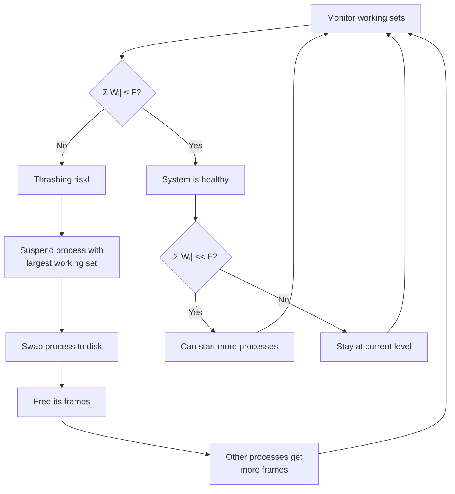
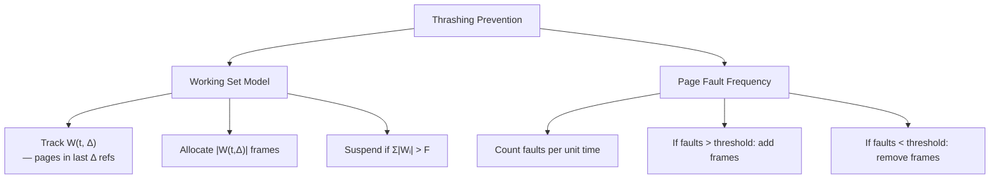

# Working Set Model

## Overview

The **Working Set Model**, proposed by **Peter J. Denning** in 1968, is a memory management concept that defines the set of pages a process is actively using during a specific time window. It provides a theoretical foundation for understanding and preventing **thrashing** by ensuring each process has enough frames to hold its working set.

The working set model is based on the **locality principle** — programs tend to access a relatively small set of pages intensively during any given time period, and this set changes slowly over time.

---

## The Locality Principle

### What is Locality?

Programs don't access memory uniformly. They exhibit **locality**:

```
┌─────────────────────────────────────────────┐
│            Program Execution                │
│                                             │
│  Phase 1:           Phase 2:                │
│  ┌──────────┐       ┌──────────┐            │
│  │ Locality  │       │ Locality  │           │
│  │ {A, B, C} │──────▶│ {D, E, F} │          │
│  └──────────┘       └──────────┘            │
│       │                    │                 │
│       │    Phase 3:        │                 │
│       │    ┌──────────┐    │                 │
│       └───▶│ Locality  │◀──┘                │
│            │ {A, B, C} │                     │
│            └──────────┘                     │
└─────────────────────────────────────────────┘
```

### Types of Locality

1. **Temporal locality**: If a page is accessed now, it's likely to be accessed again soon (e.g., loops, frequently called functions)
2. **Spatial locality**: If a page is accessed, nearby pages are likely to be accessed soon (e.g., sequential array access)
3. **Sequential locality**: Instructions are executed in sequence (special case of spatial locality)

---

## Denning's Working Set Model

### Definition

The **working set** at time *t* with window size *Δ* is defined as:

```
W(t, Δ) = {pages referenced in the interval (t - Δ, t]}
```

That is, the set of **distinct pages** referenced in the most recent *Δ* memory references.

### Parameters

| Parameter | Meaning | Typical Value |
|---|---|---|
| **t** | Current time (or reference number) | — |
| **Δ** | Working set window size (in references) | 10,000 – 100,000 |
| **W(t, Δ)** | Working set at time t | Set of page numbers |
| **\|W(t, Δ)\|** | Working set size | Number of distinct pages |

### Key Properties

1. **W(t, Δ) ⊆ W(t, Δ+1)**: Larger window includes more pages
2. **|W(t, Δ)| ≤ Δ**: Can't have more distinct pages than references
3. **Changes slowly**: The working set evolves gradually as the program progresses
4. **Locality-dependent**: During a locality phase, the working set is stable

---

## Detailed Example

**Reference string:** `1, 2, 3, 4, 1, 2, 5, 1, 2, 3, 4, 5`
**Window size Δ = 4**

| t | Reference | Window (last 4 refs) | W(t, 4) | \|W(t, 4)\| |
|---|-----------|---------------------|---------|-------------|
| 1 | 1 | {1} | {1} | 1 |
| 2 | 2 | {1, 2} | {1, 2} | 2 |
| 3 | 3 | {1, 2, 3} | {1, 2, 3} | 3 |
| 4 | 4 | {1, 2, 3, 4} | {1, 2, 3, 4} | 4 |
| 5 | 1 | {2, 3, 4, 1} | {1, 2, 3, 4} | 4 |
| 6 | 2 | {3, 4, 1, 2} | {1, 2, 3, 4} | 4 |
| 7 | 5 | {4, 1, 2, 5} | {1, 2, 4, 5} | 4 |
| 8 | 1 | {1, 2, 5, 1} | {1, 2, 5} | 3 |
| 9 | 2 | {2, 5, 1, 2} | {1, 2, 5} | 3 |
| 10 | 3 | {5, 1, 2, 3} | {1, 2, 3, 5} | 4 |
| 11 | 4 | {1, 2, 3, 4} | {1, 2, 3, 4} | 4 |
| 12 | 5 | {2, 3, 4, 5} | {2, 3, 4, 5} | 4 |

### Working Set Size Over Time

```
|W(t,4)|
    5 │
    4 │    █ █ █ █ █     █ █ █
    3 │  █ █       █ █ █       █
    2 │ █           █
    1 │█
    0 └──────────────────────────────▶ t
      1 2 3 4 5 6 7 8 9 10 11 12
```

---

## Working Set and Thrashing Prevention

### Denning's Principle

> **If the sum of working set sizes exceeds available memory, the system will thrash.**

```
Total available frames: F = 100

Process 1: |W₁| = 30 frames
Process 2: |W₂| = 25 frames
Process 3: |W₃| = 20 frames
Process 4: |W₄| = 15 frames
Process 5: |W₅| = 30 frames
Total:     120 frames

120 > 100 → THRASHING INEVITABLE

Solution: Suspend some processes until
total working set ≤ available memory
```

### Working Set Policy

```
For each process i:
    Allocate exactly |Wᵢ(t, Δ)| frames

If Σ|Wᵢ(t, Δ)| > F (total frames):
    → Suspend one or more processes
    → Reduce degree of multiprogramming

If Σ|Wᵢ(t, Δ)| < F:
    → System can support more processes
    → Increase multiprogramming
```

### The Swapping Decision



---

## Working Set Implementation

### Exact Implementation (Expensive)

```python
class WorkingSetExact:
    """Exact working set tracking — O(Δ) per reference."""
    def __init__(self, delta):
        self.delta = delta
        self.history = []  # List of (time, page) references

    def reference(self, page):
        self.history.append(page)
        # Keep only last Δ references
        if len(self.history) > self.delta:
            self.history.pop(0)

    def get_working_set(self):
        return set(self.history)

    def get_working_set_size(self):
        return len(self.get_working_set())
```

**Problem:** Maintaining a history of Δ references is expensive (Δ can be 10,000+).

### Approximate Implementation (Using Reference Bits)

```python
class WorkingSetApprox:
    """Approximate working set using reference bits (like Clock)."""
    def __init__(self, num_frames, delta_ticks):
        self.frames = [None] * num_frames
        self.ref_bits = [0] * num_frames
        self.last_use = [0] * num_frames  # Time of last reference
        self.current_time = 0
        self.delta = delta_ticks

    def reference(self, page):
        self.current_time += 1
        if page in self.frames:
            idx = self.frames.index(page)
            self.ref_bits[idx] = 1
            self.last_use[idx] = self.current_time
        else:
            # Page fault — need to load
            self._handle_fault(page)

    def _handle_fault(self, page):
        # Find page not used in last Δ time units
        for i in range(len(self.frames)):
            if self.frames[i] is not None:
                if self.current_time - self.last_use[i] > self.delta:
                    # This page is outside working set — evict
                    self.frames[i] = page
                    self.ref_bits[i] = 1
                    self.last_use[i] = self.current_time
                    return

        # All pages are in working set — must evict LRU
        lru_idx = min(range(len(self.frames)),
                       key=lambda i: self.last_use[i])
        self.frames[lru_idx] = page
        self.ref_bits[lru_idx] = 1
        self.last_use[lru_idx] = self.current_time

    def get_working_set_size(self):
        return sum(1 for i in range(len(self.frames))
                   if self.frames[i] is not None
                   and self.current_time - self.last_use[i] <= self.delta)
```

### Linux-Style: Two-List Approach

```python
class TwoListWorkingSet:
    """Linux-style two-list working set approximation."""
    def __init__(self, num_frames):
        self.active_list = []   # Hot pages (in working set)
        self.inactive_list = [] # Cold pages (candidates for eviction)
        self.num_frames = num_frames

    def reference(self, page):
        # Check active list
        if page in self.active_list:
            return  # Hit — already in working set

        # Check inactive list
        if page in self.inactive_list:
            # Promote to active (it's being used again)
            self.inactive_list.remove(page)
            self.active_list.insert(0, page)
            self._trim_active()
            return

        # Page fault
        if len(self.active_list) + len(self.inactive_list) >= self.num_frames:
            # Evict from inactive list tail
            if self.inactive_list:
                self.inactive_list.pop()
            else:
                # All pages are active — demote oldest
                self.active_list.pop()

        self.active_list.insert(0, page)
        self._trim_active()

    def _trim_active(self):
        # Move excess active pages to inactive
        while len(self.active_list) > self.num_frames * 0.75:
            page = self.active_list.pop()
            self.inactive_list.insert(0, page)

    def working_set_size(self):
        return len(self.active_list)
```

---

## Working Set vs. Page Fault Frequency (PFF)

### Comparison



| Aspect | Working Set | PFF |
|---|---|---|
| What it tracks | Pages in window Δ | Fault rate per time |
| Frame allocation | Exact: \|W(t, Δ)\| | Dynamic: adjust based on rate |
| Implementation | Expensive (track history) | Cheaper (count faults) |
| Theoretical basis | Denning's model | Empirical thresholds |
| Suspends processes? | Yes (if Σ\|Wᵢ\| > F) | Not directly |
| Used in practice? | Conceptual (Linux approximates) | More practical |

### PFF Algorithm

```python
def pff(processes, available_frames, interval=1000):
    """Page Fault Frequency control."""
    UPPER = 10   # faults per interval — too many, need more frames
    LOWER = 2    # faults per interval — too few, can give frames

    for proc in processes:
        faults = count_faults(proc, interval)
        fault_rate = faults / interval

        if fault_rate > UPPER:
            # Process needs more frames
            if available_frames > 0:
                proc.frames += 1
                available_frames -= 1
        elif fault_rate < LOWER:
            # Process can spare frames
            proc.frames -= 1
            available_frames += 1
```

---

## Working Set Size Estimation in Linux

### Using /proc

```bash
# Check process memory usage (approximate working set)
cat /proc/<pid>/status | grep -E "VmRSS|VmSize|RssAnon|RssFile"
# VmRSS = Resident Set Size (actual physical memory used)
# This approximates the working set size

# More detailed
cat /proc/<pid>/smaps_rollup
# Rss: total resident memory
# Pss: proportional share (accounts for sharing)
# Anonymous: non-file-backed pages
# Swap: swapped-out pages

# Track working set changes over time
while true; do
    rss=$(awk '/VmRSS/{print $2}' /proc/<pid>/status)
    echo "$(date +%H:%M:%S) RSS: ${rss} kB"
    sleep 5
done
```

### Using ps

```bash
# Working set approximation
ps -eo pid,rss,comm --sort=-rss | head -20

# RSS (Resident Set Size) ≈ working set size
# Note: RSS includes shared pages, so it overestimates
# Use PSS (Proportional Set Size) for accuracy
smem -tk -s rss | head -20
```

### Using perf

```bash
# Measure cache misses (related to working set size)
perf stat -e cache-misses,cache-references -p <pid> sleep 10

# High cache miss rate → working set exceeds cache
# High page fault rate → working set exceeds allocated frames
```

---

## Choosing Window Size Δ

### Impact of Δ

```
Small Δ (e.g., 10):
├── Quick adaptation to changing localities
├── More sensitive to temporary fluctuations
├── May not capture full working set
└── Higher fault rate

Large Δ (e.g., 100,000):
├── Smooth, stable working set
├── Slow to adapt to new localities
├── May include pages no longer needed
└── Wastes memory on stale pages
```

### Rule of Thumb

```
Δ should be large enough to capture one full locality phase
but small enough to track changes between phases.

Typical values:
- Interactive programs: Δ ≈ 10,000 - 50,000
- Batch programs: Δ ≈ 50,000 - 200,000
- Real-time: Δ ≈ 1,000 - 10,000

In practice, Δ is tuned experimentally.
```

---

## Working Set in Real Systems

### Windows

Windows explicitly implements working set management:

```
Each process has:
- Working Set Trim Limit (minimum pages)
- Working Set Maximum (maximum pages)

On memory pressure:
1. OS trims working sets of processes exceeding their max
2. Pages removed from working set become "standby" or "modified"
3. Standby pages can be reclaimed without I/O
4. Modified pages must be written to pagefile first
```

```bash
# Windows (PowerShell)
Get-Process | Sort-Object WorkingSet64 -Descending |
    Select-Object -First 10 Name, WorkingSet64

# Set working set limits (Windows API)
# SetProcessWorkingSetSize(hProcess, minSize, maxSize)
```

### Linux

Linux doesn't implement the exact working set model, but uses related concepts:

```
- Active/Inactive lists approximate working set tracking
- Access bits in PTEs track recent usage
- swappiness controls swap aggressiveness
- cgroups can limit memory per process group
- OOM killer handles extreme cases
```

---

## Interview Questions

### Q1: What is the working set model?
**A:** Proposed by Peter Denning, the working set W(t, Δ) is the set of distinct pages a process has referenced in the last Δ memory references. It captures the process's current memory needs based on the locality principle. If each process is allocated frames equal to its working set size, thrashing is prevented.

### Q2: What is the locality principle?
**A:** Programs don't access memory uniformly. They exhibit **temporal locality** (recently accessed pages are likely to be accessed again) and **spatial locality** (nearby pages are likely to be accessed). The working set changes slowly as the program moves between locality phases.

### Q3: How does the working set model prevent thrashing?
**A:** By ensuring Σ|Wᵢ(t, Δ)| ≤ F (total frames). If the sum of working set sizes exceeds available memory, the system suspends processes until the constraint is met. This guarantees each active process has enough frames to avoid excessive page faults.

### Q4: What is the difference between the working set model and PFF?
**A:** The working set model tracks **which pages** are in the working set (set of pages in window Δ). PFF tracks **how often** page faults occur (fault rate per time). Working set is more theoretically grounded but harder to implement; PFF is more practical but uses empirical thresholds.

### Q5: How do you estimate working set size in practice?
**A:** In Linux, use RSS (Resident Set Size) from `/proc/<pid>/status` as an approximation. For more accuracy, use PSS (Proportional Set Size) from `/proc/<pid>/smaps`. Track these over time to see how the working set evolves. Cache miss rates from `perf` can also indicate if the working set exceeds cache size.

### Q6: What happens if Δ is too small or too large?
**A:** If Δ is too small, the working set doesn't fully capture the current locality phase, leading to more page faults. If Δ is too large, the working set includes pages from previous locality phases that are no longer needed, wasting memory. The ideal Δ captures one full locality phase.

---

## Common Mistakes

1. **Confusing working set with RSS**: RSS includes all resident pages (shared, file-backed, etc.). The working set is specifically the set of actively-referenced pages. RSS overestimates the working set.
2. **Assuming the working set is static**: The working set changes as the program progresses through different phases (localities). It must be tracked dynamically.
3. **Not understanding the relationship to thrashing**: The key insight is: if Σ|Wᵢ| > F, thrashing is inevitable. This is Denning's fundamental contribution.
4. **Thinking the exact implementation is practical**: Tracking the exact working set (maintaining Δ references) is expensive. Real systems use approximations (reference bits, active/inactive lists).
5. **Forgetting about spatial locality**: The working set model focuses on pages, but spatial locality means adjacent pages in the same frame are likely accessed together, affecting the effective working set size.

---

## Summary

The Working Set Model is a foundational concept in virtual memory management. It defines how much memory a process needs to operate without thrashing, based on the locality principle.

**Key points for interviews:**
- W(t, Δ) = set of pages referenced in last Δ references
- Denning's principle: Σ|Wᵢ| > F → thrashing is inevitable
- Working set changes slowly (locality principle)
- Exact implementation is expensive; real systems use approximations
- Related to PFF (Page Fault Frequency) as an alternative approach
- Linux approximates with active/inactive lists + access bits
- Window size Δ must be tuned: too small → misses locality; too large → includes stale pages

**Key formulas:**
- W(t, Δ) = {pages referenced in (t-Δ, t]}
- |W(t, Δ)| ≤ Δ (working set size ≤ window size)
- W(t, Δ) ⊆ W(t, Δ+1) (larger window ⊇ smaller window)
- Thrashing condition: Σᵢ|Wᵢ(t, Δ)| > F (total frames)


## Cross References

- [Thrashing](thrashing.md)
- [Demand Paging](demand-paging.md)
- [Page Replacement](page-replacement.md)
- [Cache Performance](../../arch/memory-hierarchy/performance.md)
