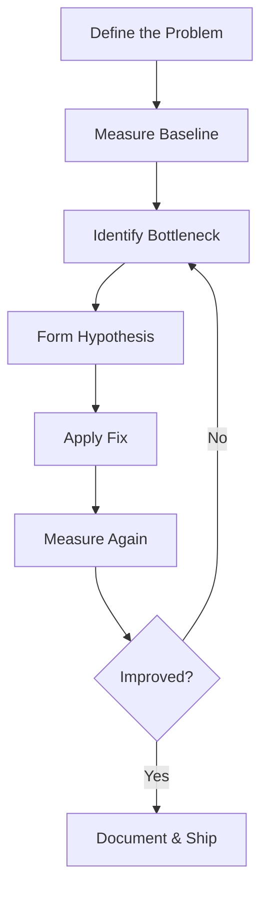

# Performance Engineering

Performance engineering is the discipline of designing, building, measuring, and optimizing software systems to meet specific performance requirements. It sits at the intersection of systems engineering, applied mathematics, and practical software development—and it is one of the most interview-relevant skills for backend, infrastructure, and SRE roles.

## Why It Matters

- **Production impact**: A 100ms increase in page load time can reduce conversion rates by 7% (Google). Performance directly affects revenue, user retention, and infrastructure cost.
- **Interview relevance**: System design interviews frequently ask you to estimate latency, reason about throughput, and discuss how you would diagnose slow services.
- **Cost optimization**: A 2× throughput improvement at constant latency halves your infrastructure bill.

## Core Dimensions

| Dimension | Definition | Typical Unit | Example Target |
|-----------|-----------|-------------|----------------|
| **Latency** | Time to complete a single operation | ms, μs | p99 < 200ms |
| **Throughput** | Operations completed per unit time | req/s, MB/s | 10,000 QPS |
| **Resource Utilization** | Fraction of available capacity in use | % | CPU < 70% |
| **Availability** | Fraction of time the system serves requests | % (nines) | 99.99% |
| **Efficiency** | Work done per unit of resource | req/CPU-sec | Cost per request |

These dimensions trade off against each other. Pushing throughput higher often increases tail latency. Maximizing utilization reduces headroom for spikes.

## Percentiles: Why Averages Lie

Averages hide tail behavior. Consider a service where 99 requests complete in 10ms and 1 request takes 10,000ms:

- **Mean**: 109.9ms — looks fine
- **p50 (median)**: 10ms — half the requests are fast
- **p99**: 10,000ms — 1% of users see catastrophic latency
- **p99.9**: 10,000ms — 0.1% still affected

| Percentile | Name | Meaning |
|-----------|------|---------|
| p50 | Median | 50% of requests are faster than this |
| p90 | 90th | 10% of requests are slower than this |
| p95 | 95th | Common SLO target | 
| p99 | 99th | Critical for user experience |
| p99.9 | Three-nines | Infrastructure-level SLA target |

Google's SRE team famously tracks **p99 latency at the 99th percentile of 5-minute windows** (not per-request) to catch sustained degradation.

## Systematic Approach to Performance Problems

1. **Define**: What exactly is slow? Use specific SLOs ("p99 > 500ms"), not vague complaints.
2. **Measure**: Establish a reproducible baseline with proper tooling (see [benchmarking](benchmarking.md)).
3. **Identify**: Use the **USE Method** (Utilization, Saturation, Errors) per resource, or **RED Method** (Rate, Errors, Duration) per service.
4. **Hypothesize**: Generate a ranked list of likely causes. Profile, don't guess.
5. **Fix & Verify**: Make one change at a time. Re-measure to confirm.

## Topics in This Section

| Topic | Description |
|-------|-------------|
| [CPU Profiling](cpu-profiling.md) | Flame graphs, perf, language-specific tools |
| [Memory Profiling](memory-profiling.md) | Leak detection, GC tuning, cache analysis |
| [Benchmarking](benchmarking.md) | Microbenchmarks, load testing, statistical rigor |
| [Optimization Techniques](optimization-techniques.md) | Amdahl's Law, caching, batching, concurrency |
| [Latency Analysis](latency-analysis.md) | Tail latency, budgets, histograms, coordinated omission |

## References

- Beyer, B., et al. *Site Reliability Engineering* (Google SRE Book). O'Reilly, 2016. [sre.google/sre-book](https://sre.google/sre-book/table-of-contents/)
- Gregg, B. *Systems Performance: Enterprise and the Cloud*, 2nd Ed. Addison-Wesley, 2020. [brendangregg.com/systems-performance-2nd-edition](https://www.brendangregg.com/systems-performance-2nd-edition.html)
- Gregg, B. "The USE Method." [brendangregg.com/usemethod.html](https://www.brendangregg.com/usemethod.html)
- Google "Latency Tip #7: Percentiles Are Not Enough." [research.google/pubs/pub40755](https://research.google/pubs/pub40755/)

## Interview Questions

1. **What's the difference between latency and throughput? Can you have high throughput and high latency?**
2. **Why is p99 more important than mean latency for user-facing systems?**
3. **How would you diagnose a sudden latency spike in a microservice?**
4. **What is the USE Method, and when would you apply it?**
5. **Explain how a 1% regression in p99 could be more concerning than a 10% regression in mean latency.**
6. **How do you set an SLO? What factors determine whether you target p95 or p99?**
7. **What tools would you use to profile a CPU-bound Go service in production?**
