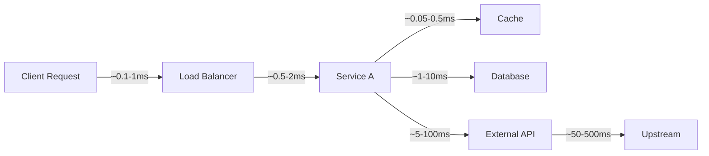

# Latency Analysis

Latency — the time from request to response — is the user-visible face of performance. A system can have excellent throughput and still deliver a terrible experience if its tail latency is high.

## Why Tail Latency Matters

Consider a web page that makes 30 parallel API calls to render. If each call has p99 = 500ms:

- Probability that **all 30** calls finish within 500ms: (0.99)^30 = **74%**
- That means **26% of page loads** are slower than 500ms, even though each individual API is p99 < 500ms

This is the **fan-out amplification** problem. With N parallel requests, your effective tail latency is dramatically worse than any individual service's tail.

```
Individual service p99 = 500ms
Fan-out factor N = 30

Effective p99 of the composed request:
  P(all requests ≤ t) = P(single ≤ t)^N
  0.99 = P(single ≤ t)^30
  P(single ≤ t) = 0.99^(1/30) = 0.99966
  
  → You need individual p99.966 (~370ms) to get composed p99 of 500ms
```

**Lesson**: Services that are called with high fan-out need **much stricter** SLOs than the user-facing SLO.

## Sources of Latency



| Source | Typical Range | Variance | Notes |
|--------|--------------|----------|-------|
| **CPU computation** | 1µs - 10ms | Low | Predictable, profileable |
| **L1/L2 cache miss** | 4-10ns | Low | Invisible in profiles, shows up as low IPC |
| **Memory allocation** | 100ns - 10µs | Medium | GC pauses can spike to ms |
| **Disk I/O (SSD)** | 50µs - 1ms | Medium | Queueing at the device adds variance |
| **Disk I/O (HDD)** | 5-20ms | High | Seek time dominates, highly variable |
| **Network (same datacenter)** | 0.1-1ms | Low | Mostly switch latency |
| **Network (cross-region)** | 30-200ms | High | Congestion, routing, TCP slow start |
| **TCP TLS handshake** | 1-3ms | Low | Amortized with connection pooling |
| **GC pause** | 0.1-100ms | Very high | Especially stop-the-world collectors |
| **Lock contention** | 0-∞ms | Very high | Unbounded wait under contention |
| **CPU queueing** | Proportional to utilization | High | Grows superlinearly near saturation |

## Latency Budgeting

A latency budget assigns a maximum time to each component in a request path. The sum of all budgets must fit within the overall SLO.

| Component | Budget | Actual (p99) | Status |
|-----------|--------|-------------|--------|
| Gateway + auth | 5ms | 3ms | ✅ |
| Service logic | 20ms | 18ms | ✅ |
| Database query | 30ms | 45ms | ❌ Over budget |
| Cache lookup | 2ms | 1ms | ✅ |
| Serialization | 3ms | 2ms | ✅ |
| **Total** | **60ms** | **69ms** | ❌ |

**Process**: When a component exceeds its budget, it becomes the optimization target. This creates accountability and prevents "everyone's problem is no one's problem."

## Coordinated Omission

Coordinated omission is a subtle measurement error where a load generator **pauses sending new requests while it waits for a slow response**, hiding the true latency impact under load.

```
Normal measurement:
  Time:   |----1----|----2----|----3----|----4----|----5----|
  Req 1:  [send]===============  [recv] (slow)
  Req 2:                      [send]====[recv] (fast, measured normally)
  Req 3:                                    [send]====[recv] (fast)

What actually happened (with coordinated omission):
  The load generator SHOULD have sent req 2 and 3 during req 1's wait,
  but it didn't because it was waiting. So the slow response of req 1
  doesn't show up as added latency for reqs 2 and 3.

Without coordinated omission fix: p99 = 5ms (looks fine!)
With coordinated omission fix: p99 = 85ms (shows the real impact)
```

**Tools that handle this correctly**: `wrk2` (unlike `wrk`), `k6`, `ghz`.

## Histograms vs. Averages

### Why Averages Are Dangerous

```
Dataset: [1, 1, 1, 1, 1, 1, 1, 1, 1, 1000]

Mean:   100.9 ms  (misleading — 90% of requests are 1ms)
Median: 1 ms      (better, but hides the 1000ms outlier)
p99:    1000 ms   (shows the real worst case)
```

### HDR Histograms

[HDR Histogram](http://hdrhistogram.org/) is the standard for latency recording. It provides:
- **Fixed memory cost** regardless of data range (~10KB for typical latency ranges)
- **Pre-computed percentiles** — O(1) lookup for any percentile
- **High dynamic range** — records values from µs to hours with 1% accuracy

Used by: Cassandra, Metrics library (Java), Go's `prometheus` client.

```
# Example HDR Histogram output:
#       Value     Percentile  TotalCount  1/(1-Percentile)
#    1234.000 ms     50.000%       10000           2.00
#    2345.000 ms     90.000%       10000          10.00
#    3456.000 ms     99.000%       10000         100.00
#    5678.000 ms     99.900%       10000        1000.00
#    9999.000 ms    100.000%       10000
```

## References

- Dean, J. & Barroso, L.A. "The Tail at Scale." *CACM*, 2013. [research.google/pubs/pub40801](https://research.google/pubs/pub40801/)
-HDR Histogram: [hdrhistogram.org](http://hdrhistogram.org/)
- Gil Tene's "How NOT to Measure Latency" (QCon talk): critical explanation of coordinated omission
- Google SRE Book, Chapter 7: Handling Overload

## Interview Questions

1. **What is tail latency amplification? If you call 20 services in parallel and each has p99 of 200ms, what's the effective p99?**
2. **What is coordinated omission? How does it affect your load test results?**
3. **Why should you use histograms instead of averages for latency reporting?**
4. **How would you create a latency budget for a page that makes 15 API calls?**
5. **A service's p50 is 10ms and p99 is 5000ms. What does this distribution shape tell you about the bottleneck?**
6. **What is an HDR Histogram and why is it preferred over storing raw latency samples?**
7. **How does GC pause time affect tail latency? What strategies mitigate this?**
8. **Design a latency monitoring system for a microservices architecture with 50 services.**
