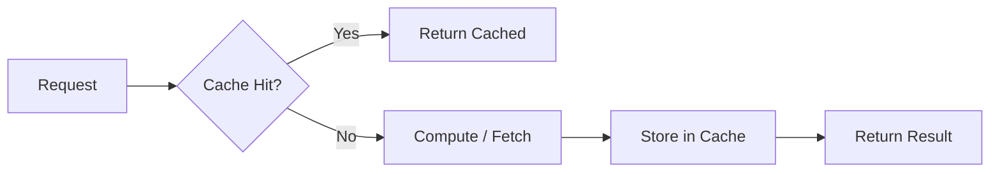
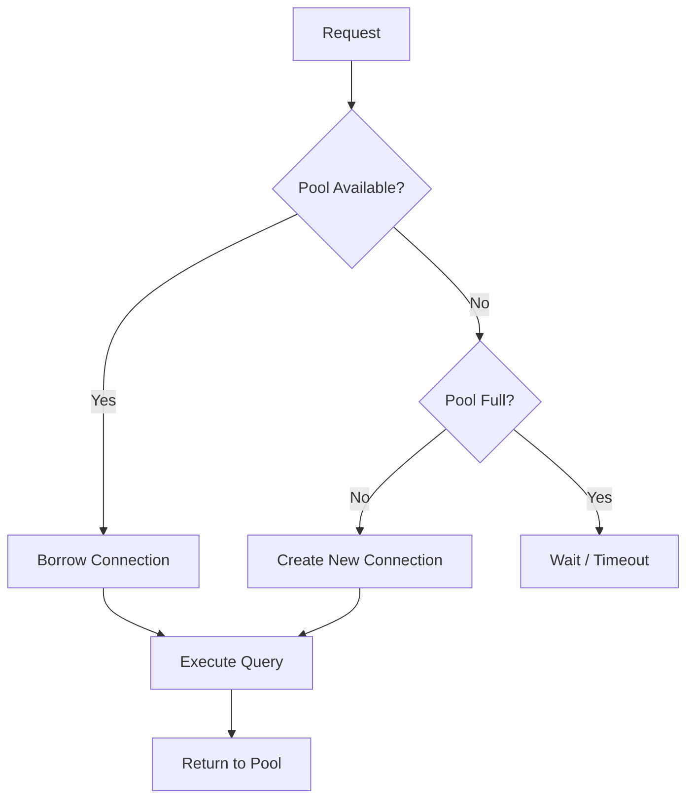

# Optimization Techniques

Performance optimization without measurement is just guessing. Always profile first, optimize the bottleneck, then measure again. This section covers the most impactful techniques that appear repeatedly in real systems and interviews.

## Amdahl's Law

Amdahl's Law quantifies the maximum speedup from improving one part of a system:

```
Speedup ≤ 1 / ((1 - P) + P / S)
```

Where:
- **P** = fraction of execution time that the improved part represents
- **S** = speedup of that part (e.g., 2× faster)
- **(1 - P)** = the unimproved, serialized fraction

### Worked Example

A web server spends 70% of time in JSON serialization (P = 0.7) and 30% in everything else. You make serialization 3× faster (S = 3):

```
Speedup = 1 / ((1 - 0.7) + 0.7 / 3)
         = 1 / (0.3 + 0.233)
         = 1 / 0.533
         = 1.88×
```

You made serialization 3× faster but the overall system is only **1.88× faster**. The 30% of time spent elsewhere is the bottleneck now.

**Implication**: As you optimize more, diminishing returns are inevitable. The serialized fraction eventually dominates. This is why **concurrency** (parallelizing the unimproved fraction) becomes critical.

## Little's Law

```
L = λ × W
```

- **L** = average number of items in the system
- **λ** (lambda) = average arrival rate
- **W** = average time an item spends in the system

This law holds for **any** stable queueing system. It's used everywhere: sizing thread pools, database connections, buffer capacities. See [Queueing Theory](../queueing-theory/README.md) for deeper treatment.

## Caching

Caching is the single most impactful optimization in distributed systems. The goal: avoid recomputation or refetching by serving from a faster, closer store.



### Cache Levels

| Level | Latency | Typical Size | Example |
|-------|---------|-------------|----------|
| **L1 Cache** | ~1ns | 32-64 KB | CPU register file, instruction cache |
| **L2 Cache** | ~4ns | 256 KB - 1 MB | Per-core cache |
| **L3 Cache** | ~10ns | 4-32 MB | Shared across cores |
| **Application Cache** | ~100µs | GBs | Redis, Memcached |
| **CDN** | ~1-50ms | TBs | CloudFront, Cloudflare |

### Cache Invalidation

> "There are only two hard things in Computer Science: cache invalidation and naming things." — Phil Karlton

| Strategy | When to Use | Tradeoff |
|----------|-----------|----------|
| **TTL** | Data changes infrequently, staleness tolerable | Simple but may serve stale data |
| **Write-through** | Strong consistency needed | Every write updates cache + store, slower writes |
| **Write-behind** | Write-heavy, can tolerate brief inconsistency | Writes batched to store, risk of data loss |
| **Cache-aside** | General purpose | Application manages cache explicitly |
| **Invalidation event** | Data changes are detectable | Requires pub/sub infrastructure |

## Batching and Vectorization

Processing items one at a time has per-item overhead (syscalls, network round trips, branch mispredictions). Batching amortizes this cost.

### When to Batch

| Scenario | Without Batch | With Batch |
|----------|--------------|------------|
| **Database inserts** | 1000 × INSERT = 1000 round trips | 1 × bulk INSERT = 1 round trip (10-100× faster) |
| **Network writes** | 1000 × `write()` = 1000 syscalls | 1 × `writev()` with iovec = 1 syscall |
| **GPU computation** | Scalar processing | SIMD: process 4-8 values per instruction (AVX2/NEON) |

### Vectorization Example (C)

```c
// Scalar: 1 multiply per iteration
for (int i = 0; i < n; i++) {
    c[i] = a[i] * b[i];
}

// Vectorized with AVX2: 8 multiplies per iteration
#include <immintrin.h>
for (int i = 0; i < n; i += 8) {
    __m256 va = _mm256_loadu_ps(&a[i]);
    __m256 vb = _mm256_loadu_ps(&b[i]);
    __m256 vc = _mm256_mul_ps(va, vb);
    _mm256_storeu_ps(&c[i], vc);
}
```

Most compilers auto-vectorize simple loops with `-O3 -march=native`. Verify with `-fopt-info-vec-missed` (GCC) or check assembly.

## Connection Pooling

Creating a new TCP connection costs ~1-3ms (handshake + TLS). A service handling 10,000 requests/second without pooling creates 10,000 connections/second — wasting most of its time on connection setup.



**Sizing**: Use Little's Law. If average request takes 5ms and you need 10,000 QPS: `L = λ × W = 10,000 × 0.005 = 50` connections. Add 20-50% headroom for variance: **60-75 connections**.

## Lazy Loading and Pagination

**Lazy loading**: Don't load data until it's needed. Critical for:
- ORM relationship loading (avoid N+1 queries)
- Large object graphs (load child objects on access)
- UI rendering (virtual scrolling, image lazy loading)

**Pagination**: Never fetch unbounded result sets.

```sql
-- Bad: loads entire table into memory
SELECT * FROM orders;

-- Good: cursor-based pagination (stable, no gaps on inserts)
SELECT * FROM orders WHERE id > :last_id ORDER BY id LIMIT 50;

-- Offset-based: simpler but slower at high offsets (COUNT + SKIP)
SELECT * FROM orders ORDER BY created_at LIMIT 50 OFFSET 10000;
```

## Concurrency vs. Parallelism for Performance

| | Concurrency | Parallelism |
|--|-------------|-------------|
| **Goal** | Manage multiple tasks with overlapping I/O wait times | Use multiple CPU cores simultaneously |
| **Mechanism** | Async I/O, event loops, coroutines | Threads, processes, SIMD |
| **Best for** | I/O-bound (network, disk) | CPU-bound (computation) |
| **Language examples** | Node.js event loop, Python asyncio, Go goroutines | Rust rayon, Java parallel streams, C++ OpenMP |

An I/O-bound service gains nothing from more threads — it's limited by network latency, not CPU. Use async I/O instead.

## Compression

Compression trades CPU for network bandwidth and storage. Always measure whether it helps your specific workload.

| Algorithm | Ratio | Speed | Use Case |
|-----------|-------|-------|----------|
| **gzip (level 1)** | ~3:1 | Fast | HTTP responses, log shipping |
| **gzip (level 9)** | ~4:1 | Slow | Static assets, archival |
| **LZ4** | ~2.5:1 | Very fast | Real-time, inter-service, Redis |
| **zstd** | ~3.5:1 | Fast | Modern default (Kafka, ClickHouse) |
| **Snappy** | ~2:1 | Very fast | Hadoop, Cassandra (designed for speed) |

**Rule of thumb**: If your data crosses a network, compress it. If it stays on local disk, benchmark both.

## Indexing Strategies

Database indexing is often the highest-leverage single optimization.

| Strategy | Best For | Tradeoff |
|----------|----------|----------|
| **B-Tree** | Point lookups, range queries | Write overhead for index maintenance |
| **Hash index** | Exact equality lookups | No range support |
| **Composite index** | Multi-column WHERE clauses | Column order matters (leftmost prefix rule) |
| **Covering index** | Queries that only need indexed columns | INCLUDE additional columns to avoid table lookup |
| **Partial index** | Queries filtering on a subset of rows | Smaller index, faster scans |

Always `EXPLAIN ANALYZE` your queries. The most common indexing mistake: adding an index on the wrong column or wrong order.

## NUMA Awareness

On multi-socket servers, each CPU socket has its own memory controller and RAM. Accessing remote socket memory is **~1.5-2× slower** than local memory.

```
Socket 0                    Socket 1
┌──────────────┐           ┌──────────────┐
│ CPU 0-7      │           │ CPU 8-15     │
│              │           │              │
│ Local RAM    │◄──QPI/──►│ Local RAM    │
│ (fast)       │  (slow)  │ (fast)       │
└──────────────┘           └──────────────┘
```

**Implications:**
- Pin your application to a single NUMA node for predictable latency (e.g., `numactl --cpunodebind=0 --membind=0`)
- Be aware when using large shared data structures across sockets
- Databases (PostgreSQL, Redis) have NUMA-aware allocation modes

## References

- Hennessy, J. & Patterson, D. *Computer Architecture: A Quantitative Approach*, 6th Ed.
- Gregg, B. *Systems Performance*, 2nd Ed. Chapter 6: CPUs.
- ClickHouse Docs on Compression: [clickhouse.com/docs/en/operations/compression](https://clickhouse.com/docs/en/operations/compression)

## Interview Questions

1. **State Amdahl's Law. If a program spends 40% of time in I/O and you make I/O 10× faster, what's the overall speedup?**
2. **When would you use lazy loading vs. eager loading in an ORM?**
3. **How do you size a database connection pool?**
4. **Explain the difference between concurrency and parallelism. Give an example where mixing them up leads to a bad design.**
5. **When is compression not worth it?**
6. **What is NUMA and why does it matter for a high-frequency trading system?**
7. **You have a service that's CPU-bound at 80% utilization. How do you decide between optimizing code and adding more instances?**
8. **Explain how vectorization works. Why can't the compiler always auto-vectorize?**
9. **Design a caching strategy for a user profile API with 100K QPS where profiles change every 5 minutes.**
10. **What is the leftmost prefix rule for composite indexes? Give a query that would NOT use a composite index on (a, b, c).**
