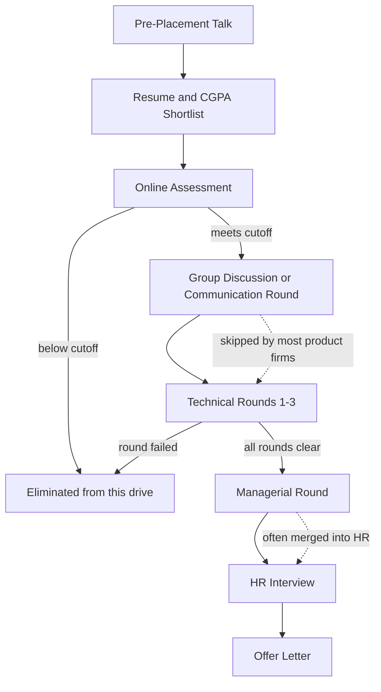

# Placement Preparation

## Overview

This section is the operating manual for the Indian engineering campus placement season — the July-to-March window in which mass recruiters, product companies, and funded startups visit campuses to hire final-year students. It maps the full funnel from the pre-placement talk to the offer letter, shows how each stage actually filters candidates, and links every skill the funnel tests to a deep-dive page elsewhere in this book. The working assumption is that you are targeting a mix of service companies (TCS, Infosys, Wipro), product companies (Amazon, Microsoft, Adobe), and startups, and you want concrete numbers — cutoffs, LPA bands, shortlist ratios, and weekly hours — rather than pep talk.

Use this page as the map and the plan. The funnel table below tells you what each stage eliminates, the stage map tells you which pages to read before each round, and the 12-week plan turns those pages into a schedule you can follow alongside coursework. If you have limited time, read [Campus Placement Process](./campus-placement.md) and [Online Assessment Strategy](./online-assessment.md) first, because together they cover the two highest-volume filter stages of the season.

This hub also fixes the vocabulary the rest of the section uses: a *drive* is one company's full funnel at your campus, an *offer season* is the whole July-March window, and a *track* is one skill stream (DSA, fundamentals, projects, aptitude, behavioral) inside your preparation plan. When other pages say "OA" or "PPT" they mean the stages defined in the funnel table below. Keeping one vocabulary matters because campus advice travels through seniors and group chats, where the same words often mean different things at different colleges.

## The Placement Funnel at a Glance

Almost every campus drive, whether run through TCS NQT or by a top product company, passes through the same six or seven gates. The gates measure different things: early stages measure speed and accuracy at scale (aptitude, online assessment), middle stages measure depth of thinking (technical rounds), and final stages measure fit and communication (managerial and HR rounds). Knowing which gate eliminates how many people tells you exactly where to invest preparation hours.

The numbers below are order-of-magnitude figures from recent seasons at large Indian campuses; individual companies vary widely by year and role. The pattern that matters is that the online assessment is usually the single largest elimination point, and by the time you reach an HR round, well over 90 percent of the original applicant pool is already gone. Preparation that only polishes HR answers is therefore misplaced for most students, because most students never get to use those answers.

| Stage | Typical Duration | Rough Elimination | What Is Actually Measured |
|---|---|---|---|
| Pre-placement talk (PPT) | 45-60 min | None | Attendance is sometimes tracked; the company drops process hints |
| Resume / CGPA shortlist | 1-2 weeks before the OA | 30-60% of registrants | CGPA cutoff, branch eligibility, active backlogs, resume keywords |
| Online assessment (OA) | 60-120 min | 60-80% of those who attempt | Coding speed, edge-case discipline, sometimes aptitude and CS MCQs |
| Group discussion (GD) | 20-40 min | 30-50% of those remaining | Structure, listening, clarity — mostly service companies |
| Technical rounds | 45-90 min each, 1-3 rounds | 50-70% of those remaining | DSA, projects, CS fundamentals, thinking aloud |
| Managerial round | 30-60 min, optional | 20-40% of those remaining | Ownership, conflict handling, technical judgement |
| HR interview | 15-30 min | 5-15% of those remaining | Fit, relocation willingness, salary-expectation sanity |
| Offer / waitlist | Days to weeks | — | Rank order among candidates who cleared all rounds |

## Funnel Flowchart

The diagram shows the standard funnel with the two most common variations: most product companies skip the group discussion, and many merge the managerial round into the last technical round. When a company runs fewer gates, the remaining gates simply do more work per round. Locate the stage where you usually get cut, then spend your preparation hours on that stage's page rather than spreading effort evenly.

## Stage-by-Stage Map

Every stage of the funnel has a dedicated page in this section, and most have a deeper treatment elsewhere in the book. The table below is the fastest way to find the right page for the round in front of you. Read the in-section page the night before a round; work through the linked deep-dive sections weeks before it.

| Funnel Stage | In This Section | Elsewhere in the Book |
|---|---|---|
| Pre-placement talk and shortlist | [Campus Placement Process](./campus-placement.md) | [Resume section](../resume/README.md), [ATS optimisation](../resume/ats-optimization.md), [Writing bullets](../resume/writing-bullets.md) |
| Online assessment | [Online Assessment Strategy](./online-assessment.md), [Coding Assessments](./coding-assessments.md) | [OA strategies](../interview/coding/oa-strategies.md), [MCQ strategies](../interview/coding/mcq-strategies.md) |
| Aptitude and cognitive tests | [Cognitive Tests](./cognitive-tests.md) | [Aptitude section](../aptitude/README.md) |
| SQL and case rounds | [SQL Rounds](./sql-rounds.md) | [DBMS questions](../interview/dbms-questions.md) |
| Group discussion | [Group Discussion Preparation](./group-discussion.md) | [Communication section](../communication/README.md) |
| Technical rounds | [Technical Interview Preparation](./technical-interview.md) | [Coding patterns](../interview/coding/patterns.md), [OS questions](../interview/os-questions.md), [DBMS questions](../interview/dbms-questions.md), [Network questions](../interview/network-questions.md) |
| Machine coding / LLD | — | [Machine coding section](../machine-coding/README.md), [Approach](../machine-coding/approach.md) |
| Managerial round | [HR Interview](./hr-interview.md) | [STAR method](../behavioral-interviews/star-method.md), [Behavioral scenarios](../behavioral-interviews/scenarios.md) |
| HR interview | [HR Interview](./hr-interview.md) | [Common behavioral questions](../behavioral-interviews/common-questions.md), [Company fit](../behavioral-interviews/company-fit.md) |
| Internship to PPO | [Internship Preparation](./internships.md) | [Company types](../interview/companies/company-types.md) |

## The 12-Week Preparation Plan

The plan below assumes 15-25 hours per week across five tracks and front-loads DSA because the OA is the biggest filter. Aptitude gets a fixed small slice all the way through, because service-company tests reward short daily practice far more than last-minute cramming. Behavioral preparation is deliberately compressed into the final three weeks, because it is story-selection rather than skill-building, and stories land better once your projects and fundamentals are solid.

| Track | Hours / Week | Weeks | Primary Pages |
|---|---|---|---|
| DSA and coding | 8-10 | 1-12 | [Coding patterns](../interview/coding/patterns.md), [Complexity](../interview/coding/complexity.md), LeetCode problem sets |
| CS fundamentals | 4-5 | 2-12 | [OS questions](../interview/os-questions.md), [DBMS questions](../interview/dbms-questions.md), [Network questions](../interview/network-questions.md) |
| Projects and machine coding | 4-5 | 1-10 | [Projects section](../projects/README.md), [Machine coding section](../machine-coding/README.md) |
| Aptitude | 2-3 | 1-12 | [Aptitude section](../aptitude/README.md) |
| Communication and behavioral | 2-3 | 9-12 | [STAR method](../behavioral-interviews/star-method.md), [Common behavioral questions](../behavioral-interviews/common-questions.md) |

Treat the week-by-week milestones below as commitments, not suggestions. Each week ends with a measurable artifact — a problem count, a revision sheet, a deployed feature — so you can audit progress honestly instead of guessing. If you fall more than one week behind, cut the project track first and protect the DSA and aptitude tracks, because those feed the earliest and largest filters.

| Week | DSA Focus (8-10 h) | Fundamentals and Design (4-5 h) | Projects (4-5 h) | Aptitude (2-3 h) | Weekend Milestone |
|---|---|---|---|---|---|
| 1 | Arrays, strings, hashing — 30 problems | — | Pick 2 resume projects, set up repos | Percentages, ratios | 30-problem streak started |
| 2 | Two pointers, sliding window — 25 | OS: processes, threads, scheduling | Project 1 schema and core feature | Averages, profit-loss | Project 1 compiles and runs |
| 3 | Binary search family — 25 | DBMS: normalisation, joins, indexes | Project 1 API and auth | Number systems | 100 problems total |
| 4 | Linked lists, stacks, queues — 25 | DBMS: transactions, ACID | Project 1 deploy and README | Time-work, speed-distance | Mock OA #1 under a timer |
| 5 | Trees and BST — 25 | Networks: TCP/IP, DNS, HTTP | Project 2 scaffold | Probability basics | Project 1 live URL |
| 6 | Heaps, recursion, backtracking — 20 | Networks: TCP vs UDP, congestion | Project 2 core feature | Logical reasoning sets | 180 problems total |
| 7 | Graphs: BFS, DFS, topological — 25 | OS: memory, paging, deadlock | Project 2 polish | Data interpretation, puzzles | Mock OA #2 |
| 8 | Dynamic programming I — 20 | Design: scalability basics | Machine coding: parking lot | Mixed revision | 230 problems total |
| 9 | DP II, greedy — 20 | Design: caching, load balancing | Machine coding: splitwise | Mixed revision | Behavioral story bank drafted |
| 10 | Pattern revision — 20 mixed | Design: queues, rate limiter | STAR stories for both projects | Full mock aptitude | Machine coding #1 in 90 min |
| 11 | Company-tagged sets — 25 | CS fundamentals rapid revision | Demo run-through out loud | Full mock aptitude | Mock interview #1 recorded |
| 12 | Timed contests, weak areas — 15 | Revision sheets only | Resume freeze, links tested | Light practice | Full mock loop #2, then rest |

## The Five Preparation Tracks

**DSA and coding (8-10 h/week)** is the core track because every segment of the funnel scores it: the OA coding sections, technical rounds, and even machine-coding rounds at product companies are DSA-adjacent. The efficient method is pattern-first — two pointers, sliding window, binary search, hashing, trees, graphs, DP — rather than random problem grazing, and every pattern gets revised twice after first coverage. Measure progress by mock-OA scores and by whether you can re-solve last month's problems cold, not by the raw counter.

**CS fundamentals (4-5 h/week)** covers OS, DBMS, networks, and OOP, which together decide round 1 at service companies and appear inside project discussions at product companies. Two focused days per subject from the question banks (linked in the stage map) are worth more than weeks of passive reading. Keep a one-page revision sheet per subject and rewrite it at weeks 6 and 11; the rewrite is the revision.

**Projects and machine coding (4-5 h/week)** produces the two resume projects you can defend for fifteen minutes each, plus LLD fluency for product-company machine-coding rounds. Depth beats count: two projects with deployable URLs, clean READMEs, and quantified results outperform four half-built repositories. The selection criteria are in [Projects](../projects/README.md) and the defence method in [Explaining Projects](../projects/explaining-projects.md).

**Aptitude (2-3 h/week)** decides the service-company funnel, where quantitative, logical, and verbal sections carry per-section cutoffs. Short daily practice — 20-30 minutes — compounds far better than weekend binges because these tests reward pattern recognition speed. The [Aptitude section](../aptitude/README.md) is organised exactly by those patterns.

**Communication and behavioral (2-3 h/week, weeks 9-12)** converts your technical substance into passable GD answers, HR answers, and interview presence. Build a bank of 6-8 STAR stories, rehearse them out loud, and record one mock interview per week in the final month. Because it is story-selection rather than skill-building, this track is compressed late — but skipping it entirely is how offers die in HR.

## Eligibility and Registration Checklist

Run this checklist two semesters before the season, because every item is fixable in advance and nearly impossible to fix on drive day. TPO registration forms are unforgiving: discrepancies between your form and your marksheets surface at offer verification and have revoked real offers. Verify each line against your college's placement policy, not against group-chat folklore.

| Item | Typical Requirement | When to Verify |
|---|---|---|
| CGPA | Above 6.0-7.0 aggregate, sometimes per-semester | Start of sixth semester |
| Active backlogs | Zero at registration (some firms: zero ever) | Before season registration opens |
| 10th / 12th marks | 60-80% for mass recruiters | When shortlisting companies |
| Branch eligibility | Company-specific lists; circuit branches often excluded from core SWE | At PPT or TPO circular |
| Age | Some firms cap by birth year | Registration form |
| Documents | Marksheets, IDs, photos in the TPO format | One week before first drive |
| Resume freeze | One version locked; changes need TPO approval | August |

## Quick Start If Your Drive Is in Two Weeks

A two-week runway changes the strategy, not the syllabus. Spend 60 percent of your hours on OA-style timed practice, 25 percent on CS fundamentals rapid revision, and 15 percent on HR and project answers, because the OA and round 1 dominate what you will actually face. Skip new topics entirely; depth on arrays, hashing, binary search, and DBMS/OS staples outperforms shallow coverage of graphs and DP at this stage. Sit at least three full-length timed mocks in the first week so the real OA feels like repetition.

## Operating Rhythm During the Season

Once drives begin, the 12-week plan compresses into a maintenance rhythm rather than a growth plan. Keep DSA at 45-60 minutes of daily timed practice to stay sharp, drop new topics entirely, and redirect freed hours into company-specific preparation the night before each drive. Sleep and schedule hygiene become preparation variables: a 2 a.m. OA followed by an 8 a.m. interview is common, and the students who manage energy across a week outperform the ones who cram before each round. Protect one half-day per week completely off — the season is a multi-month marathon and burnout failures cluster in November.

## Sources of Truth on Campus

Campus rumour is the noisiest data source you will encounter, so anchor decisions to better data. Your TPO's previous-year offer list, seniors who went through the same companies, and candidates' posted OA experiences together beat any single blog post. When two sources conflict, trust the one with numbers — actual shortlist counts, actual package figures, actual round counts from last season.

## Common Myths vs Reality

Misinformation spreads quickly in placement WhatsApp groups, and acting on the wrong myth can cost you an entire season. The table below lists the claims heard most often on Indian campuses, what is actually true in recent seasons, and what to do instead. When in doubt, ask your TPO cell for last year's offer list, which remains the single most reliable dataset you have.

| Myth | Reality | What To Do |
|---|---|---|
| "CGPA does not matter if you code well" | Most drives enforce a hard 6.0-7.0 CGPA filter before anyone sees your code | Stay above the cutoff, or target companies with no stated cutoff |
| "200 LeetCode problems guarantee a product offer" | Volume without pattern revision or timed mocks rarely survives a proctored OA | Follow the 12-week plan and measure by patterns and mock scores, not raw counts |
| "Service companies are backups, so skip their prep" | Service drives close offers earliest and often enforce acceptance rules that end your season | Take September service OAs seriously |
| "The HR round is a formality" | Offers are lost in HR over relocation, higher-studies intent, and inconsistent answers | Rehearse the ten standard HR questions with honest, specific answers |
| "You can hold multiple offers and choose later" | Most TPOs enforce a one-offer rule; reneging can blacklist you on campus | Accept the first offer you clear; upgrade only through sanctioned channels |
| "Backlogs are fine if cleared before joining" | Many companies require zero active backlogs at registration, not at joining | Clear backlogs before the season starts |
| "Off-campus is easier — no cutoff competition" | Off-campus pools are larger and referral-driven, and response rates fall below 5% | Run off-campus as a parallel track, not the main plan |
| "Fancy projects beat solid basics" | Interviewers drill fundamentals first and only then explore projects | Balance both tracks; be able to defend every line of your resume |
| "A 9.5 CGPA replaces preparation" | High CGPA only buys eligibility and a slightly longer leash in round 1 | Run the same plan regardless of CGPA |

## Reading Order by Situation

Different starting points need different entry pages, and handing every reader the same reading order wastes their scarcest resource — time. The table below maps the four most common starting situations to a first read and a second read. Whatever your situation, [Campus Placement Process](./campus-placement.md) remains the mechanical primer, so treat it as mandatory background.

| Your Situation | Read First | Then Read |
|---|---|---|
| Season starts in 3+ months, no plan yet | The 12-week plan on this page | [Technical Interview Preparation](./technical-interview.md) |
| OA next week | [Online Assessment Strategy](./online-assessment.md) | [Coding Assessments](./coding-assessments.md), [OA strategies](../interview/coding/oa-strategies.md) |
| Interview in 2-3 days | [Technical Interview Preparation](./technical-interview.md) | Fundamentals banks: [OS](../interview/os-questions.md), [DBMS](../interview/dbms-questions.md) |
| HR round scheduled | [HR Interview](./hr-interview.md) | [STAR method](../behavioral-interviews/star-method.md) |
| Failed one or more drives | The failing and re-attempt strategies in [Campus Placement](./campus-placement.md) | [Internship Preparation](./internships.md) for off-campus and PPO routes |

## Glossary of Campus Terms

Campus placement vocabulary is dense, and a single misunderstood term can cause a wrong decision — for example, assuming CTC equals take-home salary. The table below defines the terms used throughout this section the way Indian campuses actually use them. Ask your TPO for the precise local definition wherever your college's policy differs.

| Term | Meaning |
|---|---|
| Drive | One company's complete hiring funnel at your campus |
| PPT | Pre-placement talk — the company's presentation before shortlisting |
| OA | Online assessment — the proctored coding and aptitude test |
| NQT | TCS's national qualifying test, scored into profile tracks |
| PPO | Pre-placement offer — an FTE offer made to a performing intern |
| Dream / super-dream | TPO package-band classifications controlling which drives you may still attempt |
| One-offer rule | TPO policy that accepting an offer ends your season |
| CTC | Cost to company — fixed pay, variable pay, stock, and benefits combined |
| Bond | Service agreement committing years of service with a penalty for early exit |
| Waitlist | Ranked backup list that receives offers as first-list candidates decline |

## Key Takeaways

- The OA is the largest single elimination point of the funnel, so timed practice beats passive problem reading every week of the season.
- Eligibility filters (CGPA, branch, backlogs) run before skill filters, so a good season starts with administrative compliance.
- Service companies, product companies, and startups run structurally different funnels — match your preparation to the segment that visits your campus.
- A 12-week plan with weekly measurable artifacts beats an open-ended "solve more problems" approach.
- HR and managerial rounds eliminate a small but real percentage; they are cheap to prepare for and expensive to fail.
- Campus offers are largely non-negotiable; your leverage comes from multiple drives, not from counter-offering.
- Rejections are stage-specific data: log which stage cut you, and the fix is usually one page of this book away.
- Off-campus and internship-to-PPO routes keep working after the season ends, so a bad season is recoverable.

## References

- [GeeksforGeeks — Placement Preparation](https://www.geeksforgeeks.org/placement-preparation/)
- [InterviewBit — Placement Preparation Course](https://www.interviewbit.com/courses/placement-preparation/)
- [LeetCode](https://leetcode.com/)

## Cross-References

- [Campus Placement Process](./campus-placement.md) — season mechanics, company segments, offers and escalation
- [Technical Interview Preparation](./technical-interview.md) — round anatomy, thinking aloud, CS-fundamentals pointers
- [Online Assessment Strategy](./online-assessment.md) — formats, time management, partial-credit tactics
- [HR Interview Preparation](./hr-interview.md) — STAR answers and standard HR questions
- [Behavioral Interviews](../behavioral-interviews/README.md) — story bank and frameworks
- [Machine Coding](../machine-coding/README.md) — LLD rounds at product companies
- [Aptitude](../aptitude/README.md) — quantitative and reasoning practice for OAs
- [Projects](../projects/README.md) — project selection and explanation for the resume track
