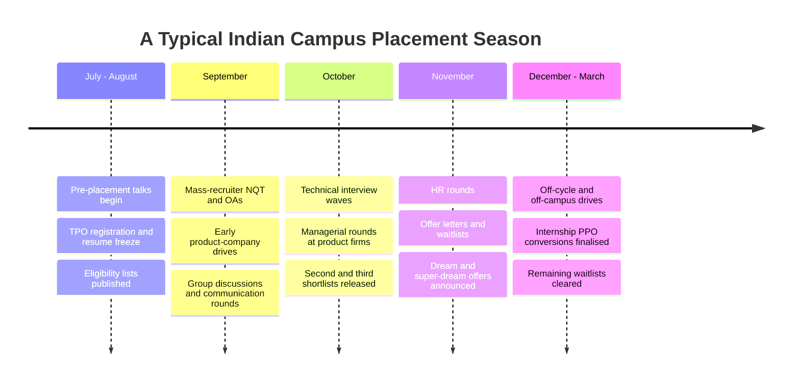

# Campus Placement Process

## Overview

Campus placement is the structured, college-mediated hiring channel through which most Indian engineering students get their first job: companies register with the Training and Placement (TPO) cell, filter by eligibility, run assessments and interviews on or near campus, and issue offers to a ranked shortlist. The process differs from open-market hiring in three ways that matter tactically: eligibility rules are enforced mechanically, offers follow a strict acceptance order, and your TPO — not you — controls much of the timeline. Understanding those mechanics before the season starts is worth more than an extra month of random problem solving.

This page walks the full sequence stage by stage, then compares the three routes into a job (campus, off-campus, internship-to-PPO), contrasts service-based and product-based processes with realistic pay bands, and covers the parts nobody teaches: day-of logistics, the offer ladder, and what to do after a rejection. Companion pages cover individual rounds in depth — start with [Online Assessment Strategy](./online-assessment.md) and [Technical Interview Preparation](./technical-interview.md), and finish with [HR Interview Preparation](./hr-interview.md).

## The Stage-by-Stage Process

### 1. Pre-Placement Talk (PPT)

The company presents its business, roles, compensation, and process, usually 45-60 minutes in an auditorium or over a webinar. Listen actively rather than treating it as a formality: recruiters frequently announce the OA platform, the number of coding questions, whether GD exists, and which profiles (Ninja vs Digital, ASE vs FTE) they are hiring for. Prepare one or two sharp questions — asking about the role's tech stack or posting locations signals genuine interest and is remembered during shortlisting discussions. Attendance is sometimes recorded, and at some colleges it is a hard prerequisite for sitting the drive.

### 2. Resume Screening and Eligibility Filtering

Before any human reads your resume, mechanical filters run: CGPA cutoff (commonly 6.0, often 7.0, occasionally 7.5-8.0 for premium product roles), branch eligibility, zero active backlogs, and sometimes 10th/12th percentages above 60-80 percent for mass recruiters. Human review then checks a one-page resume for quantified project bullets, relevant skills, and clean formatting — see [ATS Optimisation](../resume/ats-optimization.md) and [Common Mistakes](../resume/common-mistakes.md). A resume that passes robots but bores humans loses at the very next stage, so keep both audiences in mind. Fix eligibility problems a full semester before the season; a 0.2 CGPA shortfall cannot be appealed on drive day.

### 3. Online Assessment (OA)

The OA is the highest-volume filter in the entire funnel, typically 60-120 minutes on HackerRank, CodeSignal, HackerEarth, or SHL/AMCAT platforms. Service-company tests usually add aptitude MCQs, verbal sections, and sometimes psychometric or cognitive modules, while product-company tests are 2-4 pure coding problems with heavy hidden test cases. Scoring is automated and unforgiving: partial solutions often score zero, so correctness on easier problems beats ambition on harder ones. Full formats, time-management plans, and platform tactics live in [Online Assessment Strategy](./online-assessment.md) and [Coding Assessments](./coding-assessments.md).

### 4. Group Discussion or Communication Round

Many service companies and a few consulting-adjacent firms run a 20-40 minute GD, sometimes replaced by a JAM (just-a-minute) or extempore round. Evaluators score structure, listening, and clarity — not aggression or word count; speaking three well-framed times outperforms dominating for ten minutes. Several mass recruiters have shifted this stage earlier, into the OA itself, via recorded video or communication tests. The scoring rubric and sentence patterns are covered in [Group Discussion Preparation](./group-discussion.md) and [Communication Round](./communication-round.md).

### 5. Technical Rounds (1-3)

Round 1 is usually DSA plus CS fundamentals: 1-2 problems on arrays, strings, hashing, or trees, then rapid-fire questions from OS, DBMS, or networks. Round 2 goes deeper — medium-hard DSA, a project deep-dive, and for product companies possibly machine coding or low-level design. Round 3, when it exists, blends advanced topics with culture and judgement questions. The round-by-round anatomy, thinking-aloud framework, and fundamentals question bank are covered in [Technical Interview Preparation](./technical-interview.md).

### 6. Managerial Round (optional)

Product companies and some fintech firms add a 30-60 minute round with an engineering manager that tests ownership, conflict resolution, and technical judgement rather than raw algorithm speed. Expect behavioral questions anchored to your projects ("what broke, what did you do"), plus scenario questions such as how you would handle a slipping deadline. The STAR structure from [HR Interview Preparation](./hr-interview.md) works here, but answers should carry more technical texture than HR-round answers.

### 7. HR Interview

The final gate covers "tell me about yourself", "why this company", strengths and weaknesses, relocation and bond willingness, and salary expectations. HR also verifies consistency with earlier rounds — claiming a project you cannot describe, or expressing higher-studies plans, kills offers here. At mass recruiters the HR round doubles as a bond-acceptance conversation (service agreements of 1-3 years are common), so read what you sign. Rehearse the standard questions until your answers are specific and 60-90 seconds long.

## Season Timeline

A typical season compresses the funnel above into four intense months, with mass recruiters moving earliest and premium product companies arriving later or running off-cycle drives. The diagram shows the common rhythm; your TPO's calendar overrides it wherever they differ. Notice that September is the densest month — students who are unprepared for the first wave lose their freshest OA attempts to it.

## Campus vs Off-Campus vs Internship-to-PPO

All three routes lead to the same job, but they differ in access, competition shape, and control. Campus gives you guaranteed access to drives that off-campus applicants cannot even see; off-campus gives you unlimited attempts but a brutal funnel; PPO gives you the shortest path but converts only if your internship goes well. Choose a primary route early and run the others as parallel tracks rather than switching mid-season.

| Dimension | On-Campus | Off-Campus | Internship to PPO |
|---|---|---|---|
| Access | TPO-gated; companies come to you | Open applications, referrals, drives | Must first win the internship |
| Competition | Your batch plus eligibility cutoffs | All-India pools; response rates often below 5% | Only fellow interns in your cohort |
| Rounds | PPT, OA, GD, tech, HR | OA, 2-4 tech rounds, hiring-manager round | Internship performance review + 1-2 talks |
| Referrals needed | No | Practically yes | No |
| Pay transparency | Fixed published bands | Negotiable within a band | Conversion letter states the band |
| Timeline | Fixed season windows | Rolling, year-round | Internship end + 2-8 weeks |
| Risk concentration | Fewer attempts, higher stakes | Many attempts, low per-attempt odds | One team, one manager |
| Best for | Structured prep, mass recruiters | Strong portfolios, niche stacks | Students who convert early internships |

Off-campus channels reward assets that campus does not test as directly: a referral, a public GitHub, a blog, or a niche skill such as embedded or DevOps. If your campus season ends without an offer, the off-campus playbook in [Internship Preparation](./internships.md) and the company-specific guides in [Companies](../interview/companies/README.md) become your main loop. PPO conversion rates at large product companies are commonly reported in the 60-80 percent range, which makes a summer internship the lowest-variance entry route for students who secure one.

## Eligibility Criteria and CGPA Cutoffs

Eligibility is the cheapest filter for companies and the most expensive mistake for students. Mass recruiters typically enforce 60 percent or 6.0 CGPA through all semesters, no active backlogs, and sometimes an age ceiling (often born after a stated year); product companies typically sit at 7.0 or 7.5 with no 10th/12th conditions; a few premium firms state no cutoff but shortlist by resume anyway. The cutoff is binary and mechanical — a 6.95 CGPA does not become 7.0 because you solved 400 problems. Check your TPO's rules on backlog clearance timing too, because some companies require clearance before registration, not before joining.

Three practical consequences follow. First, raise your CGPA a semester early if you are near a 7.0 boundary — it changes which companies you may attempt at all. Second, never lie on the registration form: mass recruiters verify marksheets at offer time and revoke offers for discrepancies. Third, if you are already locked below a target cutoff, route your effort to companies without that cutoff and to off-campus channels rather than mourning the segment.

## Service-Based vs Product-Based Processes

The two segments run recognisably different funnels, and misjudging which one you are in wastes preparation. Service companies optimise for filtering thousands of candidates cheaply: standardised tests, aptitude weight, communication checks, and fixed bands. Product companies optimise for finding a small number of strong engineers: harder coding, project depth, design thinking, and much wider pay dispersion. Startups sit closer to product companies but often compress everything into two rounds with a paid assignment.

| Dimension | Service-Based (TCS, Infosys, Wipro, Accenture) | Product-Based (Amazon, Microsoft, Adobe, startups) |
|---|---|---|
| Typical rounds | NQT/OA → GD/communication → 1 tech + HR | OA → 2-4 technical → managerial → HR |
| OA difficulty | Aptitude-heavy, 1-2 easy coding tasks | 2-4 medium coding tasks with hidden tests |
| Interview focus | Basics, communication, trainability | DSA depth, projects, LLD, sometimes HLD |
| DSA bar | Easy; arrays, strings, sorting | Medium; trees, graphs, DP, time-complexity drilling |
| CS fundamentals | Surface level | Probed hard (OS, DBMS, networks) |
| Fresher pay band | 3.4-4 LPA base; digital/advanced tracks 6.5-11 LPA | Roughly 12-25 LPA for mid-tier product; 30-50+ LPA CTC at top firms |
| Bond / agreement | Common, 1-3 years with penalty | Rare |
| Posting choice | Limited; often client-assigned locations | Usually city choice among offices |
| Offer speed | Fastest — earliest in season | Slower, multiple weeks between rounds |
| Re-attempt policy | 6-12 month cooling period after an offer is declined | Case-by-case; usually next cycle |

Pay figures are approximate bands from recent campus seasons and vary by year, city, and profile track — treat them as calibration, not gospel. The structural takeaway is that the two segments reward different hours: aptitude and communication hours dominate the service funnel, while DSA and project depth dominate the product funnel. Most students should prepare DSA-first anyway, because product-track readiness covers the service coding sections comfortably.

## Mass-Recruiter Shortlisting Mechanics

TCS, Infosys, Wipro, Accenture, and Cognizant run tests at industrial scale — lakhs of candidates per cycle — so shortlisting is a scoring pipeline, not a human judgement. TCS NQT scores map to profile tracks (Ninja around 3.36 LPA, Digital around 7 LPA, Prime around 9-11 LPA), and Infosys similarly splits System Engineer (3.6 LPA) from Specialist Programmer (9.5 LPA) and Digital Specialist Engineer (6.25 LPA) tracks based on test and interview performance. Your raw test score, section cutoffs, and speed all matter; finishing the aptitude section with 60 percent accuracy often beats 90 percent accuracy with incomplete attempts, because cutoffs are per section. Where you are willing to post also feeds the shortlist at some firms, since they staff client sites in specific cities.

Two mechanisms catch students off guard every year. First, preference ordering: some colleges let companies see a rank list or priority order, and some enforce that you accept the first qualifying offer, which ends your season by design. Second, the "dream" and "super-dream" classification your TPO applies (typically by package band) governs whether you may still sit later drives after an early offer. Read your TPO's placement policy document in July — not in November when the first offer letter arrives.

## Round Variations by Company Tier

The generic funnel hides wide variation across company tiers, and knowing the variation lets you pre-load the right preparation for the drives actually visiting your campus. The table below summarises recent-season patterns; verify against each year's PPT, because tiers shift their formats almost annually. Note that compensation figures are fresher bands reported from campuses, not official numbers.

| Company | Typical Funnel | Interview Focus | Fresher Band (approx.) |
|---|---|---|---|
| TCS | NQT → interview → HR | Aptitude, basic coding, communication | 3.36 / 7 / 9-11 LPA by track |
| Infosys | Test → GD/communication → tech + HR | Basics, trainability | 3.6 / 6.25 / 9.5 LPA by track |
| Wipro | Test → tech + HR | Fundamentals, communication | 3.5-6.5 LPA by track |
| Accenture, Cognizant | Cognitive + coding test → communication → tech + HR | Aptitude, clarity | 4-6.5 LPA |
| Amazon | OA → 2-3 technical → HR | DSA on leadership-aligned problems | 30-50 LPA CTC |
| Microsoft | OA → 2-3 technical → HR | DSA, projects, fundamentals | 45-55 LPA CTC |
| Mid-tier product (Adobe, Oracle, Salesforce) | OA → 2 technical → HR | DSA medium, CS fundamentals | 15-30 LPA CTC |
| Funded startups | Assignment/OA → 1-2 mixed rounds → founder chat | Practical coding, ownership | 10-25 LPA plus ESOPs |
| Fintech/quant-adjacent (Goldman Sachs, JPMC) | OA (coding + math) → 2-3 rounds | DSA, probability, puzzles | 20-35 LPA CTC |

Two patterns follow from the table. Service funnels front-load their hardest filter into the test itself, so section cutoffs and speed decide everything before an interviewer ever sees you. Product funnels front-load difficulty into interviews, which makes the OA a qualifying step and the rounds a genuine evaluation — so service prep is mock-test prep, while product prep is depth prep. Startups compress both into assignment-plus-conversation, which rewards candidates who can demo real shipped work.

## Test Platforms You Will Actually Meet

Platform familiarity is a real score variable: interface quirks, compiler settings, and proctoring behaviour differ enough to cost minutes at exactly the wrong time. Most platforms offer free practice modes, and an hour in each mode before a drive is cheap insurance. The table covers the platforms commonly used on Indian campuses in recent seasons; the PPT will usually name yours.

| Platform | Commonly Used By | What It Runs | Prep Note |
|---|---|---|---|
| HackerRank | Amazon, Microsoft, many product firms | Timed coding with hidden test cases | Learn the editor shortcuts and custom stdin format |
| SHL / AMCAT | TCS, Accenture, Cognizant | Aptitude, coding, sometimes psychometric | Per-section timers; practice skipping and returning |
| CoCubes (Aon) | Wipro and several OEM/IT firms | Aptitude plus basic coding | Negative marking possible; check the PPT |
| HackerEarth | Mid-tier product companies | Coding with AI-assisted proctoring | Expect webcam and tab-switch detection |
| CodeSignal | Product firms and startups | Coding, sometimes proctored IDE | Practice its language switcher beforehand |
| Mettl | Infosys and several mass recruiters | Aptitude, coding, remote proctoring | System checks fail on old browsers — test early |

Two habits transfer across all platforms. First, solve every practice session with the language and template you will use on drive day — switching languages mid-season costs speed. Second, never leave a section early if time remains, because unattempted easy questions are the most common score leak in aptitude sections.

## Day-of Logistics

Drive days fail on logistics more often than students expect, especially for in-person rounds at hotels or company offices. Arrive 45-60 minutes early; report times are hard gates, and Indian traffic has ended more candidacies than bad code. Carry printed ID proof, college ID, two printed resume copies, passport photographs, and your marksheets; many companies still collect physical documents at registration. Keep your phone on silent, carry a pen, and eat before the wait — OA-to-interview gaps of 4-8 hours are normal and there is rarely food nearby.

For virtual drives, logistics shift but do not shrink. Test your laptop, camera, internet, and the assessment platform the night before; keep a phone hotspot as backup and a quiet room booked in advance. Keep rough sheets and a pen ready (many proctored tests allow them), close every other application, and disable notifications. Finally, use gaps between rounds productively: revise your project one-pager and your STAR stories rather than doom-scrolling the group chat, because mood shows up in round 2.

Physical drives add a document checklist that has real consequences when incomplete — companies photograph and file documents, and a missing marksheet can suspend your offer processing for weeks.

| Document | Copies | Notes |
|---|---|---|
| Updated resume | 2-3 | The frozen version your TPO submitted |
| College ID and government photo ID | 1 each | Original plus photocopy |
| 10th, 12th, and semester marksheets | 1 set | Photocopies attested if asked |
| Passport photographs | 4 | Same set as the registration form |
| Offer/registration email printout | 1 | Some venues check it at the door |
| Pen, rough sheets as permitted | — | Ask before using paper in proctored tests |

## Working With Your TPO

The TPO cell is the operator of the season, and students who treat it as an adversary or as bureaucracy lose access to information and flexibility. Learn your policy document cold — attempt order, one-offer rule, dream/super-dream definitions, off-campus permission requirements — because every escalation and exception flows through those clauses. Attend every PPT you are eligible for, meet the TPO staff during office hours rather than by WhatsApp at midnight, and report problems (schedule clashes, registration errors) immediately and in writing. A student the TPO trusts gets the benefit of the doubt in the two or three moments each season where the doubt decides an outcome.

## Understanding Your Offer Letter

An offer letter is a contract, and freshers routinely sign it without reading past the CTC figure. Read the full compensation structure: fixed versus variable pay, joining bonus and any clawback clause, stock vesting schedule if any, and what "CTC" includes (benefits, insurance, employer PF contributions all inflate it above take-home). Read the service agreement if present — duration, penalty amount, notice period — and photograph the signed copy. Check the location clause carefully, because "willing to work anywhere in India" is enforceable in a way most freshers do not expect.

Three clauses deserve special attention. First, the joining date: a later date can buy time for off-campus attempts, and it is occasionally negotiable through the TPO. Second, the bond penalty: some penalties shrink after each completed year, which changes your optimal exit timing if you plan to switch. Third, the higher-studies clause: some service agreements include education-leave provisions, while others simply treat resignation as bond breach. When a clause is unclear, ask HR in writing before signing — a one-line email now prevents a five-figure dispute later.

## Offer Ladder and Escalation

The money conversation on campus is mostly a ladder you climb by winning more, not by negotiating harder. An internship stipend at a product company runs roughly 30,000-1,00,000 per month; conversion turns it into an FTE package decided at offer time. Service base bands are fixed and effectively non-negotiable, while product companies have narrow but real bands and occasionally match documented competing offers. The table shows the common ladder from where students start to where escalation can realistically reach.

| Rung | Typical Range (INR) | How You Reach It |
|---|---|---|
| Internship stipend | 10-25k/month (service), 30k-1L/month (product) | Win the internship through OA and interviews |
| Service base offer | 3.4-4 LPA; digital tracks 6.25-11 LPA | Clear NQT/OA with high section scores |
| Product SDE-1 (campus) | 12-25 LPA CTC at mid-tier; 30-50+ LPA at top firms | Clear OA plus 2-4 technical rounds |
| Competing-offer escalation | +0-20% movement within a band | Documented, real competing offer from a sanctioned parallel drive |
| PPO upgrade | Stipend → FTE at review | Strong internship delivery plus a final conversion talk |
| Off-cycle re-entry | Company-specific | Reapply off-campus after 1-2 years of experience |

Waitlists deserve their own understanding, because they move more offers than students expect. Companies shortlist more candidates than positions and release offers down the list as candidates above decline, so a waitlist position at a good company is a real, live chance — some students receive offers in January from October waitlists. Do not reject a waitlist offer hastily either: a "join later" letter (common when mass recruiters onboard in batches) still counts as an offer and still triggers one-offer rules. Keep attempting drives while waitlisted, and track your position with the TPO rather than guessing.

One more ladder wrinkle from recent cycles: mass-recruiter onboarding has sometimes slipped by months, with 2022-24 cohorts seeing joining dates pushed well past graduation. A delayed date is not a rescinded offer — companies honour it while you wait — but it changes your calculus about whether to keep attempting off-campus roles in the gap. Handle it through your TPO, in writing, and never assume. What you do in a waiting period (projects, freelance work, off-campus attempts) is career capital either way.

Negotiation rules on campus are stricter than off-campus. Most TPOs enforce a one-offer policy, forbid direct negotiation between student and company, and route all escalation through the TPO; bypassing them risks both your offer and your college's relationship with the recruiter. The realistic escalation moves are: convert a PPO at the top of the band, use a sanctioned competing offer, or decline politely and re-enter off-campus later. What does not work is bluffing about an offer you do not hold — companies verify, and the story follows you.

## Failing and Re-Attempt Strategies

A rejection is stage-specific information, not a verdict on your career. If the OA cut you, the fix is timed practice and platform familiarity; if technical round 2 cut you, the fix is usually project depth or fundamentals; if HR cut you, audit your answers for inconsistency or higher-studies signals. Write a one-page debrief after every drive — questions asked, where you stalled, which page of this book covers the gap — and your next attempt compounds instead of repeating. Students who treat the season as a series of data points outperform students who treat each drive as a final exam.

Re-attempt routes exist at every timescale. Within the season, waitlists move, off-cycle drives appear in December-March, and many students clear their best offer last. After the season, off-campus applications (referral-driven), startup hiring, and internship-to-PPO conversion remain open well past graduation. A service-company joining year followed by a switch at 1-2 years of experience is an extremely common and respectable path to product companies — the ladder exists, it just starts lower. If you declined an offer, expect a cooling period (often 6-12 months) before the same company reconsiders you.

If the season ends with no offer, run a structured 90-day plan rather than drifting. Weeks 1-2: complete the debrief audit across every drive and rebuild the preparation plan around the stages that cut you. Weeks 3-8: execute that plan while running a referral pipeline — ten tailored outreach messages per week to alumni and engineers at target companies, each with a one-line pitch and attached resume. Weeks 9-12: convert preparation into attempts — off-campus drives, startup roles, and internship postings on job boards — while keeping daily DSA practice alive. Students who execute this plan typically convert within one to two quarters, because the off-campus funnel rewards sustained pipeline work rather than a single push.

## Interview Questions About the Process Itself

1. **What actually happens if a company shortlists me but I miss the OA due to illness or a clash?** Policies differ: some TPOs can request a re-test for documented medical cases, while many companies simply drop you for that drive and keep you eligible for the next one. The correct move is immediate written notification to the TPO with proof, the same day. Companies handle legitimate cases far more generously than silent no-shows, and the paper trail protects your standing for the rest of the season. Never let a missed event become a mystery — ask, in writing, within 24 hours.

2. **What is the difference between a dream and a super-dream company, and why does the label matter?** These are TPO-defined classifications by package band — dream companies typically offer above the service band (often 6-12 LPA), super-dreams higher still. The label matters because placement policies often restrict students holding an offer from sitting later drives, or allow only dream-category attempts. The classification changes by college, so the only authoritative source is your TPO's policy document. Plan your attempt order around it rather than discovering it after your first offer.

3. **Can I hold a service-company offer and still attend product-company drives later in the season?** Usually not — most TPOs enforce a one-offer rule where accepting an offer makes you sit out from further drives, though some allow "upgrade only" attempts to dream categories. Policies differ campus to campus, and companies coordinate through the TPO, not directly with you. The practical answer is to sequence your strongest attempts first if your policy allows it. Breaking the rule risks blacklisting from future drives at your college.

4. **Is a campus offer negotiable?** Base bands at service companies are fixed by profile track and are effectively non-negotiable. Product companies have bands with limited movement, and the only sanctioned leverage is a documented competing offer routed through your TPO. Off-campus, negotiation space is wider but still bounded by published fresher bands. Time spent "negotiating" a fixed 3.6 LPA service offer is better spent winning a product drive.

5. **How does TCS NQT actually decide between Ninja, Digital, and Prime profiles?** The NQT score plus coding-section performance sets the track: higher composite scores map to Digital (around 7 LPA) and the top band maps to Prime (around 9-11 LPA), with the base Ninja band around 3.36 LPA. The interview then confirms, and occasionally upgrades, the profile. Section cutoffs mean balanced performance across aptitude and coding matters more than brilliance in one section. This is why service-prep should include full-length timed mocks, not just coding practice.

6. **What actually causes PPO conversion to fail?** The three common causes are weak internship output (unshipped or unverified work), no manager advocacy at review time, and headcount freezes that quarter. Conversion is a manager's decision communicated through HR, so flag interest early, ship something measurable, and make your work easy to defend in a review meeting. Students who ask "what would you need to see from me to convert this?" in week 2 convert far more reliably than students who ask in week 22.

7. **I have no offers by March — is the off-campus route realistic?** Yes, but change tactics rather than repeating campus strategy. Build a referral pipeline first (alumni, LinkedIn outreach, cold DMs with a one-line pitch and resume), target companies running active fresher drives, and consider a 3-6 month internship or a service-company joining as a bridge. Off-campus response rates without referrals are commonly below 5 percent, so volume plus referrals is the mechanism, not better luck. The ladder still ends in the same place; it just takes one to two years longer.

## Key Takeaways

- The funnel's biggest filter is the online assessment; allocate preparation hours accordingly and practice under real time limits.
- Eligibility cutoffs are mechanical and checked before skill — fix CGPA and backlogs a semester before the season.
- Service and product funnels measure different things; prepare DSA-first because it covers both, then add aptitude volume for mass recruiters.
- September is the densest month; walk into it with mocks already done, because first attempts are your freshest.
- Campus negotiation is a TPO-mediated system — know your college's one-offer and dream/super-dream rules in July.
- Day-of logistics (report time, documents, virtual setup) fail more candidates than round 2 does.
- Every rejection is stage-specific data; a written debrief converts it into next drive's preparation.
- Off-campus, PPO conversion, and the service-first-then-switch path keep the ladder climbable even after a bad season.

## References

- [GeeksforGeeks — Placement Preparation](https://www.geeksforgeeks.org/placement-preparation/)
- [InterviewBit — Placement Preparation Course](https://www.interviewbit.com/courses/placement-preparation/)
- [Cracking the Coding Interview](https://www.crackingthecodinginterview.com/)
- [The Muse — STAR Interview Method](https://www.themuse.com/advice/star-interview-method)

## Cross-References

- [Online Assessment Strategy](./online-assessment.md) — the biggest filter, with per-format tactics
- [Technical Interview Preparation](./technical-interview.md) — round anatomy and thinking-aloud framework
- [HR Interview Preparation](./hr-interview.md) — STAR answers for the final gate
- [Group Discussion Preparation](./group-discussion.md) — scoring rubric for GD and JAM rounds
- [Internship Preparation](./internships.md) — the internship-to-PPO route in detail
- [Company Types](../interview/companies/company-types.md) — how recruiter segments differ beyond pay
- [Resume Section](../resume/README.md) — getting past the eligibility and screening filters
- [Companies](../interview/companies/README.md) — company-specific interview guides
