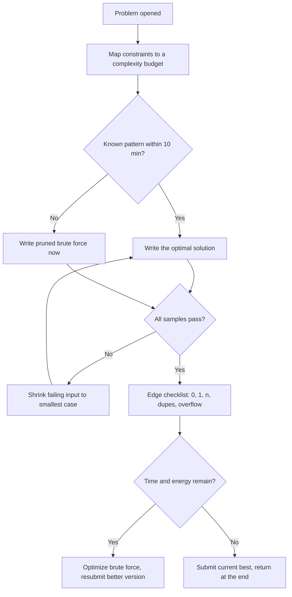

# Coding Assessments

## Overview

Online coding assessments (OAs) are the first technical filter for most companies, and they score you differently from any interview: an automated judge, hidden test cases, a countdown, and no human willing to give hints. Performing well here determines whether you reach the interview stage at all, which makes it the highest-leverage 90 minutes of any hiring season. This page covers the coding-specific mechanics — difficulty calibration by company tier, language choice, starter templates, partial scoring, debugging hidden failures, plagiarism detection, and post-assessment follow-up. It complements two sibling pages: [Online Assessment Strategy](./online-assessment.md) for the logistics and platform landscape, and [Online Assessment Strategies](../interview/coding/oa-strategies.md) for the deep in-editor strategy, and it does not duplicate either.

## Major Platforms

| Platform | Used By | Format | Time Limit |
|----------|---------|--------|------------|
| HackerRank | Goldman Sachs, Cisco, Dell, most service MNCs | 2-4 coding problems | 60-120 min |
| CodeSignal | Meta, Uber, Zoom (GCA format) | 4 problems, session-wide timer | 70-120 min |
| LeetCode (hiring modules) | Various product companies | 1-4 problems | Varies |
| Codility | Samsung, HP, Cerner | 2-3 tasks, per-task windows | 60-90 min |
| HackerEarth | Indian startups and service companies | 2-4 problems + MCQs | 60-120 min |
| Mercer Mettl | Banking tech, insurance, PSUs | Mixed coding + MCQ, AI-proctored | Varies |

The platform decides the interface; the company decides the rules. Before every assessment, read the invite for proctoring level, resubmission policy, and allowed languages, because the same platform runs gentle and brutal configurations. Practicing one full mock on the exact platform is cheaper than discovering its timer behavior during a real attempt.

## Difficulty Calibration by Company Tier

The single most common preparation mistake is practicing for the wrong tier. A candidate grinding hard DP problems for a service-company OA is over-prepared on difficulty and under-prepared on the speed and breadth that tier actually tests, while a candidate preparing easy loops for a top product OA is not even in the game. Calibrate your practice to the tier of the company in front of you, and tier your target list honestly by what each OA actually demands.

| Tier | Typical OA level | Common formats | Typical examples (varies by year) |
|---|---|---|---|
| Service mass recruiters | Easy; speed and accuracy tested | Aptitude + 1-2 easy coding + debugging + CS MCQs | TCS NQT, Infosys, Wipro, Accenture, Cognizant, Capgemini |
| Product MNCs | Easy-medium, clean implementation | 2-3 problems, generous limits | Oracle, SAP Labs, Cisco, Dell, Qualcomm, Airtel (X) |
| Top product companies | Medium-hard, edge-case heavy | 2-3 problems, hidden tests stress complexity | Google, Microsoft, Amazon, Adobe, Atlassian, Uber |
| Unicorns and funded startups | Medium, pragmatic | 2-3 problems or take-home; sometimes framework tasks | Flipkart, Swiggy, Razorpay, Zerodha, CRED |
| Quant and HFT | Hardest; math + speed | 2-4 problems with brutal time limits, often math-flavored | Trading firms, proprietary shops |

Three practical consequences follow from the table. First, service-company OAs reward raw accuracy and pacing more than algorithmic brilliance, so aptitude and debugging practice have disproportionate returns there. Second, product-tier OAs live on the medium band — arrays, strings, hash maps, BFS/DFS, easy DP — so consistency on LeetCode mediums converts directly into offers. Third, top-tier OAs are distinguished less by topic than by hidden-test cruelty: they include adversarial cases, maximum constraints, and boundary values that fail a correct-but-sloppy implementation. A useful self-test before any OA: you should be finishing the target tier's typical set at the target tier's time limit in a mock, not merely "able to solve the problems eventually."

## Common Question Types

| Category | Frequency | Examples |
|----------|-----------|----------|
| Arrays/Strings | Very High | Two pointers, sliding window, subarrays |
| Hash Maps | Very High | Frequency counting, anagrams, complements |
| Trees/Graphs | High | Traversals, BFS/DFS, LCA |
| Dynamic Programming | Medium | Knapsack variants, LCS, edit distance |
| Math/Logic | Medium | Number theory, bit manipulation, GCD/LCM |
| SQL (for data roles) | Medium | Joins, aggregations, window functions |
| Greedy + Sorting | High | Interval scheduling, meeting rooms, assignments |

The distribution is stable across seasons, which is why pattern-first practice outperforms random grinding. Deep dives on the highest-frequency patterns live in [Problem Patterns](../interview/coding/patterns.md) and the pattern pages linked there. If your OA is in ten days, weighting your remaining practice toward the "Very High" rows is the highest-expected-value move available.

## Language Choice Under Time Limits

| Criterion | Python 3 | C++ | Java |
|-----------|----------|-----|------|
| Typing speed | Fastest — minimal boilerplate | Moderate | Slowest — class scaffolding |
| Raw runtime | Slow (6-10x C++ in tight loops) | Fastest | Fast |
| Integer overflow | Never (arbitrary precision) | Manual (`long long`) | Manual (`long`) |
| Time-limit safety margin | Smallest | Largest | Large |
| Best default for | Correct algorithms at n ≤ 10⁵ | n ≥ 10⁶ or tight limits | Your strongest language, whatever it is |

The default rule: use the language you type fastest, because most OAs size their limits for correct O(n log n) solutions in any mainstream language. Override it when the constraint math says otherwise — at n = 10⁶ with a per-test limit of 1–2 seconds, a correct Python solution can TLE where the same algorithm in C++ passes comfortably. Python's arbitrary-precision integers delete the entire overflow bug class, which is worth real points on hidden tests that include 10¹⁸-scale values. Whatever you choose, decide in the first two minutes and never switch mid-assessment; the context switch costs more than any runtime difference.

## Starter Templates: Fast I/O in Three Languages

Typing boilerplate under a timer wastes minutes and breeds syntax errors, and copy-paste is frequently disabled in proctored environments. Keep one template per language in muscle memory — short enough to retype in under a minute, structured so the solve function is the only part you change. The three templates below use batched output, which matters on problems with large outputs where thousands of individual print calls become the bottleneck.

### Python 3

```python
import sys
input = sys.stdin.readline          # fast line input

def solve():
    n, m = map(int, input().split())
    # ... build the answer ...
    return ans

t = int(input())
out = []
for _ in range(t):
    out.append(str(solve()))
sys.stdout.write("\n".join(out) + "\n")
```

Add `sys.setrecursionlimit(300000)` for deep recursion, but prefer an explicit stack when depth can exceed ~10⁵. Imports of `collections.defaultdict`, `heapq`, and `bisect` cover most medium-problem needs and are worth memorizing exactly. The `input().split()` pattern is where most runtime errors come from — trailing spaces and empty lines are handled more safely by `input().split()` than by manual indexing.

### C++

```cpp
#include <bits/stdc++.h>
using namespace std;
using ll = long long;

void solve() {
    int n;
    cin >> n;
    // ... build the answer ...
}

int main() {
    ios_base::sync_with_stdio(false);
    cin.tie(nullptr);
    int t = 1;
    cin >> t;
    while (t--) solve();
    return 0;
}
```

The two I/O lines at the top of `main` are the difference between passing and TLE on large-input problems, so they are non-negotiable muscle memory. Use `'\n'` instead of `endl` in loops because `endl` flushes the stream on every call. Reach for `ll` the moment a product or sum can plausibly reach 10¹⁰ — silent `int` overflow is the most common C++-specific hidden-test failure.

### Java

```java
import java.util.*;
import java.io.*;

public class Main {
    public static void main(String[] args) throws IOException {
        BufferedReader br = new BufferedReader(new InputStreamReader(System.in));
        StringBuilder out = new StringBuilder();
        int t = Integer.parseInt(br.readLine().trim());
        while (t-- > 0) {
            StringTokenizer st = new StringTokenizer(br.readLine());
            int n = Integer.parseInt(st.nextToken());
            // ... solve, then out.append(...).append('\n');
        }
        System.out.print(out);
    }
}
```

`BufferedReader` plus `StringBuilder` is the standard fast-I/O pair; `Scanner` is 5-10x slower and has cost candidates TLEs on otherwise-correct solutions. `StringTokenizer` beats `split(" ")` for whitespace-heavy input and allocates far less. The `class Main` name and the `throws IOException` pattern are required by most judges, so keep them exactly as written rather than improvising under a timer.

## Partial Scoring Mechanics

Many OAs score per test case rather than per problem, and the weights are not uniform. A typical 15-test-case problem might assign 2 points to the visible samples, 4 to small random cases, and the remaining 9 to edge cases and maximum-constraint performance cases — which means a correct-but-slow solution passes the samples and small cases while failing every weighted performance test. Reading the test-case breakdown after each run (HackerRank shows which cases passed) tells you exactly whether your problem is correctness or complexity.

This weighting drives the brute-force strategy. A correct O(n²) implementation over data where the performance cases use n ≤ 10⁵ still passes the small cases and banks a real fraction of the points — commonly a third to a half on platforms like HackerRank and Codility. The discipline is to write the brute force fast (8-10 minutes), keep it commented as a reference implementation, and use it as a test oracle against your optimized version on small inputs. Ship the brute force if the optimized version is not ready when time runs out, because a banked partial always beats a hypothetical optimal that never submitted.

Platform policy changes the submission calculus, so check one sentence in the instructions. Where resubmissions are free (typical HackerRank configuration), submit checkpoints early and improve incrementally. Where the first score is reported (some Codility setups) or partial scoring is rare (CodeSignal), verify fully before submitting once. On CodeSignal's compressed curve specifically, finishing the last problem's first test case is usually worth more than polishing your third problem from 90% to 100%.

## Time Allocation (4 problems, 90 min)

| Problem | Suggested Time | Target |
|---------|---------------|--------|
| Easiest | 15 min | Full solution |
| Easy-Medium | 20 min | Full solution |
| Medium | 25 min | Optimize or partial |
| Hard | 30 min | Brute force or partial |

Rank all problems by reading constraints before writing any code, because the first problem listed is not always the easiest. Enforce the budgets with the 8-minute stall rule: if no approach has emerged in 8 minutes, drop to brute force and mark the problem for return. Leave the final 8-10 minutes for edge-case verification across all submissions — this buffer converts more near-misses into passes than any equivalent time spent coding.

## In-Contest Decision Tree

The diagram below compresses the strategy into the decisions you actually face mid-assessment. It is deliberately simple enough to recall under pressure, and every branch ends in a submission rather than a blank because blank submissions are the only guaranteed zero. Rehearse it against timed mocks until each branch fires without deliberation.



The two gates — 10 minutes for pattern recognition and the edge checklist before submit — are where most candidates lose points that strategy could have saved. The brute-force branch is not a failure path; it is the highest-expected-value branch whenever the optimal approach has not appeared, because it banks points immediately and becomes a test oracle. The "return at the end" branch works only if you actually banked time by finishing easy problems inside budget, which loops back to tier-calibrated pacing.

## Debugging Hidden Test Failures Systematically

Passing samples but failing hidden tests means the bug is an edge case, an overflow, or a complexity miss — and each cause has a different first move. The workflow below is ordered by hit rate, and its first step is always the same: construct the smallest input that reproduces the failure, because small failing inputs localize bugs faster than staring at code. If the platform shows you which test failed, use the constraint values in that test's name or number (many platforms encode size hints in test names).

| Symptom | Most likely cause | First fix to try |
|---------|-------------------|------------------|
| Sample 1 fails | Misread statement or output format | Re-read the output section character by character |
| Later sample fails | Logic bug on non-trivial structure | Hand-trace your code on that sample |
| Samples pass, hidden fail | Edge case (0, 1, duplicates) | Run the 0/1/n/dupes/negatives/overflow checklist |
| Samples pass, TLE hidden | Wrong complexity class | Recount n against your loop nesting |
| Wrong answer only at large n | Integer overflow | Widen to `long long` / rely on Python ints |
| Runtime error | Empty-input access or recursion depth | Guard n = 0, raise recursion limit, check indices |

Keep a written checklist rather than a mental one, because under time pressure the unaided brain re-checks the code it already trusts. Debug prints should come out before final submission — they slow large outputs and occasionally trip paste-detection heuristics. When five minutes of shrinking fails to expose the bug, go back and re-read the problem statement, because a large fraction of "impossible" bugs are misread constraints. If time has nearly expired, revert to your commented brute force and resubmit it; a partial score is strictly better than a broken optimization.

## Honor Code and Plagiarism Detection

Assessment integrity is enforced by machinery, not vibes, and the machinery is better than most candidates assume. The original tool is MOSS (Measure of Software Similarity), Stanford's system for detecting structurally similar code across a set of submissions, and platform-side equivalents compare your solution against every other candidate's, against historical submissions, and against public repositories of tagged solutions. The comparison is structural — variable renames and reordered lines do not hide it — which is why a solution copied from a group chat or a paste site is detectable even after cosmetic edits.

| Measure | How it works |
|---------|-------------|
| Cross-candidate similarity | Structural code comparison across the attempt pool (MOSS-style) |
| Repository matching | Comparison against public solution repos and past cohorts' submissions |
| Paste-event logging | Clipboard detectors flag large or external pastes into the editor |
| Proctoring flags | Tab switches, window blur, webcam/audio events accumulate into a trust score |
| Identity verification | ID checks tie the attempt to you, so "someone else took it" is not a defense |
| Interview replay | Some companies ask OA passers to explain or extend their submitted code live |

Interview replay deserves emphasis because it catches candidates who passed the machine but cannot reproduce the reasoning. Companies increasingly open technical rounds with "walk me through your second problem" — and a candidate who cannot explain their own submission converts a shortlist into a blacklist entry. The consequences of a detected violation are severe and long-tailed: attempt invalidation, bans across the company's seasons, and reports that follow you to sister companies within the same group. Working solo during the window, typing your own code, and being able to explain every line is both the ethical and the statistically optimal strategy. The honest 60% that advances you to interviews beats a flagged 95% that ends your candidacy everywhere that recruiter group shares notes.

## Live-Coding Rounds vs Take-Home OAs

| Dimension | OA (take-home, timed) | Live-coding round (CodePair/CoderPad) |
|---|---|---|
| Interaction | None — judge only | Interviewer watches, sometimes gives hints |
| Debugging | Hidden tests, silent failures | Visible behavior, talk through it aloud |
| Partial credit | Often per-test-case | Interviewer judgment, working code matters most |
| Pressure source | Countdown clock | Being observed and narrating |
| Prep focus | Templates, speed, edge cases | Communication, incremental coding |

The two formats reward different habits, and treating them as the same game is a common junior mistake. In an OA you optimize for the judge: templates, batched I/O, and edge-case discipline. In a live round you optimize for the human: think aloud, state your plan before typing, and code incrementally so the interviewer can follow, because a silent perfect solution scores worse than a slightly slower narrated one. Some companies run both in sequence — an OA to filter, then a live round to verify you were the author — which is exactly why explaining your own OA code is interview preparation. Practice the live format with a friend watching over a shared editor at least once before your first real round; the narration skill does not transfer from solo practice.

## Post-OA Follow-Up

The hour after an OA is a scoring opportunity that most candidates waste. Within a day, write down every problem you can remember, your approach, where you struggled, and any failure you saw — this log is the syllabus for your next attempt and the raw material for explaining your solutions in later interview rounds. If a crash or proctoring glitch occurred, report it in writing immediately even if you finished, because a same-day note reads as documentation while a later one reads as an excuse.

If you have a recruiter or alumni contact at the company, one polite status-check message after 7-10 days is acceptable; anything more frequent is counterproductive. Meanwhile, keep preparing for the next company — OA results arrive on the company's calendar, not yours, and the waiting period is exactly when preparation compounds or evaporates. When an interview invite does arrive, re-read your own OA submissions first, because many companies open rounds by extending the problems you already solved.

## Practice Plan

| Week | Focus | Problems |
|------|-------|----------|
| 1 | Arrays, strings, hash maps | 30 |
| 2 | Linked lists, stacks, queues | 20 |
| 3 | Trees, BST, graphs BFS/DFS | 25 |
| 4 | Dynamic programming basics | 20 |
| 5 | Mock assessments on your target platform | 3-4 full tests |

Mock assessments are the weeks that matter most, because templates and patterns only convert to scores under a countdown. Run at least one mock on the exact platform your target company uses, with a webcam on if their real OAs are proctored. Review every mock for 30 minutes afterward, logging each failure into the edge-case checklist or the pacing budget — unreviewed mocks build confidence without building skill.

## Interview Questions

1. **How does OA difficulty differ across company tiers, and how should that change your practice?** Service-mass-recruiter OAs test speed and accuracy on easy material — aptitude, debugging, one or two easy coding problems — so pacing drills and error-free implementation beat deep algorithm study. Product MNCs concentrate on the medium band: arrays, strings, hash maps, BFS/DFS, and easy DP under generous limits, so consistency on LeetCode mediums is the direct path. Top product and quant OAs differ less by topic than by hidden-test cruelty and tight limits, so their preparation emphasizes edge-case discipline, complexity budgeting, and full-length timed mocks. Practicing one tier above your target is reasonable insurance; practicing three tiers above wastes weeks on topics the target OA never asks.
2. **When should you choose Python over C++ for an OA, and when is that the wrong call?** Choose your fastest-typing language by default, because most OAs set limits that accommodate a correct O(n log n) solution in Python. Override toward C++ when the constraint math leaves no margin — n ≥ 10⁶ with 1-2 second limits makes Python's 6-10x constant factor a genuine TLE risk for the same algorithm. Override toward Python when the problem is overflow-heavy, because Python's arbitrary-precision integers eliminate the most common C++/Java hidden-test failure. Decide within two minutes of reading constraints and never switch mid-assessment, since the context switch reliably costs more than the runtime difference.
3. **How exactly does partial scoring work, and how does it change submission strategy?** Platforms like HackerRank and Codility award points per hidden test case, with samples worth little and maximum-constraint performance cases worth the most. This makes a correct-but-slow brute force a scoring play: it passes small cases and banks a third to a half of a problem's points while you work on the optimization. Where resubmissions are free, submit checkpoints early and improve incrementally; where the first score is reported or partial scoring is rare (some Codility and most CodeSignal configurations), verify fully and submit once. Reading the one instruction sentence that tells you which regime you are in changes your entire submission policy.
4. **Your solution passes all samples but fails hidden tests — walk through your debugging order.** First, run the edge-case checklist as concrete inputs: n = 0, n = 1, duplicates, negatives, and n at maximum constraint, because that sequence catches the majority of hidden failures. Second, audit the largest intermediate arithmetic expression for overflow, since products of two 10⁵-scale values already exceed 32-bit range. Third, recount your complexity against the constraint line, because hidden tests include adversarial performance cases samples never show. If none of these exposes it in five minutes, re-read the statement — most "impossible" bugs are misread constraints — and if time is short, resubmit your commented brute force for the partial credit.
5. **What does plagiarism detection actually catch, and why are "OA answer groups" a bad deal?** Detection is structural, not textual: MOSS-style systems compare your code against every other attempt, past cohorts, and public solution repositories, so variable renames and reordered lines do not provide cover. Paste-event logs, proctoring flags, and identity verification add behavioral evidence on top of the code comparison. Many companies then run interview replay, asking passers to explain their submissions live, which filters anyone who cannot reproduce the reasoning. The downside is catastrophic and asymmetric — invalidation, multi-season bans, and recruiter-group sharing — while the upside of a flagged 95% over an honest 60% is merely a shortlist you could have earned legitimately.
6. **What is different about preparing for a live-coding round versus a take-home OA?** The OA is a judge interaction, so preparation is templates, fast I/O, edge-case checklists, and pacing under a countdown. The live round is a human interaction, so preparation is narration: state the plan before typing, code incrementally, and turn hints into momentum instead of freezing. Partial credit also changes form — a judge awards test-case points, while an interviewer rewards a working solution plus visible reasoning, so in live rounds finish something simple rather than chasing an elegant idea. Practicing one session with a friend watching a shared editor exposes the narration gap that solo practice never reveals.

## Key Takeaways

- Calibrate difficulty to company tier: service OAs reward accuracy and pacing, product OAs live on mediums, top-tier OAs punish sloppy implementations on adversarial hidden tests.
- Pick your language from constraint math: typing speed by default, C++ when n ≥ 10⁶ with tight limits, Python when overflow risk dominates.
- Keep a retypeable fast-I/O template per language (Python `sys.stdin`, C++ `sync_with_stdio` + `cin.tie`, Java `BufferedReader` + `StringBuilder`).
- Partial scoring makes a pruned brute force a scoring play — bank it early, keep it as a test oracle, ship it if the optimal is not ready.
- Debug hidden failures in order: edge checklist, overflow audit, complexity recount, statement re-read — smallest reproducing input first.
- Plagiarism detection is structural and behavioral (MOSS-style matching, paste logs, interview replay); solo work plus the ability to explain every line is the only winning strategy.
- Live rounds reward narration and incremental coding; OAs reward templates and silence — train both deliberately.
- Log every OA within a day; the log feeds your next attempt and your interview answers about your own solutions.

## References

- HackerRank — platform and practice: <https://www.hackerrank.com/>
- Codility — testing platform documentation: <https://www.codility.com/>
- CodeSignal — assessments and Coding Score: <https://codesignal.com/>
- HackerEarth — assessment platform used by Indian startups: <https://www.hackerearth.com/>
- Mercer Mettl — assessments and AI proctoring: <https://www.mettl.com/>
- MOSS (Measure of Software Similarity) — Stanford plagiarism-detection system: <https://theory.stanford.edu/~aiken/moss/>
- Python 3 official documentation — `sys`, I/O, and standard library: <https://docs.python.org/3/>
- cppreference — C++ standard library and I/O tuning: <https://en.cppreference.com/w/>
- LeetCode — practice environment closest to OA conditions: <https://leetcode.com/>

## Cross-References

- [Online Assessment Strategy](./online-assessment.md) — platform landscape, proctoring logistics, and advancement funnels
- [Online Assessment Strategies](../interview/coding/oa-strategies.md) — deep in-editor strategy: templates, timing gates, hidden-test debugging
- [Problem Patterns](../interview/coding/patterns.md) — the pattern-first syllabus behind the question-type table
- [Complexity Analysis](../interview/coding/complexity.md) — mapping constraint sizes to feasible complexity classes
- [MCQ Strategies](../interview/coding/mcq-strategies.md) — the MCQ section that accompanies many coding OAs
- [Technical Interview Preparation](./technical-interview.md) — the live rounds an OA advances you into
- [Internship Preparation](./internships.md) — internship OAs and the PPO pipeline they feed
- [Campus Placement](./campus-placement.md) — the full drive pipeline and where coding assessments sit in it
