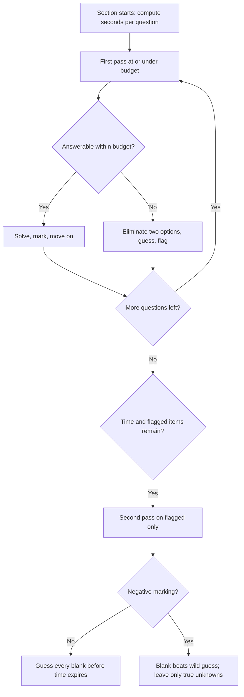

# Cognitive Ability Tests

## Overview

Cognitive ability tests measure reasoning, pattern recognition, and mental processing speed under a stopwatch, and they appear early in the pipeline for consulting, finance, banking tech, and several service-company drives. Unlike coding assessments, they are rarely won by brilliance — they are won by pacing, elimination discipline, and immunity to the per-question clock. These tests are frequently embedded inside larger OAs (SHL and AMCAT modules are the common carriers in Indian hiring) rather than delivered standalone. This page catalogs the test families with worked examples, the timing arithmetic that should drive your pacing, the tactics that squeeze extra answers out of a deadline, and the gamified formats that are quietly replacing MCQs at some companies.

## Test Families

| Family | What It Tests | Typical Format | Common carriers |
|--------|---------------|----------------|-----------------|
| Numerical reasoning | Percentages, ratios, reading tables and charts | Data table + 3-4 questions per table | SHL, AMCAT, CoCubes |
| Verbal reasoning | Comprehension and logical deduction from text | Short passage + TRUE/FALSE/CANNOT SAY | SHL, AMCAT, Mercer Mettl |
| Logical/inductive reasoning | Rule detection in sequences and shapes | Next-in-series, odd-one-out, matrix patterns | SHL, CoCubes, campus tests |
| Spatial reasoning | Mental rotation and visualization | Unfolded nets, rotated shapes, mirror images | Selected SHL/Mettl roles |
| Attention to detail | Accuracy at speed on lookalike data | Match product codes, names, or records | BPO/ops/analyst roles |
| Gamified assessments | Risk calibration, learning speed, impulse control | Short interactive games (5-20 min) | Pymetrics/Harver, Arctic Shores |

The families are learnable skills, not fixed IQ, and preparation genuinely moves scores — most providers say so themselves by selling practice packs. Each family has a signature question style, and recognizing the style is most of the battle because it tells you which solving routine to run. The sections below give one worked example per family so the routine is concrete rather than described.

Which families you face depends on the role more than the company. Analyst, consulting, and banking-tech roles weight numerical and verbal; software roles see mostly logical/inductive plus the coding sections; operations and support hiring leans on attention-to-detail; and design-adjacent or assessment-heavy grad schemes add spatial. Gamified batteries cut across all roles and have been growing fastest, particularly at multinationals running high-volume early-career hiring. When the invite names the test provider, search their public sample page first — knowing you face SHL verbal rather than a generic English quiz tells you the CANNOT SAY convention is in play.

## Worked Examples Per Family

### Numerical reasoning

A company's revenue grew from ₹4.2 crore to ₹5.88 crore in one year. What is the growth rate?

```
Growth rate = (5.88 − 4.2) / 4.2 × 100 = 1.68 / 4.2 × 100 = 40%
```

The routine is always the same: identify the baseline (the *old* value, never the new one), compute the absolute change, and divide by the baseline. The classic error is dividing by the new value, which the distractor options always include. Practicing percentage-change arithmetic until 40%-style answers appear in under 20 seconds is the highest-return numerical drill.

### Verbal reasoning

Passage: "All scheduled maintenance windows are communicated to customers at least 48 hours in advance. Emergency patches may be deployed without notice when a critical vulnerability is identified."

Statement: "Customers are always notified before any deployment."

Answer: **Cannot say / False depending on exact wording — here: False as a universal claim.** The passage says scheduled work is notified and emergency patches "may" be deployed without notice, so a universal "always notified" contradicts the emergency clause. The skill is refusing to import outside knowledge: only the passage counts. When the passage merely permits something rather than guarantees it, the correct answer is usually CANNOT SAY, and test-makers exploit exactly that distinction.

### Logical/inductive reasoning

Syllogism: All engineers are problem solvers. Some problem solvers are managers. Conclusion: Some engineers are managers.

> **Answer: Cannot be determined.** "Some problem solvers are managers" does not guarantee that the manager-overlap includes engineers — the two "some" sets can be disjoint.

Sequence: Find the next number in 3, 7, 15, 31, ?

```
Differences: 4, 8, 16, ... → next difference is 32
Answer: 31 + 32 = 63
Pattern: a_n = 2^(n+1) − 1
```

The sequence routine is a fixed checklist: check differences first, then ratios, then alternating patterns, then squares/cubes, then digit-level tricks. Differences catch roughly half of all test sequences, so starting there wins more often than any cleverness. When differences form a recognizable series (doubling here), extrapolate one more step and add.

### Spatial reasoning

A 3×3×3 cube is painted red on all faces and then cut into 27 equal small cubes. How many small cubes have exactly two painted faces?

```
Two-face cubes lie on edges but not corners.
Each edge of the big cube contributes (3 − 2) = 1 such cube.
The cube has 12 edges → 12 × 1 = 12 cubes.
```

Spatial questions become tractable when you classify positions: corners touch 3 faces, edge-middles touch 2, face-centers touch 1, and the core touches 0. The general formula for an n×n×n painted cube is 12(n−2) two-face cubes, and knowing the pattern beats re-visualizing under a clock. Practicing 20 of these teaches your brain the classification faster than any amount of staring at diagrams.

### Attention to detail

Reference code: `KH-8837-PL2`. Which candidate matches it exactly?

```
A: KH-8837-PL2   ← exact match
B: KH-8831-PL2   (3 → 1 in the fourth digit)
C: KH-8837-PLZ   (2 → Z at the end)
D: KJ-8837-PL2   (H → J transposition)
```

The routine is chunked scanning: compare segment by segment (prefix, digits, suffix) instead of "reading" the whole code, because the brain autocorrects lookalike characters at reading speed. Tests in this family typically run 60-90 seconds for 20+ comparisons, so accuracy comes from the chunking discipline, not from going slower. Ops, support, and analyst hiring weights this family heavily, and it is the one family where practice yields near-perfect scores.

## Timing Pressure Math

The clock, not the content, is the difficulty of cognitive tests. A common SHL-style verbal configuration gives 30 questions in 19 minutes, and a numerical module often gives 18 questions in 25 minutes — compute your budget before the first question appears:

- Verbal: \\( 19 \\times 60 = 1140 \\text{ s} \\) for 30 questions gives \\( 1140 / 30 = 38 \\text{ s} \\) per question, and that includes reading the passage.
- Numerical: \\( 25 \\times 60 / 18 \\approx 83 \\text{ s} \\) per question, which must cover reading the table, the question, and the arithmetic.

The verbal number is the one that shocks people: 38 seconds means you read a 100-word passage and answer, on average, in the time a stopwatch takes to say your name three times. The practical consequences are specific. Read the question stem *before* the passage when one passage serves several questions, because the stem tells you what to hunt for. On numerical tables, read the column headers and units first — most wrong answers come from using the wrong row or a percentage-versus-absolute mix-up, not from arithmetic. And pre-commit a skip rule (see below), because spending 90 seconds on one verbal question is a donation of two other questions' time.

Adaptive formats change the psychology one step further: a correct answer makes the next question harder, which means *feeling* challenged is a sign you are scoring well, not badly. Candidates who interpret rising difficulty as failure panic and rush easy items, compounding the error. If the platform advertises adaptivity, expect the difficulty to outpace your comfort and judge yourself by committed answers per minute, not by how easy the questions feel.

## Elimination and Estimation Tactics

Elimination is the core tactic because cognitive tests are MCQs with distractor design you can exploit. Numerical distractors are built from predictable errors — dividing by the wrong baseline, off-by-one on percentage points, mixing units (lakhs vs crores, minutes vs hours) — so any option matching one of those errors is provably wrong. Sequence distractors are usually the previous term, the term after next, or a pattern applied with an off-by-one, which lets you discard two options without finding the true pattern. Verbal CANNOT SAY questions hinge on modal words ("may", "must", "all", "some") — locate them in the passage before comparing answers.

Estimation covers the rest. On percentage questions, options are usually spread far apart (17%, 40%, 67%, 92%), so a one-significant-digit mental calculation (1.68/4.2 ≈ 0.4) picks the answer without exact arithmetic. On "which is larger" comparisons, cross-multiplication avoids division entirely. On sequences, computing two candidate patterns and checking which matches the furthest term resolves ambiguity in seconds. When negative marking is absent — check the instructions, because cognitive tests vary — an educated guess after eliminating two options has strongly positive expected value, and leaving blanks is strictly dominated.

## How These Tests Are Scored

Cognitive batteries report percentiles, not percentages, and understanding that changes what "good" means. A raw 70% can be the 85th percentile in a hard module or the 40th in an easy one, because your score is ranked against a norm group of recent candidates rather than against the paper. Recruiters then apply cutoffs by role — commonly the 30th-50th percentile for volume hiring and far higher for selective schemes — and some combine families into a composite where your weakest family drags the average. This is exactly why diagnostic-first practice targets the weakest family: raising a 40th-percentile family to 60th moves the composite more than pushing an already-strong family from 80th to 85th.

Providers also embed consistency and effort checks. Attention-check items ("select option B"), repeated items in different clothing, and implausibly fast response times all feed an effort score that can void an otherwise strong result. Answering every item at genuine reading speed, even when unsure, is both simpler and safer than trying to game the instruments. If your result is banded rather than numeric, treat the band description (for example "above average") as the recruiter's real cutoff unit and aim one band above your target role's stated bar.

## Gamified Assessments

Gamified tests (Pymetrics — now part of Harver — and Arctic Shores are the carriers most often seen in India-facing hiring) replace MCQs with 5-20 minute interactive games, and they measure the same constructs through behavior instead of answers. Knowing the mapping from game to trait demystifies them, because the games look like phone apps but score like psychometrics. There is no "correct answer" in these formats; there is only consistent, moderate behavior that reflects how you actually work.

| Game mechanic | What it looks like | What it measures |
|---|---|---|
| Balloon pump | Inflate a balloon for money; it may pop and zero your round | Risk calibration — reward for moderate, consistent risk-taking |
| Go/no-go | Tap when a target letter appears; withhold on X | Impulse control and sustained attention |
| Digit/number matching | Rapid "do these two numbers match?" under seconds | Processing speed and accuracy under pressure |
| Learning task | Hidden rule for which card wins; rule changes mid-game | Learning agility and adaptation to feedback |
| Trade-off allocator | Split limited resources between two parties | Fairness heuristics and decision consistency |

The strategy profile that scores well is the same one that describes a good employee: take moderate risks consistently, adapt when feedback contradicts your rule, and stay accurate rather than frantic when speed is demanded. Two practical warnings follow. First, trying to "game" the games usually backfires, because extreme strategies (never pumping, always pumping) produce flat, easily-flagged profiles. Second, these platforms track answer consistency across repeated items, so answer the untimed personality-style blocks honestly and steadily rather than performing a character.

Practical logistics for gamified batteries differ from MCQ tests in one important way: they usually run on mobile or tablet in a calm, untimed-per-question format, and they often come before any human sees your application. Treat the environment seriously anyway — headphones off, notifications silenced, both hands steady — because processing-speed games punish jittery touch input. Results typically return as trait bands shown to the recruiter alongside your application, and the same profile may be reused across every employer using that provider for a year, so a rushed first attempt has a longer shadow than most candidates assume.

## Practice Resources

| Resource | Best for | Notes |
|---|---|---|
| IndiaBIX | All MCQ families, Indian exam style | Huge free bank; practice with a stopwatch |
| 123test | Classical cognitive batteries | Free examples per family; international style |
| This book's aptitude track | Numerical and logical depth | Worked lessons with placement-level difficulty |
| Provider practice portals | Format familiarity | SHL and similar publish sample questions |
| Previous year campus papers | Real difficulty calibration | Ask your training-and-placement cell for archives |

Practice only counts if it is timed from day one, because untimed practice builds the wrong reflex — a correct answer in 3 minutes scores zero. Run one diagnostic per family first, rank your weakest family, and spend twice as much time there; most engineering candidates find numerical-under-time and spatial are their leaks. Two weeks of 30-minute daily sessions moves a cognitive score measurably, which is a far better return than the same hours spread randomly across topics.

### Mental-math drills that carry the numerical family

| Drill | Target | Daily dose |
|---|---|---|
| Percentage-change from round numbers | Sub-20 s answers | 10 questions |
| Fraction-percentage equivalents (1/6 ≈ 16.7%, 1/8 = 12.5%) | Instant recall | 2-min flash review |
| Two-digit multiplication by decomposition | Sub-15 s | 10 products |
| Ratio scaling (3:5 → total 96) | Sub-20 s | 5 questions |
| Table look-up with units check | Zero unit errors | 2 tables |

These drills exist because numerical reasoning is arithmetic under a stopwatch, and the stopwatch is what practice must simulate. Fraction-percentage equivalents alone eliminate a re-computation step from most percentage questions, which compounds into two or three extra answered questions per section. Track accuracy *and* time in a log; the log makes plateaus visible and tells you when to switch drills.

## Day-of Checklist

Cognitive tests are short, which makes silly failures expensive relative to the time invested. Run this list before any proctored or center-based cognitive assessment.

```
□ Instructions re-read: per-section timer, negative marking, allowed tools
□ Calculator policy confirmed (many ban them; practice mental math either way)
□ Rough paper + pen ready if permitted
□ Quiet room, notifications off, ID ready for proctored sessions
□ Platform sample test completed to learn the navigation controls
□ Skip rule pre-committed: first pass at ≤ budget/question, flag and return
□ Blank-sweep reminder: guess on flagged items if no negative marking
```

The skip rule and blank-sweep lines are on the checklist because they are decisions, and decisions made under timer pressure are worse than decisions made in advance. Mental math deserves one dedicated note: even when calculators are allowed, the calculator's second of focus is often slower than a drilled approximation, and several platforms disable it anyway. Ten minutes of daily percentage and ratio drills in the week before the test is the cheapest score improvement available anywhere in placement prep.

## Pacing Per Section

The pacing loop below is the operational core of this page: a pre-committed per-question budget, a hard skip rule, and a final sweep that never leaves blanks. It is deliberately mechanical, because under a 38-second clock you will execute whatever routine is automatic, not the one you are debating with yourself.



The two-pass structure is what makes the budget survivable: the first pass harvests every question that cooperates, and the second pass spends leftover time only where a real attempt exists. Flagging on platforms without a flag feature is still possible — note question numbers on rough paper — and it prevents the most common pacing failure, which is one hard question eating three easier ones. The negative-marking branch at the end is the only place the strategy forks, and you will know which branch applies before starting because you read the instructions.

## Rapid Practice Set

Work these under a stopwatch — 45 seconds each — before reading the solutions. They mirror the difficulty band where most campus cognitive testing sits, and the error patterns they exercise are the ones that cost real candidates real points.

**Q1:** What comes next: 1, 1, 2, 3, 5, 8, ?

> Fibonacci: each term is the sum of the previous two. Answer: **13**. When a sequence climbs slowly at first, test the sum-of-previous-two rule early because it is the most common slow-start pattern.

**Q2:** If 5 workers complete a task in 12 days, how many days will 3 workers take?

```
Total work = 5 × 12 = 60 worker-days
Days for 3 workers = 60 / 3 = 20 days
```

Answer: **20 days**. The work-rate invariant (workers × days is constant) solves every member of this family; the distractors usually come from dividing instead of multiplying.

**Q3:** A shirt costs ₹80 after a 20% discount. What was the original price?

```
80 = Original × 0.80
Original = 80 / 0.80 = ₹100
```

Answer: **₹100**. The trap is computing 20% *of 80* and adding it (₹96), which is exactly why a distractor of ₹96 always appears — divide by the remaining fraction, never add to the discounted price.

**Q4:** Statement: "Only postgraduates are eligible for the research grant." Candidate fact: "Ravi is eligible for the research grant." What follows?

> **Ravi is a postgraduate.** "Only X are Y" converts to "all Y are X" — eligibility implies postgraduation, but being a postgraduate would NOT imply eligibility. The direction of implication is the whole question, and misreading "only" is the most common verbal-logic error in campus tests.

**Q5:** A table shows quarterly sales of ₹12L, ₹18L, ₹27L, and ₹40.5L. What is the growth pattern and the next quarter's value?

```
Ratios: 18/12 = 1.5, 27/18 = 1.5, 40.5/27 = 1.5
Pattern: constant ×1.5 growth → next = 40.5 × 1.5 = ₹60.75L
```

Answer: **₹60.75L**. When differences do not look regular, test ratios immediately — a constant ratio means geometric growth, and the checklist ordering (differences, then ratios) finds it in seconds.

## Interview Questions

1. **How do cognitive tests differ from the aptitude section of a placement OA?** The content overlaps heavily — percentages, sequences, syllogisms — but the packaging differs. OA aptitude sections are usually non-adaptive with a shared clock, forgiving pacing, and Indian-exam question styles, while dedicated cognitive batteries (SHL-style) run hard per-section locks, shorter per-question budgets, and often adaptive difficulty that raises the ceiling when you answer correctly. Cognitive tests also mix in families OA aptitude rarely touches: CANNOT SAY verbal logic, spatial rotation, and attention-to-detail data matching. Preparation overlaps, so aptitude practice is never wasted, but the timing discipline must be rehearsed against the stricter format specifically.
2. **What do gamified assessments measure, and how should a candidate approach them?** They measure the same psychometric constructs as question batteries — risk calibration, impulse control, processing speed, learning agility — through interactive behavior instead of answers. The balloon task rewards consistent moderate risk, go/no-go tasks reward withholding inappropriate responses, and hidden-rule tasks reward updating behavior after negative feedback. The winning approach is to behave like a steady professional: moderate choices, fast consistent responses, and genuine adaptation when the rules change. Trying to reverse-engineer an "ideal profile" usually produces extreme, inconsistent data that the platform's consistency checks flag.
3. **A verbal module gives you 38 seconds per question including reading time. How do you actually pace that?** Read the question stem first so you know what to hunt for, then scan the passage only for the relevant claim. Locate the modal words — may, must, all, some — because CANNOT SAY and FALSE distinctions almost always hinge on them, and compare the answer options against the located claim rather than re-reading the whole passage. Pre-commit the skip rule: any question without a committed answer at ~35 seconds gets elimination-based guessing and a flag. The discipline feels uncomfortable for the first few questions, which is exactly why it must be rehearsed in timed practice rather than invented on test day.
4. **Why is elimination often faster than solving, and when does it break down?** Cognitive MCQs are built with distractors from predictable errors — wrong baseline in percentages, off-by-one in sequences, reversed modality in verbal — so recognizing a distractor's error source discards it without solving. Two eliminations turn a 25% guess into 50-60%, and combined with estimation (one-significant-digit arithmetic) many questions resolve in half the solving time. It breaks down when options are numerically close, which usually signals the test wants exact calculation, and when the question is genuinely unfamiliar, where guessing slowly is worse than flagging and moving on. The skill is diagnosing which regime a question is in within the first 5 seconds.
5. **If a test has no negative marking, why is answering every question strictly better?** With no penalty, a blank scores zero with certainty, while any guess — even uninformed — has positive expected value on a four or five option MCQ. Eliminating even one option raises the hit rate to 25-33%, and the option-pattern analysis most candidates can do (spotting outlier options, matching units) pushes realistic rates higher. Since cognitive tests are speed tests, most candidates do have 1-3 questions they never reached, so the final 20 seconds of blank-sweeping is free score. The only exception is a negative-marked section, where the fork flips and wild guessing becomes negative expected value — one more reason instructions are the first thing you read.

## Key Takeaways

- Recognize the family before solving: numerical, verbal, logical, spatial, attention, gamified each have a fixed solving routine.
- Compute seconds-per-question before starting — verbal batteries often allow ~38 s per question including reading, and that number dictates everything.
- The sequence checklist (differences → ratios → alternating → powers → digits) catches most inductive patterns; differences alone catch about half.
- Elimination and estimation exploit distractor design: wrong-baseline options and modal-word traps are meant to be spotted, not solved around.
- Gamified tests score behavior, not answers — moderate risk, consistent responses, and genuine adaptation beat any "optimal profile" strategy.
- Two-pass pacing with a pre-committed skip rule prevents the classic failure of one hard question eating three easy ones.
- No negative marking means never leave blanks; negative marking means guess only after eliminating two options.
- Providers report percentiles against a norm group, so the weakest family drags the composite the most — diagnose first, then drill the leak.

## References

- IndiaBIX — free aptitude and reasoning question banks: <https://www.indiabix.com/>
- 123test — classical cognitive ability practice tests: <https://www.123test.com/>
- SHL — assessment provider, sample questions and formats: <https://www.shl.com/>
- Harver (Pymetrics) — gamified behavioral assessment platform: <https://www.harver.com/>
- Arctic Shores — gamified psychometric assessments: <https://www.arcticshores.com/>
- Mercer Mettl — cognitive and aptitude testing for Indian recruiters: <https://www.mettl.com/>
- AMCAT — employability assessment with reasoning modules: <https://www.amcat.com/>

## Cross-References

- [Aptitude Index](../aptitude/README.md) — the numerical and logical practice track behind these test families
- [Data Interpretation](../aptitude/data-interpretation.md) — the table-reading skill numerical reasoning tests run on
- [Logical Reasoning](../aptitude/logical-reasoning.md) — deeper syllogism and series practice
- [Percentages](../aptitude/percentages.md) — the arithmetic engine of numerical reasoning questions
- [Online Assessment Strategy](./online-assessment.md) — where cognitive modules sit inside the larger OA
- [MCQ Strategies](../interview/coding/mcq-strategies.md) — elimination and guessing policy shared with CS MCQs
