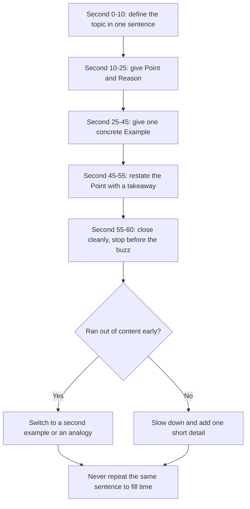

# Communication Assessment Rounds

## Overview

Communication rounds evaluate how clearly you explain ideas, handle pushback, and adapt your language to different audiences. In Indian campus hiring they are a mass-hiring filter — most services companies and support-heavy roles run one as a scored round (JAM, extempore, email test, or an AI-scored spoken-English module), and they are common in consulting, product, and leadership-track roles too. The round is eliminatory: a technically strong candidate can be rejected purely on the communication score, because the role assumes you will talk to managers, clients, or documentation every day. The skills tested are narrower than people fear — fluency, structure, pronunciation clarity, and task completion — and all four respond to a week of targeted drills.

## What Communication Rounds Test

### CEFR-style proficiency levels

Evaluators — human or automated — implicitly rate you on CEFR-style bands. Knowing the bands tells you exactly what to fix: mass-hiring cutoffs sit at B1–B2, and client-facing engineering expects B2, with C1 reserved for consulting-type roles. Identify your own band honestly from a recorded 60-second sample, and the table below becomes a checklist rather than a mystery.

| Level | Can do | Campus-hiring expectation |
|---|---|---|
| A1–A2 | Basic phrases, isolated words, rehearsed lines only | Below cutoff — auto-reject in scored rounds |
| B1 | Connected sentences on familiar topics; frequent pauses; simple grammar | Typical minimum for mass-hire support roles |
| B2 | Clear, detailed argument; handles interruptions; understandable at natural pace | Standard target for engineering roles with client contact |
| C1 | Flexible, nuanced professional use; near-effortless topic shifts | Consulting, customer-facing specialist roles |
| C2 | Near-native command | Rarely required in campus hiring |

The official CEFR framework, maintained by the Council of Europe, defines these levels and the can-do statements behind them; commercial tests (Cambridge, IELTS, Versant) publish mappings to it. For placement purposes the practical reading is: reach solid B2 and nearly every campus communication bar clears.

### Fluency vs accuracy

Fluency is the flow of speech — pace, pauses, and the ability to keep generating content without long silences. Accuracy is correctness — grammar, word choice, and sentence construction. Evaluators weight them roughly: fluency and organization decide pass/fail, accuracy only differentiates at the top band. A candidate who speaks continuously with small grammar slips ("He go to office") usually outscores one who speaks perfect but halting fragments. The two habitual accuracy errors that do cost marks are tense confusion that distorts meaning and article misuse so constant it distracts — fix those two first and ignore exotic grammar.

## Formats and Platforms

| Format | Typical length | What it measures |
|---|---|---|
| Extempore speech | 1–2 min after 1 min prep | Structure, fluency, confidence under prep pressure |
| JAM (Just a Minute) | 60 s non-stop | Continuous content generation; hesitation control |
| Email writing | 10–15 min, 100–150 words | Structure, tone, task completion, written grammar |
| Reading aloud | 60–90 s | Pronunciation, word stress, pausing at punctuation |
| Listening comprehension | Audio + questions, 10–15 min | Understanding varied accents and speeds |
| Video group discussion | 10–20 min | Turn-taking, listening, collaborative reasoning |
| Telephonic round | 10–15 min | Clarity without visual cues; accent neutrality |

Several companies score these with AI platforms rather than human evaluators, especially at online-assessment scale. Knowing what the AI extracts tells you what to optimize. The platforms differ in UI but converge on the same underlying speech signals:

| Platform | Where you meet it | What it scores |
|---|---|---|
| SHL (incl. AI video interview) | Online assessment stage of many product/consulting firms | Speech content, competencies, voice signals in recorded answers |
| AMCAT SVAR (SHL group) | Mass-hiring spoken-English module | Pronunciation, fluency, grammar, listening comprehension |
| Pearson Versant | BPO/support and some engineering hiring | 20–80 scale mapped to CEFR: pronunciation, fluency, vocabulary, grammar across read/repeat/respond tasks |
| Cambridge English / IELTS | Certification benchmarks | CEFR-aligned band scores; useful as external proof, uncommon in campus OAs |

Automated speech scoring is strict about mechanical signals: sustained pace (~130–150 wpm), pauses shorter than a second, and pronounceable full sentences matter more than vocabulary. This is good news for preparation — the mechanical signals are the most trainable part of speech.

## Extempore and JAM: the PREP Framework

PREP — Point, Reason, Example, Point — is a complete 60-second answer generator that works for virtually any JAM or extempore prompt. It replaces panic with a fixed sequence: you always know what kind of sentence comes next. The table below maps the four slots onto a one-minute clock.

| Slot | Time | Job |
|---|---|---|
| Point | 0–10 s | One-sentence position on the topic |
| Reason | 10–25 s | Why the point holds — the mechanism |
| Example | 25–45 s | One concrete, specific instance |
| Point (restate) | 45–60 s | Restate the point, now earned by the example |

Worked script — prompt: "Should internships be mandatory in every engineering program?"

> Point (0–10 s): "Yes — internships should be mandatory, because they convert theory into workplace judgment."
> Reason (10–25 s): "Classroom work is graded on correctness; companies grade on constraints — deadlines, legacy code, real users. Only exposure teaches that gap."
> Example (25–45 s): "In my internship, an API I had 'finished' in a course project broke in production under 500 concurrent users. I learned profiling and caching in one week — no assignment ever forced that."
> Point (45–60 s): "So a mandatory internship isn't a formality; it compresses two years of learning into two months."

The script is about 120 words — inside the 130–150 wpm band with room to breathe. Practice PREP on ten random prompts and it becomes automatic; the framework also covers extempore (extend each slot) and async video GD answers (keep 60–90 s). When you blank mid-answer, return to the framework: the next slot tells you what kind of sentence comes next.

## JAM Minute Structure



Two JAM-specific rules sit behind the diagram. First, silence is the primary failure mode — evaluators accept imperfect grammar far more readily than a 5-second gap, so learn the recovery move (jump to a second example) as a reflex. Second, do not ride the clock: stopping crisply at 55–60 seconds signals control, while mumbling past the buzzer signals panic.

## Email Writing Tests

The prompt is usually a workplace situation — a missed deadline, an apology to a client, a request to a professor — graded on task completion, structure, tone, brevity, and grammar. Word limits are tight (typically 100–150 words), so every sentence must earn its place. Structure for a technical audience:

- Subject line with context and the action needed
- One-sentence summary of the situation (most important fact first)
- Background (2–3 sentences, with dates)
- Options or proposal with rationale
- Next steps with owners and deadlines

Model answer — prompt: "You own the payment-bug fix that will miss Friday's release. Email your manager."

```text
Subject: Payment-bug fix — status and revised plan for Friday release

Hi Ravi,

Summary: The UPI double-charge fix will not be fully verified by
Friday. I recommend releasing the database part on Friday and moving
the API change to Monday.

Background: We found two edge cases in staging on Wednesday evening
(refund-after-retry and offline retry). Both are fixed locally, but
regression testing needs three more days with the payments QA team.

Options:
1. Partial release Friday (DB fix only) — low risk, covers most of
   the customer impact.
2. Full release Monday, after complete regression.

My recommendation: option 1, with a support note prepared for any
affected customer who writes in.

I have already aligned with QA on the Monday test window. Could you
confirm the call by 5 pm today?

Regards,
Anita
```

Why this scores full marks on every rubric line: the subject line carries status plus plan; the first sentence answers the implicit question ("will Friday happen?") before any detail; facts have dates, not adjectives; it offers options instead of dumping the problem upward; the recommendation is stated with a reason; and the closing asks for exactly one decision by a stated time. Common failures to avoid: missing the actual ask hidden in the prompt (grad rubrics call this task completion), blame-shifting ("QA was slow"), walls of text with no summary line, and over-apologizing in place of proposing a fix. The same skeleton covers apology emails, client escalations, and professor requests — only the content slots change.

## Explaining Technical Concepts (ADEPT)

For technical-explanation rounds and system-design walkthroughs, adjust depth to your audience using ADEPT. The framework sequences a concept from familiar to technical so the listener is never lost. Work through the steps in order and stop as soon as the audience signals understanding:

| Step | Action | Example (Explain Caching) |
|------|--------|-----------------------------|
| **A**nalogy | Start with a familiar comparison | "Like keeping frequently used books on your desk" |
| **D**iagram | Draw a simple picture | Client → Cache → Database |
| **E**xample | Give a concrete scenario | "A product page loaded in 50ms instead of 2s" |
| **P**rimer | Define the technical term | "A cache stores computed results for faster reuse" |
| **T**echnical detail | Add depth as needed | "LRU eviction, TTL, cache invalidation strategies" |

**Common mistake:** jumping to technical detail before establishing context. Always confirm the audience's familiarity first.

For system-design walkthroughs, keep the top-down order: restate the problem, state assumptions explicitly, present the high-level architecture before components, explain each component with its trade-off, address failure modes, and summarize the key decisions. For behavioral answers, use STAR with emphasis on the Action — interviewers want your reasoning, not just outcomes: quantified results ("reduced p99 latency by 93%") beat adjectives ("improved performance").

## Fluency, Fillers, and Pronunciation Fixes

Filler words ("um", "actually", "basically", "like", "you know") are the most visible fluency defect and the easiest to fix. Record a 60-second answer, count the fillers, and then re-record replacing each filler with a one-second closed-mouth pause — a pause reads as thought, while a filler reads as panic. Target fewer than three fillers per minute within a week; the pause habit does most of the work because fillers exist to fill pauses you have not yet learned to tolerate.

Pronunciation scoring cares about word stress and final sounds more than accent. A neutral Indian accent is fully intelligible; errors in stress and endings are what trip both AI models and human listeners. Drill list for Indian English speakers, chosen for how often the words appear in interviews:

| Word / pattern | Common error | Target |
|---|---|---|
| phoTOgraphy | PHOtography | pho-TO-gra-phy (stress shifts from PHOtograph) |
| develop / development | DE-velop | di-VEL-up / di-VEL-up-ment |
| colleague | col-LEAGUE | KOL-eeg |
| determine | DE-ter-mine | di-TER-min |
| hierarchy | hi-ER-archy | HY-rar-kee |
| -ed endings ("asked") | "axed" / "aksed" | "askt" — one clean final cluster |
| v vs w | "west" for "vest" | teeth-on-lip for v; rounded lips for w |

Shadowing is the highest-yield daily drill: play a news clip, and repeat the anchor's sentence 1–2 seconds behind the audio, copying stress and rhythm rather than accent. Ten to fifteen minutes a day for a week measurably changes pacing and sentence melody. Clarity is the goal, not accent elimination — Versant-style scorers and human evaluators both reward intelligibility at natural speed, which is a learnable mechanical target. For structured offline practice, Toastmasters clubs give the same feedback loop with humans; Cambridge Dictionary's free audio pronunciations cover the stress list above.

## 7-Day Improvement Plan

| Day | Focus | Drill (time) | Check |
|---|---|---|---|
| 1 | Baseline | Record a 1-min JAM on a random prompt; count fillers, words per minute, silences (20 min) | Numbers written down |
| 2 | Fluency | Shadow a 10-min news clip; one PREP answer re-recorded (30 min) | Fillers down vs day 1 |
| 3 | Structure | Ten PREP drills on random prompts, 2 min each (30 min) | Framework recalled without notes |
| 4 | Written | Three email prompts, 10 min each; self-check against the rubric lines (30 min) | Summary-first + one clear ask |
| 5 | Pronunciation | Stress list (10 words × 10 reps); minimal pairs v/w, final -ed (20 min) | Recording of the list for comparison |
| 6 | Listening | Summarize two 5-min podcasts in 3 bullets each (25 min) | Bullets without rewinding |
| 7 | Full mock | JAM + email test under exam timing; re-score against day-1 numbers (30 min) | Before/after scorecard |

Run the plan twice if your baseline is weak: the second cycle starts from your day-7 recording, which is the honest measure of progress. Pair the drills with real exposure — volunteer to present in class or club meetings — because scored rounds add pressure that solo recording does not reproduce. The plan is deliberately 30 minutes a day; consistency beats marathon weekend sessions for motor skills like speech.

## Common Prompts

Practise on the prompts that actually appear; they rotate less than people expect. Time yourself on each list below under exam conditions, not casually — fluency under a countdown is a different skill from fluency over a relaxed evening. Rotate topics until every format has been drilled at least twice.

- **JAM/extempore topics:** "Red"; "Coffee vs tea"; "Is social media making us less social?"; "Online exams vs offline exams"; "The number 7"; "Freedom"; "Leadership vs management"; "Should coding be taught in school?"; "One lesson from a failure"; "The best thing about my college"; "Technology and loneliness"; "Should attendance be mandatory?".
- **Abstract (decode, don't describe):** "A square has 4 sides"; "Black"; "A bridge"; "The letter M" — use the four-step decode from the [Group Discussion](./group-discussion.md) page.
- **Email prompts:** inform your manager of a missed deadline; apologize to a client for a delayed response; request a transcript from your college office; decline a job offer politely; escalate a blocked dependency to a senior.
- **Reading-aloud sources:** newspaper editorials and business news at 130–150 wpm; Versant sample tasks on the official site; anything you can record and replay against the original.

## Interview Tips

- Pause before answering; a 3-second silence shows thoughtfulness, not hesitation.
- If interrupted, let the interviewer finish, then acknowledge their point before continuing.
- Ask clarifying questions — it demonstrates active listening.
- Avoid jargon when the interviewer has a different background.
- Restate the question back once ("So you're asking whether...") before long answers — it buys thinking time and proves listening.
- End explanations with a summary sentence to confirm shared understanding.
- Mirror the interviewer's pace: slower and quieter than they are, never the reverse.

## Interview Questions

1. **Fluency vs accuracy — which matters more in a JAM?** Fluency, decisively, because the round's primary elimination trigger is silence, not grammar. A candidate who speaks continuously with small slips demonstrates content generation under pressure — the actual skill being screened. Accuracy only differentiates at the top band, and only two error classes cost marks at B1–B2: meaning-distorting tense errors and constant article misuse. Spend preparation time on pace and structure first; grammar polishing comes last.
2. **How are AI-scored tests like Versant or SVAR evaluated?** They extract mechanical speech signals: pronunciation clarity against a reference model, fluency markers (words per minute, pause length and frequency), plus grammar and vocabulary from transcribed speech, often mapped to a CEFR-aligned score band. This changes your optimization targets: sustained 130–150 wpm, sub-second pauses, complete sentences, and clean word stress beat fancy vocabulary. Reading-aloud and repeat tasks are scored heavily on stress and final sounds, which is why the pronunciation drill list matters. Practice on the platform's official sample tasks where available.
3. **You blank out mid-JAM. What do you do?** Jump to the framework, not the topic: the PREP slots tell you what kind of sentence comes next, so "for example..." is a legal next move from any position. Have a pre-loaded second example per common topic and switch to it — new content, not repetition, is what the rubric rewards. If truly stuck, a controlled summary sentence ("So the core point is that X, because Y") buys 8 seconds to reload. Practice the blank-out deliberately by running drills where you force a topic switch every 20 seconds.
4. **What loses the most marks in an email-writing test?** Task completion — answering the actual ask in the prompt. Many candidates write a beautifully structured email that never states the requested decision, apology, or commitment, and rubrics weight the missing intent above grammar. The second-largest loss is structure inversion: burying the key fact in paragraph three instead of a summary-first subject line and opening sentence. Tone failures (blaming others, over-apologizing) and walls of text round out the list; all four are fixed by the annotated model email above.
5. **How much can you realistically improve in a week?** Measurably more than people expect, because the scored signals are mechanical. Fillers fall with the pause-substitution habit, pace stabilizes with shadowing, structure becomes automatic after ten PREP drills, and email structure is a template you can memorize in one sitting. Pronunciation gains concentrate in the ten-to-twenty highest-frequency words and two or three sound patterns. What one week does not fix is deep vocabulary or accent — so preparation should target fluency, structure, and stress, in that order.

## Key Takeaways

- Communication rounds are scored against CEFR-style bands; campus cutoffs sit at B1–B2 and client-facing roles expect B2.
- Fluency and structure decide pass/fail; accuracy only differentiates at the top — silence is the primary elimination trigger.
- PREP (Point-Reason-Example-Point) is a complete 60-second answer generator for JAM, extempore, and async video GDs.
- Email tests grade task completion first: answer the implicit ask, then structure (summary-first), then tone, brevity, and grammar.
- AI platforms score mechanical signals: 130–150 wpm, sub-second pauses, word stress, and final sounds.
- Fillers are a pause-tolerance problem; substitute a one-second pause and count your progress in recordings.
- A 7-day, 30-minutes-a-day plan with recorded baselines moves most students one full band.

## References

- [Council of Europe — CEFR (Common European Framework of Reference for Languages)](https://www.coe.int/en/web/common-european-framework-reference-languages)
- [SHL — Talent Assessment Platform](https://www.shl.com/)
- [AMCAT — Employability Assessment (SHL group)](https://www.myamcat.com/)
- [Pearson Versant — Automated Language Tests](https://www.versanttest.com/)
- [Cambridge English — Exams and Tests](https://www.cambridgeenglish.org/)
- [Cambridge Dictionary — Audio Pronunciations](https://dictionary.cambridge.org/)
- [Toastmasters International — Public Speaking Practice](https://www.toastmasters.org/)

## Cross-references

- [Interview communication](../communication/interview-communication.md)
- [Technical communication](../communication/technical-communication.md)
- [Written communication](../communication/written-communication.md)
- [STAR method](../behavioral-interviews/star-method.md)
- [Technical interview preparation](./technical-interview.md)
- [Group Discussion](./group-discussion.md) — video GD formats and the abstract-topic decode routine
