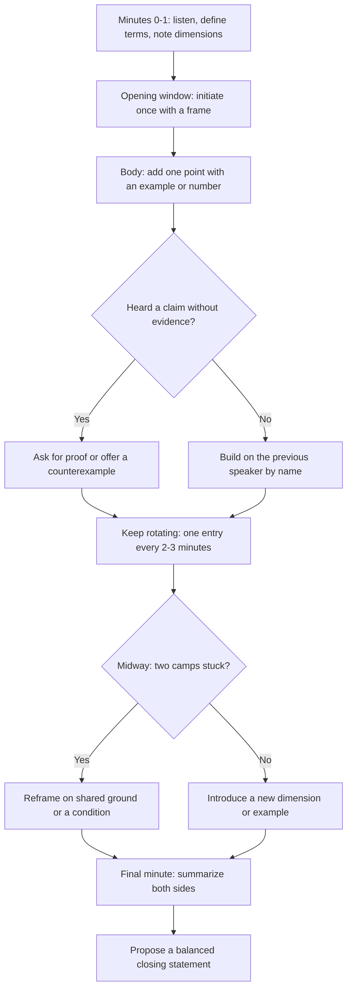

# Group Discussion Preparation

## Overview

A group discussion (GD) evaluates structured thinking, listening, collaboration, and clarity under time pressure, usually with 8–12 candidates over 10–20 minutes and one or two evaluators watching. The goal is not to speak the most; it is to help the group reach a better, evidence-based conclusion. GDs are the standard screening round for mass campus hiring at services companies, and they also appear in analyst, consulting, and management-trainee processes. Evaluators score a small number of concrete behaviors — framing, content, listening, summarizing — all of which are trainable in a week of deliberate practice.

## GD Formats

### Topic-based GDs

You get a statement ("Social media does more harm than good"), a minute of prep, and then an open debate. Evaluators expect you to define terms, take a position with reasons, and respond to the other side. These reward candidates who bring pre-loaded facts and a clear two-sided structure. Most campus GDs are of this type, so this format is where practice hours pay off the most.

### Case-based GDs

You receive a short business or ethical scenario — "You are the plant manager; a batch may be defective; ship or hold?" — and the group must reach a decision or recommendation. Evaluators score structured problem-solving: state assumptions, list options, evaluate against criteria, and converge. Loud debate is actively penalized here because the task is a decision, not a contest.

### Abstract GDs

The topic is a phrase or image ("A square has 4 sides", "Red", "The letter M") with no obvious right answer. The test is lateral thinking: can you map the abstract to real dimensions and stay coherent? Nobody expects the "correct" interpretation; evaluators check whether your interpretation is internally consistent and whether you can build on others' mappings. Handling these well needs a decode routine, covered below.

| Format | Example prompt | What evaluators look for | Main risk |
|---|---|---|---|
| Topic-based | "AI will create more jobs than it destroys" | Two-sided reasoning, data, position | Turning into a shouting match |
| Case-based | "Ship the possibly-defective batch or hold the line?" | Structured decision-making, assumptions, trade-offs | Ignoring the criteria, monologuing |
| Abstract | "A square has 4 sides" | Lateral mapping, coherence, build-on ability | Random word association with no thread |

## How You Are Evaluated

| Parameter | Strong signal (top score) | Weak signal (bottom score) |
|---|---|---|
| Initiation | Framed the topic with definitions and dimensions in the first minute | Stayed silent for the first 5 minutes, or initiated with a slogan |
| Content | Each entry made one new point with an example or number | Repeated the same point in different words |
| Listening | Built on ("Adding to Priya's point..."), invited quiet members in | Interrupted, ignored the previous speaker, switched topics |
| Summarizing | Mid-way checkpoint and a final synthesis of both sides | No summary, or a one-sided "victory lap" |
| Body language | Open posture, eye contact around the group, calm hands | Crossed arms, pointing fingers, staring at one evaluator |
| Frequency | 3–5 quality entries spread across the session | 1–2 entries total, or 10+ shallow interruptions |

Most evaluators use a sheet close to this rubric, marking each candidate a few times during the session. Two implications follow directly. First, initiation is worth a lot, so a prepared 30-second frame is the highest-leverage skill you can rehearse. Second, summarizing is the most under-used scoring opportunity — most students compete for the opening minute and leave the closing minute unclaimed.

## The First 30 Seconds: Initiation Templates

Initiate only if you have a genuine frame; a weak initiation wastes your one opening and hands the slot to the next speaker. If someone else initiates well, become the strong second speaker — agreeing-with-addition scores almost as well. Rehearse both roles, because in a 10-person group the initiation slot goes to exactly one person and the rubric still has five other rows to score.

- **Definition frame:** "Before we pick sides, let's define the terms. By 'AI' I mean automation of cognitive work, not robots — and I see three dimensions: economic, social, and implementation. Let me start with the economic one."
- **Scope frame:** "This topic is huge, so let's scope it to India and to the next five years. Within that scope, I'd argue..."
- **Dichotomy frame:** "There are really two different questions here: what happens to jobs that exist today, and what jobs get created. The evidence differs for each."
- **Data frame:** "Let me put one number on the table: over 16 billion UPI transactions happen every month (NPCI, late 2024). On digital payments, India is a leader — and that shapes my position on this topic."

Aim for 20–30 seconds of speech, end with an open contribution ("...I'd like to hear how others see the social side"), and then genuinely listen for the next two minutes. Initiation earns you airtime; the quality of your follow-ups decides whether you keep it. Candidates who initiate and then go silent read as one-trick, which is why the templates below end with a handoff rather than a speech.

## Entering a Fish Market Politely

When five people talk over each other, evaluators watch who enters without adding to the noise. The reliable entry sequence is: lean forward slightly and raise a hand (or the pen), wait for the first pause in a sentence — not the end of a rant — then enter with the previous speaker's name.

- "Adding to what Priya said..."
- "Priya, I agree with your conclusion, but the reason is different..."
- "Before we move on, can we put one number on this claim?"
- "Rahul, that's valid for metros — the tier-2 picture is different, and here's why..."
- "We've made the same point three times now. Let me suggest a new dimension: the implementation cost."

Two nonverbal rules do most of the work. Enter on an inhale pause, never mid-word, and always attach your first sentence to the previous speaker so it sounds like collaboration rather than interruption. If you are genuinely squeezed out for minutes, a raised hand plus a calm "I'd like to add a counterexample when there's a pause" is itself a scored listening behavior.

## Agree to Disagree: Concession Moves

Direct contradiction ("No, that's wrong") scores lowest on the rubric and escalates the room. The high-scoring pattern is concede-condition-extend: grant the point in its narrow form, state the condition where it holds, then extend to the part where it fails.

- "That's true in the short run — over a decade, the incentives change, and here's how..."
- "I agree for large enterprises. The question is MSMEs, where the compliance cost is a bigger share of revenue."
- "You're right about the intent; my concern is implementation — the last-mile leakages in DBT were X% before Aadhaar seeding."
- "That's one way to read the data. The same numbers support the opposite reading if you look at the denominator."

Conceding a small point also buys credibility for your bigger disagreement: evaluators consistently rate candidates who can say "fair point" higher than candidates who defend every inch. If the disagreement is genuinely irreconcilable, name it cleanly — "I think we'll have to agree to disagree on the premise; can we at least agree on the criteria a good answer needs?" — and move the group forward.

## Data-Backed Arguments: Numbers Worth Memorizing

One relevant number, rounded and sourced, outperforms three adjectives. You do not need twenty facts; you need a dozen that cover the economy, jobs, digital adoption, and social sectors — the recurring arenas of Indian GD topics. Build the table below into a phone note and revise it the night before any GD round.

| Fact | Approximate value (as of) | Cite as |
|---|---|---|
| India's population | ~1.4 billion, world's largest | UN estimates, 2023–24 |
| Median age | ~28 years | UN/MoSPI |
| Nominal GDP | ~USD 3.9 trillion, among the top five economies | MoSPI/IMF, 2024–25 |
| UPI monthly transactions | Crossed 16 billion/month in late 2024 | NPCI |
| Share of global real-time payments | Roughly half | ACI Worldwide, 2024 |
| PM Jan Dhan accounts | 53+ crore accounts | PMJDY official site, 2024 |
| Aadhaar enrolments | ~1.38 billion | UIDAI, 2024 |
| Unemployment rate (survey-based) | ~3.2% (PLFS 2022–23); household surveys like CMIE report higher — different methods | MoSPI PLFS vs CMIE |
| Female labour-force participation | Rose to ~41% (PLFS 2022–23) from ~23% five years earlier | MoSPI PLFS |
| Non-fossil power capacity | Crossed 200 GW in 2024, ~46% of installed capacity | MNRE/CEA |
| Internet users | Roughly 900 million | TRAI/IAMAI estimates, 2024 |
| Chandrayaan-3 | Soft landing near lunar south pole, Aug 2023, ~₹615 crore cost | ISRO |

Three deployment rules keep numbers working for you instead of against you. Round the figure ("about 16 billion"), name the source ("NPCI data"), and use at most one number per argument — a string of statistics sounds rehearsed and invites a fact-check you may lose. If challenged on a number, the correct move is intellectual honesty: "That's the latest figure I have; the direction is undisputed even if the exact value moved." That sentence scores better than defending a stale decimal.

## Common Recent Topics with 3-Point Skeletons

Memorize skeletons, not essays: three points for, three against, one synthesis line. The skeletons below have recurred in campus GDs in recent years and generalize to adjacent topics. In the room, argue whichever side the first speakers left weaker — entering the under-argued side is far easier than joining a crowded majority.

### "AI will create more jobs than it destroys"

| Side | Points |
|---|---|
| For | Every automation wave created new categories (cloud, data, MLOps); AI raises productivity, so demand and wages can grow; India's services and GCC hiring absorbs reskilled talent |
| Against | Displacement is skill-biased — entry-level coding and BPO work are directly exposed; reskilling is slower than model release cycles; gains concentrate in few firms and cities |
| Close | Net effect depends on reskilling speed; the debate is really about policy and corporate L&D, not the technology |

### "Social media does more harm than good"

| Side | Points |
|---|---|
| For | Misinformation spreads faster than corrections (PIB fact-check workload); documented mental-health effects on teenagers; the attention economy fragments study and work |
| Against | Democratizes information and livelihoods (creator economy); distribution channel for government schemes and disaster response; gives small businesses free reach |
| Close | Harm comes from engagement-optimizing design, so the fix is regulation plus digital literacy, not bans |

### "Return to office vs work from home"

| Side | Points |
|---|---|
| For RTO | Mentorship for juniors happens in person; faster collaboration on ambiguous problems; security and culture are easier to maintain |
| For WFH | Saves 2–3 hours of metro commute daily in Indian metros; widens the talent pool (women returnees, tier-2 cities); cuts real-estate cost |
| Close | Hybrid with anchor days and outcome-based metrics is where most large firms are converging |

### "Freebies: welfare investment or fiscal burden?"

| Side | Points |
|---|---|
| Burden | Power and input subsidies crowd out capital spending and weaken DISCOM finances; unconditional transfers can blunt work incentives; competitive populism strains state budgets |
| Investment | DBT through Jan Dhan-Aadhaar cut leakages in LPG and scholarships; nutrition and mid-day meals raise enrolment and productivity; health cover (PM-JAY) prevents catastrophic household spending |
| Close | Distinguish merit goods (health, education, nutrition) from private-good subsidies; means-test and sunset clauses decide whether a scheme is investment or drain |

### "Skill-based hiring will replace degree-based hiring"

| Side | Points |
|---|---|
| For | Large tech employers have dropped degree requirements for many roles; skill shortages in cloud and cyber do not respect CGPA; portfolios and certifications prove current competence |
| Against | Degrees signal sustained discipline and fundamentals; regulated professions still legally require degrees; Indian mass hiring remains degree-gated for scale reasons |
| Close | Hybrid outcome — degree as foundation, demonstrable skill as currency; the portfolio keeps getting heavier every year |

## Abstract Topics: Decoding "A Square Has 4 Sides"

Use a four-step decode: name the properties, map each property to a real domain, pick the two mappings you can argue best, and close with a synthesis. For the square: four equal sides suggest balance and completeness (four pillars of a career — skill, attitude, communication, ethics; four stakeholders of a product — users, engineering, business, ethics); the rigidity of a square suggests both structure and inflexibility (process helps and traps); equal sides suggest equality (uniform policy vs differentiated treatment). You then argue, for example, that a career is strong only when all four sides are equal — brilliant skills cannot compensate for zero communication — and note the counterpoint that real life is rarely symmetric.

Two abstract-handling habits score directly. First, when another candidate offers a mapping, extend it ("Taking Priya's four-pillar idea further, the sides must be equal — which is exactly what balanced curricula try to do") instead of offering a rival mapping. Second, close by connecting two mappings: "Whether we read the square as completeness or as constraint, the common lesson is that strength comes from structure, not from any single side." Evaluators of abstract GDs reward coherence across your entries more than cleverness in any single one.

## Remote and Async Video GDs

Video GDs are now common for internships and off-campus drives, and they have their own failure modes — frozen feeds, talk-over collisions from latency, and evaluators who can only see what your camera frames. Tech and setup decisions are scored indirectly because they shape your participation:

- Join 5 minutes early; camera at eye level, face lit from the front, plain background, formal dress.
- Keep the mic muted when not speaking to cut keyboard and fan noise; unmute a half-second before talking.
- Latency makes talk-over collisions frequent: enter with the speaker's name ("Adding to Rahul...") and a raised hand on the platform's reaction bar.
- Look at the camera lens (not the faces) when making your key points — that is what "eye contact" means to the evaluator.
- Use chat only for substance (a link, a crisp one-line point), never for side-conversations; evaluators can read it.

Async video GDs — you record a 60–90 second response to a prompt, sometimes with one retake — reward structure over spontaneity. Use the PREP framework from the [Communication Assessment Rounds](./communication-round.md) page: point, reason, example, point. Write three bullet notes beside the camera, deliver to the lens at 130–150 words per minute, and finish cleanly at 80 seconds rather than trailing at 95. If a retake is allowed, rehearse once aloud before recording; do not reshoot endlessly for perfection — evaluators score natural delivery, not production value.

## Contribution Strategy Across Phases

### First minute: frame the question

Define the terms, state the scope, and separate facts from assumptions. If the topic is broad, propose two or three dimensions such as economic, social, technical, ethical, or implementation impact. This is the initiation slot; use one of the templates above and hand off with an open question.

### Middle: add and connect ideas

Make one clear point at a time. Build on another speaker's idea, ask a useful question, or introduce a counterexample with data from the table above. Useful sentence patterns:

- "I agree with the goal, and I would add one implementation constraint..."
- "There are two different questions here: short-term impact and long-term..."
- "Can we distinguish the evidence from the assumption in that claim?"
- "A counterexample is..., so I would qualify the original statement."

### Final: synthesize

Summarize the strongest arguments on both sides, identify the conditions under which each applies, and propose a balanced conclusion or next step. A mid-way checkpoint ("Let me summarize where we agree so far...") is also available and almost nobody takes it. The final 60 seconds is the cheapest scoring window in the entire round.

## Behaviors and Mistakes

### Behaviors to demonstrate

- Listen without interrupting; enter on pauses, not mid-sentence.
- Invite a quiet participant into the conversation ("We haven't heard from...") — evaluators score this heavily.
- Disagree with reasoning, never with a person.
- Keep the discussion on the question; pull it back when it drifts.
- Admit uncertainty and propose how to verify it.

### Mistakes to avoid

- Speaking repeatedly without advancing the argument — volume is not content.
- Treating confidence or loudness as evidence.
- Interrupting, dismissing, or personally attacking another speaker; this is the fastest route to elimination.
- Changing the topic when challenged instead of answering.
- Refusing to summarize because the group did not reach perfect agreement — a summary of the disagreement still scores.

## Practice Plan

For a single 10-minute practice session: 2 minutes framing per participant, 5 minutes of argument exchange, 2 minutes of synthesis, 1 minute of peer feedback on listening, evidence, and clarity. Record whether the group's conclusion changed when new evidence appeared — that is a better collaboration signal than whether one person "won". Run the same topic twice with swapped positions; fluency arguing both sides is what actually gets tested on the day.

| Day | Focus | Drill |
|---|---|---|
| 1 | Reading + facts | Read two op-eds; extract 5 data points with sources into your fact sheet |
| 2 | Initiation | Write 30-second frames for 5 topics; record and replay each |
| 3 | Content + entry | Mock GD with 4+ friends; practice 3 polite entries in a noisy round |
| 4 | Review | Score your day-3 recording against the rubric table; fix the weakest parameter |
| 5 | Concession | Pair drill: partner attacks your claim; you must concede-condition-extend each time |
| 6 | Abstract | 5 abstract topics, 1-minute decode each using the four-step routine |
| 7 | Full mock | Timed 15-minute GD + final-minute summary; peer-score against the rubric |

Two weeks of this cycle with a rotating group is enough to move from silent participant to consistent top-scorer in campus GDs. Practice with people better than you, and always record — the rubric is impossible to self-score from memory alone.

## Interview Questions

1. **Should you initiate the GD?** Initiate only when you have a real frame — definitions, scope, or dimensions — ready within the first few seconds. A weak initiation ("The topic is very interesting...") spends your opening slot without scoring, and the initiation column of the rubric rewards framing, not order. If someone else frames well, take the strong-second-speaker position: agree-with-addition scores nearly as well with zero risk. Being the best second speaker beats being a mediocre first.
2. **What if nobody agrees with your position?** First, check whether the disagreement is about facts or values — summarize which one it is, because that reframing is itself scored. Defend the two points that carry your position with data, concede the points you cannot defend, and state the conditions under which your argument holds. The rubric rewards reasoned defense and honest concession over being on the "winning side"; evaluators score your thinking, not the vote count. End by summarizing the disagreement accurately — accuracy of representation is a strong listening signal.
3. **How do you handle an aggressive member who keeps interrupting you?** Do not compete on volume; the evaluator is already noting the behavior. Finish your sentence at the same pace, or pause, then re-enter with "Let me finish this point, and then I'd love your counter." Restate their strongest point first ("You're saying X because of Y — fair; here's what that misses"), which de-escalates and demonstrates listening simultaneously. If it persists, redirect to the group: "We have two positions on this — can we test both against the data?"
4. **What is the most under-used scoring opportunity?** Summarizing — both the mid-way checkpoint and the final minute. Most candidates fight for the initiation slot and then go quiet when the group needs convergence, so the closing synthesis is usually claimed by whichever student prepared for it. A good summary names both sides, states the condition under which each holds, and proposes a next step; it takes 30 seconds and lands at the exact moment evaluators fill their last rubric row. Practice a template: "So far we agree on..., we differ on..., and the deciding factor is..."
5. **How many times should you speak in a 15-minute GD?** Three to five substantive entries is the sweet spot for a 10–12 person group — enough to appear engaged on the rubric's frequency row without collapsing into repetition. Each entry should be 20–40 seconds and make exactly one point with an example or number. What matters more than count is the pattern: one entry in the opening window, at least one that builds on another speaker, and one synthesis attempt. Zero entries is an automatic fail; ten shallow interruptions cap you below the top band.

## Key Takeaways

- GDs score a small set of behaviors: framing, one-point-per-entry content, listening, summarizing, and composed body language.
- Three formats exist — topic-based, case-based, abstract — and each has a different winning strategy.
- Initiate only with a real frame; otherwise become the strong second speaker and bank the safer score.
- Concede-condition-extend beats direct contradiction in every disagreement.
- Twelve memorized, rounded, sourced numbers cover most Indian GD topics; deploy one per argument.
- The final-minute synthesis is the cheapest scoring window; claim it deliberately.
- In video and async GDs, tech setup, latency-aware entry, and PREP structure replace the physical-room tactics.

## References

- [Press Information Bureau — Government of India (facts and fact-checks)](https://pib.gov.in/)
- [NPCI — Unified Payments Interface statistics](https://www.npci.org.in/)
- [Ministry of Statistics and Programme Implementation (PLFS and GDP data)](https://www.mospi.gov.in/)
- [data.gov.in — Government of India Open Data](https://data.gov.in/)
- [PM Jan Dhan Yojana — official dashboard](https://www.pmjdy.gov.in/)
- [ISRO — Chandrayaan-3](https://www.isro.gov.in/)
- [Toastmasters International — public speaking practice](https://www.toastmasters.org/)

## Cross-references

- [Behavioral interviews](../behavioral-interviews/README.md)
- [Technical communication](../communication/technical-communication.md)
- [STAR method](../behavioral-interviews/star-method.md)
- [Technical interview preparation](./technical-interview.md)
- [Communication Assessment Rounds](./communication-round.md) — PREP structure for async video GDs
- [Interview Communication](../communication/interview-communication.md) — delivery and body language fundamentals
