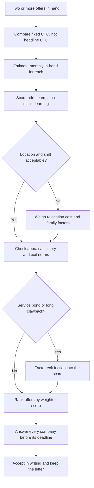

# HR Interview Preparation

## Overview

The HR round is the final filter of the campus placement funnel, typically 15–30 minutes with a recruiter or HR manager after your technical rounds are cleared. It is not a knowledge test — it screens whether you will actually join, whether you will stay long enough to justify the hiring cost, and whether you can hold a professional conversation about yourself. Technical rounds decide *whether* the company wants you; the HR round decides *on what terms* it will take you. The questions look casual, but every one of them maps to a hiring decision about joining date, compensation, location, and retention.

## What the HR Round Actually Evaluates

| Signal | What HR is really screening | Typical questions |
|---|---|---|
| Fit | Do your goals match the role and the company's culture | "Why this company?", "Why this role?" |
| Stability | Will you quit within a year for higher studies or a better offer | "Higher studies?", "Where do you see yourself in 5 years?" |
| Communication | Can you speak clearly, honestly, and calmly under pressure | "Tell me about yourself", open-ended follow-ups |
| Compensation | Will the standard offer work for you, or is there a mismatch | "Salary expectations?", "Are 12 months of variable pay okay?" |
| Logistics | Location, shifts, relocation, joining date, bond willingness | "Willing to relocate?", "Night shifts?", "Any backlogs?" |

### Fit and motivation

HR wants evidence that you chose the company deliberately rather than as one of fifty applications. A specific reference to a product, a technology, or a business line you researched counts more than any adjective you use about yourself. Vague enthusiasm ("great company, great culture") reads as risk because it applies to every company. If a dedicated page on the company's hiring process exists, cite one concrete fact from the pre-placement talk — HR teams remember candidates who listened.

### Stability and retention risk

Mass recruiters spend 3–9 months and lakhs of rupees training a fresher, so early attrition is their biggest fear. Questions about higher studies, work location, and five-year plans are attempts to price your flight risk. Consistency matters: if your resume says "seeking MS admission" in the objective line, no verbal assurance fixes the contradiction. Honest but forward-looking answers ("industry first, further study maybe much later") are safer than rehearsed denials.

### Communication and composure

The round is also a live sample of how you will talk to managers and clients. HR notices how you structure an unstructured question, whether you blame your college or teammates for failures, and how you react when they push back on an answer. Silence-filling honesty ("Let me think for a second") scores better than a memorized paragraph delivered in one breath. Composure during the salary or bond discussion is itself the assessment.

### Compensation expectations

For campus hiring the offer is usually standardized by CTC band, so the question tests negotiation maturity, not money. HR checks whether you researched the market, whether you understand fixed vs variable pay, and whether you will complain later about in-hand salary. Saying "any amount" signals no research; demanding a premium with no justification signals trouble. The safe move is to show you understand the structure and confirm fit (details below).

## Answer Framework: STAR

Behavioral questions ("tell me about a time...") are best answered with STAR. Keep the Action component dominant — it is the part interviewers can verify against your resume. One well-chosen story can cover several questions, so build three flexible stories rather than twenty. The full method, with worked examples and timing, is in [STAR Method: Deep Dive](../behavioral-interviews/star-method.md).

| Component | Description | Example |
|---|---|---|
| **S**ituation | Set the context | "During my internship at X, the team was facing..." |
| **T**ask | Your specific responsibility | "I was tasked with reducing API latency..." |
| **A**ction | What YOU did (not the team) | "I profiled the code, identified N+1 queries, and..." |
| **R**esult | Quantified outcome | "Reduced p99 latency from 2s to 200ms" |

## The 20 Most-Asked HR Questions

The questions below account for nearly every campus HR round; companies vary wording more than intent. Prepare a skeleton for each, not a script — HR interviewers listen to hundreds of students and recognize memorized paragraphs instantly.

| Group | Questions | Tone to strike |
|---|---|---|
| Ice-breakers and motivation | 1–6 | Specific, researched, forward-looking |
| Strengths and weaknesses | 7–9 | Evidence-backed, self-aware, honest |
| Behavioral | 10–13 | STAR-structured, blame-free, quantified |
| Commitment and trap questions | 14–20 | Calm, conditional, businesslike |

### Ice-breakers and motivation (1–6)

1. **"Tell me about yourself."** Use Present → Past → Future in 60–90 seconds. Present: "Final-year CSE student at X, working on Y (one project + one measurable result)." Past: one internship or leadership line with a number. Future: the specific kind of work you want at this company. End with a hook HR can follow up on instead of trailing off.
2. **"Why should we hire you?"** One line of role-fit, one line of proof, one line of attitude: "Your job description needs React and REST work — I shipped both in my project, and I learn tools fast, which mattered when I moved from MySQL to MongoDB mid-project." Never compare yourself to other candidates; HR has their scores and you do not.
3. **"Why this company?"** Research specific products/technology, one company value that aligns with something you have actually done, and a specific project or business line that excites you. Do not say "good salary" or "brand name". See the deep dive in [Company Fit & Motivation Questions](../behavioral-interviews/company-fit.md).
4. **"What do you know about our company?"** Prepare four facts: what they sell, who their customers are, one recent result (funding, product launch, annual report figure), and one engineering fact (stack, scale, engineering blog post). Deliver them in 20 seconds, not 2 minutes.
5. **"Why this role / why engineering (and not higher studies right now)?"** State a concrete interest linked to evidence: "I chose backend work after enjoying my DBMS project more than my electives" beats "I love coding". If the role is a service/support role and you wanted a product role, say what you can learn there in two years without pretending it was your first choice.
6. **"Where do you see yourself in five years?"** Show a growth path inside the role: from contributor to owner of a component to mentoring juniors. This is a stability probe, not a vision test — an answer like "founding my own startup" or "doing an MS" flags exit risk.

### Strengths and weaknesses (7–9)

7. **"What are your strengths?"** Pick 2–3 relevant strengths and back each with a concrete example. "I'm persistent — when debugging a distributed race condition, I spent 3 days tracing logs and eventually found the root cause in a clock skew issue." Align at least one strength to the job description so HR can tick the box.
8. **"What are your weaknesses?"** Pick a real but non-critical weakness, show self-awareness, and show the correction in progress. "I used to over-engineer solutions. Now I follow YAGNI and start simple, refactoring only when needed." Avoid humble-brags ("perfectionist") and anything core to the job ("I find it hard to meet deadlines").
9. **"Your CGPA is below our average — why?"** Do not blame teachers or health in the first sentence. Own the number, show the trajectory (latest-semester GPA improved from X to Y), and show compensating evidence — strong OA scores, projects, or certifications. HR is checking honesty and self-awareness more than the GPA itself.

### Behavioral (10–13)

10. **"Tell me about a conflict with a teammate."** STAR format: Situation — disagreement about an architecture choice; Task — need to reach consensus before a deadline; Action — presented data, proposed a compromise, tested both approaches; Result — agreed on a hybrid approach and shipped on time. Blame nobody; describe the disagreement, not the person.
11. **"Tell me about a failure."** Pick a real failure (not a humble brag) with a consequence you can name, then show the changed behavior. "I pushed a config change without testing in staging. It caused a 10-minute outage. Since then, I always test in staging and keep a rollback plan." The learning must be a mechanism, not a mood.
12. **"How do you work under pressure / handle a tight deadline?"** Describe a triage method, not heroics: what you cut, what you protected, how you communicated slippage early. End with the outcome and what you would pre-negotiate next time. Calm delivery is the actual test.
13. **"Tell me about a time you led something."** Use the smallest true leadership: a project group, a club event, a code-review rota you organized. Show coordination of people and a measurable result. See [Common Behavioral Questions](../behavioral-interviews/common-questions.md) for more patterns and a story bank approach.

### Commitment and trap questions (14–20)

14. **"Are you willing to relocate?"** If yes, say yes plainly and add that you have researched the city's cost of living or the company's relocation policy. If no (or only certain cities), say it now — hiding it costs the company a rejected joining and costs you a penalty or a bad year. Conditional answers are acceptable: "Yes, with a preference for Pune or Bangalore."
15. **"Are you okay with night shifts / 24×7 rotational support?"** Service companies run support desks across US/UK time zones, so this is a genuine hiring condition, not a stress test. Answer honestly and conditionally: "I understand production support runs across time zones and I'm fine with rotational shifts — could you tell me how the rotation is scheduled and how it's compensated?" A flat "no" in a support-hiring process wastes both sides' time; a flat "yes" you do not mean does too.
16. **"Are you planning higher studies?" — the trap question.** Answering "yes, next year" marks you a flight risk and can cost you the offer; lying outright can cost you the offer later, and some offers include a study-leave or minimum-service clause. The workable honest answer: "Industry work is my priority for the next several years — I want to find the problems worth studying before I ever consider a master's." Only say this if you mean it; if you genuinely plan to leave within a year, say so in the offer stage rather than after joining.
17. **"What are your salary expectations?"** For campus offers: "I'm comfortable with the standard package offered through this process — I've researched that your fresher band is around ₹X and it matches the market." For off-campus: research on Levels.fyi, Glassdoor, and AmbitionBox first, then give a researched range anchored to the role, never your expenses.
18. **"Are you okay signing a service agreement / bond?"** Ask before you sign: duration, penalty amount, what triggers it, whether it is legal in your state, and whether the training promised during the bond period actually happens. A bond is a business decision, not a loyalty test — answering "I'll sign anything" signals you do not read what you sign.
19. **"Explain this gap year / backlog / drop."** One factual sentence of cause, one sentence of what you did during that time, one sentence of evidence it is behind you. Do not over-explain; the longer the justification, the weaker it sounds.
20. **"Do you have any questions for us?"** Never say no — it reads as zero preparation and zero interest. Ask two questions from the list below; asking about the onboarding plan and the team you join is both useful and signal.

## Questions You Should Ask HR

Good questions collect information you need for the offer decision and simultaneously demonstrate seriousness. Ask two or three, not ten — the round has a clock, and interviewers judge selectivity. Pick the ones whose answers you will actually use when comparing offers later.

- "What does the first 90 days look like for someone joining this role — training, shadowing, or a live project?"
- "What does a typical day look like for this role, and which team would I join?"
- "What are the biggest challenges the team is facing this year?"
- "How is on-call or production support structured for freshers, and how is it compensated?"
- "What does the growth path look like — when is the first performance review for a fresher?"
- "How is variable pay defined, and what percentage of last year's freshers received it in full?"
- "Is the joining location fixed, or are transfers common after the first year?"
- "What does the training bond or agreement cover, if any?" (only if one was mentioned)
- "What's the team's tech stack and development process?" (if a manager is present)

## Offer Discussion Basics

### CTC vs in-hand: components of an Indian offer

Indian fresher offers quote Cost to Company (CTC), which includes money that never reaches your bank account monthly. Reading the components is a placement skill in itself. Two offers with the same CTC can differ by 15–20% in real monthly cash, so learn the table below before you accept anything.

| Component | Typical share | What it is | Reaches monthly in-hand? |
|---|---|---|---|
| Basic salary | 30–50% of fixed CTC | Base for statutory calculations (PF, gratuity) | Yes |
| HRA | 40–50% of basic | House rent allowance; tax-exempt in part under the old regime | Yes |
| Special / other allowance | Balances the total | Flexible filler component | Yes |
| Variable / performance pay | 5–15% (services), 10–20% (product) | Paid quarterly/annually only if targets are met | No — later, conditional |
| Joining bonus | One-time | Often clawed back if you leave within 12–24 months | One-time only |
| ESOPs / RSUs | Product startups, 3–4 year vesting | Value is not guaranteed until sold | No |
| Employer PF | 12% of basic (EPFO) | Goes to your EPF retirement account | No — savings, not salary |
| Gratuity | ~4.81% of basic | Payable only after 5 years of service | No |
| Insurance / welfare | Small | Health cover, meals, transport | No |

```text
In-hand (monthly) =
  CTC
  - target variable pay            (paid later, conditionally)
  - employer PF contribution       (goes to EPF account)
  - gratuity provision             (locked until 5 years)
  = annual gross  ->  divide by 12
  - employee PF (12% of basic)
  - professional tax (state-dependent, ~200/month)
  - income tax TDS (regime-dependent)
```

### Worked example: a ₹12,00,000 CTC services offer

| Component | Annual amount | Note |
|---|---|---|
| Basic (40%) | ₹4,80,000 | Statutory base |
| HRA (50% of basic) | ₹2,40,000 | Tax-advantaged under old regime |
| Special allowance | ₹3,39,300 | Balancing component |
| Target variable (5%) | ₹60,000 | Conditional |
| Employer PF (12% of basic) | ₹57,600 | To EPF account |
| Gratuity provision (4.81% of basic) | ₹23,100 | After 5 years |
| **Total CTC** | **₹12,00,000** | Headline number |

The monthly in-hand from this offer is roughly ₹78,000–79,000 under the new tax regime (gross ₹10,59,300 ÷ 12 ≈ ₹88,275, minus employee PF ₹4,800, professional tax ~₹200, and TDS ~₹4,300; figures rounded, exact amounts depend on state and regime choice). A ₹10 lakh product offer with a ₹2 lakh joining bonus and stocks can leave you with similar in-hand but more upside — which is why you compare structures, not headlines. Always compute in-hand before comparing two offers; a 20% CTC difference can be an 8% in-hand difference.

### Salary negotiation principles for freshers

Campus offers are band-based, so "negotiation" mostly means understanding the structure and asking the right clarifying questions rather than pushing the base up. Off campus, the sequence is: research the band (Levels.fyi, Glassdoor, AmbitionBox), let HR state the range first, and only then give a researched range instead of a single number. If pressed to go first, quote the range and immediately ask for theirs — anchors move, and whoever names a defensible range first frames the talk. Consider total compensation rather than base: a lower fixed CTC with real stock grants can beat a higher CTC with 20% undefined variable pay.

### Red flags to watch in offers

| Red flag | Why it matters | What to do |
|---|---|---|
| No written offer letter, only a verbal assurance | Nothing is enforceable — joining date, CTC, role can change | Ask for the letter before accepting; get the email, not a PDF screenshot |
| Training "security deposit" to be paid by you | Legitimate employers do not charge candidates to work | Treat as a scam unless it is a registered apprenticeship with clearly stated terms |
| Bond with ₹3–5 lakh penalty for 2–3 years | Traps you even if the job or pay is misrepresented | Read the trigger conditions; negotiate duration or walk away |
| Variable pay above 25% with no payout criteria | "Targets met" can be defined after the fact | Ask what fraction of last year's batch received it in full |
| CTC inflated with meal/transport/welfare lines | In-hand is far below expectation | Rebuild the in-hand math yourself from the components table above |
| Joining bonus with clawback + relocation paid back on exit | Double clawback if the company or you exit early | Ask for the exact clawback window in writing |
| Joining date pushed months out, "will be updated" | Common in downturns; your other offers may lapse first | Ask for the deferment policy and whether stipends apply during the wait |

## Evaluating Multiple Offers

When two offers overlap, decide with a weighted score instead of brand instinct. Typical weights: role quality and learning 30%, compensation in-hand 20%, growth and appraisal history 20%, location and shift fit 15%, stability of the company and offer 15%. Score each offer 1–5 per criterion, multiply, and compare — this surfaces disagreements with family and friends into criteria you can debate. Then follow the decision path below, and reply to every company before its deadline regardless of your choice; campus placement cells blacklist for silent withdrawals.



## Common Reasons HR Rounds Reject

| Reason | What HR observed | Prevention |
|---|---|---|
| No researched reason to join | Generic praise; could not name one product or fact about the company | Prepare four company facts and one personal connection |
| Flight risk signals | "MS next year" plans, inconsistent answers across rounds | Commit honestly to industry-first framing or disclose at offer stage |
| Blame language | Professors, teammates, or the college blamed for failures | Describe situations and your actions; keep names out |
| Salary immaturity | Demanded a premium with no justification, or accepted anything blindly | Show you understand CTC components and the band |
| Memorized delivery | STAR stories recited word-for-word, including the same story for every question | Rehearse skeletons; keep 3 stories mapped to 8+ question types |
| Zero questions at the end | "No, I have no questions" after a 20-minute conversation | Keep two questions ready; ask about onboarding and the team |

## Preparation Plan and Research Worksheet

HR rounds are won in the 48 hours before the interview, not in the room. The work is research and rehearsal, and both fit into a compact plan. The table below assumes a scheduled interview; scale the same blocks earlier if the process is known a week ahead.

| Time block | Task | Output |
|---|---|---|
| Day −2, 1 hr | Company research: products, customers, one recent result, engineering blog, the PPT notes | 20-second "what do you know about us" answer |
| Day −2, 1 hr | Fill the 20-question skeletons above with your own examples | Draft answers for groups 1, 2, and 4 |
| Day −1, 1 hr | Record yourself answering "tell me about yourself" and one STAR story; listen back | Trim to 90 seconds; fix filler words |
| Day −1, 30 min | Mock with a friend playing HR: 10 rapid questions, plus pushback on one answer | Comfort with follow-ups and interruptions |
| Day 0, 15 min | Re-read your resume — every line is fair game; re-check CGPA, dates, project numbers | Consistency with what you will say |

Research checklist for the company file: what they sell and to whom, one recent public result, the tech stack or client list relevant to your role, the CTC band and in-hand estimate, the bond or shift policy if any, and two questions you will ask. Keep the file on your phone — interviews are sometimes rescheduled with an hour's notice, and the notes travel with you. Rehearse answers out loud, because reading them silently creates false fluency that collapses the moment you speak.

## Interview Questions

1. **Why do technically strong candidates fail HR rounds?** Usually for commitment signals, not knowledge: inconsistent answers about higher studies, dismissive salary talk, blaming professors for grades, or no questions at the end. HR is estimating the cost of a wrong hire — training investment, attrition risk, and team disruption. A candidate who shows a deliberate reason to join, a realistic two-year outlook, and calm honesty removes that risk. The bar is integrity and fit, not charisma.
2. **What is the trap in "do you plan higher studies?"** A "yes" reads as a one-year flight risk, and companies adjust — they may withdraw the offer, move you to a project with a bond, or deprioritize you. The trap is that an outright lie can surface later during verification or a bond dispute. The workable answer commits to industry work as the priority for several years, which is also true for most students once they see real salaries and learning curves. If you genuinely intend to leave within a year, disclose it at the offer stage instead of after training is spent on you.
3. **Offer A: ₹12 LPA CTC services; Offer B: ₹10 LPA CTC product with ₹2L joining bonus and ESOPs. How do you compare?** Rebuild both into in-hand and risk-adjusted value. A's in-hand is roughly ₹78–79k/month; B may land in a similar range because the joining bonus is one-time and ESOPs are illiquid for 3–4 years. Then score non-cash factors: B likely has faster learning and better exit mobility; A may have a bond and shift-based support work. The weighted-score method (role 30, comp 20, growth 20, location 15, stability 15) turns this into a defensible decision.
4. **How should you answer the night-shift question for a services company?** Treat it as a real hiring condition: production support for US/UK clients runs on rotational 24×7 shifts. Confirm you understand and accept the rotation, then ask one operational question — how rotation is scheduled, how night duty is compensated, and how freshers are protected during training months. This shows professionalism rather than desperation or resistance. Refusing shifts is legitimate, but say it before the offer, not after.
5. **What does a good "salary expectation" answer look like for a fresher?** In campus processes, accept the standard band and say so, because the offer is not individually negotiable and trying anyway signals you did not understand the process. In off-campus processes, research the band on Levels.fyi, Glassdoor, or AmbitionBox, quote a range rather than a point, and anchor on the role and market rather than personal needs. If pressed for a number first, give the range and immediately ask for theirs. Negotiating a fresher offer is mostly about fixed-vs-variable mix and joining bonus, not base.

## Key Takeaways

- Every HR question maps to one of five screening signals: fit, stability, communication, compensation, and logistics.
- STAR (Situation-Task-Action-Result) with 50–60% weight on Action is the default structure for behavioral answers.
- The 20 questions cluster into four groups; rehearse skeletons, not scripts — HR detects memorized paragraphs immediately.
- Trap questions (higher studies, night shifts, bonds) test honesty under incentives; conditional honesty beats both bluffing and refusal.
- CTC is not salary: subtract variable pay, employer PF, and gratuity to estimate in-hand before comparing offers.
- Read every offer letter for deposits, clawbacks, undefined variable criteria, and unstated joining dates before signing.
- When holding multiple offers, use a weighted score and close every conversation before its deadline.

## References

- [Cracking the Coding Interview — Behavioral Chapter](https://www.crackingthecodinginterview.com/)
- [STAR Method Guide](https://www.themuse.com/advice/star-interview-method)
- [Levels.fyi — Compensation Data](https://www.levels.fyi/)
- [Glassdoor — Salaries and Reviews](https://www.glassdoor.com/)
- [AmbitionBox — India Company Reviews and Salaries](https://www.ambitionbox.com/)
- [EPFO — Employees' Provident Fund Organisation (12% contribution rules)](https://www.epfindia.gov.in/)

## Cross-references

- [STAR Method: Deep Dive](../behavioral-interviews/star-method.md) — full framework with worked behavioral examples
- [Company Fit & Motivation Questions](../behavioral-interviews/company-fit.md) — deep answers for "why this company/role"
- [Common Behavioral Questions](../behavioral-interviews/common-questions.md) — question bank with sample answers
- [Campus Placement Process](./campus-placement.md) — where the HR round sits in the funnel
- [Technical Interview Preparation](./technical-interview.md) — the rounds before HR
- [Interview Communication](../communication/interview-communication.md) — delivery, tone, and body language
