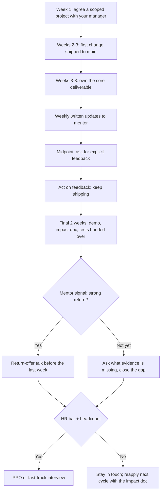

# Internship Preparation

## Overview

Internships are the primary pipeline into full-time offers, and at most large companies they beat every other route: interns arrive pre-vetted, prove themselves on real work, and convert at rates that external candidates can only envy. Treating the internship itself as a months-long interview — not a course requirement — is the mindset that separates students who return with a PPO from students who return with a certificate. This page covers the internship landscape end to end: the types and their calendars, where to find them, the intern resume, stipend benchmarks, what the work is actually like, how conversion to a pre-placement offer (PPO) mechanically happens, and how to turn the experience into resume bullets that survive recruiter scrutiny.

## Internship Types

| Type | Duration | Typical window | Where you meet it |
|---|---|---|---|
| Summer internship | ~8-10 weeks (May-July) | Apply Aug-Nov of prior year | Campus drives, product companies, most on-campus offers |
| 6-month co-op / thesis internship | ~20-26 weeks (often Jul-Dec or Jan-Jun) | Apply 6-9 months ahead | Unicorns, deep-tech, final-semester credit internships |
| Off-cycle internship | Any 2-6 month window | Rolling, year-round | Startups, research labs, smaller product teams |
| Winter internship | 4-6 weeks (Dec-Jan) | Apply Sep-Nov | Mostly Indian startups and research groups |
| Open-source fellowships | 8-12 weeks, structured | Fixed annual cycles | GSoC, LFX Mentorship, Outreachy |

The calendar matters as much as the destination. Summer internships at product companies recruit almost a year ahead — applications open in August for the following May — so a third-year student who starts looking in March is already eight months late for the biggest names. Six-month co-ops trade duration for depth: teams hand longer projects to longer interns, which is why co-op alumni often have stronger conversion odds and richer resume bullets than two-month summer interns. Off-cycle roles at startups are the easiest to obtain and the fastest to give real ownership, making them the standard recommendation for first-year and second-year students building a track record.

## Where to Find Internships

- **Campus placement cell:** register from second year onward; on-campus internship drives have the highest offer-per-application rate of any channel.
- **Company career pages:** product companies post dedicated "intern" requisitions; set alerts rather than checking manually.
- **Referrals:** alumni and seniors convert resumes to interviews at rates cold applications never match; this is the highest-leverage channel for off-campus attempts.
- **Job boards:** Internshala for volume, LinkedIn for targeting, Wellfound (formerly AngelList Talent) for startups, Unstop for competitions-and-hiring hybrid events.
- **Open source:** GSoC, LFX Mentorship, and Outreachy are structured, paid, resume-defining, and double as a referral network into the mentoring organization.
- **Cold email:** underrated and effective for startups and smaller product teams, provided the email proves you can code before asking for anything.

The channels are not equal, and effort should follow the odds. On-campus and referral channels convert an order of magnitude better than job boards, but they cap out early, so run all channels in parallel with different expectations. A realistic off-campus season is 50-150 targeted applications with a 2-5% interview rate — which is why the resume and the referral email are force multipliers worth engineering deliberately rather than spraying applications.

### The cold email that gets replies

Cold emails fail when they ask for a job and succeed when they demonstrate value in under 120 words. The structure that works is: a specific hook (why this team), one line of proof (what you built, with a link), and one small ask (a call or a pointer to the recruiter). Send it to engineers or managers — not generic HR inboxes — early in their morning, and follow up exactly once after a week.

```text
Subject: 3rd-year CSE student at [College] — project on [topic] fits [Team]

Hi [Name],

I'm [Your Name], a third-year CSE student at [College]. I built
[project]: a [one-line description] that [measurable outcome, e.g.
handles 50k requests/day in load tests]. Repo: [GitHub link].

I've been following [Team]'s work on [specific product/feature] and
your talk/post on [specific detail] convinced me this is the area I
want to work in. I'm looking for a [summer 2025] engineering
internship and can share a demo or code walkthrough on request.

Would you be open to a 15-minute call, or could you point me to the
right person on the recruiting side?

Thank you,
[Your Name] — [GitHub] | [LinkedIn]
```

Every line in this template earns its place. The subject line names your year, branch, and the team, so the recipient can triage in two seconds; the first paragraph proves you build things with a measurable outcome and a clickable link; the second paragraph shows specific research rather than a mail-merged compliment. The ask is small and reversible — a call or a referral — because asking a stranger for a job triggers delete, while asking for 15 minutes triggers replies. Expect a 10-20% reply rate when the hook is genuinely specific, and treat silence after one follow-up as a no.

### Referral requests that work

Referral requests to seniors and alumni succeed when they are easy to say yes to. The message should name the exact requisition (title, ID, location), attach the resume, and offer a two-line blurb the senior can paste into the referral form — because the number one reason referrals die is that the ask makes work for the referrer. Time it respectfully (weekday mornings), batch your targets so you ask one person per company, and always close the loop with a thank-you and a result update regardless of outcome. A referral that goes well makes your next ask easier; one that vanishes without a follow-up burns the connection.

## The Internship Application Pipeline

| Stage | Timeline (for May start) | Action |
|-------|--------------------------|--------|
| Research | 6-9 months before | Identify target companies, teams, and alumni contacts |
| Resume prep | 5-7 months before | Two or three solid projects with metrics; 1-page resume |
| Applications | 4-6 months before | On-campus, referrals, portals, cold outreach — all parallel |
| OA / coding test | 3-5 months before | Platform-specific practice; see [Coding Assessments](./coding-assessments.md) |
| Interviews | 2-4 months before | Technical + behavioral rounds |
| Offer decision | 1-2 months before | Compare stipend, team, conversion history, and learning value |

Rolling recruitment is the trap inside this table: many companies review applications as they arrive and stop when seats fill, so "apply early" is not a slogan but the difference between a reviewed application and an auto-rejection. Track every application in a spreadsheet with dates, contacts, and status, because follow-ups and referral requests both depend on knowing where you stand. And weight the offer decision by conversion history — an internship at a company that converts interns is worth structurally more than a slightly higher stipend at one that hires interns as cheap labor.

## Resume Rules for Interns

Intern resumes follow stricter rules than experienced-hire resumes because recruiters spend 20-30 seconds and have no work history to read. The non-negotiables:

- **One page, always.** No exception has ever favored a second page for an intern.
- **Education block first** with CGPA if it clears common filters (7.0+); omit or de-emphasize otherwise.
- **Two or three projects**, each with a one-line problem statement, the technical approach, and a number (users, accuracy, latency, scale).
- **Links that work:** GitHub with pinned repos and READMEs, LinkedIn, personal site or demo video if it exists.
- **Skills line mirrors the job description** honestly — keyword screens (ATS) match literal terms.
- **No photo, no objective paragraph, no "hardworking team player", no high-school achievements.**
- **PDF named `Firstname_Lastname_Resume.pdf`**, ATS-parseable layout (single column beats fancy templates).

The project bullet is the heart of the intern resume, and it is where most students lose the 20-second skim. "Made a website using React and Node.js" says nothing; "Built a hostel-mess feedback app (React, Node, Postgres) used by 1,200 students; cut complaint resolution time from 3 days to same-day" gives a recruiter three reasons to keep reading. Every project claim should survive the follow-up question "walk me through how that number was measured," because interviewers do ask.

## Internship Interview Format

| Company Type | Rounds | Focus |
|--------------|--------|-------|
| Big Tech | 2-3 coding + 1 behavioral | Algorithms, data structures, thought process |
| Service companies | 1-2 coding/technical + 1 HR | Fundamentals, communication, trainability |
| Startups | 1-2 mixed rounds | Practical skills, ownership, culture fit |
| Research labs | 1-2 technical + discussion | Domain depth, projects, reading background |

Internship interviews are calibrated below full-time loops, but "below" means one fewer hard problem, not no preparation. Expect the same DS/algo core from the coding track of this book, lighter system design (if any), and behavioral questions that probe learning speed rather than leadership war stories. For startups, prepare a deep walkthrough of one project — founders habitually anchor the whole conversation to whatever you claim you built, and the walkthrough is the real interview.

## Stipend Benchmarks by Tier

Indicative monthly stipend ranges from recent Indian placement seasons, rounded and deliberately conservative — treat them as calibration, not gospel, and verify against your campus's current season data:

| Tier | Monthly stipend (INR) | Notes |
|---|---|---|
| Startups (early-stage) | ₹10k - 50k | Sometimes equity or a conversion promise substitutes for cash |
| Service mass recruiters | ₹15k - 30k | Often location-subsidized; conversion-driven |
| Product MNCs | ₹40k - 80k | The common on-campus product-tier band |
| Top product companies / unicorns | ₹75k - 1.5L | The famous "1L+/month internships" live here |
| Quant / HFT firms | ₹1.5L - 3L+ | Highest cash, narrowest seats, hardest OAs |

Stipend is the least important column of the decision if conversion is your goal, and the most important if you need the money — both are legitimate. A ₹25k internship on a team that converts its interns beats a ₹1L internship at a program that treats interns as seasonal events, so ask seniors or recruiters directly about that team's conversion history. Also compare perks that matter operationally: housing or a housing allowance in expensive cities is frequently worth more than a stipend delta.

## Work Expectations vs Reality

The imagined internship is a decade of system design; the real first month is environment setup, reading unfamiliar code, and one small ticket. Expectations that survive contact with reality produce good internships, so recalibrate in advance: the first two weeks are an apprenticeship in the team's tooling, the middle weeks are your actual project, and the final weeks are packaging what you did. Boring work is not a conspiracy — teams assign small scoped tasks first because trust is expensive, and the interns who ship those tickets cleanly are the ones handed the interesting ones.

The reality that surprises most interns is how much the soft layer matters. Asking a focused question after 30 minutes of genuine trying is a skill signal, while either stewing silently for two days or immediately delegating your thinking both read badly. Weekly written updates — five bullet points to your mentor — do more for your evaluation than any heroics, because they make your progress visible to the person who will be asked about you. Attendance integrity, meeting punctuality, and finishing what you start are the boring signals that HR bars actually check, and violating them is the most common way technically strong interns fail conversion.

Remote and on-site internships differ more than the commute. On-site gives you overheard context — design discussions, incident responses, the team's actual rhythm — which is half the education and most of the relationship-building; remote demands that you manufacture that visibility deliberately through more frequent updates and aggressive meeting participation. If you take a remote internship, over-communicate by design: a 15-minute weekly video 1:1 with your mentor, written updates, and an open thread for questions. If you can choose, prefer on-site or hybrid for your first internship, because the ambient learning is the part that never shows up in the project description.

The table below is the honest expectation-reset that most orientation weeks skip. Read it before day one and again at the end of week two, because the gap between the columns is exactly where intern disappointment (and intern complacency) lives.

| Expectation | Reality |
|---|---|
| Immediately assigned meaningful work | Week 1-2 is setup, reading, and small tickets — a trust-building phase |
| Your project is the team's priority | You are a parallel task; senior work continues at full speed |
| Mentor available on demand | Mentor is busy; batch questions and self-serve docs first |
| Impact visible by itself | Visibility must be manufactured via demos and updates |
| Conversion automatic for hard workers | Conversion follows the policy bar plus a shipping story |
| Stipend reflects value delivered | Stipend reflects budget tiers; the return offer is the real prize |

## Converting the Internship to a PPO

Conversion statistics justify taking the internship seriously as an extended interview. Large product companies commonly convert 50-80% of eligible interns to return offers; service companies sit near-universal for interns who clear the basic bar; startups vary from 30-60% depending on hiring freezes and funding. The eligible caveat matters — eligibility is a policy bar (attendance, integrity, no Performance Improvement Plan) that a small fraction of every cohort fails for non-technical reasons. Nobody publishes official rates, so the honest use of these numbers is directional: the base rate is strongly in your favor, and most conversion failures are behavioral rather than brilliance-related.

Conversion mechanics are a sequence, not a single decision. Your manager and mentor write calibration feedback at the midpoint and the end; your project's impact is summarized in an evaluation (sometimes a written doc, sometimes a final demo); the team decides whether they want you and whether headcount exists; HR checks the policy bar; and some companies add a light final interview for form. Mentor signals are the currency inside that sequence — the difference between a mentor who says "solid intern" and one who says "I would fight for this person in calibration" is entirely made of observable behavior: shipping, communicating, and being pleasant to unblock.

The return-offer bar, translated into intern terms, has three rungs. **Ship a scoped project end-to-end** — something real that goes to production or a demo, not five tickets scattered across the backlog. **Be reliably visible** — weekly updates, honest blockers, mid-internship feedback conversation where you ask "what would make this a strong return offer?" and then visibly act on the answer. **Finish with packaging** — an impact summary your manager can paste into the calibration doc, and a direct conversation about returning two to three weeks before the internship ends, while budget decisions are being made. Interns who do all three and still miss conversion usually lost to headcount, not to performance — which is why maintaining the relationship after the internship (a check-in every couple of months) converts "next cycle" into an actual offer.



The diagram's most important edge is the one most interns skip: the mid-internship feedback ask. Without it, you discover the evaluation's verdict at the exit interview, when the remaining runway is two weeks; with it, you have six weeks to fix the specific gaps named. The "headcount" branch is likewise worth internalizing, because it reframes a non-conversion as bad timing rather than a verdict — and it is exactly why the impact document and the relationship outlive the internship itself.

When the PPO does arrive, handle it like an adult decision rather than a victory lap. Read the compensation structure completely — base, joining bonus, stock, and location differences frequently matter more than the headline number — and compare it against any full-time offer you expect to earn through placements, since some companies make PPOs conditional on skipping the campus process. Ask your questions before signing deadlines, not after, and if you hold competing offers, be straightforward with both recruiters about timelines. A handled PPO also protects your negotiating position: companies know their interns have other options, and a calm, informed candidate preserves every option.

## Turning the Internship into Resume Bullets

The formula for an internship bullet is: **action verb + what you built + scale/context + measurable outcome**. The verb carries the role ("designed", "migrated", "automated" — never "worked on"), the scale makes the work concrete, and the outcome proves the work mattered. One internship yields three to five bullets; more means you are listing tickets instead of demonstrating impact.

Before/after examples of the same work, rewritten:

| Before (weak) | After (formula applied) |
|---|---|
| Worked on the payments team's dashboard. | Built a payments analytics dashboard (React, ClickHouse) surfacing 12 failure metrics; cut incident triage time from ~40 min to under 10. |
| Helped in migrating services to microservices. | Migrated 3 Python services to gRPC microservices, removing 1.2 s of inter-service latency on the checkout path (p95). |
| Was responsible for testing the app. | Wrote 120+ integration tests (pytest) raising module coverage from 54% to 87%; caught a payment double-charge bug before release. |
| Did an internship at a fintech company. | Interned on a 6-person backend team; shipped the invoice-retry service (Java, Kafka) now processing ~30k retries/day. |

The "before" column is not an exaggeration — it is how most first drafts read, and it wastes the only months of professional experience on the page. Two honesty rules keep the "after" column safe in interviews: every number must be one you can explain the measurement of, and every claim must be one you personally did, because follow-up questions go exactly where the bullet is strongest. If a metric genuinely cannot be shared (NDA), replace it with scope ("production service used by all retail customers") — vagueness with a reason beats a fake-looking number.

## Common Mistakes

- Waiting until the final year to start applying — the summer-internship calendar closes a year ahead.
- Treating the internship as a vacation between semesters; visibility during it decides conversion.
- Stipend-maxing over team quality and conversion history.
- Not maintaining the mentor relationship after the internship ends.
- Writing "worked on X" bullets that bury the only professional experience on the resume.
- Ignoring off-cycle startup internships that build the track record product companies want to see.

## Interview Questions

1. **Why are internships considered the highest-probability route to a full-time offer?** Companies convert 50-80% of product-company interns versus single-digit base rates for cold full-time applicants, because interns arrive with ten weeks of verified on-the-job evidence that no interview can replicate. The calibration decision draws on observed shipping, communication, and reliability rather than four hours of interview signal. The policy bar (attendance, integrity) removes a small fraction, so the base rate favors anyone who performs normally well and behaves professionally. Structurally, the internship also lets both sides de-risk: you see the team before committing, and the team sees you before spending a full-time requisition.
2. **What does an effective cold email to an engineer look like, and why do most fail?** An effective one is under 120 words, opens with a specific hook (the team's product or a talk they gave), proves you build things with one measurable project and a link, and closes with a small ask — a 15-minute call or a pointer to the recruiter. Most cold emails fail by opening with "I am looking for opportunities" and listing a resume, which asks the recipient to do the work of finding a fit. The reply-triggering version does the fitting work for them: subject line with year and team, one paragraph of proof, one paragraph of specific interest. Send it to engineers or managers rather than generic HR inboxes, and follow up exactly once.
3. **How does PPO conversion mechanically work, and where do interns usually lose it?** The sequence is: midpoint and end-of-internship calibration feedback from manager and mentor, an impact evaluation of your project, a team want-you decision, headcount confirmation, an HR policy check, and sometimes a formality interview. Interns usually lose it on the HR policy bar and on visibility — missed attendance, integrity issues, or a mentor who cannot name anything you owned — far more often than on technical ceiling. The midpoint feedback ask is the highest-leverage moment because it converts unknown evaluation criteria into fixable ones. Headcount kills explain the remainder, which is why relationships and impact documents outlive the internship.
4. **What makes a return-offer-worthy project different from just completing assigned tickets?** A return-worthy project is scoped end-to-end: you own something that reaches production or a real demo, and you can narrate its problem, design trade-offs, and measured outcome. Tickets scattered across a backlog produce activity but no story, and calibration meetings are fundamentally storytelling — your mentor must summarize you in two sentences. Pair the shipping with visibility (weekly updates, demos) so the story is already written when the mentor is asked for it. If the assigned work is fragmentary, that is a week-one conversation, not a fate.
5. **How should an intern's resume differ from a graduate's?** It is one page with education first (CGPA if 7.0+), two or three projects with measurable outcomes, working GitHub/LinkedIn links, and a skills line matched honestly to the target description. There is no work history to lean on, so project bullets carry the resume, each following the action-verb + build + scale + outcome formula. ATS compatibility matters more at intern volume: single-column PDF, literal keywords, no photos or tables that break parsers. The 20-30 second skim is the design constraint — every bullet must survive a reader who will never meet you.

## Key Takeaways

- The calendar rules: summer internship applications open ~9 months ahead; start in the second year, not the final year.
- Run all channels in parallel — campus cell, referrals, portals, cold email — and weight effort by conversion odds, not by convenience.
- The intern resume is one page where two or three metric-bearing project bullets decide the 20-second skim.
- The first internship month is setup and small tickets by design; clean early shipping is how bigger work gets assigned.
- Conversion is a sequence with a policy bar — midpoint feedback, visible weekly updates, and an end-of-internship impact doc are the controllable levers.
- Headcount, not performance, explains many non-conversions; the relationship and the impact doc convert "next cycle" into offers.
- Rewrite experience into action-verb bullets with honest, explainable numbers — "worked on" is where intern resumes go to die.
- On-site internships teach through ambient context; remote ones require manufactured visibility through extra updates and 1:1s.

## References

- Internshala — India-focused internship portal: <https://internshala.com/>
- LinkedIn — networking and referral channel: <https://www.linkedin.com/>
- Wellfound (formerly AngelList Talent) — startup jobs and internships: <https://wellfound.com/>
- Unstop — competitions, hiring challenges, and internship listings: <https://unstop.com/>
- Google Summer of Code — structured open-source internships: <https://summerofcode.withgoogle.com/>
- LFX Mentorship — Linux Foundation open-source mentorship: <https://lfx.linuxfoundation.org/tools/mentorship/>
- Outreachy — paid open-source internships for underrepresented groups: <https://www.outreachy.org/>

## Cross-References

- [Resume Structure](../resume/structure.md) — the one-page layout rules the intern resume follows
- [Writing Bullets](../resume/writing-bullets.md) — the full action-verb bullet formula this page applies to internships
- [Coding Assessments](./coding-assessments.md) — the OA step inside internship hiring pipelines
- [Technical Interview Preparation](./technical-interview.md) — the interview format most internship loops use
- [HR Interview](./hr-interview.md) — the behavioral round where internship motivation gets tested
- [Campus Placement](./campus-placement.md) — how internship offers feed the final placement season
