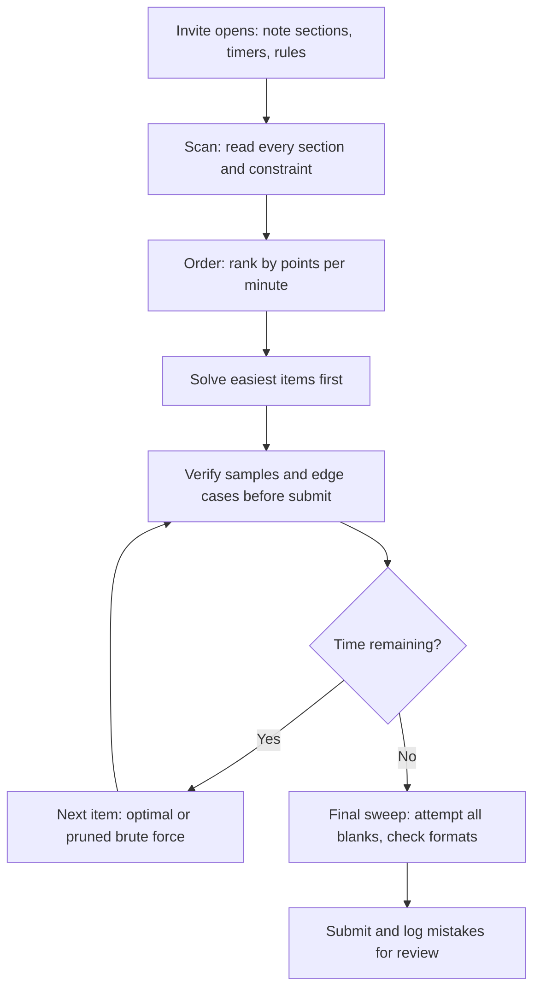

# Online Assessment Strategy

## Overview

The online assessment (OA) is the first scored filter in almost every campus placement pipeline, and more candidates are eliminated here than in all interview rounds combined. A single drive can invite thousands of applicants to the OA while advancing only a small fraction, so the outcome depends on logistics discipline as much as problem-solving skill. This page covers the platform landscape, typical section layout, timing math, proctoring rules, environment setup, advancement funnels, and retake policies — the logistics side of the OA. For the in-editor strategy (time-allocation tables, template libraries, hidden-test debugging), see [Online Assessment Strategies](../interview/coding/oa-strategies.md), which this page links to instead of duplicating.

## OA Platform Landscape

Indian campus placements cycle through a small set of assessment platforms, and each behaves differently under the hood. The table below summarizes format, proctoring intensity, and the quirks that most often cost candidates points. Treat it as a pre-assessment briefing: knowing which platform you got decides how carefully you treat tab switches, submission counts, and timers.

| Platform | Typical format | Proctoring level | Known quirks |
|---|---|---|---|
| HackerRank | 2–4 coding + optional MCQs, 60–120 min | Medium: tab tracking, paste detection, optional webcam | Per-problem timers, partial credit common, custom test runs usually allowed |
| Codility | 2–3 tasks, 60–90 min | Medium-high: cross-candidate similarity checks | Some companies report the *first* score, not the best; boundary-heavy hidden tests |
| CodeSignal | 4-task GCA or company set, 70–120 min | High: webcam, periodic screenshots, copy-paste disabled | One session-wide timer; compressed score curve; retake cool-downs |
| SHL | Aptitude + coding/verify modules | High: lockdown browser, webcam, section locks | Strict per-section timers; adaptive sections cannot be revisited |
| CoCubes | Aptitude + coding + psychometrics | Medium: monitored or center-based | Used by mass recruiters; one score reused across many companies |
| AMCAT | Adaptive modules (aptitude, CS, coding) | Medium: adaptive engine, module locks | Cannot revisit answered questions; module-wise score report shared with recruiters |
| Mercer Mettl | Mixed MCQ + coding, AI-proctored | High: AI flagging, browser lockdown, optional live proctor | Mandatory environment check; repeated flags accumulate into a trust score |

Every platform lets the hiring company toggle proctoring, scoring, and retake rules, so the pre-assessment email is itself a document worth reading like a problem statement. Assume the strictest configuration unless told otherwise, because violations are rarely forgiven and almost never appealable. If the instructions and the platform behavior disagree, follow the instructions and note the discrepancy for the recruiter.

### HackerRank, Codility, and CodeSignal in practice

These three dominate product-company hiring, and the tactical differences between them are covered in depth on [Online Assessment Strategies](../interview/coding/oa-strategies.md), including platform-specific submission policies. The short version for logistics: HackerRank forgives most things except tab switching, Codility punishes premature submission when first-score reporting is on, and CodeSignal punishes almost-solutions because partial scoring is rare. Budget your verification time accordingly — CodeSignal problems deserve the largest verify-before-submit buffer. All three auto-save your code, but a browser crash on your machine is still your problem, so submit working checkpoints on long problems.

### Reading the assessment invite

The invite email is a specification document, and candidates who skim it donate points back to the platform. Extract these fields before test day and write them down: the exact attempt window (and your time zone), permitted languages, timer structure (per problem vs shared), negative-marking rules, proctoring level, retake policy, and the support contact for technical failures. Note whether rough sheets and calculators are permitted, because guessing wrong turns a standard aid into an integrity violation. If any instruction is ambiguous, email the recruiter a week early — a reply in writing is also your protection later.

### AMCAT, CoCubes, and SHL in mass recruitment

Service companies and mass recruiters (TCS, Infosys, Wipro, Accenture, Cognizant, Capgemini and similar) lean on AMCAT, CoCubes, and SHL because one score scales to thousands of candidates. The defining feature is section-level timing: once an aptitude section's clock ends, it ends even if you were mid-calculation, and adaptive engines like AMCAT's never let you return to a committed answer. This changes your pacing instincts — you must bank answers quickly instead of polishing them. These platforms also reuse scores, so a strong CoCubes or AMCAT result keeps working for you across companies for months, while a weak one can silently filter you out of drives you never applied to individually.

### SHL and the aptitude-first platforms

SHL deserves a separate note because its style differs from coding-first platforms in one critical way: sections are hard-locked. Each aptitude or verification module has its own countdown, answers commit on navigation, and several SHL products are adaptive, meaning a correct answer makes the next question harder and raises your ceiling. Because of this, the strategy is to answer fast and early rather than waiting for certainty, since an unfinished section scores far worse than a section with fast committed guesses. Practice with strict per-question timers rather than overall timers, because that is the constraint SHL actually enforces. The reasoning families SHL tests (numerical, verbal, inductive, spatial) map directly onto the practice material in the [Aptitude Index](../aptitude/README.md) and the [Cognitive Ability Tests](./cognitive-tests.md) page.

## Typical Section Layout

Most OAs mix three to five of the following sections, with the coding section carrying the most weight in shortlisting decisions:

1. **Aptitude** (15–30 min): percentages, ratios, time-speed-distance, probability — usually 10–20 questions.
2. **Coding** (60–90 min): 2–4 problems ranging easy to hard, often with per-problem or shared timers.
3. **MCQ on CS fundamentals** (15–30 min): OS, DBMS, networks, OOP, and output-prediction questions.
4. **Debugging** (15–30 min): fix 5–10 buggy code snippets; common in service-company drives.
5. **SQL or pseudocode** (15–30 min): frequent for data roles and in Capgemini/Accenture-style patterns.

Company tier changes the mix more than the total duration. Product companies usually run 2–4 pure coding problems with almost no aptitude, while mass recruiters split the hour evenly between aptitude, CS MCQs, and easier coding. A few drives also bolt on a psychometric or behavioral questionnaire, which is untimed but flagged for inconsistent answers, so answer it honestly and consistently rather than strategically. Read the section list in the invite and plan your total-time split before the timer starts, not after.

The table below maps common layouts to the companies that use them. Use it as a template for mocks: if your target company runs layout B, your full-length mock should replicate layout B, including the section order, because fatigue lands differently on coding when it follows 30 minutes of aptitude.

| Layout | Sections | Typical users |
|---|---|---|
| A: Pure coding | 2–4 coding problems, no MCQs | Product companies, startups, some unicorns |
| B: Coding + MCQ | 2–3 coding + 15–20 CS MCQs | Large product MNCs, fintech |
| C: Aptitude-heavy | Aptitude + CS MCQs + 1–2 easy coding + debug | Service mass recruiters |
| D: Multi-round | Aptitude + coding + psychometric + AI video interview | Consulting-adjacent tech, banking tech |

Two section types deserve special mention because candidates routinely underestimate them. The debugging section (fix-the-snippet) is the cheapest section to prepare for — 2–3 days of practicing on buggy loops and off-by-one errors routinely takes accuracy above 90%, and service companies weight it heavily. The SQL section punishes unpracticed candidates disproportionately because query syntax cannot be reasoned out from first principles under a clock; 30 minutes with a joins-and-group-by refresher the week before covers most service-company questions. Neither section needs deep study, but both punish zero preparation.

## Timing Math and Question Selection

Do the arithmetic before the clock starts, because the per-section budget is the only thing you control. Consider a typical 90-minute product-company OA with 20 CS MCQs, 10 aptitude questions, and 2 coding problems. The MCQs take roughly \\( 20 \\times 60 \\text{ s} = 20 \\text{ min} \\), aptitude takes \\( 10 \\times 45 \\text{ s} \\approx 8 \\text{ min} \\), which leaves about 57 minutes for coding after a 5-minute buffer — roughly 25 minutes on the easy problem, 22 on the harder one, and 10 minutes of review. If you skip this calculation, the default human behavior is to spend 45 minutes on the first coding problem and then rush everything else.

Question selection is a points-per-minute decision, not a difficulty-preference decision. MCQs typically award the same marks as a coding test case but cost one minute instead of twenty, so unattempted MCQs at the end of an OA are pure loss when negative marking is absent — check the instructions for that one detail. Within coding, start with the easier problem to secure guaranteed points and convert the remaining timer from a threat into a budget. The full scan-order-solve-verify discipline, the 8-minute stall rule, and the brute-force fallback are covered on [Online Assessment Strategies](../interview/coding/oa-strategies.md) — internalize them there and execute them here.

### Section-wise budget template

For a 120-minute drive in layout B (2 coding + 20 MCQ + 10 aptitude), a defensible split looks like this. Adjust proportionally when durations differ, and keep the review buffer — it is the phase candidates sacrifice first and regret most.

| Phase | Budget | Notes |
|---|---|---|
| Instructions + scan | 5 min | Note timers, negative marking, language limits |
| Aptitude section | 8–10 min | 45–60 s per question; bank easy marks |
| CS MCQ section | 18–20 min | ~1 min per question; flag and return on doubts |
| Coding problem 1 | 25 min | Solve, run samples, check edge cases, submit |
| Coding problem 2 | 30 min | Optimal attempt; ship pruned brute force at the floor |
| Review + blank sweep | 10–12 min | Fix formats, answer unattempted MCQs, re-check flags |

## Proctoring Rules and Accidental Disqualification

Proctoring failures are the most avoidable way to lose an OA, because they disqualify otherwise-perfect submissions. The common triggers are tab or window switches, exiting full-screen mode, a second monitor being active, a phone visible in the webcam frame, background voices, or another person entering the room. Less obvious triggers include desktop notification popups (Slack, WhatsApp, email), browser extensions that open panels, auto-lock or sleep mid-assessment, paste events into the code editor, and ID cards that do not match the name on the invite. AI-proctored systems like Mercer Mettl flag these events cumulatively, so two "minor" violations can cost you the attempt even when the session was not terminated on the spot.

Follow the crash protocol deliberately instead of improvising. If your browser or machine dies mid-assessment, screenshot the error immediately, do not open a fresh attempt link unless the instructions permit it, and email the recruiter or support address within minutes — most platforms log the crash and a prompt report protects you. Keep a phone number for the recruiter handy for genuinely stuck situations, but never keep the phone physically near the desk during the test. When in doubt about any rule (rough sheets, calculators, water bottle position), the answer that preserves your candidature is the conservative one.

The table below maps the most common disqualification triggers to how platforms detect them and the concrete defense. Read your trigger column before every assessment; the same handful of causes produces nearly all voided attempts every season.

| Trigger | How it is detected | Defense |
|---|---|---|
| Tab/window switch | Window blur/focus events in the page | Single window, single monitor, notifications off |
| Full-screen exit | Fullscreen API change event | Re-enter full-screen only via the platform's prompt |
| Phone in frame | Webcam frame analysis, proctor review | Phone in another room on silent |
| Background voice/person | Audio level monitoring, proctor review | Private room; household warned for the window |
| Paste into editor | Clipboard event listeners | Type everything; keep templates in muscle memory |
| Identity mismatch | ID check at start, face match | Carry the exact ID named in the invite |
| Session crash mid-test | Platform logs | Screenshot, resume via original link, report within minutes |
| Concurrent login | Same account opened elsewhere | Never open email in a second browser during the test |

## Environment Setup Checklist

Run this checklist 30 minutes before the window opens, not 2 minutes before, because a missing adapter or a dead webcam battery takes longer to fix than you think. Practicing on the platform beforehand (most offer sample tests) removes the last category of surprises.

```
□ Laptop charged + power cable connected (battery saver can throttle CPU)
□ Chrome or Edge updated; incognito window; no extra extensions enabled
□ Notifications off: OS Do Not Disturb, Slack/WhatsApp/Teams desktop apps quit
□ Second monitor unplugged; phone on silent and OUT of the webcam frame
□ Webcam at eye level, face and shoulders visible; light in front, not behind
□ Government ID / college ID physically next to you for the identity check
□ Quiet, plain-walled room; family/roommates warned for the exact window
□ Primary network tested; mobile hotspot configured as a tested backup
□ Rough sheets + pen (only if instructions allow), water bottle within reach
□ Platform sample test completed; login link tested in the same browser profile
□ Notebook of your own checklist items from past OAs (your recurring mistakes)
```

Network is the most underestimated item on the list. Campus Wi-Fi often throttles or blocks assessment CDNs, and a dropped connection can freeze a proctored session in a way support takes hours to unlock. A tested hotspot backup plus a wired connection when possible turns the most common infrastructure failure into a non-event. Finally, close every non-essential application — proctoring software enumerates processes, and aTorrent or a cracked-software installer running in the background looks exactly as bad as it is.

## What Companies See in Your Score Report

Recruiters receive more than a pass/fail, and knowing the report changes how you behave. A typical HackerRank or Mettl report shows per-question scores, test cases passed per problem, total time per question, number of submissions, paste events, tab-switch counts, and in proctored runs an integrity or trust flag. CodeSignal adds a normalized Coding Score so recruiters can compare candidates across invites. This means slow-and-steady behavior is visible: spending 50 minutes on one problem with a single clean submission reads differently from 12 panicked submissions with paste events.

The practical consequences are concrete. Keep paste events at zero even where technically possible, because some companies auto-reject on pasted code. Limit submissions by verifying locally before each submit, since attempt counts appear on the report. Finish problems completely rather than leaving three half-solutions, because per-question completion is what a shortlisting recruiter skims first. And if the platform supports it, use the custom-test feature before submitting — those runs are expected and never count against you.

### Common myths worth unlearning

Several widely shared beliefs about OAs cost candidates real points every season. "Solve everything perfectly or nothing counts" is false on platforms with partial credit, where a pruned brute force banks a third of a problem's points. "The platform ends my session if I switch tabs" is sometimes false but always expensive to test — treat it as true. "Aptitude is just school math so no practice needed" ignores the per-question clock, which is the actual difficulty. And "everyone cheats anyway" is the most dangerous myth of all: similarity checks across the candidate pool are real, and the honest 60% score beats a flagged 95% every time.

## The Advancement Funnel

Calibrating expectations prevents both panic and complacency. Funnel numbers vary by company and season, but the ranges below are commonly reported across Indian campus drives and match how recruiters describe their own pipelines. Use them to decide effort allocation: if 70% of eliminations happen at the OA, then OA-specific practice deserves a proportional share of your preparation weeks, not just interview practice.

| Stage | Mass recruiters (service) | Product companies | Elite/quant roles |
|---|---|---|---|
| Invited to OA | 100% of eligible pool | 100% | 100% |
| Attempt seriously | ~70–85% | ~80–90% | ~90% |
| Advance to interviews | ~40–60% of attempts | ~10–25% of attempts | ~5–10% of attempts |
| Receive offer | ~10–20% of interviewees | ~30–50% of interviewees | ~20–40% of interviewees |

Two implications follow directly from these numbers. First, at product companies the OA is harder than the interviews in a specific sense — it has the sharpest cut — so a mediocre OA performance is usually fatal regardless of interview potential. Second, at mass recruiters the OA is closer to a qualifying threshold, which means consistent accuracy on easy sections beats brilliance on hard ones. Neither regime rewards blank submissions, so always bank whatever partial credit the platform offers.

The no-show row deserves attention too. A meaningful fraction of every invite pool never attempts the test — schedule conflicts, forgotten windows, or intimidation — which means merely showing up prepared already advances you past that cohort. For on-campus drives the numbers compress further because eligibility lists are pre-filtered by CGPA cutoffs, so the effective advance rate from your branch's attempt pool is usually higher than off-campus figures. Track your own season's funnel as offers arrive; after 5–10 drives you will know exactly which stage leaks for you, and that is the stage to drill.

## Retake Policies

Retake rules are where careless candidates lose entire companies, so read them before the test rather than after a rejection. Most campus-drive OAs are strictly one-shot: the link is tied to your roll number and email, a rejection closes that company for the entire season, and there is no appeal path for a crashed session unless you reported it immediately. Off-campus and certification-style tests are friendlier but still constrained, and the cool-downs are enforced by account, not by invite.

- **CodeSignal**: company-configured cool-downs of 14–30 days are typical, and the company can see your previous scores and attempts.
- **AMCAT**: candidates can schedule a fresh attempt after a cool-off period (historically around 45 days), with the newest score reported going forward.
- **CoCubes**: one score is shared with subscribed companies during its validity window; improve it by re-testing through your college's next purchase cycle.
- **HackerRank/Codility/Mettl drives**: retakes only if the company issues a new invite; failed proctoring review usually voids the attempt without a retest.
- **Rejected but re-eligible**: most large companies enforce a 6–12 month gap before you can reapply after an OA rejection.
- **Score-bank platforms**: AMCAT, CoCubes, and eLitmus-style tests let one score circulate to many subscribed employers, so their "retake" economics are a scheduled re-test months apart rather than a fresh invite.

The score-bank platforms change your calculus in one useful way: a mediocre result there is recoverable within the same season, unlike a rejected product-company OA. Treat them as infrastructure you maintain — book an attempt early, refresh the score before peak season, and list the current score wherever recruiters ask. The rest of the retake landscape is best summarized as "one shot, prepare accordingly."

The practical takeaway is that your first attempt is usually your only attempt within the hiring cycle. That argues for one full-length platform mock before every high-stakes OA, because treating a real invite as your practice test is the most expensive possible way to learn the interface. It also argues for calendar discipline: set three reminders per invite (one week out, one day out, one hour out), because the single most common self-inflicted loss in campus placements is a missed assessment window.

## Results Timeline and Next Steps

OA results follow predictable rhythms worth planning around. Product companies usually respond within 3–10 days with either an interview invite or a silent rejection, while mass recruiters batch-declare shortlists after the entire drive's assessments finish, which can take 2–4 weeks. No news inside a week means nothing either way, so do not refresh your inbox; move to the next company's preparation. Keep a spreadsheet of every OA you took — company, platform, date, sections, your score estimate, and outcome — because after a season you will have a private dataset of which problem styles beat you, and that sheet is a better syllabus than any generic list.

When you do advance, prepare for interviews as a different discipline: the OA proved you can code alone, and the interview tests whether you can think aloud with a partner. Re-read your own OA solutions before the interview, because some companies open the technical rounds by asking you to explain or extend what you submitted. That single habit converts your earlier work from a filter you passed into ammunition for the next round.

## Mock Practice Plan

Mocks are the bridge between knowing strategy and executing it under a countdown, and they only work when they replicate the real format. Two full-length mocks per week in placement season is a sustainable cadence; more frequent shorter drills (one timed problem daily) maintain sharpness between them. Every mock should end with a 15-minute review session that is honestly more valuable than the mock itself, because the review is where you convert mistakes into checklist items.

| Week | Mock focus | What to measure |
|---|---|---|
| 1–2 | One 2-problem HackerRank mock, untimed platform familiarization | Interface speed, where you lose minutes |
| 3–4 | Two full-length mocks in your target layout (A/B/C) | Per-section budget adherence |
| 5–6 | Mocks under proctoring simulation: webcam on, no second window | Disqualification-trigger discipline |
| Season | One mock 2–3 days before each real OA | Warmth, not fatigue — stop mocks 48 h before |

Score the mocks against the funnel, not against perfection. Passing 1.5 of 2 coding problems consistently puts you inside most product companies' advance bands, while aptitude accuracy above 80% clears the mass-recruiter threshold comfortably. The point of measurement is to find your one leaky stage — a specific problem style, a pacing habit, or a proctoring slip — and drill exactly that before the next real invite.

## Attempt Strategy: Scan, Order, Solve, Verify

The in-contest loop that ties this page together is deliberately four phases: scan everything first, order by points-per-minute, solve with the easiest first, and verify before every submit. The diagram below is the logistics-level view; the per-problem read-plan-implement-verify loop with timing gates lives on the strategies page. Rehearse this until it is reflexive, because under a live timer you will execute whatever you have practiced, not whatever you intended.



The scan phase is non-negotiable because section timers reward early knowledge of the whole paper. The ordering phase is where most points are won: moving one easy question ahead of one hard question typically saves 10–15 minutes for the same score. The verify phase is where most points are saved, since a wrong-format answer or an untested edge case converts twenty minutes of work into zero. The final sweep exists because many platforms score unattempted MCQs as zero with no penalty — a guess is then strictly better than a blank.

## Interview Questions

1. **You receive invites to two OAs the same evening — one HackerRank from a product company, one AMCAT from a mass recruiter. How do you allocate preparation differently?** The HackerRank invite demands coding depth: 2–4 problems where partial credit and template readiness decide outcomes, so the prep is timed problem-solving on the actual platform. The AMCAT invite demands breadth and pacing: adaptive sections that never let you revisit answers, so the prep is per-question speed on aptitude and CS fundamentals with no unanswered questions at the buzzer. Logistically, AMCAT needs a stable long-session setup because its modules run back-to-back, while HackerRank needs a crash-safe browser profile. Neither invite rewards the other's preparation style, which is why you identify the platform before opening a single practice problem.
2. **What are the most common ways candidates get disqualified by proctoring without realizing it?** The dominant trigger is window blur — clicking to a second tab, a notification stealing focus, or an auto-lock — which proctors read as an integrity event even when innocent. Background people and voices, a phone within webcam frame, and a second monitor left connected are the next tier. Subtler causes include browser extensions opening popups, paste events into the editor when pasting is disabled, and ID mismatches during the identity check. Because AI-proctored systems accumulate flags into a trust score, the defense is a checklist-driven environment: notifications off, room cleared, extensions disabled, second display unplugged.
3. **Why do funnel numbers matter when planning your placement season?** They tell you where the season is actually won: at product companies roughly 10–25% of OA attempts advance, so the OA deserves dedicated mock-test practice rather than leftover energy after interview prep. At mass recruiters the OA is a threshold test advancing 40–60%, which shifts the strategy toward accuracy on easy sections and zero blanks. The funnel also explains rejection variance — a strong candidate rejected by a product company likely lost a 10% lottery at the OA, not an interview. Calibrating to these numbers keeps you investing effort at the highest-leverage stage instead of the most visible one.
4. **A candidate's browser crashes 20 minutes into a proctored OA. What is the correct sequence of actions?** First, screenshot the error and note the timestamp, because evidence beats explanation later. Second, restart into the same browser profile and attempt to resume the session from the original link if the platform supports resumption, since many do. Third, if resumption fails, email the recruiter and the platform's support address immediately with the screenshot — a report within minutes reads as technical failure, while a report after the deadline reads as an excuse. Never open a second attempt link or a different device unless instructions explicitly allow it, because proctoring systems log device and IP changes and will flag them.
5. **How should you decide whether to guess or leave blank on an MCQ section?** Read the negative-marking rule in the instructions, because it is the entire decision. With no negative marking, answer every question — a 25% hit rate on random guessing strictly beats a guaranteed zero, and elimination of two options raises that hit rate substantially. With negative marking of the classic −0.25/+1 form, guess only when you can eliminate two or more options, since four-way blind guessing then has negative expected value. Spend the last 10% of section time on this sweep deliberately rather than letting the timer expire with blanks on the screen.

## Key Takeaways

- Identify the platform from the invite before preparing: HackerRank/CodeSignal reward coding depth, AMCAT/CoCubes/SHL reward pacing and breadth.
- Do the timing arithmetic before the timer starts — per-question budgets per section, plus a 5-minute buffer, plus a final blank-sweep.
- Proctoring disqualifications are process failures: notifications, second displays, visible phones, and window blur cause most voided attempts.
- Environment checklist 30 minutes early, including a tested hotspot backup, removes the most common infrastructure failures.
- Expect the funnel: ~10–25% of OA attempts advance at product companies, ~40–60% at mass recruiters — so always bank partial credit and never leave blanks.
- Most campus OAs are one-shot per season; off-platform cool-downs (14–30 days CodeSignal, ~45 days AMCAT) make the first attempt the one that counts.
- The score report exposes behavior, not just marks: submission counts, paste events, and tab switches are visible, so verify locally and keep the report boring.
- Two full-length mock cycles before the season plus one mock before each real OA converts strategy from knowledge into reflex.
- Results arrive in predictable windows (3–10 days for product companies, weeks for batch drives), so track every OA in a spreadsheet and keep preparing the next one.

## References

- HackerRank — platform and candidate preparation: <https://www.hackerrank.com/>
- Codility — testing platform documentation: <https://www.codility.com/>
- CodeSignal — assessments and GCA overview: <https://codesignal.com/>
- SHL — aptitude and skills assessments: <https://www.shl.com/>
- CoCubes — assessment platform for campus hiring: <https://www.cocubes.com/>
- AMCAT — employability assessment: <https://www.amcat.com/>
- Mercer Mettl — online proctoring and assessments: <https://www.mettl.com/>
- LeetCode — practice environment closest to real OA conditions: <https://leetcode.com/>
- GeeksforGeeks — company-specific OA archives and experiences: <https://www.geeksforgeeks.org/>
- eLitmus — pH test score-bank platform used by off-campus recruiters: <https://www.elitmus.com/>

## Cross-References

- [Online Assessment Strategies](../interview/coding/oa-strategies.md) — the in-editor strategy this page's logistics feed into
- [Aptitude Index](../aptitude/README.md) — worked practice for the aptitude section that opens most mass-recruiter OAs
- [MCQ Strategies](../interview/coding/mcq-strategies.md) — guessing policy and elimination tactics for the MCQ sections
- [Coding Assessments](./coding-assessments.md) — difficulty calibration by company tier and partial-scoring mechanics
- [Cognitive Ability Tests](./cognitive-tests.md) — the reasoning test families that appear inside SHL/AMCAT-style OAs
- [Campus Placement](./campus-placement.md) — where the OA sits in the full campus pipeline
- [Internship Preparation](./internships.md) — the OA formats most internship applications reuse
- [SQL Rounds](./sql-rounds.md) — deeper query practice for the SQL section some OAs include
- [Technical Interview Preparation](./technical-interview.md) — the discipline shift once the OA advances you
