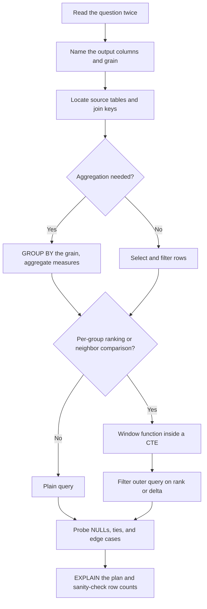

# SQL Interview Rounds

## Overview

SQL rounds evaluate database design ability, query fluency, and optimization thinking, and they appear in data engineering, backend, analytics, and SRE interviews across both product companies and mass recruiters. Unlike DSA rounds, where the problem space is unbounded, SQL interviews recycle a small canon of patterns — ranking, deduplication, time-window computation, and cohort analysis — which makes targeted preparation unusually high-yield. This page maps the four-round shape, drills the twelve query patterns that cover most interview questions, and closes with the window-function mental model, an index-aware review checklist, and a repeatable query-writing workflow. Companion pages cover the underlying machinery: [window functions](../dbms/sql/window-functions.md) in depth, and database internals from the [DBMS Overview](../dbms/overview.md).

## The Four-Round Shape

Regardless of company or role title, SQL interviews almost always decompose into four graded stages, and knowing the shape tells you where you are losing points. The stages escalate from recognition (MCQ), through production (query writing), to design (schema) and diagnosis (optimization).

| Stage | Format | What is graded | Typical failure mode |
|---|---|---|---|
| 1. MCQ / concept screen | 10-20 rapid questions | Syntax, NULL semantics, join types, index basics | Memorizing outputs instead of NULL-aware reasoning |
| 2. Query writing | 3-6 tasks on live tables | Correct results under joins, GROUP BY, subqueries | Off-by-one on ties; ignoring duplicate rows |
| 3. Schema design | One business scenario | Keys, normalization, indexes, constraints | Missing foreign keys and CHECK constraints |
| 4. Optimization | "Why is this slow?" | Reading EXPLAIN, index selection, rewrite strategy | Guessing instead of reading the plan |

Stage 1 rewards the fundamentals that the [technical interview](./technical-interview.md) page covers, and it is where NULL three-valued logic and `COUNT(*)` versus `COUNT(col)` differences live. Stage 2 is the heart of the interview and is almost entirely the twelve patterns below. Stage 3 tests whether you can translate a business paragraph into keys and constraints, which the [normalization pages](../dbms/normalization/README.md) cover systematically. Stage 4 separates candidates who have actually tuned a slow query from those who have only read about indexes.

## Common Round Formats

| Format | Duration | Focus |
|--------|----------|-------|
| Schema Design | 30-45 min | ER diagrams, normalization, indexing |
| Query Writing | 20-30 min | JOINs, subqueries, aggregations |
| Optimization | 20-30 min | EXPLAIN plans, indexing strategies |
| Analytical | 30-45 min | Window functions, CTEs, business metrics |

Companies weight these formats differently by role. Backend roles tilt toward schema design and optimization, analytics and data-engineering roles tilt toward analytical query writing, and generalist SDE roles often run a single 45-minute round blending query writing with schema discussion. Ask the recruiter which round format your loop uses, then weight your practice hours to match the format rather than spreading evenly.

## Schema Design

Interviewers present a business scenario and ask you to design tables. State your assumptions out loud before writing DDL, because the grading is on the reasoning trail, not just the final schema: how you handle nullable fields, whether status values are constrained, and how you expect queries to access the data.

**Example:** Design a schema for a ride-sharing app.

```sql
CREATE TABLE users (
    user_id BIGINT PRIMARY KEY,
    name VARCHAR(100) NOT NULL,
    email VARCHAR(255) UNIQUE NOT NULL,
    created_at TIMESTAMP DEFAULT CURRENT_TIMESTAMP
);

CREATE TABLE rides (
    ride_id BIGINT PRIMARY KEY,
    rider_id BIGINT REFERENCES users(user_id),
    driver_id BIGINT REFERENCES users(user_id),
    start_location GEOGRAPHY,
    end_location GEOGRAPHY,
    fare DECIMAL(10,2),
    status VARCHAR(20) CHECK (status IN ('requested','in_progress','completed','cancelled')),
    created_at TIMESTAMP DEFAULT CURRENT_TIMESTAMP
);

CREATE INDEX idx_rides_rider ON rides(rider_id, created_at);
CREATE INDEX idx_rides_driver ON rides(driver_id, status);
```

**Tips:** Discuss normalization versus denormalization trade-offs, and justify the composite indexes by naming the queries they serve — "fetch a rider's ride history newest-first" motivates `idx_rides_rider`. Mention partitioning a large rides table by month if volumes are high, and note that the status CHECK constraint prevents invalid transitions at the storage layer. For deeper index reasoning, see [SQL Indexes](../dbms/sql/indexes.md) and the [indexing strategy guide](../dbms/indexing-strategy.md).

## Window Functions Primer

Window functions are the most frequently tested advanced SQL topic, because they sit exactly where interviews separate candidates who know SQL syntax from those who can answer business questions. A window function computes a value over a *set of peer rows* — defined by `PARTITION BY` and `ORDER BY` inside `OVER (...)` — while keeping every input row in the output.

| Function | Purpose | Tie handling | Typical interview question |
|----------|---------|--------------|---------------------------|
| ROW_NUMBER() | Unique sequence per partition | Arbitrary (broken by ORDER BY) | Deduplication, latest row per group |
| RANK() | Position with gaps | Ties share rank; next rank skips | Leaderboards, top-K with ties visible |
| DENSE_RANK() | Position without gaps | Ties share rank; no gaps | Second-highest salary, top-N per group |
| LAG(col) | Previous row's value | — | Month-over-month, year-over-year growth |
| LEAD(col) | Next row's value | — | Time-to-next-event, funnel step deltas |
| NTILE(n) | Bucket rows into n groups | — | Quartiles, deciles of spend |

Three mechanical rules cover most mistakes. First, window functions cannot appear in `WHERE` or `HAVING` because they evaluate *after* those clauses — wrap them in a CTE or subquery and filter outside. Second, when `ORDER BY` is present the default frame is `RANGE BETWEEN UNBOUNDED PRECEDING AND CURRENT ROW`, and `RANGE` treats tied ordering values as peers, which silently changes running sums on duplicate dates; specify `ROWS` explicitly when you want row-by-row accumulation. Third, `PARTITION BY` resets the computation per group — a running total without a partition is a grand total.

**Pattern 1: Running totals**
```sql
SELECT order_date, amount,
    SUM(amount) OVER (ORDER BY order_date) AS running_total
FROM orders;
```

**Pattern 2: Rank with gaps**
```sql
SELECT employee_id, department, salary,
    RANK() OVER (PARTITION BY department ORDER BY salary DESC) AS rank
FROM employees;
```

**Pattern 3: Year-over-year growth**
```sql
SELECT year, revenue,
    LAG(revenue) OVER (ORDER BY year) AS prev_revenue,
    (revenue - LAG(revenue) OVER (ORDER BY year)) * 100.0
        / LAG(revenue) OVER (ORDER BY year) AS yoy_growth_pct
FROM annual_revenue;
```

### GROUP BY vs Window Functions: The Mental Model

`GROUP BY` collapses rows: one output row per group, and every selected column must be either grouped or aggregated. Window functions preserve rows: each output row corresponds to one input row, decorated with a value computed over its partition. The two compose — aggregation happens first, then window computation operates on the aggregated rows — which is why `SUM(x) OVER ()` after a `GROUP BY` gives each group's row a share of the grand total. If your answer needs *fewer rows*, you want `GROUP BY`; if it needs *the same rows but smarter*, you want a window function.

The evaluation order is the other half of the model: `FROM` → `WHERE` → `GROUP BY` → `HAVING` → window functions → `ORDER BY` → `LIMIT`. This explains the classic error of putting `ROW_NUMBER()` in a `WHERE` clause, and it explains why filtering on a window result requires a subquery or CTE. Some dialects (Snowflake, Teradata) offer a `QUALIFY` clause that filters window results directly, but in PostgreSQL and MySQL the CTE wrapper is the portable idiom.

## Twelve Query Patterns to Master

The patterns below cover the overwhelming majority of SQL interview questions reported by candidates. All of them run on this shared schema; each pattern states its gotcha, which is what interviewers probe after your first correct answer.

```sql
CREATE TABLE employees (
    emp_id     SERIAL PRIMARY KEY,
    name       TEXT NOT NULL,
    department TEXT NOT NULL,
    salary     NUMERIC(10,2) NOT NULL,
    manager_id INT REFERENCES employees(emp_id),
    joined_on  DATE NOT NULL
);

CREATE TABLE orders (
    order_id    SERIAL PRIMARY KEY,
    customer_id INT NOT NULL,
    amount      NUMERIC(10,2) NOT NULL,
    status      TEXT NOT NULL,
    created_at  TIMESTAMP NOT NULL
);

CREATE TABLE staging_orders (          -- no unique key: duplicates possible
    order_id    INT,
    customer_id INT,
    amount      NUMERIC(10,2),
    created_at  TIMESTAMP
);

CREATE TABLE logins (
    login_id   SERIAL PRIMARY KEY,
    user_id    INT NOT NULL,
    login_date DATE NOT NULL,
    UNIQUE (user_id, login_date)
);
```

**1. Second-highest salary.** The canonical opener; the tie semantics are the real question.

```sql
SELECT DISTINCT salary
FROM (
    SELECT salary, DENSE_RANK() OVER (ORDER BY salary DESC) AS rnk
    FROM employees
) ranked
WHERE rnk = 2;
```

*Gotcha:* with ties, `RANK`, `DENSE_RANK`, and `ROW_NUMBER` give three different "second" answers — `DENSE_RANK` gives the second *distinct* salary, `RANK` gives the second position, and only `ROW_NUMBER` guarantees exactly one row. If no second salary exists the query returns zero rows; a `LIMIT 1 OFFSET 1` version can also return empty, so say explicitly which behavior the business wants.

**2. Delete duplicates, keep one.** Given a table with no primary key, remove duplicate `(customer_id, created_at)` rows.

```sql
WITH dupes AS (
    SELECT order_id,
           ROW_NUMBER() OVER (PARTITION BY customer_id, created_at
                              ORDER BY order_id) AS rn
    FROM staging_orders
)
DELETE FROM staging_orders s
USING dupes d
WHERE s.order_id = d.order_id AND d.rn > 1;
```

*Gotcha:* window functions cannot be referenced directly in a plain `DELETE ... WHERE`, so the CTE (or a self-join on a unique key) is mandatory. Run the `SELECT` version first to preview what will be deleted, and decide the "keep" rule (lowest `order_id` here) before writing anything — "keep arbitrary" is not an answer.

**3. Running totals with an explicit frame.** Given a `daily_sales(order_date, amount)` table that can carry same-day ties.

```sql
SELECT order_date,
       SUM(amount) OVER (ORDER BY order_date
             ROWS BETWEEN UNBOUNDED PRECEDING AND CURRENT ROW) AS running_total
FROM daily_sales;
```

*Gotcha:* the default frame is `RANGE`, which includes all *peer* rows with the same `order_date` at once — with duplicate dates, `RANGE` and `ROWS` produce different totals. Ordering by a non-unique column without stating the frame is the single most common window bug in interviews.

**4. Month-over-month growth.** Revenue growth with safe division.

```sql
WITH monthly AS (
    SELECT DATE_TRUNC('month', created_at)::date AS month,
           SUM(amount) AS revenue FROM orders GROUP BY 1
)
SELECT month, revenue,
       LAG(revenue) OVER (ORDER BY month) AS prev_revenue,
       ROUND(100.0 * (revenue - LAG(revenue) OVER (ORDER BY month))
             / NULLIF(LAG(revenue) OVER (ORDER BY month), 0), 2) AS growth_pct
FROM monthly;
```

*Gotcha:* integer division truncates — cast with `100.0` before dividing or every growth figure rounds to zero. `NULLIF(..., 0)` guards the divide-by-zero on zero-revenue months, and a *missing* month simply produces a `LAG` jump across the gap; generating a continuous calendar with `generate_series` is the premium follow-up answer.

**5. Gaps and islands: consecutive-day streaks.** Find every run of consecutive login days.

```sql
WITH d AS (
    SELECT user_id, login_date,
           login_date - (ROW_NUMBER() OVER (
               PARTITION BY user_id ORDER BY login_date))::INT AS grp
    FROM logins
)
SELECT user_id, COUNT(*) AS streak_len,
       MIN(login_date) AS streak_start, MAX(login_date) AS streak_end
FROM d GROUP BY user_id, grp;
```

*Gotcha:* subtracting the row number from the date collapses each consecutive run into one constant `grp` — this is the "row-number trick" and interviewers expect you to explain *why* it works, not just recite it. Deduplicate dates first if multiple events per day are possible, and add `HAVING COUNT(*) >= 3` to filter meaningful streaks. The full treatment lives in [Gaps and Islands](../dbms/sql/gaps-and-islands.md).

**6. Department top-3.** The three highest-paid employees per department.

```sql
SELECT department, name, salary
FROM (
    SELECT department, name, salary,
           DENSE_RANK() OVER (PARTITION BY department
                              ORDER BY salary DESC) AS rnk
    FROM employees
) ranked
WHERE rnk <= 3;
```

*Gotcha:* the three ranking functions disagree on ties — `ROW_NUMBER` returns exactly three arbitrary winners, `RANK` returns three or fewer, and `DENSE_RANK` can return more than three rows. Which one is correct depends on the stated business rule, and saying that out loud is the actual test. The outer `WHERE` is required because window functions cannot sit in `WHERE` directly.

**7. Retention cohorts.** For each signup-month cohort, the percentage active in month 0, 1, 2, ....

```sql
WITH first_seen AS (
    SELECT user_id, MIN(login_date) AS first_date FROM logins GROUP BY user_id
),
cohort_size AS (
    SELECT DATE_TRUNC('month', first_date)::date AS cohort_month, COUNT(*) AS users
    FROM first_seen GROUP BY 1
),
returns AS (
    SELECT DATE_TRUNC('month', f.first_date)::date AS cohort_month,
           (EXTRACT(YEAR FROM l.login_date) - EXTRACT(YEAR FROM f.first_date)) * 12
             + (EXTRACT(MONTH FROM l.login_date) - EXTRACT(MONTH FROM f.first_date)) AS month_offset,
           COUNT(DISTINCT l.user_id) AS active_users
    FROM logins l JOIN first_seen f USING (user_id)
    GROUP BY 1, 2
)
SELECT r.cohort_month, r.month_offset, r.active_users, s.users,
       ROUND(100.0 * r.active_users / s.users, 1) AS retention_pct
FROM returns r JOIN cohort_size s USING (cohort_month)
ORDER BY r.cohort_month, r.month_offset;
```

*Gotcha:* the denominator must be the cohort size fixed at signup month, not monthly actives — getting this wrong inflates retention silently. `COUNT(DISTINCT user_id)` is required whenever logins repeat, month offset arithmetic is dialect-specific (`DATEDIFF`-style in MySQL, `EXTRACT` math in PostgreSQL), and month 0 is definitionally 100%.

**8. Employees earning more than their manager.** The classic self-join opener.

```sql
SELECT e.name
FROM employees e
JOIN employees m ON e.manager_id = m.emp_id
WHERE e.salary > m.salary;
```

*Gotcha:* you join the same table twice, so alias clarity (`e` for employee, `m` for manager) is scored. `INNER JOIN` drops the CEO whose `manager_id` is NULL — correct here, but state it. The correlated-subquery variant (`WHERE salary > (SELECT ...)`) is the standard "now why is that slow?" follow-up into stage 4.

**9. Median salary per department.** The average is the wrong statistic; the median is the point.

```sql
SELECT department,
       PERCENTILE_CONT(0.5) WITHIN GROUP (ORDER BY salary) AS median_salary
FROM employees
GROUP BY department;
```

*Gotcha:* `PERCENTILE_CONT` is an ordered-set aggregate supported in PostgreSQL and Oracle but not MySQL, where the portable fallback is counting rows with `ROW_NUMBER` against a `COUNT(*) OVER ()` partition. For even counts `PERCENTILE_CONT` interpolates between the two middle values while `PERCENTILE_DISC` picks an actual value — mention both. The business reason for preferring the median over the mean for pay data is the real answer.

**10. Top-K spenders with ties.** The five highest-lifetime-value customers.

```sql
SELECT customer_id, SUM(amount) AS total_spend
FROM orders
WHERE status = 'completed'
GROUP BY customer_id
ORDER BY total_spend DESC LIMIT 5;
```

*Gotcha:* `LIMIT` silently truncates ties, so the tie-aware version filters on `RANK() OVER (ORDER BY SUM(amount) DESC) <= 5` in an outer query. Filter with `WHERE` before aggregation, not `HAVING` — `HAVING` is for aggregate conditions. The escalation "top five customers *per city*" forces a `PARTITION BY city` window, and the escalation "their most recent order each" forces a latest-per-group pattern (next).

**11. Latest row per group.** Most recent completed order per customer.

```sql
SELECT DISTINCT ON (customer_id) customer_id, order_id, amount, created_at
FROM orders
WHERE status = 'completed'
ORDER BY customer_id, created_at DESC;
```

*Gotcha:* `DISTINCT ON` is PostgreSQL-specific; the portable form wraps `ROW_NUMBER() OVER (PARTITION BY customer_id ORDER BY created_at DESC)` in a CTE and filters `rn = 1`. The self-join/anti-join version breaks on tied timestamps, and the `ORDER BY` must lead with the partition column or the query errors out.

**12. Cumulative share of total.** Each month's revenue as a percentage of the year.

```sql
WITH monthly AS (
    SELECT DATE_TRUNC('month', created_at)::date AS month,
           SUM(amount) AS revenue
    FROM orders
    GROUP BY 1
)
SELECT month, revenue,
       SUM(revenue) OVER (ORDER BY month) AS cum_revenue,
       ROUND(100.0 * SUM(revenue) OVER (ORDER BY month)
             / SUM(revenue) OVER (), 1) AS pct_of_total
FROM monthly;
```

*Gotcha:* an empty `OVER ()` means the whole partition — the grand total — and it evaluates after the `GROUP BY`, so you are windowing over already-aggregated rows. This one question tests the entire GROUP-BY-versus-window mental model from the primer above. Cast to `100.0` for the same integer-division reason as pattern 4.

## Common Table Expressions (CTEs)

CTEs improve readability and enable recursive queries, and in interviews they are also the standard wrapper for filtering window-function output. Name each CTE for the business concept it computes, and the interviewer can follow your query the way they would follow prose.

```sql
WITH monthly_active AS (
    SELECT DATE_TRUNC('month', login_date) AS month,
           COUNT(DISTINCT user_id) AS mau
    FROM user_logins
    GROUP BY 1
),
prev_month AS (
    SELECT month, LAG(mau) OVER (ORDER BY month) AS prev_mau
    FROM monthly_active
)
SELECT m.month, m.mau, p.prev_mau,
    (m.mau - p.prev_mau) * 100.0 / NULLIF(p.prev_mau, 0) AS growth_pct
FROM monthly_active m
JOIN prev_month p ON m.month = p.month;
```

One caution worth voicing in interviews: before PostgreSQL 12, CTEs were optimization fences that materialized fully, so chaining a dozen CTEs could defeat index use. Modern PostgreSQL inlines CTEs referenced once, but mentioning that you know the fence behavior signals real production experience. Recursive CTEs (org charts, adjacency-list traversal) are a separate topic covered in [Hierarchical Queries](../dbms/sql/hierarchical-queries.md) and rarely tested outside analytics roles.

## Optimization Patterns

- Add indexes on columns in WHERE, JOIN, and ORDER BY clauses.
- Use covering indexes to avoid table lookups.
- Avoid `SELECT *`; specify only needed columns.
- Use EXPLAIN ANALYZE to identify sequential scans.
- Prefer UNION ALL over UNION when duplicates are acceptable.
- Use LIMIT early in subqueries to reduce intermediate result size.

Each of these bullets has a failure mode that interviewers like to explore: indexes go unused when the predicate wraps the column in a function, `UNION`'s dedup costs a sort that `UNION ALL` skips, and `LIMIT` inside a subquery only helps when the optimizer cannot push the limit down itself. Saying the failure mode, not just the rule, is what converts a canned answer into a senior-sounding one. The machinery behind all of it — B-tree structure, selectivity estimation, join ordering — lives in the [query planner page](../dbms/query-planner.md) and [execution plans](../dbms/query-processing/execution-plans.md).

## Index-Aware Query Review Checklist

Before submitting any query in an optimization round, run this checklist in order; each item maps to a plan operator you can name.

- Do `WHERE` / `JOIN` predicates hit a *leading* column of an existing composite index? Column order in the index matters more than column presence.
- Is any column wrapped in a function (`UPPER(col)`, `DATE(col)`) inside a predicate? Rewrite as a range condition or add a functional index.
- Are you selecting columns you never use? `SELECT *` forfeits index-only (covering) scans.
- Are joined columns the same type? An implicit cast (`varchar = int`) disables the index on one side; and `LIKE '%term'` cannot use a B-tree, while `LIKE 'term%'` can.
- Does `ORDER BY ... LIMIT n` match an index, avoiding a full sort node?
- In the plan: sequential scan on a large selective table is the missing-index signature, and wildly wrong row estimates (plan says 10, table has millions) mean stale statistics — `ANALYZE` is the fix.

## Query-Writing Workflow

Under interview pressure, most wrong SQL is written before any thinking happens — the candidate starts typing a `SELECT` while still parsing the question. The workflow below is deliberately boring: it forces the decisions that determine correctness to happen before syntax does.



Two habits make the workflow stick. Narrating steps out loud ("the grain here is one row per customer-month") turns silent typing into visible reasoning, which is what interviewers actually grade. And the final EXPLAIN-and-count step catches the two silent killers — a join fan-out that multiplied rows and a filter that eliminated everything — before the interviewer does.

## Practice Questions

**Q1:** Find the second-highest salary per department.
```sql
SELECT department, salary
FROM (
    SELECT department, salary,
           DENSE_RANK() OVER (PARTITION BY department ORDER BY salary DESC) AS rnk
    FROM employees
) ranked
WHERE rnk = 2;
```

**Q2:** Find users who logged in on 3 consecutive days.
```sql
WITH numbered AS (
    SELECT user_id, login_date,
           DATE(login_date) - INTERVAL '1 day' *
               ROW_NUMBER() OVER (PARTITION BY user_id ORDER BY login_date) AS grp
    FROM (SELECT DISTINCT user_id, DATE(login_date) AS login_date FROM logins) d
)
SELECT user_id, MIN(login_date) AS streak_start, COUNT(*) AS streak_days
FROM numbered
GROUP BY user_id, grp
HAVING COUNT(*) >= 3;
```

Note how both questions are instances of catalog patterns — Q1 is pattern 6 partitioned by department, and Q2 is pattern 5 in `INTERVAL` arithmetic. Recognizing the mapping is the skill being tested; re-deriving the trick from scratch under a clock is what unprepared candidates do.

## Interview Questions

1. **Why can't you use a window function directly in a WHERE clause?** SQL's logical evaluation order runs `WHERE` before window computation, so at filter time the window value does not exist yet for any row. The standard fix is computing the window function in a subquery or CTE and filtering in the outer query, which is why every top-N-per-group answer you write should have exactly two levels. Some dialects offer `QUALIFY` to filter windows directly, and mentioning that while saying "the portable form is a CTE" is the complete answer.

2. **When do you reach for GROUP BY versus a window function?** Decide by output shape: `GROUP BY` when the question needs fewer rows than the input (totals per month), windows when it needs the same rows decorated (each month plus its share of the year). They compose because aggregation evaluates before window computation, so `SUM(x) OVER ()` on grouped rows hands every group a copy of the grand total. The killer detail is the default `RANGE` frame on ordered windows — ties become peers and running totals jump — so disciplined answers specify `ROWS BETWEEN UNBOUNDED PRECEDING AND CURRENT ROW` explicitly.

3. **Find the second-highest salary. What breaks when there are ties?** The `DENSE_RANK() = 2` version returns the second *distinct* salary, which survives duplicate top salaries; `ROW_NUMBER() = 2` returns an arbitrary second row among tied top earners; and `LIMIT 1 OFFSET 1` on `ORDER BY salary DESC` returns whatever row sorts second, which is the top salary again if it is duplicated. The interviewer is checking whether you ask which definition the business means before coding. Also note that when a second salary does not exist, all correct versions return zero rows rather than NULL, and a `COALESCE` wrapper can change that if wanted.

4. **A report query takes 30 seconds. Walk me through your diagnosis.** Start with `EXPLAIN ANALYZE`, not with guesses, and read the plan tree from the most expensive node. Look for sequential scans on large tables with selective predicates (missing index), wrong row estimates (stale statistics), nested-loop joins driven by misestimated outer rows, and sorts that could be avoided by an index matching the `ORDER BY`. Then fix one thing at a time — index, rewrite, statistics — and re-run the plan, because each change can move the optimizer's join strategy. Candidates who mention checking that the predicate does not wrap columns in functions are the ones who have actually done this.

5. **What is the difference between RANK and DENSE_RANK, and when does the business care?** Both assign equal ranks to ties, but `RANK` skips the numbers after a tie while `DENSE_RANK` does not: salaries 100, 100, 90 get ranks 1, 1, 3 versus 1, 1, 2. The business cares in any top-N rule — "top 3 per department" returns more than three rows under `DENSE_RANK` when ties exist, and exactly three arbitrary rows under `ROW_NUMBER`. Stating the three-way trade-off and asking which tie policy applies is the scoring move, because the SQL for all three takes ten seconds to write.

6. **How do you compute month-over-month growth safely?** Aggregate to monthly grain first, apply `LAG(revenue) OVER (ORDER BY month)` for the previous value, and compute `100.0 * (cur - prev) / NULLIF(prev, 0)` so zero-revenue months do not raise a division error and the cast prevents integer truncation. Decide what a *missing* month means — `LAG` will happily compare March to January across the gap — and either insert zero rows for missing months or use a calendar table. Present the result with month 0 (or 1) growth as NULL by definition, because the first month has no prior to grow from.

## Key Takeaways

- The SQL loop is four graded stages — MCQ, query writing, schema design, optimization — and stage 2 is almost entirely the twelve-pattern canon.
- Window functions keep every row; `GROUP BY` collapses them. Windows evaluate after `GROUP BY`/`HAVING`, so filtering on them requires a CTE wrapper — and the default `RANGE` frame treats ordered ties as peers, so specify `ROWS BETWEEN UNBOUNDED PRECEDING AND CURRENT ROW` for true row-by-row accumulation.
- `RANK`, `DENSE_RANK`, and `ROW_NUMBER` answer three different tie policies — naming the business rule you are implementing is the actual interview question.
- Growth math needs `100.0 *` casts and `NULLIF(prev, 0)`; retention cohorts need a cohort-size denominator frozen at signup month.
- Deduplication and latest-per-group both reduce to `ROW_NUMBER()` over a partition; consecutive-streak problems reduce to date-minus-row-number.
- Read `EXPLAIN ANALYZE` before proposing any optimization, and check for function-wrapped predicates that silently disable indexes.

## Cross-references

- [Technical interview preparation](./technical-interview.md) — where SQL rounds sit in the broader loop
- [Online assessments](./online-assessment.md) — SQL sections inside timed assessments
- [Window Functions](../dbms/sql/window-functions.md) — the full reference behind the primer
- [Gaps and Islands](../dbms/sql/gaps-and-islands.md) — deep dive on pattern 5's family
- [SQL Indexes](../dbms/sql/indexes.md) — the index mechanics behind the review checklist
- [Window Function Problems](../dbms/interview-problems/window-function-problems.md) — harder drills in the same format
- [Normalization](../dbms/normalization/README.md) — preparation for the schema-design stage
- [Execution Plans](../dbms/query-processing/execution-plans.md) — reading the plan output stage 4 demands
- [PostgreSQL](../dbms/postgresql/README.md) — dialect notes for the PostgreSQL-flavored examples above
- [DBMS Overview](../dbms/overview.md) — the machinery underneath every query
