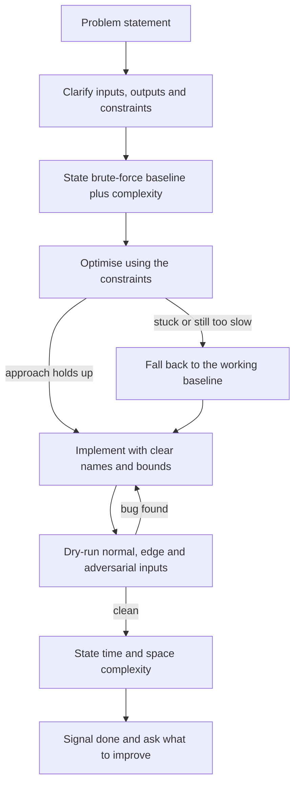

# Technical Interview Preparation

## Overview

A technical interview tests problem solving, communication, correctness, and trade-off awareness — not only whether code compiles. Interviewers are trained to watch how you think: what you clarify before coding, how you react to a hint, and whether your complexity claims survive scrutiny. Treat the interview as a small engineering design review with a time budget, where the code is evidence but the reasoning is the product being purchased.

This page covers the anatomy of a typical 45-60 minute round, a repeatable answer framework with a worked transcript, how to drive the project discussion on your own terms, whiteboard versus laptop etiquette, and pointers into this book's CS-fundamentals question banks. The skills here sit on top of the DSA and patterns material in [Coding Patterns](../interview/coding/patterns.md) and [Problem Solving](../dsa/chapters/ch47-problem-solving.md) — that content supplies the algorithms, this page supplies the delivery.

## Round Structure Anatomy

Most campus technical rounds follow a recognisable five-segment shape, even when the interviewer does not announce it. Knowing the shape tells you what each minute is for and prevents the classic mistake of burning 20 minutes on warm-up chat and rushing the implementation. The durations below assume a 45-60 minute round at a product company; service companies compress segments 2 and 3.

| Segment | Minutes | What Happens | What Is Being Scored |
|---|---|---|---|
| Warm-up | 3-5 | Introductions, resume skim, one soft question | Communication, confidence, resume honesty |
| DSA problem | 20-30 | 1-2 coding problems, increasing difficulty | Clarifying, approach, complexity, code quality |
| Project deep-dive | 10-15 | Your best project end to end | Ownership, depth of understanding, trade-off awareness |
| Puzzles / CS fundamentals | 5-10 | OS, DBMS, networks, OOP, or a small puzzle | Baseline breadth, reasoning under uncertainty |
| Your questions | 3-5 | You ask about the team or role | Curiosity, signal of how you evaluate employers |

The segment weights shift by company tier: mass recruiters run long fundamentals sections with easy coding, while product companies invert that and sometimes drop the puzzle segment entirely. Whatever the mix, the DSA segment is where most time is won or lost, so rehearse the full loop — clarify, solve, test, analyse — until it fits inside 25 minutes.

### Warm-Up

The warm-up is short but not worthless: interviewers use it to calibrate your communication speed and to pick which project they will probe later. Answer the introduction in 60-90 seconds using the present-past-future structure from [Common Behavioral Questions](../behavioral-interviews/common-questions.md), and mention the one project you most want to discuss — interviewers usually follow the hint. Do not recite your resume line by line, and do not open with weaknesses or family details. A calm, specific 90 seconds sets the tone for everything after it.

### The DSA Segment

You get one problem, sometimes two, and the expectation is a working solution plus a correct complexity statement inside the segment budget. The interviewer often has a rubric: did the candidate restate the problem, find the optimal class of solution, implement it, and handle edge cases without prompting. Partial credit exists — a clean brute force with correct analysis scores more than an unfinished clever idea. The patterns to master live in [Coding Patterns](../interview/coding/patterns.md); the delivery process is the framework in the next section.

### The Project Deep-Dive

This segment is entirely under your control, which makes it the highest-return minutes of the interview if you prepared. Expect architecture questions, "why did you choose X over Y", scale questions ("what happens at 10,000 users"), and the trap question "what would you improve". Students who can only describe features fail here; students who can defend decisions pass. The driving technique is covered in [Driving the Project Discussion](#driving-the-project-discussion) below.

### Puzzles and CS Fundamentals

Fundamentals rounds test breadth quickly: process versus thread, index types and when indexes hurt, TCP versus UDP, virtual memory, REST semantics. The interviewer is checking that your basics are load-bearing, not that you wrote a thesis — answer in two or three precise sentences, then stop. Pointers into this book's question banks are in [CS-Fundamentals Question Bank](#cs-fundamentals-question-bank).

### Your Questions

The closing minutes are scored too, and "no questions" reads as disinterest or as someone who did not research the company. Ask about the team's tech stack, how work is reviewed for freshers, or what a strong first six months looks like. Avoid asking only about salary, bonds, and leave — those belong to the HR round. Two thoughtful questions are enough; three maximum.

## Answer Framework

The framework below is the round structure compressed into a decision flow you can execute under pressure. Every arrow is a sentence you say out loud, which is why it doubles as a thinking-aloud scaffold. Rehearse it on 20 problems until the sequence is automatic, then stop thinking about it.



A repeatable sequence, expanded from the diagram:

1. **Clarify:** restate inputs, outputs, constraints, mutability, duplicates,
   ordering, and invalid cases.
2. **Model:** choose a data structure or system boundary and explain why.
3. **Baseline:** state a simple correct approach and its complexity.
4. **Optimize:** use constraints to remove repeated work or improve locality.
5. **Prove:** state the invariant, induction, exchange argument, or safety
   property that makes the approach correct.
6. **Implement:** write readable code with explicit names and bounds.
7. **Test:** dry-run normal, empty, singleton, duplicate, boundary, and adversarial
   inputs.
8. **Analyze:** give time, space, latency, capacity, and failure trade-offs.

## Thinking Aloud — A Worked Snippet

Silent candidates lose offers with correct solutions, because the interviewer cannot distinguish a thinking mind from a memorised answer. Thinking aloud means narrating decisions at the sentence level: what you noticed, what you are ruling out, and why. The snippet below shows the target texture for the first three minutes of a "find two numbers in a sorted array that sum to a target" style problem.

```text
Interviewer: You have a sorted array of integers and a target sum. Return the
indices of two numbers that add up to the target.

Candidate: Before I start — can the array contain duplicates, and is it sorted
ascending?  (Interviewer: yes and yes.)  And can the same element be used twice?
(No.) Good — so with duplicates allowed I cannot just skip equal neighbours.

The naive read is: fix one element, scan for its partner — that is O(n^2) time,
O(1) space. I can say that and beat it. The array being sorted is the gift here:
for a given left value, the partner is uniquely located, so two pointers closing
in from both ends should work. If the sum is too small I move the left pointer
right, if too large I move the right pointer left.

Each step discards one element from consideration, so the scan is linear — O(n)
time, O(1) space. That invariant — every step eliminates exactly one candidate —
is why it is correct. Shall I code the two-pointer version?
```

Note what the snippet does: asks three clarifying questions, states the baseline with complexity, names the structural insight (sorted), commits to an approach with a mechanism, and states the correctness invariant before asking permission to code. It never goes silent for more than a few seconds. Practise by recording yourself on ten problems and counting the seconds of silence — anything above 20-30 consecutive seconds should be replaced by a sentence like "I am checking whether a hash map beats sorting here".

## Driving the Project Discussion

The project deep-dive is the one segment where you control the agenda, so drive it deliberately. Open with a 60-90 second architecture tour: what the system does for whom, the main components, the data flow, and one number (users handled, records processed, latency achieved). Then steer toward the two decisions you can defend most deeply — every project has them — by ending the tour with "the interesting decision was X, happy to go deeper there". Interviewers take the invitation roughly 80 percent of the time, and now you are discussing prepared ground.

Use STAR structure for project stories, with the Result carrying a number: Situation (the project's purpose), Task (your specific slice), Action (what you built and the alternatives you rejected), Result (quantified). A weak result is "it worked"; a strong one is "p99 query latency went from 900 ms to 120 ms by adding the composite index". [Explaining Projects](../projects/explaining-projects.md) covers the full method, and [STAR Method](../behavioral-interviews/star-method.md) covers the storytelling frame.

"What would you improve?" is not an accusation — it is a seniority test. The failing answers are "nothing, it is complete" and a cosmetic fix ("better naming"); the passing answer names a real limitation, explains its trigger condition, and sketches the fix with a trade-off. Prepare two such improvements per project in advance.

| Interviewer Probe | Weak Answer | Strong Answer |
|---|---|---|
| "Why X over Y?" | "X is popular" | "We needed Y's property Z, but its cost was C, which our constraint ruled out" |
| "What breaks at 10x load?" | "It should scale" | "The single Postgres writer saturates around N rps; the fix is read replicas first, then partitioning by user_id" |
| "What would you improve?" | "Nothing major" | "Auth was bolted on late — I would move to a token service before adding the mobile client" |
| "What was hardest?" | "Debugging was hard" | "A cache-invalidation bug that appeared only under concurrent writes; I traced it with a repro script" |
| "Your role vs the team's?" | "We did everything" | "I owned the ingestion pipeline and the test suite; two teammates owned the UI" |

## Whiteboard vs Laptop Coding Etiquette

The medium changes the mechanics, not the standard. On a whiteboard or in a shared doc there is no compiler, so mental compilation and clean handwriting carry real weight; on a laptop or CoderPad, the compiler tempts you into trial-and-error, which interviewers read as a weakness. Optimise for the medium you get, and practise both deliberately before the season.

| Aspect | Whiteboard / Shared Doc | Laptop / CoderPad |
|---|---|---|
| Write order | Skeleton first (signature, loop bounds), then fill | Same discipline; resist running early |
| Corrections | Single clean line through; no scribbles | No rapid edit-run-edit cycles; explain each fix |
| Syntax errors | Minor — say "would compile, this is pseudocode-clean" | Zero excuses; code must run |
| Testing | Dry-run verbally with a small example | Write the dry-run as a comment or print trace |
| Talking | Face the interviewer, board at an angle | Talk while typing; do not go heads-down |
| Libraries | Allowed if you state complexity of the helper | Allowed, but be ready to implement it if asked |

Two rules apply in both media. First, declare your plan before writing — one sentence naming the approach and its complexity buys patience for the implementation. Second, when you find a bug yourself, say so before fixing it: self-review out loud is exactly the behaviour interviewers want to see on the job.

## Communication Patterns

Say the decision before the code:

> “Because the input is sorted and we need logarithmic search, I will maintain
> an inclusive interval and use a lower-bound invariant.”

Ask clarifying questions instead of silently assuming. If a requirement is
ambiguous, state the assumption and explain how the design changes if it is
false. Close each phase explicitly — "approach settled, moving to implementation" — so the interviewer always knows which box of the rubric you are filling. More on spoken structure in [Interview Communication](../communication/interview-communication.md).

## Coding Checklist

- Define the invariant before writing the loop.
- Avoid integer overflow in midpoint, multiplication, and capacity calculations.
- Decide whether ownership, mutation, and aliasing are allowed.
- Do not hide complexity inside a library call without knowing its behavior.
- Keep error handling consistent with the requested API.
- Compile mentally after each structural change.

## CS-Fundamentals Question Bank

Fundamentals rounds reward two days of structured revision per subject more than weeks of unfocused reading. Each bank below is a curated question list with model answers at interview depth; skim it twice, then rehearse answers out loud with a timer.

| Subject | Page | Highest-Yield Topics |
|---|---|---|
| Operating systems | [OS Questions](../interview/os-questions.md) | Process vs thread, scheduling, deadlock, virtual memory, paging |
| DBMS | [DBMS Questions](../interview/dbms-questions.md) | Normalisation, joins, indexes, ACID, isolation levels |
| Networks | [Network Questions](../interview/network-questions.md) | TCP vs UDP, handshake, DNS, HTTP/HTTPS, congestion |
| Computer architecture | [Architecture Questions](../interview/arch-questions.md) | Cache hierarchy, pipelining, endianness, interrupts |

For service-company rounds, fundamentals carry more weight than DSA depth, so invert your revision order accordingly. For product companies, expect fundamentals to be probed through your project — "why Postgres and not MongoDB for this schema" is a DBMS question wearing a project costume. SQL-specific rounds (common at fintech and analytics-adjacent roles) are covered separately in [SQL Rounds](./sql-rounds.md).

## System-Design Interview Outline

For a system-design question:

1. Clarify users, traffic, latency, consistency, retention, and failure goals.
2. Estimate request rate, storage, bandwidth, and peak multipliers.
3. Draw the request path and data ownership.
4. Choose APIs, storage, queues, caches, indexes, and partitions.
5. Explain consistency and failure behavior before adding scale.
6. Address observability, security, migrations, and operations.
7. Identify bottlenecks and the next scaling boundary.

Freshers rarely get full HLD rounds on campus, but a five-minute design sketch inside a technical round is common ("how would you store and serve these images at scale"). The full treatment, including the estimation drills, is in [System Design](../interview/system-design/README.md); low-level design and machine-coding rounds are in [Machine Coding](../machine-coding/README.md).

## Behavioral and Experience Bridge

Technical answers are stronger when connected to evidence. Prepare concise
stories covering an incident, a disagreement, a trade-off, a failure, a
performance improvement, and a project you would redesign. State the situation,
action, result, and what you learned; quantify impact without inventing numbers.
The story bank method is in [Behavioral Interviews](../behavioral-interviews/README.md).

## Red Flags Interviewers Watch

Interviewers are trained to score behaviours that predict on-the-job problems, and several of them are invisible to candidates. The list below is the negative image of the framework in this page — every entry has cost real offers in real rooms. Audit your mock interviews against it.

- Coding before confirming the problem, or ignoring constraints until the end.
- Going silent for minutes, then presenting a finished answer — unprovable and uncoached.
- Giving an optimal algorithm without being able to justify correctness.
- Claiming "exactly once" or "always works" without defining the failure boundary.
- Bluffing on a known topic — the follow-up question always exposes it.
- Treating average latency as the user experience while ignoring p99.
- Describing team projects with no personal, ownable slice.
- Arguing with a hint instead of integrating it; interviewers hint on purpose.
- Copy-paste-style rambling code with no naming discipline or structure.
- Running out of time because edge cases were postponed until the end.

The pattern behind the list is simple: interviewers hire evidence of reasoning, collaboration, and honesty, and every red flag is a failure of one of those three. When you do not know something, the high-scoring move is "I have not used that, but here is how I would reason about it" — then actually reason.

## Post-Interview Follow-Up

What you do in the 24 hours after a round changes outcomes more than students expect. Within a few hours, write a debrief while memory is fresh: every question asked, your answer, the gap you felt, and the page of this book that covers it. This log is your syllabus for the next drive, and after six or seven drives it becomes a personalised question bank no external resource can match.

If the company collects feedback asynchronously (common off-campus), a short thank-you note to the recruiter is polite and occasionally useful for scheduling nudges, but it does not change technical evaluation. Follow up on timelines after the stated date passes, once, in one line — recruiters respond to brief, specific messages and ignore anxious daily ones. If rejected and feedback is offered, take it literally: "needed more depth in round 2" means the project and fundamentals tracks of your plan, not another 100 random problems. Finally, keep the interviewer's problem list — companies recycle problem archetypes across seasons far more than candidates believe.

## Practice Rubric

After each practice problem, record:

| Dimension | Question |
|---|---|
| Understanding | Did I identify the actual contract and constraints? |
| Approach | Could I explain the baseline and optimization? |
| Correctness | What invariant or proof makes it work? |
| Implementation | Did the code expose unsafe assumptions? |
| Testing | Which case would fail first? |
| Complexity | Can I justify every term? |
| Communication | Would another engineer be able to review it? |

## Interview Questions

1. **The interviewer gives you a problem you have seen before. What do you do?** Say so immediately and briefly — "I have seen a variant of this; I will still walk through my reasoning" — because being caught silently replaying a memorised solution is a honesty failure, while disclosed familiarity is neutral. Then solve it properly, showing the same clarify-baseline-optimize loop as any other problem. Interviewers often mutate known problems precisely to test this, and the mutation is where undisclosed memorisation collapses. Disclosed familiarity plus clean process costs you nothing.

2. **You cannot find the optimal solution — is the round lost?** No, because rounds are scored on multiple axes and a working, well-tested O(n log n) solution with correct analysis beats a half-written O(n) idea. State the baseline, implement it cleanly, dry-run it, then narrate your optimisation attempts with their blockers — "this needs O(1) lookups, which suggests a hash map, but the sorted-order output would then cost O(n log n) to produce". Many interviewers escalate hints at exactly this point, and integrating a hint well is itself a scored behaviour. The round is lost by going silent, not by being suboptimal.

3. **How do you answer "what would you improve about your project"?** Name a real limitation with its trigger condition, then sketch the fix and its trade-off: "auth was bolted on for the demo — before a mobile client I would move to a token service, which costs a migration of the session table". This demonstrates self-critique plus engineering judgement, which is what the question actually tests. Prepare two such improvements per project in advance so the answer is instant. Never answer "nothing" and never pick a cosmetic improvement.

4. **What is the difference between how you solve on a whiteboard versus a laptop?** On a whiteboard, mental compilation matters most: write the skeleton first, keep corrections to single clean lines, and dry-run verbally. On a laptop, resist the edit-run-edit loop — declare the fix, apply it once, then run, because rapid trial-and-error reads as weak reasoning. Both media require saying the approach before writing it. Practise at least five problems in each medium before your first real round.

5. **How long should you spend clarifying before writing any code?** Two to four minutes is typical and healthy: restate the contract (inputs, outputs, edge cases, constraints), agree on an example, and state your baseline's complexity. Interviewers read insufficient clarification as a habit that produces wrong-but-fast code on the job. The exceptions are trivial warm-ups where over-clarifying wastes budget. If you are unsure whether a question is worth asking, asking it is almost always the better error.

6. **What should you do in the final five minutes of a round?** Finish cleanly: state final time and space complexity, mention one test you would add with more time, and then ask one or two genuine questions about the team. This closing sequence signals the exact behaviours — analysis, self-review, curiosity — that fill the last rows of the interviewer's rubric. Do not use the time to restart a failed approach, and do not skip your questions. The round's impression is set in its last two minutes more than candidates believe.

## Key Takeaways

- Rounds follow a five-segment anatomy — warm-up, DSA, project, fundamentals, your questions — and each segment is scored separately.
- The clarify → baseline → optimise → implement → test loop, spoken out loud, is the single highest-value habit on this page.
- Silence is the most expensive behaviour in an interview; replace it with narration of decisions and blockers.
- The project deep-dive is the only segment you fully control; drive it with an architecture tour plus two prepared defence points.
- Fundamentals revision is two days per subject from the question banks, not weeks of drift.
- Red flags are the inverse of reasoning-collaboration-honesty; audit mocks against the list.
- A written debrief within 24 hours turns every round into personalised preparation for the next.
- Suboptimal-but-clean and hint-responsive beats unfinished-and-clever on every real rubric.

## Cross-References

- [DSA problem-solving chapter](../dsa/chapters/ch47-problem-solving.md)
- [Technical communication](../dsa/chapters/ch48-technical-communication.md)
- [System design](../interview/system-design/README.md)
- [Behavioral interviews](../behavioral-interviews/README.md)
- [Coding patterns](../interview/coding/patterns.md)
- [Company preparation](../interview/companies/README.md)
- [Campus Placement Process](./campus-placement.md) — where this round sits in the funnel
- [Explaining Projects](../projects/explaining-projects.md) — the full project-defence method

## References

- [MIT 6.006 Introduction to Algorithms](https://ocw.mit.edu/courses/6-006-introduction-to-algorithms-fall-2011/)
- [MIT 6.046J Design and Analysis of Algorithms](https://ocw.mit.edu/courses/6-046j-design-and-analysis-of-algorithms-spring-2015/)
- [Google technical interviewing resources](https://careers.google.com/how-we-hire/interview/)
- [Cracking the Coding Interview](https://www.crackingthecodinginterview.com/)
