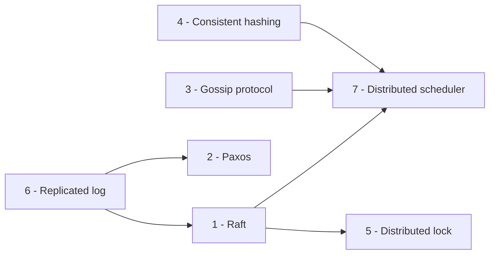
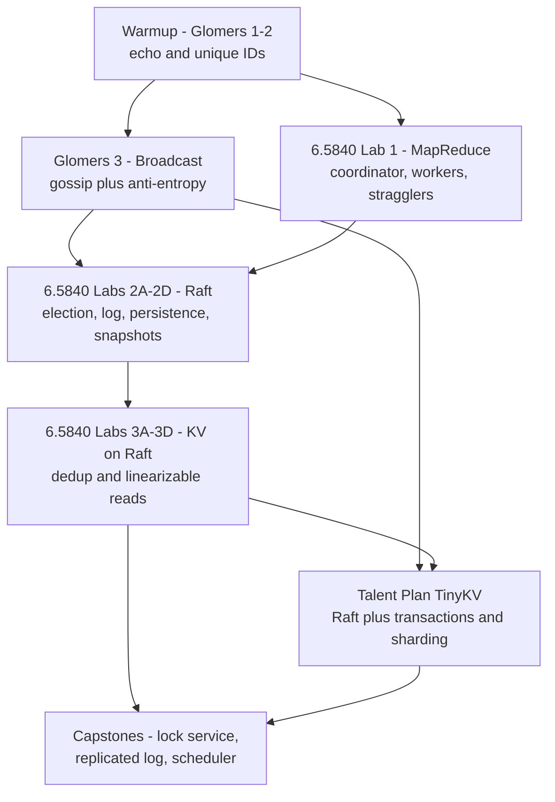

# Distributed Systems Build-It-Yourself Projects

## Overview

Reading papers teaches you what a protocol promises; implementing one teaches you why the promise is hard to keep. A distributed system is a set of concurrent processes that crash, stall, and lie to each other at the worst possible moment, and only code you wrote yourself confronts you with the consequences: the duplicate message that must be handled idempotently, the leader that is partitioned but still answering clients, the lock that expired while its holder was frozen in a GC pause. Even a bad implementation — especially a bad one — builds the intuition that makes interview answers concrete, because you have personally met the failure modes every distributed-systems design question orbits around.

This page is the curriculum for that kind of learning: seven self-contained labs, each scoped for a solo contributor, each with a concrete definition of done, the classic failure modes you will hit, and how to verify the result. It deliberately does not cover the testing tools themselves — the Jepsen test loop, the nemesis catalog, and the Maelstrom harness with its Gossip Glomers challenges are covered hands-on in [Jepsen, Maelstrom & Distributed Systems Testing](../../distributed/testing/jepsen-maelstrom.md). That page is the toolbox; this page is the workout plan. Pair them: pick a lab below, then use Maelstrom or a self-written nemesis harness to prove the result.

The seven projects roughly double as a build order — hashing and gossip as warmups, consensus and the lock service as the core, the scheduler as the capstone that consumes everything before it:

## 1. Build Raft

Implement the Raft consensus algorithm with leader election (randomized election timeouts, RequestVote RPC), log replication (AppendEntries RPC, matching log entries, commit index advancement), and log compaction via snapshots (serialize state, install snapshot RPC). Support a cluster of 3-5 nodes communicating over gRPC or raw TCP. Add a simple key-value state machine on top.

Scope it like the MIT 6.5840 sequence: 2A is leader election (a leader gets elected, stale leaders step down), 2B is log replication under unreliable networks, 2C is persistence (`currentTerm`, `votedFor`, and the log must survive a crash), 2D is snapshots, and 3A-3D build a linearizable KV service with client-session deduplication on top. "Done" means the tester passes *repeatedly* — run each suite 50-100 times, because consensus bugs are schedule-dependent lottery tickets — and the linearizability checker cannot catch your nodes cheating. The Raft page in this book covers the protocol; the lab teaches you everything the paper's one-sentence details hide.

Classic failure modes:

- Term confusion: a handler that accepts an AppendEntries from a deposed leader, or votes twice in one term, silently breaks safety; every RPC handler checks the term before doing anything else.
- Perpetual split votes: equal fixed election timeouts make two nodes campaign forever; randomize the timeout per node per election and ensure responses to stale-term RPCs are rejected.
- The dedup table: after a leader change, a retried client request must not execute twice — the client-session table belongs in the replicated log, not in leader-local memory that evaporates on failover.

Verify with the MIT tester, Maelstrom's `lin-kv` workload, and Go's `-race` detector as the bare minimum (see the Verification section below). The interview mapping is direct: "walk me through Raft leader election" and "what does a partitioned old leader do when clients keep writing to it" become stories told from your own bug list rather than from the paper's Figure 2.

**Key concepts**: Leader election, term numbers, split vote prevention, log matching property, commit index, snapshotting, linearizability, network partitions. **Complexity**: Advanced (5-7 weeks). **References**: Raft paper (Ongaro & Ousterhout), `etcd/raft` source, MIT 6.824 Raft lab, pingcap/raft-rs.

## 2. Build Paxos

Implement single-decree Paxos (proposer, acceptor, learner roles; prepare/promise, accept/accepted phases) then extend to Multi-Paxos for agreeing on a sequence of values (log replication). Implement a distinguished leader to skip the prepare phase for most proposals. Handle duplicate accept messages and stale proposals correctly.

Start with single-decree Paxos plus a property test that shuffles, drops, duplicates, and reorders messages between three acceptors — the protocol is small enough that a randomized harness explores most of the interesting space. Then extend to Multi-Paxos: a distinguished leader that skips the prepare phase for proposals inside its stability window, and re-proposes any unfinished decrees it discovers in the log after election. "Done" means the log converges identically on every node despite a nemesis that partitions and restarts processes, and holes get filled with legitimate re-proposals rather than deadlocking the log.

Classic failure modes:

- Hole-filling: after a failed proposal, a log slot is in an unknown state — re-proposing with a higher ballot is the only way out; forgetting this permanently wedges the log at that index.
- Promise arithmetic: an acceptor that promised ballot b must reject smaller-ballot accepts, but must also report any value it already accepted — discarding that answer loses committed values, the worst outcome in the protocol.
- Leader illusion: a leader that skips prepares without actually holding a quorum of promises splits the log across two "stability windows" and writes two values to one slot.

Because Paxos is small, this is the best lab to pair with model checking: a TLA+ spec of your message rules, or brute-force enumeration of interleavings for three nodes, catches cases random tests reach only by luck. The interview payoff is fluency on "how is Multi-Paxos different from Raft?" — leader election being outside the protocol, the prepare-phase optimization, and why nobody implements textbook Paxos are all things you can now explain from the inside.

**Key concepts**: Quorum, proposal numbers, promises, accept, learning a chosen value, leader election in Paxos, Multi-Paxos log optimization, liveness vs safety. **Complexity**: Advanced (5-7 weeks). **References**: "Paxos Made Simple" (Lamport), Google Chubby paper, "Paxos Made Live" (Chandra et al.), ZooKeeper ZAB protocol.

## 3. Build a Gossip Protocol

Implement a SWIM-style (Scalable Weakly-consistent Infection-style Process group Membership) protocol. Nodes periodically pick a random peer, ping it, and if the ping fails, indirectly probe through a third node. Suspect nodes are marked after a configurable timeout and confirmed dead after another timeout. Disseminate membership updates via piggybacking on ping/ack messages.

Scope it as SWIM proper: direct pings, indirect probes through a third node when the direct ping fails, a suspicion state that requires independent witnesses before a node is declared dead, and dissemination of membership updates piggybacked on protocol messages. "Done" means a 10-node cluster converges to a single membership view within a bounded number of rounds after any partition heals, and per-node bandwidth stays flat as you add nodes — the property that separates gossip from "everyone tells everyone everything."

Classic failure modes:

- Flapping: transient packet loss marks a healthy node suspected; without incarnation numbers and witness confirmations, the view oscillates and application code reacts to ghosts.
- Gossip storms: the naive implementation sends the full membership list to every peer every round — O(N) messages per node; prioritize recent changes and cap the payload to keep rounds bounded.
- Reincarnation: a recovered node must bump its incarnation number, or a stale "suspect" rumor from before the partition wins and a live node gets declared dead.

Maelstrom's broadcast and grow-only-counter workloads double as graders for this lab — they check eventual delivery and convergence, and their performance charts expose wasteful flooding the same way challenge 3d's message budget does (mechanics in [Jepsen, Maelstrom & Distributed Systems Testing](../../distributed/testing/jepsen-maelstrom.md)). Measure convergence time and messages-per-update explicitly. Interview mapping: "how would 1,000 nodes agree on membership without a central monitor?" and "what is indirect probing for?" — you can answer both with the round-count and byte-count numbers you measured.

**Key concepts**: Epidemic/gossip protocols, SWIM suspicion mechanism, indirect probing, dissemination (piggybacking vs anti-entropy), eventual consistency of membership views, failure detector accuracy. **Complexity**: Intermediate (3-4 weeks). **References**: SWIM paper (Das et al.), Serf membership protocol, Hashicorp Memberlist source, Cassandra gossip.

## 4. Build Consistent Hashing

Implement consistent hashing with a ring of virtual nodes (hash each physical node to K virtual positions on a 0-2^160 ring). Support adding and removing nodes with minimal key remapping (only keys in the affected range move). Measure the distribution uniformity and remapping cost. Extend with bounded loads to prevent any single node from receiving more than (1 + ε) × average load.

The gentlest lab here and the only one without concurrency — which makes it the ideal first week. Build the ring with K virtual nodes per server (K in the low hundreds), support membership changes, and write a harness that measures the two numbers that matter: the fraction of keys remapped when a node joins or leaves (should approach 1/N) and the max/min load ratio across nodes. "Done" means both numbers hold in your benchmark across adversarial node names, plus a bounded-loads variant that keeps any node under the (1 + ε) threshold by moving ownership on overflow.

Classic failure modes:

- Too few vnodes: with K = 10 the max/min ratio is easily 2-3x; plot the ratio against K and find the knee where the law of large numbers starts helping.
- Weak hash choices: hashing only an IP prefix, or placing vnodes deterministically adjacent, clusters the ring — the test suite should include adversarial node IDs, not just "node-1, node-2, ...".
- The linear-scan lookup: a naive walk around the ring per key destroys throughput; the sorted-ring binary search is half the point of the exercise.

Property tests shine here: for any sequence of membership changes, keys outside affected ranges must not move, and every key must resolve to exactly one owner before and after. Interview mapping: "how does Dynamo/Cassandra/Consul distribute keys?" and "what breaks when nodes have different capacities?" — bounded loads is precisely the answer to the second, and you have the remap-fraction measurements to quote.

**Key concepts**: Hash ring, virtual nodes for load balancing, minimal remapping on topology change, bounded loads, hash function choice (MD5, MurmurHash), replication on the ring. **Complexity**: Beginner-Intermediate (2-3 weeks). **References**: Dynamo paper, `hashring` Go library, libketama, "Consistent Hashing and Random Trees" (Karger et al.).

## 5. Build a Distributed Lock

Implement a lease-based distributed lock with fencing tokens. The lock holder receives a monotonically increasing fencing token that must be checked on every resource access (e.g., write to storage includes the token). On lease expiry, a new holder gets a higher token, and stale holders are rejected. Handle clock drift with Time-To-Last-Beat (TTLB) or a simple lease extension mechanism.

Scope it as a lease-based lock with monotonically increasing fencing tokens — and, the part everyone skips, a resource-side gate that actually checks the token. The lock service alone cannot prevent split brain; the point of the lab is to demonstrate the failure the token prevents. "Done" means your harness can show a stale holder's write being rejected by the storage gate after a GC pause outlives the lease, and every granted token is strictly greater than every token ever granted before it.

Classic failure modes:

- Wall-clock leases: expiry computed from the system clock plus clock skew silently shortens or lengthens leases; derive expiry from a monotonic counter or model skew explicitly.
- The gate is the hard part: the lock service knows who holds token 34, but only the resource — the file, the table, the KV entry — can reject token 33 at write time; put the check in the wrong layer and the lock is theater.
- Renewal races: extending a lease near expiry must be atomic with ownership; a lock that renews after a new holder took over needs exactly the fencing mechanism it was supposed to demonstrate.

The verification is a nemesis, not a test suite: suspend the lock holder (SIGSTOP, or a sleep in your own code) inside its critical section, let the lease expire, let client B acquire and write, resume A, and assert the storage rejects A's stale token. Interview mapping: the lock-service design question quoted at the end of this project list becomes an answer with scars — you can say "I built the gate in the wrong layer first, and the nemesis caught it."

**Key concepts**: Distributed mutual exclusion, lease-based locking, fencing tokens for liveness safety, clock drift problems, lock expiration and renewal, split-brain prevention, Chubby/etcd lock service. **Complexity**: Intermediate (3-4 weeks). **References**: "How to do distributed locking" (Martin Kleppmann), Redlock debate, etcd distributed locks doc, ZooKeeper recipes.

## 6. Build a Replicated Log

Implement a segmented replicated log backed by disk storage. Support appending entries, reading from a given offset, and truncating after a given index. Implement quorum-based writes (write to majority before acknowledging). Add log compaction (snapshot the state and truncate the log). Build a simple state machine that replays the log for crash recovery.

Build the storage layer first — segment files, per-record CRCs, an in-memory index mapping logical offset to (segment, file offset) — then wrap quorum writes around it: append to a majority, maintain a high-watermark, expose reads only up to the watermark. Add compaction: snapshot the state machine, then truncate everything below the snapshot point. "Done" means killing and restarting any follower at any arbitrary moment loses no acknowledged entry and never creates a gap or duplicate on replay.

Classic failure modes:

- The torn tail: a crash mid-append leaves a half-written record; without a CRC and a "truncate to last intact record" recovery step, replay reads garbage and the state machine diverges.
- Truncating the wrong things: recovery after a split brain must discard uncommitted suffixes — and if your watermark advances before the quorum ack lands, you have just lost an acknowledged write.
- Read-path races: readers snapshot the watermark, then compaction deletes segments under them; the offset map and file deletion need an epoch or reference count.

The verifier is a crash-injection loop: kill a node at random points (or at least at random await points in your code), restart, replay, and assert the replayed state machine equals the quorum's — a checksummed property test, not a demo. This lab is also the substrate for the Raft lab: do it first and consensus becomes "the replicated log plus leader discipline." Interview mapping: "how does Kafka achieve durability?" and "why write the WAL before the memtable?" are questions you answer from implementation memory.

**Key concepts**: Write-ahead log, segment files, index/offset mapping, quorum writes, log truncation, compaction/snapshotting, sequential I/O, recovery replay. **Complexity**: Intermediate (3-4 weeks). **References**: Kafka log implementation (`Log` class), etcd WAL, BookKeeper ledger, Apache Pulsar managed ledger.

## 7. Build a Distributed Scheduler

Implement a task scheduler with a coordinator and a pool of worker nodes. The coordinator maintains a task queue, dispatches tasks to workers via heartbeats or pull-based requests, and detects stragglers (tasks taking significantly longer than the median). Implement speculative execution: re-launch a straggler task on another worker and accept whichever finishes first. Support task dependencies (DAG-based scheduling).

The capstone: a coordinator with a task queue, workers with heartbeats (or pull-based dispatch), straggler detection against a rolling median, speculative execution of suspected stragglers, and DAG dependencies between tasks. "Done" means every task of a 1,000-task DAG produces its visible effect exactly once while your nemesis randomly kills workers, and the p99 makespan measurably improves when speculation is enabled against a straggler-heavy workload.

Classic failure modes:

- Duplicate side effects: after speculation, two workers run the same task; tasks must be idempotent or the coordinator must deduplicate by task ID at the sink — "accept whichever finishes first" only works if effects are attributable.
- The coordinator is a single point of failure, which is the hook back to lab 1: put Raft under the coordinator and the capstone consumes the core — this is also how you discover why real schedulers are consensus-backed.
- The thundering herd: on a heartbeat timeout every in-flight task re-queues at once; jitter re-dispatch and cap re-queue rates or the cluster DDoSes itself exactly when it is unhealthy.

Verification is a chaos harness plus accounting: inject worker kills, assert the task ledger shows exactly-once visible effects, and compare makespan and straggler distributions with and without speculation. Interview mapping: "how does MapReduce handle stragglers?" and "design a distributed task queue" — this lab is that design question, debugged, with the tail-latency numbers to show for it (see [Tail Latency](../../distributed/fundamentals/tail-latency.md)).

**Key concepts**: Master-worker architecture, task queue, heartbeat-based health checks, straggler detection, speculative execution, DAG scheduling, fault tolerance (task retry on worker failure). **Complexity**: Intermediate-Advanced (4-5 weeks). **References**: MapReduce paper (Dean & Ghemawat), Apache Spark DAGScheduler, Mesos scheduler, Ray scheduler.

> **Interview Angle**: "Design a distributed lock service" is a classic system design question. Having actually implemented fencing tokens and lease expiry makes your answer concrete — you can discuss real failure modes, edge cases, and trade-offs from experience rather than theory.

## The Lab Curriculum

If you want more scaffolding than the seven projects above, three curricula sequence this material for you, and one reading habit sharpens your judgment. They differ in how much structure they provide: MIT's labs hand you the test harness and a network simulator; fly.io's challenges hand you a fault-injecting grader with performance budgets; PingCAP's Talent Plan hands you a production-shaped codebase to extend. The table below is a suggested ordering; the dependency graph shows why.

| Order | Lab | Source | What it teaches | Prerequisites | Time |
|---|---|---|---|---|---|
| 1 | MapReduce — coordinator, workers, straggler handling | [MIT 6.5840 Lab 1](https://pdos.csail.mit.edu/6.824/) | RPC discipline, worker failure, commit-via-rename, exactly-once effects | Threads + RPC in Go or C++ | 1-2 weeks |
| 2 | Gossip Glomers 1-3: Echo, Unique ID Generation, Broadcast | [fly.io Distributed Systems Challenge](https://fly.io/dist-sys/) | Maelstrom protocol, retries + idempotency, epidemic broadcast, message budgets | Any language that reads stdin | 3-5 days |
| 3 | Gossip Glomers 4-6: Grow-Only Counter, Totally-Available Transactions, Kafka-Style Log | [fly.io Distributed Systems Challenge](https://fly.io/dist-sys/) | Convergence without coordination, CAP as lived experience, log-replication shape | Challenge 3 | 1-2 weeks |
| 4 | Raft 2A-2D — election, log, persistence, snapshots | [MIT 6.5840 labs](https://pdos.csail.mit.edu/6.824/) | Consensus itself, against an adversarial tester | MapReduce lab; `-race` fluency | 3-5 weeks |
| 5 | KV server on Raft 3A-3D — dedup, snapshots, sharded KV | [MIT 6.5840 labs](https://pdos.csail.mit.edu/6.824/) | Linearizable services on top of consensus, client sessions | Raft lab | 2-3 weeks |
| 6 | TinyKV — Raft + MVCC transactions + region sharding | [PingCAP Talent Plan](https://github.com/pingcap/talent-plan) | Production-shaped distributed KV (the TiKV skeleton) | One full Raft implementation | 4-6 weeks |
| 7 | Guided reading — three Jepsen analyses, end to end | [jepsen.io/analyses](https://jepsen.io/analyses) | How real systems actually fail; the anomaly vocabulary | None | ~1 week |

The order is not arbitrary: the Glomers warmups teach the request/retry/idempotency reflexes that consensus labs assume, and the MapReduce lab teaches coordinator-worker failure handling that the scheduler capstone consumes. Doing consistent hashing and gossip early also makes the later consensus work feel less arbitrary — membership and partitioning are the context consensus operates in. The six Gossip Glomers challenges (Echo, Unique ID Generation, Broadcast, Grow-Only Counter, Totally-Available Transactions, Kafka-Style Log) are Maelstrom-graded end to end; their mechanics — the JSON-over-stdio protocol, harness commands, per-workload checkers — are covered in [Jepsen, Maelstrom & Distributed Systems Testing](../../distributed/testing/jepsen-maelstrom.md), so go there for how to run them and come back here for where they fit.

Between the guided curricula, design your own labs against Maelstrom's provided services (`lin-kv`, `seq-kv`, `lin-tso`, broadcast, the Kafka-style log): a lease-based lock service on `lin-kv`, a sharded counter with consistent-hash routing, or a rate limiter under a clock-skew nemesis. The projects in sections 4, 5, and 6 above map one-to-one onto Maelstrom workloads, which is what makes the harness the ideal grader for self-designed exercises — grab it from [github.com/jepsen-io/maelstrom](https://github.com/jepsen-io/maelstrom). TinyKV is the industrial-strength tier and assumes you already survived one Raft implementation; treat it as a follow-on to the MIT labs, not a substitute. The guided reading row is the cheapest lab in the entire curriculum — an evening per analysis — and reading the Redis failover or Elasticsearch gateway reports with a pen, guessing the mechanism before the reveal, is what makes you sound senior in a design interview.

## How to Actually Do a Lab

The difference between finishing a lab and abandoning it in week two is rarely intellect; it is setup. The five decisions below are made once, in this order, before the first line of protocol code — each one unmade later costs days.

### Choosing a language

Go dominates this space for structural reasons: the MIT tester instantiates all your peers as goroutines inside one process (a "node" is just a data structure, and the harness controls the schedule), and Go's `-race` detector catches the shared-state bugs that are the number-one cause of failed Raft attempts. Rust and C++ work fine for the MIT labs too — the harness examples just favor Go. For Maelstrom the question mostly disappears: nodes speak newline-delimited JSON over stdin/stdout, so Python, Rust, JavaScript, or anything else participates, with official starter kits for several languages. Pick the language whose runtime you want to debug at 2 a.m., not the one the internet recommends.

### Scaffolding and workflow

One repository per lab, with the harness version pinned (a silent harness upgrade invalidates your "passing" state), CI that runs the suite N times with different seeds, and a README that records design decisions as you make them. Commit per milestone — election passing, replication passing, persistence passing — because bisecting a consensus regression across small commits is easy, and across a week of uncommitted work is hopeless. Write the invariant assertions into the code itself (no two live leaders in one term; the log-matching property on every AppendEntries reply): a violated assertion with a stack trace is a debugging session, a violated property discovered by a checker is an afternoon.

### The transport decision

Three options in increasing realism: in-process channels (fastest iteration, full schedule control, but hides serialization and framing bugs entirely), real RPC over TCP or gRPC (catches partial writes, connection storms, and framing mistakes, at the cost of noisy timing), and Maelstrom's stdio transport (separate processes plus fault injection for free). A workable path: build the protocol core against channels, keep the transport behind a narrow interface, and graduate to Maelstrom or real RPC once the logic is stable. The interface boundary costs an hour up front and saves a rewrite later — protocol logic that assumes in-process delivery will need surgery the first time a message is lost.

### Time, timers, and determinism

The classic traps, all met personally by everyone who has done the Raft labs: trusting wall-clock time (election timeouts must be randomized or two candidates fight forever); sleeping inside handlers while holding state (a sleep inside a lock hold is how you demonstrate the fencing-token failure to yourself); and assuming a passed test will pass again (it will not — consensus bugs are schedule-dependent, which is why "run it 100 times" is the rule). If you want exact reproducibility, that is deterministic simulation's job — the entire network simulated from a seed, so a failing run replays forever — covered in [Deterministic Simulation Testing](../../distributed/testing/deterministic-simulation.md). Even without it, never let real time leak into safety decisions: time belongs in liveness mechanisms only.

### The 0/4 to 4/4 cycle

Every lab has a predictable emotional arc. The first harness run fails all checks on plumbing — a missing stdout flush, an unhandled message type, a panic on a resend of a message you already answered. Fixing plumbing gets you to half-passing and the first *real* bug: a stale read after a partition heals, or a client request executing twice across a leader change. The checker hands you the exact history; the fix is usually a design decision (the dedup table goes in the log), not a patch. Then you reach full-passing and a longer run or a new nemesis breaks it again. That cycle, repeated five or six times per lab, is the education — the checker is teaching you, not grading you, and the failures are the curriculum.

## Verification: How You Know It Works

A lab without a checker is a demo; a lab with a checker is a result. The checking story is the same at every scale: run concurrent clients, record the full history including unknown-outcome operations, and let a model decide whether the history matches what you promised. The machinery — the Jepsen loop, the nemesis catalog, the linearizability checker — lives in [Jepsen, Maelstrom & Distributed Systems Testing](../../distributed/testing/jepsen-maelstrom.md) and [Jepsen: Fault Injection and Correctness Checking](../../distributed/testing/jepsen.md); what follows is how to layer your own checks on top.

Beyond the harness's checker, write property tests that encode your design's core claims directly: for the ring, "membership changes remap only affected ranges"; for the log, "replay from any snapshot equals the quorum's state machine"; for the lock, "the storage never accepts a token below the highest it has seen." If the protocol is small enough — single-decree Paxos is — model checking the message rules (TLA+ or brute-force enumeration) finds corner cases that random tests reach only by luck. The cheap loop that catches most bugs early is integration tests under the race detector with randomized schedules: `go test -race -count=50`, loom in Rust, or any test harness that jitters delays. Most "impossible" Raft failures are ordinary data races made exotic by timing.

The fault ladder is the milestone plan. Climb it in order and stop at the first stage that breaks — the bug you find there is almost always a real design gap, and the stage number tells you how deep it goes:

| Milestone | What you inject | What typically breaks first |
|---|---|---|
| 1. No faults | clean runs on the happy path | usually nothing — this proves plumbing only |
| 2. Crashes | kill mid-RPC and restart | un-persisted `votedFor`/log, zombie leaders, re-executed requests after recovery |
| 3. Partitions | majority/minority split, then heal | split brain, stale reads on heal, election storms, duplicated effects |
| 4. Slow network | injected latency and jitter | timeout mis-tuning, cascading reelections, heartbeat false positives |
| 5. Clock skew | step clocks forward and back | leases held past expiry, last-write-wins conflicts resolving backwards, TTL chaos |

A lab that has survived only stage 1 has proven nothing about distribution; stage 3 is where most projects learn the difference between "the tests pass" and "the system works," and stage 5 is where anything timestamp-based gets humbled. Each stage corresponds to a Jepsen nemesis class, which is why finishing the ladder makes the professional tools feel familiar rather than foreign. Whatever the ladder exposes, record it: the failure and its fix are next section's raw material.

## The Interview Payoff

Labs pay off in interviews in one specific way: they convert protocol knowledge into testimony. "Raft uses randomized timeouts" is a fact anyone can quote; "my split votes came from seeding the randomizer identically on every node, and the fix was per-node seeds, not longer timeouts" is evidence you have operated the thing. The table maps each lab to the signal it produces and the question it typically answers:

| Lab | Signal it produces | Interview question it maps to |
|---|---|---|
| Raft | leader election + log replication war stories, persistence discipline | "Walk me through Raft"; "what does a partitioned ex-leader do?" |
| Paxos | ballot/quorum reasoning from first principles | "How do Multi-Paxos and Raft differ?" |
| Gossip | eventual-consistency fluency, bandwidth-vs-convergence numbers | "How do 1,000 nodes agree on membership without a monitor?" |
| Consistent hashing | partitioning and rebalancing instincts with measurements | "How does Dynamo distribute keys? What moves when a node joins?" |
| Distributed lock | fencing tokens and lease-expiry failure modes | "Design a distributed lock service" |
| Replicated log | storage-durability depth: WAL, CRCs, recovery | "How does Kafka stay durable? Why WAL before memtable?" |
| Scheduler | stragglers, speculation, exactly-once accounting | "Design a distributed task queue"; "how does MapReduce handle stragglers?" |

On a resume, "implemented Raft" is a line item; "took my Raft KV from 0/4 to 4/4 on the linearizability checker after fixing a cross-leader dedup bug that duplicated client requests" is a story. The formula for presenting any lab: say what you *measured* (messages per op, convergence rounds, violation counts per 1,000 operations), what *broke* (the nemesis that caught you — a partition, a pause, a clock step), and what you *fixed* (the design decision, not the patch). Expect the follow-ups "what surprised you?" and "what breaks at 100x scale?" — the first is always a specific bug, which is exactly what these labs manufacture, and the second you can only answer credibly if you measured at small scale first. That measurement habit, more than any protocol fact, is the durable interview payoff of building things badly on purpose.

## Cross-References

- [Jepsen, Maelstrom & Distributed Systems Testing](../../distributed/testing/jepsen-maelstrom.md) — the toolbox companion: the Jepsen loop, nemesis catalog, Maelstrom harness and Gossip Glomers mechanics for grading these labs
- [Jepsen: Fault Injection and Correctness Checking](../../distributed/testing/jepsen.md) — anatomy of the famous analyses and the checking method
- [Deterministic Simulation Testing](../../distributed/testing/deterministic-simulation.md) — the reproducible cousin of the fault-injection ladder: seeds, replay, Buggify
- [Raft Consensus](../../distributed/consensus/raft.md) — the protocol behind labs 1 and the coordinator of the capstone
- [Multi-Paxos](../../distributed/consensus/multi-paxos.md) — the theory behind lab 2
- [Memberlist & Gossip Internals](../../distributed/systems/memberlist-gossip.md) — production-grade numbers for the gossip lab
- [Distributed Locks and Fencing Tokens](../../distributed/fundamentals/distributed-locks.md) — the design space for the lock lab
- [Fencing Tokens: Enforcing Expiry Where the Data Lives](../../distributed/fundamentals/fencing-tokens.md) — the (epoch, counter) gate design in depth
- [MapReduce and Distributed Processing](../../distributed/mapreduce/README.md) — the architecture the scheduler lab miniaturizes
- [Build-It-Yourself Track](./README.md) — the parent track: OS, database, networking, and compiler project guides

## Interview Questions

1. **Why is implementing Raft so much harder than reading the paper?**
   The paper describes the protocol; the difficulty lives in the details it deliberately elides. Every RPC handler must be defensive about terms (reject anything from a stale term before acting), persistence boundaries must be drawn correctly (`currentTerm`, `votedFor`, and the log go to disk before acknowledging; the commit index can be rebuilt), and client requests need deduplication across leader changes, which the paper covers in a sentence. Then timing: election timeouts must be randomized or two candidates campaign forever. Reading gives you the algorithm; implementing gives you the ten bug classes the algorithm glosses over.

2. **You need a distributed lock for a job scheduler. What must be true for it to be safe, and what would you measure?**
   A lease alone is not safety: the holder can stall — GC pause, VM migration — past expiry while the service grants the lock to someone else, and both write. Safety requires fencing tokens, monotonically increasing numbers granted with the lease, and critically a check inside the resource: the storage rejects any write whose token is below the highest it has seen. The lock service cannot enforce this itself because it cannot reach into the storage layer at the moment of the race. What to measure: whether the gate rejects the stale token after an injected holder pause, token-grant behavior during partitions, and the false-expiry rate under clock skew.

3. **Your gossip protocol works on 10 nodes. What breaks at 1,000?**
   Three things, roughly in order. Bandwidth: full-mesh gossip costs O(N) messages per node per round, so at 1,000 nodes the protocol spends more bytes on membership than on data — you need piggybacking, bounded payloads, and recent-changes-first dissemination to converge in O(log N) rounds. Convergence versus stability: longer dissemination windows mean joins, failures, and suspicions interleave, and flapping amplifies traffic exactly when the network is struggling. State size: a full membership list stops fitting in one datagram, so production systems like Serf and Memberlist cap payloads and accept slower convergence — the correct trade at that scale, and one you can only justify by having measured the small-scale numbers first.

4. **Your lab tests all pass. Does that mean the system works?**
   No — a passing test is a sample of schedules, not a proof. Verification means a checker grades recorded histories against a stated consistency model (linearizability for the KV, convergence for gossip), under a fixed fault ladder — no faults, crashes, partitions, slow network, clock skew — and the suite passes repeatedly under randomized schedules, not once. On top of that: invariant assertions living in the code, property tests of the design's core claims, and model checking if the protocol is small enough. The mature framing for an interviewer: "here is the model I promised, here is the fault ladder I survived, and here is what I still cannot claim" — the last clause is what makes the first two believable.

## Key Takeaways

- Implementing beats reading for distributed systems: stale terms, duplicate effects, and lease expiry mid-pause only become real when you debug them yourself.
- Order matters: Glomers 1-3 and MapReduce as warmups, consensus on a stable codebase next, then the lock service, replicated log, and scheduler as capstones.
- "Done" is a property, not a feeling: a named consistency model, checked by a real checker (Maelstrom, the MIT tester) under a fault ladder, passed repeatedly with randomized schedules.
- Climb the fault ladder in order — no faults, crashes, partitions, slow network, clock skew — and stop at the first stage that breaks; that bug is your real design gap.
- Go dominates the MIT labs (goroutine-node tester, `-race` detector), but Maelstrom speaks JSON over stdio, so the language argument only applies to the harness you choose.
- PingCAP Talent Plan's TinyKV is the follow-on tier, not the on-ramp: do it after one complete Raft implementation.
- On a resume, report what you measured, what broke, and what you fixed — "implemented Raft" is a line item, "0/4 to 4/4 after fixing cross-leader dedup" is a story.
- The toolbox — Jepsen loop, Maelstrom harness, Glomers mechanics — lives in the testing pages; this page is the curriculum, and the two are designed to be paired.

## References

- [MIT 6.5840 (6.824) Distributed Systems — labs, schedule, and materials](https://pdos.csail.mit.edu/6.824/)
- [Fly.io Distributed Systems Challenge — the six Gossip Glomers challenges](https://fly.io/dist-sys/)
- [jepsen-io/maelstrom — the Jepsen-built harness for student systems](https://github.com/jepsen-io/maelstrom)
- [PingCAP Talent Plan — tinykv and tinysql course series](https://github.com/pingcap/talent-plan)
- [Jepsen — the testing methodology](https://jepsen.io/) and the [analyses index](https://jepsen.io/analyses)
- Ongaro & Ousterhout, "In Search of an Understandable Consensus Algorithm" (USENIX ATC 2014) — [raft.github.io/raft.pdf](https://raft.github.io/raft.pdf)
- Das, Gupta, Motivala, "SWIM: Scalable Weakly-consistent Infection-style Process Group Membership Protocol" (DSN 2002)
- Kleppmann, "How to do distributed locking" (2016) — the Redlock/fencing-tokens debate
