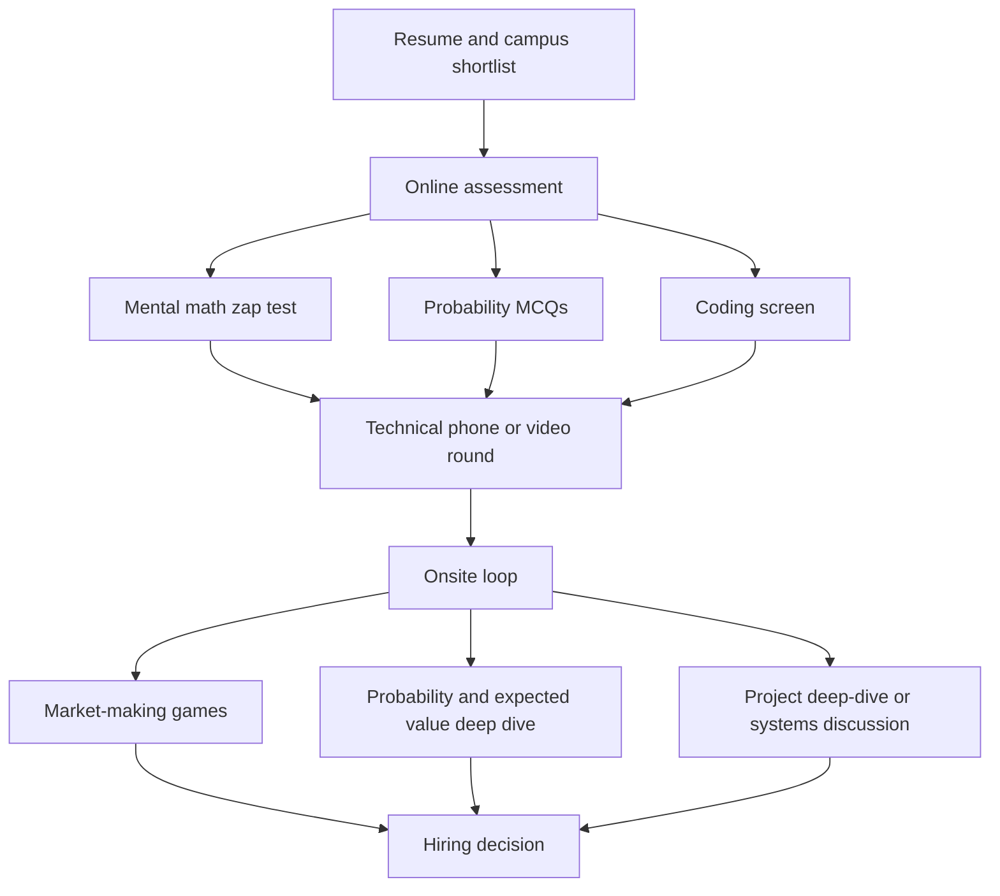
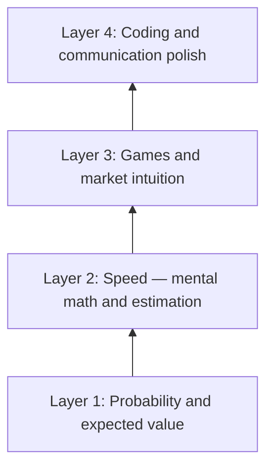

# Quantitative Finance Interview Preparation

## Overview

Quantitative trading firms pay the highest starting compensation in the Indian and global tech-adjacent market, and they hire through a funnel that looks superficially like the standard SDE pipeline but tests an almost disjoint set of skills. This section is the hub for that funnel: it maps the firm landscape, defines the three quant roles and what each interview actually measures, dissects the interview stages from resume screen to onsite loop, and links every skill involved — probability, mental math, games, coding — to the pages of this book that train it. Read this page first; every sibling page assumes the vocabulary and the funnel anatomy defined here.

The section is written for two readers at once. The campus candidate targeting India-based prop firms and global market makers' hiring tests needs the funnel map and the four-week plan below. The self-selecting reader who has heard "quant pays well" and wonders whether the work suits them needs the honest description of what each role does all day, because the mismatch between imagined and actual quant work is one of the most common reasons strong candidates fail onsite loops — they prepare for the wrong job.

Three disciplines dominate the interview material and each has a home in this book: probability and expected-value reasoning (deepened in [probability and statistics](../mathematics/probability-statistics.md)), logic warmups and brainteasers (worked through in the [puzzles section](../interview/puzzles/README.md)), and implementation speed under pressure (the [DSA track](../dsa/README.md) and its contest-driven companion pages). The quant-specific layer — market-making mechanics, betting games, firm formats — is what this section adds on top.

A note on scope keeps expectations calibrated. This section is not a derivatives-pricing course and does not pretend stochastic calculus is a campus interview gate; Indian campus loops and global entry-level trader loops overwhelmingly test probability, speed, and judgment, with pricing depth reserved for specialist roles. Where a topic belongs to another track — statistics fundamentals to the mathematics track, coding patterns to the interview coding pages — this section links rather than duplicates, so the whole book remains one coherent resource rather than two overlapping ones.

## The Firm Landscape

"Quant" is an umbrella over at least three distinct businesses, and interviewers from each will run noticeably different loops. Market makers and high-frequency trading firms quote two-sided prices in liquid instruments and earn the spread thousands of times a day; proprietary shops take directional and relative-value positions with the firm's own capital; hedge funds manage outside investor money across longer horizons. The distinction matters because it changes what gets measured — a market maker screens hardest for speed and probabilistic reflexes, while a fund's researcher screen weights statistics and data intuition much more heavily.

| Category | Representative firms | Core business | What the screen emphasizes | Loop flavor |
|---|---|---|---|---|
| Market makers / HFT | Jane Street, Hudson River Trading, Optiver, IMC, SIG, Citadel Securities | Quote bid-ask in liquid markets; earn the spread at scale | Mental math speed, probability reflexes, games under time pressure | Zap tests, market-making games, rapid-fire brainteasers |
| Proprietary trading shops | Jump Trading, DRW, Akuna Capital | Directional and relative-value bets with firm capital | Probability, decision-making under uncertainty, some coding | Probabilistic cases, risk sizing discussions, coding screens |
| Hedge funds (investment side) | Two Sigma, DE Shaw, Citadel | Longer-horizon strategies on investor capital | Statistics, machine learning, data intuition, research craft | Project deep-dives, modeling case studies, systems and coding |

Within each firm the interview weight also varies by desk and role — an options market-making desk at a market maker leans on mental math and greeks intuition, while a statistical arbitrage group leans on time-series and data hygiene. The practical advice is to research the specific team's function before the loop and adjust the emphasis of your preparation, not to prepare for an averaged "quant interview" that does not exist.

### Compensation, Hours, and Honest Realities

The compensation story is real but worth stating precisely, because planning around rumor wastes career decisions. Top-of-market quant compensation in India and abroad regularly reaches several times the standard product-company band for the same graduating batch, with performance-linked upside that compounds on the trading side. The costs are equally real: the work is concentrated in a handful of cities, the hours follow market sessions rather than a relaxed calendar, job security differs fundamentally from service-company stability because performance is measured continuously, and the skill set is more specialized — a trader's skills transfer within the industry better than outside it. Candidates who would enjoy the problem-solving regardless of the pay band tend to thrive; candidates optimizing purely for the number frequently discover in the onsite loop that the games are not fun for them, which is exactly the signal the games are designed to produce.

## The India Quant Scene

India hosts a dense cluster of proprietary trading and market-making firms that recruit almost entirely from the top engineering and statistics campuses. The names to know include Graviton, Quadeye, AlphaGrep, iRage Capital, Dolat Capital, and the India offices of Tower Research — listed here by name only, because this book's URL policy excludes unverified links and because these firms' hiring flows run through campus placement cells and referral channels rather than public career pages anyway. Most of these firms trade Indian exchanges (NSE and its derivatives complex) with strategies and infrastructure comparable to global standards, and several also connect candidates to their international desks.

The hiring channel is the part that changes preparation strategy. These firms primarily hire from IITs, IIITs, ISI, and IISc, with compensation packages that sit at the very top of campus offers — frequently several times the standard product-company band for the same graduating batch. The campus funnel typically starts with a resume shortlist weighted heavily on contests, projects, and olympiad or competition math credentials, followed by an onsite-style loop compressed into placement week. Because the shortlist is small and the loop is concentrated, a candidate can prepare for the entire Indian quant season with the same four-week plan a global loop needs — the difference is that campus OAs compress the zap test and probability screens into a single sitting.

Two structural consequences follow from the campus-driven model. First, contest performance is the most legible credential an Indian quant applicant can own: a strong Codeforces or ICPC record, or a visible math-olympiad background, functions as the resume filter that product companies replace with CGPA. Second, off-campus entry exists but is referral-heavy, so the realistic path for most students is to win the campus test — which is why the skills pyramid below starts with the drills campus OAs actually run.

### The Campus OA, Up Close

The Indian quant OA compresses the global funnel's first two stages into a single high-pressure sitting, usually ninety to a hundred and twenty minutes. A representative structure is a mental-math section with thirty to fifty questions and negative marking or strict per-question timing, a probability and combinatorics section at the level of conditional expectation and dice-and-cards counting, and one or two coding problems strictly below contest difficulty but aggressively time-boxed. The mental-math section is the differentiator: product-company OAs contain nothing like it, so even strong coders walk in untrained and lose the shortlist on arithmetic alone. Firms also watch section-switching behavior on proctored platforms, so the drill order matters — bank the arithmetic section fast, then spend the recovered minutes on probability.

## Roles: Trader, Researcher, Developer

Every quant firm hires three distinct jobs, and confusing them produces mismatched preparation. The trader interview is a live performance under time pressure; the researcher interview is an evidence-and-depth conversation; the developer interview is the closest cousin to the standard SDE funnel this book already covers. The table below is the contrast, and the honest self-assessment it enables is worth more than any generic "how to get into quant" advice.

| Role | Day-to-day work | Core interview skills | Prep overlap in this book |
|---|---|---|---|
| Quantitative trader | Quote markets, size positions, manage live risk | Probability, expected value, mental math speed, game intuition | Puzzles, probability drills, market-making games |
| Quantitative researcher | Design and validate signals and models from data | Statistics, machine learning, data intuition, skepticism | Probability-statistics track, ML foundations, project deep-dives |
| Quantitative developer | Build and maintain trading systems, data pipelines, low-latency infrastructure | Algorithms, systems design, C++/Python craft | The DSA track, systems pages, coding-interview patterns |

The roles also differ in what kills a candidacy. A trader dies from slow arithmetic or freezing in a game; a researcher dies from a shallow thesis about their own project or from pattern-matching ML vocabulary without understanding; a developer dies from the same algorithmic gaps that kill any SDE loop, plus concurrency and latency questions that standard interview prep skips. Candidates should pick one role per firm loop and prepare for that role's failure modes rather than hedging across all three.

The split also matters for how you read job postings and interview experiences. Trader postings at market makers advertise "probability and games"; developer postings advertise systems languages and low-latency craft; researcher postings advertise statistics and papers. Interview-experience reports are role-specific too, and the single most common preparation error reported by rejected candidates is preparing for the wrong role's loop at the right firm. Treat the role decision as a week-one decision of the four-week plan, made via the self-diagnosis below, not a form field to fill at registration.

## A Five-Minute Market-Making Primer

Interview games presume a tiny amount of market mechanics that no other placement track teaches, so the primer here prevents the "what does 'make me a market' mean?" stall. A market maker's job is to quote two prices for something with uncertain value: the **bid** (what you will pay to buy it) and the **ask** (what you charge to sell it). The gap between them, the **spread**, is compensation for two risks the maker absorbs: **inventory risk** (you end up holding the thing as its value moves) and **adverse selection** (the counterparties who most want to trade against you are the ones who know something you do not). Your quotes must therefore be wide enough to survive being wrong and narrow enough to attract flow — and every adjustment you make to them under new information is the live demonstration of judgment that the game format scores.

The vocabulary below recurs in every game round and every desk conversation, and a candidate who uses it correctly sounds like a practitioner rather than a spectator. All of it maps onto the probability drills from the skills pyramid, because each term is a probability statement wearing trading clothes.

- **Fair value** — your current best estimate of the thing's worth, updated continuously; every quote is fair value plus or minus a margin.
- **Edge** — the expected profit per trade given your fair value versus your quote; positive edge is the entire business.
- **Skewing** — moving both quotes up or down when your fair value estimate shifts, rather than only one side.
- **Widening and tightening** — changing the spread as your uncertainty rises or falls; the honest reflex under new information is to widen first.
- **Fill** — a trade that actually executes against your quote; you are scored on the fills you invited, not the quotes you showed.
- **Mark-out** — checking, minutes later, whether the price moved in the direction your fill predicted; the desk's way of asking whether your edge was real.
- **Sizing** — how much to risk on a given edge; the bridge between a probability answer and a trading decision, and the subject of the second worked case below.

The primer's one-paragraph takeaway is the answer to the most common opener question: a market maker earns the spread by being systematically more honest about value and uncertainty than the counterparties on the other side of the fill. Everything else — the technology, the speed, the data — exists to let that honesty operate at scale. Candidates who internalize this sentence quote better markets in games immediately, because the games are the same trade at human speed.

## Anatomy of the Interview Funnel

The funnel below is the composite across major firms; individual loops add or merge stages, but the sequence and the filtering logic hold. Each stage eliminates for a different reason, and each maps to a specific preparation target.

Two properties of the funnel shape everything else in this section. The early stages are throughput filters — they are cheap to run, so they are brutal, and most candidates exit at the OA without ever talking to a human. The later stages are expensive, so they are conversational, and the evaluation becomes qualitative: the games and project deep-dives generate far more signal per minute than any MCQ, which is why preparation should shift from grinding more problems to rehearsing narration and recovery as the loop advances.

### Resume and Shortlist

The resume screen is where contests and competition math earn their place. Firms look for evidence of quantitative horsepower under real evaluation: contest ratings, olympiad participation, published puzzle solutions, or research with measurable results. A CGPA cutoff exists at most firms but functions as a floor, not a ranking — shortlisting at the margin is decided by the quantitative-credential column. This is also the stage where the [placement preparation funnel](../placement-preparation/README.md) and the quant funnel differ least, so the same resume hygiene applies.

The resume itself should surface the credentials in the first third of the first page, with numbers attached: a rating, a rank, a percentile, a solved-count — recruiters screening quant resumes scan for the digits. Unverifiable claims hurt here in a way they do not in generic resumes, because interviewers verify contest claims in the interview by asking you to solve live, and an inflated claim converts a neutral loop into a skeptical one. Listing the actual contest handle is the honest and effective move, and it costs one line.

### Online Assessment

The OA is typically sixty to ninety minutes and mixes three question families: mental-math zap tests (twenty to thirty arithmetic questions in minutes, often via a platform that logs reaction times), probability MCQs at the level of dice, cards, conditional expectation, and simple combinatorics, and a short coding screen of one or two implementation problems. Zap tests are less about talent than about trained automaticity — weeks of timed drills move a typical candidate from shaky to automatic, which is why the [arithmetic drill tool](https://arithmetic.zetamac.com) appears in almost every successful candidate's prep log. The coding screen sits well below olympiad difficulty but is strictly timed, so the contest-speed skills from the [LeetCode contest](../competitive-programming/leetcode-archive.md) world transfer directly.

Score distributions on these OAs are deliberately punishing, and understanding the bar changes how you practice. Firms typically shortlist only candidates near the top of the OA distribution, and the mental-math section usually supplies the spread between otherwise similar candidates. Negative marking or per-question time caps reward triage — answering the questions you own and abandoning the one that resists — which is a test-taking skill distinct from the underlying mathematics. Practicing the full OA in one sitting, with the clock and the switching, is therefore not optional realism; it is the actual skill being purchased.

### Technical Phone

The phone or video round replaces the OA's breadth with depth: two or three probability questions worked aloud, one brainteaser or game, and follow-ups that deliberately perturb the original problem ("now the coin is biased," "now you may draw twice"). Interviewers are calibrating reasoning-under-uncertainty narration — whether you state assumptions, compute an expected value cleanly, and update correctly when the twist arrives. Silence is the fatal signal at this stage; a wrong answer with audible, structured reasoning frequently survives, and the [puzzles framework](../interview/puzzles/README.md) is exactly the discipline being measured.

Treat the phone round as a format problem as much as a content problem. Worked-aloud mathematics is a distinct skill from silent paper solving — notation has to survive being spoken, intermediate numbers have to be restated so the interviewer can follow, and asking a clarifying question costs seconds you must budget. A weekly habit of solving one problem aloud to a peer, recorded and reviewed, closes the format gap in under a month, and candidates who skip it routinely fail loops despite flawless paper practice.

### The Signals Interviewers Actually Score

Across formats, interviewers are scoring a short list of signals that candidates should know by name. Speed with accuracy — the correct answer arriving fast beats a perfect answer arriving late. Recovery behavior — what you do in the sixty seconds after realizing your approach is wrong, which the games manufacture on purpose. Honesty about uncertainty — a quote or probability estimate you can defend, with the confidence level stated, beats false precision. And narration quality — whether the reasoning was complete enough that the interviewer could have solved it from your transcript alone. Every drill in the four-week plan maps to one of these four signals, which is why the plan records artifacts instead of vibes.

The signals also explain the counterintuitive advice to slow down on easy questions. Candidates who rush the trivial parts demonstrate they cannot calibrate effort to stakes, and interviewers deliberately seed easy openers to watch exactly that. The strongest candidates answer the easy question at moderate speed with the setup visible, bank the credibility, and spend their speed budget where the follow-up chain will go. Calibrated effort is itself the trader's daily job, so the interview is watching for the habit from the first minute.

### The Onsite Loop

Onsite loops at market makers center on market-making games: the interviewer quotes a market, the candidate makes a market, and trades resolve against simulated outcomes, testing real-time edge estimation and honesty about uncertainty. Research-track loops replace games with project deep-dives — an hour on the candidate's own project, probing whether the work survives the questions a skeptic would ask. Developer loops run systems and coding rounds with latency, concurrency, and data-structure choice in scope. Across all variants, the loop is long (four to six sessions) and every interviewer scores independently, so consistency across sessions matters as much as brilliance in one.

## The Skills Pyramid

Preparation effort should be allocated bottom-up, because every layer assumes the ones below it.

Layer one is the foundation: conditional probability, expectation, variance, and the habit of computing \\( \\mathbb{E}[X] = \\sum_{i} p_i x_i \\) before saying anything else. Layer two converts correct-but-slow into correct-and-fast, which is what the zap tests and timed games measure; speed is trained, not gifted, and fifteen minutes of daily arithmetic drills for a month produces a visible jump. Layer three is the distinctly quant layer — market-making mechanics, betting under uncertainty, and the intuition for when a price is too tight or too wide — and it is trained by playing games, ideally with a partner who plays the other side. Layer four is the coding and communication polish that the developer track weighs most heavily, and it is the layer the rest of this book already trains.

The pyramid explains a common failure: candidates from heavy algorithmic backgrounds arrive with layer four excellent and layers two and three weak, then lose to candidates with weaker coding but sharper probability reflexes and game instincts. The four-week plan below is essentially a schedule for building the lower layers without letting layer four rust.

### Worked Micro-Case: The Coin Game

A representative phone-round question: "A fair coin is flipped until it lands heads twice in a row. What is the expected number of flips?" The clean setup defines \\( E \\) as the expected flips from a fresh start, \\( E_1 \\) as the expected flips given the last flip was heads, and solves the two equations \\( E = 1 + \\tfrac{1}{2}E_1 + \\tfrac{1}{2}E \\) and \\( E_1 = 1 + \\tfrac{1}{2}\\cdot 0 + \\tfrac{1}{2}E \\), giving \\( E = 6 \\). The candidate who memorized "six" then faces the follow-up — "now the coin lands heads with probability \\( p \\), general answer?" — and the memorized number is worthless, while the state-based setup generalizes in one line. That contrast is the entire evaluation: the setup is the skill, and the answer is a byproduct.

### Worked Micro-Case: Sizing a Positive-EV Bet

Second representative question: "You can bet on a coin you believe lands heads with probability 0.6, even-money stakes. How much of your bankroll do you risk?" The expectation of a unit bet is \\( 0.6(1) - 0.4(1) = 0.2 \\), positive, so the naive answer is "bet everything," and the follow-up — "and if you can repeat this bet a hundred times?" — exposes why that is ruin. Repeated bets compound multiplicatively, so the quantity that grows is expected log-wealth, which is maximized at a fraction of bankroll proportional to your edge (the Kelly logic), and betting the full bankroll eventually wipes it out with probability approaching one. The interviewer is checking for the instinct that a positive expected value is necessary but not sufficient, and that variance management is part of the decision, not an afterthought.

### Worked Micro-Case: A Market-Making Round

The onsite game version: the interviewer says "make me a market on the number of windows in this building," and you quote a bid and an ask — say, 400 at 600. Every follow-up trade tests the same loop: buy low, sell high, and update your fair value as evidence arrives. When the interviewer keeps buying at your ask, the correct instinct is that your ask was too low — information leaked through the counterparty's demand — and the quotes should shift upward and widen. Candidates who never adjust get run over; candidates who adjust mechanically without a stated reason reveal that their fair value was decoration. Narrating the reason for every quote adjustment is what the interviewer scores, because on a desk the same narration is how risk gets communicated under load.

### How to Self-Diagnose Your Layer

Diagnosis takes one evening and prevents a month of misallocated prep. Run a 100-question zap test and compute your median seconds per question — above roughly ten seconds means layer two needs the daily drills before anything else. Then work ten probability problems cold from the [statistics track](../mathematics/probability-statistics.md) and count how many reduce cleanly to expectation and conditioning — fewer than half means layer one needs a week of fundamentals. Finally, play three market-making games with a partner and review whether your quotes widened under uncertainty or under panic — the difference is layer three, and it only comes from volume of games. Layer four's diagnosis is the standard coding check this book's DSA track already covers.

## How This Section Differs from the Puzzles Section

The [interview puzzles section](../interview/puzzles/README.md) treats brainteasers as logic warmups that appear across the whole placement ecosystem — product companies, analytics roles, and service-company HR rounds included. This section treats the same underlying skills as inputs to a specific, high-stakes funnel: quant firms use probability puzzles as a calibrated instrument, with follow-ups designed to find the exact depth of your understanding, and they add game formats that no standard interview uses. The overlap is real — the five-stage solve framework from the puzzles section is the same muscle — but the standards are different: a puzzles warmup rewards a clean two-minute answer, while a quant follow-up chain rewards noticing that the two-minute answer was an approximation and stating what it approximated.

The second difference is content that only exists here. Expected value under uncertainty, bid-ask spread mechanics, adverse selection, and risk sizing are trader-craft topics, not logic puzzles, and they get first-class treatment in this section's sibling pages. If you are preparing for product-company interviews only, the puzzles section is sufficient; if a quant firm appears anywhere in your target list, this section's four-week plan replaces the generic brainteaser diet for the final month.

A third difference is calibration data. The puzzles section's solutions end when the logic is verified, while quant interviews keep pulling after the logic is correct — toward estimation quality, toward variance, toward what you would do with the answer if real money were attached. That means preparation here should always end a solution with the quant coda: state the assumption you are least sure of, and say how you would bound its effect. The habit is cheap to build and rare to see, which is exactly why it separates offers from near-misses in loops that twenty other candidates entered with the same puzzle repertoire.

## Section Map

The section is being published in parallel with the rest of this expansion batch; the coordinator wires the final navigation in `SUMMARY.md`. The table below maps the full planned section — the two pages already linked are verified, and the remaining titles land as the parallel pages merge.

| Page | Focus | Status |
|---|---|---|
| [Quantitative Firm Directory](./firm-directory.md) | Firm-by-firm profiles, loops, and compensation context | Available |
| [Jane Street Puzzles](./jane-street-puzzles.md) | The famous monthly puzzle archive and what solving it signals | Available |
| Mental Math and Estimation Drills | Zap-test training, arithmetic automaticity, Fermi estimation | Lands with this batch |
| Probability and Expected Value for Traders | Conditional expectation, variance, EV under uncertainty | Lands with this batch |
| Market-Making and Betting Games | Quote games, edge estimation, risk sizing under time pressure | Lands with this batch |
| Brainteasers in Quant Loops | The follow-up chains and how they differ from generic puzzles | Lands with this batch |
| Quant Coding Rounds | OA and onsite coding for trader and developer tracks | Lands with this batch |
| Interview Day Tactics and Offer Decisions | Loop logistics, signals, and comparing quant offers | Lands with this batch |

Treat unlinked rows as commitments rather than citations: when you read this page before the batch merges, the two available links above plus the cross-references below are the working set. The section deliberately avoids duplicating the puzzles section's catalog — it links to it instead — so the two sections read as one continuous ladder rather than two overlapping ones.

One reading order makes the section cohere. Read this page for the map, then the [firm directory](./firm-directory.md) to pick targets, then the layer-one page when it lands, then the [Jane Street puzzles](./jane-street-puzzles.md) as the ongoing weekly exercise. The games and drills pages slot into weeks two and three of the plan, and the tactics page belongs to the week before your first loop. Nothing in the section assumes you read everything; every page states which layer of the pyramid it serves.

## A Four-Week Prep Plan

The plan below assumes two hours per day alongside academics and targets the trader-track funnel; researcher and developer candidates swap weeks three and four's emphasis toward projects and systems respectively.

| Week | Focus | Daily core | Weekend checkpoint |
|---|---|---|---|
| 1 | Probability and EV foundations | 30-40 probability drills from the [statistics track](../mathematics/probability-statistics.md); 15 minutes of [arithmetic zaps](https://arithmetic.zetamac.com); 2 brainteasers | One timed 30-question zap test; every wrong probability drill re-derived |
| 2 | Speed and games | 15 minutes zaps at increasing difficulty; one market-making game per day against a partner or the classic conditional-betting set | Full mock game session recorded; review each quote for edge honesty |
| 3 | Coding under clock | Two timed LeetCode-style problems per day at OA difficulty; one mock coding screen | One 90-minute mock OA mixing zap, MCQ, and coding sections |
| 4 | Firm-specific simulation | Solve one [Jane Street puzzle](https://www.janestreet.com/puzzles/) archive item; one full mock loop with follow-up chains; firm research for target teams | Two back-to-back mock phone rounds with a peer; written post-mortem on both |

The plan's economics are the point: roughly sixty hours of focused work moves every layer of the pyramid measurably, because the drills compound daily. Candidates with contest backgrounds compress week three to two days; candidates who freeze in games extend week two instead — the plan is a template to adjust against your own diagnostic, not a uniform prescription. Every week ends in a measurable artifact (a score, a recording, a post-mortem) because unverifiable practice is the standard failure mode of placement season generally, and the [placement preparation section](../placement-preparation/README.md) treats it at length.

Role adaptation takes one decision at the start. Researcher-track candidates replace the week-two games with a written one-page defense of their best project, drilled by a peer who plays the hostile reviewer, and swap week four's puzzles for a statistics case. Developer-track candidates keep weeks one and three nearly unchanged, extend week three with concurrency and latency questions, and replace week four's games with a systems design discussion of a trading pipeline. The trader version shown in the table is the default only because it is the loop most Indian campus candidates will actually face first.

## Common Failure Patterns

Four failure patterns account for most quant-loop collapses, and each has a specific countermeasure. **Freezing under a twist** — the follow-up arrives and the candidate goes silent — is cured by rehearsing the narration habit: state the assumption, state the setup, then compute, out loud, even when unsure. **Answer-recall without setup** dies at the generalization follow-up, as the coin-game case above demonstrates; the cure is to always re-derive familiar answers from scratch. **Over-precision** — quoting "17.3 percent" when the inputs justify "roughly a sixth" — signals missing estimation judgment, and the cure is Fermi-style drills where the range is the answer. **Ignoring variance** — sizing bets by expectation alone — dies in the sizing case above, and the cure is deliberately practicing a handful of repeated-bet and ruin problems until the log-wealth instinct appears.

A fifth pattern is meta: candidates who prepare only against the last firm that rejected them, or who copy a friend's plan wholesale, end up drilling the wrong layer for their own diagnostic. The self-diagnosis section exists precisely to break that pattern, and the weekly artifacts in the four-week plan make the mismatch visible within days rather than after the season. Quant interviewers repeatedly report that the candidates who survive are not the ones with the most raw talent but the ones whose preparation loop — drill, measure, adjust — most resembles the trading loop itself.

## Books and Tools Beyond This Book

The section's sibling pages cover the firm-specific material, but the canonical offline corpus is small and worth naming here without links: *Heard on the Street* by Timothy Crack for the classic probability and derivatives question bank, *A Practical Guide to Quantitative Finance Interviews* (the "green book") by Xinfeng Zhou for the researcher-track canon, and Frederick Mosteller's *Fifty Challenging Problems in Probability* for the cleanest short-form probability training ever printed. For the developer track, the [DSA track](../dsa/README.md) and its appendices replace any dedicated quant-coding book. The only tools worth institutionalizing are the daily arithmetic drill linked in the references, a personal error log for probability problems, and a recorded mock game — everything else is negotiable, and none of these books substitutes for the timed practice that actually moves the layers.

A caution on corpus choice: the famous question banks are so widely owned that many interview questions are recognizable variants, and firms know it. Working a bank is valuable for pattern fluency, but the honest mode is to re-derive every recognized solution from the setup, then attempt the twist yourself before reading the printed answer. Candidates caught reciting a bank answer to a subtly modified problem score worse than candidates who never saw the original, because the recitation reveals that the preparation was recognition rather than reasoning.

## Interview Questions

1. **What does a market maker actually do?** A market maker continuously quotes both a buy price (bid) and a sell price (ask) for an instrument, earning the spread between them while providing liquidity to the market. The core skill is estimating the fair value of the instrument in real time and adjusting quotes so that adverse selection — trading against counterparties who know something you do not — does not eat the spread's edge. At interview scale this appears as a game: quote a two-sided price on the number of piano tuners in Delhi, update it as evidence arrives, and never quote a spread wider than your uncertainty or narrower than your edge. Firms hire for this because the desk job is the same loop at industrial speed and scale.
2. **Why do quant firms weight mental math so heavily when everyone has a computer?** Because the trader's job in fast markets is deciding whether a quote is sensible before the machine-assisted analysis catches up, and because the interview zap test is a cheap, high-signal proxy for that reflex. Mental math speed also correlates with how quickly a candidate's intuition can bound a problem — noticing that an answer must be near 8 percent before computing it exactly. The tests are trainable in weeks, which is precisely why firms use them: they filter for candidates who prepared systematically, and systematic preparation predicts desk performance better than untrained brilliance.
3. **How is a quant interview different from a standard SDE interview?** Three structural differences matter. The subject mix shifts from data structures and algorithms toward probability, expected value, and games, with coding demoted to a supporting screen for trader roles. The interaction style is perturbative — interviewers modify the problem repeatedly to find the boundary of your understanding — rather than the SDE pattern of one problem worked to completion. And the evaluation includes live decision-making under time pressure, which no standard SDE loop tests; the market-making game is closer to a sport than to a whiteboard.
4. **How would you actually use expected value in a trading decision?** Start by writing the outcomes and probabilities explicitly: for a bet paying \\( w \\) with probability \\( p \\) and losing \\( l \\) otherwise, \\( \\mathbb{E} = p w - (1-p) l \\), and the decision rule is to take any bet with positive expectation sized so that variance cannot ruin you before the edge realizes. The interview follow-ups test exactly the places this model breaks: where do the probabilities come from, what happens when the same bet repeats many times, and how does your sizing change if you can only take the bet once. Stating the framework, then its failure modes, is the complete answer.
5. **What is the single best credential for an Indian campus candidate targeting quant firms?** A verifiable quantitative competition record — Codeforces rating, ICPC regionals, math olympiad, or visible puzzle-solving output — because it is externally calibrated evidence of the exact horsepower the shortlist screens for, in a way that course grades are not. The second-best is a well-understood project you can defend for an hour, which is what the research-track loop probes. Neither substitutes for the drills: campus OAs still run zap tests, and contest champions lose to prepared candidates every season when the arithmetic is timed.
6. **How should you choose between the trader and developer tracks as a student?** By honestly auditing which layer of the skills pyramid is your strongest. If probability reflexes and composure in live games are your edge and coding is merely competent, the trader track maximizes your odds; if you love systems and your game instincts are average, the developer track hires on the strengths this book's DSA track already builds, with concurrency and latency as the quant-specific additions. The researcher track sits between and demands a project portfolio, so it is the right target for candidates with research output. Firms let you indicate preferences but frequently re-route candidates mid-loop, so prepare your second choice's basics too.

## Key Takeaways

- Quant hiring spans three businesses — market makers/HFT, prop shops, and hedge funds — and each runs a measurably different loop; research the specific firm's category before choosing what to drill.
- India's quant cluster (Graviton, Quadeye, AlphaGrep, iRage, Dolat, Tower Research India) hires primarily from IITs, IIITs, ISI, and IISc through campus channels, with compensation at the top of the campus band.
- The three roles — trader, researcher, developer — fail for different reasons: slow reflexes, shallow projects, and algorithmic gaps respectively; prepare for one role's failure modes, with the second choice's basics.
- The funnel is resume → OA (zap test, probability MCQs, coding) → technical phone with perturbative follow-ups → onsite loop with market-making games, project deep-dives, and systems rounds.
- The skills pyramid allocates effort bottom-up: probability and EV first, then trained speed, then games and market intuition, then coding polish — algorithm-heavy candidates typically need to build the middle layers.
- Mental-math speed is trainable in weeks with daily drills; firms use zap tests because systematic preparation is the signal, not raw talent.
- The four-week plan (~60 hours) ends every week in a measurable artifact, mirroring the audit discipline the placement-preparation section preaches.
- This section differs from the puzzles section in standards and content: quant follow-up chains probe approximations, and market mechanics, EV under uncertainty, and risk sizing exist only here.

## References

- [https://www.janestreet.com](https://www.janestreet.com) — Jane Street's own descriptions of trading, research, and the interview process.
- [https://www.janestreet.com/puzzles/](https://www.janestreet.com/puzzles/) — the monthly puzzle archive; solving it is a recognized signal.
- [https://www.hudsonrivertrading.com](https://www.hudsonrivertrading.com) — HRT's engineering and trading write-ups, unusually candid for the industry.
- [https://arithmetic.zetamac.com](https://arithmetic.zetamac.com) — the standard arithmetic drill tool for zap-test preparation.
- [https://codeforces.com](https://codeforces.com) — contest ratings, the most legible credential for campus quant shortlists.
- [https://leetcode.com/contest](https://leetcode.com/contest) — timed contest practice for the coding screens.
- [https://cses.fi/problemset](https://cses.fi/problemset) — implementation fluency for developer-track rounds.
- [https://www.topcoder.com](https://www.topcoder.com) — historical SRM archives still cited in older quant interview reports.

## Cross-References

- [Quantitative Firm Directory](./firm-directory.md) — firm-by-firm profiles behind the landscape table above.
- [Jane Street Puzzles](./jane-street-puzzles.md) — the archive, its difficulty curve, and how to work it.
- [Puzzles & Brain Teasers](../interview/puzzles/README.md) — the solve framework that quant follow-up chains stress-test.
- [Probability and Statistics](../mathematics/probability-statistics.md) — the layer-one curriculum of the skills pyramid.
- [Competitive Math](../competitive-math/README.md) — the olympiad-style math that feeds both shortlists and interviews.
- [Data Structures and Algorithms Track](../dsa/README.md) — the developer track's core preparation.
- [Placement Preparation](../placement-preparation/README.md) — the campus funnel this section's OAs plug into.
- [Online Assessment Strategy](../placement-preparation/online-assessment.md) — the general OA discipline the quant zap tests extend.
- [Aptitude Track](../aptitude/README.md) — the speed-arithmetic and estimation baseline before the quant drills.
- [Book Index](../index.md) — the full book map for building the rest of your plan.
