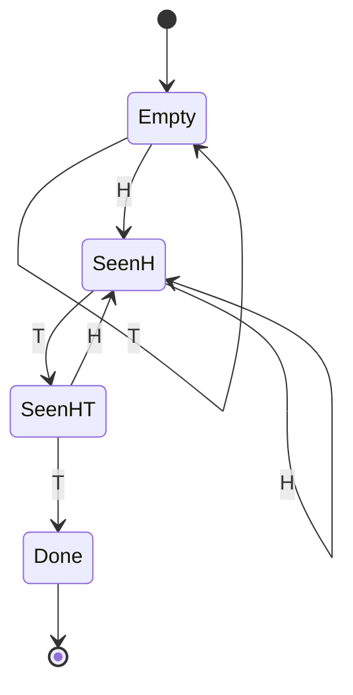
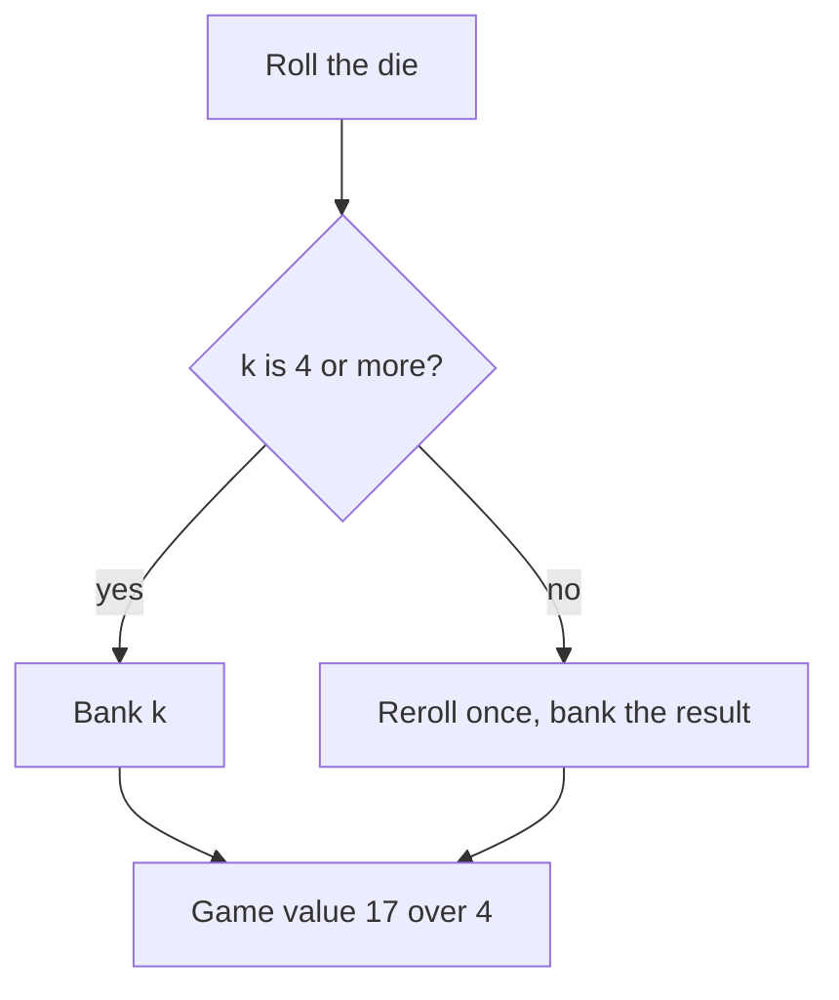

# Expected Value Problems

## Overview

Expected value is the single most heavily exercised tool in quantitative trading interviews: every dice game, stopping problem, quoting decision, and bet-sizing question reduces to computing or comparing expectations. This page is the quant-prep track's home for the expected-value canon — five worked problems, each derived completely from first principles rather than quoted, plus the master technique (first-step analysis) that generates most of the answers. The problems were chosen to complement, not repeat, the puzzle pages elsewhere in this book; where a classic is already derived on a sibling page, this page links to it and attacks a different member of the family instead.

The interview setting is specific: trader and quant-researcher loops at market makers and prop firms use these problems as the core probability round, and the tester cares less about the final number than about whether your derivation is airtight under follow-up questions. An answer stated from memory ("HHT takes 8 flips") that collapses when the interviewer says "now HTH" or "now allow two rerolls" reads as a red flag, because live trading constantly mutates the problem you prepared for. Every derivation below therefore shows the full state equations, the algebra, and a sanity check.

Work through this page with pen and paper, reproducing each linear system yourself before reading the solution step. The pages it feeds — [market making games](./market-making-games.md) and the firm-specific puzzle pages — assume you can produce these recursions quickly and correctly. If the linear algebra here feels slow, pair it with the [mental math drills](./mental-math-speed.md) until solving a three-equation system takes under two minutes.

## First-Step Analysis: The Master Technique

### The Recipe

Almost every waiting-time and optimal-stopping problem in the quant canon yields to the same four-step move, which practitioners call first-step analysis (or conditioning on the first outcome). You define states that capture everything relevant about the history, write one equation per state by conditioning on what happens next, and solve the resulting linear system. The recipe is:

1. **Define states** that make the future independent of the past given the state (the Markov property). For pattern problems the state is the longest suffix of what you have seen that is still a prefix of the target; for stopping problems the state is the current offer and how many decisions remain.
2. **Write one equation per state**, conditioning on the first step: the expected cost from state \\( s \\) equals the one-step cost plus the probability-weighted average of the expected costs of the successor states.
3. **Solve the linear system.** Three to five states is typical; eliminate variables by substitution or note which states are equal by symmetry.
4. **Sanity-check**: boundary states should give trivially correct equations, the answer should grow sensibly with problem size, and a ten-line simulation should land on your number.

A minimal warm-up shows the whole machine in one equation. How many flips until the first heads? One live state plus the terminal: \\( e = 1 + \\tfrac{1}{2}\\cdot 0 + \\tfrac{1}{2}e \\), because with probability \\( \\tfrac{1}{2} \\) you are done after this flip and with probability \\( \\tfrac{1}{2} \\) you have burned one flip and restarted. Solving gives \\( e = 2 \\). Every derivation on this page is this equation with more states, and interviewers regularly open with exactly this question to check that you can set up a recursion before escalating to pattern targets.

In symbols, with \\( c(s \\to s') \\) the immediate payoff or cost of moving from \\( s \\) to \\( s' \\):

\\[ E_s = \\sum_{s'} P(s \\to s') \\, \\big( c(s \\to s') + E_{s'} \\big) \\]

with terminal states pinned by their known values (often \\( 0 \\)). This is exactly dynamic programming over expected values, and it is the same machinery the [probability DP chapter](../dsa/chapters/ch114-probability-dp.md) applies to coding problems — the interview version just runs on smaller state spaces that you solve by hand.

### Three Canonical State Definitions

Recognizing which state definition a problem wants is most of the skill, and nearly every interview problem falls into one of three templates. **Position-in-pattern states** serve waiting-time problems: the state is the longest suffix of the observed sequence that is still a prefix of the target, which keeps the state count at or below the pattern length. **Offer-and-remaining states** serve stopping problems: the state is the value currently on the table plus how many decisions remain, and the recursion compares banking against continuing. **Inventory-and-information states** serve trading questions: the state is your position plus what observed flow has taught you about fair value, which is the formal skeleton of the quoting games in [market making](./market-making-games.md).

When a problem seems to fit none of these, the usual fix is to enlarge the state until the Markov property holds. A streak length alone is insufficient if the payoff depends on which *values* appeared — the state must then include those values. A common trap is a state that is Markov for the question asked first but not for the follow-up: your "streak of heads" state survives "how long until HHT" but breaks "what if a tail only half-resets the count," and rebuilding the state table live is far easier than defending a broken one.

### From Recursion to Closed Form: The Run Ladder

Some recursions solve to closed form with one substitution, and the classic is the expected wait for \\( k \\) consecutive heads. Let \\( e_k \\) be the expected flips to see \\( k \\) heads in a row; from a streak of \\( k-1 \\), the next flip either completes the run (probability \\( \\tfrac{1}{2} \\)) or destroys the streak entirely (probability \\( \\tfrac{1}{2} \\)), because any tail resets consecutive-head counting to zero. The recursion is therefore:

\\[ e_k = e_{k-1} + 1 + \\tfrac{1}{2}e_k \\quad\\Rightarrow\\quad e_k = 2e_{k-1} + 2, \\qquad e_0 = 0 \\]

Unrolling the ladder gives \\( e_1 = 2 \\), \\( e_2 = 6 \\), \\( e_3 = 14 \\), and in general \\( e_k = 2^{k+1} - 2 \\). Note the built-in cross-check: \\( e_3 = 14 \\) is exactly the HHH waiting time derived below by the independent state-table route, and two derivations agreeing from different directions is the strongest sanity signal you can offer in an interview. Whenever you can exhibit two independent routes to a number, do it — it costs thirty seconds and removes the "did I set the equations up right?" cloud that hangs over any single derivation.

### Why the Recursion Is Legitimate

The equation is an application of the law of total expectation (the tower property): the expectation from a state equals the average of the expectation after each possible first step, weighted by their probabilities. Writing \\( E_s = \\mathbb{E}[\\,\\text{total from } s\\,] \\) and splitting on the first transition gives \\( E_s = \\sum_{s'} P(s \\to s')\\,\\mathbb{E}[\\text{total} \\mid \\text{first step to } s'] \\), and conditional on the first step the process restarts from \\( s' \\), which is exactly the recursive term. Because the state was chosen to summarize the past, the restart is honest — nothing about the future depends on *how* you got to \\( s' \\).

The practical consequence is that a finite set of states always produces a finite linear system with a unique solution whenever the expected hitting time is finite. You never need generating functions or martingale theory for interview-scale problems; you need the right state definition. When a candidate's derivation collapses mid-interview, the cause is almost always a state definition that secretly leaks history — for example, tracking only "current streak of heads" when the target pattern also cares about interleaved tails.

### Common Failure Modes

The recurring mistakes are predictable enough to list, and each has a mechanical fix. First, **forgetting partial-progress resets**: from a state like "seen H" of target HHT, a tail does not return you to the empty state gracefully unless your state table says so — enumerate both successors of every state, every time. Second, **wrong boundary conditions**: terminal states must be pinned to their exact values (0 for remaining flips, the banked amount for stopping problems), and an error here propagates everywhere. Third, **non-Markov state definitions**: if your state is "streak of length k" but the payoff depends on which values appeared, the recursion is wrong before any algebra happens. Fourth, **solving the wrong problem size**: deriving for \\( n = 3 \\) when the interviewer asked for general \\( n \\), or reporting an expected *count* when the expected *time* was requested — restate units and generality before committing algebra to them.

The fix for all four is the same discipline: draw the full transition table before writing a single equation, and verify two or three successor cells by hand-tracing short sequences. A 100,000-trial simulation written in the debrief catches any remaining slips, and it is short enough to reproduce from memory:

```python
import random

def wait_time(pattern: str, trials: int = 100_000) -> float:
    total = 0
    for _ in range(trials):
        seen = ""
        while not seen.endswith(pattern):
            seen += random.choice("HT")
        total += len(seen)
    return total / trials

print(wait_time("HTT"))  # ~ 8
print(wait_time("HHH"))  # ~ 14
```

Interviewers respond well to a candidate who closes with "and I would sanity-check this against a simulation," because that is what a careful trader does with a hand-derived number before risking it. The simulation also resolves disputes instantly when an interviewer proposes a variant whose closed form neither of you remembers.

## Worked Problem 1: Pattern Waiting Times on a Fair Coin

### States, Not Strings

How many fair-coin flips until the pattern **HTT** appears? Until **HHH**? These two complete the classic family: the sibling page [Probability Puzzles](../interview/puzzles/probability-puzzles.md) already derives HHT (8 flips) and HTH (10 flips) with the same state method, so this page derives the other two members and then explains the whole table with one formula. The state definition is the same as there: the state is the longest suffix of the flips seen so far that is a prefix of the target pattern. Full strings are never tracked — only the suffix matters for what can still complete the pattern.

For HTT the three live states are \\( \\varnothing \\) (nothing useful pending), H (last relevant suffix is "H"), and HT. The transition rules deserve a careful read, because both self-loops and resets appear:



Two transitions carry the whole insight. From SeenH, a head gives HH — which still ends in H, so you remain in SeenH (no progress lost, none gained). From SeenHT, a head gives HTH — the "HT" progress is destroyed, but the trailing H restarts you at SeenH rather than the empty state, and that partial credit is exactly what separates patterns with overlap structure from patterns without it.

### Deriving E[HTT] = 8

Let \\( e_\\varnothing, e_H, e_{HT} \\) be the expected remaining flips from each state and condition on the next flip in every state. The three first-step equations are:

\\[ e_\\varnothing = 1 + \\tfrac{1}{2}e_H + \\tfrac{1}{2}e_\\varnothing \\qquad
e_H = 1 + \\tfrac{1}{2}e_H + \\tfrac{1}{2}e_{HT} \\qquad
e_{HT} = 1 + \\tfrac{1}{2}e_H + \\tfrac{1}{2}\\cdot 0 \\]

The algebra takes three moves. From the first equation, \\( e_\\varnothing = 2 + e_H \\). From the third, \\( e_{HT} = 1 + \\tfrac{1}{2}e_H \\). Substitute both into the middle equation:

\\[ e_H = 1 + \\tfrac{1}{2}e_H + \\tfrac{1}{2}\\Big(1 + \\tfrac{1}{2}e_H\\Big) = \\tfrac{3}{2} + \\tfrac{3}{4}e_H
\\quad\\Rightarrow\\quad \\tfrac{1}{4}e_H = \\tfrac{3}{2} \\quad\\Rightarrow\\quad e_H = 6 \\]

Then \\( e_{HT} = 1 + 3 = 4 \\) and \\( e_\\varnothing = 2 + 6 = \\mathbf{8} \\). The expected number of flips until HTT is **8**, and the chain of state values \\( 8 \\to 6 \\to 4 \\to 0 \\) is a nice internal consistency check: each state should cost less than the one before it, and the gaps shrink as completion approaches.

### Deriving E[HHH] = 14

Now the target is HHH, with states \\( \\varnothing \\), H, and HH. The transition table changes in one crucial cell: from HH, a tail gives HHT, whose suffixes (T, HT, HHT) share *nothing* with prefixes of HHH — so a tail from HH annihilates all progress. The equations are:

\\[ e_\\varnothing = 1 + \\tfrac{1}{2}e_H + \\tfrac{1}{2}e_\\varnothing \\qquad
e_H = 1 + \\tfrac{1}{2}e_{HH} + \\tfrac{1}{2}e_\\varnothing \\qquad
e_{HH} = 1 + \\tfrac{1}{2}\\cdot 0 + \\tfrac{1}{2}e_\\varnothing \\]

Solve from the bottom up. The third equation gives \\( e_{HH} = 1 + \\tfrac{1}{2}e_\\varnothing \\). Substituting into the second:

\\[ e_H = 1 + \\tfrac{1}{2}\\Big(1 + \\tfrac{1}{2}e_\\varnothing\\Big) + \\tfrac{1}{2}e_\\varnothing = \\tfrac{3}{2} + \\tfrac{3}{4}e_\\varnothing \\]

and substituting into the first, using \\( e_\\varnothing = 2 + e_H \\):

\\[ e_\\varnothing = 2 + \\tfrac{3}{2} + \\tfrac{3}{4}e_\\varnothing \\quad\\Rightarrow\\quad \\tfrac{1}{4}e_\\varnothing = \\tfrac{7}{2} \\quad\\Rightarrow\\quad e_\\varnothing = \\mathbf{14} \\]

The expected number of flips until HHH is **14** — nearly double HHT's 8, for patterns of identical length. This agrees with the run-ladder closed form \\( e_3 = 2^4 - 2 = 14 \\) from the technique section, and a quick `endswith` simulation over a few hundred thousand trials lands at 14.0 and confirms the hand algebra.

### The Counterintuitive Gap and the Border Formula

The gap has a one-line cause: **self-overlap**. When HHH fails at the last step it has already made progress toward its next attempt (HH is still on the table), but when it fails *from* a deep state via a tail, it loses everything — the pattern both feeds itself and resets itself. The general rule, sometimes called Conway's leading-number rule: the expected waiting time for a pattern \\( P \\) over fair coin flips is \\( \\sum 2^{k} \\) summed over the lengths \\( k \\) such that the length-\\( k \\) *prefix* of \\( P \\) equals its length-\\( k \\) *suffix* (self-borders), always including the full length. The full family:

| Pattern | Self-borders (prefix = suffix) | Expected flips |
|---|---|---|
| HHH | H, HH, HHH | \\( 2 + 4 + 8 = 14 \\) |
| HTH | H, HTH | \\( 2 + 8 = 10 \\) |
| HHT | HHT only | \\( 8 \\) |
| HTT | HTT only | \\( 8 \\) |

The T-mirror patterns (TTT, THT, THH, THT) match by symmetry, giving the complete eight-pattern table: two patterns at 14, two at 10, four at 8. Every number in this table can be produced either by the border sum or by a three-state first-step system, and being able to do both — and check one against the other — is exactly the fluency the interviewer is probing for.

### Longer Patterns and the Border Sum at Work

Length-4 targets are where the state-table method becomes tedious (four live states, a four-equation system, easy arithmetic slips) and the border sum earns its keep. Take **HTHT**: its prefixes are H, HT, HTH, HTHT and its suffixes are T, HT, THT, HTHT, so the self-borders are HT (length 2) and HTHT (length 4), giving \\( 2^2 + 2^4 = 4 + 16 = 20 \\). Take **HHTT**: the only suffix that is also a prefix is the full pattern, so the wait is \\( 2^4 = 16 \\). Both numbers reproduce exactly under simulation, and a candidate who can produce either derivation in under a minute — border sum first, state table as verification — is demonstrating precisely the economical problem-solving the trading desk wants.

The border view also explains *why* longer is not automatically slower in a way the raw state equations obscure. HTHT waits 20 flips while its length-3 cousin HTT waits only 8, but the increase is driven by the internal border HT: every near-miss of HTHT that ends in ...HT has already banked half the next attempt. Contrast HHTT (16), whose lack of internal borders means every failure from a deep state is a total loss despite the pattern being no longer. If an interviewer generalizes to "when is a long pattern fast?", the answer is a sentence: expected wait is governed by overlap structure first and length second.

### The Penney Race: Equal Waits, Unequal Odds

Race HHT against HTT — two patterns that each wait 8 flips in isolation — by flipping a coin until one of them appears. HHT wins with probability \\( \\tfrac{2}{3} \\), not \\( \\tfrac{1}{2} \\). The derivation is the same technique on a joint state space \\( \\{\\varnothing, H, HH, HT\\} \\), where each state now serves both patterns at once. From HH, HHT wins almost surely: heads keeps HH alive, and the next tail completes HHT before HTT can possibly form, since HTT needs a fresh H-T-T run that the intervening tail preempts. From HT, a tail completes HTT immediately (HHT loses), while a head falls back to H.

Writing \\( p_s = P(\\text{HHT wins} \\mid s) \\), the first-step equations are \\( p_{HH} = 1 \\), \\( p_{HT} = \\tfrac{1}{2}p_H \\), and \\( p_H = \\tfrac{1}{2}\\cdot 1 + \\tfrac{1}{4}p_H \\Rightarrow p_H = \\tfrac{2}{3} \\), with \\( p_\\varnothing = p_H = \\tfrac{2}{3} \\). The asymmetry has a crisp intuition: reaching HH is a far stronger position for HHT than reaching HT is for HTT, because from HH *any* tail wins eventually, while HT's tail must come immediately. This is Penney's game, and the standard extension is that the second player can always beat the first player's pick: the optimal counter to HHT is THH, which wins with probability \\( \\tfrac{3}{4} \\) — against THH, HHT can win only if the sequence *starts* HH, an event of probability \\( \\tfrac{1}{4} \\). The transferable lesson is that marginal expectations do not determine joint or competitive behavior; you must model the interaction on its own state space.

## Worked Problem 2: The Optimal Reroll Threshold

### A Ladder of Policies

Roll a fair die. You are paid its face value, but you have reroll rights, and the question is when to use them. Start with a warm-up that introduces the fixed-point idea in its simplest form: suppose the rule (not your choice) is that you must reroll exactly once if and only if you roll a 6. If \\( V \\) is the value of the game, then five-sixths of the time you bank \\( 1 \\) through \\( 5 \\), and one-sixth of the time you reroll and restart the whole game:

\\[ V = \\tfrac{1}{6}(1 + 2 + 3 + 4 + 5) + \\tfrac{1}{6}V \\quad\\Rightarrow\\quad \\tfrac{5}{6}V = \\tfrac{15}{6} \\quad\\Rightarrow\\quad V = 3 \\]

The fixed-point algebra is the point of the warm-up: the reroll branch's value is the game's own value \\( V \\), because after the reroll you are back at the start. Note that this forced policy is *worse* than doing nothing (3 versus the 3.5 baseline) — an option you are forced to exercise badly can destroy value, which is a one-sentence interview answer in its own right.

### Single Reroll: Threshold 4, Value 17/4

Now the real problem: you may reroll **once**, after which you must keep the second result. The decision rule is a threshold: keep \\( k \\) if \\( k \\) beats the value of rerolling, reroll otherwise. The value of rerolling is the expected fresh die, \\( 3.5 \\), so the optimal policy is *keep if \\( k \\ge 4 \\), reroll on 1, 2, 3* — the threshold sits exactly at the continuation value. The expected value under this policy:

\\[ V = \\tfrac{1}{6}(4 + 5 + 6) + \\tfrac{1}{2}\\cdot 3.5 = \\tfrac{15}{6} + \\tfrac{7}{4} = \\tfrac{17}{4} = 4.25 \\]

Equivalently, \\( V = \\mathbb{E}[\\max(X, 3.5)] = \\tfrac{1}{6}(3.5 + 3.5 + 3.5 + 4 + 5 + 6) = 4.25 \\) — the max form makes the structure transparent: each face contributes the better of banking it or taking the continuation value. The threshold policy is a special case of optimal stopping: **compare the in-hand value to the expected continuation and act on the larger**.



Threshold comparisons sharpen the answer when the interviewer pushes. Rerolling only 1s gives \\( \\tfrac{1}{6}(2+3+4+5+6) + \\tfrac{1}{6}(3.5) \\approx 3.92 \\); rerolling 1s and 2s gives \\( \\tfrac{1}{6}(3+4+5+6) + \\tfrac{1}{3}(3.5) \\approx 4.17 \\); the optimal threshold-4 policy gives 4.25; and rerolling everything once just returns 3.5. The values rise to the optimum and fall after it — a one-dimensional search over thresholds with the peak at the continuation value, and the shape itself is worth sketching for the interviewer.

Presenting the solution well takes four beats, and rehearsing them turns a correct answer into a strong one. State the policy class first ("thresholds — keep \\( k \\) or better"), because optimizing inside an unexamined policy class is a common silent error. Then justify the threshold from the continuation value rather than asserting it. Then compute the value in one clean line. Then volunteer one comparative static — what a reroll cost or a second die does to the threshold — which is the difference between answering the question asked and demonstrating that the framework, not the number, is what you own.

### Variants That Get Asked Next

Two standard mutations cover most follow-ups. First, **two dice, keep the higher**: no stopping decision, just a selection, and \\( \\mathbb{E}[\\max(X_1, X_2)] = \\sum_k k\\,\\frac{2k-1}{36} = \\frac{161}{36} \\approx 4.47 \\), using \\( P(\\max = k) = \\frac{2k-1}{36} \\). Second, **unlimited free rerolls**: the fixed point \\( V = \\tfrac{1}{6}\\sum_k \\max(k, V) \\) solves to \\( V = 6 \\) — with truly free rerolls you roll until a 6 appears, an expected 6 rolls — which is why realistic versions introduce a per-reroll cost or a finite number of rolls; with a $1 cost per reroll the threshold drops to "keep 3 or more" and the value to \\( V = 4 \\). The didactic point is that the threshold is not a magic number but the crossing point of two curves — in-hand value versus continuation value — and every rule change moves one of the curves.

## Worked Problem 3: The St. Petersburg Paradox

### The Infinite Expectation

A casino offers a game: flip a fair coin until it lands heads; if the first head is on flip \\( k \\), you are paid \\( 2^{k-1} \\) dollars. What is a fair entry price? The expectation is a one-line series:

\\[ \\mathbb{E}[X] = \\sum_{k=1}^{\\infty} 2^{k-1}\\cdot 2^{-k} = \\sum_{k=1}^{\\infty} \\tfrac{1}{2} = \\infty \\]

Every outcome contributes exactly \\( \\tfrac{1}{2} \\) to the sum, the contributions never decay, and the expectation diverges. Meanwhile the *median* payoff is $2 and \\( P(X \\ge 64) = \\tfrac{1}{64} \\): the entire infinite value lives in a tail you will almost never see. Quoting "infinite" as a fair price with a straight face is the trap; the follow-up is always "so would you pay $1,000 to play?" and the honest answer is no — which forces the real analysis.

### Finite Bankroll: The Truncated Value

Real counterparties cannot pay \\( 2^{k-1} \\) for arbitrarily large \\( k \\), so cap the payoff at the house's bankroll \\( B \\). If \\( B = 2^{m-1} \\), then outcomes with \\( k \\le m \\) pay normally and every deeper tail pays the cap \\( 2^{m-1} \\):

\\[ \\mathbb{E}[X_B] = \\sum_{k=1}^{m} \\tfrac{1}{2} \\; + \\; \\sum_{k=m+1}^{\\infty} 2^{m-1}\\cdot 2^{-k} = \\tfrac{m}{2} + 2^{m-1}\\cdot 2^{-m} = \\frac{m+1}{2} \\]

The truncated expectation grows only logarithmically in the bankroll: with \\( B = \\$1{,}000{,}000 \\) (so \\( m = 20 \\)) the fair price is about $10.50, and even with \\( B = \\$100{,}000{,}000 \\) (\\( m = 27 \\)) it is about $14. The tail structure explains the logarithm: each additional power of two in the bankroll buys exactly one more untruncated \\( \\tfrac{1}{2} \\)-contribution plus a negligible capped remainder, so every doubling of \\( B \\) adds fifty cents of fair value. This is the quantitative core of the resolution — the infinite expectation is an artifact of assuming a counterparty with infinite credit, and any finite counterparty makes the game worth roughly \\( \\tfrac{1}{2}\\log_2 B \\). Interviewers like this follow-up precisely because it converts a philosophical paradox into a two-line computation.

### Utility, Log Growth, and What Traders Actually Do

The second resolution layer is utility. Under log utility, the certainty equivalent is \\( \\exp\\big(\\sum_k 2^{-k} \\ln 2^{k-1}\\big) = \\exp\\big(\\ln 2 \\cdot \\textstyle\\sum_k (k-1) 2^{-k}\\big) = e \\approx \\$2.72 \\), since \\( \\sum (k-1)2^{-k} = 1 \\) — a number radically divorced from the infinite arithmetic mean. The trading translation: maximize expected *log* wealth (geometric growth), not expected wealth, because you compound and can go broke. This is the doorstep of the Kelly criterion — named here only — which sizes a favorable bet to maximize log growth and never bets so large that variance ruins the compounding. A desk facing a positive-EV but high-variance opportunity caps the position by risk limits, not by EV arithmetic; "the EV is infinite, so size is unbounded" is an answer that ends interviews, while "the EV is infinite but the drawdown distribution is not, so I size to survive the tail" starts careers.

### A Biased Coin and the Knife-Edge

Replace the fair coin with one landing heads with probability \\( p \\). The payoff \\( 2^{k-1} \\) now arrives with probability \\( p(1-p)^{k-1} \\), so the expectation is a geometric series in \\( 2(1-p) \\):

\\[ \\mathbb{E}[X] = \\sum_{k \\ge 1} 2^{k-1}\\, p\\,(1-p)^{k-1} = p \\sum_{k \\ge 1} \\big(2(1-p)\\big)^{k-1} \\]

The series converges only when \\( 2(1-p) < 1 \\), i.e. \\( p > \\tfrac{1}{2} \\), in which case it sums to \\( \\frac{p}{2p-1} \\) — for \\( p = 0.6 \\) the fair price is $3, and for \\( p = 0.75 \\) it is $1.50. At exactly \\( p = \\tfrac{1}{2} \\) the ratio hits 1 and the sum diverges, and for \\( p < \\tfrac{1}{2} \\) it diverges geometrically. The paradox is therefore a knife-edge: infinite expectation is not a robust property of exponential payoffs but a boundary phenomenon between a heads-biased coin (very cheap game) and a tails-biased one (unpayable game).

The same computation explains when the paradox does *not* appear. Pay a linear prize — \\( k \\) dollars if the first head is on flip \\( k \\) — and even the fair coin gives \\( \\sum k\\,2^{-k} = 2 \\), finite and tame, because linear growth loses the race against geometric tail decay. The interview-worthy generalization: an infinite expectation requires the payoff to grow at least as fast as the tail probabilities decay, which is the same tail-thickness diagnosis that risk desks apply to real P&L distributions before trusting a sample mean.

## Worked Problem 4: The Two-Envelope Paradox

### Setup and the Flawed Algebra

Two envelopes contain \\( x \\) and \\( 2x \\) for some unknown \\( x > 0 \\). You pick one at random (call its content \\( A \\)), and now a switching argument is offered: the other envelope is equally likely to hold \\( 2A \\) or \\( A/2 \\), so its expected value is \\( \\tfrac{1}{2}(2A) + \\tfrac{1}{2}(A/2) = \\tfrac{5A}{4} > A \\) — so switch. But the identical argument runs from the other envelope's perspective, concluding you should switch back, forever. An expectation calculation that recommends an infinite loop has to contain an error, and locating it precisely is the entire interview exercise.

Write the joint distribution honestly. Let \\( Y \\) be your envelope and \\( O \\) the other; then \\( (Y, O) = (x, 2x) \\) or \\( (2x, x) \\), each with probability \\( \\tfrac{1}{2} \\), so \\( \\mathbb{E}[Y] = \\mathbb{E}[O] = \\tfrac{3x}{2} \\) by symmetry — there is no asymmetry to exploit. The flawed algebra computes \\( \\mathbb{E}[O] = \\mathbb{E}\\big[\\tfrac{5A}{4}\\big] = \\tfrac{5}{4}\\mathbb{E}[A] = \\tfrac{15x}{8} \\), which disagrees with \\( \\tfrac{3x}{2} \\), so *something* inside it is false.

### The Correct Conditional-Expectation Resolution

The false step is the claim \\( P(O = 2A \\mid A) = \\tfrac{1}{2} \\) **for every observed value** \\( A \\). Condition on \\( A \\) and the situation is deterministic: if you are holding the smaller envelope (\\( A = x \\)), the other is certainly \\( 2A \\); if you are holding the larger (\\( A = 2x \\)), the other is certainly \\( A/2 \\). The probability \\( \\tfrac{1}{2} \\) attaches to the *unobserved* event "I picked the smaller envelope," not to the conditional distribution of \\( O \\) given the amount on the table. Mixing these two conditionings — evaluating the gain \\( +A \\) in units of the small envelope and the loss \\( -A/2 \\) in units of the large one — manufactures \\( \\tfrac{A}{4} \\) out of a unit mismatch.

Done correctly, the expected gain from switching is \\( \\mathbb{E}[O - Y] = \\tfrac{1}{2}(2x - x) + \\tfrac{1}{2}(x - 2x) = \\tfrac{x}{2} - \\tfrac{x}{2} = 0 \\): equal-magnitude gains and losses, no edge. More generally, with any proper prior \\( \\pi \\) over \\( x \\), Bayes gives \\( P(\\text{you hold small} \\mid A = a) = \\frac{\\pi(a)}{\\pi(a) + \\pi(a/2)} \\), a computable number strictly between 0 and 1 that varies with \\( a \\) — and averaging against it restores \\( \\mathbb{E}[O] = \\mathbb{E}[Y] \\). The paradox survives only under an improper "scale-free" prior (uniform over all magnitudes), under which the required expectations do not exist. The transferable lesson is blunt: **before averaging \\( 2A \\) and \\( A/2 \\), verify that the conditioning event has non-degenerate probability given the data — otherwise you are averaging over impossible worlds.**

## Worked Problem 5: The Secretary Problem

### The Cutoff Strategy

You interview \\( n \\) candidates in random order of true quality and must accept or reject each on the spot; the goal is to maximize the probability of selecting the single best. The optimal policy family is the explore-then-exploit cutoff: reject the first \\( r \\) candidates as calibration, then accept the first subsequent candidate who beats everyone seen so far. For a candidate at position \\( k > r \\) to be *selected and best*, two events must align: the overall best sits at position \\( k \\) (probability \\( 1/n \\)), and the best of the first \\( k-1 \\) sits inside the calibration window (probability \\( r/(k-1) \\), by symmetry of the random order). Summing over positions:

\\[ P(\\text{success}) = \\sum_{k=r+1}^{n} \\frac{1}{n}\\cdot\\frac{r}{k-1} = \\frac{r}{n}\\sum_{j=r}^{n-1}\\frac{1}{j} = \\frac{r}{n}\\big(H_{n-1} - H_{r-1}\\big) \\]

where \\( H_m \\) is the \\( m \\)-th harmonic number. This exact finite-\\( n \\) formula is itself a frequent interview deliverable; the asymptotic analysis below is the flourish.

### The 1/e Asymptotics

Set \\( x = r/n \\) and let \\( n \\to \\infty \\). The harmonic gap becomes an integral, \\( H_{n-1} - H_{r-1} \\approx \\ln\\frac{n}{r} = -\\ln x \\), so the success probability tends to \\( P(x) = -x \\ln x \\) on \\( (0, 1] \\). Maximize: \\( P'(x) = -\\ln x - 1 = 0 \\Rightarrow x = 1/e \\), and \\( P(1/e) = 1/e \\approx 0.368 \\). So the optimal cutoff is the first \\( n/e \\) candidates — the famous "37% rule" — and even with unlimited patience and perfect calibration you succeed only about 37% of the time. For \\( n = 100 \\), evaluating the exact sum at \\( r = 37 \\) gives \\( P \\approx 0.371 \\), already within a third of a percentage point of the asymptote.

The transferable content beyond the number is the structure: when you must decide under an irreversible one-pass constraint, spend a fixed fraction of your budget purely on *learning the distribution*, then switch to exploiting the learned threshold.

The standard mutations each change the policy in an instructive way, and having one sentence ready for each is cheap insurance. If the goal becomes minimizing the expected *rank* of your pick rather than maximizing the probability of the best, the optimal rule remains a cutoff but the cutoff shrinks toward \\( \\sqrt{n} \\). If the second-best candidate also pays out, exploitation should start earlier, because a mis-calibrated threshold now costs less. If \\( n \\) is unknown — candidates arrive until some random time — the fixed-fraction rule is replaced by a time-varying threshold that starts near the beginning (Chow–Robbins–Siegmund territory, which you should name rather than derive unless pressed). In every variant, stating the framework before chasing the variant is what the follow-ups test.

## A Technique Map

The five problems above share almost no surface features but exactly one toolkit. The table compresses each problem into its technique and the sentence-level lesson worth retrieving under interview pressure.

| Problem | Core technique | Transferable lesson |
|---|---|---|
| HTT vs HHH waiting times | Markov suffix states + first-step analysis | Track the longest useful suffix, not the string; progress can reset |
| Penney race (HHT vs HTT) | First-step analysis on a joint state space | Equal marginal expectations do not imply equal competitive odds |
| Optimal die reroll | Optimal stopping via continuation value | Threshold = where in-hand value crosses expected continuation |
| St. Petersburg | Truncation + expected log growth | Infinite-EV tails are unpayable and unriskable; cap and size |
| Two-envelope | Conditional expectation discipline | Probabilities must be conditioned on the observed value, not mixed with priors over it |
| Secretary problem | Cutoff policy + asymptotic optimization | Explore for a fixed fraction, then exploit; \\( 1/e \\) laws from \\( -x\\ln x \\) |

If you retain only one row, retain the first: first-step analysis is the generator for the others, and interviewers reuse it across dice games, coin patterns, queueing questions, and quoting decisions. The remaining rows are standard mutations of that one machine, and naming the mutation you are looking at is usually the first move of the solution.

## When Expected Value Is Not Enough

### Variance and Tail Behavior

Two games can share an expectation and differ by orders of magnitude in variance, and interviews probe whether you notice. The St. Petersburg game is the extreme case — infinite mean, $2 median — but even tame games illustrate it: the single-reroll die (4.25) and the keep-higher-of-two dice (4.47) sit near each other in EV with very different payoff distributions. The professional reflex is to report **mean and dispersion together**, and to know which tail you own: a market maker earns many small positive-EV spreads but carries left-tail inventory risk, so the relevant summary is closer to a Sharpe ratio or a drawdown distribution than to a mean. Quoting an expectation without its spread is a coin-flip answer delivered with false confidence.

A concrete interview-grade demonstration: in the noise-flow quoting model of [market making games](./market-making-games.md) — true value uniform on \\([0,100]\\), quotes 45/55 — the expected profit per fill is $5 but the standard deviation per fill is \\( 100/\\sqrt{12} \\approx 28.9 \\), so a single fill is far more likely to lose than the +5 suggests (the loss probability on a buy is 45%). The positive EV emerges only across hundreds of fills, which is exactly why market makers need flow volume and why a one-shot EV argument can mislead a human trader.

### Kelly-Style Sizing and Risk of Ruin

When a favorable bet is repeatable, the question shifts from "take it or not" to "how much," and the answer that survives professional scrutiny maximizes expected *log* wealth — the Kelly criterion, named here only — rather than expected wealth. Two facts about that framework are worth having ready. First, for a binary bet with win probability \\( p \\) and payoff \\( b \\) per unit staked, the growth-optimal fraction is \\( f^* = p - \\frac{1-p}{b} \\), and betting more than \\( 2f^* \\) has negative growth despite positive EV. Second, over-betting converts a positive-EV strategy into near-certain ruin through volatility drag: compounding multiplies, and one large loss erases many proportional gains. Traders wrap this in explicit risk limits — maximum position, maximum drawdown, kill switches — because the mathematical optimum assumes exact probabilities that real markets do not pay you for.

The interview framing to avoid is either extreme: "EV is everything" ignores ruin, and "risk is bad, so be tiny" ignores that under-betting a positive edge leaves the edge on the table. The calibrated answer connects the two: expectation selects the bet, dispersion and bankroll select the size, and the sizing rule should be stated before the numbers are. Candidates who volunteer the Kelly connection *without* claiming to run full Kelly in practice (fractional Kelly is the common desk compromise) sound like they have actually traded something.

### Mean, Median, and What to Report

Heavy-tailed payoffs separate the mean from the median so violently that quoting either alone misleads, and the habit of reporting both is a cheap way to sound experienced. For the St. Petersburg game the mean is infinite while the median is $2; for a market maker's daily P&L the two usually agree in sign, but the *left tail* — the worst day — is the number the risk manager actually prices. A useful discipline is to state the mean, a central range, and the tail threshold in one breath: "expectation +5 per fill, typical fill between −25 and +35, and I lose money on 45% of buys." That sentence demonstrates more trading maturity than any single correct expectation, because it shows you know which statistic drives which decision.

It also guards against the most common self-deception in preparation: drilling EV puzzles until every answer is a mean, then meeting an interviewer who asks "yes, but what is the *variance*?" The variance of the uniform quoting fill above is \\( 100^2/12 \\approx 833 \\), and producing it on demand — the variance of a uniform on \\([a,b]\\) is \\( (b-a)^2/12 \\) — is part of the [probability and statistics](../mathematics/probability-statistics.md) baseline this track assumes. Practice attaching a second moment to every first moment you compute, and the follow-up questions stop being surprises.

## Interview Questions

1. **How many flips until HTT appears? Derive it.** Define states by longest suffix matching a prefix: \\( \\varnothing \\), H, HT. The equations are \\( e_\\varnothing = 1 + \\tfrac{1}{2}e_H + \\tfrac{1}{2}e_\\varnothing \\), \\( e_H = 1 + \\tfrac{1}{2}e_H + \\tfrac{1}{2}e_{HT} \\) (HH still ends in H), and \\( e_{HT} = 1 + \\tfrac{1}{2}e_H \\) (a head after HT gives HTH, leaving suffix H). Solving gives \\( e_H = 6 \\), \\( e_{HT} = 4 \\), \\( e_\\varnothing = 8 \\). Close by noting HTT has no self-borders, so the border formula also gives \\( 2^3 = 8 \\).
2. **Why does HHH take 14 flips when HHT takes 8?** HHH borders itself at lengths 1, 2, and 3, so its expectation is \\( 2 + 4 + 8 = 14 \\), while HHT has only the trivial border (8). Mechanically, from HH a tail annihilates all progress because no suffix of HHT is a prefix of HHH, whereas deep HHH progress feeds the next attempt. Both derivations fall out of three-state first-step systems, and the discrepancy between equal-length patterns is the entire pedagogical payload.
3. **A die is rolled; you are paid its face value but may reroll once. What is the game worth?** The continuation value of rerolling is the fresh-die expectation 3.5, so the threshold policy keeps 4, 5, 6 and rerolls 1, 2, 3. The value is \\( \\tfrac{1}{6}(4+5+6) + \\tfrac{1}{2}(3.5) = 2.5 + 1.75 = 4.25 = 17/4 \\). Comparing thresholds — reroll only 1s gives about 3.92, reroll 1s and 2s about 4.17 — shows 4.25 is the peak, and the max-form \\( \\mathbb{E}[\\max(X, 3.5)] \\) explains why the threshold sits at the continuation value.
4. **In the two-envelope problem, where exactly does the 5A/4 argument break?** It asserts \\( P(O = 2A \\mid A) = \\tfrac{1}{2} \\) for every observed \\( A \\), but given the observed amount the other envelope's content is determined: \\( 2A \\) if you hold the smaller, \\( A/2 \\) if you hold the larger. The correct expected gain is \\( \\tfrac{1}{2}(x) + \\tfrac{1}{2}(-x) = 0 \\) in absolute units, and with a proper prior Bayes restores \\( \\mathbb{E}[O] = \\mathbb{E}[Y] = 3x/2 \\). The paradox needs an improper scale-invariant prior, under which the expectations do not exist.
5. **What would you actually pay to play St. Petersburg?** Nothing infinite: the fair price against a bankroll \\( B = 2^{m-1} \\) is \\( (m+1)/2 \\) — about $10.50 against a million dollars — because tails beyond the bankroll pay the cap, giving \\( \\tfrac{m}{2} + \\tfrac{1}{2} \\). Under log utility the certainty equivalent is \\( e \\approx \\$2.72 \\), since \\( \\mathbb{E}[\\ln X] = \\ln 2 \\). The trading answer is to state the sizing view: positive but heavy-tailed EV gets capped by risk limits, not maximized.
6. **Sketch where the secretary problem's 1/e comes from.** With cutoff \\( r \\), the success probability is \\( \\frac{r}{n}(H_{n-1} - H_{r-1}) \\), from \\( \\sum_{k>r} \\frac{1}{n}\\cdot\\frac{r}{k-1} \\). With \\( x = r/n \\) and \\( n \\to \\infty \\) this tends to \\( -x\\ln x \\), maximized at \\( x = 1/e \\) with value \\( 1/e \\approx 0.368 \\). For \\( n = 100 \\) the exact optimum is \\( r = 37 \\) with \\( P \\approx 0.371 \\), and the structural lesson — explore for a fixed fraction, then exploit — generalizes far past the puzzle.

## Key Takeaways

- First-step analysis — define Markov states, write one expectation equation per state conditioned on the next step, solve the linear system — generates nearly every quant interview EV answer; the state definition, not the algebra, is where correctness lives.
- Expected waiting times for coin patterns are governed by self-borders: HHT and HTT wait 8 flips, HTH waits 10, HHH waits 14, and the border sums \\( 2^k \\) reproduce every number the state equations produce.
- Equal marginal waiting times do not imply equal race odds: HHT beats HTT with probability \\( 2/3 \\), and the optimal Penney counter to HHT is THH at \\( 3/4 \\) — joint behavior requires a joint state space.
- Optimal stopping reduces to comparing in-hand value with expected continuation; for the single-reroll die the threshold is 4 and the value is \\( 17/4 = 4.25 \\), and every rule change (costs, extra rolls, extra dice) moves one side of that comparison.
- The St. Petersburg expectation is infinite only against an infinite bankroll: capped at \\( 2^{m-1} \\) the value is \\( (m+1)/2 \\), log utility prices it at \\( e \\approx \\$2.72 \\), and the professional reflex is sizing and caps, not mean-chasing.
- The two-envelope paradox is a conditioning error: \\( P(O = 2A \\mid A) \\) is 0 or 1 given the observed amount, and only an improper scale-free prior makes \\( 5A/4 \\) look meaningful; always re-derive gains in one fixed unit.
- The secretary problem's explore-then-exploit cutoff at \\( n/e \\) yields success probability \\( 1/e \\) asymptotically — an exact, derivable constant, not trivia, and the template for one-pass decision problems.
- Expectation alone is not a decision: report dispersion, think in expected-log-growth terms for repeated bets (Kelly, named only), and let explicit risk limits bound what EV arithmetic permits.

## References

- [Project Euler](https://projecteuler.net) — expectation and exact-arithmetic counting problems that train the same derive-don't-lookup discipline.
- [Jane Street Puzzles](https://www.janestreet.com/puzzles/) — the monthly archive's EV-optimization family is first-step analysis in puzzle clothing.
- [QuantNet](https://quantnet.com) — community forums with quant interview question banks, including EV and stopping-problem threads.
- Sheldon Ross, *A First Course in Probability* — chapters on expectation, conditional expectation, and the law of total expectation underpinning every recursion on this page.
- Frederick Mosteller, *Fifty Challenging Problems in Probability* — the classic sourcebook for first-step-analysis problems, including St. Petersburg-adjacent material.
- Xinfeng Zhou, *A Practical Guide to Quantitative Finance Interviews* — the dice-reroll and stopping problems in their interview formulation.
- Timothy Crack, *Heard on the Street* — worked expectation and sizing questions in the trading-interview register.
- Daniel Bernoulli, *Specimen theoriae novae de mensura sortis* (1738) — the original log-utility resolution of the St. Petersburg paradox.

## Cross-References

- [Probability Puzzles](../interview/puzzles/probability-puzzles.md) — the sibling derivations of E[HHT] = 8 and E[HTH] = 10 that complete the eight-pattern table, plus birthday, Monty Hall, and prisoner problems.
- [Jane Street Puzzles](./jane-street-puzzles.md) — a dice-stopping game solved end-to-end with the same first-step machinery, plus the four-step attack framework.
- [Market Making Games](./market-making-games.md) — where expected-value discipline meets live quoting decisions and adverse-selection arithmetic.
- [Mental Math Speed](./mental-math-speed.md) — the timed-arithmetic plan for solving these linear systems quickly under interview pressure.
- [Game Theory Puzzles](./game-theory-puzzles.md) — game-value machinery for problems where the expectation depends on an opponent's strategy.
- [Interview Canon](./interview-canon.md) — the consolidated list of problems this page draws from and extends.
- [Probability & Statistics](../mathematics/probability-statistics.md) — the conditional-expectation and law-of-total-expectation foundations used throughout.
- [Probability DP](../dsa/chapters/ch114-probability-dp.md) — the same state-and-recursion method as a coding technique, for the implementation round.
