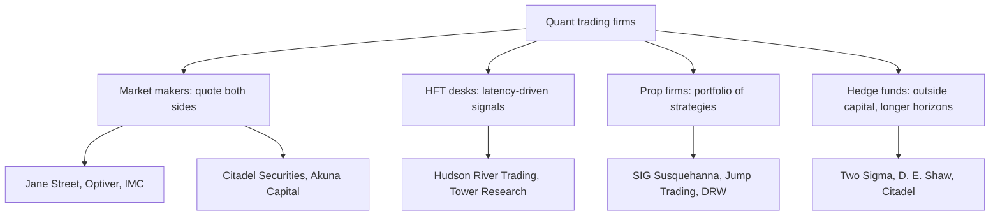

# The Quant Firm Directory

## Overview

This page is a map of the proprietary-trading and quantitative-investing employers that recruit the readers of this book: market makers, high-frequency trading (HFT) desks, diversified prop firms, and systematic hedge funds. Knowing who does what matters for placement because these firms do not share one interview format — a poker game at SIG, an arithmetic speed test at Optiver, and a C++ latency interview on a low-latency desk measure different people. The directory below gives a reference table of Western firms with verified careers pages, a table of India-based quant firms, a taxonomy of what each firm category actually optimizes, and the interview-process patterns that candidates commonly report for the biggest names.

Everything here is written for a candidate deciding where to apply and how to prepare, not as an investment or employer rating. Office footprints, hiring volumes, and compensation move year to year, so the table states structure (which is stable) and hedges detail (which is not). Treat every "commonly reported" phrase as a prior to verify against the current careers page and recent candidate reports before you commit weeks of preparation to one firm's format.

The page pairs with the rest of the quant-prep track: once you have picked target firms from the directory, the puzzle, expected-value, market-making, and mental-math pages supply the drills their loops test. A reasonable cadence is to read this page once, shortlist three firms across at least two categories, and only then specialize preparation. Revisit the directory each season, because desk mix and India footprints shift enough to change the shortlist.

## The Firm Taxonomy

### Four Categories, Four Businesses

The industry sorts into four rough categories, and the category usually predicts the interview more than the firm name does. Market makers quote continuous two-sided prices and live on spread capture plus inventory management; HFT desks trade short-horizon signals where microseconds decide who gets filled; diversified prop firms run portfolios of strategies across horizons and asset classes; systematic hedge funds manage outside capital and optimize long-horizon alpha at scale. The boundaries blur in practice — Jane Street is legally a market maker but researches like a prop firm, and Citadel Securities (the market maker) is a separate business from Citadel (the multi-strategy hedge fund) even though they share a founder and a brand.

### What Each Category Optimizes

The economics explain the hiring bar. A market maker earns the spread thousands of times per day, so pricing skill, risk discipline, and speed all compound; an HFT desk competes almost entirely on infrastructure, so it hires systems engineers who can reason about caches, kernel-bypass networking, and deterministic latency; a hedge fund's alpha must survive at large asset levels, so it optimizes capacity and research depth over raw speed. The table compresses this into the three axes interviews probe: latency, capacity, and alpha decay.

| Category | Primary objective | Edge source | Latency sensitivity | Capacity profile |
|---|---|---|---|---|
| Market maker | Earn the spread while controlling inventory risk | Pricing models, hedging, quoting speed | Very high in listed options and equities | Large — quoting scales with volume |
| HFT desk | Capture microstructure signals before competitors | Infrastructure, queue position, feed speed | Extreme — microseconds decide fills | Moderate — edge decays with size |
| Prop firm (multi-strategy) | Positive expectancy across many independent strategies | Research breadth plus trading infrastructure | Varies by desk from extreme to low | Varies by strategy |
| Systematic hedge fund | Long-horizon alpha on outside capital | Data, modeling, research depth | Low | Very large — constrained by AUM, not speed |

Capacity is a favorite interview probe because it separates candidates who think in returns from candidates who think in tradable size. A strategy that earns 10 per contract at 100 contracts of size can easily earn less per contract at 1,000 contracts, because its own volume moves the price and lengthens the queue it joins. Prop firms care about this precisely because their capital is their own, so a strategy must scale to matter — and interviewers at every category expect you to reason about where the capacity limit comes from.

### Where the Boundaries Blur

The four categories are business models, not sealed boxes, and several of the table's firms deliberately straddle them. Jane Street is legally a market maker but runs research that looks like a prop firm's, and it will happily take directional risk when its models justify it. SIG is a prop firm that provides continuous liquidity in listed options, Citadel Securities is a market maker at wholesale scale, and DRW and Jump both run venture-style bets alongside their trading desks. When you cannot tell what a firm "is," ask what the specific desk earns from: spread capture, signal capture, or long-horizon alpha — that answer predicts the interview.

### Desk Vocabulary Worth Knowing

Interviewers use a compact vocabulary that assumes fluency, and each term below carries a precise meaning worth internalizing before any loop.

- **Spread** — the gap between bid and ask; the market maker's gross revenue per round trip before adverse selection eats its share.
- **Inventory risk** — the exposure accumulated while holding what you bought until you can offload it; the reason market makers skew quotes.
- **Adverse selection** — the tendency of the counterparties who hit your quote to know something you do not; the tax on every spread.
- **Queue position** — your place in the order book at a price level; earlier is better, and microseconds decide it.
- **Alpha decay** — the erosion of an edge as it gets discovered, arbitraged, or crowded; the reason research is a treadmill.
- **Capacity** — the size at which a strategy's own footprint destroys its edge; the constraint hedge funds obsess over.
- **Markout** — the price move after your fill, used to measure whether you were informed or adversely selected.
- **Maker-taker** — exchange fee rebates that pay liquidity providers; sometimes the difference between a profitable and a losing quote.

### Common Misconceptions

Three misconceptions cost candidates real opportunities every season. First, "quant firm" does not mean "hedge fund": most of the firms in the table are principal traders on their own capital, and the hedge funds are the minority. Second, a market-making title does not mean slow or boring — modern market making is among the most technically demanding trading there is, because quotes are continuous decisions under adverse selection. Third, an India HQ is not a ceiling: India-based firms compete globally, hire for global desks, and several pay top-of-market for the campuses they touch. Each misconception, left uncorrected, skews the shortlist toward the wrong set of firms.

## Western Firms: The Reference Table

The table below covers the thirteen Western firms most frequently reported in quant-interview preparation threads. The careers column lists the verified official domain to start from; each site links its current openings, office list, and student programs. HQ refers to the firm's principal trading headquarters, not its full office footprint — most of these firms operate several trading floors across the US, Europe, and Asia.

| Firm | Category | HQ | India presence | Known for | Careers URL |
|---|---|---|---|---|---|
| Jane Street | Market maker | New York | Yes — Bengaluru (newer office) | Liquid-products and ETF market making; OCaml; puzzle page; games-based interviews | https://www.janestreet.com |
| Hudson River Trading | HFT / prop | New York | No | Technology-first culture with a large engineering share of headcount | https://www.hudsonrivertrading.com |
| Citadel Securities | Market maker | Miami / Chicago | No | One of the largest US equities and options wholesalers | https://www.citadelsecurities.com |
| Optiver | Market maker | Amsterdam | No | Global options market making; fast arithmetic screens | https://www.optiver.com |
| IMC Trading | Market maker | Amsterdam | No | Options market making across Europe, the US, and Asia-Pacific | https://www.imc.com |
| SIG Susquehanna | Prop trading | Philadelphia area | No | Poker-derived trader training and game-day interviews | https://sig.com |
| Jump Trading | Prop trading | Chicago | No | Low-latency infrastructure; a well-known crypto arm | https://jumptrading.com |
| DRW | Prop trading | Chicago | No | Diversified strategies across horizons, assets, and venues | https://www.drw.com |
| Two Sigma | Hedge fund | New York | No | Data-science-driven systematic investing at scale | https://www.twosigma.com |
| D. E. Shaw | Hedge fund | New York | Yes — Hyderabad technology center | A pioneer of systematic quantitative strategies | https://www.deshaw.com |
| Akuna Capital | Options market maker | Chicago | No | Younger options market maker founded in 2014; math-heavy screens | https://akunacapital.com |
| Tower Research Capital | HFT | New York | Yes — Tower Research India (Gurgaon) | One of the earliest electronic market makers | https://www.tower-research.com |
| Citadel | Hedge fund | Miami | No | Multi-strategy, pod-based hedge fund platform | https://www.citadel.com |

### Reading the Table Honestly

The India-presence column reflects commonly reported office footprints as of recent hiring cycles, and it is the column most likely to go stale — firms open and close regional offices year to year, so verify on the careers page before applying. Absence of a local office does not mean absence of India hiring: Optiver, IMC, SIG, Jump, and several others have recruited directly from IIT campuses for desks in Amsterdam, Chicago, and Philadelphia, typically through a campus-process partner or a dedicated India recruiting funnel. The two confident "Yes" rows are structural: D. E. Shaw has operated a Hyderabad technology center for decades, and Tower Research runs a substantial Gurgaon operation under the Tower Research India name.

Two name-only firms round out the picture for completeness. Five Rings Capital is a New York prop firm with a games-and-probability interview culture in the Jane Street mold, and QuantLab is WorldQuant's research arm, which approaches the problem from the systematic-alpha side. Neither is given a URL here because this page only links verified domains; find both through a search of the parent organizations when you want details. Both recruit from the same mathematical pool as the tabled firms, so they slot into the same preparation plan without extra work.

## Notes on Individual Firms

The one-paragraph notes below add texture the table cannot carry, with the same hedging discipline: these are the commonly reported profiles candidates should verify against current postings. Read the paragraph for any firm you plan to target and then go one level deeper with its careers page.

### Jane Street

Jane Street trades a wide range of liquid products with exchange-traded funds as a flagship, and it is unusually explicit that it hires from any quantitative background rather than from finance. The firm runs on OCaml — a functional programming language most candidates learn on the job — which signals that reasoning is valued over resume checkboxes. Its puzzle page, games-based interviews, and culture of saying "I don't know" cleanly are all one design: reward honest modeling under uncertainty. The Bengaluru office is a newer part of the footprint and hires engineering and trading talent for global desks.

### Hudson River Trading

HRT markets itself as a technology company that trades, and candidates report an engineering-heavy headcount mix that backs the claim. Its loops probe algorithms hard, warm up with brainteasers, and go deep on systems for infrastructure roles — C++, memory behavior, and latency are the recurring nouns. The firm trades across multiple asset classes from a New York base, with additional offices in other trading hubs. For candidates who love low-level performance work, HRT is the name most consistently associated with that identity.

### Citadel Securities

Citadel Securities is one of the largest wholesalers of US equities and options, which means it internalizes retail flow and hedges it at institutional scale — a business where market-structure fluency is a core skill. Interviews commonly layer probability, coding, and market-structure conversations in fast succession. It is a distinct legal entity from Citadel, the multi-strategy hedge fund, and the two recruit for different roles through different sites. Candidates should read postings carefully to avoid preparing for the wrong loop.

### Optiver

Optiver is a global options market maker with Amsterdam as its heart and major desks in Chicago, Sydney, and Asia-Pacific hubs. Its funnel is the most famous arithmetic screen in the industry — the "80 questions in 8 minutes" zap test — followed by sequences, probability quickfire, and market-making games. The firm's stated culture emphasizes calm decision-making under pressure, which is exactly what the screens measure. Preparation is unusually mechanical: timed arithmetic until fluency, then quoting practice out loud.

### IMC Trading

IMC is a large options market maker that is quieter in the public imagination than Optiver but recruits from the same pool with a similar profile. Its desks span Europe, the Americas, and Asia-Pacific, and its screens combine math, probability, and game-style exercises as commonly reported. The firm recruits IIT graduates for overseas desks in most seasons. Treat it as a first-tier target alongside Optiver for options-leaning profiles.

### SIG Susquehanna

SIG built its trader culture around poker, and its reported interviews include a game day where candidates play strategy games while traders watch decision quality. The firm teaches trading from scratch in a structured program, so finance background is again not the filter — decision-making under uncertainty is. Its Philadelphia-area base anchors a global footprint with offices in several trading hubs. Candidates who enjoy betting logic and position play report the best fit.

### Jump Trading

Jump is a Chicago prop firm known for infrastructure ambition — low-latency stacks built in-house — and for a well-publicized crypto arm. Interviews for engineering roles commonly drill algorithms plus deep systems detail, while trader and quant-research tracks lean on probability and speed. The firm's culture prizes ownership of hard technical problems. For systems engineers, Jump's loop is among the most infrastructure-centric in the industry.

### DRW

DRW runs a deliberately diversified book — strategies across horizons, asset classes, and venues — and it operates well-known ventures such as a digital-asset liquidity business. Interviews vary by team more than at most firms because the desks themselves vary. Commonly reported screens still center on probability, coding, and market reasoning. The diversification argument matters for candidates too: more desks means more distinct angles from which to enter the firm.

### Two Sigma

Two Sigma is a systematic hedge fund that describes itself as a technology and data-science company, and its research interviews reflect that identity: statistics, machine learning, and experimental design carry the round. Coding is rigorous but the emphasis shifts from microseconds to datasets. The firm manages outside capital at scale, so capacity and rigor matter more than quoting speed. Candidates with strong research artifacts — papers, projects, competitions — report the best traction.

### D. E. Shaw

D. E. Shaw is one of the oldest systematic quant funds and still carries the field's pioneer brand. Its strategies span systematic and hybrid fundamental-systematic approaches, and its research interviews are known for mathematical depth. Uniquely in this table, the firm has operated a Hyderabad technology center for decades, giving India-based candidates a direct Western-fund entry point. The Hyderabad center is an engineering powerhouse feeding the firm's global research infrastructure.

### Akuna Capital

Akuna is an options market maker founded in 2014, younger than every other firm in the table, and it grew quickly on the back of options-flow expansion. Its screens are math-heavy — speed arithmetic plus probability — and candidates commonly report Python in the coding rounds. The Chicago base anchors desks in other hubs as well. For candidates targeting options without the zap-test pedigree, Akuna is the frequent first stop.

### Tower Research Capital

Tower Research was among the earliest electronic market makers, founded in the late 1990s, and it still runs the HFT playbook: latency, infrastructure, and fast strategies. Its Gurgaon operation — Tower Research India — is one of the longest-standing Western-firm offices in India and hires engineering and trading talent locally. Interviews commonly drill algorithms, C++, and systems detail for engineering roles. Candidates in India should treat Tower Research India as a first-class target, not a satellite afterthought.

### Citadel

Citadel is the multi-strategy hedge fund platform that shares a founder and a brand with Citadel Securities but runs a different business: pods of portfolio managers backed by central capital and infrastructure. Interviews for its quant-researcher and quantitative-developer roles emphasize statistics, coding, and portfolio reasoning. The pod model means team fit matters unusually much — you are joining a specific pod's war on a specific market. Candidates should research the desk, not just the firm.

## India-Based Quant Firms

A parallel ecosystem of India-headquartered proprietary trading and quantitative firms recruits aggressively on the same campuses, often in the same placement season as the Western firms. Their strategies are private, so the profiles below are the commonly reported campus-interview flavors rather than official descriptions; treat the focus column as a prior, not a fact sheet. All of these firms are listed name-only on this page because only verified URLs are linked here.

| Firm | Base | Reported focus | Interview flavor as commonly reported |
|---|---|---|---|
| Graviton | Delhi NCR | Proprietary quant trading | Deep probability brainteasers, mental math, estimation rounds |
| Quadeye | Delhi NCR (Gurugram) | Low-latency prop trading | Algorithms plus C++ and systems depth, probability |
| AlphaGrep | Mumbai | Systematic prop trading | Coding plus probability and market intuition |
| iRage Capital | Mumbai | Options market making | Probability, games, and market-making simulations |
| Dolat Capital | Mumbai | Prop / HFT | Probability, programming, quick estimation |
| APT Portfolio | Gurugram | Quantitative fund | Puzzles, probability, and programming depth |

### Western HFTs in India

Several Western HFT names also run India engineering or trading operations, and which ones do varies by year — Tower Research India is the long-standing example, and other Western firms have opened, expanded, or contracted Indian offices over time. The practical consequence for candidates is that the "Western vs Indian" dichotomy is weaker than it looks: you may interview with a New York firm's India office, an India firm hiring for overseas desks, or an India firm whose traders sit in Mumbai but whose strategies compete globally. Compensation and role flavor can differ between a firm's India office and its Western desks even when the technology stack is shared, so read each posting as its own decision. Check each careers page and the current campus-announcement list rather than relying on a year-old map.

### The Campus Hiring Reality

Indian quant hiring concentrates on a small set of campuses — the older IITs, IIITs, ISI (Indian Statistical Institute), and IISc — with quant trader, quant researcher, and quant developer as the three standard role flavors. Selection is brutally competitive in volume terms: a typical season sees a handful of offers across a large eligible pool, and shortlists are driven by competitive-programming results, probability and math coursework, puzzle-page performance, and prior internship signals. Compensation at the top of this market is top-of-market by any campus standard, but figures vary substantially by firm, year, and role — check current offer reports from your campus placement cell or recent candidate write-ups instead of memorizing a number from an old blog post.

Preparation overlaps almost completely with the Western loop: probability, expected value, mental math, games, and clean coding. The differences are operational — India firms interview mostly during the campus season with compressed timelines, and the off-campus route usually runs through referrals, cold applications with strong competitive-programming evidence, or performance in public events such as Estimathon-style estimation contests and algorithm contests. A candidate who has already drilled the shared canon can therefore retarget between the two ecosystems in days, which is exactly how you should budget when several applications are live at once.

## Application Timeline and Channels

India campus hiring runs on the academic calendar: announcements and resume freezes cluster before the season opens, shortlists and tests follow within weeks, and the whole process compresses into a narrow window your college's placement cell controls. That compression means preparation must be complete before the season starts — there is no meaningful "learning on the way" when a firm's process can be two rounds in four days. Western firms invert this: internships recruit months ahead, new-grad requisitions open year-round, and off-campus applications can land at any time. The practical strategy for an Indian student is to run both channels — the campus season for the India ecosystem and internship applications for the Western one — because they peak at different times and exercise the same preparation.

Off-campus entry is real but evidence-driven. The signals that survive a thirty-second resume scan are contest results, puzzle-page solves with dates, public estimation or algorithm-event placements, and substantial projects with measurable outcomes. Referrals compress the screening stage but do not replace the loops themselves, so treat referral requests as amplifiers of preparation, not substitutes. Cold applications work best when pointed at a specific requisition with a specific skill match, because generic blasts are filtered by keyword and volume before a human sees them.

### Internships: The Lowest-Friction Entry Path

For Western firms, the internship is the designed entry ramp, and converting one is the cleanest route onto a desk. Internship interviews are slightly shorter versions of the full loop with the same canon — probability, expected value, coding, and games — so preparation does not fork. Apply broadly and early, because internship seats are fewer than new-grad seats and timelines run months before the start date. For India-based firms, winter and off-cycle internships exist at several names and are commonly reported as conversion pipelines, though volume varies by year.

### Reading Careers Pages Critically

A careers page is marketing plus structure, and separating the two is a skill. The stable facts are office lists, role families, and program structures — read those carefully; the adjectives are the same at every firm and carry no information. Compare the role description against the interview patterns above: if a posting says "low-latency C++" the loop will be systems-heavy no matter what the firm's brand suggests. Finally, note whether the firm lists student programs, because the existence of a structured new-grad program usually means a dedicated, calendar-driven process rather than rolling hiring.

## Interview Process Patterns

The patterns below are commonly reported by candidates and loosely consistent with what the firms' own careers pages emphasize; none is an official specification, and formats drift every season. Use them to pick what to drill, not to script answers. Where a firm is famous for one distinctive artifact — a speed test, a game day — that artifact is called out explicitly.

### Jane Street

Reported loops run three to five rounds of phone or on-site conversations built around probability, expected-value estimation, and market-making exercises ("make me a market on the number of windows in Manhattan"), frequently ending with games the interviewer plays against you. The firm is explicit that it hires from any technical or mathematical background and teaches its OCaml stack internally, so interviews test reasoning rather than syntax. Intellectual honesty is a stated cultural value and shows up as culture-fit probing: interviewers reward candidates who say "I'm not sure" cleanly, revise on new information, and avoid bluffing — the same honesty the puzzle page rewards with a t-shirt.

### Optiver

The Optiver funnel is famous for its speed screen — the "80 questions in 8 minutes" zap test of rapid arithmetic — followed by sequence-recognition and probability quickfire rounds, then market-making games and trader interviews. The design logic is straightforward: options market making lives on fast, accurate pricing under pressure, so the screen measures arithmetic fluency at a tempo most candidates have never practiced. Preparation is unusually mechanical and unusually effective: daily timed arithmetic drills, number-sequence practice, and out-loud market-making on random quantities, as covered in the mental-math and market-making pages linked at the bottom.

### SIG Susquehanna

SIG's reported signature is a "game day" — candidates play poker or other strategy games with traders while the firm watches decision-making under uncertainty, plus probability questions woven around the games. The firm's public narrative is that poker taught its founders how to price risk, and it deliberately hires people who are good at games with incomplete information. The preparation implication is specific: learn expected value in betting terms, pot odds, and position play, and practice narrating decisions that are +EV but lose this hand — that is the exact skill being graded.

### Hudson River Trading

HRT interviews, as reported, are algorithm rounds plus brainteaser warm-ups plus a systems deep-dive for engineering roles: expect data-structures and algorithms problems at the hard end of the usual range, probability puzzles used as openers, and probing questions on C++, memory layout, and latency for infrastructure roles. The firm describes itself as engineering-led, and headcount stories about the engineer-to-trader ratio circulate widely; whatever the exact number, the interview weight on systems is real. Quant-research and trader tracks tilt toward statistics, probability, and market intuition instead. The brainteaser canon this loop draws from is worked out on the HRT brainteasers page linked below.

### Citadel Securities

Reported Citadel Securities loops are fast and layered: probability and mental math, one or two rigorous coding rounds, and market-structure or product conversations depending on the desk. The bar combines correctness with speed — candidates report that partial progress is scored on structure, not just the final answer, but that hesitation on basics is costly. Preparation should cover the full standard canon: expected value and conditional probability, clean implementation of classic algorithms, and enough market microstructure vocabulary to discuss spreads, queue position, and inventory risk intelligently.

### The Hedge Funds: The Research Track

Two Sigma, D. E. Shaw, and Citadel's researcher roles form a distinct pattern from the trading-side loops. Reported research interviews emphasize probability and statistics at greater depth — estimation, hypothesis testing, regression diagnostics, sometimes ML fundamentals — plus coding that is rigorous without being speed-obsessed. Conversations about past projects carry real weight, so candidates should prepare to defend a dataset choice, a validation scheme, or a model rejection with specifics. For quant-developer roles at the same firms, the loop tilts back toward software engineering excellence with a data-systems flavor.

### Practice Logistics for Game Days

Game-day style rounds reward rehearsal that most candidates never do. Play actual poker hands with a friend while narrating pot odds and ranges; play small impartial games (Nim variants, the chocolate-bar game on the puzzle page) and compute values out loud; run estimation drills where you must land within a factor of two in ninety seconds. Record yourself once — the recording reliably reveals filler words, silence, and the habit of abandoning a calculation halfway. The firms that run these formats are grading decision quality under noise, and decision quality is trainable exactly the way the drills train arithmetic.

### The Common Thread

Every one of these loops is fundamentally testing the same three-layer stack: can you model an uncertain situation exactly, can you compute with the model quickly and accurately, and can you communicate the decision and its risk in plain language. Firms weight the layers differently — Optiver on speed, Jane Street on modeling honesty, HRT on systems, SIG on games — but no layer is skippable. Build the base once, then specialize per firm using the process patterns above.

The three-layer stack also gives you a self-assessment rubric for the final two weeks before a loop. Score yourself honestly on modeling (can you set up an unfamiliar EV problem cold), computation (can you execute the arithmetic fast and exactly), and communication (can you narrate a wrong turn without flinching), and spend your remaining sessions on the weakest layer, because interviewers weight the weakest visible layer most heavily. Candidates tend to over-drill computation because it is measurable, while the modeling and communication layers decide close rounds. Use the mock-interview plans in the placement-preparation section to pressure-test the last two layers out loud.

## Offers and How to Evaluate Them

When offers land, compare structure rather than headline numbers, because quant compensation packages components that behave very differently. The recurring components are base salary, a sign-on or relocation component, and a performance-linked bonus or profit share whose variance is the real question — a large nominal bonus with high variance and a short track record is a different object from a smaller guaranteed amount. Hedged guidance: firms differ in how much of the package is discretionary, how quickly responsibility scales, and how the first-year role maps to the desk you actually want; all three change year to year, so ask the recruiters precisely these questions rather than trusting forums.

Beyond compensation, evaluate the learning curve and the option value of the seat. Questions that separate good offers from flattering ones: which desk and stack will I touch in month one, who reviews my work, what did the last two cohorts from my background go on to do, and what does the internal path from my role to the trading floor or research staff look like. An offer that puts you on a real desk with real risk early is usually worth more than a bigger number attached to a bench role. Location and visa logistics also deserve explicit attention for cross-border offers, since relocation timelines and work authorization vary by office and nationality.

On negotiation: these firms price offers deliberately and do not run the bazaar-style bargaining common elsewhere in tech, so the realistic moves are narrow. Transparent questions about structure, review cadence, and the desk assignment are received well; demands to match an unverified competing number are received poorly, especially in campus processes where the firm sees many cohorts. The one lever candidates genuinely hold is sequencing — final deadlines from different firms overlapping, which placement cells usually enforce anyway. Use the deadline structure honestly, and put the saved energy into choosing the better desk rather than the bigger headline.

- **Role flavor** — trader, researcher, or developer; the flavors have different day shapes and different promotion paths.
- **Desk exposure** — whether you join the desk you interviewed for or a general pool with later allocation.
- **Compensation structure** — guaranteed versus performance-linked proportions, and the variance you are accepting.
- **Mentorship density** — who actually reviews your first trades or models, and how senior they are.
- **Optionality** — how the seat's skills transfer if you move desks, firms, or cities in three years.

## Pairwise Comparisons Candidates Actually Make

### Jane Street vs SIG vs Optiver

All three are giant liquidity providers with trader-internship programs, but the interviews feel different in kind. Jane Street's rounds are the most conversational and reasoning-heavy, with expected-value questions that can sprawl into open-ended modeling; SIG's game day makes strategy under incomplete information the explicit test; Optiver's funnel is the most mechanical, with the arithmetic screen as a hard filter before anyone discusses markets. A candidate can fail one and clear another without contradiction, because the artifacts differ. If you can only rehearse one format, rehearse the one for the firm whose desk you actually want — but the shared canon carries most of the weight regardless.

### Citadel Securities vs Citadel

The shared brand causes real confusion in application season. Citadel Securities is the market-making business: continuous quoting, wholesale scale, and interviews weighted to probability, coding, and market structure. Citadel is the multi-strategy hedge fund: pods, longer-horizon strategies, and interviews weighted to statistics, portfolio reasoning, and team fit. They hire through different sites and do not share interview loops. Reading one firm's interview reports while interviewing at the other is a classic, avoidable preparation error.

### HRT vs Tower Research

Both are HFT-identity firms where engineering matters unusually much, but their India-facing stories differ sharply. HRT recruits principally to its US and other overseas offices, while Tower Research runs a large, long-standing Gurgaon operation that hires locally for global work. Candidates in India therefore face different logistics — relocation versus local seat — even when the technical preparation overlaps almost entirely. For systems-leaning candidates who need or prefer to stay in India, Tower Research India is often the strongest direct match in the Western camp.

## Choosing Where to Apply

Match your evidence to the firm's screening artifact. Strong timed-arithmetic and sequence scores argue for Optiver and IMC; deep competitive-programming results argue for HRT, Jump, Quadeye, and the systems-heavy desks; a games and estimation profile argues for Jane Street, SIG, Five Rings, and Graviton; statistical-research experience argues for Two Sigma, D. E. Shaw, and Citadel's researcher tracks. Applying broadly is rational because formats drift and luck matters, but preparation time is finite, so sequence your drilling by artifact overlap — the arithmetic drills that carry the zap test also sharpen every other loop's mental-math rounds.

Timing matters as much as fit. India campus processes run inside the placement-season calendar and are unforgiving about resume freezes, so your prep must be finished before the season opens; Western firms hire year-round through internships, and a converting internship is the lowest-friction entry path they offer. Off-campus applicants to either ecosystem should lead with verifiable signals — puzzle-page submissions, contest ratings, an Estimathon or equivalent placement, or a public quant project — because screening is done by humans with thirty seconds per resume.

### A Profile-to-Desk Map

- **Fast, accurate arithmetic and a taste for quoting games** — Optiver, IMC, Akuna, iRage Capital.
- **Deep competitive-programming results and systems curiosity** — HRT, Jump, Tower Research India, Quadeye.
- **Games, betting logic, and estimation under ambiguity** — Jane Street, SIG, Five Rings, Graviton.
- **Statistics, machine learning, and research artifacts** — Two Sigma, D. E. Shaw, Citadel, APT Portfolio, AlphaGrep.
- **Generalist strong across all four** — apply everywhere, but still sequence preparation by artifact overlap, not by application count.

The map is a starting heuristic, not a filter — firms hire against the same core canon and differ mainly in emphasis. A candidate weak in one artifact should spend prep time where the evidence is thinnest only if that artifact is unavoidable for the target desk; otherwise, lead with strength. Reassess the map every season, because desk mix and hiring volumes shift.

## Interview Questions

1. **What is the actual difference between a market maker and a proprietary trading firm?** A market maker is often obligated or strategically committed to quoting continuous two-sided prices, earning the spread while managing inventory and adverse-selection risk. A prop firm trades its own capital across whatever strategies it believes are +EV, with no quoting obligation. In practice the categories blur — Citadel Securities and Optiver are market makers that also take directional risk, and many prop firms do liquidity provision on some desks — so the useful distinction is the revenue source of the specific desk you are interviewing for, not the firm's label.
2. **Why do some firms obsess over latency while others ignore it?** Latency only pays when the edge decays in microseconds, which is true for queue-position and short-horizon microstructure strategies and false for a statistical strategy holding positions for days. A hedge fund optimizing long-horizon alpha at large AUM cares about capacity and data, not milliseconds; an HFT desk cares about little else. Interviewers raise this to see whether you understand where speed converts to money — saying "faster is always better" marks you as someone who has never sized a strategy.
3. **What should I expect from the Optiver zap-style arithmetic screen?** Commonly reported as roughly eighty short arithmetic questions in eight minutes, scored on both speed and accuracy, followed by sequence and probability rounds. The pass bar is high enough that unpracticed arithmetic loses the round regardless of your algorithm skills. The fix is mechanical: weeks of daily timed drills until two-digit multiplication, percentage chains, and mixed operations are reflexive, plus timed practice under the exact 8-minute constraint.
4. **How do India-based quant firms differ from the Western firms in hiring?** The base skills are nearly identical — probability, expected value, clean coding, and mental math — because they compete for the same candidates and the same edges. Operationally they differ: India firms concentrate hiring in the campus season at IITs, IIITs, ISI, and IISc with compressed timelines, while Western firms hire year-round and lean on internships. Compensation at both is top-of-market for the campuses they touch, but exact figures vary by year, so verify with current offer reports rather than folklore.
5. **Do I need a finance background to get hired?** For the trader and quant-researcher tracks at the firms listed here, no — Jane Street states it hires from any background and teaches finance internally, and the reported loops test probability, games, and reasoning instead of market knowledge. For developer and infrastructure roles, systems depth substitutes for finance depth. What you do need is the vocabulary to discuss spreads, inventory, and risk once the interviewer introduces them, which a few focused hours of reading supplies.
6. **How should I decide where to apply first?** Inventory your verifiable evidence — contest ratings, puzzle-page solves, arithmetic speed, statistics projects — and map it to each firm's screening artifact as described above, then apply in overlapping waves so one firm's timeline never gates another's. Prepare the shared core first (probability, expected value, clean coding, mental math) because it covers every loop, then specialize per firm in the last weeks. Track results and iterate; a rejection from a games-heavy loop with weak feedback is still information about which artifact to drill next.

## Key Takeaways

- Four firm categories — market maker, HFT desk, prop firm, hedge fund — differ in what they optimize: spread capture, latency, strategy breadth, and long-horizon alpha at capacity.
- The category predicts the interview: arithmetic speed screens at Optiver, game days at SIG, systems deep-dives at HRT, probability-and-markets layers at Citadel Securities, games-and-honesty rounds at Jane Street.
- The Western reference table links only verified careers domains; India-presence entries are hedged because office footprints change year to year.
- D. E. Shaw (Hyderabad) and Tower Research India (Gurgaon) are the structurally established Western-India operations; most Western firms additionally recruit IIT graduates to overseas desks.
- India-based firms — Graviton, Quadeye, AlphaGrep, iRage, Dolat, APT Portfolio — interview on the same core skills with compressed campus-season timelines; all are listed name-only here.
- Campus hiring concentrates at IITs, IIITs, ISI, and IISc; compensation is top-of-market but varies by year, so check current offer reports, not old posts.
- Citadel Securities (market maker) and Citadel (hedge fund) are separate businesses sharing a brand — read postings carefully before attributing one firm's interview to the other.
- Prepare the shared core first — probability, expected value, mental math, clean coding — then specialize by artifact using the process patterns on this page.

## References

- [Jane Street](https://www.janestreet.com) — firm overview, culture, and student programs; the puzzle page lives at [Jane Street Puzzles](https://www.janestreet.com/puzzles/).
- [Hudson River Trading](https://www.hudsonrivertrading.com) — technology-first trading; careers and roles at [HRT Careers](https://www.hudsonrivertrading.com/careers/).
- [Citadel Securities](https://www.citadelsecurities.com) and [Citadel](https://www.citadel.com) — the market maker and the hedge fund as separate businesses.
- [Optiver](https://www.optiver.com), [IMC Trading](https://www.imc.com), [SIG Susquehanna](https://sig.com) — the Amsterdam market makers and the Philadelphia prop firm.
- [Jump Trading](https://jumptrading.com), [DRW](https://www.drw.com), [Akuna Capital](https://akunacapital.com), [Tower Research Capital](https://www.tower-research.com) — Chicago and New York prop and HFT names.
- [Two Sigma](https://www.twosigma.com) and [D. E. Shaw](https://www.deshaw.com) — systematic hedge funds.
- [QuantNet](https://quantnet.com) — community forum where candidate-reported interview processes and program reviews accumulate; a good place to cross-check the "commonly reported" claims on this page.
- Xinfeng Zhou, *A Practical Guide to Quantitative Finance Interviews* (the green book) — the standard workbook behind the probability canon these loops draw from.
- Timothy Crack, *Heard on the Street* — a large collection of quant interview questions with worked answers.

## Cross-References

- [Quant Prep Overview](./README.md) — start of the quant-prep track; read before picking firms to target.
- [Jane Street Puzzles](./jane-street-puzzles.md) — the puzzle culture and a four-step attack framework behind Jane Street's strongest application signal.
- [HRT Brainteasers](./hrt-brainteasers.md) — the warm-up puzzle canon HRT loops draw from, fully worked.
- [Expected Value Problems](./expected-value-problems.md) — the EV toolkit every loop on this page tests.
- [Market Making Games](./market-making-games.md) — how to practice the quoting and games rounds SIG, Jane Street, and Optiver run.
- [Mental Math Speed](./mental-math-speed.md) — timed-drill plans aimed at the Optiver zap-style screen and its cousins.
- [Puzzles & Brain Teasers](../interview/puzzles/README.md) — the general puzzle canon with the five-stage solve framework.
- [Placement Overview](../placement-preparation/README.md) — how campus-season timelines gate the India hiring described here.
