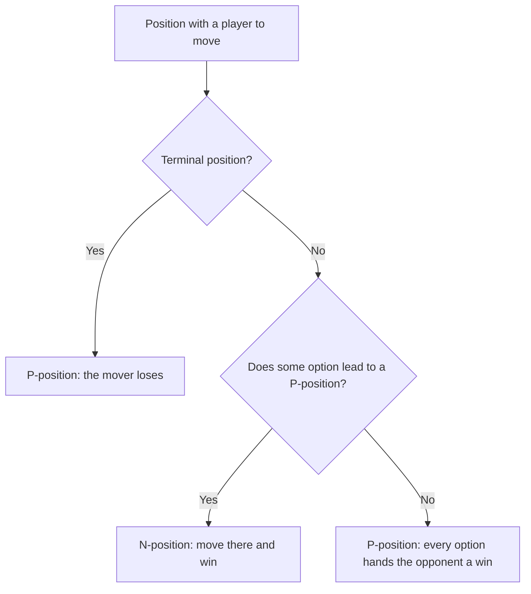
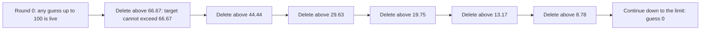
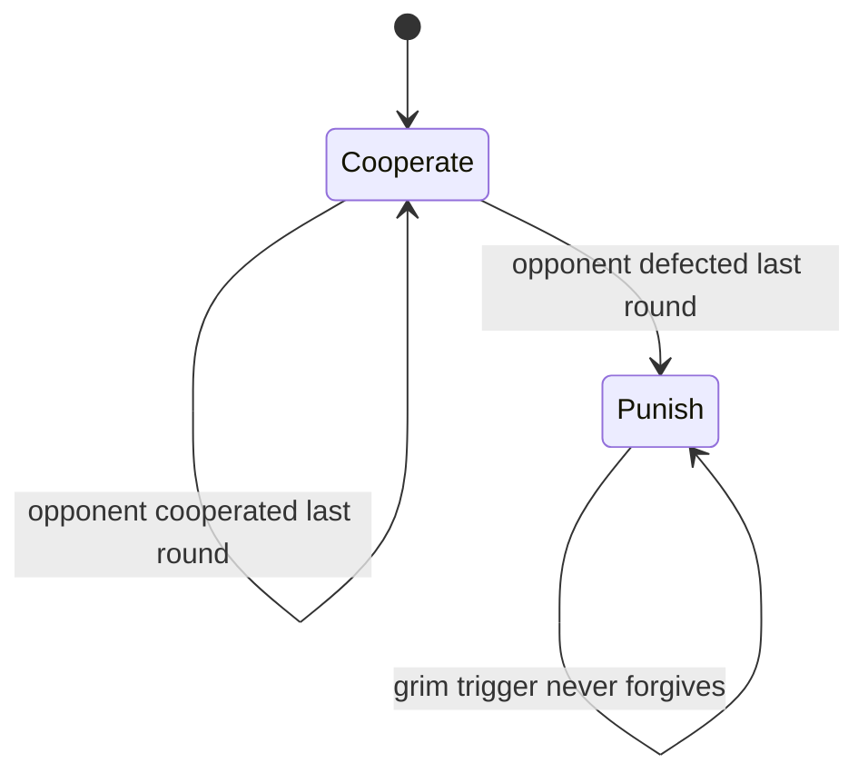

# Game Theory Puzzles for Trading Interviews

## Overview

Trading interviews at market makers and proprietary shops routinely step away from pure probability and ask you to play a game — against the interviewer, against the other candidates, or against a simulated market. The games are rarely algorithm exercises in disguise; they probe whether you can classify positions, reason about incentives, and stay unpredictable when being predictable costs money. This page collects the puzzle-grade game theory those rounds actually use: the win/lose position induction, Nim and its invariant, one fully worked anchor puzzle, dominant-strategy reasoning, and a light pass through mixed strategies.

The angle here is deliberately different from the DSA track's treatment of the same material. The algorithmic chapters — [game theory for interviews](../dsa/chapters/ch61-game-theory.md), [minimax and alpha-beta pruning](../dsa/chapters/ch180-minimax-alpha-beta.md), [the Sprague-Grundy theorem](../dsa/chapters/ch198-sprague-grundy.md), and [algorithmic game theory](../dsa/chapters/ch162-algorithmic-game-theory.md) — teach the machinery: mex computations, game DP, adversarial search, equilibrium complexity. This page teaches the interview performance: which small cases to compute out loud, how to present an invariant, and where each concept transfers to trading. Read both; the theory chapters make the derivations here fast, and this page makes the derivations sellable.

The overlap discipline matches the rest of this section. The five-pirates backward induction is solved in full — with the round-by-round table and the closed form for `k` pirates — on [HRT brainteasers](./hrt-brainteasers.md), the hat-parity line-up protocol on [logic and deduction puzzles](../interview/puzzles/logic-deduction.md), and the 25-horses elimination schedule on [classic measurement puzzles](../interview/puzzles/classic-measurement.md). None of those are re-derived here; they are cross-linked where their concepts appear. The anchor puzzle solved end to end below is one none of those pages cover: guessing two-thirds of the average, a group game that quant firms use as a live calibration instrument.

## Win/Lose Positions: The Core Induction

### P-Positions and N-Positions

Consider two-player games that alternate turns, have perfect information, no chance, no draws, and end in finitely many moves under the normal-play convention: the player who cannot move loses. Every position of such a game is exactly one of two things. A **P-position** is one where the *Previous* player wins — the player about to move loses under optimal play; an **N-position** is one where the *Next* player wins. This binary classification is the substrate for everything on this page, and stating it crisply before computing anything is itself interview credit.

The classification is recursive and never needs a full search tree. Terminal positions are P by definition, because the mover has no move and loses. Any non-terminal position is N if at least one option is a P-position — move there and hand your opponent a loss — and P if every option is an N-position. Note the built-in asymmetry: to certify a position N you exhibit one move, while to certify it P you must account for all options, which is why elegant solutions always work with the *structure* of the P-set rather than by enumeration.

### Worked Example: The Subtraction Game

One pile of `n` coins; players alternately remove 1, 2, or 3 coins; taking the last coin wins. Classify `n = 0` upward, since the recursion only looks downward. The table below is the complete classification, and computing it aloud takes under two minutes on a whiteboard.

| Coins left | Class | Winning reply (when N) |
|---|---|---|
| 0 | P | — |
| 1 | N | take 1, leaving 0 |
| 2 | N | take 2, leaving 0 |
| 3 | N | take 3, leaving 0 |
| 4 | P | every move lands on 1, 2, or 3 |
| 5 | N | take 1, leaving 4 |
| 6 | N | take 2, leaving 4 |
| 7 | N | take 3, leaving 4 |
| 8 | P | every move lands on 5, 6, or 7 |
| 9 | N | take 1, leaving 8 |
| 10 | N | take 2, leaving 8 |

The pattern is immediate: P-positions are exactly the multiples of 4. The proof is the two-line induction the table illustrates: from a multiple of 4, every legal move lands on a non-multiple (an N-position), and from a non-multiple `n` you remove `n mod 4` coins to land on a multiple. Interviewers then change the subtraction set to `{1, 3, 4}`, where the same induction gives P-positions at `n ≡ 0` or `2 (mod 7)` — the sequence 0, 2, 7, 9, 14, 16, 21, 23, … — and the "rerun the induction" requirement punishes anyone who memorized "multiples of 4" instead of the method.

### The Classification as a Decision Procedure

The flow below is how the reasoning should sound in an interview: classify the terminal case, then push the two rules upward. Narrating this loop is worth more than announcing the final answer, because the narration is the evidence that you can re-derive the answer under a rule change.



Two habits make this section stick in a live round. First, always compute the first few P-positions by hand before claiming a pattern — the `{1, 3, 4}` variant above looks like a mod-5 problem and is actually a mod-7 problem, and only the hand-computed table shows that. Second, close the loop by stating the invariant ("P-positions are multiples of 4") together with the reason it is closed under the rules, because the interviewer's follow-up is almost always "prove it" rather than "what is it".

### Where the Binary Model Ends

The P/N machinery is the whole story only when the game pays win-or-lose under normal play, and interviewers deliberately switch conventions mid-question to catch pattern-matching. The popular coin-row game — coins in a row of values \\( a_1, \\ldots, a_n \\), players alternately take one coin from either end, and each keeps what they take — has impartial moves but *scoring* payoffs, so "who wins" is the wrong question and "by how much" is the right one. The correct model is minimax over the score difference, with the recurrence

\\[ D(i, j) = \\max\\big( a_i - D(i+1, j), \\; a_j - D(i, j-1) \\big) \\]

where \\( D(i, j) \\) is the best score difference the mover can extract from the sub-row \\( i \\ldots j \\); a positive \\( D(1, n) \\) means the first player wins the row. That is dynamic programming over intervals, developed in [Chapter 180](../dsa/chapters/ch180-minimax-alpha-beta.md), not a P-position argument — the win/lose induction does not apply because taking a high-value coin is not the same as taking the last coin. The reflex to state out loud: last-move-wins games get the P/N induction, scoring games get minimax DP, and saying which model you are choosing and why is itself a scored line in the interview.

## Nim, Worked From Small Cases Up

### One Pile, Two Piles, Three Piles

Nim is the canonical impartial game: several piles of coins, each move removes any positive number of coins from exactly one pile, and taking the last coin wins. One pile is the subtraction game with every subtraction allowed: it is an N-position unless it is empty. Two piles introduce the first invariant most candidates ever meet: the position is a P-position exactly when the two piles are equal, and the winning strategy is mirroring — whatever the opponent does to one pile, do the identical thing to the other, which keeps the piles equal and returns the position to its owner.

The three-pile case is where the mirror breaks and the real invariant appears. The position (1, 2, 3) is a P-position even though no two piles match, and it is worth verifying by exhaustion because the exhaustion is what motivates the general theorem. Its six options are (0, 2, 3), (1, 1, 3), (1, 0, 3), (1, 2, 2), (1, 2, 1), and (1, 2, 0); each is an N-position because each can be pushed to two equal piles or an empty pair — for example (1, 1, 3) collapses by removing the whole 3-pile to (1, 1), and (0, 2, 3) equalizes by cutting 3 to 2. Six checks, every one an N-position, therefore (1, 2, 3) is P by the induction of the previous section.

### The XOR Invariant

Write each pile size in binary and define the **nim-sum** as the bitwise XOR of all pile sizes:

\\[ s = x_1 \\oplus x_2 \\oplus \\cdots \\oplus x_k \\]

The claim is that a position is a P-position exactly when \\( s = 0 \\). Small cases line up immediately: \\( 1 \\oplus 2 = 3 \\), so (1, 2) is N; \\( 1 \\oplus 2 \\oplus 3 = 0 \\), so (1, 2, 3) is P, matching the exhaustion above; \\( 3 \\oplus 4 \\oplus 5 = 2 \\), so (3, 4, 5) is N with a winning move we will compute below. The invariant compresses the entire classification of the previous section into one arithmetic expression, which is why interviewers love it: it is a two-minute proof of a result that brute force cannot reach even for small piles.

### Why the Invariant Works

The proof is two lemmas, and sketching both is the interview deliverable. **Lemma 1 (zero is fragile):** if \\( s = 0 \\) and you change one pile from \\( x_i \\) to some \\( x_i' < x_i \\), the new nim-sum is

\\[ s' = s \\oplus x_i \\oplus x_i' = x_i \\oplus x_i' \\ne 0 \\]

because two unequal numbers always differ in some bit. So every move out of a zero position lands on a non-zero position. **Lemma 2 (non-zero is repairable):** if \\( s \\ne 0 \\), let `d` be the highest set bit of `s`; an odd number of piles carry bit `d`, so pick one such pile \\( x_i \\) and set \\( y = x_i \\oplus s \\). Then \\( y < x_i \\) — the move flips `d` from 1 to 0 in that pile and changes only lower bits — so removing down to \\( y \\) is legal and restores \\( s = 0 \\). Since the empty game is a zero position and the game is finite, Lemmas 1 and 2 together prove that zero positions are exactly the P-positions: the player who can always restore zero will take the last coin.

The move-finding procedure is short enough to memorize as code, and writing it down in an interview shows you can turn the invariant into an executable check:

```python
def nim_move(piles):
    s = 0
    for p in piles:
        s ^= p
    if s == 0:
        return None            # P-position: any move loses vs optimal play
    for i, p in enumerate(piles):
        target = p ^ s         # candidate replacement y = x_i XOR s
        if target < p:
            return i, p - target
```

For the verbal version of the proof, budget sixty seconds and two sentences per lemma. Sentence one: touching a single pile flips the touched pile's bits, so a zero nim-sum necessarily becomes non-zero. Sentence two: a non-zero nim-sum has a highest set bit that an odd number of piles carry, so flipping that bit off in one such pile — which strictly shrinks it — restores zero, and legality is automatic because the replacement is smaller. Everything else is bookkeeping, and the interviewer's follow-up variants all fail against this frame rather than against a memorized table.

### Worked Position: (3, 4, 5)

Run the procedure on \\( (3, 4, 5) \\). The nim-sum is \\( 3 \\oplus 4 \\oplus 5 = 2 \\ne 0 \\), so the position is N and a winning move exists. The highest set bit of 2 is bit 1 (value 2), and scanning the piles for that bit selects the pile of size 3:

| Pile | Binary | Carries bit 1 (value 2)? | Action |
|---|---|---|---|
| 3 | 011 | yes | reduce to \\( 3 \\oplus 2 = 1 \\) |
| 4 | 100 | no | — |
| 5 | 101 | no | — |

The move leaves \\( (1, 4, 5) \\) with nim-sum \\( 1 \\oplus 4 \\oplus 5 = 0 \\), a P-position for the opponent. Every reply breaks the zero in exactly one pile, and every break is repairable by Lemma 2, so the win is now mechanical rather than clever. In the interview, say the invariant first, compute the XOR aloud second, and identify the pile third — that order demonstrates the method, while blurting "(1, 4, 5)" demonstrates only a memory.

### What Changes in Misère Play

The misère convention — the player who takes the last coin *loses* — is the standard follow-up. Bouton's classical result says the XOR strategy survives almost unchanged: while some pile has two or more coins, play exactly as in normal Nim, except when a move would leave only 1-coin piles; then leave an **odd** number of them instead. The endgame regime is self-contained: with only 1-coin piles, the position is a P-position when their count is odd, because the mover is forced to eventually take the last coin. Check the boundary by hand: (1, 1) is N under misère (take one whole pile and the opponent is stuck), (1, 1, 1) is P, and (2, 2) is still P exactly as normal play predicts, with the endgame adjustment doing the work near the finish. The general theory that unifies these conventions — every impartial game is a nim-sum of Grundy values — is developed in [Chapter 198](../dsa/chapters/ch198-sprague-grundy.md), and the survey treatment with more variants is [Chapter 61](../dsa/chapters/ch61-game-theory.md).

### The Interview Playbook for Nim-Style Questions

Present the analysis in a fixed four-beat order, because the order is what makes it look like a method instead of a lucky guess. Beat one: classify small cases aloud until a pattern is visible — one pile, two piles, then (1, 2, 3). Beat two: conjecture the invariant in the language of the game, and check it against every case you computed. Beat three: prove the invariant is closed — every move out of the losing set leaves it, and every position outside it can be moved into it. Beat four: state the strategy as a sentence a trader could follow without re-deriving anything, and only then answer the interviewer's actual question.

The variants interviewers bolt on are all the same machine with a different subtraction set. Bounded takes ("remove at most 4") turn Nim back into the subtraction game. "Subtract a square" — remove any perfect-square number of coins — produces P-positions beginning 0, 2, 5, 7, 10, 12, 15, 17, 20, 22, which look exactly like the residues 0 and 2 modulo 5 until the first exception at 34, a famous reminder that pattern-guessing needs a long verification range or a real proof. The disciplined response to any variant is the same: recompute the small cases, re-conjecture, and re-prove; the two lemmas of the XOR section change only in their arithmetic, never in their shape.

## Anchor Puzzle: Guess Two-Thirds of the Average

### Statement and Why Interviewers Like It

A group of `n` people each submits an integer from 0 to 100. The target is two-thirds of the group's average submission, and the prize goes to whoever submits closest to the target, with ties split. It is commonly reported as a group icebreaker at quant-firm events and as an interview question in trading loops, because it compresses three distinct skills into one round: computing a dominance argument, running an induction to an equilibrium, and then — the part that actually matters — reasoning about why real people do not play the equilibrium.

The naive submissions are each a theory about the other players, and the interview point is to name that ladder explicitly. Guessing 100 is level-zero optimism; guessing 50 anchors on a uniformly random population; guessing 33 applies one step of reasoning to that anchor ("everyone averages 50, so I guess two-thirds of 50"); guessing 22 applies two steps. Each guess is the best response to a belief about a population one level shallower than itself — the **level-k** model — and candidates who fumble for "the answer" instead of presenting the ladder miss the entire point of the game.

Before computing, spend thirty seconds pinning the rules, because the variants change the arithmetic and the clarifying questions are themselves scored. Is the target two-thirds of the mean or the median? Are submissions real numbers or integers? What happens on ties, and is 100 itself a legal submission? A candidate who asks these questions out loud demonstrates the same habit the desk demands before sizing a trade: know the contract before you quote it, because every one of these details moves the equilibrium and the empirical winning guess.

### Step 1: Guesses Above 66.67 Are Dominated

The target can never exceed \\( \\tfrac{2}{3} \\times 100 = \\tfrac{200}{3} \\approx 66.67 \\), whatever anyone does. A submission strictly above that bound is strictly dominated: for a fixed set of opponents' submissions, your distance to the target equals \\( g(1 - \\tfrac{2}{3n}) - \\tfrac{2S}{3n} \\), where `S` is the opponents' total and `g` is your guess, which is strictly increasing in `g` for every `n`. Since guessing exactly \\( 200/3 \\) already puts you above the largest target your opponents can force — their best case drags the target to \\( \\tfrac{200}{3} - \\tfrac{200}{9n} \\) — every higher guess sits further from the target against the very same opponent profile. The sharp follow-up is "doesn't your own guess inflate the target?": yes, by \\( \\tfrac{2}{3n} \\) per unit of guess, which is less than one for every group size and therefore never overturns the argument.

### Step 2: The Iterated Cascade to Zero

Now iterate the deletion, and the induction engine from the first section reappears in economic clothing. Once everyone knows that nobody plays above 66.67, the target cannot exceed \\( \\tfrac{2}{3} \\times 66.67 = 44.44 \\), so everything above 44.44 is deleted; the argument repeats, and the upper bound follows the geometric sequence

\\[ u_k = 100 \\cdot \\left( \\tfrac{2}{3} \\right)^{k} : \\quad 100,\\ 66.67,\\ 44.44,\\ 29.63,\\ 19.75,\\ 13.17,\\ 8.78,\\ 5.85,\\ 3.90,\\ 2.60,\\ 1.73,\\ 1.16,\\ 0.77,\\ \\ldots \\; \\to \\; 0 \\]

With integer submissions the deletion reaches zero in finitely many rounds: the successive integer bounds are 66, 44, 29, 19, 12, 8, 5, 3, 2, 1, 0 — eleven deletion rounds in total. Each round consumes one level of "I know that they know that I know", which is why the game doubles as a probe of how many levels of common knowledge a candidate actually applies rather than asserts.



### Step 3: All-Zero Is the Unique Nash Equilibrium

That all-zero is an equilibrium takes two lines. If everyone submits 0 and one deviator submits `d > 0`, the target becomes \\( \\tfrac{2d}{3n} \\); the deviator's distance is \\( d(3n - 2)/(3n) \\) while every other player's distance is \\( \\tfrac{2d}{3n} \\), and since \\( 3n - 2 > 2 \\) for `n ≥ 2` the deviator is strictly farther and wins nothing. No other profile survives. The best response to opponents' total `S` is \\( g^{*} = \\tfrac{2S}{3n - 2} \\), so a profile where every submission is a best response to the rest must satisfy \\( g = \\tfrac{2(n-1)g}{3n-2} \\), whose only solution is \\( g = 0 \\); the symmetric case makes the instability vivid, since a deviator from an all-`g` field to roughly `g/2` lands strictly closer to the target than the field and wins outright. Unique equilibrium, all zeros.

### Step 4: What Real Groups Do

The equilibrium almost never wins, and explaining why is the part of the answer interviewers score highest. Real populations are level-k bounded: a level-0 player submits randomly (mean 50), level-1 submits 33, level-2 submits 22, level-3 submits 15, level-4 submits 10. Large mixed populations behave like level-1-to-2 aggregates: the biggest published run — a Danish newspaper competition with roughly 19,000 entries — produced a mean near 32, making 22 the winning submission, and classroom replications in the literature report first-round means in the 30s that drift downward only with repetition. The practical play follows from the population, not the equilibrium: against an untrained public, guess around 20 to 25; against a trained audience such as fellow interview candidates, shade down toward 10 to 15; and narrate both numbers plus the level-k label while you do it, because the reasoning is the deliverable.

The trading reading is Keynes's beauty contest from *The General Theory of Employment, Interest and Money* (1936): markets do not price what an asset is worth to you; they price what the crowd will believe it is worth, and the crowd is pricing the crowd's belief in turn. A trader who buys only on personal fair value loses to one who models the distribution of other traders' models. The caveat belongs in the same breath: the 2/3 game is one-shot with a fixed target, while markets iterate with shifting level structure, which is exactly why naive equilibrium reasoning fails during bubbles — the population's level distribution is itself moving.

### Variants: Mean Targets and p Greater Than One

Changing the multiplier `p` in the target \\( T = p \\cdot \\text{mean} \\) changes the entire logic, and the contrasts are each worth one interview sentence. At \\( p = 1 \\) — target the plain average — the deletion argument collapses completely: if everyone submits `g` and one deviator switches to `d`, both the deviator's and the field's distance to the new mean are exactly \\( \\tfrac{n-1}{n}|d - g| \\), so the deviator can tie but never strictly win, and *every* symmetric profile is a Nash equilibrium; with a continuum of equilibria there is nothing to cascade and no way to reason about the population from the equilibrium concept alone. At \\( p = \\tfrac{2}{3} \\) the multiplier contracts beliefs enough to cascade, which is why it is the teachable case. At \\( p > 1 \\) the best response amplifies — the best response to opponents' total is \\( \\tfrac{pS}{n - p} \\) which grows the guess geometrically — so no bounded equilibrium exists at all and the game models explosive forecast-chasing rather than convergence. Interviewers use these three regimes as a one-question probe of whether your equilibrium reasoning is mechanical or structural.

## Dominant Strategies and the Prisoner's Dilemma

### The Payoff Matrix and Strict Dominance

The prisoner's dilemma is the canonical two-by-two: each player picks Cooperate (C) or Defect (D), with payoffs \\( (C,C) = (3,3) \\), \\( (C,D) = (0,5) \\), \\( (D,C) = (5,0) \\), and \\( (D,D) = (1,1) \\), where the first entry is the row player's. Defect strictly dominates: against an opponent's C it pays 5 rather than 3, and against an opponent's D it pays 1 rather than 0. Strict dominance by both players forces the unique equilibrium \\( (D,D) \\), which both players unanimously prefer to avoid — \\( (3,3) \\) beats \\( (1,1) \\) for everyone. In interviews the equilibrium itself is never the question, because everyone answers "defect" instantly; the question is what sustains cooperation when the game is embedded in time.

### One-Shot Versus Repeated: The Shadow of the Future

Suppose the game repeats indefinitely — or, more realistically, ends each round with probability \\( 1 - \\delta \\), so the future carries weight \\( \\delta \\). Cooperating forever is worth \\( \\tfrac{3}{1-\\delta} \\); defecting once against a **grim trigger** opponent who then defects forever is worth \\( 5 + \\tfrac{\\delta}{1-\\delta} \\). Cooperation survives exactly when

\\[ \\frac{3}{1-\\delta} \\ge 5 + \\frac{\\delta}{1-\\delta} \\iff 3 \\ge 5(1-\\delta) + \\delta \\iff \\delta \\ge \\frac{1}{2} \\]

That single inequality is the whole story of business relationships: cooperation is rational precisely when the shadow of the future is long enough, and the threshold depends on how valuable tomorrow is. Contrast the finitely repeated game with a known end: backward induction unravels cooperation from the last round inward — defect is dominant in the final round, so it is dominant in the second-to-last once that is common knowledge, and so on to round one. This is the same induction that solves the five-pirates puzzle in [HRT brainteasers](./hrt-brainteasers.md), which is why the two problems are taught as one concept.



Axelrod's tournament literature (reported in *The Evolution of Cooperation*) adds the empirical layer: simple reciprocating strategies like tit-for-tat — cooperate first, then copy the opponent's last move — beat cleverer-looking programs because they are nice, provokable, and forgiving, and those three properties map directly onto counterpart relationships. The finite-horizon caveat has a desk translation that interviewers like hearing: a trader on a known last day faces the defection incentive at full strength, which is why conduct rules are contractual rather than incentive-compatible alone.

### Why Market Makers Cooperate

Liquidity provision is a repeated game with observable behavior and an indefinite horizon, so the machinery above applies almost literally. A market maker who quotes honestly and does not exploit stale information from clients keeps the flow coming — the client's silence-and-return is continued cooperation — while one who picks off customers gets excluded, which is the grim trigger operating through relationship loss rather than through a payoff matrix. Where natural repetition is too weak, enforcement substitutes for it: exchanges and regulators punish spoofing and manipulation exactly like the punishment state in the diagram, because those acts are one-shot defections against the whole market. Candidates commonly report that firm games score not just the final P&L but whether you defect opportunistically in long-horizon rounds, and the reason is this section: defection in an indefinitely repeated structure reads as a mispriced \\( \\delta \\), which is a risk-management red flag on a trading desk.

### What Moves the Shadow of the Future

The threshold \\( \\delta \\ge \\tfrac{1}{2} \\) is not just abstract — the effective \\( \\delta \\) is a function of observable institutional features, and naming them is the desk-level version of the derivation. Observability raises it: a defection that is never detected can never be punished, so monitoring technology such as exchange audit trails, order-tagging, and toxic-flow flags directly lengthens the shadow. Interaction frequency raises it: counterparties who meet thousands of times a day are effectively infinite-horizon players even if each individual relationship is mortal. Concentration raises it too — with a small number of counterparties, exclusion is a binding threat, while a crowd of anonymous counterparties makes defection cheap because the next victim cannot remember. When an interviewer asks why market makers do not exploit each other, the expected answer is this list mapped onto market structure, not the word "ethics".

## Mixed Strategies, Light: Rock-Paper-Scissors

### Why No Pure Strategy Survives

Rock-paper-scissors is the minimal zero-sum game: win pays +1, lose pays −1, draw pays 0, and the dominance cycles — rock beats scissors, scissors beats paper, paper beats rock. There is no pure-strategy equilibrium, because whatever you throw, the opponent has a strict counter, so any predictable action is strictly exploitable. That makes it the perfect primer for zero-sum reasoning: your objective is not to outsmart the opponent move by move but to guarantee a floor by being unexploitable, and the guarantee comes from randomization. Interviews use it to check one specific instinct — whether you reach for "play unpredictably" or for the sharper "play the mix that makes the opponent indifferent", which are very different answers.

### The Uniform Equilibrium and Indifference

The equilibrium mix is uniform, \\( (\\tfrac{1}{3}, \\tfrac{1}{3}, \\tfrac{1}{3}) \\), and the verification is the indifference condition that generalizes to all zero-sum games. If the opponent mixes uniformly, every pure response earns exactly zero:

\\[ \\mathbb{E}[\\text{Rock}] = \\tfrac{1}{3}(0) + \\tfrac{1}{3}(-1) + \\tfrac{1}{3}(+1) = 0, \\quad \\mathbb{E}[\\text{Paper}] = 0, \\quad \\mathbb{E}[\\text{Scissors}] = 0 \\]

Indifference means no counter-strategy has an edge, which is precisely what being unexploitable means in a zero-sum game; the uniform mix guarantees the game's value of 0 no matter how clever the opponent is. The general guarantee behind this is the von Neumann minimax theorem, and its message for interviews is worth one sentence: in zero-sum settings you compute the mix that protects the floor, and any deviation from it converts your guarantee into an exposure.

### Exploiting a Non-Uniform Opponent

Against an opponent with throw frequencies \\( (r, p, s) \\), the expected values are compact: \\( \\mathbb{E}[\\text{Rock}] = s - p \\), \\( \\mathbb{E}[\\text{Paper}] = r - s \\), \\( \\mathbb{E}[\\text{Scissors}] = p - r \\), so the best response always counters the opponent's most frequent throw. Suppose they throw rock half the time and paper and scissors a quarter each; then paper is the best response with

\\[ \\mathbb{E}[\\text{Paper}] = 0.5(+1) + 0.25(-1) + 0.25(0) = +0.25 \\]

a quarter of a point per round, while the uniform mix would earn zero. There are two layers to the answer, and strong candidates say both: the static exploit just computed, and then the dynamics — an opponent who notices being exploited shifts frequencies, so the real game is tracking and adapting faster than the opponent's tracking, with the equilibrium as the point where both stop profiting.

### Conditional Play and the Never-Repeats Opponent

Real opponents leak through *conditional* frequencies, and one conditional example is worth carrying into interviews. Suppose an opponent never throws the same thing twice in a row: after they throw rock, their next throw is paper or scissors with probability one half each. Your best response is scissors, since it beats their paper half the time and ties the rest:

\\[ \\mathbb{E}[\\text{Scissors}] = \\tfrac{1}{2}(+1) + \\tfrac{1}{2}(0) = +0.5 \\]

while rock earns zero and paper earns \\( -0.5 \\) against that conditional distribution. The general lesson is that exploits live in the conditioning: a marginal frequency table can look perfectly balanced while a conditional table is wide open, and the equilibrium mixer is precisely the player whose play looks open under *every* conditioning. When an interviewer asks how you would play against a human rather than a random number generator, this example is the difference between a generic answer and a demonstration.

### Unpredictability in Trading

The trading translation is direct: any pattern in your behavior that a counterparty can condition on becomes adverse selection against you. Order-size randomization, quote flicker, and arrival-time jitter exist because counterparties — human or latency-arbitrage systems — infer your state from your actions, and a market maker whose responses are predictable gets picked off exactly like an RPS player who never repeats a throw. The honest caveat belongs in the answer: markets are not zero-sum, because customers receive execution value, but the adversarial layer between competing market makers and toxic flow behaves like one, and the mixed-strategy instinct transfers cleanly. The last discipline to state is that equilibrium mixing is not "be random" — the mix is computed from payoffs, and the skill is deriving the right probabilities, not generating noise.

### A Variant That Moves the Mix: Double-Payoff Rock

The indifference method is computational, and one variant proves it. Change the payoffs so that a rock win pays +2 (rock beats scissors for two points; all other wins pay one). Against an opponent mixing \\( (r, p, s) \\), your pure-strategy expected values become \\( 2s - p \\), \\( r - s \\), and \\( p - 2r \\) for rock, paper, and scissors respectively. Setting all three to zero and using \\( r + p + s = 1 \\) gives \\( s = r = \\tfrac{1}{4}, \\; p = \\tfrac{1}{2} \\):

\\[ (r, p, s) = \\left( \\tfrac{1}{4}, \\; \\tfrac{1}{2}, \\; \\tfrac{1}{4} \\right) \\]

The buffed weapon is answered by more of its counter — paper's probability doubles relative to the uniform baseline — which is exactly how markets reprice when one strategy's edge grows. Work this variant once by hand before your loop; interviewers use it to check that you can run the indifference calculation rather than recite "one third each", and the intuition sentence (counter the buffed move) is what earns the follow-up question.

## Games the Firms Actually Play

Beyond puzzle-form games, firms run live game formats, and the commonly reported ones are consistent across candidate experiences even as specifics drift by season. Jane Street's onsite loop is widely reported to include estimation and market-making games — quote a bid and ask on an unknown quantity, then trade on your own uncertainty — plus betting games where you stake money on your own answers; see the firm's site at https://www.janestreet.com and its puzzle program at https://www.janestreet.com/puzzles/. SIG's famously elaborate game day puts candidates through casino-style betting games for small real stakes over a half day (https://sig.com), Optiver's loop leans on speed drills plus trading games (https://www.optiver.com), and HRT mixes brainteasers with probability and betting games (https://www.hudsonrivertrading.com). Treat the formats as role-played desks: what is scored is expected value, sizing, and composure, not the final score of the game itself.

The play pattern that scores well is the same every time. State a fair value and its uncertainty before quoting anything, because a quote without a fair value is a coin flip wearing a suit. Size by edge rather than by bravado — a 60/40 belief warrants a modest Kelly-style fraction, which the sizing drills on [expected value problems](./expected-value-problems.md) formalize — and update the quote on every piece of public information, because stale quotes are the interview equivalent of stale prices. The mechanics of two-sided quoting, adverse selection, and inventory are developed on [market-making games](./market-making-games.md), and the speed layer they all sit on is [mental math speed](./mental-math-speed.md).

### Estimation Games and the Fermi Layer

Estimation rounds — how many tennis balls fit in this room — are games against your own calibration, and the scoring rubric rewards structure over accuracy. The strong pattern is decompose, bound, and commit: split the quantity into factors you can defend, give a central estimate, and attach an explicit interval you actually believe. Then treat your own answer as the underlying asset: firms commonly report a follow-up where you quote a bid-ask on your own estimate or stake money on a range, which converts a Fermi problem into a market on your own information. The interview signal is whether your stated confidence moves when evidence arrives — a candidate who quotes a narrow interval and then refuses to shift it after learning the room has a mezzanine has failed the update test, regardless of the final number.

The behavioral layer is scored as heavily as the arithmetic. Interviewers watch whether you tilt after a bad round, whether you blame the "market" for a decision that was yours, and whether your sizing actually shrinks when your edge shrinks. One honest framing closes this section: either you find these games genuinely fun or you do not, and both signals are acceptable — the firms are calibrating whether a career of constant small gambles suits you, and discovering the answer in an interview is far cheaper than discovering it in month three of the job.

### Practicing the Formats at Home

Every one of these formats has a home-drill equivalent, and the drills cost nothing. Run weekly game nights with coursemates where one person plays the house: alternate between make-me-a-market rounds on everyday quantities, estimation rounds with forced bid-ask quotes, and betting rounds where stakes are real but small, because real stakes are the only thing that teaches sizing discipline. Keep a journal with three columns — your quote, the outcome, and what information arrived afterward — and score your calibration monthly using a simple hit-rate-within-interval check. The candidates who arrive at onsite loops having already lost money to their friends in structured practice are noticeably calmer in the real games, and calm is one of the things the games exist to measure.

### Common Failure Modes

The same four failures repeat across candidates, and each has a one-line fix. Reciting an answer without re-deriving it collapses the moment the rules change, so narrate the induction instead of the result. Applying last-move-wins logic to a scoring game — or vice versa — produces confident nonsense, so open every game question by naming the convention. Ignoring a misère flip or a tie rule silently invalidates the whole solution, so pin the rules before the first move. And in firm games, quoting without a fair value or sizing without an edge converts a calibration exercise into a coin flip, which is precisely the behavior the games are designed to expose.

## From Puzzle to Trading Lesson

Every puzzle on this page compresses into one transferable line, and the table is the compression. Use it as a recall drill: cover the right two columns, reconstruct each puzzle from its concept, then articulate the trading lesson without notes.

| Puzzle | Core concept | Transferable trading lesson |
|---|---|---|
| Guess 2/3 of the average | Iterated dominance; common knowledge; level-k populations | Markets price expectations about expectations; equilibrium is a starting point, not a forecast |
| Nim | XOR invariant; P/N induction | Recognize when a contest is structurally decided; compute the invariant instead of improvising |
| Prisoner's dilemma | Strict dominance versus repeated-game cooperation | Fair quoting survives because the trading relationship is indefinitely repeated |
| Rock-paper-scissors | Mixed equilibrium; indifference | Unpredictability has monetary value; any readable pattern is exploitable flow |
| Five pirates (cross-link) | Backward induction; subgame perfection | Leverage comes from owning future decision nodes; price votes at outside options |
| Hat line-up (cross-link) | Protocol design; broadcasting one bit | Pre-committed conventions extract signal from public announcements |

The table also encodes the page's coverage boundaries. The two cross-linked rows are solved in full elsewhere — pirates on [HRT brainteasers](./hrt-brainteasers.md) and the hat-parity protocol on [logic and deduction puzzles](../interview/puzzles/logic-deduction.md) — so this page pulls only their lessons, keeping every worked derivation in exactly one place. If you can reconstruct all six middle-column concepts from a blank page, the game-theory layer of a trading loop is covered; the next layer up is the algorithmic treatment in the DSA chapters linked below.

### How to Drill the Table

Use the table as a spaced-repetition instrument rather than a summary to read once. Cover the right two columns weekly and reconstruct each row aloud — puzzle, concept, lesson — and treat any row you cannot rebuild as a page to re-derive, not to re-read. The final step of the drill is transfer: for each concept, name one market situation outside this page where it applies, because that sentence is what interviewers actually listen for once the puzzle itself is finished.

## Interview Questions

1. **Nim position (3, 4, 5), normal play — what is the winning move and why?** Compute the nim-sum: \\( 3 \\oplus 4 \\oplus 5 = 2 \\), which is non-zero, so the position is an N-position and a winning move exists. The highest set bit of 2 is bit 1, carried only by the pile of 3 (binary 011), so reduce that pile to \\( 3 \\oplus 2 = 1 \\), leaving (1, 4, 5) with nim-sum zero. From a zero position every move breaks the XOR in exactly one pile, and each break is repairable by the highest-set-bit rule, so the win is mechanical from there. If the interviewer flips to misère, note that the strategy holds until the position would become all 1-coin piles, then leaves an odd count of them.

2. **Two piles hold 7 and 9 stones; a move takes any positive number from one pile; the last stone wins. Who wins and how?** The first player wins by equalizing: reduce 9 to 7, handing over (7, 7), which is a P-position because two-pile Nim is lost exactly when the piles are equal. The strategy is mirroring — whatever the opponent does to one pile, repeat on the other — which maintains equality until the opponent faces the empty game. If the variant flips to misère, the same equalizing move still wins, but the endgame changes: the mirroring player must eventually take a whole pile rather than stepping down to (1, 1), because (1, 1) is an N-position under misère. Stating both the strategy and the endgame adjustment demonstrates the induction rather than a memorized fact.

3. **In guess-two-thirds-of-the-average, why is 0 the equilibrium yet 0 rarely wins real games?** Zero is the unique Nash equilibrium because guesses above 66.67 are strictly dominated, iteration of that deletion drives the bound to zero, and the best response to opponents' total \\( S \\) is \\( 2S/(3n-2) \\), whose only consistent profile is all zeros. Real populations are level-k bounded: level-1 players guess 33, level-2 guess 22, and large mixed groups average near 30, which is why a submission around 20 to 25 wins public games and lower numbers win trained audiences. The equilibrium assumes common knowledge of rationality, which fails socially rather than mathematically. The scored answer names level-k thinking and the Keynesian beauty contest, and gives both numbers — 0 for the equilibrium, 20-ish for the population.

4. **A rock-paper-scissors opponent throws rock 40 percent, paper 30 percent, scissors 30 percent. What is your best response and edge?** Expected values are \\( \\mathbb{E}[\\text{Rock}] = s - p = 0 \\), \\( \\mathbb{E}[\\text{Paper}] = r - s = +0.10 \\), and \\( \\mathbb{E}[\\text{Scissors}] = p - r = -0.10 \\), so paper is the best response with a tenth of a point per throw. The direct computation agrees: \\( 0.4(+1) + 0.3(0) + 0.3(-1) = +0.10 \\). The second layer is adaptation — a static exploit against a live opponent decays as they adjust, so the real skill is frequency tracking with re-estimation after every few throws. Mentioning that the uniform mix would hold them to zero, while their non-uniformity hands you the edge, closes the loop to the indifference principle.

5. **Why does cooperation survive between market makers if defection wins every one-shot prisoner's dilemma?** Because the trading relationship is an indefinitely repeated game, and the one-shot logic no longer applies: cooperating forever is worth \\( 3/(1-\\delta) \\) while defecting once against a grim-trigger counterpart is worth \\( 5 + \\delta/(1-\\delta) \\), so cooperation is rational exactly when \\( \\delta \\ge 1/2 \\). Client flow, exchange relationships, and reputation all have precisely this continuation-value structure, and exclusion from flow is the punishment state. The known-end caveat belongs in the answer: when the horizon becomes finite and known, backward induction unravels cooperation, which is why conduct rules are contractual rather than purely incentive-based. Naming the shadow of the future and the \\( \\delta \\ge 1/2 \\) threshold is the technical core of the reply.

6. **"Make me a market on the number of windows in this building" — walk through your play.** First decompose and estimate: floors times windows per floor, each with a range — say 8 floors at roughly 25 windows each — and convert the estimate into a calibrated distribution, not a point. Then quote two-sided around the fair value with a width that reflects your uncertainty, for example 175 to 225, and state that the width is your uncertainty statement. Tighten as the interviewer volunteers information — each new fact (older building, office block) should visibly move your quotes — and size any bet they offer by the edge: you should want to bet far more at your fair value when your range is ±20 than when it is ±80. The scoring is whether you produced a calibrated, updating, two-sided market quickly, not whether your final point estimate was right.

## Key Takeaways

- Every finite two-player perfect-information game partitions into P-positions and N-positions; the recursion is "N if any option is P, P if all options are N," and computing the first few cases by hand before claiming a pattern is the method that survives rule changes.
- Nim's P-positions are exactly the zero-nim-sum positions; the proof is two lemmas — zero is fragile, non-zero is repairable via the highest set bit — and the move is always "reduce some pile \\( x_i \\) to \\( x_i \\oplus s \\)."
- Misère Nim keeps the XOR strategy until the endgame and then leaves an odd number of 1-coin piles; the all-1-coin regime flips the parity condition.
- The 2/3-of-the-average game is the interview's cleanest dominance cascade: strictly dominated above 66.67, deleted down to a unique all-zero equilibrium in eleven integer rounds, yet won in practice by level-2 guesses near 20 — equilibrium analysis and population modeling are different skills, and desks want both.
- Cooperation in the prisoner's dilemma survives exactly when the future is heavy enough: \\( \\delta \\ge 1/2 \\) under grim trigger in the canonical payoffs; finitely repeated games with known ends unravel by the same backward induction that solves the pirate puzzle.
- In zero-sum play, compute the mix that makes the opponent indifferent; against any non-uniform opponent, best-respond to their frequencies and expect them to adapt.
- Firm games are scored on process: fair value before quotes, sizing by edge, updating on information, and composure after losses — not on the game's final score.
- The repo keeps one worked home per classic: pirates live on the HRT brainteasers page, hat parity on logic-deduction, 25 horses on classic measurement — cross-link rather than re-derive.

## References

- Jane Street — firm site and the monthly puzzle program: https://www.janestreet.com and https://www.janestreet.com/puzzles/
- SIG — Susquehanna International Group, game day and campus hiring: https://sig.com
- Optiver — trading games and the zap-style speed screens: https://www.optiver.com
- Hudson River Trading — brainteaser-and-games loop: https://www.hudsonrivertrading.com
- Xinfeng Zhou, *A Practical Guide to Quantitative Finance Interviews* — the game-theory and brainteaser chapters (name-only; see [Interview Canon](./interview-canon.md))
- Timothy Crack, *Heard on the Street* — question-bank coverage of games and probability (name-only)
- Frederick Mosteller, *Fifty Challenging Problems in Probability* — pocket expected-value canon (name-only)
- C. L. Bouton, "Nim, a Game with a Complete Mathematical Theory," *Annals of Mathematics*, 1901 — the original XOR analysis (name-only)
- Rosemarie Nagel, "Unraveling in Guessing Games: An Experimental Study," *American Economic Review*, 1995 — the level-k beauty-contest experiments (name-only)
- John Maynard Keynes, *The General Theory of Employment, Interest and Money*, 1936, Chapter 12 — the beauty-contest passage (name-only)
- Robert Axelrod, *The Evolution of Cooperation*, 1984 — tournament evidence on tit-for-tat (name-only)

## Cross-References

- [Quantitative Finance Interview Preparation](./README.md) — the section hub defining the funnel these games sit in
- [HRT Brainteasers](./hrt-brainteasers.md) — the five-pirates backward induction solved in full with the closed form for k pirates
- [Expected Value Problems](./expected-value-problems.md) — the EV and Kelly-sizing drills the firm games assume
- [Market-Making Games](./market-making-games.md) — two-sided quoting, adverse selection, and inventory mechanics behind the onsite games
- [Interview Canon](./interview-canon.md) — where the books that teach these games fit into a study plan
- [Chapter 61: Game Theory for Interviews](../dsa/chapters/ch61-game-theory.md) — the DSA survey of impartial games and game DP
- [Chapter 198: Sprague-Grundy Theorem](../dsa/chapters/ch198-sprague-grundy.md) — the general theory unifying Nim and all impartial games
- [Chapter 180: Minimax and Alpha-Beta Pruning](../dsa/chapters/ch180-minimax-alpha-beta.md) — partisan games such as the coin-row take-away family
- [Chapter 162: Algorithmic Game Theory](../dsa/chapters/ch162-algorithmic-game-theory.md) — auctions, matching, and mechanism design beyond puzzle games
- [Logic and Deduction Puzzles](../interview/puzzles/logic-deduction.md) — the hat-parity line-up protocol and common-knowledge reasoning
- [Classic Measurement Puzzles](../interview/puzzles/classic-measurement.md) — the 25-horses elimination schedule and its blocking argument
- [Probability and Statistics](../mathematics/probability-statistics.md) — the probability layer under mixed strategies and expected value
