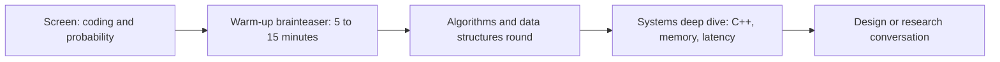
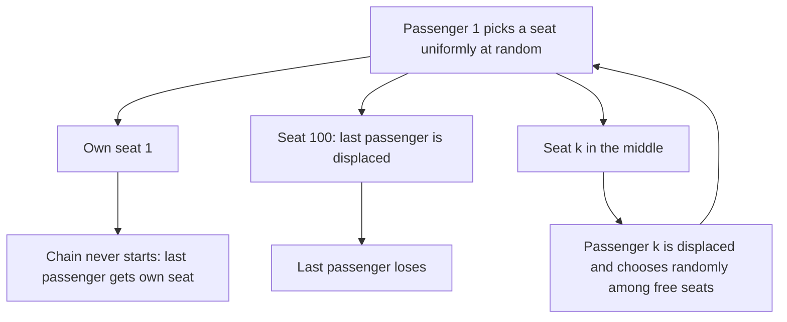

# HRT Brainteasers

## Overview

Hudson River Trading (HRT) is a technology-driven trading firm headquartered in New York, and its interview loop — as commonly reported and loosely consistent with the roles it posts at https://www.hudsonrivertrading.com/careers/ — pairs algorithm and systems rounds with short brainteaser warm-ups. The brainteaser slot is short, often five to fifteen minutes at the top of a round, and it exists to sample how you reason when no library function or memorized algorithm applies. This page works five classic brainteasers that fit that slot and that are **not** already solved on this repo's puzzle pages: five pirates dividing gold, the lost boarding pass, blue-eyed islanders, the 1000-locker problem, and the biased-coin-to-fair-coin extractor.

The overlap discipline matters here. The repo's [Puzzles & Brain Teasers](../interview/puzzles/README.md) section already carries full solutions to Monty Hall, the two-egg drop, the 12-coin weighing, the water jugs, the burning ropes, the 100-prisoners problems, and their canonical cousins — this page deliberately does not re-solve any of those, and links to them instead. Everything below follows the same five-stage solve framework that section defines, so the pages reinforce rather than duplicate each other. Each puzzle here gets the full treatment: statement, naive approaches and why they fail, a complete solution with the math shown, and the generalization interviewers reach for next.

Use the page in two passes. First pass: attempt each puzzle cold with a ten-minute timer and narrate aloud, because the warm-up slot is a performance format as much as a math format. Second pass: study the naive-approaches sections, since the interviewer's real question is almost always "why does the obvious idea fail," and that answer is what separates a re-derivation from a recitation. The concepts table early in the page is the compression of all five puzzles into one line each — if you can reconstruct each puzzle from its concept line, the page has done its job.

## How Brainteasers Fit the HRT Loop

Brainteasers at HRT-style firms are a calibration instrument, not a gate by themselves. A loop typically spends most of its time on algorithms and — for engineering roles — a systems deep-dive, with the brainteaser serving as a fast, standardized probe of reasoning-under-ambiguity at the start. Candidates commonly report the sequence below, though formats drift by role and season; treat it as a map, not a specification.



### Weighting: Warm-Up, Not Verdict

No offer or rejection turns on the brainteaser alone — it calibrates; the algorithm and systems rounds decide. The reason is signal quality: a brainteaser produces ten minutes of dense reasoning data, which is enough to see whether you clarify constraints, shrink the problem, and narrate coherently, but not enough to certify coding fluency or systems judgment. Interviewers also use the slot to observe failure behavior, because a candidate who says "I'm stuck, let me try the two-passenger version" demonstrates the exact recovery loop production incidents demand. Prepare for the brainteaser slot by drilling the underlying concepts — the table below maps each classic to its concept — rather than memorizing answers, because the follow-up variant is where unprepared recall collapses.

### What the Warm-Up Signals to Different Roles

The same brainteaser reads differently depending on the seat you are interviewing for. For trader and quant-researcher tracks, the warm-up previews the core job skill — forming a model of an uncertain situation quickly and revising it under pressure — so interviewers push the modeling and follow-ups hard. For engineering tracks, the warm-up is a communication and rigor probe while the algorithm and systems rounds carry the technical weight, so a clean, honest ten minutes with one good recovery matters more than speed. For infrastructure roles specifically, expect the brainteaser to be followed immediately by latency, memory, or C++ questions where the same "reduce the state, find the invariant" habits apply to cache lines and lock contention. The transferable claim is deliberate: the habits this page teaches are the firm's daily working habits in miniature.

### The Puzzle-to-Concept Map

| Puzzle | Underlying concept | The follow-up hook interviewers use |
|---|---|---|
| Five pirates divide 100 gold | Backward induction / subgame perfection | Change the voting rule or the number of pirates |
| Lost boarding pass | Symmetry plus induction on the fight set | n seats; two lost tickets; expected number of displaced passengers |
| Blue-eyed islanders | Common knowledge (k-th order beliefs) | "What exactly did the announcement add?" |
| 1000 lockers | Divisor pairing; perfect squares | Lockers toggled exactly k times |
| Biased coin to fair coin | Randomness extraction | Expected flips per bit; fair die from a biased coin |

The concepts generalize far beyond the puzzles, which is the point of learning them this way. Backward induction reappears in any multi-stage decision with known incentives; symmetry arguments reappear everywhere in probability; common knowledge reappears in consensus and coordination problems; divisor pairing is a number-theory reflex; randomness extraction is a real tool in systems and cryptography. Five puzzles, five durable tools.

## Five Pirates Divide 100 Gold

**Statement.** Five pirates, ranked A (most senior) through E, must divide 100 gold coins. The most senior living pirate proposes an allocation; all pirates vote; if at least half accept (the proposer votes too), the split stands, otherwise the proposer is thrown overboard and the next most senior proposes among the survivors. Pirates are perfectly rational and this is common knowledge; each prefers, in order: survival, more gold, and — to break ties — throwing the proposer overboard. What does pirate A propose?

**The naive approaches fail on incentives.** Splitting evenly (20 each) is stable against envy but not optimal for A, who can buy the cheapest votes instead. Offering everyone something "to be safe" overpays massively, because a pirate who receives 0 under the next round's outcome sells a vote for exactly 1 coin. Greedy vote-buying without recursion also fails, because "cheap" is only defined by the subgame that follows a rejection — you need the whole chain before you can price the first bribe.

### Backward Induction, Round by Round

Solve from the end, when few pirates remain, and carry each outcome forward as the outside option the next proposal must beat. With two pirates, D needs only his own vote because one yes out of two is exactly half and ties pass, so D takes everything. Every later proposal then has a precise price list for each vote.

| Pirates alive | Proposer | Passes with | Outcome (allocation) | Reasoning |
|---|---|---|---|---|
| 1 | E | any | E: 100 | Nobody to outvote him |
| 2 | D | 1 of 2 (tie passes) | D: 100, E: 0 | D's own vote is already half |
| 3 | C | 2 of 3 | C: 99, D: 0, E: 1 | E gets 0 under D, so one coin buys E's vote |
| 4 | B | 2 of 4 | B: 99, C: 0, D: 1, E: 0 | E gets 1 under C, D gets 0 — buy D for 1 |
| 5 | A | 3 of 5 | A: 98, C: 1, E: 1, B: 0, D: 0 | Under B, C and E get 0 — buy both for 1 each |

The answer: **A keeps 98 and gives one coin each to C and E**, whose votes then pass the proposal 3–2. The chain of purchases alternates down the hierarchy: C buys E, B buys D, A buys C and E. Each bribe costs exactly one coin because each proposer's cheapest vote belongs to a pirate who receives nothing in the following subgame, and the most senior pirate keeps 98% precisely because that chain of cheap votes is so long.

### Assumptions and the Strict-Majority Variant

The solution lives and dies on its assumptions, and saying which is the interview half-point. It needs common knowledge of rationality, integer coins (so a 1-coin bribe is the minimum strictly-better offer), the ≥ half voting rule, and the survival-then-gold-then-bloodthirst preference ordering that breaks indifference. Change the voting rule to strict majority — more than half — and the answer moves to **A keeping 97 with one coin to C and two to E**: with two pirates D now dies because E rejects everything short of 100 (and rejects exactly 100 under bloodthirst), which makes D desperate enough at three pirates to sell for 1, and the chain reprices from there. Interviewers use this variant to check whether you actually ran the induction or just remembered the punchline, and it is worth running once end-to-end before your loop.

### The Closed Form for k Pirates

Under the ≥ half rule with \\( k \\) pirates alive, the proposer needs \\( \\lceil k/2 \\rceil \\) votes including their own, so they buy the \\( \\lceil k/2 \\rceil - 1 \\) cheapest votes. For \\( k \\ge 3 \\) the induction always leaves enough zero-allocated pirates, each bribe costs exactly 1 coin, and the proposer keeps \\( 100 - (\\lceil k/2 \\rceil - 1) = 101 - \\lceil k/2 \\rceil \\): check \\( k = 5 \\) gives 98, \\( k = 4 \\) gives 99, \\( k = 3 \\) gives 99, and \\( k = 2 \\) gives 100 because the proposer's own vote already ties. Which specific pirates get the coins depends on who is cheap in the subgame — the identity alternates down the hierarchy — but the proposer's total is pinned by the closed form. Stating the formula and then verifying it against the round-by-round table is exactly the structure-then-check habit the interview rewards, and it answers the natural follow-up "what if there were 20 pirates" in one line: the top pirate keeps \\( 101 - 10 = 91 \\).

One nuance in the preference ordering deserves its own sentence of care. The bloodthirst clause (equal gold, vote to kill) matters only when a needed voter is exactly indifferent, and the standard construction always offers strictly more than the subgame alternative — which is why the table's numbers are robust to whether pirates are bloodthirsty or mildly kind. If an interviewer removes the strict-improvement requirement, the equilibria can shift, and the honest answer is to re-run the induction with the new tie-breaking rule rather than to insist on 98.

## The Lost Boarding Pass

**Statement.** One hundred passengers board a full 100-seat plane in order. The first passenger lost his ticket and sits in a uniformly random seat. Each subsequent passenger sits in their own seat if it is free, otherwise in a uniformly random free seat. What is the probability the last (100th) passenger sits in their own seat?

**Naive approaches fail by explosion or by despair.** Simulating all 100 passengers case-by-case produces a branching mess with no closed form, and the instinct to track "how many seats are wrongly taken" imports far more state than the problem needs. The right reduction: from the moment the first wrong seat is taken, the only seats that ever matter are seat 1 (the lost ticket's seat) and seat 100 (the last passenger's seat). Everyone displaced picks randomly, and the process ends the first time a random chooser takes seat 1 or seat 100.



### The Symmetry Argument

At every random choice, seat 1 and seat 100 are either both free or both already decided, and the chooser is indifferent between them — the situation is symmetric in the two seats. The process ends the first time either is taken, so each is equally likely to be the one taken, and the last passenger gets their own seat exactly when seat 1 falls first. The answer is therefore \\( 1/2 \\), regardless of 100.

Induction confirms the symmetry argument and survives interviewer scrutiny. Let \\( p_n \\) be the probability with \\( n \\) seats; passenger 1 picks his own seat (probability \\( 1/n \\), success), seat \\( n \\) (probability \\( 1/n \\), failure), or a middle seat \\( k \\), which reproduces the same game with the displaced passenger \\( k \\) as the new random chooser among \\( n - k + 1 \\) free seats including seats 1 and n. Assuming the induction hypothesis for all smaller boards:

\\[ p_n = \\frac{1}{n} \\cdot 1 + \\frac{1}{n} \\cdot 0 + \\frac{n-2}{n} \\cdot \\frac{1}{2} = \\frac{1}{2} \\]

The base case \\( n = 2 \\) is immediate — the first passenger picks seat 1 or seat 2 with equal probability — so \\( p_n = 1/2 \\) for all \\( n \\ge 2 \\). The follow-up variants: with two ticket-less passengers the clean symmetry breaks and honest candidates answer "simulation is the sane tool here," which interviewers grade positively; and the expected number of displaced passengers is small (about \\( H_n \\)-scale by a similar reduction), a number worth deriving only if the interviewer pushes.

### A Variant That Moves the Answer

Suppose the first passenger, in a fit of politeness, refuses to sit in his own seat — he picks uniformly among seats 2 through \\( n \\). The \\( 1/n \\) automatic-success term disappears from the induction, and the middle-seat terms now run over \\( n - 2 \\) equally likely choices out of \\( n - 1 \\) options, each carrying the same \\( 1/2 \\) subgame value:

\\[ p_n = \\frac{n-2}{n-1} \\cdot \\frac{1}{2} = \\frac{n-2}{2(n-1)} \\approx 0.4949 \\text{ for } n = 100 \\]

The lesson is the size of the move: one sentence of changed behavior shifts the answer from exactly one half to 49.5%, because the symmetry is intact but the guarantee term is gone. Interviewers use this variant to catch candidates reciting "it's always 1/2" — if you carry the induction rather than the slogan, you recompute in thirty seconds and show your work. The deeper takeaway is that the classic answer's beauty and its fragility come from the same source: the random chooser's option of taking seat 1.

### Two Lost Tickets: Honest Uncertainty

With two ticket-less passengers the reduction to a single contested pair no longer works, because two independent random choices can interact before the seat-1-versus-seat-100 race resolves. The honest interview answer has three parts: state that the symmetry argument no longer closes, write the ten-line simulation, and reason about the direction of the change — a second drunk generally increases the last passenger's displacement risk, so the answer should sit below one half. Proposing the simulation and reasoning about direction is graded behavior, not a cop-out; guessing an exact formula you cannot defend is the cop-out. The same honesty rule applies to any variant with multiple randomness sources layered before the race can resolve.

## Blue-Eyed Islanders: Common Knowledge

**Statement.** On an island live 100 people with perfect logic, each of whom can see everyone else's eye color but never their own, and who may not communicate about eye color. There are 100 blue-eyed islanders. A visitor — saying only what everyone can already see — announces publicly: "I can see at least one person with blue eyes." Anyone who can prove that they have blue eyes leaves on the ferry that departs every midnight. What happens?

**The naive objection fails precisely at the induction base.** Everyone can see 99 blue-eyed islanders, so "at least one person has blue eyes" seems to add nothing — and if you stop at first-order knowledge, it adds nothing. The announcement's content is not first-order: it makes the statement *common knowledge*, known to everyone, known that everyone knows, through all 100 levels, and the induction that follows needs exactly that base case. The objection "the visitor said nothing new" is the trap, and articulating why it is wrong is the whole solution.

### The Induction on n

If exactly 1 islander were blue-eyed, they would see zero blue eyes, conclude from the announcement that they are the one, and leave on night 1. If exactly 2 were blue-eyed, each would see 1 and reason: "if I am not blue-eyed, that one leaves tonight"; night 1 passes with nobody leaving, so each concludes they are blue-eyed, and both leave on night 2. Continue the ladder: if exactly \\( k \\) are blue-eyed, each sees \\( k-1 \\), expects them all to leave on night \\( k-1 \\), and when they fail to leave, all \\( k \\) conclude their own eyes are blue and leave together on night \\( k \\). With \\( n = 100 \\), all 100 blue-eyed islanders leave on night 100, and the brown-eyed islanders never acquire a proof that their own eyes are blue, so they stay.

The timing works only because the ferry schedule gives everyone a shared, synchronized clock — without common knowledge of the nightly deadline, the counter of failed midnights does not exist. That is the second half of the lesson: common knowledge needs a public event channel, not just public information. The visitor's sentence is the clock's starting gun.

### Formalizing Common Knowledge

Formally, a fact is first-order knowledge if everyone knows it, second-order if everyone knows that everyone knows it, and common knowledge if it is true at every nesting level. The islanders' observations build many lower levels automatically — with 100 blue-eyed islanders, "at least one blue-eyed person exists" is known up to level 99 purely by sight, since any islander can reason about what any other islander sees, minus one. The visitor's announcement completes level 100 and every level above it, because it is a single public event witnessed by all under conditions everyone can reason about. The induction's base case lives exactly at that missing level, which is why the announcement, not the eyes, starts the countdown.

This layered structure is why the puzzle has real content beyond the party trick. Consensus protocols, market-making under shared information, and coordination games all fail at precisely the level where common knowledge runs out, and the islander ladder is the cleanest classroom model of that failure. When the interviewer asks "what did the visitor add?", the graded answer names the level: not level 1, but level 100 — the level the induction needs.

### Variants the Interviewer Adds

If the visitor announces "at least \\( k \\) blue-eyed," the blue-eyed islanders leave on night \\( n - k + 1 \\), because each one's private count of visible blue eyes is \\( n - 1 \\) and the induction needs \\( n - k + 1 \\) failed nights to resolve — check it against \\( k = 1 \\), which recovers night \\( n \\). If the exact count "exactly 100" were common knowledge, everyone leaves on night 1, which shows it is the *layered ignorance* doing the work, not the count. And if any side channel exists — a mirror, a reflection in water, a whispered hint — the induction collapses, which is why the no-communication clause is load-bearing. The interviewer's real question, "what did the announcement actually add?", has a precise answer: it added the 100th level of the "everyone knows that everyone knows" tower, and with it the right to start the countdown.

## The 1000-Locker Problem

**Statement.** A hallway has 1000 closed lockers, numbered 1 to 1000. Student 1 walks down and toggles every locker; student 2 toggles every second locker; student \\( i \\) toggles every locker whose number is divisible by \\( i \\); this continues through student 1000. Which lockers are open at the end, and how many are there?

**The naive approach works but proves nothing.** Simulating 1000 students in code takes a second and outputs the answer, and proposing that simulation in an interview is legitimate engineering behavior — but the interviewer will then ask *why* the answer is what it is, and simulation alone has nothing to say. The structural question is what the toggles have in common, and the answer is divisibility: locker \\( n \\) is toggled once by student \\( i \\) for each divisor \\( i \\) of \\( n \\), so it is toggled \\( d(n) \\) times, the number of divisors of \\( n \\).

### The Divisor-Pairing Invariant

Divisors of \\( n \\) pair up as \\( (i, n/i) \\): each pair multiplies to \\( n \\), so the count \\( d(n) \\) is even unless a divisor pairs with itself — which happens exactly when \\( i = n/i \\), that is, when \\( n \\) is a perfect square. A locker starts closed and ends open exactly when it is toggled an odd number of times, so the open lockers are precisely the perfect squares:

\\[ 1,\\ 4,\\ 9,\\ 16,\\ \\ldots,\\ 961 \\qquad \\text{and the count is } \\lfloor \\sqrt{1000} \\rfloor = 31 \\]

The count needs one more arithmetic check: \\( 31^2 = 961 \\le 1000 < 1024 = 32^2 \\), so exactly 31 lockers stay open. The pairing argument is the interview payload — it converts a 1000-step simulation into a one-line characterization, which is the same conversion interviewers want in algorithm problems when you replace enumeration with structure.

### The Simulation You Should Write Anyway

Proposing the simulation before the structure is good engineering behavior, and the simulation is four lines:

```python
open_lockers = [n for n in range(1, 1001)
                if sum(n % i == 0 for i in range(1, n + 1)) % 2 == 1]
print(len(open_lockers), open_lockers[:5], open_lockers[-3:])
# 31 [1, 4, 9, 16, 25] [729, 784, 841, 900, 961]  (last five shown)
```

Running it confirms 31 open lockers and that they are the squares, which de-risks the derivation before you present it. But note what the simulation cannot do: it cannot tell you *why*, it cannot answer the "exactly twice" follow-up without another run per k, and it cannot scale to the interviewer's next question about a billion lockers. Simulation validates; structure explains — interviewers pay for the second and respect the first.

### Variants Worth Pre-Committing

Lockers toggled exactly twice correspond to \\( d(n) = 2 \\), which characterizes primes — a clean follow-up that tests whether you derived the divisor machinery or just memorized "squares." Exactly three toggles are the squares of primes, since \\( d(p^2) = 3 \\). Asking "which student touched locker 961 last" checks bookkeeping: student 31, because every divisor pair \\( (i, 961/i) \\) toggles it and the largest divisor below 961 is 31. If the interviewer flips the rule to "toggled lockers \\( \\le i \\)" instead of multiples, the problem changes shape entirely and becomes a different decomposition — a reminder to restate rules before solving, which is itself a graded behavior.

## Fair Bits from a Biased Coin

**Statement.** You have a coin that lands heads with unknown probability \\( p \\notin \\{0, 1\\} \\), and you may not inspect or adjust \\( p \\). Produce a sequence of fair bits — each bit independently 1 or 0 with probability \\( 1/2 \\) exactly — using only flips of this coin.

**The naive approaches fail on either correctness or knowledge.** Threshold rules ("call it heads if it lands heads at least twice in three flips") fail because the output bias depends on \\( p \\), which is unknown. Alternating or hashing flip sequences fails because any deterministic function of biased-but-independent flips is still biased in a \\( p \\)-dependent way. The task looks impossible until you notice the one symmetry \\( p \\) cannot break: the *pair* of outcomes HT and TH have equal probability whatever \\( p \\) is.

### The von Neumann Extractor

Flip the coin in pairs and use only the mixed pairs: HT outputs 1, TH outputs 0, and HH and TT are discarded. Both usable outcomes have probability \\( p(1-p) \\), so conditional on producing output at all, the bit is exactly fair — no knowledge of \\( p \\) required, and different pairs give independent bits. The price is efficiency: pairs succeed with probability \\( 2p(1-p) \\), the number of pairs needed is geometric, and the expected number of flips per fair bit is:

\\[ \\mathbb{E}[\\text{flips per bit}] = \\frac{2}{2p(1-p)} = \\frac{1}{p(1-p)} \\]

| Pair | Probability | Output |
|---|---|---|
| H T | \\( p(1-p) \\) | 1 |
| T H | \\( (1-p) \\, p \\) | 0 |
| H H | \\( p^2 \\) | discard |
| T T | \\( (1-p)^2 \\) | discard |

The two usable rows have identical probability — that identity *is* the fairness proof, and being able to point at it is the answer. For a fair coin (\\( p = 1/2 \\)) the extractor wastes half its pairs and costs 4 flips per bit; for \\( p = 0.9 \\) it costs about 11.1 flips per bit; as \\( p \\to 1 \\) the cost diverges, which is the correct behavior since an almost-deterministic coin contains almost no extractable randomness.

### Why Discarding Is Safe

Two properties make the extractor correct, and both deserve explicit statements in an interview. Conditioning: given that a pair is usable (HT or TH), the conditional probabilities are equal because \\( p(1-p) = (1-p)p \\), so the output bit is fair *even though* \\( p \\) is unknown. Independence: distinct pairs involve disjoint flips, and the flips are independent, so the output bits are independent fair bits — the extractor produces a stream, not one lucky bit. Discarding the HH and TT pairs throws away information but never biases what survives, which is the signature of correct rejection sampling: wasteful, exact.

The scheme dates to John von Neumann's work on Monte Carlo methods in the early 1950s, when clean randomness was a scarce computational resource, and it remains the first tool in the randomness-extraction toolbox. The provenance is worth a sentence in an interview because it signals the idea is foundational rather than a puzzle contrivance.

### Efficiency and Generalizations

The natural follow-up is efficiency, and the honest ladder of answers is worth pre-committing. First, batches: run the extractor on long blocks and reuse discarded structure, which improves the constant but not the asymptotics. Second, the information-theoretic ceiling: a coin with bias \\( p \\) carries \\( H_2(p) \\) bits of entropy per flip, so no extractor can beat \\( 1/H_2(p) \\) flips per bit on average, and constructions in the Elias family approach that ceiling while keeping exact fairness — cite Elias's 1972 paper by name without a URL rather than inventing a link. Third, the standard twist: "now simulate a fair die from the biased coin" — extract fair bits with the pair extractor, then take three fair bits for values 0 through 7, accept values 0 through 5, and reroll on 6 or 7, which yields a uniform die with expected cost \\( 8/6 \\) draws per accepted roll. The acceptance set must have a size divisible by 6 for uniformity, which is why three bits rather than two are used. The meta-lesson the interviewer wants: when a parameter is unknown, find the transformation whose output distribution does not depend on it — the same instinct behind pairing in the locker problem and symmetry in the boarding-pass problem.

## From Brainteasers to Systems Thinking

The five concepts on this page are not puzzle trivia; they are the daily working habits of a trading-systems engineer wearing party hats. Backward induction is how you debug a multi-stage pipeline: start from the final state, price each earlier decision against the subgame it creates, and the "cheap bribe" becomes the cheap fix at the stage where the alternative is most expensive. The boarding-pass reduction — two seats decide everything — is how you profile latency: most of the code path is deterministic bookkeeping, and one contested resource decides the outcome, so you instrument the race, not the road. Divisor pairing is the invariant habit that finds off-by-one errors: a quantity that must pair up and does not is the bug. Common knowledge is the concurrence section of every design review — who knows what, when do they know it, and what message is the starting gun.

State this transfer explicitly in your interview when a brainteaser ends. A candidate who finishes the boarding-pass puzzle and says "the interesting move was deleting 98 passengers; in a latency hunt I'd try the same reduction on the code path" has converted a warm-up into a systems signal, and interviewers notice. The reverse also holds: when the systems round stalls, falling back to small-case reasoning — the two-passenger plane, the one-cache-line model — is the same recovery loop the brainteaser taught. Practice the bridges, not just the puzzles.

## Preparing for the Warm-Up Slot

A focused preparation block beats casual exposure, and two weeks is enough if you structure it. Work through the repo's three puzzle-section pages plus this one with a timer set to ten minutes per puzzle and narration on — the slot's format is the discipline, not the math. After each attempt, write one sentence naming the concept and one sentence naming where the naive approach died; those two sentences are what you reconstruct on interview day. Then rehearse the follow-ups, because the variant is where the slot is actually won or lost.

- **Narrate every attempt aloud**, including dead ends — silence is the only unrecoverable error in this slot.
- **Time-box to ten minutes** per puzzle to reproduce the real pacing pressure.
- **Learn concepts, not answers** — the concept table earlier in this page is the study list.
- **Rehearse the variant** for each puzzle (strict majority pirates, polite first passenger, "at least k" announcement, k-toggled lockers, biased-coin die) until each takes under five minutes.
- **Prepare one transfer sentence** connecting each puzzle's technique to systems or trading work.
- **Re-derive from blank pages** two days later; recognition is not recall, and the slot tests recall under pressure.

The final calibration check is a mock: three random puzzles from these pages, thirty minutes, recorded, audited against the failure table in the repo's puzzle index. If your recorded self stays verbal through stuck moments and lands two of three structures, the warm-up slot is ready and remaining prep belongs in the algorithm and systems rounds where the decision weight lives.

## Interview Questions

1. **Why do firms like HRT open rounds with brainteasers at all?** Because the slot is a dense, standardized sample of reasoning under ambiguity: ten minutes in which the interviewer can watch you clarify constraints, shrink the problem, and narrate a recovery from being stuck. No library or memorized algorithm helps, so the signal is raw thinking plus communication. It calibrates the rest of the loop — it does not decide it alone — and the failure behaviors it surfaces (silence, bluffing, refusing to try small cases) are exactly the ones that predict trouble in production incidents.
2. **In the pirate puzzle, what breaks if pirates can split coins or make probabilistic promises?** The integer-coin assumption is load-bearing: with divisible coins the minimum strictly-better bribe shrinks toward zero, and the equilibrium becomes a knife-edge analysis of infinitesimal offers rather than clean 1-coin bribes. Probabilistic promises break the solution differently, because the standard setup assumes binding, deterministic allocations — a pirate who can promise "50% of next round's outcome" changes every outside option. State which assumptions your answer uses out loud; interviewers score the assumption audit as heavily as the number 98.
3. **What is the actual reduction in the boarding-pass puzzle, and why does it work?** The reduction is that the process's fate is decided the first time a random chooser takes seat 1 or seat 100, because until then every displacement just transfers the random choice to the next passenger. Between those two seats the chooser is indifferent and the situation is symmetric, so each seat wins the race with probability \\( 1/2 \\). The induction \\( p_n = \\frac{1}{n} + \\frac{n-2}{n} \\cdot \\frac{1}{2} = \\frac{1}{2} \\) confirms it for all \\( n \\). The skill on display is deleting state — 100 passengers collapse to a two-seat race.
4. **In the blue-eyed puzzle, what exactly did the visitor add?** Nothing at the first order — everyone already saw blue eyes — but the announcement made "at least one blue-eyed person" *common knowledge*, true at all 100 nested levels of "everyone knows that everyone knows." The induction on the number of blue-eyed islanders starts from that base case: 1 blue-eyed islander leaves night 1, and each additional one adds a night of failed departures. Without the public announcement the 100th level of the knowledge tower is missing, and the countdown cannot start. The follow-up — "at least \\( k \\)" moves the departure to night \\( n - k + 1 \\) — tests whether you ran the induction or recited it.
5. **How would you simulate a fair die from the biased coin?** Extract fair bits first with the von Neumann pairs, then do rejection sampling on the bits: take three fair bits for values 0–7, accept 0–5 and reroll on 6–7, which yields a uniform value on six outcomes with expected cost \\( 8/6 \\) triple-draws per die roll. Alternatively, design a rejection scheme directly on coin flips using the same HT/TH symmetry, but composing extractor-plus-rejection is cleaner and easier to prove. The proofs matter more than the code: show the usable outcomes are equiprobable and that rejection leaves the conditional distribution uniform.
6. **How should I split preparation time between brainteasers, LeetCode, and systems topics for an HRT-style loop?** Weight the loop, not the anxiety: algorithms rounds carry the most scheduled time, systems deep-dives decide engineering tracks, and brainteasers are a short calibration probe — so roughly half the calendar on algorithms, a third on systems (C++, memory, caching, latency for infra roles), and the remainder on the puzzle canon. For puzzles, learn the concept per puzzle — backward induction, symmetry, common knowledge, divisor pairing, randomness extraction — rather than collecting solutions, because the follow-up variant is where preparation shows. Use the repo's puzzle section for the classics this page deliberately does not repeat, and drill narration out loud, since silence is the most expensive behavior in the warm-up slot.

## Key Takeaways

- Brainteasers at HRT-style loops are a five-to-fifteen-minute warm-up that calibrates reasoning and recovery behavior; algorithms and systems rounds carry the decision weight.
- Five pirates: backward induction gives A 98 coins with 1 each to C and E under a ≥-half voting rule, and 97 with 1 to C and 2 to E under strict majority — the bribe prices come from the subgame, not from intuition.
- Lost boarding pass: the only seats that ever matter are seat 1 and seat 100, symmetry makes them equally likely to be taken first, and the answer is \\( 1/2 \\) for every \\( n \\ge 2 \\).
- Blue-eyed islanders: the visitor's announcement adds the 100th level of common knowledge, not first-order information; n blue-eyed islanders leave on night \\( n \\), and "at least \\( k \\)" shifts departure to night \\( n - k + 1 \\).
- 1000 lockers: locker \\( n \\) is toggled \\( d(n) \\) times; divisors pair up \\( (i, n/i) \\) except at \\( i = \\sqrt{n} \\), so exactly the 31 perfect squares up to 1000 end open.
- Biased coin to fair bits: the von Neumann pair extractor outputs 1 on HT and 0 on TH, discards doubles, and is exactly fair for any \\( p \\); expected cost \\( 1/(p(1-p)) \\) flips per bit.
- The five underlying concepts — backward induction, symmetry plus induction, common knowledge, divisor pairing, randomness extraction — generalize far past the puzzles; learn the tool, not the answer, and simulate when structure stalls: proposing code is legitimate, but interviewers pay for the structural *why*.
- Burning ropes, Monty Hall, the two-egg drop, the coin weighing, water jugs, and the 100-prisoners problems are covered on the repo's puzzle pages — cross-link them in interviews with yourself rather than re-deriving under time pressure.

## References

- [Hudson River Trading](https://www.hudsonrivertrading.com) — the firm's own description of its technology-driven trading approach.
- [HRT Careers](https://www.hudsonrivertrading.com/careers/) — current roles, offices, and the team descriptions that frame what each round tests.
- Xinfeng Zhou, *A Practical Guide to Quantitative Finance Interviews* (the green book) — the standard workbook for the probability and induction canon these warm-ups draw from.
- Timothy Crack, *Heard on the Street* — a large question bank with worked backward-induction and probability solutions.
- Frederick Mosteller, *Fifty Challenging Problems in Probability* — the classic sourcebook for symmetry and expectation arguments used on this page.
- Peter Winkler, *Mathematical Puzzles: A Connoisseur's Collection* — provenance for the common-knowledge and extraction families.

## Cross-References

- [The Quant Firm Directory](./firm-directory.md) — where HRT sits among market makers, HFT desks, and prop firms, and how its loop compares.
- [Jane Street Puzzles](./jane-street-puzzles.md) — the sibling firm-puzzle page with a four-step attack framework and two fully worked archive-style puzzles.
- [The Interview Canon](./interview-canon.md) — how these puzzles rank in the broader quant interview canon.
- [Puzzles & Brain Teasers](../interview/puzzles/README.md) — the repo's general puzzle index and the five-stage solve framework this page follows.
- [Classic Measurement Puzzles](../interview/puzzles/classic-measurement.md) — the covering page for burning ropes, the two-egg drop, weighings, and jugs (deliberately not repeated here).
- [Probability Puzzles](../interview/puzzles/probability-puzzles.md) — Monty Hall, birthday paradox, and the 100-prisoners cycle argument.
- [Logic & Deduction Puzzles](../interview/puzzles/logic-deduction.md) — hat parity, light-bulb protocols, and the invariants this page's concepts extend.
- [Probability & Statistics](../mathematics/probability-statistics.md) — the formal foundations for the symmetry and expectation arguments above.
