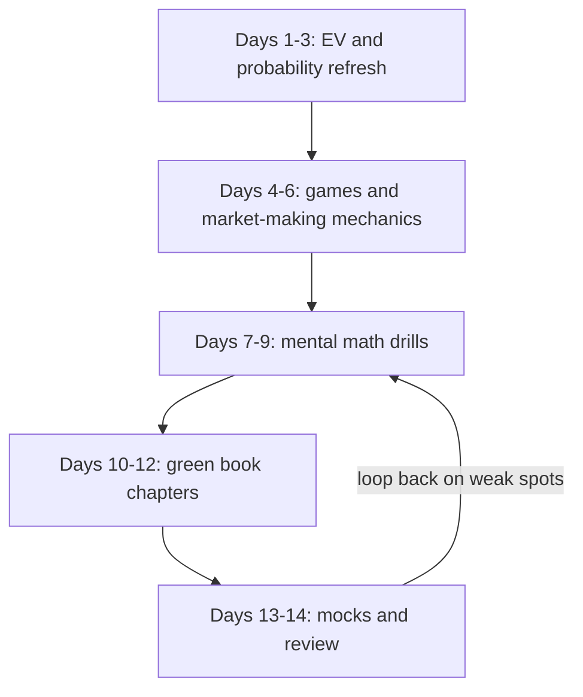
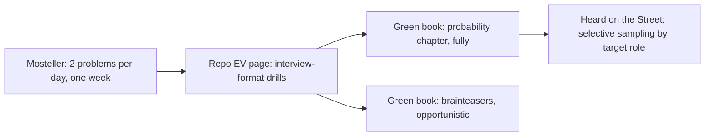

# The Quant Interview Canon: Books and How to Use Them

## Overview

Every discipline has a canon, and quantitative interviewing has three: Xinfeng Zhou's *A Practical Guide to Quantitative Finance Interviews* (the green book), Timothy Crack's *Heard on the Street*, and Frederick Mosteller's *Fifty Challenging Problems in Probability*. These three cover overlapping territory from different angles — the green book drills topics in course order, Crack runs a derivatives-heavy question bank, and Mosteller trains pure expected-value derivation in pocket-sized doses. This page maps what each book actually contains, shows where this repository replaces or extends them, and converts the combination into a two-week sprint plan and a reading order tuned for a placement student.

The canon needs interpretation, not worship. Books organize knowledge by topic; interviews organize it by time pressure and by firm, so a chapter list is a syllabus while a loop is a performance. The mapping table in the middle of this page is the bridge: it tells you which repo page operationalizes which canon topic, which canon topics are gaps the books never covered, and which chapters to skip for the role you are actually targeting. The closing sections handle the honest caveats — firms iterate fresh problems, the transferable skill is derivation under pressure, and memorization is actively punished.

Use this page as the study-plan hub for the quant-prep section. The skill pages it points to carry the drills, this page carries the sequencing and the books, and the [section README](./README.md) carries the funnel anatomy that explains why the sequence looks the way it does. If you read only one table here, read the sprint plan; if you read only one paragraph, read the reality note at the end.

A third reader matters as much as the first two: the candidate mid-preparation who owns several books already and wonders why progress feels slow. The usual cause is protocol, not material — reading solutions instead of fighting problems, drilling depth where the loop tests speed, or sampling the derivatives chapters for a loop that never asks about them. The protocols on this page exist to fix exactly that failure mode, and the sprint plan enforces them with a calendar rather than good intentions.

## The Green Book: The Default Drill Text

*A Practical Guide to Quantitative Finance Interviews* by Xinfeng Zhou is the de-facto standard for quant interview preparation, and its reputation is earned by structure rather than by luck: five chapters that walk from brainteasers through calculus, probability, and stochastic processes into elementary finance, each with worked solutions at genuine interview depth. The book assumes a strong undergraduate technical background but no finance, which is exactly the profile of a placement candidate. Its problems are the closest public approximation to what loops at market makers and funds actually ask, and several of its classics — dice games, martingale puzzles, coin-flip expected values — circulate in interviews nearly verbatim.

The chapter map below is the reading plan compressed into one table. The last column is the honest one for campus loops: trader tracks at market makers weight chapters 1 and 3 heavily, researcher tracks add chapter 2's linear algebra and chapter 4, and developer tracks mostly need chapters 1 and 3 as background while their real screen lives in the coding layer discussed below.

| Chapter | What it drills | Campus-loop relevance |
|---|---|---|
| 1. Brainteasers | Logic traps, coin and dice games, invariants, combinatorial tricks | Core for trader loops; the warm-up layer everywhere else |
| 2. Calculus and Linear Algebra | Limits, series, integration tricks, Taylor expansion, Lagrange multipliers, eigenvalues, positive-definiteness | Weighted for researcher loops; light for trader tracks |
| 3. Probability Theory | Conditional probability, Bayes, expectation and variance, covariance, distributions, combinatorics | The single most examined chapter in quant loops |
| 4. Stochastic Processes | Random walks, martingales, Markov chains, Poisson processes, optional stopping | Researcher and pricing-leaning roles; optional-stopping puzzles cross over to trader loops |
| 5. Finance | Options and put-call parity, binomial pricing, Black-Scholes, the greeks, hedging | Depth reserved for pricing-specialist roles; parity basics still appear in trader loops |

Two usage rules make the book work. First, attempt every problem before reading its solution, because the book's solutions are written for readers who already fought the problem, and reading them cold produces the illusion of competence. Second, convert each solved problem into a variant — change a parameter, flip a convention, add a constraint — and solve the variant, because that is precisely what interviewers do to book problems before asking them. A green book worked mechanically at two to three problems per sitting beats a passive read-through by a wide margin, and the failure mode of passive reading is invisible until the loop exposes it.

### What the Green Book Does Not Cover

The book's gaps are as instructive as its contents, and all of them trace to its vintage. It predates the modern onsite-game layer, so there is nothing about market-making games, estimation rounds, or betting on your own confidence; it predates the platform-based coding screen, so the OA layer simply does not exist in its world; and it was never designed for speed, so nothing in it trains sub-second arithmetic under a countdown. Firm-specific funnel knowledge — which stage runs which screen, and what each firm's games actually score — is likewise outside any book's scope by nature. None of this reduces the book's value for the layers it does cover, but a candidate who finishes it and feels ready has measured readiness against a syllabus the loops no longer use.

The repair is layering, which is what the mapping table below formalizes. The game mechanics layer goes to [market-making games](./market-making-games.md), the speed layer to [mental math speed](./mental-math-speed.md), the coding layer to the placement track, and the firm-formats layer to the [firm directory](./firm-directory.md). Working the book and its supplements as one system is the design; working the book alone produces a candidate who can derive the expected value of a martingale but quotes three seconds too slowly to reach the follow-up.

### The Calculus Chapter, Honestly

Chapter 2 is where placement candidates over-invest, because calculus is the layer they most recently studied for exams and therefore the layer that feels productive. What the chapter actually drills is a specific toolkit — limits and series, integration tricks, Taylor expansion, Lagrange multipliers, and the linear algebra of eigenvalues and positive-definite matrices — and the interview versions of these questions are fast, standardized, and few. A trader-track candidate needs perhaps a fifth of the chapter, chiefly the Taylor expansions and limit techniques that surface inside probability derivations. A researcher-track candidate needs the eigenvalue and matrix-definiteness material because it underlies the statistics screens.

The honest scheduling rule is to treat chapter 2 as a reference pass rather than a study pass: read it once to know what is there, work five to ten representative problems, and return only when a mock exposes a real gap. Time moved from chapter 2 into mental-math drills or the probability chapter repays itself at a multiple, because the loop tests those layers orders of magnitude more often. The exception is genuine researcher targeting at funds, where the linear algebra half of the chapter graduates from optional to core and deserves full problem coverage.

## Heard on the Street: The Question Bank

*Heard on the Street* by Timothy Crack occupies a different niche: it is a question bank, not a course. Recent editions carry on the order of a few hundred questions with full answers, and the distribution is heavily weighted toward derivatives — options mechanics, payoff diagrams, futures, hedging, and the binomial and Black-Scholes machinery — alongside dedicated probability and non-quantitative sections. That weighting is why its audience skews toward the investment-fund end of the market: candidates targeting hedge funds, asset management, and sales-and-trading style roles report using it as their primary drill, while market-maker loops draw on it more selectively.

The book's strength is breadth of phrasing. Because each question appears in several variants, grinding a section teaches you to recognize the same problem wearing different clothes — a skill the green book teaches less explicitly. Its weakness for placement candidates is the same breadth: without a derivatives course behind you, large parts of the book are premature, and grinding them before the probability layer is solid produces memorized payoff formulas without the reasoning that interviewers probe for. The sequenced reading order near the end of this page exists largely to prevent that failure.

Use it selectively and late. The practical protocol: after the green book's probability chapter and this repo's expected-value drills, sample Crack's probability sections as a breadth check, then touch the derivatives sections only if your target roles price options. Twenty to thirty well-chosen questions with full re-derivations beat two hundred skimmed ones, and the re-derivation habit matters more here than anywhere else, because Crack's answer discussions frequently skip the step you most need to own.

### Where Crack Beats the Green Book

Crack's structural advantage is variant breadth: the same concept reappears across dozens of differently worded questions, which trains recognition of problems wearing unfamiliar clothes — the exact skill tested when a firm mutates a classic. His derivatives coverage also runs deeper than the green book's single finance chapter, with payoff mechanics, hedging arguments, and pricing intuition developed across an entire question family rather than one worked pass. The answer discussions frequently include the follow-up an interviewer would ask next, which makes the book useful for rehearsing the second and third exchanges of a round, not just the first. For candidates targeting hedge funds, asset managers, or anything with an options desk in the loop title, these advantages are decisive.

The discipline that keeps the book safe is the same attempt-first protocol with one addition: cover the answer completely, write your attempt, and only then compare. Because the book is a bank, the temptation to read questions and answers back-to-back is stronger than in a course-style text, and that habit produces recognition without derivation — the single most punished failure mode in interviews. Log every miss in one line, re-derive it from a blank page within the week, and the bank becomes training; otherwise it becomes trivia.

## Fifty Challenging Problems in Probability: The Pocket EV Canon

Mosteller's *Fifty Challenging Problems in Probability with Solutions* is the oldest book of the three and still the best per-page training value for expected-value derivation. The book is exactly what the title says — fifty-plus problems, each a page or two, each with a complete solution — and the problems are the ancestors of half the EV questions asked in interviews today: *The Sock Drawer*, *Successive Wins*, *The Flippant Juror*, *Trials until First Success*, *Isaac Newton Helps Samuel Pepys*, and *The Three-Cornered Duel* all have live interview descendants. The statements are short enough to attempt anywhere, which makes the book the ideal companion for spacing rather than block study.

The Newton-Pepys problem shows the level of derivation the book trains, and it is worth reproducing the computation because it also teaches skepticism about intuition. Pepys asked Newton which is more likely: at least one six in six throws of a die, or at least two sixes in twelve throws. The first is

\\[ P(\\ge 1) = 1 - \\left( \\tfrac{5}{6} \\right)^{6} \\approx 0.665 \\]

and the second counts the complement explicitly:

\\[ P(\\ge 2) = 1 - \\left( \\tfrac{5}{6} \\right)^{12} - 12 \\cdot \\tfrac{1}{6} \\cdot \\left( \\tfrac{5}{6} \\right)^{11} \\approx 0.619 \\]

Intuition votes for the twelve-throw version because twelve is double six; the arithmetic says the six-throw event is more likely, because the second six has to arrive inside a shrinking complement. That gap between plausible intuition and two lines of exact counting is precisely the skill expected-value questions test, and Mosteller's collection drills it with almost no overhead — two or three problems per study day for a week covers a meaningful slice of the book and permanently upgrades the reflex.

The book's limitations are real and worth stating. It has no market-making content, no games against opponents, no speed drills, and its prose is 1960s academic — dense but not interview-shaped. It is the first book on the reading order precisely because it builds the substrate the other layers assume, not because it resembles the interview itself.

### The Problems That Became Interview Standards

Several Mosteller problems have direct living descendants in interviews, and knowing the lineage shortens the path on both ends. *The Sock Drawer* is the ancestor of every minimum-draws-to-guarantee-a-pair question and its pigeonhole cousins. *Trials until First Success* seeds the geometric-family questions — expected waiting times, with and without memory — that interviewers extend into pattern-matching variants like waiting for two heads in a row. *The Flippant Juror* is the ur-form of committee-versus-expert probability, which modern loops re-skin as ensemble-versus-single-model questions. *Isaac Newton Helps Samuel Pepys* trains the complement-counting discipline that reappears whenever a problem says "at least one", and *The Three-Cornered Duel* is the ancestor of the truel and survival-order questions that trading loops enjoy because the optimal target choice is deeply counterintuitive.

The exploitation protocol is straightforward: when a live interview question feels familiar, search for the Mosteller skeleton underneath it before computing. The skeletons — complement counting, conditioning on the first success, symmetry over orderings, and pigeonhole guarantees — carry most of the solution, and the interview-specific dressing is usually one layer deep. Saying "this is the Newton-Pepys structure with dice replaced by cards" out loud earns credit twice: once for the recognition and once because the named skeleton implies the next computational step, which you then execute.

## How This Repo Maps onto the Canon

The canon has gaps that this book fills, and the reverse. The books were written before market-making games became a standard onsite format, none of them drills mental arithmetic for speed, and none tracks the specific funnel Indian and global campus candidates walk through. The table below is the bridge: each canon topic gets its repo home, and each repo layer notes what it adds beyond the books. Working the pairs rather than either side alone is the design assumption of this whole section.

| Canon topic | Repo home | What the repo adds |
|---|---|---|
| Brainteasers (green book ch. 1) | [Puzzles & Brain Teasers](../interview/puzzles/README.md), [HRT Brainteasers](./hrt-brainteasers.md) | The five-stage solve framework and quant-firm picks beyond the product-company canon |
| Probability theory (green book ch. 3) | [Probability and Statistics](../mathematics/probability-statistics.md), [Chapter 72: Probability](../dsa/chapters/ch72-probability.md) | Theory depth plus the algorithmic, DP-flavored probability the OA layer tests |
| Expected value and betting (green book ch. 3) | [Expected Value Problems](./expected-value-problems.md) | Interview-format first-step analysis, Kelly-style sizing, and EV under iteration |
| Games and adversarial reasoning (ch. 1 subset) | [Game Theory Puzzles](./game-theory-puzzles.md), [Chapter 61](../dsa/chapters/ch61-game-theory.md) | The trading angle the books skip, plus the full algorithmic treatment |
| Mental math (gap in all three books) | [Mental Math Speed](./mental-math-speed.md) | The zap-test layer: arithmetic under seconds-per-question pressure |
| Market-making mechanics (gap in all three) | [Market-Making Games](./market-making-games.md) | Bid-ask quoting, adverse selection, and inventory as interview games |
| Firm formats and the funnel (gap in all three) | [Firm Directory](./firm-directory.md), [section README](./README.md) | Which firm runs which stage, and what each stage scores |
| Ongoing puzzle practice (partial canon) | [Jane Street Puzzles](./jane-street-puzzles.md) | A living archive with posted solutions and solver counts for calibration |

Read the table as dependency-ordered from top to bottom for trader loops: brainteasers and probability first, EV and games second, mechanics and formats last. For developer loops the middle rows shrink and the coding layer below takes their place. For researcher loops, the probability row expands to include the full statistics track, and the green book's chapters 2 and 4 move from optional to core.

### Reading the Table by Role

The trader-track reading of the table is aggressive about the top rows and skeptical of the bottom ones: brainteasers, probability, EV, and games get the bulk of the hours, mental math gets a daily non-negotiable block, and the derivatives chapters wait until a specific firm's loop demands them. The logic is exposure frequency — a trader loop can run five EV questions, two games, and a market-making round in a single onsite, and every one of those stages sits above the calculus layer in the payoff order. The artifact to track is simple: for each row, a dated list of problems solved cold, because the list exposes neglected rows before the loop does.

The developer-track reading inverts the emphasis: the coding OA layer and [the DSA track](../dsa/README.md) consume most of the sprint, the brainteaser and probability rows keep their place as warm-up insurance, and the market-making row shrinks to vocabulary — enough to hold a conversation about spreads and adverse selection if a round drifts there. The researcher-track reading pushes probability into its full statistics extension and treats games as a secondary screen. In all three cases the table's value is the same: it turns "study quant" into a row-by-row checklist where completion is observable, which is the only study plan that survives contact with a real calendar.

## The OA Layer: Coding Screens

None of the three canon books prepares the online assessment, because the OA is borrowed wholesale from big-tech hiring. Quant firm coding screens run on the same platforms and the same problem styles as product-company loops — HackerRank and Codility-style environments with timed algorithmic problems, automated scoring, and proctoring — and the problems themselves sit strictly below contest difficulty but above casual comfort: arrays, hash maps, two-pointers, basic DP, and clean implementation under a countdown. A candidate who can solve Nim in theory but fumbles a sixty-minute two-problem screen never reaches the games, which is why the coding layer is a gate rather than a garnish.

Two quant-specific additions distinguish the quant OA from its SDE cousin. The first is the mental-math section — thirty to fifty questions under per-question timing, often with negative marking — which has no product-company equivalent and is the most common place strong coders lose the shortlist. The second is probability MCQs mixed into the same sitting, compressing the funnel's first two stages into ninety to a hundred and twenty minutes. Both additions reward the drill pages of this section rather than the books, because speed is a trained reflex and the books teach depth.

Preparation strategy lives in the placement-preparation track, which covers OA platforms, mock-assessment discipline, resume screening, and the day-of logistics the canon ignores: see [Placement Preparation](../placement-preparation/README.md) for that layer and [the DSA hub](../dsa/README.md) for the topic checklist behind the coding screen. Candidates with a competitive-programming background can treat the coding layer as maintenance rather than study — the contest-driven guidance in [the CP section](../competitive-programming/README.md) covers that case — and reallocate their sprint days toward the quant-specific layers, which is the correct trade whenever the background supports it.

### The Mental-Math Section Up Close

The mental-math block of a quant OA is short, timed, and unforgiving in a very specific way: questions run from a few seconds to roughly half a minute each, they reward exactly the operations that desks actually perform (percentages, fraction-to-decimal conversions, squares and roots, quick products, and one-line expected values), and negative marking makes blind guessing worse than skipping. The section is deliberately longer than a warm-up — thirty to fifty questions in campus formats — so pacing is a scored skill, not just accuracy. Strong coders lose this section not from weakness but from never having trained arithmetic at that tempo, which is why the drill layer exists as a page of its own rather than a paragraph.

The tactical protocol fits in three sentences. Bank the automatic questions first and flag anything that fails the two-look rule — if the method is not visible in two glances, skip it and return. Guess only when you can bound the option set to two choices, because negative marking turns a three-way guess into negative expected value. Then calibrate the whole section against a timer weekly using the drills on [mental math speed](./mental-math-speed.md), because pacing that feels comfortable at a desk and pacing that survives proctoring pressure are different quantities, and only the clock can tell them apart.

## A Two-Week Sprint Plan

The sprint below assumes a placement candidate starting from a strong technical base with no quant-specific preparation, two to three focused hours per day. The sequence front-loads probability and EV because every later layer assumes them, inserts games and mechanics while the EV intuition is fresh, and ends with mocks because the loop is a performance format. The table is the plan; the diagram is the same plan with the feedback loop made explicit.

| Days | Focus | Daily core | Artifact by day's end |
|---|---|---|---|
| 1–3 | EV and probability refresh | Mosteller problems (2/day) plus [expected value drills](./expected-value-problems.md) | 15–20 EV problems solved cold and logged |
| 4–6 | Games and market-making mechanics | [Game theory puzzles](./game-theory-puzzles.md) then [market-making games](./market-making-games.md) | One home game night with real (small) stakes |
| 7–9 | Mental math drills | [Mental math speed](./mental-math-speed.md) timed sets, daily | Sub-second per-question pace on core operations |
| 10–12 | Green book chapters | Zhou chapters 1 and 3 fully; chapter 2 selected by role | Variant of each solved problem written in your own words |
| 13–14 | Mocks and review | One coding mock plus one game/EV mock per day, then patch weak cells | A written list of the three weakest drills to repeat |

The loop edge in the diagram is the plan's most important line. Mocks on days 13 and 14 exist to find the weak cell, and the correct response to finding it is to loop back to the matching drill layer rather than to read more theory. Falling behind by a day is normal; compress days 10–12 by skipping chapter 2 for trader loops rather than skipping the mocks, because mocks are the only sprint activity that rehearses the actual performance under time pressure.

Developer-track candidates run the same skeleton with one substitution and one addition: the games-and-mechanics block shrinks to a single day, and the freed days go to a coding mock block built from the OA platforms' standard formats, keeping the mental-math drills daily throughout. The substitution matters because the developer screen weights the coding layer almost exclusively, while the mental-math block still gates the shortlist in campus formats. The sprint's shape — foundation, application, speed, canon, rehearsal — survives the swap intact.

### The Shape of a Drill Day

Each sprint day has the same skeleton, and the skeleton is what makes the plan survivable alongside coursework. Open with a ten-minute mental-math warm-up regardless of the day's layer, because that block is the habit the whole plan exists to install. Spend the core forty to sixty minutes on the day's layer working problems cold — attempt before any solution, timer visible — then close with a fifteen-minute miss-log review and a one-line note on tomorrow's first problem. Total cost is the advertised two to three hours, and the closing note is what turns day thirteen into a session of familiar weak cells rather than a wall of forgotten misses.

The evening micro-block is optional but high-yield: fifteen to twenty minutes of flashcards or a single extra Mosteller problem, timed, in bed-tier conditions. Once a week — day six in the sprint — replace it entirely with the game night, because playing against humans is the one condition no solo drill reproduces. Protect one rest half-day per week; sprint plans fail by collapse more often than by difficulty, and the collapse is almost always a rest-debt that was never scheduled.

## Reading Order for a Placement Student

The order that maximizes return per hour for a placement student is: Mosteller, then the repo's EV page, then the green book's probability chapter, then *Heard on the Street* selectively. Mosteller comes first because it is short, cheap, and trains the derivation reflex with zero setup; the repo EV page comes second because it recasts the same skill in interview format with sizing and iteration questions the 1960s book never asks. The green book's probability chapter is third because it is the single most examined canon chapter, and it lands better after the reflex exists. Crack comes last and partially, because his derivatives-heavy bank is premature until the target roles demand pricing.

Each hop has a completion test, and the test prevents the illusion-of-competence failure that passive reading breeds. Finish the Mosteller hop when you can solve any two of the sock-drawer, juror, and first-success problems cold in under ten minutes each. Finish the EV hop when first-step analysis — conditioning on the first round of a process and recursing — is your default move on unfamiliar games. Finish the green-book hop when you can re-derive its solved probability problems from the statement alone a week later, and sample Crack only after you know which roles you are actually targeting, because his book is the only one of the three whose fit depends on the role.

The order also plugs directly into the sprint calendar, which is the practical reason to follow it rather than a book's own chapter order. Mosteller pairs with sprint days 1–3, the EV page with the same days' second block, games with days 4–6, mental math with the standing daily warm-up, and the green book's probability chapter with days 10–12 — so the reading order and the sprint plan are two views of one sequence, not two competing plans. Keeping them unified matters because the most common planning failure is treating books, drills, and mocks as separate tracks that each claim unlimited time; the sprint exists to force them into one budget.

### If You Have Less Than Two Weeks

A one-week compression is survivable if the cuts are principled. Drop Crack entirely, keep the Mosteller pace at two per day, run the EV page's first dozen problems, hold the daily mental-math block at twenty minutes, and work only the first sections of green book chapters 1 and 3, then spend the final day on one full mock. The games layer compresses to the anchor puzzle and one home game night. What survives every compression is what this page has argued is irreducible: the attempt-first protocol, the daily arithmetic, and at least one timed rehearsal.

The triage principle behind those cuts is exposure frequency. The campus OA punishes slow arithmetic hardest because it is the earliest gate, so the mental-math block never drops. The mock never drops because a loop is a performance, and no amount of content replaces a rehearsal. Book coverage drops first because books are the input layer, and by exam week the input layer is finished — only the trained reflexes convert to offers.

## Books Are the Canon, Firms Iterate

The uncomfortable truth about the canon is that firms know it exists. Interview writers at quant firms deliberately iterate fresh problems, rotate variants season to season, and word their questions to break the memorized answer — the same puzzle appears with a changed voting rule, a flipped convention, or a third hidden state, and the candidate who recites the book's answer is marked instantly. The puzzles section of this book makes the same point about interview folklore: interviewers are trained to spot recitation, and a structured partial derivation scores higher than an instantly-recalled punchline.

So the transferable skill the books exist to build is derivation under time pressure, not answer possession. Every study protocol on this page is shaped by that fact: attempt before reading, convert solved problems into variants, re-derive from a blank page a week later, and log the misses. A candidate who owns the derivation of forty problems outperforms one who has read four hundred, because the forty generalize and the four hundred evaporate the moment a problem's clothing changes. The books supply reps; the interview supplies novelty; the rep-to-novelty conversion happens only through the attempt-first discipline.

### How to Convert a Book Problem Into a Mock Question

The conversion protocol is mechanical, which is why it works. Take a solved problem and change exactly one thing — the voting rule, the win convention, the number of players, or the information structure — and write the mutated statement down as if you were the interviewer. Solve it cold under a ten-minute timer; if it falls fast, mutate again in the same direction until it resists, because a variant you can still solve in four minutes is not yet training. Log the mutation, your solution, and where the book's solution stopped applying, then re-derive the whole thing from a blank page three days later.

Twenty conversions teach something no book says out loud: which features of a problem are load-bearing and which are decoration. The load-bearing ones — the induction structure in the pirate game, the complement in Newton-Pepys, the indifference condition in mixing — survive every mutation, and learning to see them is precisely the skill that handles a genuinely fresh interview problem. That is the sense in which the canon is real without being sufficient: the books supply the material, the mutations supply the generalization, and the mocks supply the clock.

The final calibration is about depth matching. Books written for the wider quant market include material — full stochastic calculus, exotic-option greeks, fixed-income mathematics — that campus trader and developer loops rarely reach, and studying it at the expense of the tested layers is a real and common misallocation. Match the canon to the funnel: the funnel anatomy in the [section README](./README.md) and the firm-by-firm breakdown in the [firm directory](./firm-directory.md) tell you how deep each layer actually goes for your target list, and the sprint plan above already encodes the campus-weighted version of that answer.

### Matching Depth to Firm Type

The depth dial has three main settings, and misreading yours wastes weeks. Market makers and high-frequency shops sit at the shallow-but-fast setting: probability, EV, games, and speed carry the loop, derivatives appear only as parity-level checks, and the books' role is chapters 1 and 3 plus the repo's mechanics layer. Hedge funds and research groups sit deeper: the statistics track, green book chapter 4, and Crack's derivatives and data-flavored sections all come into play, and the interview becomes a conversation where depth is probed rather than a speed test. Proprietary shops with multi-asset books sit between the two, and the campus OA layer — speed plus probability plus coding — is the shared substrate under all three.

Two honest hedges keep this guidance from over-fitting. Formats drift by season and by desk, and the same firm can run a noticeably different loop for a different team, so verify against current interview reports rather than a single year's folklore. And depth requirements scale with degree level and role posting: a pricing-adjacent posting advertises its own canon, and the posting — plus the [firm directory](./firm-directory.md) — is the authoritative source for how far up chapter 5 you need to climb.

## Interview Questions

1. **How do you study for quant interviews without a finance background?** Start with the layers that do not need finance: probability, expected value, games, and mental math, which is exactly the Mosteller-then-repo-EV-then-green-book-chapter-3 sequence. Finance content enters only where the target role demands it — parity and binomial basics for trader loops, the stochastic-processes chapter for researcher loops — and a strong technical candidate can defer it entirely until after the core layers are solid. The honest framing for interviews is that firms hire the reasoning reflex and teach the market knowledge, so preparation should weight the reflex accordingly. A candidate who opens with options theory before they can do first-step analysis has optimized the least-tested layer.

2. **Green book or *Heard on the Street* first, and why?** The green book first, because it is a structured course whose chapters build on each other, while Crack is a question bank that assumes the course exists. Working the green book's probability and brainteaser chapters gives you the vocabulary and the standard derivations; sampling Crack afterwards becomes a breadth check and a derivatives bridge rather than a crash course. Reversing the order produces scattered familiarity without the spine, and the spine is what lets you re-derive under a rule change. For trader-track campus candidates, Crack can even be deferred past the loop entirely if the target firms are market makers rather than funds.

3. **How should I use Mosteller without wasting time?** Two problems per study day, attempted for at least ten minutes before the solution is read, with each miss logged in one line. Re-derive any problem you failed from a blank page three days later, because the re-derivation is where the skill actually forms. Convert each solved problem into one variant — change the condition, flip the win rule, double the draws — since Mosteller's own solution discussions frequently point at the variant. A week of this protocol covers roughly fifteen problems and visibly upgrades the EV reflex; a weekend of passive reading covers fifty and upgrades nothing.

4. **A book problem appears verbatim in my interview — what do I do?** Say so immediately, then offer to re-derive the solution live rather than recite it, because silently claiming credit for folklore is a documented red flag and interviewers check for it by mutating the problem. The mutation is the real test: the pirate puzzle with a strict-majority rule, or the hat puzzle with three colors, separates the candidate who owns the induction from the one who owns the punchline. Handling the disclosure gracefully also scores — it signals honesty under small pressure, which is itself a hire signal at firms that measure trust. If the interviewer offers the variant instead, treat it as a gift and run the induction from scratch.

5. **Do I need stochastic calculus for campus quant roles?** For trader and developer tracks, almost never: the tested stochastic content is random walks, martingales, and optional-stopping puzzles, all of which are green book chapter 4 territory rather than continuous-time calculus. For researcher tracks, discrete stochastic-process fluency matters more than Ito calculus, and for pricing-specialist roles the green book's chapter 5 plus Crack's derivatives sections cover the campus-level bar. The common error is studying continuous-time finance because it feels like what "quant" should mean, while the loop tests coin games and conditional expectation. Match the depth to the funnel, not to the stereotype.

6. **What does the two-week sprint cost per day, and what if I fall behind?** Budget two to three focused hours: one drill block for the day's layer and one short review of the miss log, with the game-night evening as the single long session. If you lose a day, compress days 10–12 by trimming green book chapter 2 first — trader loops barely test it — and never compress the mocks, because they are the only full-dress rehearsals in the plan. If you lose more than two days, cut Crack sampling entirely and keep the loop-back-on-weak-spots edge of the sprint diagram, which is the plan's actual engine. The sprint is a floor, not a ceiling: the same structure extends to four weeks by doubling the drill blocks without changing the order.

## Key Takeaways

- The canon is three books with three distinct jobs: Zhou drills topics in course order, Crack banks questions with a derivatives tilt for the fund end, and Mosteller trains EV derivation at pocket scale.
- The green book's five-chapter map is the campus syllabus: chapters 1 and 3 for trader loops, plus 2 and 4 for researcher loops, with chapter 5 reserved for pricing-leaning roles.
- The books predate the modern onsite layer — market-making games, zap tests, and platform-based coding screens are repo territory, not book territory, and the mapping table routes each gap to its page.
- Coding OAs at quant firms run on the same platforms and problem styles as big tech; the quant additions are mental math and probability MCQs under time pressure with negative marking.
- The two-week sprint runs EV first, games and mechanics second, speed third, canon chapters fourth, and mocks last, with the only mandatory edge looping mock discoveries back into the drills.
- Reading order for a placement student: Mosteller, repo EV drills, green book probability, then *Heard on the Street* selectively by target role — each hop gated by a re-derivation test, not by page count.
- Firms iterate fresh problems precisely because the canon is public; the transferable skill is derivation under time pressure, and every protocol on this page exists to build that rather than answer possession.

## References

- Jane Street — firm site and the monthly puzzle program, the closest living descendant of canon-style practice: https://www.janestreet.com and https://www.janestreet.com/puzzles/
- Project Euler — long-horizon math-coding practice that complements the canon's probability layer: https://projecteuler.net
- SIG — Susquehanna International Group, whose game-day format the canon predates: https://sig.com
- Optiver — speed-and-games loop layer: https://www.optiver.com
- Hudson River Trading — brainteaser-forward loop layer: https://www.hudsonrivertrading.com
- Xinfeng Zhou, *A Practical Guide to Quantitative Finance Interviews* — the green book (name-only citation)
- Timothy Crack, *Heard on the Street: Crystal Clear Concepts and Questions from Wall Street* — the question bank (name-only citation)
- Frederick Mosteller, *Fifty Challenging Problems in Probability with Solutions* — the pocket EV canon (name-only citation)
- Coding OA platforms (HackerRank, Codility) are named for identification only; this book's URL policy keeps unverified links out

## Cross-References

- [Quantitative Finance Interview Preparation](./README.md) — the section hub defining the funnel this canon serves
- [Game Theory Puzzles](./game-theory-puzzles.md) — the games layer the books under-cover, with the anchor puzzle solved in full
- [Expected Value Problems](./expected-value-problems.md) — the interview-format EV drills that operationalize Mosteller
- [Mental Math Speed](./mental-math-speed.md) — the zap-test layer absent from all three books
- [Market-Making Games](./market-making-games.md) — the onsite game mechanics the canon never had
- [HRT Brainteasers](./hrt-brainteasers.md) — brainteaser warm-up culture and worked classics
- [Jane Street Puzzles](./jane-street-puzzles.md) — living puzzle practice with posted solutions and solver counts
- [Firm Directory](./firm-directory.md) — which firms run which layers, firm by firm
- [Probability and Statistics](../mathematics/probability-statistics.md) — the theory home for green book chapters 3 and 4
- [Chapter 72: Probability](../dsa/chapters/ch72-probability.md) — the algorithmic probability the coding OA layer draws on
- [Chapter 61: Game Theory for Interviews](../dsa/chapters/ch61-game-theory.md) — the algorithmic companion to the games layer
- [Placement Preparation](../placement-preparation/README.md) — OA platforms, mocks, and the placement logistics around the canon
- [Competitive Programming](../competitive-programming/README.md) — the maintenance path for candidates who already own the coding layer
- [Index](../index.md) — the book-wide map if you arrived here from outside the quant section
