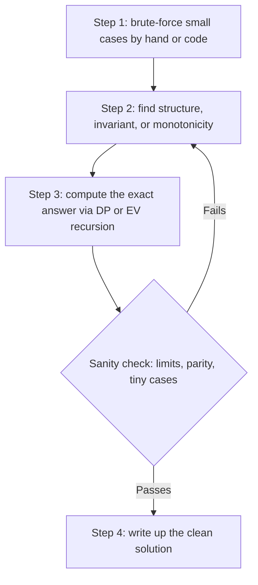
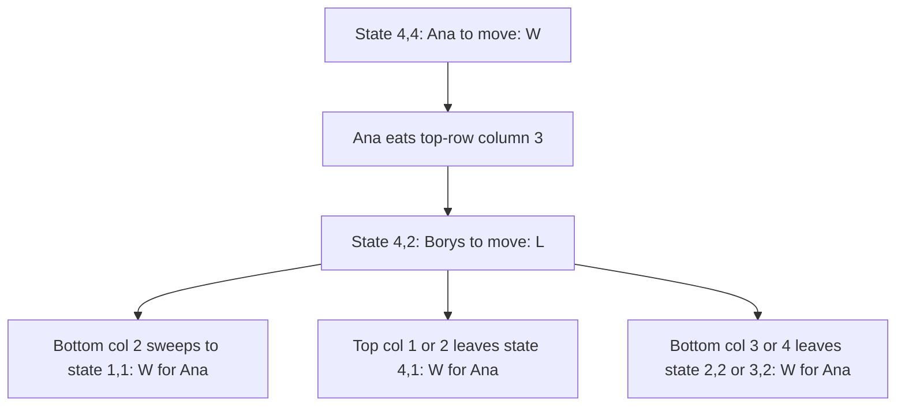

# Jane Street Puzzles

## Overview

Jane Street runs a monthly puzzle program that has become one of the most recognizable talent signals in quantitative trading: a new puzzle appears on the firm's puzzle page every month alongside a full archive of previous puzzles, and anyone — student, professional, or hobbyist — may submit an answer by email. Correct submitters are rewarded with a t-shirt and what the firm cheerfully calls eternal fame, and the firm openly frames the page as a way to meet people who enjoy the kind of thinking the trading floor runs on. This page explains how the program works, gives a four-step framework for attacking archive-style puzzles, and works two complete self-composed puzzles end to end so you can see the full pipeline: brute force, structure, exact computation, and clean write-up.

Two ground rules frame everything below. First, the two worked puzzles here are **self-composed in the style of recent archive puzzles** — they are not copied from the archive, and their answers are derived from scratch on this page, because solving archive puzzles for other people is exactly what the program is designed to detect. Second, the skills the page builds — game valuation by minimax, expected value by first-step analysis, exact arithmetic, and tidy presentation — are the same skills Jane Street's interview rounds test, which is why the puzzle page is worth real preparation time even though submitting is strictly optional.

The page is organized for practice, not just reading. The framework section gives you a repeatable pipeline; the two worked puzzles show every intermediate state and every check so nothing is hidden; the screener and interview sections tell you what the artifact is worth and how it is graded. If you only have an hour, read the framework, attempt Worked Puzzle 1 with the page covered, then diff your attempt against the full table — that diff is the highest-value hour in this track.

## The Puzzle Program and How It Works

The page at https://www.janestreet.com/puzzles/ carries the current puzzle and the archive on the same page, so the entire history is one scroll away — a deliberate design that lets new solvers binge. Puzzles post roughly monthly, answers go in by email, and the firm reports how many solvers were correct for each month, which gives you a calibration target before you start. The stated rewards are a t-shirt and eternal fame, but the real return is that a solved puzzle is a concrete, verifiable artifact you can cite on a resume or in an application note, and candidates report that interviewers at Jane Street notice it.

Difficulty varies widely month to month: some puzzles yield to careful case analysis in an evening, while others have taken the community weeks and spawned long discussion threads after the solution posts. The archive is the best free training set for this firm's interviews anywhere on the internet, precisely because each puzzle comes with a stated answer and eventually a full solution. Work the archive in order of your weakest family below, not in chronological order, and write up every solution as if a screener will read it — because one eventually will.

Mechanically, a submission is an email with your answer — typically an exact number, a strategy, or a construction — and the firm credits every correct solver it receives before the next puzzle posts. The published solver counts are useful calibration: a month with a handful of solvers tells you the community found it hard, while a month with hundreds tells you an hour of honest effort should have sufficed. Check the count before you start so your time budget matches the puzzle's difficulty, and after you finish so your sense of "hard" stays calibrated.

### Reading Archive Solutions the Right Way

The archive's posted solutions are models of technical writing, and reading them passively wastes them. Read your own attempt first — even a failed one — then read the official solution with three questions in mind: what state variables did they choose that I missed, where did they check the answer, and what did they leave out. Rewrite your submission in the official solution's voice, because the rewrite is where the presentation skills actually form. A month later, re-derive the puzzle from a blank page; if you cannot, you read it, but you did not learn it.

### The Four Puzzle Families

Most archive puzzles fall into four recurring families, and each family has a characteristic toolkit. Knowing the family within the first ten minutes is itself a scored skill in interviews, because it tells you which machinery to reach for before you have wasted an hour modeling the wrong way.

| Family | What it asks | Core tools | Typical shape of the answer |
|---|---|---|---|
| Combinatorial games | Who wins a two-player game, and from which positions | Minimax with memoization, invariants, symmetry | A player plus a strategy, or a complete table of positions |
| Expected-value optimization | Maximize or minimize an expectation over decisions | First-step analysis, state recursions, DP over states | An exact rational or closed form plus the optimal policy |
| Grid and logic deduction | Satisfy constraints on a grid or graph | Constraint propagation, parity, coloring arguments | A construction plus a proof of uniqueness or nonexistence |
| Optimization | Find a maximum, minimum, or exact count | Search, DP, integer reasoning, bounds | An exact number with an optimality argument |

The boundaries overlap — many puzzles are a game whose value is an expectation, or an optimization hiding a parity invariant — but the table is the right first sorting hat. If a puzzle resists every family, the usual cause is a missing state variable, which the framework below treats as step 1's failure signal rather than a reason to brute harder.

## A Four-Step Attack Framework



The framework is the puzzle canon's five-stage loop from the interview-puzzles section compressed for a setting where the answer must be *exactly* right — a screener checks the number, not the vibe. Each step has a failure mode, and the loop back from the sanity check to structure finding is where most hours go. The subsections below say what to actually do at each step.

### Step 1 — Brute-Force the Small Cases

Before any theory, enumerate or simulate the smallest instances completely: the game on a 2-by-n board instead of n-by-n, the dice game with two rolls instead of many, the grid of size 3 instead of 30. Small cases do three jobs at once — they produce concrete numbers to check theory against, they reveal the state variables you actually need, and they tell you how the answer grows when you scale the parameter. Write the brute force as code whenever the state space of the small case is finite and enumerable; a twenty-line memoized search that prints a table is worth more than an hour of staring.

The discipline is to fully trust the small case and never the intuition. If your structural conjecture for step 2 disagrees with the brute force at n = 4, the conjecture is wrong, no matter how clean it looked — this check has saved every serious solver weeks at least once. Keep the brute-force script; you will rerun it after step 3 as the sanity check.

Small cases also generate the data that pattern-finding feeds on. Print the win/loss vector, the EV sequence, or the count for the first few parameter values and stare at it: differences, ratios, parity classes, and repeated blocks are all visible in a table that no amount of staring at the original problem statement will reveal. When the pattern refuses to appear, extend the table by one more value rather than switching strategy — the marginal value of one more data point is highest exactly when the pattern is nearly visible.

### Step 2 — Find Structure, Invariants, or Monotonicity

Raw enumeration dies combinatorially as the parameter grows, so the step-2 job is to shrink the state space before computing. Look for the standard shrinkers in order: symmetry (positions that are the same under rotation, reflection, or relabeling), invariants (a quantity no move can change — parity, a sum mod k, a coloring), monotonicity (the answer only moves one way as a parameter grows, so you can binary search or bound it), and state normalization (relabel states so each equivalence class appears once, as with sorted hands or canonical board forms). One good normalization routinely turns a 10^9-state search into a 10^5-state one.

This is also the step where you decide the *currency* of the answer: win/loss, expected value, or count. Games usually reduce to win/loss with a strategy; optimization puzzles want the exact expectation and the argmax policy; counting puzzles want an exact integer, which pushes you toward DP over combinatorial structure rather than simulation. Declaring the currency out loud, in an interview or in your write-up, is half the modeling work.

A second pass over the state definitions often pays for itself here. Ask of every state variable: does the future actually depend on it, or only on some function of it? Replacing a configuration with a canonical form, a sorted tuple, or a deficit collapses symmetric copies into one state and is routinely the difference between a search that dies at n = 10 and one that finishes at n = 1000. In the chocolate-bar puzzle below, this step is what turns "positions on a 2×4 grid" into the pair \\( (b, t) \\) and shrinks the space to 15 states.

### Step 3 — Compute the Exact Answer

With a normalized state space, the computation is usually a recursion: Bellman-style DP for optimization, minimax for games, first-step analysis for expectations. The signature of a correct model is that the recursion closes — every state's value is defined in terms of strictly smaller or strictly earlier states, with base cases that are obviously true. Compute exactly (fractions or exact integers), not with floating point, because archive screeners compare exact answers and floating-point noise near a threshold is a classic way to be confidently wrong.

Implementation habits matter as much as the recursion itself. Memoize aggressively — a dictionary keyed by the normalized state is enough — and let the recursion depth tell you whether your state ordering is right, since a model that recurses into states it cannot order will deadlock in a way that is itself diagnostic. Print intermediate tables while debugging rather than trusting a single final number, because a wrong base case hides silently inside an otherwise correct recursion. The exact-arithmetic tools for this step are in the section below.

### Step 4 — Sanity-Check and Write Up

Check limits first: does the answer approach the obvious asymptote as the parameter grows, does it match your step-1 table at small size, does it have the parity or monotonicity step 2 predicted. Then write the solution as if the reader is smart but busy — state the model, the recursion, the answer as an exact number, and the check that closes the loop. Archive submissions that win t-shirts are clean write-ups of correct models, not essays; interviewers read the same way.

## Worked Puzzle 1: A Take-Away Game on a Chocolate Bar

**Statement (self-composed, in the style of recent archive game puzzles — not an archive puzzle).** A chocolate bar is a 2-row, 4-column grid of squares; the bottom-left square is poisoned. Ana and Borys take turns, Ana first. A move chooses any remaining square and eats it together with every remaining square weakly to its right in the same row and every remaining square below it in those same columns — formally, choosing row \\( r \\), column \\( c \\) eats all remaining squares \\( (r', c') \\) with \\( r' \\ge r \\) and \\( c' \\ge c \\). Whoever eats the poisoned square loses immediately. Which player wins with best play, and what is the winning first move?

This is the classic Chomp mechanism on a tiny board, chosen because the full state space is small enough to table completely and the reasoning scales honestly to bigger boards. The poisoned square sits at the bottom-left of the bottom row, so the bottom row always contains it while any bottom squares remain. A bottom-row move therefore sweeps top-row squares in the same columns, which is the whole interaction between the rows.

### State Normalization and the Brute Force

Because a bottom-row move at column \\( c \\) eats top squares at columns \\( \\ge c \\), the top row can never be longer than the bottom row; every reachable position is a pair \\( (b, t) \\) with \\( 0 \\le t \\le b \\le 4 \\) and \\( b \\ge 1 \\) (the game ends the moment the poison is eaten). That is 15 states for the whole board — small enough to compute by hand and verify by code. The losing state \\( (1, 0) \\) is the bar reduced to just the poison: the player to move must eat it and loses.

```python
from functools import lru_cache

def verdict(b, t):
    # b: bottom-row squares remaining, t: top-row squares remaining, 0 <= t <= b
    @lru_cache(maxsize=None)
    def go(b, t):
        moves = []
        for c in range(2, b + 1):        # bottom-row move at column c (column 1 is poison)
            moves.append((c - 1, min(t, c - 1)))
        for c in range(1, t + 1):        # top-row move at column c
            moves.append((b, c - 1))
        return not all(go(nb, nt) for nb, nt in moves)
    return go(b, t)

losing = [(b, t) for b in range(1, 5) for t in range(b + 1) if not verdict(b, t)]
print(losing)        # [(1, 0), (2, 1), (3, 0), (4, 2)]
print(verdict(4, 4)) # True -> Ana wins
```

The brute force agrees with the hand table below and prints exactly four losing states, which is the pattern step 2 should now explain.

### The Full Minimax Table

A state \\( (b, t) \\) is **W** (win for the player to move) if some move leads to an **L** state, and **L** otherwise; the recursion bottoms out at \\( (1, 0) = \\text{L} \\). Here is the complete table of all 15 states, with \\( t \\le b \\):

| \\( b \\) \\ \\( t \\) | 0 | 1 | 2 | 3 | 4 |
|---|---|---|---|---|---|
| 1 | **L** | W | — | — | — |
| 2 | W | **L** | W | — | — |
| 3 | **L** | W | W | W | — |
| 4 | W | W | **L** | W | W |

The initial full bar is \\( (4, 4) \\), which is a **W** state: Ana wins. Her winning move is to eat the **top-row square in column 3**, leaving \\( (4, 2) \\), an L state for Borys no matter how he moves. Each of Borys's replies from \\( (4, 2) \\) lands in a W state, from which Ana can always restore an L state — the strategy is "always move to an L state," which is the definition of minimax play here.



Spot-check the three nontrivial L states to see the definition do its work. From \\( (2, 1) \\) the moves are bottom column 2 leading to \\( (1, 1) \\) and top column 1 leading to \\( (2, 0) \\), both W; from \\( (3, 0) \\) every bottom move leaves \\( (2, 0) \\), again W; from \\( (4, 2) \\) the moves land in \\( (1, 1) \\), \\( (2, 2) \\), \\( (3, 2) \\), or \\( (4, 1) \\), all W. Every move from an L state hits a W state, which is exactly why they are losing against a correct opponent.

### Uniqueness of the Winning First Move

The winning first move is unique, and proving that is a nice mini-exercise in the same table. From \\( (4, 4) \\) the reachable states are: top-row moves leave \\( (4, 3) \\) (columns 1 or 4), \\( (4, 2) \\) (column 3), or \\( (4, 1) \\) (column 2); bottom-row moves sweep both rows and leave \\( (1, 1) \\), \\( (2, 2) \\), or \\( (3, 3) \\). Exactly one of those six states — \\( (4, 2) \\) — is an L state, so eating the top-row square in column 3 is the *only* winning opening. Interviewers love this follow-up because it converts "find a winning move" into "prove you found all of them," which is the optimality habit the puzzle section preaches.

### Complexity and Scaling

The state count for a 2-by-\\( n \\) bar is \\( \\sum_{b=1}^{n} (b+1) = \\Theta(n^2) \\), so the memoized minimax handles \\( n = 10^3 \\) instantly and \\( n = 10^4 \\) comfortably in any language. Work per state is \\( O(b + t) \\) if you recompute the move list, or \\( O(1) \\) amortized with the two loop bounds cached, so total work is \\( \\Theta(n^3) \\) naive or \\( \\Theta(n^2) \\) tuned — details worth stating in an interview because they show you cost models, not just answers. The same scaling analysis on the 3-row version gives \\( \\Theta(n^3) \\) states, which is still tractable; it is the general \\( m \\times n \\) rectangle whose *constructive* solution resists, not the computation.

### What Generalizes and What Does Not

For a 2-by-\\( n \\) bar the same normalization gives \\( O(n^2) \\) states, so the memoized minimax solves \\( n = 1000 \\) instantly — the shape of the solution never changes with scale, only the table size. The L-state pattern here, \\( (1,0), (2,1), (3,0), (4,2) \\), is the beginning of a known sequence for 2-row Chomp, and discovering the pattern from the brute force is exactly the step-1-to-step-2 pipeline the framework teaches. The genuinely hard generalization is rectangular \\( m \\times n \\) Chomp for general \\( m \\): it is known that the first player wins whenever both dimensions exceed 1, by a non-constructive strategy-stealing argument, but explicit winning moves are known only for special families such as two or three rows. Saying that out loud in an interview — "the existence proof is easy, the constructive answer is an open problem in general" — is a strong display of calibrated knowledge.

## Worked Puzzle 2: A Dice-Stopping Game

**Statement (self-composed, in the style of recent archive EV puzzles — not an archive puzzle).** You may roll a fair six-sided die up to three times. After each roll you may either bank the face value as your payout and stop, or roll again; you can never return to a banked roll. If you ever roll a 1, the game ends immediately and pays 0. What is the maximum expected payout, and what is the optimal stopping policy?

The game is small enough to solve exactly by first-step analysis, and it exercises the two habits EV puzzles demand: define the state as "rolls remaining" and write the value of a decision as a maximum. Every state is shown below; nothing is hidden in "similarly."

### First-Step Analysis, All States

Let \\( V_n \\) be the maximum expected payout with \\( n \\) rolls remaining, before rolling. After rolling \\( k \\), you compare banking \\( k \\) against continuing with \\( V_{n-1} \\); rolling a 1 is an absorbing loss. The recursion is:

\\[ V_n = \\frac{1}{6} \\left( 0 + \\sum_{k=2}^{6} \\max(k,\\, V_{n-1}) \\right), \\qquad V_0 = 0 \\]

Now unroll it state by state. With one roll remaining there is no decision — the last roll pays its face, or 0 on a 1:

\\[ V_1 = \\frac{0 + 2 + 3 + 4 + 5 + 6}{6} = \\frac{10}{3} \\approx 3.333 \\]

With two rolls remaining you bank \\( k \\) exactly when \\( k > V_1 = 10/3 \\), so the bank set is \\( \\{4, 5, 6\\} \\) and rolls of 2 or 3 are rerolled:

\\[ V_2 = \\frac{1}{6} \\left( \\tfrac{10}{3} + \\tfrac{10}{3} + 4 + 5 + 6 \\right) = \\frac{65}{18} \\approx 3.611 \\]

With three rolls remaining you compare against \\( V_2 = 65/18 \\approx 3.611 \\), and since \\( 3 < 65/18 < 4 \\) the bank set is still \\( \\{4, 5, 6\\} \\):

\\[ V_3 = \\frac{1}{6} \\left( \\tfrac{65}{18} + \\tfrac{65}{18} + 4 + 5 + 6 \\right) = \\frac{100}{27} \\approx 3.704 \\]

| Rolls remaining \\( n \\) | Value \\( V_n \\) | Optimal policy after a roll of \\( k \\) |
|---|---|---|
| 0 | 0 | — (no rolls left) |
| 1 | \\( 10/3 \\approx 3.333 \\) | No decision: the last roll pays \\( k \\), or 0 if \\( k = 1 \\) |
| 2 | \\( 65/18 \\approx 3.611 \\) | Bank \\( k \\ge 4 \\); reroll \\( k = 2, 3 \\) |
| 3 | \\( 100/27 \\approx 3.704 \\) | Bank \\( k \\ge 4 \\); reroll \\( k = 2, 3 \\) |

The exact answer to the puzzle is \\( V_3 = 100/27 \\approx 3.70 \\), with the policy "reroll 2s and 3s, bank 4 or more." Note how the comparison is always against the *continuation value*, not against the previous threshold — a roll of 3 is rerolled at both decision points because both \\( V_1 \\) and \\( V_2 \\) exceed 3, while a roll of 4 is banked because both continuation values sit below 4.

### Verification, Limits, and Variants

The sanity checks all pass. \\( V_n \\) is increasing in \\( n \\) because \\( \\max(k, V_{n-1}) \\ge V_{n-1} \\), and it is bounded above by 6, so the sequence must converge — and it converges toward 6, since with many rolls you simply keep rerolling until a 6 or a 1 appears, and a 6 arrives before a 1 with probability \\( 5/6 \\). The step-1 brute force confirms every number: a two-line simulation of the policy "reroll below 4" over a million trials lands within a few thousandths of \\( 100/27 \\), and a full expectimax over the exact state space reproduces the fractions. The natural follow-up variants — four rolls instead of three, a payout of \\( k^2 \\), or a 1 that merely zeroes the *current* roll instead of ending the game — all fall to the same recursion with the max re-derived, which is the point of having learned the method rather than the answer.

### Threshold Drift at Larger Horizons

Extending the horizon by one more state shows the threshold machinery in motion. With \\( V_3 = 100/27 \\approx 3.704 \\) the bank set is still \\( \\{4, 5, 6\\} \\), giving \\( V_4 = \\frac{1}{6}\\left(\\tfrac{100}{27} + \\tfrac{100}{27} + 4 + 5 + 6\\right) = \\tfrac{605}{162} \\approx 3.735 \\) — still below 4, so the policy is unchanged. But the drift is monotone: as \\( n \\) grows the continuation value keeps rising, so at some horizon \\( V_{n-1} \\) crosses 4 and rerolling a 4 becomes correct, then crosses 5 and only 6 gets banked. In the limit the optimal policy degenerates to "wait for a 6," and \\( V_n \\to 6 \\), consistent with the convergence argument above. A puzzle that asked for the smallest horizon at which rerolling 4 becomes optimal would need exactly this recurrence pushed further — same model, longer table, sharper question.

## Computing Exactly: Tools and Habits

Exact arithmetic is a habit before it is a toolset, and the habit has three parts. First, represent values as fractions or integers end to end — Python's `fractions.Fraction` is slow but bulletproof at archive scales, and every state table in this page's two puzzles fits in milliseconds. Second, keep thresholds symbolic as long as possible: compare \\( k > V_{n-1} \\) exactly rather than comparing rounded decimals, because policy flips live exactly at the boundary. Third, cross-validate with a simulation whose only job is to confirm the exact number to a few decimal places — simulation finds modeling bugs that algebra quietly perpetuates.

```python
from fractions import Fraction

def V(rolls_left):
    if rolls_left == 0:
        return Fraction(0)
    prev = V(rolls_left - 1)
    total = sum(max(Fraction(k), prev) for k in range(2, 7))  # k = 1 busts: contributes 0
    return total / 6

for n in range(1, 4):
    print(n, V(n))   # 1 10/3   2 65/18   3 100/27
```

The snippet is the whole dice game in nine lines, and its structure — base case, exact continuation value, max over decisions — is the template for every EV puzzle in the archive family. Rewrite it for the \\( k^2 \\) payout variant or the "1 zeroes the roll" variant and confirm the answers change only where the model says they should; that editing drill teaches the model better than any amount of re-reading. In interviews the same code pattern runs on a whiteboard, which is why practicing it by hand once or twice pays.

## Common Submission Pitfalls

Most rejected submissions fail in one of five ways, and each has a cheap defense. Wrong model: skipping the absorbing state — the dice game's 1, the chocolate bar's poison square — and computing an expectation over a game that was never actually being played. Floating point: rounding a continuation value that sits near a threshold and reporting an exact-looking answer that is provably off. Policy without value: describing when to stop without deriving the maximal expected payout the policy achieves, which is half the answer missing. Essay-length write-ups: burying a correct model under three pages of chronology when four paragraphs would do. Honesty failures: building on community discussion before finalizing your own attempt — screeners read the same forums you do, and the program's value to you collapses the moment your submission is not yours.

The defense is procedural, not clever. Before emailing, re-read the puzzle statement and check every clause against your model — archive puzzles are famously precise, and a single word ("distinct," "simultaneously," "at least") rewires the state space. Run your step-1 brute force against your step-3 exact answer at the smallest parameter where both exist. Read your write-up once as an adversary looking for the unsupported claim, then submit.

## What the Screeners Look For

A puzzle submission is graded on three things, and the archive solutions make the weighting obvious. **Correct modeling** comes first: the submission must define the state space and the objective exactly, because an exact number from a wrong model is the worst outcome, not the best. **Exact numbers** come second — screeners publish how many solvers were right, and answers are compared exactly, so fractions beat floats and a stated tolerance is not an invitation to round. **Clean presentation** comes third: a short model statement, the recursion or construction, the final number, and one line of verification is the whole shape of a winning write-up.

Puzzles are strictly optional for employment — plenty of Jane Street traders never submitted one — but they function as a strong, verifiable application signal, particularly for students whose schools the firm does not normally visit. A solved archive puzzle on a resume is a conversation starter in exactly the rounds that matter, and candidates report that interviewers sometimes ask you to walk through your submission and then twist it one step. Submit honestly (no reading community answers before your own attempt is final), cite the month and puzzle name, and be ready to re-derive — the reward is credibility, and credibility survives re-derivation only.

## From Puzzle Skills to Interview Rounds

The mapping from puzzle families to interview rounds is direct. The combinatorial-games family *is* the games round: interviewers play you at small impartial games and watch whether you can compute a position's value by minimax on the fly, exactly as Worked Puzzle 1 does. The EV family *is* the estimation and decision round: "would you take this bet," "when do you stop," and the market-making follow-ups are all first-step analysis with a trader's clock on it, and the discipline of comparing a value against a continuation value reappears literally in pricing decisions. The grid and optimization families feed the brainteaser openers and the mental-math screens, where exact arithmetic under time pressure is the artifact being measured.

Concretely, a preparation week looks like this: solve two archive puzzles from your weakest family with the four-step framework and full write-ups, drill mental math daily, and play three market-making or game rounds out loud with a friend. The framework on this page and the interview-puzzles section's five-stage loop are the same discipline at two resolutions, so practice transfers in both directions. By the time an interviewer says "let's play a game," the minimax table should feel like muscle memory rather than improvisation.

### A One-Week Rotation

- **Days 1–2** — one combinatorial-game puzzle end to end: brute force, table, write-up; then play the game against a friend and win with your own strategy.
- **Day 3** — one EV puzzle with the exact-fraction pipeline and a simulation cross-check; explain the threshold out loud.
- **Day 4** — one grid or logic puzzle; practice stating the constraint propagation as a sequence of forced deductions.
- **Day 5** — one optimization puzzle; emphasize the optimality argument, not just the construction.
- **Day 6** — timed mental math plus a market-making round out loud; connect each quote to a continuation value.
- **Day 7** — blank-page re-derivation of the week's two best puzzles; anything you cannot re-derive goes back in the queue.

## Interview Questions

1. **How would you approach a puzzle you cannot brute force at any size?** Start by shrinking to the largest case you *can* enumerate and look at the answer's shape — growth rate, parity, monotonicity — because structure you can see at n = 6 usually survives to n = 6 million. Then look for the standard shrinkers: symmetry to merge equivalent states, invariants that partition the space, and normalization to canonical forms. If the state space is still exponential, reformulate the state itself — track a deficit or a difference rather than a configuration — which is the single most common unlock in archive puzzles. Finally, state clearly in the write-up which claims are proven and which are computed, because honest labeling is part of the graded presentation.
2. **Why insist on exact fractions instead of floating point?** Archive screeners compare answers exactly, and decision thresholds amplify floating-point noise: if the optimal policy flips when a continuation value crosses an integer, a rounding error flips the policy and the final number with it. Exact rational arithmetic in Python or a symbolic tool costs nothing at these state counts. In interviews the same habit signals a trading mindset — a price that is right to six decimals but wrong at the boundary is still wrong.
3. **In the chocolate-bar game, how did you know the state was just \\( (b, t) \\)?** The move rule sweeps whole column-tails, so a bottom-row move at column \\( c \\) removes every top square at columns \\( \\ge c \\); consequently the top row can never exceed the bottom row, and the pair \\( (b, t) \\) with \\( t \\le b \\) captures everything the future moves depend on. The poisoned square is deterministic — the bottom-left of whatever remains — so it is a property of \\( (b, t) \\), not a separate state variable. That normalization cut the state space from subsets of 8 squares to 15 pairs, which made the full table feasible by hand. Finding the *minimal* sufficient state is usually worth more than any amount of clever search.
4. **What does the dice game teach that applies to market making?** Every decision compares an immediate certain value against a continuation value, which is exactly the quoting decision: the certain spread you capture now versus the expected value of staying in the quote under adverse selection. The game also shows that thresholds come from continuation values, not from round numbers — you bank 4 not because 4 is nice but because both continuation values sit below 4. And the absorbing 1 models ruin: one bad fill can end the game, so the policy prices the tail, not just the mean. Same structure, different assets.
5. **A puzzle submission is optional — why spend time on it?** Because it is one of the few verifiable, honest signals a student can generate: a dated, named puzzle with a correct exact answer and a clean write-up, checked by the firm itself. It converts directly into interview conversation, and the re-derivation twist interviewers add is the same four-step framework under pressure. The archive is also the highest-density training set for this firm's specific interview style that exists anywhere. Optional, but asymmetrically valuable for the effort.
6. **How do you practice without burning out on the archive?** Rotate families rather than grinding one type: a game, an EV puzzle, a grid, an optimization, then repeat, because the four toolkits interfere constructively. Timebox the first attempt, write it up fully even when the answer is wrong, and only then read the posted solution to diff your model against the official one. Re-solve the same puzzle from a blank page a week later — spaced re-derivation is what survives interview pressure. Two or three puzzles a week for a month beats twenty puzzles skimmed in a weekend.

## Key Takeaways

- The puzzle page posts roughly monthly, keeps the full archive on the same page, and rewards correct submitters with a t-shirt and eternal fame; submissions are optional but a strong, verifiable application signal.
- Four families cover the archive — combinatorial games, EV optimization, grid/logic deduction, and optimization — and identifying the family early selects the toolkit.
- The four-step framework: brute-force small cases, find structure (symmetry, invariants, monotonicity, normalization), compute exactly via DP or first-step analysis, then sanity-check limits and write up cleanly.
- Exact arithmetic is non-negotiable: screeners compare exact answers, and thresholds turn floating-point noise into wrong policies.
- Worked Puzzle 1 (self-composed Chomp-style game): Ana wins the 2×4 bar by eating the top-row column-3 square, moving to state (4, 2); the four L states are (1, 0), (2, 1), (3, 0), (4, 2).
- Worked Puzzle 2 (self-composed dice-stopping game): \\( V_1 = 10/3 \\), \\( V_2 = 65/18 \\), \\( V_3 = 100/27 \\approx 3.70 \\), with the policy "reroll 2s and 3s, bank 4 or more."
- General rectangular Chomp has a strategy-stealing existence proof but no general explicit winning move — knowing which parts of a problem are open is itself interview material.
- Screeners grade modeling first, exact numbers second, presentation third; a clean four-paragraph write-up beats a long essay, and the games family maps to Jane Street's games rounds while the EV family maps to estimation and quoting decisions.

## References

- [Jane Street Puzzles](https://www.janestreet.com/puzzles/) — the current monthly puzzle, the full archive, and the solver counts; submissions by email.
- [Jane Street](https://www.janestreet.com) — firm overview and student programs for context on how puzzle culture connects to hiring.
- Frederick Mosteller, *Fifty Challenging Problems in Probability* — the classic sourcebook for first-step-analysis EV puzzles in the family of Worked Puzzle 2.
- Xinfeng Zhou, *A Practical Guide to Quantitative Finance Interviews* (the green book) — game-value and EV problems with the same exact-arithmetic discipline.
- Timothy Crack, *Heard on the Street* — stopping and decision problems with worked derivations.

## Cross-References

- [The Quant Firm Directory](./firm-directory.md) — where Jane Street sits in the firm taxonomy and what its interview rounds are reported to contain.
- [Market Making Games](./market-making-games.md) — the games-round practice this page's minimax skills feed into.
- [Expected Value Problems](./expected-value-problems.md) — the full first-step-analysis toolkit behind Worked Puzzle 2.
- [Mental Math Speed](./mental-math-speed.md) — the timed-arithmetic plan that pairs with weekly puzzle solving.
- [Game Theory Puzzles](./game-theory-puzzles.md) — more game-value machinery for the combinatorial-games family.
- [Puzzles & Brain Teasers](../interview/puzzles/README.md) — the general five-stage puzzle framework this page's four-step version compresses.
- [Probability & Statistics](../mathematics/probability-statistics.md) — the conditional-probability and expectation foundations the recursions rest on.
