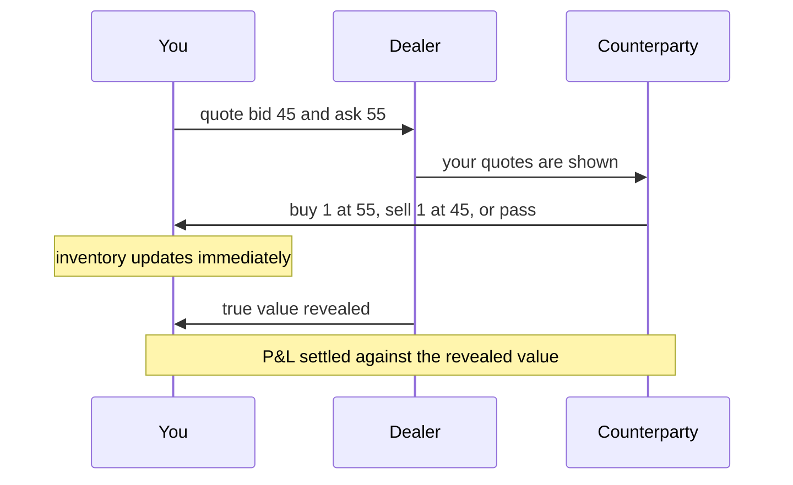
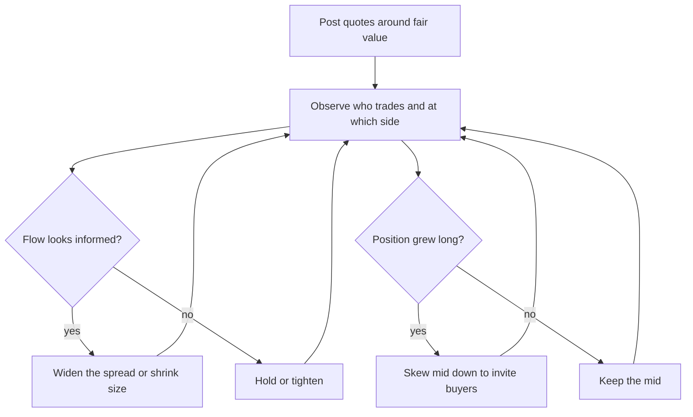

# Market Making Games

## Overview

Market-making games are the signature live format of trading interviews at market makers and prop firms: instead of answering a probability question, you *are* the probability question — you quote two-sided prices on an uncertain outcome, counterparties trade against you, the truth is revealed, and your P&L is settled. The format compresses the entire job of a market maker into rounds of thirty seconds: set quotes from a prior, update beliefs from who trades against you, manage the inventory those trades create, and avoid being picked off by counterparties who know more than you do. Firms run it because it is nearly impossible to fake — a memorized puzzle answer looks identical to understanding, but a quoted market exposes within three rounds whether a candidate updates beliefs, respects inventory, and senses adverse selection.

This page builds the game from first principles. It defines what a market maker does, walks through the canonical round-by-round interview game, and then derives a complete worked example — true value uniform on \\([0,100]\\), quotes 45/55 — under two flow models: noise flow, where you earn $5 per round, and fully informed flow, where you lose $20.25 per round despite identical quotes. The gap between those two numbers is the entire lesson of market microstructure in miniature, and it is exactly the gap interviewers listen for when you narrate your quoting decisions.

The page pairs with the expected-value toolkit of [expected value problems](./expected-value-problems.md) — every quote below is an expectation statement — and with the firm pages that describe where the games appear in real loops. All firm-specific formats in the variations section are named only and hedged as commonly reported, since firms do not publish their game rules and details vary by desk and year.

## What a Market Maker Actually Does

### The Quote, the Spread, and the Two Risks

A market maker stands ready to trade both sides of an uncertain asset: the **bid** is the price at which you will buy, the **ask** is the price at which you will sell, and the **spread** between them is your compensation for providing that immediacy. You profit because you quote around **fair value** — your current best estimate of what the thing is worth — so on average the stuff you buy comes in below true value and the stuff you sell goes out above it. The classic one-liner, which interviewers enjoy hearing: *buy low, sell high, and apologize to whoever transacted at the far end of your spread*.

The spread exists to pay for two risks, and naming them precisely is the first credibility signal in a game round. **Inventory risk**: a fill leaves you holding a position whose value can move against you before you unload it, so you demand edge per trade large enough to survive the holding period. **Adverse selection**: the counterparties who most want to trade against your quote are disproportionately the ones who know the value is on the other side of it, so every fill is bad news about fair value on average. A quote that is too wide earns no flow and generates no information; a quote that is too narrow gets harvested. Market making is the management of that trade-off, continuously, under incoming information.

In interviews this vocabulary does real work. When a tester says "make me a market on the number of Fridays in a leap month," you respond with "bid 1, ask 2, size 5" and a reason; when they trade you, they are handing you information, and the next market should show it. Candidates who treat the quote as a fixed number rather than a living probability statement fail the format no matter how good their arithmetic is.

### Vocabulary You Will Hear

The terms below recur in every game round and every desk conversation, and using them correctly marks you as prepared rather than touristic. Each is a probability statement wearing trading clothes, which is why the same candidate who drills conditional expectation in the [probability and statistics](../mathematics/probability-statistics.md) track can read this table in one pass.

| Term | Meaning in the game |
|---|---|
| Bid / ask | Your buy price / your sell price for one unit |
| Mid | The midpoint of your quotes; where your fair value estimate lives |
| Spread | Ask minus bid; your compensation for risk taken per fill |
| Fair value | Your current expected value of the asset given everything observed |
| Fill / leaf | A counterparty transacting at your bid (you buy) or your ask (you sell) |
| Inventory | Net position accumulated from fills; long if you bought more than you sold |
| Skew | Shifting both quotes up or down to steer flow against your inventory |
| Mark-out | Comparing later true values against where you quoted, to score your quotes |
| Adverse selection | Fills that systematically arrive when your quote is wrong |
| Size | How many units you quote at each price; can vary by side and by price |

Two of these deserve extra emphasis because they are what the game actually scores. The **mark-out** is the honest report card of a market maker: it ignores what you claimed to believe and checks whether the values revealed after your quotes were, on average, on the profitable side of them. And **skew** is the visible half of inventory management — the invisible half is simply refusing to keep quoting the same market after your position has grown, which is the mistake that ends most candidate rounds early.

### Where the Edge Comes From

A fair question the dealer may ask directly: why does the other side ever trade with you at all? The game's honest answer is that counterparties pay for immediacy or trade for reasons orthogonal to value — they need to hedge, they have a deadline, they are noise — and your edge per fill is the half-spread they pay for that service. In the purest form of the interview game this is exactly the noise-flow model of the worked example below: uncorrelated trades that pay the spread. Every real-world complication — informed flow, competing quotes, inventory limits — modifies this baseline, which is why the baseline deserves to be derived rather than gestured at.

The second edge source is information, and it cuts both ways. You profit from knowing the distribution better than the flow (you know the die is fair; they don't track the rolls), and you lose to anyone who knows the *draw* better than you. The game is therefore an exercise in knowing which of the two information gaps you occupy at every moment: if you cannot say what your counterparty might know that you do not, you cannot price the risk they will use it. Candidates who articulate this — "I'm wider here because a fill would tell me more than it tells them" — are demonstrating the instinct that separates quoting from guessing.

## The Canonical Interview Game

### Round Flow

Every firm's flavor differs in surface details, but the loop the game runs is remarkably stable and worth knowing in advance so no round is spent decoding the rules. A dealer owns an undisclosed true value (a die roll, a drawn card, a hidden number); each round you post a two-sided market; counterparties — the dealer, other candidates, or scripted actors — choose to hit your bid, lift your ask, or pass; and the true value is eventually revealed so that every fill can be settled at the truth. The sequence below is the round as it plays out:



Two structural facts hide in that diagram and should shape how you play. First, the counterparty's decision *is* information: a lift of your ask is evidence the value is more likely high, and a hit of your bid is evidence it is more likely low, so your next market should move with the flow even before anything is revealed. Second, settlement at revealed value means trades have no escape hatch — whatever you quoted, you own — which is why the game punishes quotes made for appearance rather than from a genuine probability distribution.

### Size Conventions and How to Respond

Quoting has a compact verbal protocol worth practicing until it is automatic. "I'm 3 at 47/53" means: size 3 on each side, bid 47, ask 53 — size first, then bid/ask. When someone quotes you, your options are to trade at their prices, make your own market (which implies you will trade at *your* prices, not theirs), or lift/quote with size ("I'm 5 at 52/54" both improves their prices and doubles the size, a message in itself). Sloppy protocol — quoting "47 by 53" without size, or making a market and then refusing to trade at it — reads as unfamiliarity, and dealers probe exactly there.

The protocol also encodes the strategic question of *whom* you are quoting against. A market made "inside" someone else's (47/53 inside 46/54) is a claim that your fair value is more precise than theirs, and you should be able to say why — more information, less inventory, better model. A market made with size at worse prices is a different animal: it is an inventory-unloading or flow-attracting move. Interviewers who hear candidates use size and price as two independent levers, each with a stated reason, generally stop worrying about whether the candidate understands market making.

### Scoring and What Is Being Measured

The scoreboard is cumulative P&L, but the evaluation is multidimensional, and knowing the axes prevents optimizing the wrong one. Accuracy of the initial market matters — quoting 45/55 on a value you should have known is near 80 concedes edge immediately — but responsiveness matters more, because the game is designed to feed you information and watch what you do with it. Consistency matters too: quoting a market you then refuse to trade at, or moving quotes without a stated reason, signals either dishonesty or panic, and dealers probe both mercilessly.

What is being measured underneath is a probability engine under time pressure: can you maintain a posterior distribution on the value, translate it into two prices plus sizes, and update it coherently as fills and reveals arrive? Candidates who narrate their reasoning — "I'm skewing down because I just bought three and my inventory is long" — convert the game from a memory test into a demonstration of judgment, and interviewers consistently report that the narration is what separates offer-round candidates from the rest. Silence while quoting is the most common preventable failure in this format.

## Worked Example: Quoting a Uniform [0,100] Asset

### Setup and Case 1: Noise Flow

The asset's true value \\( V \\) is uniform on \\([0,100]\\); you know the distribution but not the draw. You quote bid \\( b = 45 \\), ask \\( a = 55 \\) — a symmetric market around the prior mean \\( 50 \\), with spread \\( s = 10 \\). First suppose every round a **noise counterparty** arrives who trades for exogenous reasons: they buy at your ask or sell at your bid with probability \\( \\tfrac{1}{2} \\) each, regardless of \\( V \\). Your expected profit per round is:

\\[ \\mathbb{E}[\\text{P\\&L}] = \\tfrac{1}{2}\\,\\mathbb{E}[a - V] + \\tfrac{1}{2}\\,\\mathbb{E}[V - b] = \\tfrac{1}{2}(55 - 50) + \\tfrac{1}{2}(50 - 45) = \\tfrac{1}{2}(5) + \\tfrac{1}{2}(5) = 5 \\]

Every trade is a half-spread of expected edge, because the trade direction is uncorrelated with the value — this is the idealized flow that makes market making profitable. But the *per-fill dispersion* is brutal: given a buy, \\( \\text{Var}(55 - V) = \\text{Var}(V) = 100^2/12 \\approx 833 \\), so the standard deviation per fill is about \\( 28.9 \\), and the probability that a single buy loses money is \\( P(V > 55) = 0.45 \\). The +5 expectation is a property of many rounds, not of any round; the Sharpe of one fill is roughly \\( 5/28.9 \\approx 0.17 \\), and the business only works because flow volume converts a thin edge into a stable one.

### Case 2: Informed Flow — How You Get Picked Off

Now flip one assumption: the counterparty observes \\( V \\) before deciding, and trades only when profitable for them. They buy at your ask exactly when \\( V > 55 \\), sell at your bid exactly when \\( V < 45 \\), and otherwise pass. The conditional expectations turn every fill into a loss:

\\[ \\mathbb{E}[\\text{P\\&L} \\mid \\text{buy}] = \\mathbb{E}[55 - V \\mid V > 55] = 55 - \\frac{55 + 100}{2} = -22.5 \\qquad
\\mathbb{E}[\\text{P\\&L} \\mid \\text{sell}] = \\mathbb{E}[V - 45 \\mid V < 45] = \\frac{0 + 45}{2} - 45 = -22.5 \\]

The fill probabilities are \\( P(V > 55) = 0.45 \\) and \\( P(V < 45) = 0.45 \\), with a 0.10 chance nobody trades at all. Per round:

\\[ \\mathbb{E}[\\text{P\\&L}] = 0.45 \\times (-22.5) + 0.45 \\times (-22.5) + 0.10 \\times 0 = -20.25 \\]

The same quotes that earned +5 against noise now bleed $20.25 per round, and the loss concentrates exactly where it hurts: *conditional on being filled* — the only time P&L moves — you lose 22.5 on average, because the fill is precisely the event that your quote was on the wrong side of the value. This is the winner's curse in dealer clothing, formalized in the microstructure literature by Glosten and Milgrom (*Bid, ask and transaction prices in a specialist market with heterogeneously informed traders*, Journal of Financial Economics, 1985 — cited by name; no URL needed). Against purely informed flow no spread saves you — for any ask \\( a < 100 \\), \\( \\mathbb{E}[a - V \\mid V > a] = (a - 100)/2 < 0 \\) — so your only defenses are pricing the adverse selection in, or not trading.

### Your Mid Is Invisible to Noise — and Fatal to Get Wrong for the Informed

A subtlety worth deriving because it feels wrong the first time: against pure two-sided noise flow, the *location* of your mid does not affect your expected P&L at all — only the spread width does. Keep the spread at 10 but shift both quotes down to bid 40, ask 50 while the true mean stays 60: noise buys now lose \\( 50 - 60 = -10 \\) on average, noise sells now earn \\( 60 - 40 = +20 \\), and averaging the equally likely directions gives \\( (-10 + 20)/2 = +5 \\) — the same \\( s/2 \\) as before. The mispriced mid redistributes P&L across the two directions without changing the total, because noise buys and sells with equal probability wherever you park the quotes.

Against informed flow the same mispricing is catastrophic, because informed counterparties do not trade both directions equally — they show up only on the side you mispriced. Park your 10-wide market at 40/50 against true values near 60 and the informed lift your 50 all day, each lift costing \\( 60 - 50 = 10 \\) on average. The lesson compresses into one sentence worth saying in a round: *noise pays your spread wherever you put it; the informed charge you for your mid, which is why the mid must track every scrap of information you receive.*

### Mixing the Two: Break-Even Adverse Selection

Real flow is a mixture, and the mixture model gives the cleanest answer to "how wide must I quote?" Suppose a fraction \\( q \\) of counterparties are informed and \\( 1 - q \\) are noise, and let your quotes stay symmetric around 50 with spread \\( s \\) (bid \\( 50 - s/2 \\), ask \\( 50 + s/2 \\)). Noise flow earns you \\( s/2 \\) per round by the Case 1 algebra; informed flow costs \\( (50 - s/2)^2 / 100 \\) per round by the Case 2 algebra; the round's expectation is:

\\[ \\mathbb{E}[\\text{P\\&L} \\mid q, s] = (1-q)\\,\\frac{s}{2} \\; - \\; q\\,\\frac{(50 - s/2)^2}{100} \\]

Setting this to zero gives the break-even informed fraction. At \\( s = 10 \\): \\( (1-q)(5) = q(20.25) \\Rightarrow q^* = 5/25.25 \\approx 0.198 \\) — a 10-wide market survives only if under about 20% of your flow is informed. At \\( s = 20 \\): \\( (1-q)(10) = q(16) \\Rightarrow q^* = 10/26 \\approx 0.385 \\) — widening the spread nearly doubles the tolerable adverse selection. Widening also protects you a second way, because the informed only fill when the value lands outside your quotes: the fill probability \\( (100 - s)/100 \\) falls from 0.90 to 0.80 as \\( s \\) goes from 10 to 20. Spreads widen when adverse selection rises not as superstition but as arithmetic — and tightening into a stream of informed-looking flow is how candidate rounds (and real desks) die.

## Quoting Strategy Lessons

The table below compresses the game's decision surface into the five levers you actually have, the signal that should pull each one, and the effect on your quotes. In a round, most candidate errors are a lever pulled when its signal is absent: skewing without inventory, tightening without information, widening without evidence of adverse selection.

| Lever | Triggering signal | Effect on your quotes |
|---|---|---|
| Mid update (edge) | New public information, or a directional read from flow | Shift the mid toward your updated fair value |
| Inventory skew | Net position accumulated on one side | Move both quotes in the direction that invites the unwinding trade |
| Spread response to adverse selection | Fills that correlate with later value reveals against you | Widen the spread, or quote smaller size |
| Size management | Uncertainty about counterparty size or intent | Small size at your touch prices, larger deeper in the book |
| Volatility response | The range of plausible values widens | Widen the spread even with the mid unchanged |

Two clarifications make the table operational rather than decorative. Skew moves *both* quotes — a long inventory position is unloaded by lowering the mid so that your ask becomes cheap and your bid unattractive, not by refusing to bid — and the size of the skew grows with the position and the value's dispersion. And flow reads are posterior updates, not superstition: three consecutive lifts of your ask shift your fair value up by an amount that depends on how much information a trade carries, which is exactly the Bayes computation the worked example's mixture model formalizes. The [game theory puzzles](./game-theory-puzzles.md) page covers the strategic side of what happens when the counterparty also reasons about your reasoning.

## Conditional Markets and Bayesian Quotes

### A Sum Given the First Draw

The most common game upgrade is the conditional market: the dealer rolls a die, shows you the result, and asks for a market on the sum of that die and a second hidden roll. Suppose the first draw is a 5. Your fair value is \\( 5 + 3.5 = 8.5 \\), so a reasonable market is bid 8, ask 9, size 5. The dispersion is equally computable: the residual uncertainty is exactly one fresh die, so \\( \\text{Var} = 35/12 \\approx 2.92 \\), the standard deviation is about 1.71, and that number calibrates how much edge your half-spread of 0.5 really carries.

The follow-up numbers are where candidates earn credit. At your ask of 9, you lose whenever the sum lands below 9 — that is, whenever the second die shows 1, 2, or 3 — so half of your sells lose money *even with perfectly fair quotes*; the edge is the expectation \\( \\mathbb{E}[9 - \\text{sum}] = 0.5 \\), not a win rate. And if the dealer first has you quote the *unconditional* sum (fair value 7, standard deviation \\( \\sqrt{2 \\cdot 35/12} \\approx 2.4 \\)) and only then reveals the first draw, your quotes must jump to 8/9 and your spread can tighten, because the condition destroyed half the variance. Quoting the conditional market as if the condition had not happened is the single most common error in this variant.

### The Unknown-Bias Coin and Laplace's Rule

Binary outcomes make the Bayesian update explicit. The dealer produces a coin of *unknown* bias and flips it three times; three heads. What is your market on the next flip? With a uniform prior over the bias \\( p \\), the posterior after \\( k \\) heads in \\( n \\) flips is \\( \\text{Beta}(k+1,\\, n-k+1) \\), and the predictive probability of heads on the next flip is Laplace's rule of succession:

\\[ P(\\text{next heads}) = \\frac{k+1}{n+2} = \\frac{4}{5} \\]

So the fair value is 80, and a quotable two-sided price is 75/85 — the half-spread covering model risk on only three observations. The nuance that separates strong candidates: the answer depends on what the dealer said about the coin. If the dealer announced "a fair coin," three heads barely move your posterior (a fair coin produces three heads with probability \\( 1/8 \\), unremarkable), and your market stays near 50; if the dealer said nothing, the uniform prior applies and 80 is correct. Quoting 50 after an information-free run is a failure to update, and quoting 80 on a coin the dealer vouched for is over-updating — the prior strength is part of the model, and saying which you are using is part of the quote.

This is also the cleanest bridge from the game to real markets: a trader quoting an asset after three strong prints is doing exactly the \\( (k+1)/(n+2) \\) computation with a better-specified prior, and a trader who treats prints as independent of the *process generating them* is the counterparty everyone else feeds on. The [probability puzzles](../interview/puzzles/probability-puzzles.md) page drills the underlying conditional machinery on discrete problems, and the loop below is how the updates fold back into your quotes each round:



## Variations Played at Firms

The canonical game above is the skeleton; each firm hangs its own flesh on it, and the differences are worth knowing at the level of flavor rather than rule. Candidates commonly report the following, with firms named only — none of these firms publishes game rules, and desk-level variations change year to year, so treat every item as a prior to verify with recent interview reports rather than a specification to memorize.

- **Optiver**: the firm is best known for its rapid-fire arithmetic screens (the "80 questions in 8 minutes" zap test, covered in [mental math speed](./mental-math-speed.md)) and, candidates commonly report, for fast numeric games — "twist"-style rounds where you quote or react to numbers under heavy time pressure. The through-line is that Optiver's games reward raw speed of correct calculation more than long information trajectories.
- **SIG (Susquehanna)**: the firm's interview culture is famously built around games and poker, and candidates commonly report game days — sequences of perfect-information and betting games, with explicit discussion of expected value and when you declined a positive-EV bet for bankroll reasons. The poker flavor means folding (passing a round) is often the right answer, and saying why is the point.
- **Jane Street**: candidates commonly report on-site guessing and trading games during the final rounds — estimation markets, dice or card markets, and bidding games played against interviewers who trade competitively. Jane Street's games tend to reward explicit probabilistic narration and willingness to bet one's own quotes, matching the firm's puzzle culture described in [jane street puzzles](./jane-street-puzzles.md).
- **Hudson River Trading, IMC, and other market makers**: variations reported include card-based markets (quote a market on the next card's rank or a sum of draws), conditional markets ("make me a market on the sum given the first draw was a 5"), and multi-round games where your quotes from the previous round are marked out publicly. Conditional markets are the purest test of the state-update skill: your posterior after the condition is a different distribution, and your quotes must move accordingly.

Across all of these, the preparation that transfers is identical: maintain an explicit posterior, quote from it, update on flow, respect inventory, and narrate. Firms differ in tempo and theme; the judgment under test does not change.

## How to Practice

### Playing With a Counterparty

The fastest way to internalize the format is to play it, and you need only one partner: one of you secretly writes a number or rolls dice, the other quotes a two-sided market, and the dealer then plays three to five rounds of counterparty (sometimes trading, sometimes passing, occasionally trading *because* the quote is wrong) before revealing and settling. The dealer's job is the important one — a passive dealer who always trades teaches nothing, while a dealer who punishes stale quotes and rewards updated ones simulates adverse selection honestly. Swap roles every ten rounds so you learn both how hard it is to fool a good quoter and how tempting it is to overtrade a bad one.

Run the practice with a written record: your quotes each round, the fills, the reveal, and one sentence of justification per quote. The record converts vague feelings ("I think I quoted badly") into specific correctable errors ("I stopped updating my mid after round 2"), and it gives your partner concrete material to press on, which is precisely what interview dealers do. Two or three half-hour sessions of this beat a week of passive reading, because the failure modes — freezing, refusing to trade one's own market, ignoring inventory — are performance problems that only performing reveals.

### A Tiny Simulation

A thirty-line simulation lets you measure the two flow regimes from the worked example and anything in between, and writing it is itself good practice in the P&L accounting the game demands:

```python
import random

def round_pnl(bid=45, ask=55, informed_frac=0.0):
    V = random.uniform(0, 100)
    if random.random() < informed_frac:
        if V > ask:
            return ask - V          # they lift your ask: you are short from here
        if V < bid:
            return V - bid          # they hit your bid: you are long from here
        return 0.0                  # no trade when value sits inside the spread
    if random.random() < 0.5:
        return ask - V              # noise buy
    return V - bid                  # noise sell

trials = 100_000
for q in (0.0, 0.2, 0.5, 1.0):
    avg = sum(round_pnl(informed_frac=q) for _ in range(trials)) / trials
    print(f"informed fraction {q:0.1f}: mean P&L per round {avg: .2f}")
```

Run it and the theory falls out of the noise: near \\( +5 \\) at \\( q = 0 \\), roughly break-even near the predicted \\( q^* \\approx 0.198 \\), and \\( -20.25 \\) at \\( q = 1 \\). Then extend it the way the interviews do — let the dealer reveal after each round and let the quoter update a posterior, add inventory skew to the quoting rule, or make the informed trader trade only sometimes — and each extension is a small research question about exactly the mechanism the interview is testing. The [expected value](./expected-value-problems.md) toolkit tells you what the answer should be before you run it, which turns the simulation into a derivation checker rather than a crutch.

## The Mental Leap From Puzzles to Markets

The cognitive shift this format demands — and the reason firms prefer it to more puzzles — is that prices are beliefs with skin in the game. In a puzzle, the answer is a number you defend; in a market, the answer is two numbers you *transact at*, and the counterparty chooses the side that hurts you when you are wrong. Every quote is simultaneously a probability estimate, a risk decision, and an information commitment, and the discipline of holding all three in one sentence is the skill the game cultivates.

The second shift is that information arrives through behavior, not just announcements. A puzzle hands you its conditions; a market hands you fills, passes, and the *timing* of both, and your posterior must digest all of it. The candidate who models the counterparty — who asks "what does this trade tell me about the value, and what does it tell me about what *they* know about me?" — has made the leap from puzzle-solver to trader, and it is visible within two rounds. That is why the same probability machinery from the puzzle pages reappears here wearing different clothes, and why practicing both formats is not redundant: the puzzles build the engine, and the games force you to drive it while someone revs against you.

## Interview Questions

1. **True value uniform on [0,100], you quote 45/55, flow is pure noise trading every round — what is your expected P&L per round?** Direction is uncorrelated with value, so \\( \\mathbb{E}[\\text{P\\&L}] = \\tfrac{1}{2}(55 - 50) + \\tfrac{1}{2}(50 - 45) = 5 \\). The per-fill standard deviation is \\( 100/\\sqrt{12} \\approx 28.9 \\) and 45% of buys lose money, so the edge is thin per fill and only volume stabilizes it. Stating the dispersion alongside the mean is what turns a correct answer into a trader's answer.
2. **Same quotes, but the counterparty sees the value and trades only when profitable for them. What happens?** They buy when \\( V > 55 \\) and sell when \\( V < 45 \\), so every fill is against you: \\( \\mathbb{E}[55 - V \\mid V > 55] = -22.5 \\) and symmetrically for sells. With fill probability 0.90, expected P&L is \\( 0.9 \\times (-22.5) = -20.25 \\) per round. The conditional-on-fill expectation is the number that matters, because fills are the only events that move P&L.
3. **Under the mixture model, how wide must your spread be to survive 30% informed flow?** Break-even requires \\( (1-q)(s/2) = q(50 - s/2)^2/100 \\); with \\( q = 0.3 \\) the left side is \\( 0.35s \\) and the right side is \\( 0.3(50-s/2)^2/100 \\), which solves near \\( s \\approx 13.7 \\). The comparable break-even points — \\( q^* \\approx 0.198 \\) at \\( s = 10 \\) and \\( q^* \\approx 0.385 \\) at \\( s = 20 \\) — show spread width is the dial that prices adverse selection. Widening also reduces informed fill probability from 0.90 to 0.80, a second layer of protection.
4. **You quoted 50/60 on a hidden uniform value; three counterparties in a row lift your ask. What do your next quotes look like and why?** Three buys are evidence the value is high — under informed flow each lift shifts your posterior upward — so your mid moves up. You are also now long three units from an average near 60, so inventory pushes your quotes *down* to invite sales. Which force wins depends on how informative you believe the flow is, and the correct interview move is to say both effects out loud and state the net.
5. **Why not simply quote very wide against unknown flow?** Width protects against adverse selection but kills the noise flow that pays you: noise revenue scales with \\( s/2 \\) per round while your fill rate and competitiveness fall, and against a *fully* informed counterparty no width helps at all, since \\( \\mathbb{E}[a - V \\mid V > a] = (a-100)/2 < 0 \\) for any \\( a < 100 \\). The right answer is to estimate the informed fraction from how your fills mark out and set the spread by the break-even arithmetic. A market maker who cannot quantify adverse selection quotes from fear, and fear is wide in both directions.

## Key Takeaways

- A market maker quotes bid and ask around fair value and earns the spread as compensation for two named risks: inventory risk (holding the position) and adverse selection (fills that arrive when the quote is wrong).
- The interview game runs a stable loop — quote, get lifted or hit, update on the flow, settle at revealed value — and the evaluation axes are posterior accuracy, responsiveness to information, consistency, and narration, not just final P&L.
- Against noise flow, symmetric 45/55 quotes on a uniform [0,100] value earn $5 per round with $28.9 per-fill standard deviation; against fully informed flow the identical quotes lose $20.25 per round, and every fill loses $22.5 on average.
- The mixture model's break-even arithmetic is the quantitative heart of spread-setting: a 10-wide market survives about 20% informed flow, a 20-wide market about 38%, and widening simultaneously cuts the informed fill rate.
- Skew moves both quotes, not one: unloading a long inventory means lowering the mid so the ask is cheap and the bid unattractive, with skew size growing in position and dispersion.
- Firm flavors differ in tempo and theme — Optiver-style numeric speed games, SIG's poker-flavored game days, Jane Street's on-site trading and guessing games — but all are commonly reported and name-only knowledge; the transferable skill is the posterior-plus-narration loop.
- Practice by playing with a partner who trades adversarially, keep a written quote-and-reason log, and extend a small simulation to test quoting rules against measured break-even predictions.
- The mental leap is that prices are beliefs with skin in the game: every quote is a probability estimate, a risk decision, and an information commitment, and information arrives through counterparties' behavior rather than announcements.

## References

- [Jane Street](https://www.janestreet.com) — firm overview and student programs; its on-site games rounds are the most commonly reported trading-game interviews.
- [SIG (Susquehanna International Group)](https://sig.com) — the firm whose interview culture is most strongly identified with games and poker.
- [Optiver](https://www.optiver.com) — numeric speed screens and fast-response games commonly reported by candidates.
- [Hudson River Trading](https://www.hudsonrivertrading.com) — market-maker interviews with game components commonly reported by candidates.
- [IMC](https://www.imc.com) — global market maker with game-based trader screens commonly reported by candidates.
- [QuantNet](https://quantnet.com) — community forums where candidates compare game-round experiences across firms.
- Lawrence Glosten and Paul Milgrom, *Bid, ask and transaction prices in a specialist market with heterogeneously informed traders*, Journal of Financial Economics 14 (1985) — the formal model of spread formation under adverse selection.
- Maureen O'Hara, *Market Microstructure Theory* — textbook treatment of adverse selection, spreads, and information-based trading.

## Cross-References

- [Quantitative Finance Interview Preparation](./README.md) — the section hub defining the funnel and where games rounds sit in it, including the five-minute market-making primer.
- [The Quant Firm Directory](./firm-directory.md) — which firms run game formats and how the loop structure differs across market makers and prop shops.
- [Expected Value Problems](./expected-value-problems.md) — the first-step-analysis toolkit behind every expectation quoted on this page.
- [Mental Math Speed](./mental-math-speed.md) — the timed arithmetic that keeps your quotes arriving before the dealer moves on.
- [Game Theory Puzzles](./game-theory-puzzles.md) — strategic reasoning when the counterparty models your modeling.
- [Probability Puzzles](../interview/puzzles/probability-puzzles.md) — the conditional-probability derivations that underpin the posterior updates in every round.
- [Probability & Statistics](../mathematics/probability-statistics.md) — the formal foundations: conditional expectation, Bayes updates, and the uniform distributions used in the worked example.
