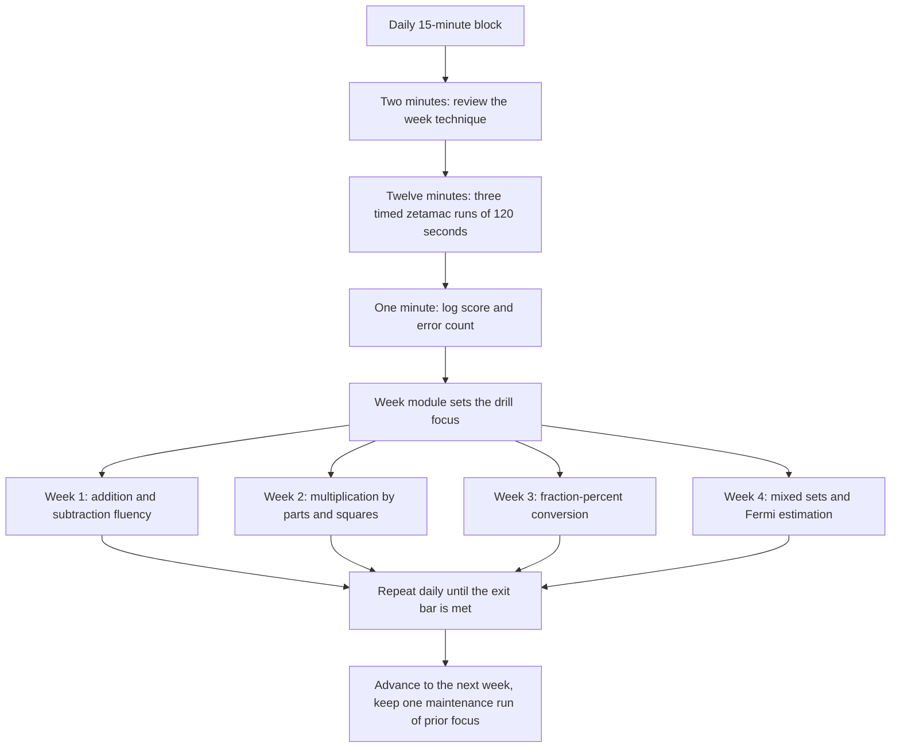
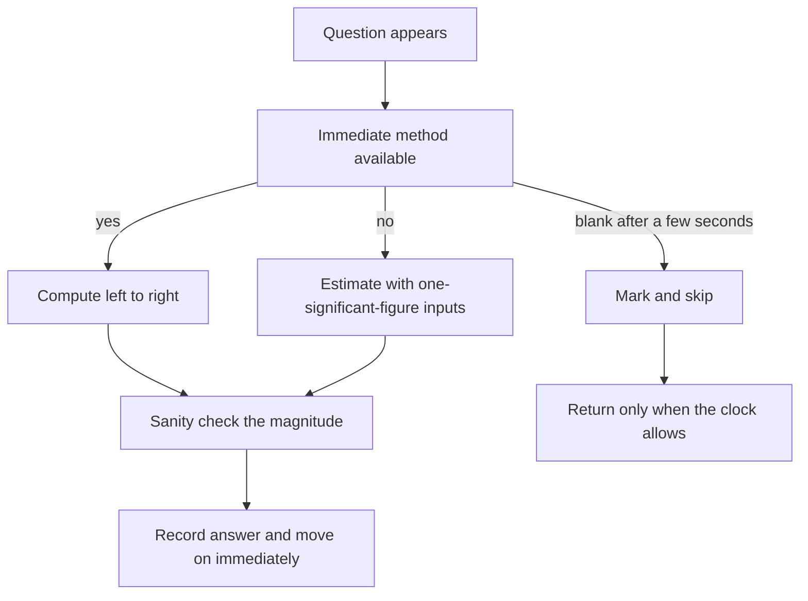

# Mental Math Speed for Trading Interviews

## Overview

Mental math speed is the first measurable filter in most quantitative trading pipelines: before probability puzzles and market-making games, firms want evidence that you can do clean arithmetic at conversational speed while a clock runs. The skill is not school arithmetic redux — it is a separate trainable repertoire of left-to-right computation, difference-of-squares factorizations, fraction-percent reflexes, and Fermi estimation that trades exactness for speed in a controlled way. This page defines the test formats as candidates report them, works through the core techniques with numbers, prescribes a four-week drill plan built around the standard practice tool, and places the whole exercise in context: a screening filter you must clear comfortably, but rarely the round that decides the offer.

Everything here assumes two to six weeks of runway and no math background beyond school arithmetic. The difficulty is entirely in execution under time pressure, which is why the page is organized around drills and measurement rather than theory. Where formats vary by firm, the page says so explicitly — trading firms do not publish their test internals, and candidate reports are the main public evidence, so treat every specific number below as reported shape rather than official specification.

## Test Formats and What They Measure

The commonly reported formats share one design: many small arithmetic questions, a hard time budget, and a scoring rule that punishes both slowness and errors. The Optiver-style "80 questions in 8 minutes" zap test is the most frequently cited shape in candidate reports; Indian campus OAs compress a similar section into the first twenty to thirty minutes of a longer test; and live screens sometimes replace the machine with an interviewer reading numbers aloud. Firms do not publish cutoffs or even confirm formats, so the table below is a composite of widely repeated candidate reports, not an official spec.

| Format | Where it is commonly reported | Reported shape | What it stresses |
|---|---|---|---|
| Zap-style arithmetic sprint | Optiver-style screens, several India quant OAs | "80 questions in 8 minutes" is the commonly reported shape; pure arithmetic, strict timing | Raw speed plus accuracy under a visible clock |
| Campus OA mental-math section | India prop-trading and market-maker OAs | 30-50 arithmetic items interleaved with probability and coding | Section-switching discipline; banking items fast |
| Interviewer-read mental math | Trader phone screens and onsite rounds | Interviewer reads numbers, expects answers in seconds | Composure, error recovery, no paper |
| Arithmetic inside games | Market-making loops | Quick sums embedded in quoting rounds | Arithmetic while tracking inventory and positions |

Two properties of these screens drive how you should train. First, the questions themselves are easy — the test discriminates on throughput and error rate, not on difficulty, which is why drilling beats reading about drills. Second, formats commonly report either negative marking or an implicit accuracy bar, so a wrong answer is usually expensive; the error-management section below turns that into a concrete practice rule.

### The Zap-Style Sprint, Up Close

Candidate reports describe the zap family consistently: an arithmetic-only web test, roughly one question per six seconds of budget, with per-question input rather than multiple choice. Because the reported questions are one- and two-digit operations scaling up to two-digit-by-two-digit products, the score is almost a pure measurement of computational automaticity — how few conscious steps each operation costs you. Reports also agree on the feel: the clock, not the math, is the opponent, and first-attempt accuracy matters more than cleverness.

Treat all specifics as hedged. The reported question counts, timings, and penalty rules differ across candidates, years, and firms, and no firm confirms them. The training consequence is stable regardless of which variant you face: build speed on the four operations to the point where two-digit products and fraction-percent conversions are reflexive, then let the specific format be a detail you adapt to in the first thirty seconds.

### The Indian Campus OA Variant

Indian campus OAs for quant roles compress the funnel's first two stages into one sitting, commonly reported as ninety to a hundred and twenty minutes containing a mental-math section, a probability and combinatorics section, and one or two coding problems. Candidate reports describe negative marking on the arithmetic section and proctoring that logs section-switching behavior, though details vary by firm and year and none of it is officially published. The arithmetic items resemble zap questions — percent-of, two-digit products, fraction-of — but with multiple-choice distractors built from classic slips such as dividing by the new value instead of the baseline.

The strategy consequence is about ordering, not technique. Bank the arithmetic section as fast as your accuracy permits, because every second recovered there is a second for the probability section where shortlist ranks are actually separated, and that material is deepened in [probability and statistics](../mathematics/probability-statistics.md). Rehearse the full sitting at least once before the real one — a mixed 90-minute rehearsal exposes pacing failures that isolated drills never show. Keep the error discipline from this page unchanged: the negative marking reported in these OAs makes the skip-versus-grind decision even more lopsided than in zap formats.

## Core Arithmetic Techniques

The techniques below are ordered by how often they fire in reported screens. Each one replaces an expensive right-to-left school algorithm with a left-to-right computation that produces a usable running answer at every step. Learn them one at a time, drill each against a timer until it is automatic, and only then combine them — mixing half-learned techniques is the main source of errors at speed.

### Left-to-Right Addition and Subtraction

School addition runs right-to-left because it defers carries; spoken numbers and mental math run left-to-right because the leading digits are the ones you need first. To add 473 and 586, compute hundreds, then tens, then units, appending as you go: 400 + 500 = 900, then 70 + 80 = 150 gives 1050, then 3 + 6 = 9 gives 1059. The running value is always a valid approximation of the answer, which matters in interviews where an interviewer may cut you off mid-computation and you still have a defensible number on the table.

Subtraction works the same way with complementary adjustments. For 823 minus 347, take the hundreds first: 823 − 300 = 523. Then remove 47 in two easy bites, 40 then 7: 523 − 40 = 483, then 483 − 7 = 476. When a digit would go negative, adjust at the place you are in — subtracting 58 from 102 is 102 − 60 + 2 = 44, a round-then-correct move that avoids borrowing entirely. Drill this until three-digit sums and differences complete in two to three seconds each; everything later on this page sits on top of it.

### Multiplication by Parts

The workhorse is distribution, executed left-to-right so partial products arrive in descending significance. For 43 × 76, compute 43 × 70 = 3010 first, hold it, then 43 × 6 = 258, and add: 3268. Near-round factors should be pulled to the nearest ten or hundred and corrected: 37 × 22 = 37 × 20 + 37 × 2 = 740 + 74 = 814. Doubling-and-halving handles one even factor: 14 × 35 = 7 × 70 = 490, because halving one factor and doubling the other leaves the product fixed.

Difference of squares is the highest-value recognition trick for two-digit products. Any pair symmetric around a round anchor factors as \\( (a-k)(a+k) = a^2 - k^2 \\), which collapses a hard multiplication into one square minus one small square:

\\[ 47 \\times 53 = (50-3)(50+3) = 2500 - 9 = 2491 \\]

The same move covers 96 × 84 = (90 + 6)(90 − 6) = 8100 − 36 = 8064, and 68 × 72 = (70 − 2)(70 + 2) = 4900 − 4 = 4896. Train the recognition, not just the algebra: when two factors average to a round number, the product is one subtraction away. Small multipliers have dedicated patterns — multiplying by 5 is ×10 then halve, by 25 is ×100 then quarter, by 9 is ×10 then subtract the number, and by 11 is digit-sum insertion (74 × 11 = 814). Each is a one-line transform that saves seconds dozens of times per screen.

### Division by Reciprocals and Estimation

Division at speed is mostly multiplication by a reciprocal, which reuses the fraction table in the next section. Dividing by 8 is multiplying by 0.125, by 16 is 0.0625, by 12 is 0.0833, and by 6 is 0.1667 — each a one-step transform that avoids long division entirely. Round-friendly divisors have dedicated moves: dividing by 5 is double then shift, so 340/5 = 68; by 25 is quadruple then shift two places, so 850/25 = 34; by 50 is double then shift two, so 1450/50 = 29.

When an exact reciprocal is not available, estimate the quotient left-to-right with round anchors. For 4739/62, note that 62 × 80 = 4960 overshoots, that 62 × 76 = 4712 leaves a remainder of 27, and conclude the quotient is 76 and roughly 0.4 — call it 76.4 without a single written digit. Anchor-multiply-and-correct is the multiplication-by-parts skill running in reverse, and stating the anchor aloud ("just over 62 × 76") is the interview form of the answer.

Digit sums are the cheap error check, costing about two seconds: a number divides by 9 exactly when its digits sum to a multiple of 9, so 3168 (digits summing to 18) divides cleanly — 3168/9 = 352 — while 3170 does not. The same casting-out-nines move validates a product when an answer looks wrong. Run it selectively, only on suspect answers, because checking everything under a clock converts the safety net into the bottleneck.

### Squares, Cubes, and Powers of Two

Squares up to \\( 50^2 \\) should be recall, not computation, because they feed difference of squares, variance-style estimates, and squaring near round anchors via \\( (50 \\pm k)^2 = 2500 \\pm 100k + k^2 \\). For example, \\( 47^2 = 2500 - 300 + 9 = 2209 \\) and \\( 53^2 = 2500 + 300 + 9 = 2809 \\), each a three-second computation once the anchor identity is automatic. Numbers ending in 5 square by the standard trick: \\( 85^2 = 8 \\times 9 \\) followed by 25, giving 7225. The grid below is the recall table to drill until each entry takes under a second:

```text
 n :  11   12   13   14   15   16   17   18   19   20
n^2: 121  144  169  196  225  256  289  324  361  400
 n :  21   22   23   24   25   26   27   28   29   30
n^2: 441  484  529  576  625  676  729  784  841  900
 n :  31   32   33   34   35   36   37   38   39   40
n^2: 961 1024 1089 1156 1225 1296 1369 1444 1521 1600
 n :  41   42   43   44   45   46   47   48   49   50
n^2:1681 1764 1849 1936 2025 2116 2209 2304 2401 2500
```

Cubes matter less than squares but earn their place in probability and volume-flavored questions; memorize \\( 1^3 \\) through \\( 12^3 \\): 1, 8, 27, 64, 125, 216, 343, 512, 729, 1000, 1331, 1728. Powers of two anchor binary-flavored estimation: \\( 2^{10} = 1024 \\approx 10^3 \\), so \\( 2^{16} = 65536 \\) and \\( 2^{20} \\approx 10^6 \\) follow by stacking. Knowing \\( 2^{10} \\approx 10^3 \\) to within 2.4% is the single most reused fact in Fermi work with exponential growth, from doubling-time questions to order-of-magnitude branch factors.

## Fractions and Percent Conversion

Screens love percent-of and fraction-of questions because they are easy to generate and impossible to fake: either the conversion is in your fingers or it is not. The table below is the full drill set — the left column is the exact fraction, the right its percent form, and every entry should eventually be recall rather than calculation. The task-listed anchors are all here: \\( 1/8 = 12.5\\% \\), \\( 1/7 \\approx 14.29\\% \\), \\( 1/12 \\approx 8.33\\% \\), \\( 1/16 = 6.25\\% \\), and \\( 5/8 = 62.5\\% \\).

| Fraction | Percent | Fraction | Percent |
|---|---|---|---|
| 1/2 | 50% | 1/9 | ≈ 11.11% |
| 1/3 | ≈ 33.33% | 1/10 | 10% |
| 1/4 | 25% | 1/11 | ≈ 9.09% |
| 1/5 | 20% | 1/12 | ≈ 8.33% |
| 1/6 | ≈ 16.67% | 1/15 | ≈ 6.67% |
| 1/7 | ≈ 14.29% | 1/16 | 6.25% |
| 1/8 | 12.5% | 1/20 | 5% |
| 1/24 | ≈ 4.17% | 1/25 | 4% |
| 1/32 | 3.125% | 1/50 | 2% |
| 2/3 | ≈ 66.67% | 3/16 | 18.75% |
| 5/6 | ≈ 83.33% | 5/16 | 31.25% |
| 3/8 | 37.5% | 7/16 | 43.75% |
| 5/8 | 62.5% | 7/8 | 87.5% |

### Worked Conversions

When a percent matches a memorized fraction, the problem becomes one division. 12.5% of 640 is \\( 640/8 = 80 \\); 6.25% of 512 is \\( 512/16 = 32 \\); 37.5% of 240 is \\( 3 \\times 240/8 = 90 \\). When the percent does not match a single fraction, decompose it into memorized pieces: 17.5% of 480 is 12.5% + 5%, that is \\( 480/8 + 480/20 = 60 + 24 = 84 \\). This decompose-into-known-fractions move covers nearly every percent-of question a screen generates, and it is why the table above is drilled to reflex rather than consulted.

The reverse direction matters in games and quoting follow-ups. Given 250 out of 1750, recognize \\( 250/1750 = 1/7 \\approx 14.29\\% \\) instantly instead of long-dividing. Given 68 of 400, read it as 17% by seeing 68 = 17 × 4 against 400 = 100 × 4. Rounding to a nearby friendly fraction and stating the adjustment — "just under 15%, call it 14.3%" — is both faster and, in a trader's eyes, a better answer than a slow long division, because live quoting works in approximations with stated error bars.

### Successive Percentage Changes

Percent changes compose multiplicatively, and the composition is systematically asymmetric. A rise of 10% followed by a fall of 10% leaves \\( 1.1 \\times 0.9 = 0.99 \\) — a net loss of 1%, not flat. A 20% rise then 20% fall leaves \\( 1.2 \\times 0.8 = 0.96 \\), a 4% loss, because the second change operates on a different base than the first. The interview version of this fact is the recovery question: after a drop of \\( p \\) percent, you need a rise of \\( p/(100-p) \\) percent to break even, so −20% requires +25% and −50% requires +100%.

This asymmetry is one of the few places where mental math and trading intuition are literally the same object. Compounded small edges and small slippages multiply the same way percentages do, and a candidate who instantly says "no, you are down 1%" while the interviewer is still finishing the question demonstrates exactly the reflex the screen measures. Drill variations until the multiply-the-factors step is automatic: 1.03 × 0.97 = 0.9991, a 0.09% loss, computed by difference of squares \\( (1+k)(1-k) = 1 - k^2 \\) with \\( k = 0.03 \\).

### Percent Shortcuts Beyond the Table

Three shortcuts cover most of the non-tabulated percent work. First, the commutative swap: x percent of y equals y percent of x, so 8% of 25 is 25% of 8 = 2, and 4% of 75 is 75% of 4 = 3 — always flip toward the factorization that divides evenly. Second, build awkward percents from halving chains: 15% is 10% plus half again, 17.5% is 10% plus 5% plus half of 5%, and each halving is a single binary step rather than a fresh multiplication. Third, add a percent through its anchor: adding 5% to 480 is adding half of 10% of 480, that is 24, giving 504 — the same decomposition as the fraction method, entered through growth phrasing when the question presents a percent change rather than a fraction.

## Order-of-Magnitude Estimation

Fermi estimation is mental math's slower sibling, and it appears in later rounds as "estimate X" questions where the grader watches your decomposition, not your final digit. The method has three rules. First, decompose the unknown into three to five factors you can defend, each stated aloud as an assumption. Second, round every factor to one significant figure so multiplication reduces to mantissa times power of ten — multiplying \\( 4 \\times 10^8 \\) by \\( 1.2 \\) is a two-second step, multiplying 412,000,000 by 1.2 is not. Third, track the exponent separately and give the answer as a band, typically within a factor of three of your central estimate, then sanity-check against anything reported you half-remember.

\\[ \\text{estimate} = \\prod_i f_i, \\qquad \\log_{10}(\\text{estimate}) = \\sum_i \\log_{10}(f_i) \\]

The sum-of-logs view is the practical trick: with one-significant-figure inputs you are just adding exponents and multiplying small mantissas, which is exactly the multiplication-by-parts skill from above running at lower precision. Keep the error budget in mind as well — each factor guessed within a factor of two contributes at most a factor of two to the band, so a five-factor decomposition lands within roughly an order of magnitude even with sloppy inputs, and much tighter if one or two factors are anchored to something you know.

### Doubling Times and the Rule of 70

Exponential-growth questions — compounding capital, user growth, escalating costs — reduce to one memorized constant: a quantity growing at r percent per period doubles in roughly 70/r periods, because the natural log of 2 is about 0.693. At 7% per year, capital doubles in about a decade; at 2% per month, doubling takes about 35 months. The companion rule of 72 is the same estimate retuned to divide evenly by more integers — 3, 4, 6, 8, 9, 12 — and the difference between the two rules is never worth a breath of deliberation in an interview.

The reverse direction uses the powers of two: doubling n times multiplies by \\( 2^n \\), and since \\( 2^{10} \\approx 10^3 \\), ten doublings is a thousandfold and twenty is a millionfold. Together the two moves form a complete exponential toolkit — growth rate to doubling time by one division, doubling count to magnitude by stacking \\( 2^{10} \\approx 10^3 \\). A concrete case: an algorithm's cost doubles with each step up in input size, five doublings is \\( 2^5 = 32 \\times \\), and stating that before anyone reaches for a calculator is the entire point of the exercise.

### A Full Worked Estimate: Daily UPI Transactions

Target: the number of UPI transactions per day in India. Decompose into four defensible factors: population, smartphone-user share, share of smartphone users actively making digital payments, and payments per active user per day. State each aloud as you go, rounding to one significant figure, and multiply left-to-right in scientific notation:

\\[ 1.4 \\times 10^9 \\times 0.45 \\approx 6 \\times 10^8 \\ \\text{smartphone users} \\]

\\[ 6 \\times 10^8 \\times 0.65 \\approx 4 \\times 10^8 \\ \\text{active payment users} \\]

\\[ 4 \\times 10^8 \\times 1.2 \\approx 5 \\times 10^8 \\ \\text{transactions per day} \\]

The per-user rate is the softest factor, so defend it explicitly: UPI spans peer-to-peer transfers and small merchant payments, heavy urban users run several per day, and a blended rate of roughly one per active user per day is the conservative floor — push it to two and the estimate doubles, which is exactly the band you should state. The public cross-check, as reported during 2024, is monthly UPI volumes on the order of \\( 1.3 \\) to \\( 1.6 \\times 10^{10} \\), which divides to roughly \\( 4.5 \\times 10^8 \\) per day — inside the stated band. The score in an interview is the decomposition and the stated uncertainty, not the third digit of the answer.

## The Zetamac Drill

The standard practice tool is the arithmetic drill at [arithmetic.zetamac.com](https://arithmetic.zetamac.com): a minimal web app that fires one arithmetic question at a time, scores completions in a fixed window, and requires an exact typed answer for each. It is the closest free approximation to the reported zap format, which is why candidate communities treat a personal zetamac score graph as the primary progress metric for this stage. The tool is deliberately bare — no lessons, no gamification — so the training value comes from the session protocol you wrap around it, not from the app itself.

### Recommended Settings

Configure it to match the reported screen shapes rather than the widest challenge. The recommended base configuration is addition, subtraction, and multiplication enabled, division off for the first two weeks, and the default number ranges left untouched — the defaults already scale difficulty from single digits into two-digit products as you answer, which matches the adaptive feel candidates report from real screens. Set the timer to 120 seconds per run, because two minutes is long enough for score variance to smooth out and short enough to fit many runs into a 15-minute session. Once two-digit-by-two-digit products are stable, add division and then enable everything for mixed runs.

A minimal session log is the difference between practicing and training. Record the date, run number, score, and error count after every run — errors are self-marked by re-running your misses mentally at the end of each run and counting where you typed a wrong answer. The format below takes ten seconds per run to maintain and produces the error-rate series the error-management section depends on:

```text
date        set  score  errors  note
day-1-wk1   1       28       2  borrowing errors under 3s pressure
day-1-wk1   2       31       1  faster on x9 and x11 patterns
day-1-wk1   3       33       1  fatigue on last 30s, typing slips
```

### Session Protocol and Benchmarks

Run each daily session as five 120-second runs with a fixed 30-second gap, logging every run. Treat the session median, not the best run, as the number that goes in your progress series, because best-run scores chase variance and produce false plateau-breaks. End every session by re-deriving each missed question slowly, naming the technique that should have fired — this 60-second review is where the actual learning consolidates, and skipping it is the most common way candidates practice for weeks without improving.

Avoid anchoring to absolute score targets collected from forums, since reported zap scores vary wildly by settings and honesty, and no firm publishes a threshold. The defensible benchmark is your own trendline: with daily 15-minute sessions, most committed candidates report their 120-second median climbing steadily for two to three weeks before flattening, and the flattening point is the signal to widen number ranges or add operations rather than to grind the same configuration. If you want an external reference point for shape only, candidate discussions on [QuantNet](https://quantnet.com) and firm-adjacent forums describe the zap test's feel; treat the numbers there as anecdotes, not bars.

### Input Mechanics and Transcription Errors

Reported zap-style interfaces require an exact typed answer per question, so input mechanics are part of the tested skill even though almost nobody trains them deliberately. Pick one input surface — the top number row or the keypad — and use it exclusively in every drill, because mixing surfaces produces transcription errors of the right-answer-wrong-keystrokes kind that your error log will otherwise misattribute to computation. Enter answers without digit-by-digit proofreading; the sanity check that matters under a clock is magnitude, not re-reading. These details sound small, and at six seconds per reported question they are not: two transcription slips per run is a plateau that candidates blame on math when it was typing all along.

## A Four-Week Drill Plan

The plan below assumes exactly 15 minutes per day and sequences the techniques in dependency order: fast addition and subtraction are prerequisites for left-to-right products, which are prerequisites for percent work, which is what mixed runs and Fermi estimates stress. Each week has an exit bar so progression is a decision, not a feeling. The bars are self-coaching targets calibrated to candidate-reported zap pressure — they are not published cutoffs, and clearing them early means you advance early.

| Week | Focus | Daily 15-minute structure | Exit bar |
|---|---|---|---|
| 1 | Addition and subtraction fluency | 2 min technique review, 3 x 120 s zetamac runs (add/sub), 2 min error review | 3-digit sums and differences in under 3 s each; session error rate below 5% |
| 2 | Multiplication by parts | 3 min difference-of-squares drills, 3 x 120 s runs (all four ops), 2 min error review | 2-digit x 2-digit products in under 10 s; squares to 50 recalled instantly |
| 3 | Fractions and percents | 3 min conversion-table recall drills, 3 x 120 s runs (all ops), percent-of sets, 2 min error review | Full table above recalled; 17.5%-of-480-style decompositions in under 15 s |
| 4 | Mixed sets and estimation under pressure | 3 x 120 s mixed runs, one Fermi estimate spoken aloud daily, 2 min error review | Mixed-run median within 10% of week-2 peak; one clean Fermi chain in 3 min |



Two adaptations keep the plan honest to your calendar. If you have more than four weeks, insert a consolidation week after week 3 that repeats the weakest week's focus rather than rushing to mixed sets, since mixed performance is bounded by the weakest operation. If an OA is imminent inside two weeks, compress by keeping the same daily structure but spending week 1 on multiplication directly, accepting weaker subtraction fluency — reported screens weight products and percents more heavily than large subtractions, so the compression sacrifices the least-tested skill first.

## Error Management and the Speed-Accuracy Tradeoff

Speed and accuracy trade off against each other in every timed arithmetic task, and the shape of the tradeoff is what practice actually tunes. Pushing pace raises both throughput and error rate; the skill is finding the pace where the marginal seconds saved outweigh the marginal error risk. In screens that commonly report negative marking or strict accuracy bars, a wrong answer usually costs more than a slow correct one: it burns the same clock time and then subtracts value, whereas a slow correct answer only costs time. The hedge matters — penalty structures differ by firm and by year and are not published — so the safe practice assumption is that errors are expensive and over-caution is only expensive in the softest formats.

The per-question decision that implements this tradeoff is deliberately simple, and it should run as a reflex rather than a deliberation. The flow below is the whole policy: recognize fast, compute left-to-right when a short exact path exists, estimate to one significant figure when it does not, and skip rather than grind. Returning to skipped questions is worthwhile only when the format permits it — in a strict one-pass sprint, a skipped question is simply a smaller loss than a fumbled one.



### Tracking Error Rate Per Session

Define error rate mechanically: errors divided by attempted questions within a session, computed from your session log. A practical practice heuristic is to hold error rate under roughly 5% while pushing pace — if it spikes above that band, drop your pace by ten percent for the next run rather than fighting through, because unmanaged error spikes become habits under pressure. Distinguish error types in the log note column: computation errors (wrong arithmetic), method errors (wrong technique chosen), and transcription errors (right answer, wrong keystrokes) have different fixes, and only the first improves from generic drilling.

The hedged bottom line, worth internalizing before any screen: candidate reports consistently suggest that firms read the accuracy signal at least as strongly as the raw score, since a trader who is fast but wrong is worse than useless at a desk. That reported emphasis is exactly why this page has you log errors per run rather than only scores. A session series showing a rising score with a flat-or-falling error rate is the target trajectory; a rising score with a rising error rate is a pace problem disguised as progress.

### Recovering From a Fumbled Answer

Fumbles happen in every format, and the recovery routine is as trainable as the arithmetic itself. In machine-graded sprints a submitted wrong answer is a sunk cost — do not chase it, because re-attempting is rarely possible and dwelling taxes the next three questions; the routine is one breath, next question. In interviewer-read formats, correct yourself immediately and aloud: "that should be 2491, I dropped a ten" reads as calibration and composure, while silence reads as flustered. Practice the recovery deliberately by having a timer or a friend interrupt mid-computation, since the skill being trained is recentering, not the specific sum.

## Where Mental Math Sits in the Funnel

Calibrate the effort correctly: the mental-math screen is a filter, not the offer decider. Its function is to cut the pool to candidates who can handle the later rounds' cognitive load, and filters reward clearing them comfortably rather than clearing them spectacularly — no known loop hires on zap score alone, and the rounds that actually decide trader offers are probability, expected value, and games, where judgment under uncertainty is the measured quantity. Plan accordingly: four weeks of drills on this page clears the filter for most reported formats, while the same four weeks invested only in arithmetic leaves you exposed in the rounds with real variance.

The compounding effect runs the other way too. Weak mental math leaks into every later round — an expected-value derivation stalls when the arithmetic inside it stalls, and a market-making game goes badly when quoting requires long division. This is why the sibling pages treat fast arithmetic as assumed infrastructure: the [expected value problems](./expected-value-problems.md) page asks you to solve three-equation systems in under two minutes, and the [market making games](./market-making-games.md) page embeds arithmetic inside quoting decisions. Build the infrastructure once, then spend your remaining preparation budget where the offers are actually decided, using the section hub and the [firm directory](./firm-directory.md) to pick targets.

## Interview Questions

1. **Compute 47 × 53 in your head and walk me through it.** The two factors average to the round anchor 50, so recognize difference of squares: \\( (50-3)(50+3) = 2500 - 9 = 2491 \\), one subtraction after a recalled square. The interviewer is testing whether you spot structure before grinding — the same recognition handles 96 × 84 = 8100 − 36 = 8064 and any symmetric pair. State the fallback aloud to show robustness: by-parts gives 47 × 50 + 47 × 3 = 2350 + 141 = 2491, and two routes agreeing is the strongest sanity signal you can offer in seconds.

2. **What is 12.5% of 640, and how would you handle a percent that is not on your table?** 12.5% is \\( 1/8 \\), so the answer is \\( 640/8 = 80 \\), one division with no multiplication. For a non-tabulated percent like 17.5%, decompose into memorized pieces: 17.5% of 480 is 12.5% + 5%, giving \\( 60 + 24 = 84 \\). The whole skill is the fraction-percent table plus the decomposition reflex, which is why the drills above memorize the table rather than teach percent formulas. Round-and-adjust with a stated error bar is an acceptable answer when the interviewer signals approximation is fine.

3. **A stock rises 10%, then falls 10%. Is it back to even?** No — factors multiply, so the net is \\( 1.1 \\times 0.9 = 0.99 \\), a 1% loss. The two changes look symmetric but act on different bases, and the asymmetry grows with magnitude: +20% then −20% loses 4%, and a 50% drop needs a 100% gain to recover, per \\( p/(100-p) \\). The general identity is difference of squares, \\( (1+k)(1-k) = 1 - k^2 \\), which gives the loss without any multiplication. Traders care because compounded edges and slippage obey the same arithmetic, so answering instantly while the question is still being asked is the demonstration being scored.

4. **Estimate the number of UPI transactions per day in India.** Decompose aloud: \\( 1.4 \\times 10^9 \\) population, times roughly 0.45 smartphone penetration, times roughly 0.65 actively using digital payments, times roughly 1.2 transactions per active user per day, giving \\( 5 \\times 10^8 \\) per day. Round every factor to one significant figure, add the exponents, and state the band — pushing the per-user rate from 1.2 to 2 doubles the estimate, which is the honest sensitivity to volunteer. Cross-check against the publicly reported 2024 monthly volumes of order \\( 1.5 \\times 10^{10} \\), which divide to the same band, and note that the decomposition discipline was the graded artifact.

5. **Why do trading firms test mental math at all when every desk has a calculator?** The honest answer, as far as candidate reports show, is that the screen is a cheap, hard-to-game filter for practiced fluency and composure under a clock, not a simulation of desk work. Fast accurate arithmetic does matter live — quoting games, quick sizing, and rapid-fire follow-ups all reward instant magnitude reasoning — but the screen's main job is cutting the pool before expensive interviewer time. Signal that you know the weighting: the later rounds on probability, expected value, and games decide offers, and mental math is table stakes that must not distract from them. That calibration is itself a positive signal about how a candidate would prioritize on a desk.

6. **How do you structure practice so accuracy does not collapse as speed rises?** Run five 120-second zetamac sessions daily with a log of score and error count per run, and manage the error rate as the primary variable — a practical band is under 5%, and a spike means dropping pace ten percent for the next run rather than pushing through. Classify each error as computation, method, or transcription, because they have different fixes and only the first improves from generic speed work. End every session re-deriving misses slowly and naming the technique that should have fired. The target trajectory is a rising score median with a flat error rate; the reverse combination means the pace increase was borrowed against accuracy that the screen will bill for.

## Key Takeaways

- Mental-math screens are throughput-and-accuracy filters: the Optiver-style "80 questions in 8 minutes" zap test is the commonly reported shape, firms do not publish formats or cutoffs, and every specific number you hear is candidate-reported rather than official.
- Compute left-to-right everywhere: running sums, differences, and partial products in descending significance keep a usable answer on the table at every step and match how interviewers hear numbers.
- Difference of squares \\( (a-k)(a+k) = a^2 - k^2 \\) converts any pair of factors averaging to a round anchor into one recalled square minus one small square; \\( 47 \\times 53 = 2491 \\) is the canonical drill.
- The fraction-percent table — \\( 1/8 = 12.5\\% \\), \\( 1/7 \\approx 14.29\\% \\), \\( 1/12 \\approx 8.33\\% \\), \\( 1/16 = 6.25\\% \\), \\( 5/8 = 62.5\\% \\) and the rest — turns percent-of questions into single divisions, and decomposition covers the percents it misses.
- Fermi estimation is one-significant-figure multiplication with stated assumptions and a stated band; the daily-UPI worked estimate above is the template to rehearse until spoken delivery takes under three minutes.
- Practice at [arithmetic.zetamac.com](https://arithmetic.zetamac.com) with addition, subtraction, multiplication, default ranges, and 120-second runs; log score and error count every run and manage the error rate, not just the score.
- Follow the four-week plan in dependency order — addition and subtraction, then multiplication, then fractions and percents, then mixed and estimation — advancing on exit bars rather than feelings.
- A wrong answer usually costs more than a slow correct one in reported formats, mental math is a screening filter rather than the offer decider, and probability, expected value, and games are where the remaining preparation budget belongs.

## References

- [Zetamac Arithmetic Drill](https://arithmetic.zetamac.com) — the standard open web drill used for timed arithmetic practice; the session protocol and recommended settings above are built around it.
- [Optiver](https://www.optiver.com) — firm site and careers portal; the "80 questions in 8 minutes" zap test is name-only here because the format is candidate-reported rather than officially documented.
- [Jane Street](https://www.janestreet.com) — firm site and careers portal; candidate-reported screens at market makers commonly include mental-math and probability filters of the kind this page trains.
- [Hudson River Trading](https://www.hudsonrivertrading.com) — firm site and careers portal; candidate-reported quantitative trader screens include speeded arithmetic components.
- [IMC](https://www.imc.com) — firm site and careers portal; included for the same screening-family reason, with formats known only through candidate reports.
- [SIG](https://sig.com) — firm site and careers portal; SIG's reported game-based screens assume the fast-arithmetic base this page builds.
- [QuantNet](https://quantnet.com) — quant community forum where candidate-reported interview formats and zap-test experiences circulate; treat all numbers there as anecdotes.
- Xinfeng Zhou, *A Practical Guide to Quantitative Finance Interviews* — name-only citation; its warmup drills are the print companion to the techniques on this page.
- Timothy Crack, *Heard on the Street* — name-only citation; its arithmetic and estimation warmups complement the drill plan above.

## Cross-References

- [Quantitative Finance Interview Preparation](./README.md) — the section hub defining the funnel, the roles, and where the mental-math screen sits in both.
- [Expected Value Problems](./expected-value-problems.md) — the probability round that decides offers; its derivations assume the fast arithmetic this page builds.
- [Market Making Games](./market-making-games.md) — quoting rounds where arithmetic runs concurrently with inventory tracking.
- [Firm Directory](./firm-directory.md) — per-firm formats and loops, for choosing which reported screen shape to drill toward.
- [Aptitude & Quantitative Preparation](../aptitude/README.md) — the general aptitude track, including the [percentages chapter](../aptitude/percentages.md) whose fraction tricks this page reuses at higher speed.
- [Probability and Statistics](../mathematics/probability-statistics.md) — the mathematical base for the rounds that follow the arithmetic filter.
- [Placement Preparation Hub](../placement-preparation/README.md) — the general OA and campus-placement landscape that the quant OAs compress into a single sitting.
- [Interview Puzzles](../interview/puzzles/README.md) — the logic warmup canon whose rounds share the later loops with these drills.
