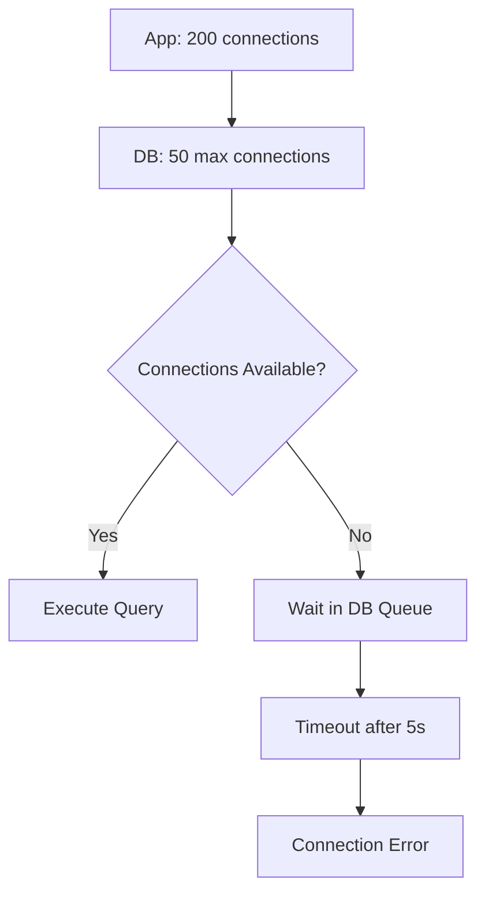

# Applied Queueing Theory in Systems Design

This chapter bridges queueing theory formulas to concrete engineering decisions: sizing pools, setting timeouts, implementing backpressure, and understanding overload behavior.

## Connection Pool Sizing

### The Problem

A database connection is expensive (~1-3ms to establish). You want to reuse them. But how many do you need?

### Using Little's Law

Given:
- λ = arrival rate (queries/sec)
- S = average service time per query (seconds)

```
L = λ × S
```

L gives you the **average** number of concurrent connections in use. The pool must be at least this large.

### Worked Example

A service does 2000 queries/sec with an average query time of 5ms:

```
L = 2000 × 0.005 = 10 connections (average)
```

But average isn't enough. You need headroom for variance. If query time has a p99 of 50ms:

```
L_p99 = 2000 × 0.050 = 100 connections at p99 conditions
```

**Recommendation**: Start with `L × 1.5` to `L × 2` as your max pool size, and tune based on measurement.

### A Practical Formula

HikariCP (Java's most popular connection pool) recommends:

```
connections = (core_count × 2) + effective_spindle_count
```

This works because the database itself is a queueing system. More connections than CPU cores + disk spindles just cause **more contention at the database** without increasing throughput.

## Thread Pool Sizing

### CPU-Bound Tasks

``n_threads = number_of_cores```

Adding more threads than cores for CPU-bound work causes context switching overhead without benefit.

### I/O-Bound Tasks

For tasks that spend most time waiting on I/O (database, network):

```
n_threads = n_cores × (1 + W/S)
```

Where:
- **W** = average wait time (I/O blocking)
- **S** = average compute (CPU) time per task

If tasks spend 90% of time in I/O (W/S = 9), and you have 8 cores:

```
n_threads = 8 × (1 + 9) = 80 threads
```

### Using Little's Law for Thread Pools

Given λ = 500 req/sec, average processing time = 100ms:

```
L = 500 × 0.1 = 50 threads needed on average
Pool size ≥ 50, recommended 60-75 for headroom
```

## Load Balancer Capacity Planning

### M/M/c Model

You have c backend servers. Each handles μ = 100 req/s. Expected traffic λ = 800 req/s.

```
ρ = λ / (c × μ)
```

| c (servers) | ρ (utilization) | Queueing Delay (approx) | Notes |
|-------------|-----------------|------------------------|-------|
| 8 | 1.00 | ∞ | **Saturated** — never do this |
| 9 | 0.89 | ~8.1ms | Running hot, fragile |
| 10 | 0.80 | ~4.0ms | Acceptable for non-critical |
| 12 | 0.67 | ~2.0ms | Comfortable operating point |
| 16 | 0.50 | ~1.0ms | Lots of headroom, higher cost |

**Rule of thumb**: Target ρ = 0.6-0.7 for latency-sensitive services, which means ~30-40% over-provisioning.

### Queue Depth at the Load Balancer

When all c backends are busy, requests queue at the load balancer. The queue depth is:

```
L_q = P(queue) × ρ / (1 - ρ)
```

If the queue grows too large, requests time out. Set a **maximum queue depth** and return 503 (Service Unavailable) or 429 (Too Many Requests) beyond it.

## Database Connection Queueing

A common failure mode: the application's connection pool is larger than the database can handle.



**Problem**: 200 connections all competing for 50 DB slots → massive queueing at the DB → timeout cascades → application pool exhaustion.

**Solution**: Size your app pool based on DB capacity, not app throughput. If the DB has 50 connection slots and you have 5 app instances, each gets 10 connections max.

## Request Queue Depth and Backpressure

Backpressure is the mechanism by which a downstream system signals an upstream system to slow down.

### When to Apply Backpressure

```
┌──────────┐     ┌──────────┐     ┌──────────┐
│ Producer  │────►│  Queue   │────►│ Consumer  │
│ (fast)   │     │ (depth)  │     │ (slow)   │
└──────────┘     └──────────┘     └──────────┘
                         │
                   depth > limit?
                         │
                    ┌────▼────┐
                    │ Apply   │
                    │ back-   │
                    │ pressure│
                    └─────────┘
```

### Backpressure Strategies

| Strategy | Mechanism | Tradeoff |
|----------|-----------|----------|
| **Bounded queue + reject** | Queue has max size; reject when full | Caller gets immediate error; simplest to implement |
| **TCP backpressure** | TCP window shrinks, sender slows | Automatic, but coarse-grained |
| **Credit-based** | Consumer grants credits to producer | Fine-grained, used in gRPC flow control |
| **Circuit breaker** | Stop sending when error rate exceeds threshold | Protects system, but needs careful tuning |
| **Adaptive throttling** | Dynamically adjust send rate based on latency feedback | Best responsiveness, most complex |

### Sizing Queue Depth

Using Little's Law with a target wait time:

```
L = λ × W_target
```

If λ = 5000 req/s and you're willing to wait at most 100ms in the queue:

```
L = 5000 × 0.1 = 500 items max queue depth
```

Beyond this, either reject or scale the consumer.

## Overload Behavior and Load Shedding

When ρ ≥ 1, the queue grows without bound. You **must** shed load.

### Load Shedding Strategies

1. **Random drop**: Drop requests randomly. Simple, fair. Each request has the same chance.
2. **Priority drop**: Drop low-priority requests first (e.g., analytics over user requests).
3. **Admission control**: Accept a fixed rate, reject the rest. The server operates at a fixed ρ regardless of incoming load.
4. **Graceful degradation**: Return cached/stale data instead of processing fresh.

### The "Good Overload" Design

A well-designed system degrades gracefully under overload:

```
Request Rate:    100  500  1000  5000  10000
                 │    │    │     │     │
Accepted:        100  500  1000  2000  2000  ← capped at capacity
                 │    │    │     │     │
p99 Latency:    10ms 12ms 15ms  20ms  20ms  ← stays bounded
                 │    │    │     │     │
Errors (429):     0    0    0   3000  8000  ← excess rejected
```

Compare to a poorly designed system with unbounded queue:

```
p99 Latency:    10ms 15ms 50ms 5000ms 60000ms  ← explodes
```

## When NOT to Use Queueing Theory

Queueing theory models are most useful when:
- The system has a **single bottleneck** resource
- Arrivals are **reasonably random** (not highly correlated)
- The system is in **steady state** (not during startup, failover, or flash crowds)

**Don't use queueing theory when:**
- You have real measurements — use those instead
- The system has complex dependencies (A waits for B which waits for C)
- Traffic is extremely bursty (event-driven, batch arrivals)
- You're analyzing a cold start or ramp-up period

**Do use it for:**
- Quick sanity checks on pool sizes
- Understanding *why* latency spikes near capacity
- First-pass capacity planning before building
- Interview whiteboard analysis

## References

- HikariCP Wiki: [About Pool Sizing](https://github.com/brettwooldridge/HikariCP/wiki/About-Pool-Sizing)
- Vogels, W. "Eventually Consistent." *CACM*, 2009. (Backpressure discussion)
- Google SRE Book, Ch. 21: Handling Overload.
- Kleppmann, M. *Designing Data-Intensive Applications*, Ch. 12.

## Interview Questions

1. **How would you size a database connection pool for a service doing 3000 QPS with 8ms average query time?**
2. **A load balancer has 5 backends. Each handles 200 req/s. What's the maximum arrival rate before you'd start worrying about latency?**
3. **What is backpressure? Give an example of implementing it in a producer-consumer system.**
4. **Why does having a connection pool larger than the database's max connections make things worse?**
5. **Design a load shedding strategy for an e-commerce checkout service that receives 10× normal traffic during a sale.**
6. **How would you determine the optimal thread pool size for a mixed CPU/IO-bound service?**
7. **What happens to p99 latency if you run a system at 95% utilization? Quantify it using M/M/1.**
8. **Compare random load shedding to priority-based load shedding. When is each appropriate?**
9. **When would you choose to use a bounded queue versus an unbounded queue? What are the tradeoffs?**
