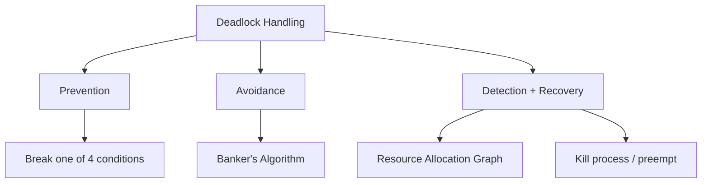

# Operating Systems - Quick Revision

> 📌 Last-minute revision before interviews. Scan these points quickly.
> Each topic links to detailed coverage elsewhere in this book.

---

## Process & Thread

| Concept | Process | Thread |
|---------|---------|--------|
| Memory | Separate address space | Shared within process |
| Creation | Heavy (fork: copy-on-write) | Light (clone: shared pages) |
| Context switch | Expensive (TLB flush, cache) | Cheap (same address space) |
| Communication | IPC (pipes, sockets, shared mem) | Shared variables (needs sync) |
| Crash impact | Isolated (other processes safe) | Can crash entire process |

### Key Facts

- **fork()**: Creates child process (COW — copy-on-write). Returns 0 to child, child PID to parent.
- **exec()**: Replaces current process image with new program. Doesn't create new PID.
- **Zombie**: Terminated process, parent hasn't called `wait()`. Entry in process table. Freed when parent waits or terminates.
- **Orphan**: Parent terminated. Adopted by `init` (PID 1) or subreaper.
- **Daemon**: Background process, no controlling terminal (e.g., `sshd`, `cron`).

### Process Control Block (PCB)

Contains all process state: PID, state, program counter, registers, memory maps, open files, scheduling info, accounting.

---

## Scheduling

### Algorithms Comparison

| Algorithm | Type | Starvation | Preemptive | Notes |
|-----------|------|------------|------------|-------|
| **FCFS** | Non-preemptive | Yes (convoy) | No | Simple, unfair |
| **SJF** | Non-preemptive | Yes | No | Optimal avg wait |
| **SRTF** | Preemptive SJF | Yes | Yes | Preemptive SJF |
| **Round Robin** | Preemptive | No | Yes | Time quantum critical |
| **Priority** | Either | Yes (low priority) | Optional | Solution: aging |
| **MLFQ** | Preemptive | Possible | Yes | Most general, multiple queues |
| **CFS** (Linux) | Preemptive | No | Yes | Virtual runtime, red-black tree |

### Round Robin — Time Quantum

- **Too small** → Excessive context switches, high overhead
- **Too large** → Degenerates to FCFS
- **Sweet spot** → 80% of CPU bursts should complete in one quantum

### Linux CFS (Completely Fair Scheduler)

- Tracks **virtual runtime** (vruntime) per process
- Lower vruntime = higher priority = gets CPU next
- Uses red-black tree for O(log n) scheduling
- Nice values adjust vruntime rate

---

## Synchronization

### Primitives

| Primitive | Type | Use Case | Key Property |
|-----------|------|----------|--------------|
| **Mutex** | Binary lock | Mutual exclusion | Owner must unlock |
| **Semaphore** | Counter | Resource pool, signaling | Any thread can signal |
| **Spinlock** | Busy-wait lock | Short critical sections (kernel) | No context switch |
| **Monitor** | High-level | Object-level sync | Automatic lock/unlock |
| **Condition Variable** | Signaling | Wait for condition | Always with mutex |

### Mutex vs Semaphore

| Aspect | Mutex | Semaphore |
|--------|-------|-----------|
| **Purpose** | Mutual exclusion | Signaling / resource counting |
| **Ownership** | Yes (only owner unlocks) | No (any thread can signal) |
| **Values** | Binary (locked/unlocked) | Counting (0 to N) |
| **Use** | Protect critical section | Control access to N resources |

### Classic Problems

| Problem | Solution | Key Pattern |
|---------|----------|-------------|
| **Producer-Consumer** | Semaphore (empty, full) + Mutex | Bounded buffer |
| **Readers-Writers** | Semaphore + read count | Multiple readers OR one writer |
| **Dining Philosophers** | Resource hierarchy / Chandy-Misra | Avoid deadlock |

---

## Deadlock

### Four Necessary Conditions

All four must hold simultaneously:

| Condition | Meaning | Prevention |
|-----------|---------|------------|
| **Mutual Exclusion** | Resource can't be shared | Use sharable resources |
| **Hold & Wait** | Hold resource, wait for another | Request all at once |
| **No Preemption** | Can't force release | Allow preemption |
| **Circular Wait** | Cycle in wait-for graph | Order resources numerically |

### Strategies



### Banker's Algorithm

- Maintain: Available, Max, Allocation, Need matrices
- Before granting: check if system remains in **safe state**
- Safe state = exists a sequence where all processes can finish
- O(m × n²) per request

---

## Memory Management

### Paging vs Segmentation

| Aspect | Paging | Segmentation |
|--------|--------|-------------|
| **Unit** | Fixed-size pages (4KB) | Variable-size segments |
| **Fragmentation** | Internal (last page) | External |
| **Address** | VPN + offset | Segment + offset |
| **User visible** | No | Yes (matches program view) |
| **Modern use** | Primary (all modern OS) | Combined with paging |

### Page Table

```
Virtual Address: [VPN | Page Offset]
                 ↓
          Page Table Lookup
                 ↓
Physical Address: [PFN | Page Offset]
```

**Multi-level page tables**: Save memory by not allocating entries for unmapped regions. 4-level in x86-64 (PGD → PUD → PMD → PTE).

### TLB (Translation Lookaside Buffer)

- Cache of recent page table entries
- TLB hit: ~1 cycle. TLB miss: walk page table (~100 cycles)
- Typical: 64-1024 entries, fully associative
- **ASID**: Address Space ID to avoid flush on context switch
- **TLB shootdown**: Invalidate TLB entries across cores (expensive)

### Page Replacement Algorithms

| Algorithm | Strategy | Problem |
|-----------|----------|---------|
| **FIFO** | Replace oldest page | Belady's anomaly |
| **LRU** | Replace least recently used | Expensive to implement exactly |
| **Clock (Second Chance)** | FIFO + reference bit | Practical approximation of LRU |
| **LFU** | Replace least frequently used | Doesn't adapt to change |
| **Optimal** | Replace page used farthest in future | Theoretical only |

### Thrashing

- **Cause**: Working set > available frames → constant page faults
- **Symptom**: High page fault rate, low CPU utilization
- **Detection**: Page fault frequency (PFF) — if rate exceeds threshold, allocate more frames
- **Solution**: Reduce degree of multiprogramming (swap out processes)

---

## Virtual Memory

### Demand Paging

- Pages loaded only when accessed (not at process start)
- **Page fault**: Page not in memory → trap to OS → load from disk → restart instruction
- Page fault cost: ~10ms (disk access) vs ~100ns (memory access) = 100,000× slower

### Copy-on-Write (COW)

- `fork()` shares parent's pages (read-only mapping)
- On write → page fault → copy the page → mark writable
- Optimization: `fork()` + `exec()` never copies (exec replaces image)

### Memory-Mapped Files (mmap)

- Map file contents directly into virtual address space
- File I/O through memory operations (load/store)
- Page faults load file data on demand
- Shared mmap enables IPC

---

## File System

### Inode Structure

```
Inode:
  - File type, permissions, owner
  - Size, timestamps
  - Direct pointers (12 blocks)
  - Single indirect pointer (1 block of pointers)
  - Double indirect pointer (1 block → blocks of pointers)
  - Triple indirect pointer
```

### Links

| Type | Mechanism | Cross-filesystem | Target deleted |
|------|-----------|-------------------|----------------|
| **Hard link** | Same inode, different name | No | Link still works |
| **Soft (symbolic) link** | Different inode, stores path | Yes | Broken link |

### Journaling (Write-Ahead Logging)

- Before modifying metadata, write intent to journal
- Crash → replay journal for consistency
- **Journal modes**: Metadata only (fast) vs Full data+metadata (safe)
- ext4: ordered (default), writeback, journal

---

## IPC (Inter-Process Communication)

| Method | Speed | Complexity | Use Case |
|--------|-------|------------|----------|
| **Pipes** | Moderate | Low | Parent-child, streaming |
| **Named Pipes (FIFO)** | Moderate | Low | Unrelated processes |
| **Shared Memory** | Fastest | High (needs sync) | High-throughput |
| **Message Queues** | Moderate | Medium | Structured messages |
| **Sockets** | Moderate | Medium | Network-capable IPC |
| **Signals** | N/A | Low | Async notifications |
| **Unix Domain Sockets** | Fast | Medium | Local IPC, many protocols |

### Signals

| Signal | Default Action | Meaning |
|--------|---------------|---------|
| SIGTERM | Terminate | Graceful shutdown request |
| SIGKILL | Terminate | Force kill (can't catch) |
| SIGSTOP | Stop | Pause process (can't catch) |
| SIGCONT | Continue | Resume stopped process |
| SIGSEGV | Core dump | Segmentation fault |
| SIGCHLD | Ignore | Child process state change |
| SIGHUP | Terminate | Terminal hangup, often used for config reload |

---

## Key Concepts

### User Mode vs Kernel Mode

| Aspect | User Mode | Kernel Mode |
|--------|-----------|-------------|
| **Access** | Restricted (no hardware) | Full access |
| **Memory** | User space only | All memory |
| **Instructions** | Most instructions | Privileged instructions too |
| **Transition** | System calls, interrupts | Return to user mode |

### DMA (Direct Memory Access)

- Device transfers data directly to/from memory, bypassing CPU
- CPU sets up transfer (source, dest, size), DMA controller handles it
- CPU notified via interrupt when complete
- Essential for high-throughput I/O (disk, network)

### Race Condition

- Non-deterministic behavior from unsynchronized concurrent access
- Example: Two threads incrementing shared counter without lock
- Solution: Mutex, semaphore, atomic operations

### Priority Inversion

- High-priority thread waits on low-priority thread holding a lock
- Medium-priority thread preempts low-priority → high-priority indirectly waits
- **Solution**: Priority inheritance — temporarily boost low-priority to high-priority

### Real-Time OS

| Type | Deadline | Consequence | Example |
|------|----------|-------------|---------|
| **Hard** | Must meet | System failure | Pacemaker, flight control |
| **Soft** | Should meet | Degraded quality | Video streaming, audio |

---

## Interview Questions

1. **What happens when you type `ls` in a terminal?**
   Shell forks, child calls `exec("/bin/ls")`, kernel loads ELF, sets up page tables, starts at `_start` → `main()`. Parent calls `wait()`. LS reads directory entries via `getdents()` syscall, writes to stdout.

2. **Mutex vs Semaphore?**
   Mutex: binary, has ownership (only locker can unlock), for mutual exclusion. Semaphore: counting, no ownership (any thread can signal), for resource pools or signaling. Use mutex to protect a critical section. Use semaphore to allow N concurrent accesses.

3. **Explain virtual memory.**
   Each process has its own virtual address space mapped to physical memory via page tables. Pages not in memory trigger page faults (load from disk). Enables: isolation, more memory than physical RAM, memory-mapped files, COW. TLB caches translations for speed.

4. **What is thrashing?**
   Working set exceeds available frames → constant page faults → CPU spends all time swapping. Detection: high page fault rate. Solution: reduce multiprogramming (kill/suspend processes), increase memory, or use working set model to allocate frames.

5. **What is a zombie process?**
   Terminated process whose parent hasn't called `wait()`. Entry remains in process table. Created by: child exits before parent reads exit status. Cleaned by: parent calls `wait()`/`waitpid()`, or parent terminates (init adopts and waits). Harmless in small numbers but exhausts PID space if uncontrolled.

6. **Hard link vs soft link?**
   Hard link: same inode, different directory entry. Can't cross filesystems. Survives deletion of original. Soft link: separate inode storing path. Can cross filesystems. Breaks if target is deleted. `ln file hard` vs `ln -s file soft`.

7. **How does fork() work with copy-on-write?**
   `fork()` creates child with shared (read-only) pages. Both parent and child point to same physical pages. On write → page fault → OS copies the page → marks writable. Optimization: if followed by `exec()`, no copying occurs (exec replaces entire address space).

8. **What is priority inheritance?**
   Solution to priority inversion. When a high-priority thread blocks on a lock held by a low-priority thread, the low-priority thread temporarily inherits the high priority. This prevents medium-priority threads from preempting the lock holder and causing unbounded blocking.

---

## Quick Reference: Key Numbers

| Metric | Typical Value |
|--------|---------------|
| Context switch | 1-10 μs |
| TLB hit | ~1 ns |
| TLB miss (page walk) | ~100 ns |
| L1 cache hit | ~1 ns |
| L2 cache hit | ~5 ns |
| L3 cache hit | ~20 ns |
| Main memory access | ~100 ns |
| SSD random read | ~100 μs |
| HDD seek | ~10 ms |
| Page fault (disk) | ~10 ms |

## 🔗 Cross-References

- [OS Cheatsheet](../cheatsheets/os.md) — Detailed reference
- [OS Interview Questions](../interview/os-questions.md) — Full Q&A
- [Memory Hierarchy](../arch/memory-hierarchy/README.md) — Cache details
- [Processes & Threads](../os/processes/README.md) — Deep dive
- [Virtual Memory](../os/virtual-memory/README.md) — Detailed coverage
- [File Systems](../os/filesystems/README.md) — Detailed coverage
- [Deadlock](../os/synchronization/deadlocks/README.md) — Detailed analysis

## References

- Silberschatz et al., *Operating System Concepts* (10th Edition) — "The Dinosaur Book"
- Tanenbaum & Bos, *Modern Operating Systems* (4th Edition)
- [CS:APP](https://csapp.cs.cmu.edu/) — Chapter 9: Virtual Memory, Chapter 12: Concurrent Programming
- Arpaci-Dusseau, *Operating Systems: Three Easy Pieces* — [free online](https://pages.cs.wisc.edu/~remzi/OSTEP/)
- Love, *Linux Kernel Development* (3rd Edition) — Linux internals
