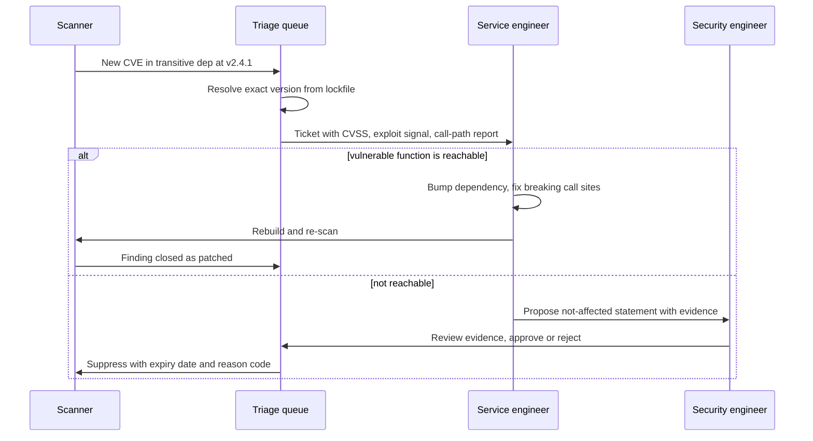
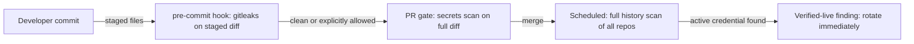
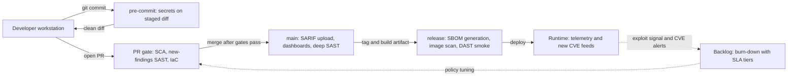

# The AppSec Toolchain: SAST, SCA, Secrets, and DAST

## Overview

Every modern CI pipeline runs some combination of static analysis (SAST), dependency scanning (SCA), secret detection, and dynamic testing (DAST) — the scanner stack that turns "we should write secure code" into gate decisions on individual pull requests. The interview question is never "what does SAST stand for"; it is operational: "how do you keep 400 services patched without drowning your engineers in findings?" Answering it requires knowing what each scanner class actually sees, what it misses, what it costs in runtime, and how findings flow into a triage process developers do not learn to hate. This page covers the tooling internals and CI integration patterns; the vulnerability-management workflow those findings feed is covered in [Vulnerability Management](./vulnerability-management.md).

## The Layered Scanner Model

No single scanner sees the whole attack surface. The five classes below are complementary by construction — each one's blind spot is covered by another — which is why mature organizations layer them instead of picking one.

| Scanner class | What it analyzes | Strengths | Blind spots | Runtime cost |
|---|---|---|---|---|
| **SAST** (static) | Source code, ASTs, dataflow graphs | Exact file/line attribution, catches injection and hardcoded credentials in *your* code, pre-runtime | Runtime config, framework magic, dependencies' code, anything needing execution state | Minutes-hours; scales with repo size |
| **SCA** (dependencies) | Manifests, lockfiles, container layers, SBOMs | Complete transitive graphs, license risk, instant response to new CVE feeds | Your own business logic, whether vulnerable code is *reached*, vendored copies | Seconds-minutes per project |
| **Secrets scanning** | Files, diffs, full git history | Catches the single highest-frequency credential leak vector; near-zero cost | Entropy-only misses structured tokens; regex misses novel formats; nothing about secrets already rotated | Milliseconds per commit |
| **DAST** (dynamic) | The running application over HTTP | Sees what an attacker sees: auth flows, headers, runtime config, actual HTTP behavior | Cannot reach unexercised code paths, queues, internal APIs; slow; needs a live environment | Hours per application |
| **IaC scanning** | Terraform, Kubernetes YAML, Dockerfiles | Flags misconfiguration (public S3, privileged pods, open security groups) before deploy | Does not verify what is actually deployed; drift and clickops are invisible | Seconds per repo |

Two consequences of the layering fall out of the table. First, the blind spots interlock: SAST misses the vulnerable dependency, SCA misses that your code never calls it, DAST misses everything behind an unauthenticated queue consumer — so a finding that survives three independent lenses is qualitatively more credible than one that surfaces on a single scanner. Second, the runtime costs are additive, which forces the CI integration patterns discussed later: you cannot run DAST on every commit the way you run secrets scanning, so the pipeline becomes tiered rather than uniform.

The IaC column deserves one concrete instance, because it is the least self-explanatory layer. A scanner reads Terraform or Kubernetes manifests as data, not as deployed state, and flags rule violations: an S3 bucket without `server_side_encryption_configuration`, a pod with `privileged: true`, a security group with `0.0.0.0/0` on port 22, a container image reference without a digest pin. The gaps follow from the model: the scanner sees the *declared* config, not the *applied* config — a drifted resource edited by hand in the console is invisible — and it cannot see code-level issues at all, which is why an IaC finding ("this DB has no encryption flag") and the corresponding SAST finding ("this connection string hardcodes credentials") are two different tools agreeing about one bad design. Multi-cloud rule packs (AWS/Azure/GCP presets) are what make the layer tractable at scale; writing custom checks for org-specific patterns is exactly the same authoring exercise as writing Semgrep rules, one level of abstraction up.

## SAST Internals

### Semgrep: Pattern Rules Over Source

Semgrep treats a security rule as a code pattern that matches against the abstract syntax tree — syntactically close to the target language itself, so a rule reads like the code it detects. A canonical rule disabling TLS verification in Python:

```yaml
rules:
  - id: requests-verify-disabled
    languages: [python]
    message: "TLS certificate verification is disabled in this request"
    severity: WARNING
    metadata:
      cwe: "CWE-295: Improper Certificate Validation"
      owasp: "A07: Identification and Authentication Failures"
    patterns:
      - pattern-either:
          - pattern: requests.get($URL, ..., verify=False, ...)
          - pattern: requests.post($URL, ..., verify=False, ...)
```

The `...` ellipsis is the DSL's workhorse: it matches any argument list, so `requests.get(url, timeout=3, verify=False)` matches without enumerating signatures. Rules compose with boolean operators (`pattern-either`, `patterns`, `pattern-not`) and metavariables (`$URL`) unify identifiers across a match. Because matching is AST-based rather than textual, the rule survives formatting changes that would break a grep, but it does not model dataflow — a rule that flags `requests.get(user_input)` will not follow where `user_input` came from. That boundary is deliberate: keeping rules cheap and local is what makes Semgrep fast enough to run per-commit, with the community rules registry covering the common cases and teams layering org-specific rules on top. The CLI is a single installable binary that runs offline, which matters for regulated environments where code cannot leave the network.

### CodeQL: Dataflow Queries Over a Code Database

CodeQL takes the opposite trade: it extracts the entire repository into a relational database (ASTs, call graphs, type info, dataflow edges) and queries it in QL, a Datalog-family logic language. The standard vulnerability queries are *path queries* — they enumerate flows from modeled sources (HTTP parameters, environment variables) to modeled sinks (`exec`, SQL execution) through taint-tracking analysis:

```ql
// Sketch of a CodeQL path query for SQL injection
import python
from SqlInjection::PathNode source, SqlInjection::PathNode sink
where SqlInjection::flowPath(source, sink)
select sink.getNode(), source, sink,
  "user-controlled data flows to this SQL execution"
```

The theory behind what `flowPath` computes — taint lattices, implicit flows, and why some information leaks are structurally invisible to this kind of analysis — is developed in [Taint Tracking and Information Flow Control](./taint-tracking.md). The operational difference matters for interviews: CodeQL answers questions Semgrep cannot (does this value cross a trust boundary? is this sink reachable from any public entry point?), at the cost of a database build that takes minutes on a large repo and a query model that requires understanding the source/sink/model library rather than writing rules that look like code. Both tools ship results as SARIF, the OASIS format GitHub code scanning ingests natively.

### Why AST-Only Analysis Misses Taint

An AST matcher sees one expression at a time. It cannot answer whether the string argument to `execute()` originated from `request.args`, because that fact lives in the *call graph and dataflow graph*, not in any single syntax tree node. The classic false-negative pair: user input that flows through three helper functions before reaching a sink is invisible to pattern rules, while a constant string passed to a sink generates a false alarm only if the rule is written carelessly. This is why the two tools coexist — Semgrep for the broad, cheap, per-commit layer; CodeQL (or equivalent) for the deeper per-merge analysis where minutes of runtime are acceptable. It is also why "we run Semgrep, so we have SAST coverage" is a weak interview answer: pattern rules are necessary but are not taint analysis.

### Incremental vs Whole-Repo Analysis

The economics differ sharply. Secrets scanning and SCA run on a diff in milliseconds. Semgrep re-analyzes changed files plus their imports in seconds — incremental by file. CodeQL-style database analysis is whole-repo by construction: the database must be rebuilt whenever dependencies or the code changes materially, which is why GitHub runs it as a scheduled workflow plus an incremental PR diff analysis rather than on every push. Monorepos make this distinction existential — a 10-GB repository cannot afford a 40-minute SAST run per commit, so pipelines move deep analysis to merge queues or nightly jobs, and per-commit gates get the cheap scanners only.

## SCA and Dependency Analysis

### Direct vs Transitive Graphs and Resolution

Your application depends on 30 libraries directly, but those depend on 1,400 more transitively — the transitive set is where nearly all CVE exposure lives, because nobody reviews their dependencies' dependencies. The resolution question is *what the scanner reads*. Reading the manifest (`package.json`, `requirements.txt`) gives intent but not truth: versions are ranges, and what actually got installed is recorded in the lockfile (`package-lock.json`, `poetry.lock`) — see [Lockfiles and Pinning](../../supply-chain/lockfiles-pinning.md). Scanning manifests therefore reports on a version range that may not match deployed reality, while lockfile-aware scanners resolve the exact installed versions and their own dependency graphs. OSV-Scanner exists precisely for this: it queries the OSV database with lockfile-aware version resolution rather than pattern-matching filenames, which is where simpler scanners quietly go wrong (multiple ecosystems define a package named the same thing with different version schemes).

An SBOM (software bill of materials) is the third resolution layer — a document describing what a *built artifact* contains, rather than what a source tree requested. Syft generates SBOMs from container images and filesystems; Grype matches them against vulnerability feeds. The distinction matters operationally: a lockfile says what `main` would build today, an SBOM says what `payments-api:2.3.1` in the registry actually contains, and incident response runs against deployed artifacts. The SBOM/SLSA machinery — CycloneDX vs SPDX, provenance, VEX attestations — is covered in [SBOM and SLSA](../../supply-chain/sbom-slsa.md) and [Supply Chain Security](../supply-chain-security.md).

### Tool Division of Labor

| Tool | Role | Notes |
|---|---|---|
| Trivy | One scanner for images, filesystems, git repos, IaC, and secrets; SBOM generation built in | The "do everything" default in CI; single binary, offline DB updates supported |
| Syft | SBOM generation from images and directories | Feeds Grype; CycloneDX/SPDX output |
| Grype | Vulnerability matching against an SBOM | Pair = generate once, match against fresh feeds repeatedly |
| OSV-Scanner | Lockfile-aware scanning against the OSV database | Best version-resolution correctness; call-analysis options for reachability |
| Dependency-Track | Consumes CycloneDX SBOMs continuously and tracks component risk over time | The platform layer: portfolios, policy, VEX; not a CI gate, a standing service |

The usual production shape: Trivy or Syft+Grype as the CI gate per build, OSV-Scanner for source-repo scanning with better resolution, and Dependency-Track (or an equivalent) as the standing platform that answers "which of our 400 services contain component X" in minutes rather than a week of grepping registries — the Log4Shell question, which [SBOM and SLSA](../../supply-chain/sbom-slsa.md) works through in detail.

### Reachability: The 2024+ Frontier

A vulnerable function in a library you never call is a patching task; a vulnerable function on an attacker-reachable path is an incident waiting for a trigger. Reachability analysis answers "is the vulnerable code actually executed?" — by call-graph analysis on your compiled artifacts (is `org.apache.logging.log4j.core.lookup.JndiLookup` present *and* invoked?), by call-path reporting in SCA tools, or by VEX attestations a supplier publishes stating "not affected: the vulnerable code path is disabled in our configuration." The practical effect on triage economics is dramatic: teams that gate on reachability typically find that a majority of high-severity SCA findings are unreachable, so effort concentrates on the minority that matter. The triage conversation this produces is worth rehearsing for interviews — it is a sequence, not a debate:



The expiry date on a suppression is not bureaucratic decoration: unreachable-today findings become reachable next quarter when someone adds the call, so suppressions without expiry rot into silent risk.

## Secrets Scanning

### Detection: Regex vs Entropy vs Verification

Three detection mechanisms, three failure profiles. **Regex rules** match known formats (`AKIA[0-9A-Z]{16}` for AWS keys, `ghp_[A-Za-z0-9]{36}` for GitHub PATs) — high precision for known formats, useless for novel ones. **Entropy analysis** flags high-randomness strings (base64 blobs, hex) — catches unknown token formats but false-positives on hashes, compiled artifacts, and test fixtures, so entropy-only scanning is never run alone. **Verification** is the decisive third mechanism: TruffleHog ships 800+ credential detectors, most of which verify whether the secret still works by making a live API call — a finding that says "this AWS key is *active*" is a different operational object than one that says "this looks like a key," and teams rank verified-live findings above everything else in the queue. Gitleaks covers git history, working trees, and streams with TOML-defined rules; it is the common choice for the fast per-commit lane. The rotation mechanics once a secret is confirmed live — why revocation order and log review matter — are covered in [Secrets Management](../secrets-management.md).

### Placement: Pre-Commit vs CI vs History



The three lanes catch different populations. Pre-commit (a local hook, or a server-side equivalent) stops the secret before it exists in any remote — cheapest to fix, weakest enforcement since hooks are trivially skipped. The PR gate is the enforced control: blocking a merge because a key appeared in a diff. Full-history scans catch what predates the controls — every organization that enables history scanning for the first time finds credentials in old commits, which is why "rotate first, then purge history" is the standing guidance (purging without rotation just documents the secret's former location). The bitter operational truth: a secret that reached a public repo is compromised the moment crawlers find it, which is measured in minutes for popular platforms, so detection latency is the real metric, not detection capability.

## DAST and the ZAP Place

DAST tests the running application the way an attacker would: no source access, just HTTP. OWASP ZAP is the open-source standard — an interception proxy plus active scanner, scriptable through its API, with Docker images purpose-built for CI scanning and an add-on marketplace for scan policies. Where it sits in a pipeline: slow and noisy compared to a commercial scanner, but infinitely cheaper and fully scriptable, which makes it the default for scheduled deep scans and smoke-level checks rather than per-commit gating. Two ZAP configurations matter in practice:

- **Authenticated scanning.** Most of a modern application sits behind login, and an unauthenticated DAST run sees only the login page. You hand ZAP a session mechanism — replayed session token, scripted login via the API, or a browser-recording of the login flow it can replay — and its crawl expands to the actual surface. Authenticated DAST finding broken access control (change the object ID in the URL, get another tenant's data) is the class of bug SCA and secrets scanning can never see, and it is consistently near the top of the OWASP Top 10's real-world impact list.
- **API-spec-driven scanning.** An OpenAPI document converts DAST from crawling-guesswork to systematic coverage: ZAP imports the spec, generates requests for every operation, and fuzzes parameters with its standard payloads. Spec-driven scanning also covers the shadow-API problem — if the spec says the app has 40 endpoints and DAST can only reach 35, you have discovered either undocumented endpoints or spec drift, both findings in themselves. The API-specific vulnerability classes (BOLA, broken function-level authorization) are enumerated in the OWASP API Security Top 10, and the interactive-testing counterpart to automated DAST (Burp, manual exploration) is covered in [Web Security](../web-security.md).

Operational tuning separates useful DAST from checkbox DAST. Scan policies should be trimmed to what the application stack can express (there is no SQL injection to find in an API that only proxies to a document store, and every alert to that effect is noise to be suppressed with a reason code). Active scanning needs rate limiting and an allowlist of safe targets — a ZAP box pointed at a staging environment that shares a database with billing is an outage story waiting to be written into a postmortem, which is why DAST targets are ephemeral environments seeded with synthetic data, never production mirrors. Finally, DAST findings lack file/line attribution by nature — they are request/response pairs — so the triage step includes mapping an alert back to a code location, which is exactly the reverse of SAST's workflow and why the two tiers are staffed differently.

## Noise Economics: Severity Is Not Priority

The scanner stack on a mid-size organization produces tens of thousands of open findings; the median developer will read approximately none of them if the queue is unmanaged. The failure cliff is well-documented in every security-metrics survey: above some alert load, developers stop reading alerts entirely, and the security program degrades from "gate" to "background noise that gets bulk-dismissed" — at which point the genuinely critical finding drowns in the same gutter as the tenth redundant ESLint warning. Managing the economics:

- **Severity is a property of the finding; priority is a property of the finding *in your system*.** A CVSS 9.8 in a library your code never calls, on an internal tool with no internet ingress, is not a 9.8 priority. Prioritization layers exploit signal (KEV listings, EPSS probability), reachability, and asset criticality on top of the base score — the funnel mechanics are [Vulnerability Management](./vulnerability-management.md)'s subject.
- **False-positive rates are real and should be measured.** Untuned SAST on a large unfamiliar codebase commonly produces false-positive rates in the 25-40% range in practitioner reports; SCA false positives are structural (the vulnerable code is present but unreachable — reachability analysis, again, is the fix); entropy-based secret scanning drowns in hashes and test keys. Every scanner needs a tuning budget in its first quarter, and "FP rate by rule" belongs on the security team's dashboard next to the finding count.
- **Suppression hygiene is a control, not an admission of failure.** The alternative to suppressions is alert fatigue, which is worse. A disciplined suppression has four fields: reason code (false positive / not reachable / accepted risk), approver, expiry date, and link to evidence. CI can then enforce invariants: expired suppressions reopen, suppressions without owners fail audits, and the suppression count per repository is itself a signal (a repo with 400 suppressions is a repo nobody analyzed).

## CI Integration Patterns

### Merge-Blocking vs Advisory Tiers

Gating everything is how you teach the organization to hate the security tooling; gating nothing is how you get Log4Shell in 400 services. Production pipelines tier the scanners:

| Tier | Scanners | Behavior | Rationale |
|---|---|---|---|
| Blocking, per-commit | Secrets, lint-level SAST, IaC | Merge blocked on finding | Millisecond-cheap, high precision, irreversible-if-leaked |
| Blocking, per-PR | SCA on lockfiles, new SAST findings only | Merge blocked on *new* critical findings | Existing debt is tracked, not re-flagged |
| Advisory | Full SAST, DAST smoke | Dashboard + ticket, no gate | Too slow or too noisy for a gate |
| Scheduled | Whole-repo SAST, authenticated DAST, history secrets scan | Weekly/nightly report with MTTR tracking | Depth that cannot pay for itself per-commit |

The diff-aware principle is what makes tiers workable: a PR gate evaluates *new* findings introduced by the diff (SARIF results correlated against the base branch), so a repository with 3,000 pre-existing findings does not block its 4,000th PR. Existing debt belongs to the backlog process with its own burn-down target — not to the engineer who touched line 12 of a 10,000-line file.

The whole structure compresses into a single commit's journey through the pipeline — scanners attach at different stages, and the feedback loop closes when runtime telemetry feeds new findings back to the PR gate's policy:



Reading the diagram as a latency budget: the two dashed return edges are where most programs leak time. Runtime-to-backlog (the CVE lands on a component you ship) is bounded by feed polling and SBOM freshness; backlog-to-policy (the finding class becomes a gate rule) is bounded by the suppression and triage hygiene from the previous section. A pipeline whose gates never learn from runtime is a pipeline that blocks on the wrong things forever.

### SARIF and Diff-Aware Mechanics

SARIF (Static Analysis Results Interchange Format, an OASIS standard) is the interchange that decouples scanners from consumers: Semgrep, CodeQL, Trivy, and most commercial tools all emit it, and GitHub code scanning ingests it to produce per-PR annotations from the same result model. A pipeline step is a scanner + a SARIF emit + an upload; the gating logic (which severities block, whether only new findings count) lives in configuration, not in scanner choice, which means you can tighten policy without re-platforming. For monorepos, two scaling patterns dominate: path-filtered triggers (run the Java SAST only when Java changed) and merge-queue batching (run deep analysis once per batched merge rather than per PR). Both trade a little detection latency for a pipeline that finishes before the developer's coffee.

## Metrics That Matter

Four metrics survive contact with production. **MTTR for critical vulnerabilities** — median days from detection to remediation, tracked per severity tier; industry benchmarks commonly cite ~30-day medians for high-severity findings and far longer tails, and the DORA-style move is to treat it as a distribution (p50, p90), not an average, since averages hide exactly the stuck long tail. **Escape rate** — findings per severity class discovered *after* merge versus at gate; an escape rate near zero on blocking tiers means the gates are calibrated, while a high escape rate means the fast scanners are missing what the slow ones find and the tier boundaries need adjusting. **Scan coverage** — fraction of services/repositories actually in scope of each scanner; the number is always lower than leadership assumes (unscanned terraform repos, Dockerfiles outside CI, forked services in the monorepo's blind corner) and it is the denominator that makes every other metric honest. **Mean time-to-triage** — the gate between detection and any human seeing the finding; unmeasured, it silently dominates MTTR because the queue backlog is invisible until someone computes it. The SRE practice of setting explicit SLOs against these targets — and treating the error budget as a prioritization currency rather than a report card — transfers directly; see [SLOs and Error Budgets](../../sre/slo-error-budget.md).

## LLM-Era Additions

Three changes arrive with LLM-generated code in the pipeline. First, **volume**: AI assistants generate code at a rate that shifts the bottleneck from writing to reviewing, and SAST becomes the reviewer that never gets tired — but generated code also hallucinates plausible-but-wrong API usage that pattern rules flag more often, so expect FP tuning budgets to grow. Second, **provenance of dependencies**: models confidently recommend packages that do not exist, and attackers pre-register those names (slopsquatting) — the dependency-confusion class of attack with generated names, covered in [Dependency Confusion](../../supply-chain/dependency-confusion.md), now includes packages invented by the model itself. Third, **prompt-injected tool use**: an agent with write access to your repo and read access to untrusted content (issues, web pages) can be steered to exfiltrate secrets or introduce a vulnerability, which is the OWASP Top 10 for LLM Applications' "excessive agency" and "insecure output handling" entries acting on your CI. The mitigations — least-privilege agent tokens, human approval on write paths, output scanning before execution — are the AppSec toolchain applied to a new class of actor; see [LLM Security](../../llm/llm-security.md).

## Interview Questions

1. **Your CI runs SAST, SCA, secrets, and IaC scanning. Why do you need four tools?** Because their blind spots interlock: SAST sees your code but not dependencies; SCA sees dependencies but not whether you call the vulnerable function; secrets scanning sees credentials but nothing else; IaC scanning sees configuration but not code. One example walks through all four: a PR adds a dependency with a known RCE, imports it in a public endpoint, wires the endpoint's URL in a public Terraform security group, and includes an AWS key in a test fixture — each scanner catches exactly one of the four. The runtime-cost column is the second half of the answer: the cheap scanners gate per-commit, the expensive ones run per-merge or scheduled, which is only rationalizable if you understand what each buys.

2. **What is the difference between how Semgrep and CodeQL find vulnerabilities?** Semgrep matches pattern rules against the AST — the rule looks like the code it detects, runs in seconds, and is ideal for per-commit gating and org-specific conventions, but it is pattern-local: no dataflow. CodeQL extracts the whole repo into a relational database and runs QL path queries that model sources, sinks, and taint propagation, so it answers "does user input reach this sink" at the cost of a minutes-long database build. The consequence is layering: Semgrep per-commit, CodeQL per-merge or scheduled. And AST-only analysis structurally misses taint — a value flowing through three helper functions to a sink is invisible to any single-expression pattern.

3. **A CVSS 9.8 CVE lands in a library you use. What happens in the next 24 hours?** First, resolve what you actually ship: lockfile or SBOM lookup for exact versions across deployed artifacts, not manifests. Second, exploitability: is it in CISA KEV, what does EPSS say, is there a public PoC? Third, reachability: is the vulnerable function on an executable path in our services, ideally by call-graph analysis or a VEX not-affected statement. Fourth, tier: KEV-listed and reachable on an internet-facing service is an emergency patch; unreachable and unexploited goes to the standard SLA lane. The interviewers are testing whether severity is your input or your answer — it is one input among four.

4. **How do you keep secret scanning from being either useless or all-noise?** Three detection mechanisms layered: regex for known formats, entropy for novel ones, and verification to confirm a candidate credential is live — a verified-live finding outranks everything. Placement matters more than detection: pre-commit hooks stop leaks cheaply but are skippable, PR gates are the enforced control, and scheduled full-history scans are what surface the pre-existing debt. And the operational rule that shows seniority: rotate first, purge history second — a secret in any remote is compromised within minutes of crawler discovery, so detection latency is the metric, not detection capability.

5. **How do you prevent the "developers stop reading alerts" cliff?** Measure the queue the way SREs measure toil: false-positive rate per rule, mean time-to-triage, and open-findings age distribution. Gate only high-precision, cheap scanners per-commit and evaluate PRs on *new* findings only (SARIF diff-aware correlation against the base branch), so existing debt flows to a backlog with its own burn-down target instead of blocking every engineer. Suppressions are a control, not a failure: reason code, approver, expiry, evidence — and expired suppressions reopen automatically. The alternative, unmanaged alert volume, is not neutral; it trains the organization to bulk-dismiss, at which point your critical finding has the same visibility as a lint warning.

6. **What changes in this toolchain when half your code is LLM-generated?** Volume shifts the bottleneck to review, making SAST the tireless first reviewer but also growing the FP-tuning budget since generated code hallucinates plausible-but-wrong patterns. Dependency risk mutates: models recommend non-existent packages that attackers pre-register (slopsquatting), extending dependency-confusion attacks. And agents with repo write access plus read access to untrusted content become a new injection surface — excessive agency in OWASP LLM Top 10 terms — so agent tokens get least-privilege scopes, write paths get human approval, and generated changes pass through the same scanner gates as human ones.

## Key Takeaways

- The five scanner classes (SAST, SCA, secrets, DAST, IaC) have interlocking blind spots — layering is a design decision, not vendor multiplicity, and each layer's runtime cost determines which CI tier it can gate.
- Semgrep is cheap AST pattern-matching (per-commit); CodeQL is whole-repo relational dataflow analysis (per-merge) — AST-only analysis structurally cannot see taint crossing function boundaries.
- SCA resolution has three layers: manifests (intent), lockfiles (what would build), SBOMs (what the deployed artifact contains); incident response runs against the third.
- Reachability analysis — "is the vulnerable function actually called?" — is the 2024+ SCA frontier; it converts most high-severity findings into documented non-issues and concentrates effort on the rest.
- Secret scanning works because of placement and verification: pre-commit hooks, enforced PR gates, full-history sweeps, with verified-live findings outranking everything and rotation preceding history purge.
- Severity is a property of the finding; priority is a property of the finding in your system — exploit signal (KEV, EPSS), reachability, and asset criticality sit between them.
- SARIF plus diff-aware correlation makes tiered gating tractable: block new critical findings per-PR, manage existing debt in a backlog with burn-down targets, and suppress with reason, owner, expiry, evidence.
- Track MTTR as a distribution, escape rate per gate tier, scan coverage as the honest denominator, and time-to-triage as the invisible queue that dominates everything.

## References

- [Semgrep documentation](https://semgrep.dev/docs/) — pattern DSL, rule structure, and the community rules registry
- [Semgrep source repository](https://github.com/semgrep/semgrep)
- [GitHub CodeQL](https://codeql.github.com/) — QL language, query libraries, and code-scanning integration
- [CodeQL source repository](https://github.com/github/codeql)
- [Trivy](https://trivy.dev/) — unified scanner for images, filesystems, IaC, and secrets
- [Trivy source repository](https://github.com/aquasecurity/trivy)
- [Grype (with Syft SBOM generation)](https://github.com/anchore/grype)
- [OSV-Scanner](https://google.github.io/osv-scanner/) — lockfile-aware scanning
- [OSV database](https://osv.dev/) — the vulnerability feed OSV-Scanner queries
- [Dependency-Track](https://dependencytrack.org/) — continuous SBOM consumption and component-risk tracking
- [Gitleaks](https://github.com/gitleaks/gitleaks) — git history, working-tree, and stream secret scanning
- [TruffleHog](https://github.com/trufflesecurity/trufflehog) — 800+ detectors with live verification
- [OWASP ZAP](https://www.zaproxy.org/) — interception proxy and active scanner with CI Docker images
- [OWASP Top 10](https://owasp.org/Top10/) — the risk categories the toolchain maps to
- [OWASP GenAI — Top 10 for LLM Applications](https://genai.owasp.org/) — excessive agency and insecure output handling

## Cross-References

- [Taint Tracking and Information Flow Control](./taint-tracking.md) — the theory (lattices, implicit flows) behind CodeQL-style dataflow analysis.
- [Vulnerability Management](./vulnerability-management.md) — the prioritization funnel and patch-SLA process that consumes these scanner outputs.
- [Supply Chain Security](../supply-chain-security.md) — SLSA levels, SBOM fundamentals, and code signing.
- [Supply Chain Advanced](./supply-chain-advanced.md) — reproducible builds, Sigstore keyless signing, and attestation internals.
- [Secrets Management](../secrets-management.md) — vaulting, dynamic credentials, and the rotation workflow a verified-live finding triggers.
- [SBOM and SLSA](../../supply-chain/sbom-slsa.md) — the Log4Shell-day exercise and provenance machinery behind SBOM-based response.
- [Lockfiles and Pinning](../../supply-chain/lockfiles-pinning.md) — the lockfile layer SCA resolution depends on.
- [Dependency Confusion](../../supply-chain/dependency-confusion.md) — the typosquatting/slopsquatting attack class behind LLM-era dependency risk.
- [CI/CD Pipelines](../../cloud/cicd/pipelines.md) — the pipeline stages these scanner tiers plug into.
- [Policy as Code](../../cloud/policy-as-code.md) — OPA/Kyverno enforcement patterns adjacent to scanner gating.
- [LLM Security](../../llm/llm-security.md) — prompt injection and agent security for the LLM-era additions.
- [SLOs and Error Budgets](../../sre/slo-error-budget.md) — the SLO discipline behind security-metric targets.
