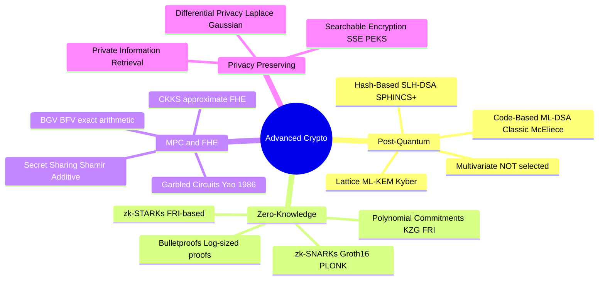

# Advanced Cryptography

## Overview

This chapter covers the cryptographic primitives that define the next decade of secure computing: post-quantum algorithms standardized by NIST, zero-knowledge proof systems enabling privacy-preserving verification, multi-party computation and fully homomorphic encryption for computation on encrypted data, searchable encryption and private information retrieval for privacy-preserving queries, and differential privacy for statistical analysis with formal privacy guarantees. These topics are at the intersection of cryptography, complexity theory, and systems engineering. See [../cryptography.md](../cryptography.md) for symmetric/asymmetric fundamentals and [../../cryptography/post-quantum.md](../../cryptography/post-quantum.md) for a focused PQC overview.



## Post-Quantum Cryptography

Classical public-key cryptography (RSA, ECC over integer and binary fields, Diffie-Hellman) is broken by Shor's algorithm on a sufficiently large quantum computer. Shor's algorithm factors integers and computes discrete logarithms in polynomial time on a quantum computer, rendering RSA-2048, ECDSA P-256, and X25519 all insecure against a quantum adversary. NIST's Post-Quantum Cryptography standardization project (2016–2024) evaluated dozens of candidate algorithms and selected four for standardization.

### The Quantum Threat Timeline

| Year | Milestone | Implication |
|------|-----------|-------------|
| 1994 | Shor's algorithm published | Theoretical break of RSA/ECC/DH |
| 2001 | Shor's algorithm demonstrated on 7-qubit NMR (factored 15) | Proof of concept |
| 2012 | Factored 21 using 4-qubit photonic computer | Scaling demonstrated |
| 2016 | NIST PQC standardization launched | Industry response |
| 2023 | IBM 1,121-qubit Condor processor | Hardware scaling (but error-prone) |
| 2024 | NIST PQC standards published (FIPS 203/204/205/206) | Migration guidance available |
| 2025–2030 | Estimated "harvest now, decrypt later" window | Encrypted data captured today can be decrypted when QC matures |
| 2030–2040 | Estimated timeline for cryptographically-relevant QC | RSA/ECC fundamentally broken |

The "harvest now, decrypt later" threat is the immediate concern: nation-state adversaries are capturing encrypted traffic today (TLS sessions, VPN tunnels, encrypted backups) with the expectation that a future quantum computer will decrypt them. Organizations with long-duration confidentiality requirements (>10 years — healthcare, government, military, intellectual property) must migrate to PQC now.

### NIST PQC Standards (2024)

| Algorithm | FIPS | Type | Use Case | Public Key | Ciphertext/Signature | Security Level |
|-----------|------|------|----------|------------|---------------------|----------------|
| **ML-KEM** | FIPS 203 | Lattice (Module-LWE) | Key encapsulation | 1,184 B (768) | 1,088 B | NIST Level 1/3/5 |
| **ML-DSA** | FIPS 204 | Lattice (Module-LWE) | Digital signatures | 1,952 B (65) | 3,309 B | NIST Level 2/3/5 |
| **SLH-DSA** | FIPS 205 | Hash-based | Digital signatures | 32 B | 7,856 B (L2) | NIST Level 1/3/5 |
| **FN-DSA** | FIPS 206 | Lattice (Fiat-Shamir) | Digital signatures | 1,568 B | 2,420 B | NIST Level 2/3/5 |

Note: "NIST Level 1/3/5" indicates the algorithm supports multiple parameter sets with different security levels. Level 1 ≈ AES-128, Level 3 ≈ AES-192, Level 5 ≈ AES-256.

## Lattice Cryptography

Lattice-based cryptography relies on the **hardness of lattice problems** — computational problems on high-dimensional lattices that are believed to be hard for both classical and quantum computers. The two foundational problems are: **Shortest Vector Problem (SVP)** — find the shortest non-zero vector in a lattice; and **Closest Vector Problem (CVP)** — find the closest lattice point to a given target. Both are NP-hard (under randomized reductions) in their exact forms, and no polynomial-time quantum algorithm is known for their approximate versions.

### Learning With Errors (LWE)

The LWE problem (Regev, 2005): given a random matrix `A ∈ Z_q^{m×n}` and a vector `b = A·s + e` (where `s ∈ Z_q^n` is a secret vector and `e ∈ Z_q^m` is a small error vector sampled from a discrete Gaussian), recover `s`. The error `e` makes this computationally hard despite the system being linear — without errors, Gaussian elimination solves it in polynomial time.

```
LWE Problem:
  Given: A (random m×n matrix), b = A·s + e (small error e)
  Find:  s (secret vector)

  A = | 2  7  1 |     e = | 1  0  -1  2  |     b = A·s + e
      | 5  3  8 |         | -1  1   1  0  |     = | 2·5 + 7·3 + 1·2 + 1 | = ...
      | 1  4  6 |         | 0  2  -1  1  |        | ...                  |
      | 8  2  5 |         | 1  0   2 -1  |        | ...                  |
```

### Structured Variants

| Variant | Structure | Efficiency vs. Security |
|---------|-----------|------------------------|
| **LWE** (plain) | No structure | Strongest security, least efficient (large keys/ops) |
| **Ring-LWE** | Polynomial ring Z_q[x]/(x^n+1) | Compact keys, fast operations, slight security reduction |
| **Module-LWE** (ML-KEM, ML-DSA) | Module over polynomial ring | Balanced: efficient + security reduction to plain LWE |
| **NTRU** | Convolution ring | Efficient, but older formulation with less clean security proof |

**Module-LWE** (used in ML-KEM and ML-DSA) provides the best balance: it operates on vectors of polynomials (a "module") rather than single polynomials, giving better efficiency than plain LWE while maintaining a clear security reduction. Key sizes are practical for TLS (1–2 KB public keys), and operations are fast enough for real-world use.

### Code-Based Cryptography: Classic McEliece

The McEliece cryptosystem (1978) is based on the hardness of decoding a random linear code. The secret key is a Goppa code (an error-correcting code with an efficient decoding algorithm); the public key is the generator matrix of the Goppa code disguised by a random permutation and scrambling matrix.

```
Key Generation:
  Secret: Goppa code G (efficient decoding), permutation matrix P, scramble matrix S
  Public: G' = S · G · P  (looks like a random linear code)

Encryption:
  Ciphertext: c = m · G' + e  (add error e)
  The legitimate receiver decodes using G (corrects error e)

Security:
  Attacker sees random-looking code G' and must decode without knowing
  the hidden Goppa code structure. General decoding is NP-hard.
```

**Advantages**: Extremely conservative security assumption (coding theory is well-studied since the 1950s, no quantum speedups known for decoding). Immune to all known quantum algorithms. **Disadvantage**: Huge public keys (261 KB for 128-bit security with binary Goppa codes), making it impractical for most TLS scenarios. Used for key encapsulation in constrained environments where key transmission cost is acceptable (e.g., long-lived key establishment).

### Hash-Based Signatures: SLH-DSA (SPHINCS+)

Hash-based signatures are the most conservative post-quantum construction: security relies **only** on the security of the underlying hash function (SHA-256 or SHAKE-256). No lattices, no codes, no isogenies — just hash functions, which are believed to resist quantum attacks (Grover's algorithm provides only a quadratic speedup, so doubling the hash output size provides equivalent security).

**Structure**: A hypertree of one-time signatures (WOTS+ — Winternitz One-Time Signature+). The root of the Merkle tree is the public key. Each signature reveals one WOTS+ signature (for a leaf) and the authentication path (Merkle proof) from that leaf to the root. SLH-DSA is stateless (unlike XMSS/LMS which require state tracking) — each signature uses a different leaf computed via a FORS (Forest of Random Subsets) layer, so no counter state is needed.

**Trade-off**: Large signatures (7.9–49.9 KB depending on parameter set) but small public keys (32 bytes) and minimal security assumptions. SLH-DSA is suitable for firmware signing, certificate signing, and code signing where signature size is less critical than long-term security assurance.

## Zero-Knowledge Proofs

A zero-knowledge proof allows a prover to convince a verifier that a statement is true without revealing any information beyond the truth of the statement. Formally, ZK proofs satisfy three properties: completeness (honest prover convinces honest verifier), soundness (cheating prover cannot convince, except with negligible probability), and zero-knowledge (verifier learns nothing beyond the statement's truth).

### zk-SNARKs

**Succinct Non-interactive Arguments of Knowledge**. A zk-SNARK proof is very small (hundreds of bytes) and verification is extremely fast (a few milliseconds, typically 3–6 pairings on elliptic curves), regardless of the complexity of the computation being proven. The trade-off: a trusted setup ceremony is required to generate the proving/verification keys, and the setup must be performed by multiple independent parties (powers of tau ceremony) to ensure no single party retains the "toxic waste" that could forge proofs.

**Groth16** (used by Zcash, Tornado Cash): The most efficient SNARK for arithmetic circuits over a prime field. Proof size: 192 bytes (3 group elements in G1). Verification: 3 pairings (~1ms). Proving time: O(n) where n is the circuit size (with FFT-based multi-exponentiation). Requires a per-circuit trusted setup — a new ceremony for each new circuit.

```python
# Conceptual Groth16 flow
# 1. Compile computation to arithmetic circuit: C(x, w) = 0
#    x = public inputs, w = private witness (secret)
# 2. Trusted setup: produces proving key (pk) and verification key (vk)
#    Uses random toxic waste τ; if τ is destroyed, no one can forge proofs
# 3. Prove: proof = prove(pk, x, w)  — O(n) group operations
# 4. Verify: accept/reject = verify(vk, x, proof)  — 3 pairings

# Example: prove knowledge of preimage of hash
# "I know w such that SHA256(w) == x" (simplified)
# Circuit: compute SHA256(w) in R1CS, constrain output = x
# Prover knows w, verifier sees x and proof
```

**PLONK** (used by zkSync, Aztec, Polygon zkEVM, Scroll): Universal/updatable setup — a single "powers of tau" ceremony generates a Structured Reference String (SRS) that works for *any* circuit up to a certain size. New circuits can use the same SRS without a new ceremony. Proof size: ~400–500 bytes (4–5 group elements). Supports custom gates for efficient specialized operations (e.g., Poseidon hash, EC addition). The per-circuit setup is replaced by a circuit-specific preprocessing step (no new ceremony).

### zk-STARKs

**Scalable Transparent ARguments of Knowledge**. No trusted setup (transparent — only relies on hash functions, no elliptic curve assumptions). Proof sizes are larger (~200 KB for equivalent security) but the setup is completely trustless — anyone can verify the proof with only the public parameters and the computation definition.

**How STARKs work**: The computation is represented as an Algebraic Intermediate Representation (AIR) — a set of polynomial constraints over an execution trace. The prover encodes the trace as a polynomial, uses the FRI (Fast Reed-Solomon Interactive Oracle Proof of Proximity) protocol to prove the polynomial is low-degree (which implies it satisfies the constraints), and the verifier checks a small number of randomly sampled evaluations. The security relies on the collision resistance of the hash function (typically BLAKE2 or SHA3).

```
STARK proof generation:
1. Express computation as AIR (trace polynomial constraints)
2. Prover commits to trace polynomial f(x) using Merkle tree
3. Prover proves f(x) satisfies all constraints via polynomial IOP
4. Prover proves f(x) is low-degree via FRI protocol:
   - Fold polynomial: f(x) → f_even(x²) + x·f_odd(x²) (reduces degree by 2)
   - Commit to folded polynomial
   - Repeat log₂(deg) times → constant polynomial
   - Verifier checks random evaluation points at each fold
5. Verifier checks: random spot checks on Merkle commitments + FRI consistency
```

### Bulletproofs

Bulletproofs (Bünz et al., 2018) provide short proofs for arithmetic circuits *without* a trusted setup (like STARKs) and with relatively small proof sizes (logarithmic in circuit size, typically ~1–3 KB). Used by Monero for confidential transactions (proving that transaction inputs sum to outputs without revealing amounts). Bulletproofs use inner product arguments over Pedersen commitments, making them efficient for range proofs (proving a committed value is in [0, 2^n]).

### ZKP Comparison Table

| Property | Groth16 | PLONK | zk-STARK | Bulletproofs |
|----------|---------|-------|----------|-------------|
| Trusted setup | Per-circuit | Universal (one-time) | None | None |
| Proof size | ~192 bytes | ~400 bytes | ~200 KB | ~1–3 KB |
| Verification time | ~1 ms (3 pairings) | ~2 ms | ~10 ms | ~10 ms |
| Proving time | Fast (O(n) with FFT) | Medium | Fast (O(n log n)) | Medium |
| Quantum resistant | No (pairing-based) | No (pairing-based) | Yes (hash-based) | No (Pedersen commitments) |
| Arithmetic gates | Efficient | Custom gates | AIR constraints | R1CS |
| Use cases | Zcash, Tornado Cash | zkSync, Aztec, Scroll | StarkNet, dYdX, Starkware | Monero, Chainlink |

### Polynomial Commitments

Polynomial commitments are a core building block of modern ZK systems. They allow a prover to commit to a polynomial `f(x)` of degree `d` and later prove evaluations `f(r) = v` without revealing the full polynomial. The commitment size and opening proof size should be small (ideally constant or logarithmic in `d`).

**KZG (Kate-Zaverucha-Goldberg)**: Commitment is a single group element `C = f(τ) · G` where `τ` is the secret from the trusted setup. Opening proof for `f(r) = v` is also a single group element. Verification uses a bilinear pairing: `e(C - v·G, G) = e(W, τ·G - r·G)` where `W` is the opening proof. Used in EIP-4844 (Ethereum's proto-danksharding) for blob data availability.

**FRI (Fast Reed-Solomon IOP of Proximity)**: Used in STARKs. No trusted setup. The prover commits to the polynomial via a Merkle tree, then repeatedly folds the polynomial (halving the degree) while the verifier checks random evaluation points. After `log(d)` folds, the polynomial is constant and easily verified. Opening proof size is `O(log²(d))` — larger than KZG but no trusted setup.

## Multi-Party Computation (MPC)

MPC allows multiple parties to jointly compute a function on their private inputs without revealing those inputs to each other. The result is correct (function computed on actual inputs) but no party learns anything about the others' inputs beyond what the output reveals.

### Garbled Circuits (Yao, 1986)

One party (the "garbler") encrypts ("garbles") a boolean circuit representing the function. Each wire in the circuit has two labels: one representing logical 0, one representing logical 1. The garbler creates truth tables for each gate where the output labels are encrypted with the input labels using double encryption (so only someone holding the correct input label can decrypt the output label).

```
Party A (Garbler)                    Party B (Evaluator)
┌───────────────────┐              ┌───────────────────┐
│ Input: a = 1      │              │ Input: b = 0      │
│ Garble circuit    │              │                    │
│ for f(a,b) = a∧b │              │                    │
│                   │──circuit───▶│ Evaluate circuit   │
│                   │              │ gate by gate       │
│                   │──label_a───▶│                    │
│                   │              │ Get label_b via    │
│                   │              │ Oblivious Transfer  │
│                   │              │ (OT): choose one  │
│                   │              │ of two labels      │
│                   │              │ without revealing  │
│                   │              │ which to garbler   │
│                   │              │ Output: f(1,0)=0   │
└───────────────────┘              └───────────────────┘

Key property: B learns the output f(a,b) but not a.
             A learns nothing about b or the output.
```

### Secret Sharing

**Shamir's Secret Sharing (SSS, 1979)**: A secret `s` is split into `n` shares using a random polynomial `f(x) = s + a₁x + a₂x² + ... + a_{t-1}x^{t-1}`. Share `i` is `f(i)`. Any `t` shares can reconstruct the secret via Lagrange interpolation; fewer than `t` reveal nothing (each share is uniformly random). This is threshold cryptography: `t-of-n` access structure.

```
Example: Share secret s=42 with threshold t=3, n=5
  f(x) = 42 + 7x + 13x²  (random coefficients)
  Share 1: f(1) = 42 + 7 + 13 = 62
  Share 2: f(2) = 42 + 14 + 52 = 108
  Share 3: f(3) = 42 + 21 + 117 = 180
  Share 4: f(4) = 42 + 28 + 208 = 278
  Share 5: f(5) = 42 + 35 + 325 = 402

  Any 3 of {62, 108, 180, 278, 402} can reconstruct s=42
  Any 2 shares reveal nothing (insufficient information)
```

**Additive secret sharing** (for MPC): Split secret `s` into random shares `s = s₁ + s₂ + ... + sₙ (mod p)`. Each party holds one share. A single share is uniformly random (reveals nothing). Addition is local: `s₁ + t₁, s₂ + t₂, ...` gives shares of `s + t`. Multiplication requires interaction (Beaver triples: pre-computed random triples `(a, b, c)` where `c = a·b`, used to multiply shares without revealing them).

### MPC Protocols Comparison

| Protocol | Communication Rounds | Computation | Security Model | Use Case |
|----------|---------------------|-------------|----------------|----------|
| **Yao's Garbled Circuits** | 1 round (after OT) | Heavy for garbler (encrypt all gates) | Semi-honest (passive) | 2-party computation |
| **GMW** | O(depth) rounds | Moderate | Semi-honest or malicious (with cut-and-choose) | Multi-party, general functions |
| **SPDZ** | Constant rounds (online phase) | Heavy offline phase (Beaver triples) | Malicious (active) | High-security multi-party |
| **BMR** | Constant rounds | Moderate (circuit randomization) | Malicious | Multi-party |
| **ABY** | O(1) rounds for arithmetic | Hybrid (arithmetic + binary + Yao) | Semi-honest | ML inference, statistics |

## Homomorphic Encryption

Homomorphic encryption (HE) allows computation on ciphertexts, producing an encrypted result that, when decrypted, matches the result of operating on the plaintexts. This enables outsourcing computation to untrusted servers without revealing the data.

### Types

| Type | Operations Supported | Examples | Noise Growth | Use Cases |
|------|---------------------|----------|-------------|-----------|
| **PHE** (Partially) | One operation: add OR multiply | ElGamal (add), RSA (multiply) | N/A | Voting, e-cash |
| **SWHE** (Somewhat) | Both, limited depth | BGV, BFV | Grows with multiplications | Database queries, simple statistics |
| **FHE** (Fully) | Arbitrary computation | CKKS (approx), TFHE (exact) | Managed via bootstrapping | ML inference, encrypted search |

### BGV and BFV (Somewhat Homomorphic)

Based on the Ring Learning With Errors (RLWE) problem. Supports exact integer arithmetic modulo a plaintext modulus `t`. Encryption adds error `e`; each multiplication approximately doubles the error. After `L` multiplications, the error exceeds the noise budget and decryption fails. **Bootstrapping** (Gentry's technique, 2009) refreshes the ciphertext by homomorphically decrypting it under a fresh key, reducing the noise — but it is computationally expensive (~seconds per bootstrapping).

### CKKS (Approximate FHE for Real Numbers)

CKKS (Cheon-Kim-Kim-Song, 2017) supports approximate real-number arithmetic. Real numbers are encoded into polynomial coefficients (with rounding), and homomorphic operations introduce small approximation errors that compound with each operation. CKKS is ideal for privacy-preserving machine learning: you can evaluate a neural network on encrypted data and get an approximate encrypted result.

```python
# CKKS example (using TenSEAL / Pyfhel)
from tenseal import ts

# Create CKKS context with appropriate parameters
context = ts.context(
    ts.SCHEME_TYPE.CKKS,
    poly_modulus_degree=8192,   # Larger = more capacity, slower
    coeff_mod_bit_sizes=[60, 40, 40, 40, 60]  # Determines noise budget
)
context.global_scale = 2**40  # Scaling factor for encoding

# Encrypt vectors
v1 = ts.ckks_vector(context, [0.1, 0.2, 0.3])
v2 = ts.ckks_vector(context, [0.4, 0.5, 0.6])

# Homomorphic operations (server never sees plaintext)
result = v1 + v2 * 2     # Encrypted: [0.9, 1.2, 1.5]
result_squared = result * result  # [0.81, 1.44, 2.25]
decrypted = result_squared.decrypt()  # [0.81, 1.44, 2.25] (with small error)

# Error accumulates with multiplications
# After ~3-4 multiplications, noise exceeds budget → bootstrapping needed
# Bootstrapping: result = result.bootstrap()  # Expensive (~1-10 seconds)
```

### Performance Reality and Practical Applications

FHE operations are **10,000–1,000,000x slower** than plaintext operations. A single convolutional neural network inference on encrypted data can take minutes to hours. However, practical applications exist for high-value, low-throughput computations:

- **Private ML inference**: Client encrypts their data, sends to server, server runs inference on encrypted model, returns encrypted result. Used by Microsoft (Azure Confidential Computing), IBM, and Zama (Concrete ML library).
- **Private set intersection**: Two parties find common elements in their datasets without revealing non-common elements.
- **Encrypted genomic analysis**: Medical computations on encrypted patient genomes.
- **Financial auditing**: Compute aggregate statistics on encrypted financial data.

Recent advances closing the gap: HEIR compiler (MLIR-based, compiles high-level programs to FHE), hardware accelerators (Darlington FPGA by IBM, CryptoNets ASIC), algorithmic improvements (programmable bootstrapping in TFHE, faster than CKKS bootstrapping by ~10x).

## Searchable Encryption

Searchable encryption allows a client to outsource encrypted data to a server and later search over it without revealing the search queries or the data to the server.

### Symmetric Searchable Encryption (SSE)

The client generates an encrypted inverted index alongside the encrypted data. To search for keyword `w`, the client generates a search token `t_w` (a trapdoor function of the keyword) and sends it to the server. The server uses `t_w` to look up the index and return matching document identifiers — without learning `w` or which specific documents contain `w`.

```
Setup:
  Client builds inverted index: { "crypto": [doc1, doc5, doc9], "security": [doc2, doc5] }
  For each keyword w, compute trapdoor t_w = PRF(key, w)
  Encrypt each keyword in the index: E(t_w) → encrypted entry
  Send encrypted documents + encrypted index to server

Search:
  Client wants to search for "crypto":
  1. Compute t_w = PRF(key, "crypto")
  2. Send t_w to server
  3. Server looks up E(t_w) in index → returns [doc1, doc5, doc9]
  4. Server learns nothing about "crypto" or which docs contain it

  Client decrypts the result and requests specific documents.
```

**Schemes and limitations**:
- **Curtmola et al. (2006)**: Basic SSE with inverted index. Efficient but leaks access patterns (which documents are returned for each query).
- **Forward-private SSE (Bost, 2017)**: Prevents the server from linking a new query to previous queries for the same keyword. Uses a key derivation chain that advances with each update. Does not protect against access pattern leakage.
- **Access pattern leakage**: Even with forward privacy, the server observes *which* documents are returned, *how many* results, and *when* searches happen. Islam et al. (2012) showed that these leakage patterns enable practical attacks that recover significant information about the encrypted data. Fully hiding access patterns requires Oblivious RAM (ORAM), which adds O(log n) overhead per access.

### Public-Key Encrypted Keyword Search (PEKS)

PEKS (Boneh et al., 2004) extends searchable encryption to the public-key setting. A receiver generates a public/secret key pair. Senders encrypt their messages with the public key and attach searchable encrypted keywords. The receiver can generate search tokens with their secret key to search over received messages. This is useful for encrypted email (search encrypted email by keyword without decrypting).

## Private Information Retrieval (PIR)

PIR allows a client to retrieve an item from a database without revealing *which* item was retrieved. The server learns nothing about the client's query.

### Information-Theoretic PIR (itPIR)

The database is replicated across `k ≥ 2` non-colluding servers. The client queries each server for a subset of the data. No single server can determine the client's query, and even if `k-1` servers collude, they learn nothing. The communication cost is sublinear in the database size but requires multiple non-colluding servers — a strong trust assumption.

### Computational PIR (cPIR)

A single server holds the entire database. Security relies on a computational assumption (e.g., hardness of LWE or the DGHV homomorphic encryption scheme). The server processes the entire database (or a large fraction) for each query, making it computationally expensive but requiring only a single server.

**Practical cPIR**: SealPIR (Angel et al., 2018) uses BFV homomorphic encryption to query a 1 GB database with ~10 MB of communication in under 1 second of server computation. Google uses PIR for private contact discovery (determining which of your contacts use a service without revealing your full contact list) — deployed in Google Play Services for Signal integration (2024) and in Google Messages RCS.

### PIR Comparison

| Scheme | Servers | Communication | Computation | Security Basis |
|--------|---------|---------------|-------------|----------------|
| itPIR | 2+ non-colluding | O(√n) per server | O(1) per server | Information-theoretic |
| cPIR (SealPIR) | 1 | O(n^{1/3}) | O(n) | LWE / RLWE |
| cPIR (SimplePIR) | 1 | O(√n) | O(n) | LWE |
| cPIR (XPIR) | 1 | O(log n) (compressed) | O(n) | LWE + symmetric PIR |

## Differential Privacy

Differential privacy (Dwork, McSherry, Nissim, Smith, 2006) provides a mathematical framework for quantifying privacy loss when releasing aggregate statistics about a dataset. The key insight: adding calibrated noise to query results makes it impossible to determine whether any individual's data was included in the dataset.

### Formal Definition

A randomized mechanism `M` satisfies `(ε, δ)`-differential privacy if for all datasets `D₁` and `D₂` differing in exactly one element (adjacent datasets), and for all possible outputs `S`:

```
Pr[M(D₁) ∈ S] ≤ e^ε · Pr[M(D₂) ∈ S] + δ
```

- **ε (epsilon)**: The privacy budget or privacy loss parameter. Smaller ε = stronger privacy. ε < 1 is considered strong privacy; ε ∈ [1, 10] is moderate; ε > 10 is weak (reveals significant information about individuals).
- **δ (delta)**: The probability of a catastrophic privacy failure (a single event that violates ε-differential privacy by an arbitrary amount). Should be cryptographically negligible (< 1/n² or < 2^{-64}).

### Privacy Mechanisms

| Mechanism | Noise Distribution | Sensitivity | Use Case | Properties |
|-----------|-------------------|-------------|----------|------------|
| **Laplace** | Laplace(Δf/ε) | L₁ sensitivity Δf | Real-valued queries (sums, means) | Pure ε-DP (δ = 0) |
| **Gaussian** | N(0, σ²) where σ = Δf·√(2·ln(1.25/δ)) / ε | L₂ sensitivity Δf | Composition of many queries | (ε, δ)-DP |
| **Exponential** | Exp(ε) | L∞ sensitivity | Releasing max/min value | Pure ε-DP |
| **Randomized Response** | Flip with prob 1/(1+e^ε) | Per-item | Local DP (no trusted aggregator) | Pure ε-DP, per-user |
| **Report Noisy Max** | Laplace noise on each value, report max | L∞ | Most frequent item query | Pure ε-DP |
| **Sparse Vector** | Above-threshold mechanism | L∞ | Return top-k items with count | Pure ε-DP |

### Composition and the Privacy Budget

Each query consumes some of the privacy budget ε. After `k` queries on the same dataset, the total privacy loss accumulates:

- **Basic composition**: Total loss ≤ `k · ε`. This is pessimistic — the actual loss grows more slowly.
- **Advanced composition**: Total loss ≤ `ε · √(2k · ln(1/δ')) + k · ε · (e^ε - 1)` for any δ'. Tighter than basic for large `k`.
- **Rényi Differential Privacy (RDP)**: Tracks moment bounds rather than max-divergence. Provides tight composition via Rényi divergence additivity. Used by Google and Apple.
- **Zero-Concentrated DP (zCDP)**: Subcategory of RDP. Composition is simply additive: `(ε₁² + ε₂²)^{1/2}`. Most convenient for analytical calculations.

```python
# Google DP library example
from dp_accounting import rdp_accountant

# Track the privacy budget across multiple queries
accountant = rdp_accountant.RdpAccountant()

for _ in range(100):
    # Each query adds Gaussian noise: Laplace(Δ=1, ε=0.01)
    # Gaussian mechanism with ε=0.01, δ=1e-9
    accountant.compose(
        rdp_accountant.RdpAccountant().compute_rdp(
            noise_multiplier=100.0,  # High noise = low ε
            num_steps=1,
            batch_size=1,
            n=10000,
            delta=1e-9
        )
    )

# Total privacy budget after 100 queries
epsilon = accountant.get_epsilon(delta=1e-10)
print(f"Total ε = {epsilon:.4f}")  # Should be ≈ 1.0
```

### Real-World Deployments

| Organization | Application | Mechanism | ε Value | Local/central |
|-------------|------------|-----------|---------|---------------|
| **US Census Bureau (2020)** | Census data release | Gaussian, TopDown algorithm | ~19.61 | Central |
| **Apple** | Emoji usage, typing patterns, Safari nav | Randomized Response (local) | ε = 1–8 (local) | Local |
| **Google** | Chrome usage statistics (RAPPOR) | Randomized response on Bloom filters | ε = ~2–8 | Local |
| **Google** | Gmail smart compose suggestions | RAPPOR-like | ε = ~2 | Local |
| **LinkedIn** | Analytics dashboards | Gaussian mechanism | ε = 1–10 per query | Central |
| **Apple** | iOS health data analytics | Laplace (local DP) | ε = ~2–4 per metric | Local |
| **Microsoft** | Windows telemetry | Exponential mechanism | Varies | Local + Central |
| **Netflix** | Recommendation analytics | Gaussian mechanism | ε = ~1 per query | Central |

## Interview Angle

- "How does a zk-SNARK work at a high level?"
  *Express the computation as an arithmetic circuit (additions and multiplications over a finite field). Convert the circuit to a Rank-1 Constraint System (R1CS) — a system of bilinear constraints of the form `a · b = c`. Transform the R1CS into a Quadratic Arithmetic Program (QAP) — a polynomial where the computation is correct iff the polynomial has a specific root. The prover evaluates these polynomials at a secret point τ (from the trusted setup) and commits to the evaluations using elliptic curve points. The verifier checks polynomial identities using bilinear pairings (e · f = g · h), which prove the prover knows a valid witness without revealing it. The proof is succinct because pairings are constant-time regardless of circuit size. The trusted setup provides τ — if τ is properly destroyed, no one can forge proofs.*

- "When would you use MPC vs. FHE?"
  *MPC requires multiple non-colluding parties and interactive communication rounds. It's ideal when the data naturally lives at different organizations (e.g., ad conversion measurement between an advertiser and a publisher, each holding their own event data). MPC protocols like SPDZ are provably secure against active adversaries. FHE requires a single server and is non-interactive after the initial encryption — it's ideal when you want to delegate computation to a single cloud provider without trusting it. FHE is much slower (10,000–1,000,000x overhead) but has no interaction cost. Choose MPC when you have multiple data holders and moderate computation; choose FHE when you have a single data holder delegating to an untrusted compute provider, or when interaction is impossible (e.g., mobile client to cloud server on unreliable network).*

- "Explain the privacy-utility trade-off in differential privacy."
  *More noise (smaller ε) means stronger privacy but less accurate query results. The sensitivity of the query (maximum change in output from adding/removing one record) determines the noise magnitude: noise = sensitivity / ε. For counting queries, sensitivity is 1 (adding/removing one person changes the count by at most 1). For sum queries on bounded values [0, M], sensitivity is M. For complex queries (medians, quantiles), sensitivity can be much higher, requiring more noise. The analyst must choose ε based on the privacy requirements (regulatory: GDPR suggests ε < 1; industry: ε = 1–10 is common) and the acceptable error rate for their application. Advanced composition and privacy accountants (RDP, zCDP) allow tighter budget tracking for complex analyses with many queries.*

- "Compare KZG and FRI polynomial commitments."
  *KZG requires a trusted setup (the secret evaluation point τ must be destroyed), but produces very small commitments (single group element) and constant-size opening proofs with fast verification via pairings. FRI requires no trusted setup (transparent), but commitments are Merkle roots and opening proofs are O(log² n) with verification that requires O(log n) field operations. KZG is better when you can afford the trusted setup (Ethereum's EIP-4844, SNARK-based rollups). FRI is better when trustlessness is paramount (STARK-based rollups like StarkNet). Neither is quantum-resistant: KZG uses pairings on elliptic curves (broken by Shor's); FRI relies on hash functions (quantum-resistant up to Grover's quadratic speedup).*

## Key References

- NIST FIPS 203 (ML-KEM), FIPS 204 (ML-DSA), FIPS 205 (SLH-DSA), FIPS 206 (FN-DSA)
- Regev, *On Lattices, Learning with Errors, Random Linear Codes, and Cryptography* (STOC 2005)
- Ben-Sasson et al., *Scalable Zero Knowledge with No Trusted Setup* (STARKs, ICALP 2018)
- Gentry, *Fully Homomorphic Encryption Using Ideal Lattices* (STOC 2009)
- Dwork, Roth, *The Algorithmic Foundations of Differential Privacy* (Foundations and Trends, 2014)
- Shamir, *How to Share a Secret* (Communications of the ACM, 1979)
- Yao, *Protocols for Secure Computations* (FOCS 1986)
- Boneh, Di Crescenzo, Ostrovsky, Persiano, *Public Key Encryption with Keyword Search* (EUROCRYPT 2004)
- Bünz et al., *Bulletproofs: Short Proofs for Confidential Transactions and More* (IEEE S&P 2018)
- Groth, *On the Size of Pairing-Based Non-interactive Arguments* (EUROCRYPT 2016)
- Gabizon, Williamson, Ciobotaru, *PLONK: Permutations over Lagrange-bases for Oecumenical Noninteractive arguments of Knowledge* (IACR ePrint 2019)
