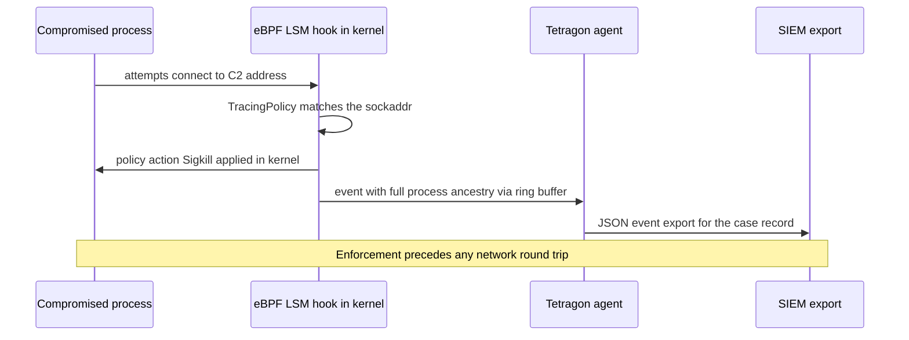

# Host Detection & Response: osquery, Wazuh, and eBPF-based Security

## Overview

Endpoint telemetry is the layer where "how would you detect a compromised box?" — a staple platform-security interview question — actually gets answered. Networks see conversations; hosts see *intent*: the syscall a process made, the file it touched, the scheduled task it created, the parent that spawned it. This page covers the telemetry sources ranked by signal quality, osquery's SQL-over-system-state model, the Wazuh SIEM-lite path, Sigma as a portable detection language, eBPF-based runtime security with in-kernel enforcement, network-layer complements, the detection-engineering loop, response actions, and what scaling from 10 to 10,000 hosts costs.

The interview-graded insight is that no single source suffices: auditd answers "what did that process do" but is painful to operate, osquery answers "what state is the box in" but is point-in-time, eBPF answers both at runtime with enforcement options, and the SIEM stitches them. Answers that pick one tool as *the* answer read junior; answers that rank sources by signal, cost, and coverage read like an operator.

## Telemetry Sources, Ranked

**auditd** is the classic Linux audit trail: `auditctl` rules watch syscalls (`-a always,exit -S execve -k exec-log`), files (`-w /etc/passwd -p wa`), and capability use, emitting structured events to `auditd`. A representative rule set shows the shape — watches for identity and scheduler paths, syscall logging for the interpreter:

```text
# /etc/audit/rules.d/persistence.rules
-w /etc/cron.d/        -p wa -k sched_watch
-w /etc/systemd/system/ -p wa -k sched_watch
-w /etc/passwd          -p wa -k identity
-w /root/.ssh/          -p wa -k identity
-a always,exit -F arch=b64 -S execve -k exec-log
```

Its pain is architectural — rules are static and per-event (no aggregation, no process-tree context without userspace joins), the kernel backlog can drop events under load unless `audit_backlog_limit` is sized, and rule volume grows until it becomes its own outage. **eBPF tracepoints and LSM hooks** are the modern replacement: programs attach to the same kernel events (plus `sched_process_exec`, LSM blobs, cgroup context) and emit rich records with container IDs and process ancestry that auditd cannot provide — the mechanics are in [eBPF for Security](../ebpf-security.md) and [BPF & bpftrace](../../linux/observability/bpf-bpftrace.md), with the verifier safety argument in [The eBPF Verifier](../../linux/kernel/bpf-verifier.md). **ETW** is the Windows counterpart: kernel and application providers feed consumers like Sysmon, which is the de-facto host telemetry baseline on Windows hosts, with Event ID 1 (process create) and ID 3 (network connect) doing most of the detection work. **File-integrity monitoring** (AIDE on Linux, Wazuh's FIM, commercial FIM) watches config and binary paths — lower volume, high signal for persistence, mandatory for compliance regimes.

| Source | Signal | Volume | Pain |
|---|---|---|---|
| auditd rules | High (syscall truth) | High | Static rules, no context joins, backlog drops |
| eBPF probes | Highest (context + filtering in-kernel) | Tunable | Kernel-version sensitivity, needs privilege |
| ETW/Sysmon (Windows) | High | High | Windows-only, schema churn |
| FIM (AIDE-class) | Medium-high for persistence | Low | Point-in-time drift, checksum cost |
| Package/state inventory | Medium (drift, vulns) | Very low | Stale without scheduling |

The practical ranking for a Linux fleet: eBPF-based runtime telemetry for behavior, osquery for state and inventory, FIM for integrity-critical paths, auditd kept where compliance mandates it — with seccomp ([seccomp-bpf](../../os/advanced/seccomp-bpf.md)) understood as *enforcement* at process level rather than telemetry.

## osquery Deep Dive

osquery exposes operating-system state as relational tables you query with SQL — `processes`, `listening_ports`, `crontab`, `scheduled_tasks`, `registry`, `systemd_units`, `shell_history`, `deb_packages`. The model is the point: an analyst who knows SQL can audit any host without learning per-OS tooling, and `SELECT pid, name, path FROM processes WHERE on_disk = 0;` (a process whose binary no longer exists on disk) is the kind of query that changes how people think about endpoint state. Two run modes matter: `osqueryi` for interactive/one-shot queries (the live-response workhorse), and `osqueryd` for scheduled queries configured in **packs** — query sets with per-query intervals, snapshot or differential output, and platform gates, checking results in to a fleet aggregator over TLS.

Fleet aggregation (the FleetDM distribution is the common open-source choice) turns hosts into a queryable population: managers schedule *distributed* queries that fan out to checked-in hosts, results stream back, and label-based targeting scopes queries to OS, platform, or policy groups. The canonical interview exercise is writing a persistence-hunting query. Cron persistence with a fetch-and-execute pattern:

```sql
SELECT name, command, path
FROM crontab
WHERE command LIKE '%curl%'
   OR command LIKE '%wget%'
   OR command LIKE '%base64%';
```

The Windows counterpart walks the registry Run keys; the same pack can carry both with platform gates:

```sql
SELECT name, data, path
FROM registry
WHERE path LIKE 'HKEY_LOCAL_MACHINE\SOFTWARE\Microsoft\Windows\CurrentVersion\Run\%'
  AND data LIKE '%powershell%';
```

Operational care: every query costs CPU on every host, so intervals are tuned per table (package inventory daily, crontab hourly, process snapshots sparingly), differential output is preferred over snapshots to bound result volume, and heavyweight queries are validated on the fleet's smallest hardware before rollout. A pack ties the queries to schedules and target platforms:

```json
{
  "queries": {
    "persistence_cron": {
      "query": "SELECT name, command, path FROM crontab WHERE command LIKE '%curl%' OR command LIKE '%wget%';",
      "interval": 3600,
      "platform": "posix",
      "removed": false
    },
    "persistence_runkeys": {
      "query": "SELECT name, data, path FROM registry WHERE path LIKE 'HKEY_LOCAL_MACHINE\\\\SOFTWARE\\\\Microsoft\\\\Windows\\\\CurrentVersion\\\\Run\\\\%';",
      "interval": 3600,
      "platform": "windows",
      "removed": false
    }
  }
}
```

The `removed: false` flag asks for additions only — new persistence entries are the signal, and deletions are visible in the diff stream rather than re-shipped hourly.

## Wazuh and the SIEM-Lite Path

Wazuh packages the manager-agent pattern into a self-contained SIEM-lite: multi-platform **agents** collect logs, FIM events, inventory, and vulnerability data and forward them to a **manager**, which runs them through a decoder/rule pipeline — decoders normalize arbitrary log formats into fields, rules match field combinations and severity, and child rules with frequency/correlation options express multi-event patterns. Storage and dashboards sit on **OpenSearch** under the hood (Wazuh ships an indexer and dashboard fork), so the scaling questions — shard sizing, index lifecycle, retention tiers — are OpenSearch questions, and the query language at the dashboard is OpenSearch's. Modules that pull their weight: **FIM** (real-time watchlists over inotify plus who-data attribution), **vulnerability detection** (matching the host's package inventory against CVE feeds by CPE), and **security configuration assessment** (scanning hosts against CIS-benchmark-style policies).

Noise is the operating cost. Default rule sets fire aggressively — a busy fleet produces alert storms from routine admin activity — so tuning is the actual exercise: adjusting rule levels so only level-10+ events page, whitelisting known-scanner sources, disabling rules that duplicate EDR coverage, and reviewing the top-N noisy rules weekly until signal-to-noise stabilizes. Custom rules are local XML extending the stock set — a persistence-shaped example keyed off the FIM module's file-write events:

```xml
<group name="linux,persistence,">
  <rule id="100210" level="10">
    <if_sid>554</if_sid>
    <field name="file">^/etc/cron\.d/|^/etc/systemd/system/</field>
    <description>Write to a scheduler path: persistence attempt</description>
    <mitre><id>T1053</id></mitre>
  </rule>
</group>
```

The rule chains off the FIM event (`if_sid` 554, "file added"), matches scheduler paths, and stamps the ATT&CK technique so downstream reporting stays consistent. A realistic budget: a single all-in-one Wazuh node handles on the order of a few hundred agents before the indexer needs its own cluster; past that, the architecture question becomes "which detections justify shipping this volume of raw logs" — the same question every SIEM deployment answers eventually.

## Sigma as the Detection DSL

Sigma is a vendor-neutral YAML rule format for log detections, created so that a rule written once survives a SIEM migration. Rule anatomy: `title`, `id` (UUID), `logsource` (product/category/service — e.g. `category: process_creation`, `product: windows`), `detection` (named selections plus a `condition` such as `selection1 and not filter`), `falsepositives`, `level`, and optional `tags` carrying ATT&CK technique IDs. A minimal shape:

```yaml
title: Cron fetch-and-execute pattern
logsource:
    product: linux
    service: cron
detection:
    selection:
        command|contains:
            - 'curl http'
            - 'wget http'
    condition: selection
level: high
tags:
    - attack.execution
    - attack.t1059
```

Backends convert rules into each engine's dialect (Elastic/Lucene, Splunk SPL, Loku/GreyLog and others) via the pySigma pipeline tooling, which is what makes the format strategically valuable: detection logic becomes a reviewable, testable asset decoupled from storage. The trade-offs are honest ones — Sigma covers log-detection shapes well but not stateful streaming logic, and backends lag new engine features — so mature shops keep Sigma for the portable core and accept engine-specific rules at the edges. Tags mapping to ATT&CK techniques are what let a coverage report answer "which techniques have no detection" mechanically.

## eBPF Runtime Security

Tetragon (Cilium project) moves enforcement into the kernel: a `TracingPolicy` CRD declares hooks (tracepoints, kprobes, LSM hooks, uprobes), match arguments (binary path, argument values, sockaddr), and **actions** — observe-only events, `Sigkill`/`Signal` to terminate, `Override` to rewrite a syscall's return value, `Annotate` to stamp events — and because the eBPF program runs at the hook, enforcement is synchronous with the offending operation. A policy that forbids any binary except the service's own from opening outbound connections reads like this:

```yaml
apiVersion: cilium.io/v1alpha1
kind: TracingPolicy
metadata:
  name: deny-egress-from-unknown-binaries
spec:
  kprobes:
    - call: "__sys_connect"
      syscall: true
      args:
        - index: 1
          type: "sockaddr"
      selectors:
        - matchBinaries:
            - operator: "NotIn"
              values:
                - "/usr/local/bin/service-api"
          actions:
            - action: Sigkill
            - action: Annotate
```

The design intent is visible in the YAML: the hook is the `connect` syscall, the match is over the calling binary, and the action executes before the syscall returns. That closes the race post-hoc alerting cannot — a Falco-style pipeline detects the reverse shell *after* it connects and relies on a responder to kill it, while this policy blocks the `connect` in-kernel before the C2 handshake completes. The cost model: per-event overhead in-kernel is small (the verifier-guaranteed program runs in the syscall path; see [The eBPF Verifier](../../linux/kernel/bpf-verifier.md)), but enforcement policies run *every* matching syscall through a filter, so they are scoped per-cgroup/binary rather than fleet-wide, and observation-only policies ship broadly.



**Falco** (CNCF) is the detection-side counterpart: an eBPF driver (formerly kernel module) captures syscalls and feeds a user-space **rules engine** whose syntax reads like the threat model — macros and lists for reuse, and conditions over process/container fields:

```yaml
- rule: Shell spawned in container
  desc: A shell was spawned as a child of a server process inside a container
  condition: >
    spawned_process and container and
    proc.name in (shell_binaries) and
    proc.pname in (nginx, apache, httpd, java)
  output: "Shell in container (user=%user.name parent=%proc.pname cmd=%proc.cmdline container=%container.name)"
  priority: CRITICAL
  tags: [container, shell, mitre_execution]
```

Readable rules are why Falco gets adopted — the condition above is reviewable by someone who has never touched eBPF. Falco alerts rather than enforces, which keeps its blast radius zero and its rules broadly deployable; the two tools are complements, not competitors. **Tracee** (Aqua) is a third entry worth knowing: an eBPF event source with a Go rules engine and strong forensics capture. The honest operational notes: eBPF versions gate which hooks exist (LSM hooks need kernel 5.7+), kernel upgrades can break CO-RE assumptions in exotic probes, and running any of these on every host means you are now shipping a kernel-adjacent daemon — test it like infrastructure, not like software. The eBPF layer underneath (maps, ring buffers, verifier constraints) is covered in [eBPF for Security](../ebpf-security.md) and [BPF & bpftrace](../../linux/observability/bpf-bpftrace.md).

## Network-Layer Complements

Host telemetry needs network-side complements for the things hosts cannot see (external scanning pressure, cross-host attack patterns). The classic pair at the edge:

| | CrowdSec | fail2ban |
|---|---|---|
| Model | Local analysis agent + crowdsourced reputation | Local log-tailing daemon |
| Detection | Parsers + scenario expressions (behavioral, multi-event) | Regex filters per jail (single-log-line) |
| Remediation | Bouncer components (nftables, firewall, CDN, Traefik) | Firewall actions (iptables/nftables) per ban |
| Community signal | Shared blocklists from the crowd's detections | None — each install reasons alone |
| Best fit | Internet-facing services wanting shared threat intel | Single VPS boxes, minimal dependencies |

fail2ban remains the default on every VPS for a reason — its jail/filter model is transparent and easy to reason about — while CrowdSec's scenario-plus-crowd model catches distributed scanning patterns no single host can observe. Above both, **Zeek** and **Suricata** occupy the network-detection tier: Zeek passively produces structured logs (`conn`, `dns`, `http`, `ssl`) that detection engineering mines, Suricata runs signature-based IDS/IPS on the same tap, and both belong at aggregation points (a SPAN port at the perimeter or a service-mesh edge) rather than on hosts — they correlate what individual boxes miss, such as beaconing patterns shared across a subnet.

## The Detection Engineering Loop

Detection is a loop, not a configuration. Start from **ATT&CK coverage mapping** ([MITRE ATT&CK](https://attack.mitre.org/)): inventory which techniques your telemetry can see, map existing detections onto the matrix, and let the threat model rank the uncovered cells — a bank cares about different techniques than a game studio. Write detections for the ranked gaps (Sigma for log sources, YARA for files, Falco/Tetragon policies for runtime), then **purple-team validate**: red-team tooling runs the technique, and the test passes only if the detection fired with usable context — an alert without process, user, and host context fails validation even if it fired. Tune from measured false-positive rates, then re-map coverage, and the cycle repeats quarterly.

The FP/FN trade-off is a budget: thresholds that eliminate false positives usually create false negatives by raising the bar past real attacker noise, so the design question is which errors you can afford per alert class. Tiering it explicitly keeps the debate out of the on-call's hands:

| Tier | FP tolerance | FN tolerance | Mechanism |
|---|---|---|---|
| Page a human | ~0 | Accepted | High-confidence composites only (lineage + network) |
| Queue for triage | Low | Low | ATT&CK-mapped behavioral rules |
| Hunt query | Accepted | ~0 | Broad matches, analyst-filtered |
| Compliance archive | Ignored | ~0 | Everything retained, nothing alerted |

Track the metrics with the security definitions from [Security Incident Response & Forensics](../incident-response.md): MTTD from first attacker action to first reliable indicator, MTTC to containment, and dwell time — and remember the survivorship trap that MTTD measured only over *detected* incidents hides exactly the cases threat hunting exists to probe.

## Host Isolation and Response Actions

When a host is confirmed compromised, the response ladder runs in volatility order, and each rung is a pre-decided playbook rather than an improvisation:

1. **Network quarantine** — EDR containment, an nftables default-drop with an allowlist for the responder, or a switch-port VLAN move; cut C2 and lateral paths while keeping the box up for evidence work.
2. **Memory capture** — a full RAM image before anything touches disk state, because RAM is destroyed by power-off and holds injected code, C2 configuration, and keys.
3. **Targeted collection** — logs, scheduler and service definitions, registry hives or their Linux analogues, shipped off-host with acquisition hashes.
4. **Eradication on the pre-decided criteria** — reimage or rebuild, with credential rotation scoped to what the evidence shows the attacker held.

Memory capture feeds the Volatility workflow — process hiding, injected code, and C2 configuration extraction — described end-to-end in [Reverse Engineering & Malware Analysis](./reverse-engineering-malware.md). The **live response versus reimaging** decision is a trust decision: a competent kernel-mode rootkit makes every answer the live OS gives you untrustworthy, so reimaging (or reprovisioning from a trusted image) is the only guarantee of eradication — but it destroys volatile evidence and per-host state. The middle path most orgs standardize on: snapshot/clone the storage for offline forensics, capture memory, reimage the host, and rebuild from configuration management. Pre-decide this: writing the isolation-and-reimage criteria during peacetime is what makes a 2 a.m. SEV1 a checklist instead of a debate, and the playbook hooks into the containment levers (isolate, revoke, rotate) defined in [Security Incident Response & Forensics](../incident-response.md).

## Scaling Story: 10 to 10,000 Hosts

At 10 hosts, everything ships raw: one Wazuh all-in-one, osquery with a default pack, no sampling. At 10,000 hosts the arithmetic changes shape — 10,000 agents emitting even 100 MB/day each is a terabyte per day, and cardinality explodes because every host, container, user, and binary is a dimension. The levers, in the order they pay: **filter and aggregate at the agent** (drop debug-tier events locally, deduplicate identical bursts, batch shipments) because the cheapest byte is the one never sent; **tier the detections** (high-signal rules evaluated on-agent or at the manager with near-zero storage, everything else landing in searchable-but-cheaper storage); **tier the storage** (hot indices for days, warm for weeks, cold object storage for the 90-day-plus retention compliance requires — index lifecycle management is not optional at this scale); and **sample deliberately** (full-fidelity capture for the alerting tier, statistically valid sampling for the metrics tier, never for the forensic tier you may need in court).

Numbers worth having ready: osquery distributed-query fan-out scales roughly linearly with fleet size, so population-wide queries need the aggregator scaled (read replicas, result-queue buffering) and query intervals chosen per-table rather than globally; eBPF agents shift cost in-kernel and are per-host constant, which is precisely why the industry moved syscall telemetry there; and SIEM ingestion pricing means the honest security question is "which detections justify this log volume" — a question that forces detection quality, which is the scaling story's happy ending. The storage tiers map onto the cost curve directly:

| Tier | Window | Access pattern | Typical store |
|---|---|---|---|
| Hot | 0-7 days | Interactive search, alert drill-down | Search-cluster hot nodes, replicas |
| Warm | 7-90 days | Occasional investigation | Fewer replicas, larger disks |
| Cold | 90 days-plus | Compliance, rare forensic pull | Object storage, columnar snapshots |

The retention floor is regulatory (PCI DSS wants 12 months of audit history with the most recent 3 immediately available), the hot window is sized by the dwell time you can afford to search interactively, and the honesty test is whether a cold-tier pull for a real case completes same-day.

## Interview Questions

1. **"A box in production may be compromised — how do you detect and confirm it?"** Layer the sources: eBPF/Falco-class runtime telemetry for process lineage and syscall behavior, osquery for point-in-time state (persistence locations, listening ports, processes whose binaries are missing on disk), FIM for integrity on critical paths, and network telemetry for beaconing the host cannot self-report. Confirm by cross-source correlation — a crontab entry plus the process it spawns plus the outbound connection is a detection; any one alone is a lead. Then the response ladder: quarantine network, capture memory, snapshot, reimage on the pre-decided criteria.

2. **auditd versus eBPF telemetry — where does each win?** auditd is stable, universal, and compliance-friendly, but its rules are static, per-event, context-poor (no process tree, no container ID without joins), and drop events when the backlog fills. eBPF probes attach to the same events plus more, filter and enrich in-kernel, and emit ancestry/container-aware records with tunable volume; the costs are kernel-version sensitivity and the operational weight of shipping a kernel-adjacent daemon. Modern fleets keep auditd where mandated and move behavioral telemetry to eBPF.

3. **Design the osquery side of persistence hunting.** Scheduled packs with differential output: crontab and systemd units hourly on Linux, registry Run keys and scheduled tasks hourly on Windows, services and launch agents daily, with queries written for fetch-and-execute patterns (`curl`/`base64` in commands, PowerShell in Run-key data). Point-in-time queries join the picture — processes with `on_disk = 0`, listening ports cross-referenced to process paths. Interval choices are budget decisions: every query is CPU on every host, so heavyweight queries get validated on the smallest fleet hardware first.

4. **Tetragon and Falco both watch syscalls — what actually differs?** Enforcement point. Falco captures syscalls via its eBPF driver and evaluates rules in user space, so its action is alerting — zero blast radius, broadly deployable, but a responder must act after the fact. Tetragon evaluates policies at the hook in-kernel and can `Sigkill`/`Override` synchronously, closing the race window between detection and response at the cost of running filters in the syscall path, which scopes realistic policies per-cgroup or per-binary. Mature estates run Falco-style breadth with Tetragon-style depth on critical workloads.

5. **Why does a vendor-neutral detection format like Sigma matter, and where does it fall short?** Detections are institutional knowledge; a format that compiles to Elastic, Splunk, and others via pySigma pipelines keeps that knowledge portable across SIEM migrations and reviewable as code, with ATT&CK tags making coverage reporting mechanical. It falls short on stateful streaming logic and engine-specific enrichment — mature shops keep the portable core in Sigma and accept engine-specific rules at the edges rather than forcing every detection through the lowest common denominator.

6. **What changes when you go from 100 to 10,000 hosts?** Volume and cardinality, so the levers move upstream: agent-side filtering and dedup before shipping, tiered detections (high-signal evaluated close to the host), tiered storage (hot days, warm weeks, cold months via lifecycle policies), and deliberate sampling that never touches the forensic tier. Roughly, 10,000 agents at 100 MB/day is a terabyte daily — the moment that number is on a slide, "which detections justify this volume" becomes the governing question, and ingestion cost starts driving detection quality rather than fighting it.

## Key Takeaways

- No single telemetry source answers "is this box compromised": rank auditd, eBPF, ETW/Sysmon, and FIM by signal, volume, and pain, and combine them — cross-source correlation is what turns leads into detections.
- osquery's contribution is the model: system state as SQL tables, scheduled via packs, aggregated fleet-wide — with query cost treated as a real per-host budget.
- Wazuh is the SIEM-lite path (agents → decoder/rule pipeline → OpenSearch), and tuning its noise is the actual operating exercise, not a detail.
- Sigma makes detection logic portable and reviewable; ATT&CK tags on rules turn coverage reporting into a query instead of a meeting.
- eBPF runtime security splits by enforcement point: Falco alerts in user space with zero blast radius; Tetragon enforces in-kernel (Sigkill/Override) and closes the post-hoc response race — at the cost of filters in the syscall path.
- The detection loop is ATT&CK mapping → detections → purple-team validation → tuning, with FP/FN trade-offs treated as an explicit budget per alert tier.
- Response is a pre-decided ladder — quarantine, memory capture, snapshot, reimage — because kernel-mode rootkits make live answers untrustworthy and 2 a.m. is the wrong time to debate eradication criteria.
- Scaling to 10,000 hosts is an economics problem: filter at the agent, tier storage, sample deliberately, and let ingestion cost drive detection quality.

## References

- [osquery](https://www.osquery.io/) — SQL-powered endpoint visibility; the schema is the documentation.
- [osquery source](https://github.com/osquery/osquery) — table implementations across platforms.
- [Wazuh documentation](https://documentation.wazuh.com/) — agent/manager architecture, FIM, vulnerability detection modules.
- [Wazuh source](https://github.com/wazuh/wazuh) — the open-source SIEM/XDR engine.
- [CrowdSec documentation](https://docs.crowdsec.net/) — parser/scenario model and bouncer components.
- [CrowdSec source](https://github.com/crowdsecurity/crowdsec) — the crowdsourced log-analysis agent.
- [fail2ban](https://www.fail2ban.org/) — the jail/filter log-watching model.
- [fail2ban source](https://github.com/fail2ban/fail2ban) — the Python ban daemon.
- [Tetragon](https://tetragon.io/) — eBPF-based security tracing and enforcement from the Cilium project.
- [Tetragon source](https://github.com/cilium/tetragon) — TracingPolicy CRDs and the in-kernel policy engine.
- [Falco](https://falco.org/) — CNCF syscall-level threat detection with a readable rules language.
- [Falco source](https://github.com/falcosecurity/falco) — rules engine and eBPF driver.
- [Linux Audit userspace](https://github.com/linux-audit/audit-userspace) — auditd, auditctl, ausearch; the man pages are the docs.
- [MITRE ATT&CK](https://attack.mitre.org/) — the technique vocabulary for coverage mapping.
