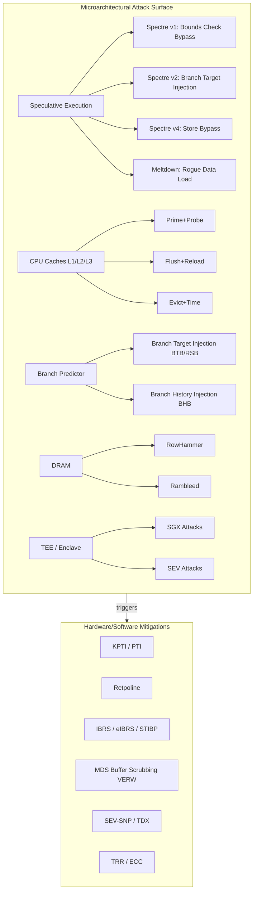

# Microarchitectural Attacks

## Overview

Modern CPUs optimize performance through speculative execution, caching, branch prediction, and out-of-order execution. These microarchitectural features create covert channels that leak data across security boundaries — user-to-kernel, guest-to-hypervisor, and even process-to-process. This chapter covers the full attack taxonomy from 2018's Spectre/Meltdown through modern transient execution attacks, DRAM disturbance attacks, Trusted Execution Environment (TEE) compromises, and the evolving landscape of confidential computing platforms. Understanding these attacks is essential for platform security engineers, kernel developers, and anyone designing systems that handle sensitive data on shared infrastructure.



## Speculative Execution Fundamentals

Speculative execution allows the CPU to execute instructions ahead of knowing whether they should execute (e.g., before a branch is resolved). If the speculation was wrong, the architectural state is rolled back, but **microarchitectural state** (cache lines touched, TLB entries, branch predictor entries updated) is *not* rolled back. This asymmetry is the root cause of Spectre, Meltdown, and all transient execution attacks.

The out-of-order execution pipeline in a modern Intel or AMD core follows this structure:

```
Fetch → Decode → Rename/Allocate → ROB → Issue → Execute → Retire
                                              ↑
                                     Speculative window
                                (microarch state is NOT rolled back)
                                     ~100-200 instructions deep
```

The Reorder Buffer (ROB) holds speculative results. On a mis-speculation, the ROB entries are squashed — registers revert, memory stores are discarded. But any cache fills, TLB entries, or branch predictor updates that occurred during speculation **persist**. Attackers observe these residual effects through timing side channels (cache hit/miss timing, branch taken/not-taken timing). The key insight: the CPU hardware believes the speculative state is invisible to software, but timing measurements make it visible.

### Transient Execution Attack Taxonomy

The academic community has formalized a taxonomy (Canella et al., "A Systematic Evaluation of Transient Execution Attacks," 2019) that classifies these attacks by the trigger, the transient window, and the disclosure primitive:

| Trigger | Transient Mechanism | Example Attack | Cross-Domain |
|---------|--------------------|----------------|--------------| 
| Speculative bounds bypass | Speculative execution after branch misprediction | Spectre v1 | Process-local |
| Speculative indirect branch | Speculative execution after poisoned BTB/RSB | Spectre v2 (BTI, BHI) | User→Kernel, Guest→VMM |
| Speculative store bypass | Speculative store-to-load forwarding | Spectre v4 (SSB) | Process-local |
| Exception/deferred fault | Out-of-order execution before fault handling | Meltdown (L1TF, MDS) | User→Kernel |
| Value speculation | Speculating on data value predictions | Spectre-BHB (history) | User→Kernel |
| Permission-agnostic | Accesses that don't fault but speculatively execute | Lazy FP state restore | Guest→VMM |

## Spectre Variants

### Spectre v1 — Bounds Check Bypass (CVE-2017-5753)

The attacker mistrains the branch predictor so a conditional branch (bounds check) is speculatively taken down the wrong path, accessing out-of-bounds memory. The accessed data is encoded into the cache state via a dependent memory access (the "gadget"). This variant is process-local (the victim must be in the same address space or share code with the attacker), making it relevant for JIT compilers, browser engines, and sandboxed code.

```c
// Vulnerable gadget (kernel or userspace)
// Attacker mistrains the branch to speculatively take the true path
uint8_t leak_byte(uint8_t *array, size_t len, size_t idx) {
    if (idx < len) {                          // Branch: speculatively bypassed
        return array[idx * 4096];              // Out-of-bounds read → cache side effect
    }
    return 0;
}

// Attack sequence:
// 1. Train the branch predictor by calling leak_byte() with valid idx many times
// 2. Call with invalid idx (>= len)
// 3. The CPU speculatively executes array[idx * 4096], loading a cache line
// 4. Squash restores architectural state, but cache line remains hot
// 5. Probe 256-entry array at 4096-byte strides to detect which line is cached
```

**Mitigation**: `lfence` insertion (serializing barrier prevents speculative execution past the barrier), `__speculation_safe_value()` in the Linux kernel, compiler-generated barriers (`-mllvm -x86-speculative-load-hardening`). The challenge is that Spectre v1 requires identifying all vulnerable code patterns across millions of lines of code — this is an ongoing, incomplete effort.

### Spectre v2 — Branch Target Injection (CVE-2017-5715)

The attacker poisons the indirect branch predictor (BTB or RSB — Return Stack Buffer) so an indirect branch or return speculatively jumps to a gadget chosen by the attacker. This is **cross-context**: user → kernel, guest → hypervisor. The attacker fills the BTB in userspace with an entry pointing to a gadget, then triggers an indirect branch in the kernel (e.g., a syscall dispatch table) that speculatively follows the poisoned BTB entry.

```
Attacker (user)              Victim (kernel)
┌──────────────┐            ┌──────────────────┐
│ Train BTB to │──indirect──▶│ syscall entry    │
│ point at      │  branch    │ indirect jump →  │
│ gadget addr   │  (RSB)     │ speculative exec │
└──────────────┘            │ of attacker's    │
                            │ chosen gadget    │
                            │ (leaks data into │
                            │  cache)          │
                            └──────────────────┘

After speculation:
- Architectural state: unchanged (ROB squash)
- Microarch state: cache line loaded at gadget address
- Attacker probes: detects the hot cache line → learns kernel data
```

**Mitigations**: 
- **Retpoline** (return trampoline): replaces indirect branches with `call`/`ret` sequences that are not predicted by the BTB. The `call` pushes the target onto the RSB; the matching `ret` pops from the RSB, creating a controlled indirect branch. Performance cost: 5–15% on early hardware.
- **IBRS** (Indirect Branch Restricted Speculation): MSR that restricts indirect branch prediction. On Intel, IBRS is a per-MSR toggle; on AMD, IBRS is a lighter-weight mode.
- **STIBP** (Single Thread Indirect Branch Predictors): per-thread BTB isolation, preventing cross-thread poisoning. Performance cost on early hardware: significant.
- **eIBRS** (Enhanced IBRS): hardware-enforced isolation without Retpoline. Available on Intel Ice Lake+ and AMD Zen 4+. Eliminates most of the performance overhead of software Retpoline.

### Spectre v4 — Speculative Store Bypass (CVE-2018-3639)

A speculative store may bypass a prior memory read's dependency check. The CPU speculatively forwards a store value to a dependent load before the store retires (Store-to-Load Forwarding, STLF). This allows a gadget to speculatively use attacker-controlled data in a way that creates a cache side channel. Intel's implementation of STLF has a window where forwarding occurs speculatively before the store's address is fully resolved.

**Mitigation**: SSBD (Speculative Store Bypass Disable) MSR, compiler flags (`-m speculative-load-hardening`), `__builtin_speculation_safe_value`. SSBD prevents speculative store-to-load forwarding, at a cost of ~1–5% for store-intensive workloads.

### Spectre-RSB / Spectre-BHB (CVE-2022-0001, CVE-2022-0002)

After a VM exit or interrupt, the Return Stack Buffer may contain attacker-controlled entries from the previous context. The BHB (Branch History Buffer) variant uses branch history (not targets) to steer prediction, bypassing Retpoline. BHI exploits the fact that the CPU's global branch history register influences conditional branch prediction. By manipulating this history through a sequence of branches, the attacker can cause a conditional branch in the victim to mispredict in a way that speculatively executes a gadget.

**Key difference from Spectre v2**: Retpoline prevents BTB-based attacks on *indirect* branches, but BHI targets *conditional* branches whose prediction depends on *history*, not *target*. Retpoline does not protect conditional branches.

**Mitigation**: RSB stuffing (overwrite RSB entries with safe return addresses on context switch — `IBPB` instruction), eIBRS + SBPB (Speculation Barrier for BHI on newer Intel), BHB-clearing sequences on context switch.

### ARM Speculative Execution Vulnerabilities

ARM processors are not immune. Key ARM-specific variants include:
- **Speculative Store Bypass** on ARM Cortex-A series (similar to Spectre v4)
- **Straight-line speculation**: ARM Cortex-A77 and later can speculatively execute past conditional branches, leaking data through subsequent cache accesses
- **Branch Scope / Data Cache Independent Timing**: CVE-2022-23960 — ARM data cache side channels
- **Apple M1/M2 "Augury" attack**: BHB-based speculation on Apple Silicon, using branch history to mispredict indirect branches in the M1's branch predictor

## Meltdown Variants

### Meltdown (CVE-2017-5758)

Meltdown exploits the fact that out-of-order execution can access kernel memory from userspace before a permission check raises a fault. The transient instruction loads kernel data into a cache line *before* the fault is handled. This is fundamentally different from Spectre: Meltdown violates page permissions during transient execution, while Spectre does not — it only speculatively accesses data the process already has permission to read.

```c
// Meltdown transient access (simplified)
// Step 1: Mistranslate a kernel address to a valid user PTE
//         (or use KAISER-unmapped kernel addresses on affected CPUs)
// Step 2: Access the kernel address speculatively
//         The CPU executes the load out-of-order before detecting the fault
uint8_t probe = array[kernel_data[kernel_offset] * 4096];
// Step 3: Fault handler runs, architectural state rolled back, but cache state persists
// Step 4: Flush+Reload on the 256-entry probe array to detect the hot line
```

**Impact**: All Intel CPUs from 2010–2018 (pre-Ice Lake). Reads kernel memory at ~500 KB/s. Also affects some ARM implementations (Apple A-series, Cortex-A75) and some AMD CPUs under specific conditions.

**Mitigation**: KPTI (Kernel Page Table Isolation, aka PTI or KAISER) — the kernel uses a separate page table for userspace that has no kernel mappings (except a minimal trampoline for syscall entry/exit). On syscall entry, the kernel switches to the "full" page table; on return, it switches back. Cost: 5–30% syscall overhead on early hardware (Skylake, Broadwell). Negligible on newer CPUs with PCID (Process Context ID) support.

### Foreshadow / L1 Terminal Fault (CVE-2018-3615, CVE-2018-3620, CVE-2018-3646)

Exploits the L1 data cache's handling of faulting addresses. If a PTE is present but marked non-present (or has a poison bit), the CPU still speculatively fills the L1 cache from the faulting address. Three variants exist: L1TF-SGX (effectively kills SGX on affected hardware — the L1 cache is filled with enclave data accessible to any hyperthread), L1TF-VMM (guest→host via hypervisor-managed page tables), and L1TF-SMM (SMM→OS). The L1TF-SGX variant was particularly devastating because it completely bypassed SGX's memory encryption.

**Mitigation**: L1D flush on VMENTRY (hypervisor flushes L1 data cache before entering VM), `l1tf=off,full,flush` kernel parameter, disabling SGX on vulnerable CPUs via microcode update.

### Rogue In-Flight Data Register (RIDL) / MDS (CVE-2018-12130, CVE-2018-12126, CVE-2018-12127, CVE-2019-11091)

Microarchitectural Data Sampling: certain internal CPU buffers (Line Fill Buffer, Store Buffer, uncacheable write combining buffer) can be sampled by another hyperthread after the data is architecturally consumed. This includes data from other hyperthreads on the same core — meaning a malicious process running on one logical CPU can read data from a cryptographic operation happening on the sibling logical CPU on the same physical core. MDS is particularly dangerous because it bypasses all software-level mitigations for Spectre/Meltdown.

**Mitigations**: Buffer clearing before context switch (`VERW` instruction flushes store buffers — the "MD_CLEAR" microcode), disabling hyperthreading entirely (`nosmt` kernel parameter), `mds=full` kernel parameter, microcode updates that add automatic buffer clearing on certain state transitions.

## Cache Attacks

Cache attacks are the primary *disclosure primitive* for most transient execution attacks. They allow an attacker to determine which memory addresses the victim accessed, even across security boundaries.

### Flush+Reload

Requires shared memory (e.g., shared libraries mapped into both processes, memory deduplication in KSM, or Intel SGX Enclave Page Cache). The attacker flushes a cache line, waits for the victim to access it, then reloads and measures the access time. A cache hit (fast access) means the victim touched that line.

```c
// Flush+Reload (requires shared memory access)
void flush_reload_probe(uint8_t *shared_line) {
    uint64_t t1, t2;
    // Flush: clflush is a serializing instruction
    asm volatile("clflush (%0)" :: "r"(shared_line) : "memory");
    // Wait for victim to potentially access the line
    // ... victim runs ...
    // Reload and time
    asm volatile(
        "rdtsc; shl $32, %%rdx; or %%rdx, %%rax"
        : "=a"(t1) :: "rdx", "rcx");
    volatile uint8_t x = *shared_line;
    asm volatile(
        "rdtsc; shl $32, %%rdx; or %%rdx, %%rax"
        : "=a"(t2) :: "rdx", "rcx");
    if (t2 - t1 < CACHE_HIT_THRESHOLD)  // Typically ~80 cycles for L1 hit
        printf("Cache HIT — victim accessed this line\n");
}
```

Typical thresholds: L1 hit ~4 cycles, L2 hit ~12 cycles, L3 hit ~40 cycles, DRAM ~200+ cycles. The attacker measures at sub-L1 granularity using `rdtsc` or `rdtscp`. Noise from OS scheduling and other processes is mitigated by repeating the measurement thousands of times and taking the minimum (or using statistical tests).

### Prime+Probe

Does *not* require shared memory. The attacker fills a cache set with their own data (prime), waits for the victim to potentially evict one of the attacker's lines, then re-accesses their data (probe). If the victim evicted one of the attacker's lines (because the victim accessed the same cache set), the probe will be slow (cache miss). The attacker learns which cache sets the victim accessed, which can reveal which code paths or memory locations the victim used.

Prime+Probe has been demonstrated cross-core (using L3 cache) and even cross-VM (using shared L3 on multi-tenant cloud hardware). Gruss et al. (2016) demonstrated cross-VM Prime+Probe on AWS with 99.8% accuracy for keystroke timing attacks.

### Evict+Time

A simpler variant: the attacker evicts specific cache lines and measures whether the victim's total execution time changes. If the victim accesses the evicted line, the additional cache miss adds measurable latency. Used in the original RSA timing attacks (Kocher, 1996) to determine which branches the square-and-multiply algorithm took, revealing key bits.

### Cache Attacks Comparison

| Attack | Shared Memory? | Cross-Core? | Resolution | Typical Use |
|--------|--------------|-------------|------------|-------------|
| Flush+Reload | Yes (required) | Yes (shared L3) | Single cache line | Spectre/Meltdown disclosure |
| Prime+Probe | No | Yes (L3) | Cache set (~64 bytes) | Cross-VM, cross-process |
| Evict+Time | No | No (same core) | Function/algorithm | RSA key recovery |
| Flush+Flush | Yes | Yes | Single cache line | Detects access without reload |

## Branch Predictor Attacks

### Branch Target Injection (BTI)

The BTB (Branch Target Buffer) maps branch instruction addresses to predicted targets. On some CPUs, BTB entries are shared across privilege levels (user/kernel) or across address spaces (different VMs). An attacker in userspace can train the BTB to predict a kernel indirect branch to a gadget address. When the kernel executes that indirect branch, the CPU speculatively follows the poisoned entry, executing the gadget with kernel privileges in the transient window.

### Branch History Injection (BHI / Spectre-BHB)

The BHB (Branch History Buffer) records the *pattern* of recent branches (taken/not-taken). The CPU uses this history to predict conditional branches. By manipulating the global branch history (through a series of carefully chosen branches), an attacker can influence a later conditional branch in the victim to speculatively take a path that accesses sensitive data. This works even with eIBRS because eIBRS only restricts indirect branch targets, not conditional branch predictions.

### Attack Comparison Table

| Attack | Vector | Cross-Domain? | Primary Mitigation | Performance Cost |
|--------|--------|--------------|-------------------|-----------------|
| Spectre v1 | Bounds check bypass | Process-local | `lfence`, SLH | 2–10% |
| Spectre v2 | Indirect branch poison | User→Kernel, Guest→VMM | Retpoline, eIBRS, STIBP | 5–15% |
| Spectre v4 | Store bypass | Process-local | SSBD, SpecLoadHardening | 1–5% |
| Spectre-BHB | Branch history | User→Kernel | BHB clear, eIBRS+SBPB | 2–8% |
| Meltdown | Out-of-order fault | User→Kernel | KPTI | 5–30% |
| Foreshadow/L1TF | L1 terminal fault | Guest→VMM, SMM→OS, SGX | L1D flush, EPT poisoning | 1–5% |
| MDS/RIDL | Buffer sampling | SMT siblings | VERW flush, nosmt | 0–50% (if SMT disabled) |
| RowHammer | DRAM disturbance | Cross-VM, cross-process | ECC, TRR, rate limiting | 0% (or performance w/ ECC) |

## RowHammer

RowHammer (Kim et al., ISCA 2014) exploits the electrical coupling between DRAM cells. Rapidly activating (opening and closing) a single DRAM row causes charge leakage in physically adjacent rows due to electromagnetic coupling between capacitors in the DRAM cells. Eventually, enough charge leaks that a bit flips from 0→1 or 1→0. This allows privilege escalation (flip a PTE bit to gain write access to kernel pages), cross-VM attacks, cryptographic key corruption, or denial of service.

### Variants

- **Single-sided RowHammer**: Aggressively activate one row (double-sided is the norm but single-sided works on older DDR3 and some DDR4). Activate the aggressor row at a rate of ~100K+ activations per millisecond.
- **Double-sided RowHammer**: Activate rows on both sides of the target row. More effective on newer DDR4 with TRR (Target Row Refresh) mitigations because TRR tracks activation counts per-row but may not catch asymmetric double-sided patterns.
- **Half-Double (CVE-2020-10255)**: Activates one aggressor row and one non-adjacent row. Some TRR implementations only track activations from one direction, so this asymmetric activation bypasses the counter.
- **TRRespass (CVE-2021-38947)**: Demonstrated 100% reliable bit flips on DDR5 by exploiting weaknesses in DDR5's TRR implementation.

### Mitigations

| Mitigation | Layer | Effectiveness | Limitations |
|-----------|-------|--------------|-------------|
| ECC DRAM | Hardware | Detects single-bit flips (corrects with SEC-DED) | Cannot correct multi-bit flips; some RowHammer patterns produce 2+ bit flips |
| TRR (Target Row Refresh) | Memory controller | Refreshes nearby rows after N activations | Implementation-dependent; bypassable with Half-Double |
| In-DRAM probabilistic TRR | DRAM chip | Better coverage; vendor-specific | Not transparent; different per vendor |
| `pagemap` scanning (Google's protector) | OS | Counts activations, throttles | Performance overhead; imperfect detection |
| ECC with address scrambling | Hardware | Makes bit flips non-deterministic | Does not prevent flips, just changes their effect |
| Rate-limited row activation | Memory controller | Caps activation rate per row | Reduces performance; threshold must be calibrated |

### CVEs

- **CVE-2021-38947**: Samsung RowHammer bypass on DDR5 (TRRespass). 100% reliable bit flips demonstrated on DDR5 modules.
- **CVE-2022-23960**: Rambleed — uses RowHammer to *read* data (not just flip) by strategically flipping PTE bits and observing the resulting page faults or memory access patterns. This is a more dangerous attack because it leaks information rather than just corrupting it.

## SGX Attacks

Intel SGX (Software Guard Extensions) provides hardware-enforced enclaves: encrypted memory regions accessible only by enclave code running at a specific measurement (MRENCLAVE). SGX was designed to protect code and data even from a compromised OS or hypervisor. Despite these ambitious guarantees, numerous attacks have progressively broken SGX's confidentiality:

- **Spectre inside enclaves** (Foreshadow-L1TF-SGX, CVE-2018-3615): L1TF allows reading enclave memory from outside the enclave via a hyperthread on the same core. The L1 cache is shared, so a transient execution attack fills L1 with enclave data, readable by any hyperthread. Intel's response: disable SGX on vulnerable CPUs via microcode. This single attack invalidated SGX's core confidentiality promise on all pre-10th-gen Intel CPUs.

- **Plundervolt (CVE-2020-8695)**: Undervolting the CPU (via `MSR 0x150`) causes faults during enclave computation. By controlling the voltage and timing, the attacker induces predictable computational errors in AES-NI or other cryptographic instructions inside the enclave. Using differential fault analysis (DFA), the attacker recovers the enclave's cryptographic keys. This is a hardware-level fault injection attack against a hardware TEE.

- **Aepic Leak (CVE-2022-21233)**: Leaks SGX enclave data via uninitialized TLB entries after an SGX2 page-revoke operation. When a page is revoked from the Enclave Page Cache (EPC), stale TLB entries can be used to transiently access the old page data.

- **SGAxe (CVE-2020-0551)**: Steals the enclave's attestation key (the signing key used for remote attestation). By exploiting a race condition in the SGX launch enclave's key-handling code, the attacker extracts the attestation key, allowing them to forge attestation reports for arbitrary enclaves. This breaks the entire remote attestation chain of trust.

> **Interview Angle**: "SGX is effectively dead on client hardware" is the common wisdom in 2024+. Explain *why*: L1TF defeated memory encryption (the fundamental promise of confidentiality), SGAxe defeated remote attestation (the fundamental promise of trust), and Plundervolt defeated computational integrity. The lesson: TEE security depends on the *entire* CPU's microarchitectural security, not just the enclave's memory encryption. Any transient execution or fault injection vulnerability in the core CPU affects the TEE.

## AMD SEV (Secure Encrypted Virtualization)

AMD SEV encrypts VM memory with an AES-128 key managed by the AMD Secure Processor (PSP), a separate ARM-based coprocessor on the CPU die. The hypervisor cannot read guest memory because the encryption key never leaves the PSP. SEV evolved through three generations, each adding stronger security properties:

```
┌─────────────────────────────────────────┐
│        Hypervisor (untrusted)          │
│  ┌───────────────────────────────────┐  │
│  │      VM (encrypted memory)       │  │
│  │                                   │  │
│  │  SEV:   memory AES-128 encrypted │  │
│  │  SEV-ES: registers also encrypted │  │
│  │  SEV-SNP: memory integrity       │  │
│  │           + RMP enforcement      │  │
│  └───────────────────────────────────┘  │
│         │                    │         │
│    SEV: no protection  SNP: RMP        │
│    for integrity        prevents data  │
│    (hypervisor can     mutation &      │
│    replay/mutate)      replay          │
└─────────────────────────────────────────┘
```

### SEV Attack Surface

- **Without SEV-SNP**: The hypervisor can **replay** encrypted pages (revert the VM to an old state by replaying a previously captured ciphertext), **remap** pages (point the VM's page table at a different physical page with different ciphertext), or **mutate** ciphertext (change ciphertext bytes, causing random corruption on decryption). These are *integrity* attacks, not confidentiality — SEV still provides memory confidentiality. But integrity is essential for correct computation.

- **SEV-SNP** adds the RMP (Reverse Page Map): a hardware structure that tracks the *owner* of each physical page frame. The hardware checks the RMP on every page table walk, preventing the hypervisor from remapping or replaying pages. Each page also has a cryptographic integrity MAC (Message Authentication Code) that the hardware verifies on every memory access, detecting ciphertext mutation. The combination of RMP + MAC provides both integrity and confidentiality.

### SEV-SNP Attestation

A derived key (VCEK — VCPU Encryption Key, derived from the AMD root of trust and signed by AMD's intermediate key) is used to attest the VM's launch measurement. The guest can request a `REPORT` from the PSP, which includes the measurement hash (SHA-256 of firmware, kernel, initramfs, and application), the VCEK's public key certificate, and user-provided data (typically a nonce from the verifier). The verifier validates the VCEK certificate chain back to AMD's root certificate, then checks the measurement against expected values. This enables **remote attestation**: confirming the VM launched with the expected software stack before provisioning secrets.

## Intel TDX (Trust Domain Extensions)

Intel's answer to SEV-SNP. A Trust Domain (TD) is a VM whose memory is encrypted with a per-TD key managed by the TDX Module (a CPU-internal firmware component in ROM/hidden memory). The TDX Module manages the TD lifecycle (creation, measurement, teardown) and prevents the VMM from accessing TD memory, registers, or key material.

Key properties: AES-XTS-128 memory encryption, integrity protection via per-page MACs, secure EPT management (the VMM cannot modify the TD's extended page tables), and attestation via TDX Quote (similar to SGX's quote mechanism, signed by Intel's Quoting Enclave/Provisioning Certificate). TDX is supported on Intel 4th Gen Xeon Scalable (Sapphire Rapids) and later.

### SEV-SNP vs. Intel TDX Comparison

| Feature | AMD SEV-SNP | Intel TDX |
|---------|-------------|-----------|
| Encryption | AES-128-XTS (per-VM key) | AES-128-XTS (per-TD key) |
| Integrity | Per-page MAC, RMP | Per-page MAC, Secure EPT |
| Attestation | VCEK (AMD-signed) | TD Quote (Intel-signed) |
| Key Management | PSP (ARM coprocessor) | TDX Module (CPU-internal firmware) |
| Multi-TD/VM | Up to 509 VMs per system | Up to ~64 TDs per socket |
| Live Migration | Supported (SEV-SNP live migration protocol) | Supported (TDX live migration) |
| Status | Available since EPYC Milan (2021) | Available since Sapphire Rapids (2023) |

## Confidential Computing

Confidential computing protects data *in use* (complementing encryption at rest and in transit). It combines TEEs, memory encryption, and remote attestation to enable computation on sensitive data without trusting the infrastructure operator. The Confidential Computing Consortium (CCC), hosted by the Linux Foundation, standardizes this ecosystem.

### Architecture Stack

```
┌───────────────────────────────────────────────┐
│            Application (unmodified)            │
├───────────────────────────────────────────────┤
│        Attestation Agent (in-TD/SEV)           │
│        (requests report, provisions secrets)   │
├───────────────────────────────────────────────┤
│       Guest OS / Library OS (untrusted)       │
│       (manages application processes)           │
├───────────────────────────────────────────────┤
│    TEE (SEV-SNP / TDX / SGX / ARM CCA / CVM)  │
│    • Memory encryption (AES-XTS)               │
│    • Integrity (RMP / MAC / Secure EPT)         │
│    • Attestation (VCEK / TD-Quote / QE)        │
├───────────────────────────────────────────────┤
│    Hypervisor / Cloud Platform (untrusted)      │
│    (manages VM lifecycle, cannot access memory) │
└───────────────────────────────────────────────┘
```

## Trusted Boot, Measured Boot, Secure Boot

Boot integrity is the foundation of the attestation chain. Without verifying what booted, attestation is meaningless. Three complementary mechanisms exist:

- **Secure Boot (UEFI)**: Verifies the *signature* of each boot component (bootloader → kernel → initramfs) against a database of trusted keys stored in UEFI firmware NVRAM. Components not signed by a trusted key are refused execution. Prevents bootkits. Implemented via the `shim` bootloader on Linux (signed by Microsoft's key and loaded by firmware), with MOK (Machine Owner Key) for custom certificates.

- **Measured Boot**: Extends a TPM (Trusted Platform Module) Platform Configuration Register (PCR) with hashes of each boot component *without* enforcing them. The PCRs represent what *actually* booted (measured). No enforcement — if an attacker replaces the kernel, the PCR will reflect the attacker's kernel, but boot still succeeds. A remote verifier compares the PCR values against expected measurements to detect tampering.

- **Trusted Boot**: Combines Secure Boot (enforcement — refuse unsigned components) with Measured Boot (measurement/attestation — record what booted into TPM). The system only boots verified components AND reports what booted to a remote party via TPM attestation. This is the strongest boot integrity guarantee.

### Remote Attestation Flow

```
1. Verifier sends challenge nonce "N" to the guest/TEE
2. Guest requests REPORT from TEE firmware (PSP / TDX Module), including:
   - Launch measurement (hash of firmware, kernel, initramfs, application)
   - User-provided data (nonce "N")
   - Policy flags (debug mode, SMT state, etc.)
3. TEE firmware signs the report with hardware-derived key:
   - AMD: VCEK (derived from chip-unique root key, signed by AMD)
   - Intel: TD Quote (signed by Intel's Quoting Enclave)
4. Verifier validates signature chain:
   - Intel: QE cert → Intel intermediate CA → Intel root CA
   - AMD: VCEK cert → AMD ASK (AMD Signing Key) → AMD Root Key
5. Verifier checks: measurement matches expected? nonce matches?
6. Verifier provisions secrets encrypted to the TD/VM's attestation key
```

## Interview Angle

- "Explain why KPTI fixes Meltdown but not Spectre."
  *KPTI removes kernel mappings from the userspace page table, so a transient out-of-order access to kernel addresses faults on the TLB miss before data can be loaded into a cache line. Spectre doesn't violate page permissions — it speculatively accesses data that the process *is* allowed to read (just not in the intended context — e.g., a kernel function speculatively reading kernel heap data that happens to be in the same address space). Since the data is in the kernel page table and Spectre triggers from kernel code, KPTI is irrelevant.*

- "Would you disable hyperthreading for security?"
  *On pre-MDS-mitigation hardware (pre-Ice Lake), yes — MDS allows cross-SMT data leakage via store buffers and line fill buffers, meaning an attacker on one hyperthread can read data from cryptographic operations on the sibling hyperthread. Modern CPUs (Intel Ice Lake+, AMD Zen 2+ with microcode updates) have internal buffer partitioning that mitigates MDS without disabling SMT. The trade-off is ~30% throughput loss for security on older hardware. For cloud providers running untrusted tenant VMs, disabling SMT was (and some would argue still is) prudent.*

- "How does SEV-SNP prevent a malicious hypervisor from modifying guest memory?"
  *The RMP (Reverse Page Map) associates each physical page frame with an owner (host or specific guest TD). The hardware checks the RMP on every page table walk. The hypervisor cannot update the RMP without going through the PSP, and the PSP only allows RMP updates consistent with the SNP policy (during page assignment, not after). Additionally, every page of guest memory has an integrity MAC that the hardware verifies on read, detecting ciphertext mutation. The combination prevents both integrity attacks (mutation, replay) and confidentiality attacks (the hypervisor only sees ciphertext).*

- "Your cloud provider uses Intel TDX. How do you verify your VM launched correctly?"
  *The attestation flow: my VM requests a TDX Quote from the TDX Module, including the launch measurement (hash of firmware, kernel, and application) and a nonce. I send this quote to my verifier, which checks the Intel certificate chain back to the root CA. I compare the measurement against a pre-computed hash of my expected boot configuration. If they match, I provision secrets via a secure channel encrypted to the VM's attestation key. I integrate this into my CI/CD pipeline so every deployment is attested before receiving database credentials.*

## Key References

- Kocher et al., *Spectre Attacks: Exploiting Speculative Execution* (2018) — https://spectreattack.com
- Lipp et al., *Meltdown: Reading Kernel Memory from User Space* (2018) — https://meltdownattack.com
- Canella et al., *A Systematic Evaluation of Transient Execution Attacks and Defenses* (USENIX Security 2019)
- Kim et al., *Flipping Bits in Memory Without Accessing Them* (ISCA 2014)
- Intel SDM Vol. 3, §5.6: Speculative Execution Side Channels
- AMD SEV-SNP Specification (REV 1.51) — https://developer.amd.com/sev
- Intel TDX Architecture Specification — https://www.intel.com/content/www/us/en/developer/articles/technical/intel-trust-domain-extensions.html
- Gruss et al., *Another Flip in the Wall of Rowhammer Guards* (SEC 2018) — Rambleed
- Intel, *Countering Transient Execution Attacks: A Software Developer's Guidance* — https://www.intel.com/content/www/us/en/developer/topic-technology/software-security-guidance
