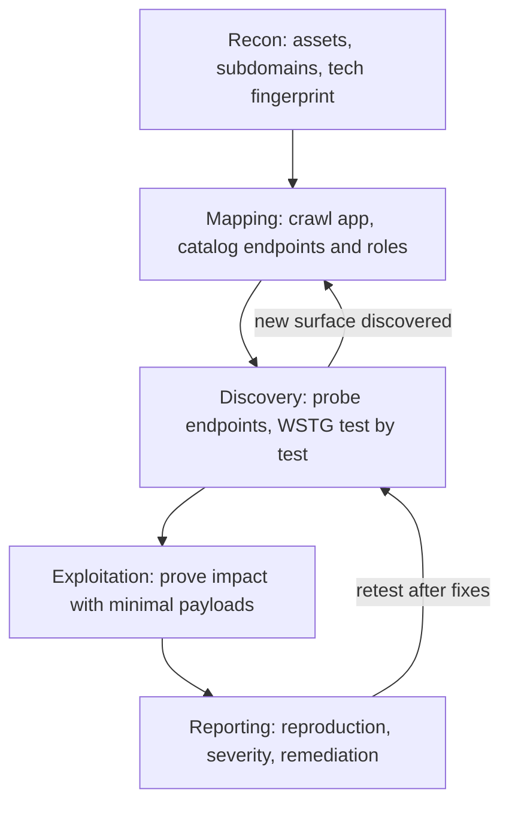
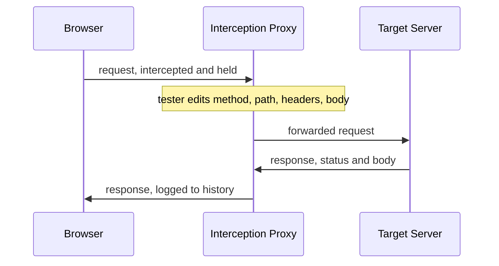
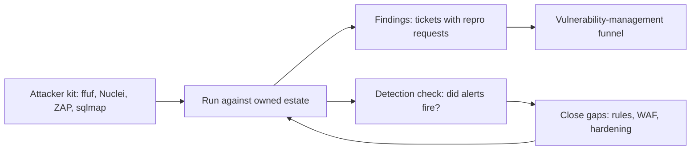

# Offensive Web Tooling: Probing Applications Like an Attacker

## Overview

The offensive web toolkit — an interception proxy, a response-filtering fuzzer, a template-driven scanner, and an automated exploitation engine — is the standard equipment of penetration testers and bug-bounty hunters. It is also the fastest free education a defender can get: every tool doubles as a lens into how real attack traffic looks on the wire, what your logs capture, and what your WAF silently passes. Interviewers in AppSec, security-engineering, and senior backend loops ask about these tools operationally — what Burp Repeater teaches that a scanner cannot, why response filtering is the actual skill in directory fuzzing, and what sqlmap automates that raw SQL knowledge does not. This page covers the toolkit and the methodology that organizes it; the vulnerability classes the tools hunt (XSS, SQLi, CSRF, SSRF and friends) are developed in [Web Security](../web-security.md), and the scanning-in-CI half of DAST belongs to [The AppSec Toolchain](./appsec-toolchain.md).

## Authorization and Ethics: The License to Probe

Every tool on this page produces traffic that is indistinguishable from an attack. Running sqlmap against a website you do not control is unauthorized access under laws like the US Computer Fraud and Abuse Act (18 U.S.C. § 1030) and equivalents such as the UK Computer Misuse Act 1990, and neither curiosity nor "no harm done" is a defense — prosecution, restitution, and prison are the documented outcomes for real people who "were just testing." Even scanning that never finds a vulnerability can be criminal, because the offense attaches to the unauthorized access attempt itself. This framing is not boilerplate: it changes which flags you may type, because a command that is fine in your lab is a felony two words later against someone else's production system.

Authorization is defined by documents, not intentions. Bug-bounty programs publish scope pages listing in-scope assets, permitted techniques, rate limits, and explicitly out-of-scope classes; a penetration test runs under a signed statement of work with rules of engagement; your own lab is authorized because you own it. The classic violation is scope-adjacent drift: a wildcard DNS record puts `staging.internal.example.com` inside your certificate-wrapped harvest, it is not on the program's scope list, and the moment you point ffuf at it you are off the reservation. Exceeding authorized access — touching an in-scope asset in a prohibited way, or an out-of-scope asset at all — is the same crime as having no authorization in the first place.

That document therefore changes tool usage in practice. Some bounty programs prohibit automated scanning entirely, which makes an unattended Nuclei sweep a policy violation even against fully in-scope hosts; others require specific user-agent strings, rate ceilings, and a stop condition ("stop immediately if asked on the contact channel"). Professional engagements add data-handling constraints — proof-of-concept payloads must be minimal and reversible, no exfiltrating real customer rows when `SELECT 1` proves the injection. Before any run, three questions have answers in writing: what is in scope, what techniques are permitted, and who do I call when something breaks.

Safe practice environments remove the legal question entirely. Hosted labs like the PortSwigger Web Security Academy run isolated per-user instances explicitly built to be attacked; local deliberately-vulnerable applications (OWASP Juice Shop, DVWA, WebGoat) run in containers on your machine; cloud VMs you pay for are yours to break. One operational rule is absolute: never expose a deliberately vulnerable application to the public internet. Internet-wide scanners find exposed Juice Shop and DVWA instances within hours, and your vulnerable box becomes someone else's pivot point — a real incident with your name on the billing account.

Before any run, the operational checklist collapses to a few always/never pairs:

- **Always** read the scope page or rules of engagement first, and save a dated copy — programs change scope mid-engagement, and the copy is your record.
- **Always** set rate limits and a stop condition (`-rate`, `-t`, or their equivalents) before the first request, and honor the program's contact channel when asked to stand down.
- **Always** keep payloads minimal and reversible: `SELECT 1` proves an injection as well as a dropped table does, and you cannot un-drop it.
- **Never** probe an asset that is not on the scope list, even if a wildcard DNS record or a certificate's SANs suggest it belongs to the program.
- **Never** run the aggressive modes (`sqlmap --risk=3`, unfiltered ffuf at 200 threads) against anything shared, fragile, or customer-facing without explicit written sign-off.

These constraints are not overhead; they are the difference between a test and an incident. They also scale down to personal practice — even in your own lab, working under simulated rules of engagement builds the professional habit that interviews and engagements both probe for.

## The Methodology: WSTG as the Test-by-Test Standard

The OWASP Web Security Testing Guide (WSTG) is the standard methodology behind most professional web pentest reports — if a report's methodology section cites anything, it cites this. The guide organizes testing into numbered categories (information gathering, authentication, authorization, session management, input validation, business logic, and more), each with stable test identifiers such as `WSTG-ATHZ-02` for cookie-based access-control bypasses. That identifier scheme is why WSTG matters beyond reading: findings become auditable ("which tests did you run?"), scopes become comparable across testers, and a junior can cover ground systematically instead of by vibes. Reading the stable version end-to-end once is the highest-yield weekend in web security.

The operational skeleton every engagement follows is: recon → mapping → discovery → exploitation → reporting. Recon enumerates assets — domains, subdomains, IP ranges, technology fingerprints — before any request touches the application itself. Mapping crawls what recon found: every endpoint, every role, every state transition, cataloged so the tester knows the surface before probing it. Discovery runs the WSTG tests against that map; exploitation proves impact with minimal, reversible payloads; reporting turns it all into reproduction steps, severity ratings, and remediation guidance that survives the client's rebuttal.



Automation fits the breadth work and fails the depth work. Crawling, fuzzing, known-CVE checks, TLS and header hygiene, cookie-flag verification — all mechanical, parallelizable, and reliably automated by the tools below. What automation does not find is logic: an endpoint that authorizes by object ID without checking ownership (the IDOR class), a refund flow that accepts a negative quantity, a multi-step checkout whose step three trusts step one's server-side state. The standard scanner failure mode is surfacing a *candidate* — "this parameter reflected a payload" — while the human still has to understand the application's object model to know why the finding matters. Interviews reward saying this explicitly: tools generate requests, humans find logic bugs.

A worked example shows how the phases feed each other. Mapping catalogs three roles — anonymous, customer, admin — and notes that `/admin/orders` renders a table the customer-facing `/orders` does not. Discovery, run as the WSTG authorization tests, asks per-endpoint: what happens when the customer's session cookie is replayed against the admin path, and what happens when the object ID in `/orders/1337` is swapped for `1338`? Exploitation then proves impact minimally — one read of another tenant's order, screenshotted, nothing more. No scanner produces that sequence, because each step requires holding the application's role model in your head; the tools' job was to give you the map that made the question askable.

| Phase | Core question | Automation fit | Representative WSTG anchors |
|---|---|---|---|
| Recon | What exists, and with what technology? | High — subdomain enumeration and fingerprinting are fully scriptable | `WSTG-INFO` series |
| Mapping | What are the endpoints, roles, and state flows? | Medium — crawlers map URLs but miss role-specific and JS-driven routes | `WSTG-INFO`, `WSTG-CLNT` |
| Discovery | Where are the weaknesses? | Medium — payload fuzzing is automated; business-logic tests are manual checklists | `WSTG-ATHN`, `WSTG-ATHZ`, `WSTG-INPV`, `WSTG-BUSL` |
| Exploitation | What is the real impact? | Low — proof-of-impact needs human judgment and safe, reversible payloads | `WSTG-INPV`, `WSTG-SESS` |
| Reporting | Can the client reproduce and fix it? | Low — the deliverable is human-written by definition | n/a (reporting templates) |

## The Interception Proxy: Where the Real Education Lives

An interception proxy sits between your browser and the target application: the browser sends requests to the proxy, the proxy forwards them to the server, and every request and response flows through in the clear and can be held, read, edited, and replayed. TLS is handled by installing the proxy's certificate authority into your browser or OS trust store, which lets the proxy decrypt your own HTTPS sessions to the target. The result is total visibility into an HTTP conversation that the browser otherwise hides — and that visibility, not the scanner, is the education. Once you can see every header, cookie, redirect, and status code, the application stops being a UI and becomes a protocol you can manipulate.

Burp Suite is the industry-standard proxy. The free Community Edition includes the proxy, Repeater (resend any captured request, edit anything, send again), Intruder in rate-limited form, and Decoder/Comparer — and that is enough to learn with, because the education is manual. Community deliberately lacks the automated scanner; the Pro edition adds the scanner that professionals run at work, plus an unthrottled Intruder. The pedagogical point cuts against intuition: a Pro scanner finding is noise until you can reproduce it by hand in Repeater, so starting on Community builds the underlying skill instead of the checkbox. When interviewers ask "Burp Pro vs Community," the strong answer is about which habits each one builds, not about price.

OWASP ZAP is the free, scriptable alternative: same interception-proxy core, plus a REST API for driving it programmatically, an add-on marketplace, and Docker images purpose-built for CI scanning. Its baseline scan (passive analysis of proxied traffic, minutes, non-intrusive) and full active scan map cleanly onto scheduled pipeline jobs — slower and noisier than Burp Pro's scanner, but infinitely cheaper and fully automatable:

```bash
# CI-friendly baseline scan (passive, non-intrusive) against an app you own.
zap-baseline.py -t "http://staging.lab.local" -r zap-report.html
```

The CI integration patterns (authenticated scanning, OpenAPI-spec-driven scanning, safe-target allowlists) are covered in [The AppSec Toolchain](./appsec-toolchain.md); for learning purposes ZAP's proxy is every bit as capable as Burp's, and its scripting angle teaches a different and complementary skill.



The Repeater workflow is the heart of manual testing. You capture a request in the proxy history, send it to Repeater, and start changing one thing at a time — an object ID, a role cookie, an HTTP method, a JSON field type — observing how the response status and body shift:

```http
GET /api/orders/1337 HTTP/1.1
Host: lab.local
Cookie: session=eyJhbGciOiJIUzI1NiIsInR5cCI6IkpXVCJ9...
Accept: application/json

```

Change `1337` to `1338` and get back another tenant's order? That is broken object-level authorization, found in twenty seconds of reading. The transferable skill is reading raw HTTP fluently — headers, status codes, cookie attributes, caching directives, redirect chains — and it pays outside security: debugging an API integration, reasoning about a CDN cache miss, or diagnosing a CORS failure are the same skill with different stakes. Tools automate; fluency in the underlying protocol is what lets you interpret what the tools report.

| Capability | Burp Community | Burp Pro | OWASP ZAP |
|---|---|---|---|
| Cost | Free | ~$450/year per user | Free, open source |
| Interception proxy + Repeater-style replay | Yes | Yes | Yes |
| Automated active scanner | No | Yes (the one professionals run) | Yes (slower, noisier) |
| Scripting / API | Limited | Limited | REST API, add-ons, scripts |
| CI fit | None | Via Burp Suite Enterprise | First-class (Docker images) |
| Best for | Learning to read HTTP manually | Billable engagements and depth | Budget-constrained and automated runs |

## Discovery and Fuzzing: ffuf and Response Filtering

Fuzzing in the web context means enumerating the application's unlinked surface: directories and files (content discovery), hidden GET/POST parameters, request headers (debug endpoints, `Host`-based virtual hosts), and less-common HTTP methods. The workhorse is ffuf — a single Go binary, successor to dirb and gobuster in most modern toolkits — which substitutes each entry of a wordlist into a marked position (`FUZZ`) in the URL, header, or body and fires the requests in parallel. Wordlists run from a few thousand entries (a typical `common.txt`) to hundreds of thousands (the SecLists collections), and choosing the list is itself a judgment call between coverage, runtime, and the noise you inflict on the target.

```bash
# AUTHORIZED TARGET ONLY — your own lab host, or a domain the program's
# scope page explicitly lists AND whose policy permits automated fuzzing.

# Directory discovery, filtered: ignore 404s and the default soft-404 page size.
ffuf -w common.txt -u "http://lab.local/FUZZ" -fc 404 -fs 4212 -t 20 -rate 100

# Virtual-host discovery: vary the Host header against a single IP.
ffuf -w vhosts.txt -u "http://lab.local" -H "Host: FUZZ.lab.local" -fs 5080
```

The real skill is response filtering, not tool invocation. Nearly every framework answers unknown paths with a soft-404 — a `200 OK` or custom error page of consistent size — so an unfiltered 50,000-entry run returns 50,000 near-identical responses and zero signal. ffuf's filters are the cure: `-fc` removes status codes, `-fs` removes a response *size* (baseline the nonsense response first, then subtract it), `-fw` and `-fl` filter on word and line counts. Reading a raw ffuf command tells you nothing about whether the operator is competent; reading their filter set does. The craft is noticing that everything sized 4212 bytes is the error page and the one 5080-byte response is a real admin panel hiding inside a `200`.

Rate limiting and safety are part of the same competence. `-t` caps concurrent threads, `-rate` caps requests per second, and both exist because 200 threads against a production host looks like a denial-of-service, trips the WAF, and gets your IP banned — or your bounty program participation revoked. Program policies frequently restrict or prohibit automated fuzzing even on in-scope assets, so the scope-page reading from the ethics section applies doubly here. Recursion (`-recursion`) lets ffuf walk into discovered directories, at the cost of exponentially more requests — another dial that should be set by the authorization document, not by curiosity.

## Template-Driven Scanning: Nuclei

Nuclei is a template-driven scanner: every check is a small YAML file describing a request to send and a matcher that decides whether the response indicates the weakness. The community corpus (nuclei-templates) holds thousands of templates organized by severity and tag, and a newly disclosed CVE typically gains a public template within days — which makes `nuclei -update-templates` a feed as operationally real as an advisory list. A minimal illustrative template:

```yaml
id: lab-reflected-xss-probe

info:
  name: Reflected XSS probe for the lab search page
  author: security-team
  severity: medium
  tags: xss, lab

http:
  - method: GET
    path:
      - "{{BaseURL}}/search?q=%3Cscript%3Ealert%281%29%3C%2Fscript%3E"
    matchers:
      - type: word
        words:
          - "<script>alert(1)</script>"
```

Reviewability is the whole point, and it separates Nuclei from heuristic scanners. "Check for this specific CVE" becomes a file you can read, diff, pin to a version, and review in a pull request; a false positive is fixed by a commit, not by filing a support ticket against a black box. Organizations keep private template directories for their own stack-specific checks alongside the community corpus, and code review of a template is a natural place to ask "does this matcher actually distinguish vulnerable from patched?" — a question you cannot even formulate about an opaque scanner policy blob. Template scanning is deterministic: the same input against the same host yields the same finding, which is what continuous monitoring and regression tracking require.

Nuclei occupies a different niche than the proxy-based scanners. ZAP and Burp's scanners crawl a single application, learn its forms and session model, and fuzz parameters heuristically — depth on one app with authentication awareness. Nuclei fires a fixed list of known-pattern probes and is oblivious to the application's logic — breadth across many hosts, ideal for continuously sweeping your own estate against the latest CVE templates. They compose rather than compete: Nuclei for fleet-wide known-bad checks and regression sweeps, the proxy scanners for interactive depth on a live target. One operational caveat keeps you honest: matchers are string-based, so Nuclei findings are leads to verify manually in a proxy, not confirmed vulnerabilities — exactly the verify-before-ticket discipline the vulnerability-management process demands.

## Automated Exploitation: sqlmap and Its Limits

sqlmap automates SQL injection detection and exploitation end to end. It probes a parameter across the injection classes — boolean-based, error-based, time-based, UNION-query, stacked-query, out-of-band — infers the backend engine (MySQL, PostgreSQL, SQL Server, Oracle, SQLite and more), then escalates: schema enumeration, table dumps, file reads, and on permissive targets an interactive shell. It has been maintained since the mid-2000s and remains effective, which is itself a lesson — the injection class it exploits was first documented in the late 1990s, and parameterized queries still have not reached everywhere.

It is also the least forgiving tool in the kit, on two axes. First, legality: it fires real payloads, so it is unauthorized-access tooling the moment the target is out of scope — the ethics section is not optional here. Second, even on an authorized target, sqlmap mutates state when the injection class allows it: stacked-query injection can execute `INSERT`, `UPDATE`, and `DELETE` when asked (or when misconfigured), and careless flags against a shared database can alter or destroy data that a `SELECT` would have left alone. Aggressiveness is controlled by `--level` and `--risk` (raising them sends more exotic and more invasive payloads), and `--threads`, `--delay`, and `--timeout` exist precisely so the tool can be throttled against systems that are authorized but fragile. Tamper scripts — payload mutators like `space2comment` — reshape requests to slip past WAFs, which makes sqlmap a hands-on teacher of WAF-bypass mechanics and of why blocking specific strings is a losing defense.

```bash
# AUTHORIZED LAB TARGET ONLY — a deliberately vulnerable app on localhost.
# Never point sqlmap at any host you do not own or have written permission to test.
sqlmap -u "http://127.0.0.1:8081/products?id=1" --batch --level=2 --risk=2
```

Manual SQL-injection understanding beats the tool in every non-trivial case, which is why the conceptual half lives in [Web Security](../web-security.md) alongside the prevention story. Injection points behind authenticated, CSRF-protected, session-bound flows need the request captured in your proxy first and handed to sqlmap with `-r request.txt` — the proxy and sqlmap compose, and the human supplies the session context the tool cannot invent. Second-order injection (payload stored by one request, executed by another) and JSON/XML injection contexts routinely defeat blind automation. And the professional norm stands regardless: every sqlmap finding is confirmed by hand in Repeater before it reaches a report, because a time-based false positive is indistinguishable from a network hiccup until a human proves otherwise. The sibling class — OS command injection, where the sink is a shell rather than a SQL parser — follows the same detect-then-prove discipline; see [Command Injection](../command-injection.md).

## Building the Lab

The PortSwigger Web Security Academy is the single best free hands-on web-security curriculum in existence, maintained by the vendors of Burp Suite, and all of its materials and labs are free — if you use only one resource from this page, use this one. Labs run as hosted, isolated per-user instances, so there is nothing to install and nothing to accidentally attack beyond the lab. The topic coverage tracks the real curriculum of the field — SQL injection, access control, SSRF, XXE, request smuggling, JWT attacks, OAuth — with difficulty ratings from apprentice to expert and worked solutions when you are stuck. Because the Burp vendors maintain it, the labs also teach the proxy-first workflow itself: you solve them the way you would work a real engagement, request by request.

Local deliberately-vulnerable applications fill in the self-hosted half. OWASP Juice Shop (Node.js, roughly a hundred hacking challenges with a built-in score board), DVWA (PHP, the classic low/medium/high difficulty ladder), and WebGoat (Java) all run as containers:

```bash
# Lab hygiene: bind to loopback only, on an isolated machine or VM.
docker run --rm -p 127.0.0.1:3000:3000 bkimminich/juice-shop
```

The loopback bind is the load-bearing detail: a deliberately vulnerable app bound to `0.0.0.0` on a cloud host is a public honeypot with your credentials attached, and internet scanners will own it within hours. Containerize, bind to `127.0.0.1`, keep the whole lab inside a VM or network namespace you control, and tear it down when you finish a session.

Labs beat CTFs for structured progression, and the difference is curriculum design. A lab series has a difficulty curve, per-topic mastery (you can redo the blind SQLi lab a week later as a retention check), and hints calibrated to teach rather than to gate; CTFs are gamified, time-boxed, uneven in difficulty, and biased toward flashy exploits over the systematic coverage that real assessments reward. The efficient loop is: read the WSTG section for a topic, grind the Academy labs for it, then attempt the same attack against your local Juice Shop without hints. CTFs slot in after fundamentals exist, as pressure-testing rather than instruction — which mirrors how the skills get used professionally anyway.

## The Defender's Mirror: Running the Kit Against Yourself

Purple teaming is the recognition that the offensive kit is also a measurement instrument for defenders. Running the same tools against your own estate answers questions no compliance checklist can: does ffuf against our own IP find the staging vhost we forgot, does Nuclei's newest CVE template pop a hit on an internal service, does our WAF log (not just block) a sqlmap run, does anything alert when an IDOR probe walks sequential order IDs. Each probe doubles as a detection test — the tool generates the attack traffic, and the gap between "the tool ran" and "our SIEM noticed" is precisely the detection debt to burn down. This is why defenders must know the toolkit: you cannot write a detection for traffic you have never seen, and you cannot claim a control works against sqlmap if you have never run sqlmap.



Operationally, the continuous version looks like a small set of scheduled jobs plus pre-release manual passes. Scheduled Nuclei sweeps against your own domains with the community templates trimmed by severity; a periodic ffuf vhost sweep across your own IP space to surface forgotten hosts and shadow subdomains; a ZAP baseline scan wired into CI per application (the integration patterns in [The AppSec Toolchain](./appsec-toolchain.md)); and a manual Burp session against each significant new feature before launch, focused on the access-control and business-logic tests automation cannot do. Findings enter the same funnel as any other scanner output — deduplicated, prioritized, and tracked to remediation in the process described in [Vulnerability Management](./vulnerability-management.md). Scope discipline survives the mirror: "our estate" means systems you own outright, and shared or customer-adjacent environments still need explicit written sign-off before a single probe fires.

Knowing the toolkit also means knowing what it looks like in your access logs, which is half of detection engineering. Each tool has a signature a defender can train on: ffuf leaves bursts of requests with one path segment cycling and a telltale mix of statuses; sqlmap announces itself with its default user-agent and distinctive payload encodings unless tampered; Nuclei sends template-probe pairs that repeat identically across hosts. Once you have run the tools yourself, queries like these write themselves:

```text
# Signatures worth alerting on (illustrative; tune against your own traffic)
- Burst of 404/200-mixed requests to one vhost from one source (ffuf sweep)
- User-Agent sqlmap/1.x, or parameter values matching union-select payloads
- Identical probe path repeated across many internal hosts (Nuclei sweep)
- Sequential object IDs requested under one session (IDOR walking)
```

The deep version of the mirror runs the kit inside a controlled exercise: a red operator uses the tools as they would in an engagement while a blue operator watches only the telemetry, then both compare notes — what was visible, what was missed, which detection would have caught it and at what stage. Each iteration either closes a detection gap or documents a conscious risk acceptance, and over a few cycles the gap between "we have a WAF" and "we can prove what our WAF catches" closes measurably.

| Tool | Category | CI fit | Education value | Danger level |
|---|---|---|---|---|
| Burp Community | Interception proxy + manual replay | None | Highest — teaches raw HTTP fluency | Low (manual pace) |
| Burp Pro | Proxy + commercial active scanner | Via Enterprise edition | High, but the scanner can shortcut learning | Medium (automated payloads) |
| OWASP ZAP | Proxy + scriptable scanner | First-class (Docker, API) | High proxy skill + scripting | Medium |
| ffuf | Fuzzer (dirs, params, headers, vhosts) | Moderate (scripted sweeps) | High — response filtering is the lesson | Medium-high (volume looks like DoS) |
| Nuclei | Template-driven scanner | High (single binary, templates) | High — reading templates teaches the vuln patterns | Medium (real probes, template-gated) |
| sqlmap | Automated SQLi exploit engine | Low (should be gated to labs) | High for injection mechanics | Highest — mutates data, fires real exploits |

## Cross-References

- [Web Security](../web-security.md) — the vulnerability classes (XSS, SQLi, CSRF, SSRF, XXE) these tools hunt, with prevention patterns for each.
- [The AppSec Toolchain](./appsec-toolchain.md) — where DAST-in-CI, SAST, SCA, and secrets scanning fit around the interactive kit on this page.
- [Vulnerability Management](./vulnerability-management.md) — the prioritization funnel that consumes the findings these tools produce.
- [Command Injection](../command-injection.md) — the sibling injection class whose sink is the shell instead of the SQL parser.
- [Prototype Pollution](../prototype-pollution.md) — a JavaScript-runtime injection class that template scanners increasingly cover.
- [JWT Internals](../jwt-internals.md) — the `alg: none` and algorithm-confusion attacks the Academy's JWT labs drill.
- [Authentication](../authentication.md) — session mechanics and auth flows that the mapping and discovery phases probe for weaknesses.

## Interview Questions

1. **What can Burp Community do that the Pro scanner cannot do for your learning, and when does Pro actually matter?** Community gives you the proxy, Repeater, and the necessity of reading raw requests — which is the education, because manually reproducing a finding forces you to understand the protocol behavior that produced it. Pro adds the automated scanner professionals run at work, so it matters when you need billable depth or organization-scale coverage, not when you are learning. The tell of a junior answer is treating the scanner as the product; the senior framing is that a scanner finding is unverified noise until it is reproduced by hand in Repeater. ZAP covers the same learning ground for free and adds scripting for automation-first learners.

2. **Your ffuf run against an authorized target returns thousands of responses. How do you find signal?** First baseline the server's soft-404: request a random nonsense path and record its status and size, because almost every framework answers unknown paths with a consistent page that is often a `200`. Then filter on what the baseline differs from — `-fc` for status codes, `-fs` for response size, `-fw`/`-fl` for word and line counts — and what remains is usually a handful of real paths. If thousands still survive, the server is returning unique error pages, and you switch to regex matching on response content instead of size. The point interviewers listen for: tool invocation is trivial, response filtering is the skill, and the same discipline applies to vhost and parameter fuzzing.

3. **Why do Nuclei's YAML templates matter more to defenders than another heuristic scanner?** Because a template is a reviewable artifact: "check for this CVE" becomes a file you can diff, pin, PR, and fork into an org-private directory, and a false positive is fixed by a commit with an audit trail. Heuristic scanners bury their logic in opaque policies, so you cannot answer the basic question "does this check actually distinguish vulnerable from patched?" Template scanning is deterministic and explainable — the same host yields the same finding — which is exactly what continuous monitoring and regression tracking require. The trade-off is that string matchers produce leads, not confirmations, so each hit is verified manually before it becomes a ticket.

4. **What does sqlmap automate, and what risks does it introduce even against an authorized target?** It automates detection across the injection classes (boolean, error, time-based, UNION, stacked, out-of-band), fingerprints the backend DBMS, and escalates to schema enumeration and data extraction. The risks are real: it fires live payloads, and with stacked-query injection it can execute `INSERT`/`UPDATE`/`DELETE` when asked or misconfigured, so careless use against a shared database mutates data. `--level` and `--risk` raise payload aggressiveness, and `--threads`/`--delay` throttle it against fragile-but-authorized systems. The professional norm is to drive it from a proxy-captured request (`-r`), throttle it deliberately, and hand-verify every finding in Repeater before reporting it.

5. **How would you build web-security hands-on skills from zero, on a limited budget?** The PortSwigger Web Security Academy first: it is free, hosted, maintained by the Burp vendors, and its difficulty-graded labs cover the full topic range while teaching the proxy-first workflow. Pair it with a local lab — Juice Shop in a container bound to loopback — for unrestricted experimentation where running sqlmap at `--risk=3` harms nothing. Anchor both in the WSTG so the practice follows a methodology rather than a highlight reel. The loop that works is read the WSTG section, grind the matching Academy labs, then re-attack the local lab without hints a week later; CTFs come after fundamentals, as pressure-testing rather than instruction.

6. **As a defender, how do you justify running attacker tooling against systems adjacent to production?** Framed as purple teaming, every probe is a two-for-one: it checks for the vulnerability and simultaneously tests whether your detection and response saw the attempt — the gap between "sqlmap ran" and "an alert fired" is concrete detection debt. The justification rests on the same scope discipline as offensive work: run only against estate you own, with written sign-off for anything shared, throttled settings, and synthetic data behind authenticated targets. Findings flow into the standard vulnerability-management funnel rather than a parallel process, and the schedule is mostly boring — Nuclei sweeps, ffuf vhost discovery, ZAP baselines in CI, manual Burp passes on new features. The payoff is grounded threat modeling: you know what the attack traffic looks like because you generated it.

## Key Takeaways

- Authorization is a document, not an intention: bug-bounty scope pages, statements of work, and lab ownership define what you may probe, and exceeding scope is the same offense as having none — which is why "authorized targets only" changes which commands are legal, not just which are polite.
- The OWASP WSTG turns testing into an auditable checklist of numbered tests; the workflow recon → mapping → discovery → exploitation → reporting structures every engagement, and automation fits the breadth work while humans own business-logic and access-control findings.
- The interception proxy is the education core: Burp Community (proxy, Repeater, raw requests) teaches the transferable skill of reading HTTP, Burp Pro's scanner is what professionals run, and ZAP is the free, scriptable, CI-native alternative.
- In fuzzing, response filtering is the skill: baseline the soft-404, filter on status/size/words/lines, and throttle with `-t`/`-rate` — an unfiltered run is noise, and an aggressive one looks like a DoS.
- Nuclei turns "check for this CVE" into a diffable, reviewable YAML file; its template model makes findings explainable and regression-trackable, which is why it is the offensive tool defenders adopt first.
- sqlmap automates SQLi detection and exploitation across DBMSes but fires real payloads and can mutate data under stacked-query injection — throttle it, drive it from proxy-captured requests, and verify every finding manually.
- Labs beat CTFs for structured progression: the PortSwigger Academy for curriculum and difficulty curves, Juice Shop/DVWA/WebGoat in loopback-bound containers for unrestricted practice.
- Purple teaming runs the same kit against your own estate, where each probe tests a vulnerability and the detection that should have caught it, with findings feeding the standard AppSec and vulnerability-management funnels.

## References

- [OWASP Web Security Testing Guide (WSTG)](https://owasp.org/www-project-web-security-testing-guide/) — the test-by-test methodology standard; use the stable version.
- [Burp Suite](https://portswigger.net/burp/) — the interception proxy; Community vs Pro edition details.
- [PortSwigger Web Security Academy](https://portswigger.net/web-security/) — free hands-on labs and curriculum, hosted per-user.
- [OWASP ZAP](https://www.zaproxy.org/) — the open-source proxy and scanner; ZAP API and CI Docker images.
- [ffuf](https://github.com/ffuf/ffuf) — the fast web fuzzer for directories, parameters, headers, and vhosts.
- [Nuclei](https://github.com/projectdiscovery/nuclei) — template-driven scanning and the community template model.
- [sqlmap](https://sqlmap.org/) — automated SQL injection detection and exploitation.
- [sqlmap source repository](https://github.com/sqlmapproject/sqlmap) — source, documentation, and tamper-script catalog.
