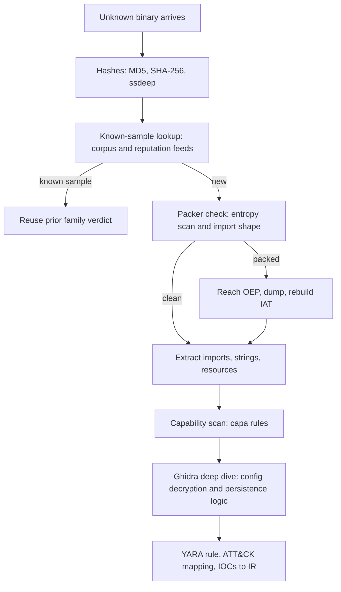
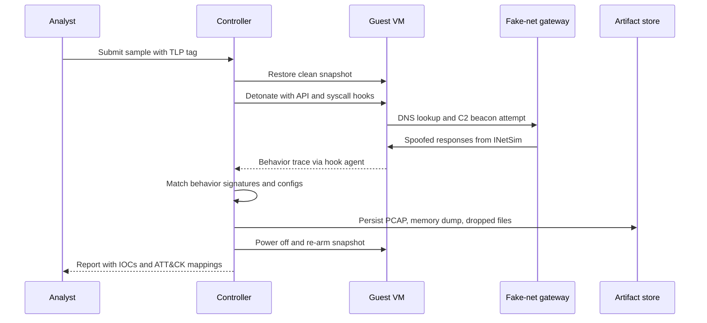

# Reverse Engineering & Malware Analysis

## Overview

Reverse engineering is the deepest binary-systems topic an interview can reach: it composes executable formats, linking, OS runtime behavior, and adversarial reasoning in one exercise. In detection-engineering and threat-intelligence roles the question is usually practical — "here is an unknown binary, triage it" — and the graded signal is a defensible pipeline, not trivia about opcode bytes. Malware analysis is RE applied to an adversary's code, and the deliverable is not a full reversal but a classification: what it does, how it persists, how to detect it, and what to hand the IR team (see [Security Incident Response & Forensics](../incident-response.md)).

One framing sentence before any technique: unauthorized reverse engineering carries real legal exposure, and interviews increasingly probe whether candidates know where the lines are. This page therefore covers ethics and legality first, then the static/dynamic spectrum, executable formats, the tooling stack, anti-analysis layers, dynamic instrumentation, YARA, Volatility 3 memory forensics, malware behavior taxonomy, detonation practice, and the detection-engineering handoff.

## Ethics and Legality First

Analyze only binaries you are authorized to touch: samples from your own environment, capture-the-flag artifacts, deliberately vulnerable practice targets, or material delivered under a contract with written scope. In the US, the DMCA anti-circumvention provision (17 U.S.C. § 1201) restricts bypassing technological protection measures, with a periodically renewed Library-of-Congress rulemaking carve-out for good-faith security research; computer-misuse statutes (CFAA and equivalents) define what "authorized access" means for live systems. End-user-license and terms-of-service clauses can prohibit reverse engineering even of software you legitimately own — these are contract disputes rather than criminal ones, but they matter for employment and publication.

Professional practice follows from the constraints: isolated lab hardware, no live-fire testing against systems you do not own, sanitized sample sharing under traffic-light-protocol tags, and coordinated disclosure for anything with victims. Exploit and tooling export controls (Wassenaar-type regimes) apply to publishing weaponized artifacts. Stating this unprompted in an interview is a positive signal — it separates engineers who have operated labs from people who have only watched conference talks.

## Static vs Dynamic Analysis

The two modes answer different questions. **Static analysis** reads the artifact without running it: hashes and fuzzy hashes for deduplication, packer and entropy triage, import tables and strings, then disassembly and decompilation for logic. It is safe (no execution on your infrastructure), exhaustive over reachable code paths, and reproducible — the same binary yields the same annotations forever. **Dynamic analysis** runs the sample under observation: API monitoring, network capture, sandbox detonation, debuggers, and instrumentation. It reveals what code actually does at runtime, including behavior that is invisible statically — dynamically decrypted strings, dynamically resolved imports, downloaded second stages, and the true C2 configuration.

### When Dynamic-Only Lies to You

The failure modes are symmetric, and interviewers probe exactly this. Dynamic-only analysis lies when the sample is evasive, and a clean detonation proves nothing by itself. The standard suppressors:

- **Sandbox detection** — hypervisor probes, missing user interaction, artifact files, or an analyzer's IP range make the sample behave benignly.
- **Environment gating** — system language, installed software, domain membership, or username checks steer behavior away from the lab.
- **Time bombs** — day-of-month or execution-count triggers mean every sandbox run you paid for shows the harmless path.
- **Sleeping past the clock** — long sleeps defeat the analysis timeout while looking like normal software.

A sample that only deploys ransomware after checking the system language will look harmless in every run — so "nothing happened" is a finding that demands a second method, never a verdict.

### When Static-Only Lies to You

Static-only analysis lies the other way, because the disassembly you read may not be the code that runs. Packed or virtualized code hides the real logic behind a stub; indirect calls and API hashing hide the import graph; dynamically decrypted strings never appear in the string table; and dead branches hide logic that only a runtime state unlocks. Mature practice alternates: static triage shapes what to instrument, dynamic observations point where to read, and each mode falsifies the other's conclusions.

| Aspect | Static | Dynamic |
|---|---|---|
| Question answered | What can this code do? | What did it do on this run? |
| Safety | No execution risk | Requires containment (lab/sandbox) |
| Coverage | All reachable paths, in principle | Only exercised paths |
| Evasion exposure | Packer/obfuscation hides logic | Environment checks suppress behavior |
| Reproducibility | Deterministic | Environment-dependent |
| Typical artifacts | Imports, strings, CFG, decompiled functions | API traces, PCAP, dropped files, memory image |

## Triage Pipeline: From Unknown File to Deep Dive

Real triage spends its effort in a fixed order, cheapest checks first, and the pipeline is worth memorizing because interviewers ask you to walk it. Hashes deduplicate before any compute happens (a known sample ends the analysis by reusing prior verdicts), packer detection decides whether static tooling will see real code at all, and imports plus strings scope which functions deserve the decompiler. Only then does the expensive deep dive start — and it starts on the unpacked stage, not the shipped artifact:



Two rules keep the pipeline honest. First, every branch condition is verified evidence — "packed" comes from measured entropy and import-table shape, not a tool's family guess alone. Second, the deliverables leave with confidence levels attached: YARA rules tested against a benign corpus, IOCs marked as rotating-fast, behavior claims tied to the function or trace that proved them.

## Executable Formats: ELF and PE

Loaders, packers, and memory-forensics plugins are all opinions about two format specifications, so an RE interview assumes working fluency with both. ELF (Linux, `man 5 elf`) separates the **linking view** (sections: `.text`, `.rodata`, `.data`, `.bss`, `.symtab`, relocation sections) from the **execution view** (program headers describing `PT_LOAD` segments the kernel or loader maps). Symbols come in `.symtab` (strippable) and `.dynsym` (needed at runtime); calls into shared libraries route through the PLT/GOT indirection, which is why lazy binding shows unresolved thunks in a static disassembly. Relocations (`R_X86_64_RELATIVE`, `R_X86_64_GLOB_DAT`, and friends) are what make position-independent executables work, and RE tools replay them when reconstructing a stripped binary. The repo's [ELF Format](../../linux/sysprog/elf.md) page covers the structure in depth, and patching/rewriting concerns are treated in [Binary Rewriting](../../compilers/advanced/binary-rewriting.md).

Stripped binaries are the normal case in this work, and the format tells you what survives: after `strip`, ELF keeps `.dynsym` (imported/exported names the runtime needs) and loses local symbols, so function recovery leans on cross-references, calling conventions, and unwind tables; PE shippers routinely strip COFF symbols and keep only the PDB path or a GUID. A quick orientation pass over an ELF sample, all read-only:

```text
$ file sample.elf                 # arch, linkage, stripped or not
$ readelf -h sample.elf           # type (EXEC/DYN), entry point, machine
$ readelf -S sample.elf           # sections: .text, .rodata, .symtab, .eh_frame
$ readelf -lW sample.elf          # segments: which sections load where (RWE flags)
$ readelf -d sample.elf           # DT_NEEDED, RPATH, flags (BIND_NOW, PIE)
$ readelf --dyn-syms sample.elf   # what survived stripping
```

PE/COFF (Windows) is the counterpart: a DOS stub and `MZ` header, the PE/COFF header, the optional header (entry point, image base, subsystem), and a section table (`.text`, `.rdata`, `.data`, `.reloc`, `.pdata`). Imports resolve through the Import Directory Table into the IAT, which the loader patches — packed samples famously ship only `LoadLibraryA`/`GetProcAddress` imports and rebuild the real IAT themselves at unpack time. Exception handling on x64 is table-based (`.pdata`/`.xdata` unwind information, walked by `RtlUnwindEx`), whereas ELF binaries carry DWARF CFI in `.eh_frame`; RE tools use both for stack reconstruction, and missing unwind data is a common cause of broken decompiler output. Debug information diverges structurally: DWARF sections live in the ELF file (or separate `.debug` files), while Windows debug info lives in a PDB sidecar matched by GUID, which is why symbol servers matter so much on Windows triage.

| Aspect | ELF (Linux) | PE/COFF (Windows) |
|---|---|---|
| Top-level layout | ELF header, program headers, sections | DOS header, PE/COFF header, optional header, section table |
| Execution view | `PT_LOAD` segments from program headers | Sections mapped at the image base; ASLR rebase via `.reloc` |
| Imports | `DT_NEEDED` + PLT/GOT indirection | Import Directory Table → loader-resolved IAT |
| Exceptions/unwinding | DWARF CFI in `.eh_frame` | Table-based SEH: `.pdata`/`.xdata` unwind info |
| Debug formats | DWARF (`.debug_info` et al.) | PDB sidecar matched by GUID/path |
| Symbols | `.symtab` (strippable), `.dynsym` (runtime) | COFF symbols mostly stripped in shipping binaries |

## The Tooling Stack

**Ghidra** (NSA, open source) is the default free decompiler platform. A practical workflow: import with the correct loader and compiler spec, run auto-analysis, triage from entry point and strings' cross-references, then read decompiler output alongside the listing — never instead of it. Two Ghidra features matter at scale: **FunctionID** databases recognize library functions (C++ stdlib, statically linked runtime) so you stop reversing `memcpy` clones, and **version tracking** diffs two binaries and ports function renames, comments, and data marks from an older analysis to a new build — the mechanism analysts use to follow a malware family across versions. The **headless analyzer** (`analyzeHeadless`) runs import-analysis-script projects in CI: batch-decompile a corpus, dump function counts, or auto-extract constants with a script in Java or Python.

**radare2/rizin** is the CLI-first alternative — the workflow of choice when a GUI gets in the way or when you want RE steps inside a shell pipeline. A typical triage session reads like this:

```text
$ r2 -A sample.elf          # load and analyze (aaa depth)
[0x00401050]> afl           # list analyzed functions with sizes
[0x00401050]> iz~password   # strings matching a keyword
[0x00401050]> s sym.check   # seek to a function of interest
[0x00401050]> pdf           # disassemble the function
[0x00401050]> axt @ 0x4040a0  # who references this address?
[0x00401050]> agCd          # CFG of the current function
```

Everything above pipes into Unix tooling or batch scripts, which is what makes r2 the automation layer for whole corpora. **Cutter** is the Qt GUI for rizin and the friendliest on-ramp; **Binary Ninja** sits in the commercial tier with a clean intermediate representation and a strong Python API, and IDA Pro remains the industry incumbent. Trust levels, because this is the graded nuance: linear disassembly misinterprets data embedded in code, recursive-descent misses non-referenced code (jump tables built at runtime, indirect dispatch), and decompiler output is a *hypothesis* — recovered types are guesses, calling conventions are inferred, and obfuscators target decompiler heuristics specifically. The discipline is to verify every load-bearing claim in the raw disassembly and in a dynamic trace before writing it into a report.

## Anti-Analysis Techniques and How Analysts Peel Them

**Packing** compresses or encrypts the real payload behind a small stub that unpacks at runtime. The tells are per-section entropy pushing toward 8 bits/byte, an import table of two or three functions, and section names from packer families (UPX is the open-source one every analyst must recognize on sight). Peeling: let the stub run until the original entry point (OEP), then dump the process and rebuild the IAT with a tool such as Scylla; emulation (Unicorn/Qiling) or execution tracing finds the OEP without running anything real on your host. **Control-flow flattening** rewrites a function into a dispatcher loop over a state variable so the CFG becomes a blob; **opaque predicates** add branches that are always decided the same way but are hard to prove statically. Peeling is pattern recognition plus tooling — identify the dispatcher, resolve the state variable's transitions, and let symbolic execution or scripted simplification collapse constant branches.

**Anti-debug tricks** on Linux center on `ptrace`: a process calls `PTRACE_TRACEME` on itself and fails if a debugger already attached; analysts also see `TracerPid` checks in `/proc/self/status`, SIGTRAP-handler games, `int3` scanning, and `rdtsc` timing checks. The peel is to patch the check out, use a stealth plugin (ScyllaHide on Windows), or answer the check from instrumentation rather than a debugger. **Anti-VM checks** look for the hypervisor CPUID bit, VMware's backdoor I/O port, vendor MAC prefixes, registry artifacts, missing user interaction, and analysis-tool file names — the al-khaser test suite is the canonical catalog of these probes. Peeling means hardening the guest (scrubbing artifacts, faking interaction, sane uptime) and, for the most paranoid cases, detonating on bare metal. **Packed-import resolution** is the glue skill: after any unpack, the analyst rebuilds the import table so the dumped binary is loadable and decompilable, usually by tracing which addresses the running stub resolved for `LoadLibraryA`/`GetProcAddress`.

| Layer | Tell an analyst sees | How it is peeled |
|---|---|---|
| Packing (UPX-class) | Entropy ~8 bits/byte, 2-3 imports | Reach OEP, dump, rebuild IAT (Scylla) |
| Flow flattening | Dispatcher loop, state-variable CFG | Resolve state transitions; simplify with emulation |
| Opaque predicates | Constant-condition branches | Symbolic execution; scripted pattern rewrite |
| Anti-debug (`ptrace`) | `TracerPid`/self-attach checks, timing | Patch check; stealth debugger plugins |
| Anti-VM | CPUID hypervisor bit, MAC/registry probes | Harden guest; bare-metal detonation |
| Import hiding | API hashing, dynamic resolution | Trace resolvers; reconstruct IAT from runtime state |

## Dynamic Instrumentation for Analysis

**Scripted GDB** is the zero-dependency baseline: `gdb -x script` with the Python API sets breakpoints on `decrypt`-shaped functions, dumps buffers at return, and logs register state — enough to extract configuration from a sample that decrypts strings on the fly:

```python
# dump-at-return.py — capture a decryption buffer as the function returns
class DumpAtReturn(gdb.Breakpoint):
    def stop(self):
        buf = gdb.parse_and_eval("(char*)$rdi")
        length = int(gdb.parse_and_eval("$rbx"))
        open("dump.bin", "wb").write(
            bytes(gdb.selected_inferior().read_memory(buf, length)))
        return False   # continue silently — the sample never notices

DumpAtReturn("*decrypt_config")
gdb.execute("run")
```

**Frida** is the workhorse for API-level hooking: attach to a running process, inject JavaScript that wraps `Interceptor` on native functions, and rewrite arguments or returns live. Analysts use it to defeat self-checks, dump payloads as they decrypt, and trace which registry keys, files, and sockets a Windows sample touches without a full debugger session:

```javascript
// neuter a ptrace self-check, then log every file opened
const ptrace = Module.findExportByName(null, "ptrace");
Interceptor.replace(ptrace, new NativeCallback(() => 0, "long", ["int", "int"]));

Interceptor.attach(Module.findExportByName(null, "open"), {
    onEnter(args) { console.log("open -> " + args[0].readUtf8String()); }
});
```

**Unicorn** (CPU emulation) and **Qiling** (full-system emulation with OS shims) fill the emulation sandbox role: unpack a stage without executing it natively, emulate an ARM router firmware's dropper on an x86 workstation, or fuzz a parser harvested from a binary. Emulation also gives deterministic single-stepping for OEP hunting in packed samples without letting anything execute natively on the analysis host. Coverage-guided fuzzing of extracted code shares its machinery with sanitizer instrumentation (see [Sanitizer Internals](./sanitizer-internals.md) and [Fuzz Testing](../../testing/fuzz-testing.md)) — a common practice loop is to carve a parser from a malware binary and fuzz it for the same memory-safety bugs the malware author exploited.

## YARA: Rules for Classification at Scale

YARA is the de-facto rule language for identifying and classifying malware by patterns, and interviews at detection shops often ask for a rule on the whiteboard. Anatomy: a `meta` block (author, reference, date), a `strings` block (text with `wide ascii` modifiers, hex with wildcards and jumps like `{ 6A 40 68 ?? 8D 91 }`, regex), a `condition` (Boolean logic over matches plus file properties), and optional imports such as the **PE module** for structural conditions. A serviceable rule:

```yara
import "pe"

rule crime_dropper_svc_mutex
{
    meta:
        author = "ir-team"
        reference = "internal case 2411"
        family = "placeholder"
    strings:
        $mutex = "Global\\SvcMutex_9f2" wide ascii
        $blob  = { 6A 40 68 00 30 00 00 6A 14 8D 91 }
        $ua    = "Mozilla/4.0" fullword
    condition:
        uint16(0) == 0x5A4D and filesize < 2MB
        and pe.number_of_sections > 5 and 2 of ($*)
}
```

Performance care is the senior-level part of the answer. Short or generic strings (`MZ`, common URLs) match thousands of benign files, so rules need discriminating anchors: a unique mutex, a distinctive byte sequence, or a PE-module condition like `pe.number_of_sections > 7 and pe.exports("SvcMain")`. `filesize` and module checks act as cheap pre-filters before expensive regexes run; unbounded regexes and wide-ascii pairs are the classic YARA scan-DoS. In bulk matching (a VirusTotal-style retrohunt over terabytes), well-scoped rules are the difference between minutes and hours, and every rule deserves a false-positive pass over a clean corpus before it ships — the reference documentation's own guidance is to write rules against real samples and test against benign software.

## Memory Forensics with Volatility 3

Acquisition comes first, because RAM is the most volatile evidence: a full memory image captured before power-off preserves injected code, decrypted payloads, C2 configuration, and keys that never touch disk. On Linux the usual tools are **LiME** (a loadable kernel module that dumps physical memory) and Google's **avml** (user-space capture); on Windows, winpmem-class tools produce a raw image. Volatility 3 then requires **symbol tables per kernel build** — ISF-format JSON describing the exact kernel version's structures — so acquisition must record the OS build, and Linux analysis needs the matching kernel symbols, a detail that surprises people the first time `linux.pslist` refuses to run.

The concrete workflow over an image, in the order an analyst actually runs it:

```text
$ vol -f mem.lime windows.pslist          # active process list (EPROCESS walk)
$ vol -f mem.lime windows.psscan          # pool scan: processes unlinked from the list
$ vol -f mem.lime windows.netscan         # TCP endpoints + owning process
$ vol -f mem.lime windows.malfind         # RWX VADs not backed by a file
$ vol -f mem.lime windows.cmdline --pid 4711
$ vol -f mem.lime windows.dlllist --pid 4711
```

`windows.pslist` walks the active process list, and `windows.psscan` pool-scans for processes unlinked from that list (rootkit hiding) — disagreement between the two is itself the detection. `windows.malfind` flags VAD regions that are executable and not backed by a file on disk, the signature of injected code; `windows.cmdline` and `windows.dlllist` recover arguments and loaded modules for whatever was flagged. A hit sequence like "psscan finds a hidden `svchost`, malfind shows RWX code in it, netscan shows its socket" is a complete detection story with process context that no disk artifact provides. What RAM reveals that disk cannot: fileless malware whose code exists only in memory, process hollowing remnants, injected shellcode, decryption keys, and the live C2 configuration — which is why the IR containment order is memory before reimage (see [Security Incident Response & Forensics](../incident-response.md)).

## Malware Behavior Taxonomy

**Command-and-control** is the heartbeat: beacons on an interval with **jitter** (a 60-second beacon with 20 percent jitter lands every 48-72 seconds, defeating naive periodicity detection), domains from DGAs, fast-flux fronting, or C2 embedded in legitimate services. Detection therefore keys on statistical shape — low inter-arrival variance over hours, impossible-for-humans regularity — rather than on any single indicator. **Persistence** is the mechanism that survives reboot, and the cross-platform table is a standard interview artifact:

| Layer | Linux | Windows |
|---|---|---|
| Scheduler | systemd timers, cron, `/etc/cron.d`, `at` | Task Scheduler, `schtasks` |
| Service registration | systemd units, init scripts | Services, registry Run/RunOnce keys |
| Code-loading hooks | `ld.so.preload`, shell rc files, udev rules | WMI event subscriptions, AppInit_DLLs, COM hijacks, DLL side-loading |
| Credential-position persistence | `~/.ssh/authorized_keys` additions | Sticky-keys/utilman binary replacement |
| Kernel/driver | Loadable kernel modules | Kernel drivers, bootkits |
| Container/cloud | Host-mounted cron from containers, IMDS abuse | Container escape to host services |

**Lateral movement** reuses credentials: SSH key reuse, pass-the-hash over SMB, RDP, and admin-share tooling — detections watch for a credential used from a host that never used it before. **Crypters and loaders** structure modern delivery: a small signed or macro-laden dropper fetches a second stage, decrypts it in memory, and invokes it reflectively so no protected payload ever lands on disk in plaintext — which is why endpoint telemetry (process lineage) beats file scanning. **Living-off-the-land** trades binaries for trust: `certutil`, `bitsadmin`, `mshta`, `rundll32`, PowerShell on Windows; `curl | bash`, base64 pipelines, and compiler misuse on Linux. The detection consequence is that LOLBin abuse looks like administration, so baselining normal use per host class matters more than signature matching.

## Sandbox and Detonation Practice

The Cuckoo sandbox lineage (Cuckoo and its maintained forks such as CAPE, which adds behavior signatures and config extraction) still defines the workflow: submit a sample, restore a clean VM snapshot, detonate under API/behavior monitoring, capture network traffic through a fake-internet gateway (INetSim/FakeNet answering every DNS and HTTP request), persist artifacts, and restore the snapshot. Evasive malware is the operational reality: samples sleep past the sandbox timeout, check for user interaction, detect the hypervisor, or refuse to run without real internet — so production detonation includes anti-evasion measures and, for high-value cases, bare-metal appliances. Safe lab design is non-negotiable and interviewers ask for it: fully isolated VLAN with no route to production or corporate DNS, snapshots restored between runs, capture out-of-band (a SPAN port rather than in-guest tooling an attacker can detect), hardened host keys, and explicit rules for handling samples with worm-like behavior.



## Detection Engineering Handoff

Analysis earns its cost only when it changes detection. The handoff artifacts are: **YARA rules** for file stores, email gateways, and retrohunts; **Sigma-style detections** expressing the behavior as log queries a SIEM can run; and **ATT&CK technique mappings** ([MITRE ATT&CK](https://attack.mitre.org/)) so coverage is measurable. The senior insight is **TTPs versus IOCs**: indicators (hashes, C2 domains, mutexes) rot in days as infrastructure rotates, while behaviors (process lineage of a WMI subscription spawning PowerShell, service install followed by beaconing) survive tool rewrites — so detections should privilege behavior, with IOCs as cheap add-ons. The handoff loop is adversarial: publish a detection, the adversary (or your red team) tests and bypasses it, telemetry shows the bypass, and the detection iterates — treating rules as code with review, tests, and versioning is what "detection-as-code" means. Runtime telemetry sources for those rules are covered in [Host Detection & Response](./host-detection-response.md) and [eBPF for Security](../ebpf-security.md).

## CTF and Skill-Building Path

The skills are built by loops, not reading. Practice targets with escalating difficulty: **pwnable.kr** (exploitation challenges with a friendly scoring curve), **crackmes.one** (keygen-me challenges that are pure Ghidra/anti-tamper practice), and CTF reversing categories (picoCTF for warm-up, then national-level CTF archives). A sustainable weekly loop: one crackme fully reversed in Ghidra (rename everything, write a keygen), one anti-analysis technique implemented yourself (write a `ptrace` check, then bypass it), and one YARA rule written against a real benign corpus until its false-positive rate is zero. Ghidra headless scripting doubles as practice and production: a script that batch-decompiles a folder, counts library-recognizable functions, and extracts constant tables is a Saturday project that makes Monday triage faster — and it is exactly the automation story detection teams want to hear in interviews.

## Interview Questions

1. **When does dynamic analysis lie to you, and what do you do about it?** Evasive samples suppress behavior under instrumentation: they detect sandboxes, check for user interaction, sleep past the timeout, or gate on environment traits (system language, date). A clean detonation proves absence of behavior only for that environment. Counter it by triangulating — static reads of the unpacked stage, sandbox-hardening (artifact scrubbing, faked interaction), longer and repeated detonations, bare metal for high-value cases — and by treating "nothing happened" as a finding that demands a second method, never as a verdict.

2. **Walk me through triaging an unknown binary end to end.** Hashes (MD5/SHA-256/ssdeep) against known-sample stores, then packer/entropy triage; if packed, unpack to OEP and dump with IAT rebuild. Extract imports, strings, and run a capability scan (capa) to scope behavior. Ghidra deep dive only on the functions that matter (entry, config decryption, persistence), verified against disassembly. Finish with deliverables: behavior summary, ATT&CK mapping, YARA rule tested for false positives, and IOCs handed to the IR pipeline.

3. **How does Volatility find a hidden process, and what does memory give you that disk cannot?** `pslist` walks the kernel's EPROCESS list, which a rootkit can unlink from; `psscan` instead pool-scans for the structure's signatures, finding unlinked processes — the disagreement between the two is itself the detection. Memory adds what disk cannot hold: fileless code, injected RWX regions (malfind), live C2 configuration, decrypted payloads, and keys. That is why IR acquires memory before reimaging.

4. **What makes a YARA rule good rather than merely working?** Discriminating anchors (unique mutex, distinctive byte sequence, PE-structural condition) rather than generic strings; cheap pre-filters (`filesize`, module checks) before expensive regexes; explicit `wide ascii` coverage decisions; and a measured false-positive pass over a benign corpus plus a scan-time target, because an unfounded rule is a scan-DoS at scale. Rules are versioned code with review, like any other detection.

5. **A sample is UPX-packed with API-hashed imports. How do you get to analyzable code?** Confirm packing via per-section entropy and the import table shape. Reach the original entry point by letting the stub run under a debugger or emulator, watching for the unpacking loop's final transfer; dump the process image at OEP; rebuild the IAT by tracing the addresses the stub resolved through `LoadLibraryA`/`GetProcAddress` (Scylla-class tooling); then re-import the fixed dump into Ghidra and confirm the strings/decompiler output now reflect real logic.

6. **IOCs versus TTPs — how does that distinction shape what you ship after an analysis?** IOCs (hashes, domains, mutex names) are trivially actionable but age in days as infrastructure rotates; TTPs are behaviors mapped to ATT&CK techniques and survive tool rewrites. Ship both, weighted by durability: behavioral detections on process lineage and scheduler/service abuse carry the coverage, IOCs become cheap retrohunt and blocking add-ons, and the ATT&CK mapping is how you report coverage gaps instead of a pile of one-off signatures.

## Key Takeaways

- Static and dynamic analysis fail in opposite directions — packing hides logic statically, evasion suppresses behavior dynamically — so the discipline is alternating modes, each falsifying the other's conclusions.
- Triage is a pipeline, not a vibe: hashes → packer/entropy → imports/strings → capability scan → targeted Ghidra, with every load-bearing claim verified in disassembly or a trace.
- ELF and PE fluency (sections vs segments, PLT/GOT vs IAT, `.eh_frame` vs `.pdata`, DWARF vs PDB) underpins every tool in the stack; the loaders, packers, and forensics plugins are opinions about those formats.
- Anti-analysis comes in peelable layers — packing, flattening, anti-debug, anti-VM — each with a recognizable tell and a standard peel; knowing both sides is the graded skill.
- Memory forensics requires per-kernel symbol tables and acquisition before power-off; pslist-vs-psscan disagreement and malfind RWX regions are complete detection stories disk artifacts cannot tell.
- Detection handoff privileges TTPs over IOCs, ships YARA/Sigma as reviewed code, and maps to ATT&CK so coverage is measurable and bypasses are iterable.
- Labs and ethics are part of the craft: isolated networks, snapshots, fake-internet gateways, legal scope awareness — stating these unprompted signals real operational experience.

## References

- [Ghidra](https://ghidra-sre.org/) — NSA's open-source reverse-engineering platform; release binaries include full offline documentation.
- [Ghidra source](https://github.com/NationalSecurityAgency/ghidra) — the NationalSecurityAgency repository.
- [The radare2 book](https://book.rada.re/) — the canonical `r2` command reference.
- [radare2 source](https://github.com/radareorg/radare2) — the RE toolkit repository.
- [Cutter](https://cutter.re/) — Qt GUI for rizin; the friendliest entry into binary analysis.
- [Cutter source](https://github.com/rizinorg/cutter) — the rizinorg repository.
- [YARA documentation](https://virustotal.github.io/yara/) — rule syntax, modules, and performance guidance.
- [YARA source](https://github.com/VirusTotal/yara) — VirusTotal's pattern-matching engine and libyara.
- [Volatility 3 documentation](https://volatility3.readthedocs.io/) — framework, symbol tables, and plugin reference.
- [Volatility 3 source](https://github.com/volatilityfoundation/volatility3) — the Volatility Foundation repository.
- [capa](https://github.com/mandiant/capa) — Mandiant's capability detection for executables.
- [ELF man page](https://man7.org/linux/man-pages/man5/elf.5.html) — the executable-format specification every Linux tool encodes.
- [PE format](https://learn.microsoft.com/en-us/windows/win32/debug/pe-format) — Microsoft's PE/COFF specification.
- [MITRE ATT&CK](https://attack.mitre.org/) — the TTP vocabulary used for coverage mapping.
