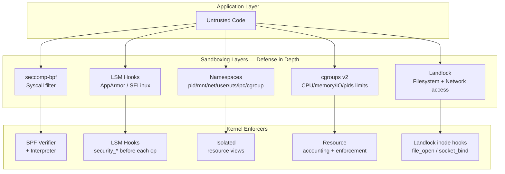

# Sandboxing and Isolation

## Overview

Sandboxing constrains a process's capabilities — restricting which syscalls it can make, which files it can access, which network endpoints it can reach, which kernel resources it can manipulate, and what privileges it holds. Defense in depth requires multiple sandboxing layers: syscall filtering (seccomp), Mandatory Access Control (AppArmor, SELinux), filesystem restrictions (Landlock), namespace isolation (containers), resource limits (cgroups), and language-level sandboxing (WASM). This chapter covers the complete Linux sandboxing stack, container escape techniques, WebAssembly sandboxing, and browser sandboxing internals.



## seccomp-bpf

`seccomp` (secure computing mode) restricts the syscalls a process can invoke. In `SECCOMP_MODE_FILTER` mode, a BPF program (classic BPF, not eBPF) is attached to the calling process and all its children. The BPF program receives the syscall number and arguments and returns an action: `SECCOMP_RET_ALLOW`, `SECCOMP_RET_KILL_PROCESS`, `SECCOMP_RET_KILL_THREAD`, `SECCOMP_RET_TRAP`, `SECCOMP_RET_ERRNO(errno)`, `SECCOMP_RET_TRACE` (notify ptrace), or `SECCOMP_RET_LOG`.

### BPF Filter Structure

The seccomp BPF program receives a `struct seccomp_data` containing the syscall metadata:

```c
struct seccomp_data {
    int nr;               // syscall number (__NR_xxx)
    __u32 arch;           // AUDIT_ARCH_* (e.g., AUDIT_ARCH_X86_64)
    __u64 instruction_pointer;
    __u64 args[6];        // up to 6 syscall arguments
};
```

The BPF program evaluates this struct and returns an action. Classic BPF is a simple instruction set: load, compare, jump, return. The maximum program length is 4096 instructions, checked by the kernel's BPF verifier before loading.

### Writing a seccomp filter (C)

```c
#include <linux/seccomp.h>
#include <linux/filter.h>
#include <sys/prctl.h>
#include <stddef.h>
#include <errno.h>

/* Allow only read, write, exit, exit_group, and futex */
struct sock_filter filter[] = {
    /* Load syscall number */
    BPF_STMT(BPF_LD | BPF_W | BPF_ABS, offsetof(struct seccomp_data, nr)),
    /* Jump table: check each allowed syscall */
    BPF_JUMP(BPF_JMP | BPF_JEQ | BPF_K, __NR_read,       0, 4),
    BPF_JUMP(BPF_JMP | BPF_JEQ | BPF_K, __NR_write,      0, 3),
    BPF_JUMP(BPF_JMP | BPF_JEQ | BPF_K, __NR_exit,       0, 2),
    BPF_JUMP(BPF_JMP | BPF_JEQ | BPF_K, __NR_exit_group, 0, 1),
    BPF_JUMP(BPF_JMP | BPF_JEQ | BPF_K, __NR_futex,      0, 0),
    /* Allow (fall through from last match) */
    BPF_STMT(BPF_RET | BPF_K, SECCOMP_RET_ALLOW),
    /* Kill process for any other syscall */
    BPF_STMT(BPF_RET | BPF_K, SECCOMP_RET_KILL_PROCESS),
};

struct sock_fprog prog = {
    .len = sizeof(filter) / sizeof(filter[0]),
    .filter = filter,
};

/* PR_SET_NO_NEW_PRIVS prevents the process from gaining privileges
   (required before installing a seccomp filter without CAP_SYS_ADMIN) */
prctl(PR_SET_NO_NEW_PRIVS, 1, 0, 0, 0);
syscall(__NR_seccomp, SECCOMP_SET_MODE_FILTER, 0, &prog);
```

### seccomp in Docker and Kubernetes

Docker's default seccomp profile blocks ~44 of ~330 syscalls on x86_64 (e.g., `keyctl`, `add_key`, `acct`, `bpf`, `userfaultfd`, `unshare`, `pivot_root`, `mount`, `kexec_load`, `perf_event_open`). This prevents many container escape and privilege escalation vectors. The profile is generated by the [runc/libcontainer](https://github.com/opencontainers/runc/tree/main/libcontainer/seccomp) seccomp profile generator and applies to all containers by default.

```bash
# Docker: default seccomp profile (most Docker commands)
docker run --rm alpine cat /proc/self/status | grep Seccomp
# Seccomp:      2 (SECCOMP_MODE_FILTER)

# Run with no seccomp (dangerous — removes all syscall restrictions)
docker run --security-opt seccomp=unconfined alpine ...

# Run with a custom seccomp profile (JSON format)
docker run --security-opt seccomp=/path/to/my-seccomp.json alpine ...
```

### Kubernetes seccomp Profiles

Kubernetes supports `seccompProfile` in the pod security context:

```yaml
apiVersion: v1
kind: Pod
spec:
  securityContext:
    seccompProfile:
      type: RuntimeDefault          # Use node's default seccomp profile
  containers:
  - name: app
    securityContext:
      seccompProfile:
        type: Localhost              # Custom profile from node filesystem
        localhostProfile: profiles/strict.json
      # or: type: Uncconfined         # No seccomp (dangerous)
```

Custom profiles are stored on each node at `/var/lib/kubelet/seccomp/profiles/` and referenced by filename.

### SECCOMP_RET_USER_NOTIF

Linux 5.0+ adds `SECCOMP_RET_USER_NOTIF`: instead of killing the process or returning an error, the kernel pauses the process and sends a notification (via a file descriptor) to a supervisor process. The supervisor can inspect the syscall number and arguments, make a policy decision, and choose to allow or deny the syscall. This enables "syscall mediation" — a userspace security monitor with richer logic than BPF can express.

**Use case: Flatpak's portal model.** Sandboxed applications that need to open files (e.g., a document editor opening `~/Documents/report.pdf`) get their `openat()` mediated by the Flatpak portal. The portal presents a file picker to the user. If the user selects the file, the portal grants access to that specific file descriptor. The sandbox never gains arbitrary filesystem access.

```c
// SECCOMP_RET_USER_NOTIF supervisor (simplified)
// 1. Install seccomp filter with SECCOMP_RET_USER_NOTIF for openat
// 2. Read notifications from the seccomp notification fd
// 3. For each notification:
//    a. Get the pathname from the process's memory (via process_vm_readv or /proc/pid/mem)
//    b. Check policy: is this path allowed?
//    c. Write response: allow (SECCOMP_USER_NOTIF_FD) or deny (SECCOMP_USER_NOTIF_ALLOW=0)
```

## AppArmor

AppArmor is a **path-based** Mandatory Access Control (MAC) system using Linux Security Module (LSM) hooks. Policies are loaded as text profiles that specify which files a program can read, write, execute, which capabilities it can use, and which network operations it can perform. AppArmor is the default MAC on Ubuntu, SUSE, and many container runtimes.

### Profile Example

```
# /etc/apparmor.d/usr.sbin.nginx
#include <tunables/global>

/usr/sbin/nginx {
  #include <abstractions/base>
  #include <abstractions/nameservice>
  #include <abstractions/nvidia>  # If using GPU acceleration

  # Allow read access to web root and static assets
  /var/www/html/** r,
  /var/www/html/**/index.html r,
  /usr/share/nginx/** r,

  # Allow write to logs and temp files
  /var/log/nginx/** rw,
  /var/lib/nginx/** rw,

  # Allow binding to HTTP/HTTPS ports
  network inet tcp,
  network inet6 tcp,

  # Explicitly deny sensitive files
  deny /etc/shadow rwklx,
  deny /etc/passwd w,
  deny /etc/ssh/** rwklx,

  # Capabilities: allow only what nginx needs
  capability setuid,
  capability setgid,
  capability chown,
  capability net_bind_service,

  # Signal handling
  signal (receive) set={term, int},
}
```

### Enforcement Modes

| Mode | Behavior | Use Case |
|------|----------|----------|
| `enforce` | Violations are blocked and logged to `/var/log/kern.log` | Production |
| `complain` | Violations are logged but not blocked | Testing new profiles |
| `unconfined` | No AppArmor restrictions | Default for unprofiled binaries |

### Profile Management

```bash
# Check profile status
aa-status

# Switch mode
aa-complain /etc/apparmor.d/usr.sbin.nginx  # Log only
aa-enforce /etc/apparmor.d/usr.sbin.nginx    # Enforce

# Load a new/modified profile
apparmor_parser -r /etc/apparmor.d/usr.sbin.nginx

# Generate a profile from observed behavior (learning mode)
aa-genprof /usr/sbin/nginx
# (interactively: run the application, aa-genprof suggests rules based on accesses)

# Check logs for denials
dmesg | grep apparmor
journalctl -k | grep apparmor
```

## SELinux

SELinux enforces **Mandatory Access Control (MAC)** based on security labels (contexts) attached to every process, file, socket, IPC object, and file descriptor. Access decisions are made by a kernel policy that defines which *types* (process labels) can access which *types* (object labels) via which *permissions* (read, write, execute, open, getattr, etc.). SELinux is the default MAC on RHEL, Fedora, CentOS, Android, and many HPC systems.

### Security Context

Every process and filesystem object has a 4-part security context:

```bash
# Process context: user:role:type:level (MLS)
$ ps -Z
system_u:system_r:httpd_t:s0  1234 root nginx

# File context
$ ls -Z /var/www/html/
system_u:object_r:httpd_sys_content_t:s0 index.html

# Socket context
$ ls -Z /var/run/nginx.sock
system_u:object_r:httpd_var_run_t:s0 socket
```

The **type** field is the primary enforcement mechanism (Type Enforcement, TE). The MLS (Multi-Level Security) level is used in military/government systems for data classification. In most Linux deployments, MLS is disabled and enforcement is type-only.

### Type Enforcement

The core of SELinux: a policy defines which process types can access which object types via which permission classes. If no allow rule exists, access is denied (default deny).

```
# Simplified SELinux policy excerpt
# Process type: httpd_t (web server process)
# Object types: httpd_sys_content_t (web content), httpd_log_t (logs), shadow_t (password file)

# httpd_t can read web content
allow httpd_t httpd_sys_content_t:file { read getattr open lock ioctl };

# httpd_t can write to log files
allow httpd_t httpd_log_t:file { read write append create getattr open unlink rename };

# httpd_t can bind TCP sockets (listen for HTTP)
allow httpd_t httpd_port_t:tcp_socket { name_bind };

# NO rule exists for: httpd_t → shadow_t:file
# Therefore: httpd_t CANNOT read /etc/shadow (default deny)

# Type transitions: when httpd_t creates a file in /var/log,
# the new file gets httpd_log_t type automatically
type_transition httpd_t var_log_t:file httpd_log_t;
```

### Common SELinux Booleans

```bash
# Allow nginx to act as reverse proxy (connect to upstream backends)
setsebool -P httpd_can_network_connect 1

# Allow containers to use host networking
setsebool -P container_use_host_network 1

# Allow httpd to send mail (for contact forms)
setsebool -P httpd_can_sendmail 1

# Troubleshoot: check why access was denied
ausearch -m AVC,USER_AVC,SELINUX_ERR -ts recent
sealert -l <audit_id>  # Human-readable explanation + suggested fix

# Temporarily disable SELinux (emergency only, not a fix)
setenforce 0  # Permissive: log but don't enforce
setenforce 1  # Enforcing
```

### AppArmor vs. SELinux

| Aspect | AppArmor | SELinux |
|--------|----------|--------|
| Policy model | Path-based, allow-list | Label-based (inode context), type enforcement |
| Learning curve | Low (declarative profiles, easy to write) | High (policy language with rules, types, transitions, Booleans) |
| Granularity | File paths, capabilities, network | Inodes, sockets, pipes, IPC objects, all file classes |
| Performance impact | Low (path string comparison on each access) | Moderate (label lookup on every kernel access check) |
| Default distros | Ubuntu, SUSE, many container runtimes | RHEL, Fedora, CentOS, Android |
| Dynamic reloading | Yes (without reboot) | Yes (policy reload, no reboot needed) |
| Multi-category | No | Yes (MLS — mandatory for US gov systems) |

## Landlock

Landlock (merged in Linux 5.13, extended in 5.19 and 6.x) is an **unprivileged sandboxing** mechanism. Unlike seccomp (syscall-level, requires understanding kernel ABI) or SELinux/AppArmor (require root to load policy), any process can use Landlock to restrict its *own* access to filesystem and network resources. The kernel enforces that Landlock rules can only **reduce** access — a process can never grant itself more access than it already has. This makes Landlock safe to use from within unprivileged application code, sandbox libraries, or child processes.

### Rust Landlock Example

```rust
use landlock::{Ruleset, RulesetAttr, AccessFs, Access};
use std::path::PathBuf;

fn sandbox_to_readonly_data() -> Result<(), Box<dyn std::error::Error>> {
    let abi = landlock::ABI::V2;

    // Define what access rights we want to restrict
    let attr = RulesetAttr {
        // Restrict these filesystem operations
        handled_access_fs: AccessFs::from_bits(
            AccessFs::READ_FILE | AccessFs::READ_DIR |
            AccessFs::WRITE_FILE | AccessFs::REMOVE_FILE |
            AccessFs::MAKE_DIR | AccessFs::MAKE_REG |
            AccessFs::MAKE_SYM | AccessFs::MAKE_FIFO |
            AccessFs::MAKE_SOCK | AccessFs::MAKE_BLOCK |
            AccessFs::MAKE_CHAR | AccessFs::TRUNCATE
        ),
        // Restrict these network operations (ABI V2+)
        handled_access_net: Access::empty(),
    };

    // Create ruleset
    let mut ruleset = Ruleset::new(abi, attr)?;

    // Add rules: allow read access to specific directories
    // Everything NOT explicitly allowed will be DENIED after restrict_self()
    ruleset.add_rule(PathBuf::from("/usr"), abi)?;
    ruleset.add_rule(PathBuf::from("/data/public"), abi)?;
    ruleset.add_rule(PathBuf::from("/etc"), abi)?;

    // Apply the ruleset to ourselves (irreversible!)
    ruleset.restrict_self()?;

    // From this point forward:
    // - /usr, /data/public, /etc: READ allowed
    // - Everything else: WRITE/CREATE/DELETE/TRUNCATE blocked (EPERM)
    // - This cannot be undone (even by the process itself)

    Ok(())
}
```

### Landlock vs. seccomp vs. LSM

| Feature | Landlock | seccomp-bpf | AppArmor/SELinux |
|---------|----------|-------------|------------------|
| Unprivileged | Yes (any process) | Yes (with no_new_privs) | No (root/CAP_MAC_ADMIN loads policy) |
| Granularity | Filesystem paths + network ports | Syscall number + arguments | Everything (files, sockets, IPC, capabilities) |
| Composability | Stacking (multiple rulesets) | Stacking (AND logic) | Single active MAC per object |
| Overhead | Low (path check on open/mkdir/unlink) | Low (BPF per syscall) | Moderate (label check on every kernel op) |
| Irreversibility | Yes (restrict_self is permanent) | Yes (cannot remove filter) | Yes (until policy reloaded by root) |
| Language-level API | Rust, C | C, Go (libseccomp) | Policy files (no API) |

## Container Escapes

A container escape occurs when a process inside a container gains access to the host system (or another container). The container's security boundaries — namespaces, cgroups, seccomp, and LSMs — are what prevent escapes. Understanding escape techniques is essential for both attackers and defenders.

### CVE-2019-5736: runc Host Binary Overwrite

```bash
# Inside container: the attacker opens /proc/self/exe with O_PATH
# then reopens with O_WRONLY via /proc/self/fd/N
fd = open("/proc/self/exe", O_PATH);
link_fd = openat(proc_self_fd_dir, fd_str, O_WRONLY);

# The attacker writes a malicious ELF binary to the host's runc
write(link_fd, malicious_elf, size);

# When runc is next invoked on the host (for ANY container operation),
# the host executes the attacker's binary instead of runc
```

**Fix**: runc switched to `memfd_create` for its own binary, preventing write access via `/proc/self/exe`. The container process can no longer overwrite the running runc binary on the host filesystem.

### CVE-2024-21626: runc File Descriptor Leak via `WORKDIR`

A newer and more subtle runc escape. When runc sets up the container's working directory, it uses `open(O_PATH)` to verify the directory exists. If the container spec specifies a `WORKDIR` that is later used as the container's CWD, the file descriptor from the verification step leaks into the container. The attacker inside the container can use `/proc/self/fd/N` to access the host filesystem via this leaked file descriptor (which is rooted at the host's mount namespace).

### Privileged Container = No Isolation

```bash
# This container has FULL host access — it is NOT sandboxed
docker run --privileged --pid=host --net=host --ipc=host \
  -v /:/hostfs alpine chroot /hostfs
# Equivalent to: root on the host

# --privileged does ALL of these:
# - Disables seccomp (no syscall filtering)
# - Disables AppArmor/SELinux confinement
# - Mounts all host devices (/dev/*)
# - Grants ALL Linux capabilities (CAP_SYS_ADMIN, CAP_SYS_PTRACE, etc.)
# - Shares host PID, network, IPC namespaces (if flags set)
```

A `--privileged` container is NOT a container — it is root on the host. Never run `--privileged` in production. If you need device access, grant specific devices (`--device /dev/sda`) rather than all devices.

### Kubernetes Security Context and Pod Security Standards

```yaml
apiVersion: v1
kind: Pod
metadata:
  name: secure-app
  labels:
    app: secure-app
spec:
  securityContext:
    runAsNonRoot: true           # Container must not run as root
    runAsUser: 1000              # Run as UID 1000
    runAsGroup: 1000
    fsGroup: 1000                # Volume ownership
    seccompProfile:
      type: RuntimeDefault       # Node's default seccomp profile
    supplementalGroups: [2000]
  containers:
  - name: app
    image: my-registry/app:v1.0
    securityContext:
      allowPrivilegeEscalation: false  # Cannot gain extra capabilities
      readOnlyRootFilesystem: true     # Cannot write to root filesystem
      capabilities:
        drop: ["ALL"]                  # Drop all capabilities (even net_raw)
        add: ["NET_BIND_SERVICE"]       # Only add what's needed
    resources:
      limits:
        memory: "256Mi"
        cpu: "500m"
    volumeMounts:
    - name: tmp
      mountPath: /tmp
  volumes:
  - name: tmp
    emptyDir: {}                      # Writable tmp, but root FS is read-only
```

### Pod Security Standards

| Level | Controls | Example Use |
|-------|----------|-------------|
| **Privileged** | Unrestricted (for system pods, CNI, CSI) | CNI DaemonSets, kube-system pods |
| **Baseline** | No privileged containers, no host namespaces, no dangerous capabilities (`SYS_ADMIN`, `SYS_PTRACE`, `DAC_OVERRIDE`, `NET_RAW`), seccomp required, restrict volume types | Most production workloads |
| **Restricted** | Baseline + non-root, read-only FS, drop ALL capabilities, seccomp strict, no `hostPID`/`hostIPC`/`hostNetwork`, only projected/secret/configmap/emptydir volumes, prohibit `proc` mounts | Multi-tenant clusters, public-facing services |

### Kubernetes Network Policies

Network policies (implemented by CNI plugins like Calico, Cilium) provide L3/L4 network segmentation between pods:

```yaml
apiVersion: networking.k8s.io/v1
kind: NetworkPolicy
metadata:
  name: api-policy
  namespace: production
spec:
  podSelector:
    matchLabels:
      app: api-server
  policyTypes:
  - Ingress
  - Egress
  ingress:
  - from:
    - podSelector:
        matchLabels:
          role: frontend
    ports:
    - protocol: TCP
      port: 8080
  egress:
  - to:
    - podSelector:
        matchLabels:
          role: database
    ports:
    - protocol: TCP
      port: 5432
  # Default deny: any traffic not matching above rules is dropped
```

**Important caveat**: Network policies only apply to pods *selected* by a NetworkPolicy. Pods without any matching NetworkPolicy have unrestricted network access (the default). This is a common mistake — you must have a catch-all deny policy or label all pods appropriately.

### Notable Container Escape CVEs

| CVE | Component | Summary | Severity |
|-----|-----------|----------|----------|
| CVE-2019-5736 | runc | Host binary overwrite via `/proc/self/exe` | Critical (9.8) |
| CVE-2020-15257 | containerd | Host network namespace access via containerd-shim API socket exposed on host network | High (8.4) |
| CVE-2021-41091 | Docker | Data directory traversal via symlink on `follow-symlinks` mount option | Medium (6.5) |
| CVE-2022-0185 | Linux kernel | Heap overflow in `legacy_parse_param` — unprivileged user namespace + cgroup v1 = full container escape | Critical (7.8) |
| CVE-2024-21626 | runc | File descriptor leak via `WORKDIR` — access host filesystem from container | Critical (8.6) |
| CVE-2022-0847 | Linux kernel ("Dirty Pipe") | Overwrite arbitrary read-only files via pipe buffer flags — container escape on older kernels | Critical (7.8) |

## WebAssembly (WASM) Sandboxing

WASM provides a sandboxed execution environment at the *language level*. A WASM module can only access its own linear memory, call imported functions (explicitly granted by the runtime), and perform computation on numeric values. It cannot: access the filesystem, make network requests, spawn processes, access host memory outside its linear memory, or execute raw machine code. The sandbox is enforced by the WASM runtime's bytecode validation and memory safety guarantees.

### Security Properties

```
┌───────────────────────────────────────────────┐
│              WASM Runtime (host)                │
│  ┌─────────────────────────────────────────┐  │
│  │         WASM Sandbox                      │  │
│  │  ┌───────────────────────────────────┐  │  │
│  │  │ Linear Memory (bounds-checked)     │  │  │
│  │  │ - Grows via memory.grow()           │  │  │
│  │  │ - All accesses bounds-checked      │  │  │
│  │  │ - No raw pointers (memory.safe)     │  │  │
│  │  │ - Shared memory: opt-in (Atomics)   │  │  │
│  │  └───────────────────────────────────┘  │  │
│  │  Execution Model:                      │  │
│  │  - Structured control flow (no goto)   │  │
│  │  - No undefined behavior               │  │
│  │  - No raw memory access                 │  │
│  │  - Stack-based VM (value stack)         │  │
│  │  - Function types enforce arity/sigs    │  │
│  │  Imports (explicitly granted):         │  │
│  │  • wasi_fd_read / wasi_fd_write         │  │
│  │  • wasi_path_open (with preopened dirs) │  │
│  │  • env.log (custom host function)       │  │
│  └─────────────────────────────────────────┘  │
└───────────────────────────────────────────────┘
```

### WASI (WebAssembly System Interface)

WASI provides a standardized, capability-based system interface for WASM modules. A WASI runtime grants the module a set of *capabilities* (preopened directories, allowed file descriptors, environment variables). The module cannot access anything not explicitly granted. This is a fundamentally different security model from POSIX, where any process with the right UID can access any file.

```rust
// WASI module: only has access to explicitly granted preopened directories
#[link(wasm_import_module = "wasi_snapshot_preview1")]
extern "C" {
    fn fd_read(fd: u32, iovs_ptr: u32, iovs_len: u32, nread_ptr: u32) -> u32;
    fn fd_write(fd: u32, iovs_ptr: u32, iovs_len: u32, nwritten_ptr: u32) -> u32;
    fn path_open(dirfd: u32, path_ptr: u32, path_len: u32, oflags: u32,
                 fs_rights_base: u64, fs_rights_inheriting: u64, fdflags: u32,
                 fd_ptr: u32) -> u32;
    fn fd_close(fd: u32) -> u32;
    fn proc_exit(code: u32) -> !;
}

// The module receives preopened file descriptors at startup
// Typically: fd 3 = /data (read-only), fd 4 = /tmp (read-write)
// The module CANNOT open arbitrary paths — only relative to preopened dirs
```

### WASM Sandboxing Pitfalls and Vulnerabilities

- **Side channels**: A WASM module can perform timing attacks on imported functions (e.g., measure how long `fd_read` takes to infer file existence, size, or content). The runtime does not prevent timing attacks because they don't violate memory safety.
- **Shared memory + threads**: `shared` memory enables `Atomics` and `SharedArrayBuffer`. This can be used for Spectre-style attacks if the runtime does not properly isolate memory between modules sharing the same linear memory. Wasmtime mitigates this by running each module in its own memory.
- **Import abuse**: If the runtime grants excessive imports (e.g., `wasi_unstable.proc_exit` combined with unrestricted file write), the sandbox is weakened. The security of WASI depends entirely on the runtime operator's capability grants.
- **JIT compiler bugs**: WASM runtimes compile WASM bytecode to native machine code for performance. Bugs in the JIT compiler can break sandbox guarantees. Notable CVEs: Wasmtime CVE-2022-23860 (incorrect constant expression evaluation leading to OOB read), CVE-2022-24765 (compilation of constant expressions could cause interpreter confusion). Always keep WASM runtimes updated.
- **Resource exhaustion**: A malicious WASM module can consume unbounded memory (via `memory.grow()`) or CPU time (infinite loops). Runtimes must impose memory limits and fuel/timeout mechanisms. Wasmtime's `Store::limiter()` API allows setting per-module resource limits.

## Browser Sandboxing

Browsers run untrusted JavaScript (and WASM) from arbitrary websites. Multi-layered sandboxing ensures that malicious web code cannot access the user's filesystem, camera, microphone, or other sensitive resources, and cannot escape to the host operating system.

### Layers

1. **V8 / SpiderMonkey JavaScript engine**: Sandboxed via internal mechanisms. No raw memory access; all memory is managed by the engine's garbage collector. WebAssembly modules are validated (type checking, control flow validation, memory bounds) before JIT compilation. Out-of-bounds memory access is impossible by construction.

2. **Site Isolation (Chrome)**: Each site (effective top-level domain + 1, eTLD+1) gets its own **renderer process**. This prevents Spectre-based cross-site data leaks — even if a Spectre attack in `evil.com` reads cache state, the sensitive data from `bank.com` is in a different process with separate caches. Site isolation significantly increases memory usage (~10-20% more processes) but is essential for Spectre defense.

3. **OS-level sandbox**: The renderer process runs with seccomp-bpf (restricts syscalls to ~50 allowed), a PID namespace (cannot see other processes), a network namespace (cannot open raw sockets or bind privileged ports), and on Linux, a namespace-based sandbox that prevents access to `/proc` and `/sys`. The renderer process is the most locked-down non-trivial sandbox in production use.

4. **Chromium Sandbox (Linux)**: Uses a `setuid` sandbox helper (SUID binary that creates namespaces and drops privileges before exec'ing the renderer). Alternatively, the namespace sandbox (preferred on modern systems) uses `unshare(CLONE_NEWUSER | CLONE_NEWPID | CLONE_NEWNET)` to create namespaces. The sandboxed process cannot open new file descriptors beyond those passed by the browser process via Mojo IPC.

### Chrome Renderer Sandbox Architecture

```
┌──────────────────────┐
│ Browser Process        │ (full OS access, manages lifecycle)
│  ┌──────────────────┐│
│  │Mojo IPC channel  ││ (capability-based IPC — broker checks permissions)
│  │(only approved    ││
│  │ messages pass)   ││
│  └────────┬─────────┘│
└───────────┼──────────┘
            │ Mojo (capability-based IPC)
┌───────────┼──────────┐
│ Renderer Process     │ (sandboxed — untrusted web code runs here)
│  • V8 JS engine      │
│  • Blink layout      │
│  • seccomp-bpf       │
│  • PID namespace     │
│  • Network namespace │
│  • No /proc access   │
│  • No /sys access    │
│  • No raw ptrace     │
│  • Resource limits   │
└──────────────────────┘

Additional processes:
┌──────────────────────┐
│ GPU Process           │ (sandboxed, limited access to GPU)
│ Utility Process       │ (sandboxed, for networking, etc.)
│ Extension Process     │ (sandboxed, extension API only)
│ DevTools Agent         │ (more privileged, only for debugging)
└──────────────────────┘
```

### Firefox Multi-Process Architecture

Firefox uses a different model: a content process sandbox with a broker process that mediates filesystem access. Firefox's sandbox on Linux uses seccomp-bpf with a policy similar to Chrome's but with a broker process model instead of Mojo IPC. On Windows, Firefox uses a job object + restricted token sandbox. Firefox has less granular site isolation than Chrome (process-per-site vs. Chrome's process-per-origin), making it more vulnerable to Spectre-based cross-origin attacks.

> **Interview Angle**: "How would you sandbox a third-party WASM plugin in your service?" Use Wasmtime or Wasmer with capability-based WASI (grant only the specific preopened directories — e.g., `/uploads/input` read-only, `/uploads/output` write-only — and no network imports). Wrap the WASM runtime in a separate process with seccomp-bpf and a Landlock filesystem policy. Add resource limits via cgroups v2 (memory, CPU, wall-clock timeout). This defense-in-depth approach means that even if the WASM runtime has a JIT bug (e.g., CVE-2022-23860), the OS-level sandbox (seccomp + Landlock) still confines the attacker. Log all WASM invocations and resource usage for anomaly detection. Consider running the WASM sandbox in a lightweight VM (Firecracker, gVisor) for the most sensitive workloads.

## Key References

- Docker seccomp profile: `github.com/moby/moby/profiles/seccomp/default.json`
- runc security: https://github.com/opencontainers/runc
- Landlock documentation: `Documentation/security/landlock.rst` in Linux kernel source
- CVE-2019-5736: runc vulnerability analysis by Trail of Bits
- Wasmtime security model: https://wasmtime.dev/security.html
- Chromium Sandbox Architecture: `chromium.googlesource.com/chromium/src/+/main/docs/design/sandbox.md`
- Kubernetes Pod Security Standards: https://kubernetes.io/docs/concepts/security/pod-security-standards/
- Cilium network policies: https://cilium.io/blog/2023/03/14/k8s-network-policies-done-right/
- Open Policy Agent (OPA): https://www.openpolicyagent.org
