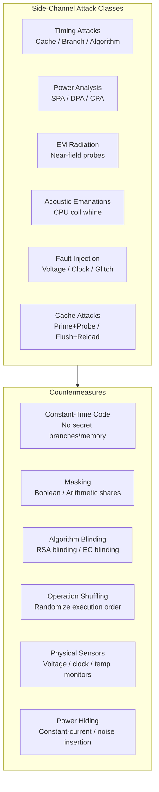

# Side-Channel Resistant Cryptography

## Overview

A side-channel attack exploits physical or logical information leakage from a cryptographic implementation rather than breaking the mathematical hardness assumption. The secret key is inferred from timing variations, power consumption patterns, electromagnetic radiation, acoustic signals, or fault-induced behavior. This chapter covers the full taxonomy of side-channel attacks, the discipline of constant-time programming, power analysis techniques (SPA, DPA, CPA), fault injection and differential fault analysis, EM side channels, and advanced countermeasures including masking, blinding, and their application to post-quantum algorithms like CRYSTALS-Kyber and CRYSTALS-Dilithium.



## Timing Attacks

### The Fundamental Vulnerability

Kocher's 1996 paper ("Timing Attacks on Implementations of Diffie-Hellman, RSA, DSS, and Other Systems") demonstrated that the time taken by a cryptographic operation can reveal information about the secret key. If a secret-dependent branch or table lookup causes variable execution time, an attacker with precise timing measurements — even over a network with statistical techniques — can recover key bits. Timing attacks are the most practical side-channel attack because they require no physical access to the device.

### Classic Example: RSA Modular Exponentiation

The square-and-multiply algorithm processes each bit of the exponent: always square, but only multiply if the bit is 1. If the multiply step is visible in timing (because multiplication takes significant time), the attacker sees which bits of the exponent are 0 vs. 1, directly recovering the private key.

```c
// VULNERABLE: timing leaks which bits of e are 1
uint64_t mod_exp_vulnerable(uint64_t base, uint64_t exp, uint64_t mod) {
    uint64_t result = 1;
    for (int i = 63; i >= 0; i--) {
        result = mulmod(result, result, mod);    // Always: square
        if (exp & (1ULL << i)) {
            result = mulmod(result, base, mod);  // Only if bit=1: TIMING LEAK
            // The extra multiply adds ~100ns to the execution time
            // Attacker detects this via statistical analysis of many runs
        }
    }
    return result;
}
```

### Constant-Time Fix: Montgomery Ladder

The Montgomery ladder performs the same operations regardless of the secret bit — always both a multiply and a "double" (which is also a multiply in modular arithmetic). The execution time is independent of the exponent bits.

```c
// CONSTANT-TIME: always does both operations, regardless of bit value
uint64_t montgomery_ladder(uint64_t base, uint64_t exp, uint64_t mod) {
    uint64_t r0 = 1 % mod;    // R_0 = identity
    uint64_t r1 = base % mod; // R_1 = base
    for (int i = 63; i >= 0; i--) {
        uint64_t bit = (exp >> i) & 1;
        // Conditional swap using bitwise ops (NOT a branch — constant-time)
        uint64_t mask = -(uint64_t)bit;  // 0x00...00 or 0xFF...FF
        uint64_t tmp_r0 = r0, tmp_r1 = r1;
        r0 = (tmp_r0 & ~mask) | (tmp_r1 & mask);  // cmov: swap if bit=1
        r1 = (tmp_r1 & ~mask) | (tmp_r0 & mask);
        // Always: double and add (same operations regardless of bit)
        r1 = mulmod(r1, r0, mod);  // R_1 = R_1 * R_0
        r0 = mulmod(r0, r0, mod);  // R_0 = R_0^2
    }
    return r0;
}
```

### Cache Timing Attacks

Cache timing attacks exploit the difference between cache hit (~4 cycles) and cache miss (~100-200+ cycles) to infer which memory locations the victim accessed. This is the disclosure primitive for Spectre and Meltdown (see [microarch-attacks.md](microarch-attacks.md)), but cache timing is also a standalone threat for any crypto implementation that uses secret-dependent table lookups.

AES implementations using T-tables (precomputed lookup tables for the SubBytes, ShiftRows, MixColumns operations) are vulnerable because each table lookup depends on the key-dependent state. The access pattern `table[secret_byte]` leaks which table entry was accessed, revealing key-dependent state.

**Mitigation**: Bitsliced AES implementations (no table lookups — all operations are bitwise AND, OR, XOR on 128-bit vectors) are inherently constant-time with respect to the secret key because there are no memory accesses dependent on secret data. Alternatively, AES-NI hardware instructions perform AES operations in constant time.

### Branch Timing Attacks

A secret-dependent branch (`if (secret_condition) { fast_path; } else { slow_path; }`) causes measurable timing differences. Even if the fast and slow paths take nearly the same time, the branch predictor's behavior (misprediction penalty of ~15 cycles) can leak the condition.

**Mitigation**: Replace all secret-dependent branches with bitwise operations or constant-time conditional moves (`cmov`). In C, use: `result = (a & mask) | (b & ~mask)` where `mask` is computed from the secret without branching.

## Constant-Time Programming

### The Rules

Constant-time code executes in time independent of secret data (keys, plaintexts, nonces, passwords, tokens). The rules are simple to state but difficult to enforce in practice:

1. **No secret-dependent branches**: No `if (secret_byte == X)`, no `switch (secret_value)`, no ternary operators on secrets. Use bitwise operations or constant-time conditional move.
2. **No secret-dependent memory accesses**: No `table[secret_byte]`, no `array[secret_index]`, no pointer chasing on secret values. The access pattern (addresses accessed) must not reveal the secret.
3. **No secret-dependent loop counts**: `for (i = 0; i < secret; i++)` leaks the value of `secret` via total execution time. Always iterate a fixed number of times.
4. **No secret-dependent division or modulo**: On some architectures (ARM, x86 with variable-latency dividers), division latency depends on the operands. Avoid division with secret operands.
5. **No secret-dependent exception paths**: Exception handling (page faults, FPE) that depends on secret data can leak through timing.

### Constant-Time Select (cmov)

```c
// Constant-time conditional: if (cond) dst = src; (else keep dst)
// cond must be 0 or 1 — use ct_eq() to produce 0/1 from a comparison
static inline uint64_t ct_select(uint64_t dst, uint64_t src, uint64_t cond) {
    uint64_t mask = -cond;  // 0x00...00 or 0xFF...FF
    return (dst & ~mask) | (src & mask);
}

// Constant-time 8-bit equality: returns 0xFF if a == b, 0x00 otherwise
static inline uint8_t ct_eq(uint8_t a, uint8_t b) {
    uint8_t x = a ^ b;
    x |= x >> 4;
    x |= x >> 2;
    x |= x >> 1;
    return (~x) & 1;  // 1 if equal, 0 if not
}
```

### Constant-Time Comparison

```c
// Constant-time comparison: returns 0 if equal, nonzero otherwise
// NEVER use memcmp() or strcmp() for secrets — they short-circuit on mismatch
// memcmp returns as soon as it finds a differing byte, leaking the position
// of the first difference via timing
int ct_memcmp(const uint8_t *a, const uint8_t *b, size_t n) {
    uint8_t result = 0;
    for (size_t i = 0; i < n; i++) {
        result |= a[i] ^ b[i];  // Always iterate ALL bytes — no short circuit
    }
    return result;
}

// OpenSSL equivalent: CRYPTO_memcmp()
// libsodium equivalent: sodium_memcmp()
// BoringSSL equivalent: CRYPTO_memcmp() with volatile
```

**Why memcmp leaks**: Standard `memcmp` implementations compare bytes left-to-right and return immediately upon finding a mismatch. If the first byte differs, the function returns in ~5ns. If the first 31 bytes match but the 32nd differs, it returns in ~50ns. An attacker measuring response times can determine how many leading bytes match, and iteratively recover the entire secret one byte at a time. This attack has been demonstrated over the network against TLS servers comparing HMAC tags.

### Constant-Time Table Lookup (Bitslicing)

When you need `table[secret_index]`, the access pattern `table[0], table[1], ...` leaks the index via cache timing. Solution: access ALL table entries and select the correct one using bitwise operations.

```c
// Constant-time 8-bit table lookup: no secret-dependent memory access pattern
// Accesses ALL 256 entries, selects the correct one using bitwise mask
uint8_t ct_table_lookup(const uint8_t table[256], uint8_t index) {
    uint8_t result = 0;
    for (int i = 0; i < 256; i++) {
        // ct_eq returns 0xFF if i == index, 0x00 otherwise
        uint8_t mask = ct_eq((uint8_t)i, index);
        result |= table[i] & mask;  // Contributes only if this is the target entry
    }
    return result;
}
```

**Performance cost**: 256x slower than a direct lookup. This is why constant-time AES implementations avoid T-tables entirely (using bitsliced implementations instead) and why constant-time implementations of post-quantum schemes are carefully designed to avoid any secret-dependent table lookups.

### Compiler Considerations

The compiler can re-introduce timing leaks even from constant-time source code — this is a critical and often overlooked problem:

- **Dead code elimination**: `if (secret) side_effect(); else nop();` — the compiler may optimize away the `nop` branch, making timing data-dependent. Mark secrets with `volatile` or use compiler-specific attributes.
- **Branch optimization**: A conditional move (`cmov`) is constant-time, but the compiler may convert it back to a branch if it thinks the branch predictor will do better (based on static branch prediction heuristics). Use compiler intrinsics to force cmov.
- **Speculative execution**: Even constant-time code is not truly constant-time on speculative execution hardware (see [microarch-attacks.md](microarch-attacks.md)). Hardware mitigations (eIBRS, KPTI) are needed alongside software constant-time discipline.
- **Inlining and constant folding**: If the compiler inlines a function and folds constants, it may eliminate "dead" branches that depend on what the compiler sees as constant values, but that are actually runtime secrets.

Solutions: `volatile` keyword to prevent optimization of secret-dependent values, compiler-specific builtins (GCC's `__builtin_bswap32` is constant-time on some architectures), or use libraries that audit generated assembly (BoringSSL requires all crypto code to be written in assembly or reviewed assembly for constant-time properties).

### Rust: subtle and constant-time

```rust
use subtle::ConstantTimeEq;

// The `subtle` crate provides constant-time operations verified at the type level
// The ConstantTimeEq trait returns a Choice (0 or 1) that cannot be used
// as a boolean in an if-statement, preventing accidental short-circuit behavior

let a = secret_key.as_slice();
let b = expected_key.as_slice();

// Constant-time comparison (does NOT short-circuit)
if a.ct_eq(b).into() {
    // Keys match — proceed
}

// The `zeroize` crate ensures sensitive memory is zeroed after use
// Uses volatile writes that the compiler cannot optimize away
use zeroize::Zeroize;
let mut key = [0u8; 32];
// ... use key ...
key.zeroize();  // Guaranteed to zero memory, compiler-proof
```

## Power Analysis

### Simple Power Analysis (SPA)

A single power trace reveals which operations were performed. The attacker captures the current draw of the device during cryptographic computation using an oscilloscope or specialized data acquisition board. By visually inspecting the trace, they identify patterns: squaring looks different from multiplication in RSA, key-dependent branches cause visible power differences, and the sequence of AES operations (SubBytes, ShiftRows, MixColumns) produces distinct power signatures.

**Target devices**: Smart cards, HSMs (Hardware Security Modules), embedded microcontrollers (no noise from other processes — clean single-threaded execution). SPA is effective against implementations without randomization or masking.

### Differential Power Analysis (DPA)

Kocher, Jaffe, and Jun (1999). DPA is a statistical technique that recovers secret key bytes from many power traces even in the presence of significant noise. The attacker collects many power traces (typically 1,000–10,000) of the same operation with known inputs (plaintexts). For each key hypothesis, the attacker partitions the traces based on the value of a specific intermediate bit and computes the statistical difference between the partitions. If the key hypothesis is correct, the partitioned traces show a significant statistical difference at a specific point in time; if wrong, the difference is near zero.

```
DPA Algorithm:
1. Collect N power traces T_1, ..., T_N with known plaintexts P_1, ..., P_N
2. For each key byte hypothesis k' = 0, ..., 255:
   a. For each trace i, compute intermediate value:
      v_i = SBox(P_i XOR k')  (e.g., first AES round key byte XOR plaintext)
   b. Choose a selection function on v_i (e.g., LSB of v_i)
   c. Partition traces into two sets:
      Set_0: { T_i | selection_function(v_i) = 0 }
      Set_1: { T_i | selection_function(v_i) = 1 }
   d. Compute difference of means at each time sample:
      D(t) = mean(Set_1, t) - mean(Set_0, t)
   e. If max(|D(t)|) exceeds statistical threshold (e.g., 4x noise std dev),
      k' is the correct key byte
3. Repeat for all 16 key bytes (AES-128)
```

### Correlation Power Analysis (CPA)

An improvement over DPA: instead of partitioning by a single bit, compute the Pearson correlation coefficient between the hypothetical power consumption (a model, typically the Hamming weight or Hamming distance of the intermediate value) and the actual measured power trace. Higher correlation at a specific time point indicates a correct key hypothesis. CPA is more powerful than DPA because it uses the full information content of the power model (all bits, not just one) and is more robust to noise.

```
CPA Algorithm:
1. Collect N power traces T_1, ..., T_N
2. For each key hypothesis k':
   a. Compute hypothetical intermediate values: v_i = H(P_i XOR k')
   b. Compute hypothetical power consumption model: h_i = HW(v_i)
   c. Compute Pearson correlation between h and each time sample t:
      r(t) = cov(h, T(:,t)) / (std(h) * std(T(:,t)))
   d. If max(|r(t)|) exceeds threshold, k' is correct
```

### Countermeasures

| Countermeasure | Mechanism | Against | Limitations |
|---------------|-----------|---------|-------------|
| **Boolean masking** | Split secret into shares: `s = s1 XOR s2`. Operations on shares are independent of the secret. First-order DPA/CPA fail because power depends on individual shares, not the secret. | DPA, CPA | Higher-order attacks (combining shares via 2nd-order moments) work; implementation complexity |
| **Arithmetic masking** | Split secret additively: `s = s1 + s2 (mod 2^n)`. Better for arithmetic operations (multiplication in AES/GCM). | DPA, CPA | Conversion between boolean and arithmetic masking is itself a side-channel risk |
| **Shuffling** | Randomly permute the order of operations so the power trace doesn't align with the algorithm's steps. | SPA, alignment attacks | Reduces but doesn't eliminate leakage; requires randomness source |
| **Hiding** | Insert dummy operations, pad all operations to take the same time, use constant-current circuits. | SPA, DPA | Power overhead; may not hide all leakage points |
| **Noise insertion** | Add random current draws to mask the real signal. | DPA, CPA | Requires careful calibration; averaging many traces can filter noise |

## Electromagnetic (EM) Side Channels

EM attacks measure the electromagnetic radiation emitted by a device during computation. Every current flowing through a wire or chip generates a magnetic field that can be detected by a nearby antenna. EM attacks have advantages over power analysis: they are non-invasive (no need to probe power pins), can target specific areas of a chip (near-field probes with spatial resolution), and can work through enclosures (metal shielding is expensive).

**Attack types**:
- **Direct EM measurement**: Near-field magnetic probe (H-field probe) positioned close to the target chip. Captures EM emanations from specific parts of the CPU (e.g., near the ALU for arithmetic operations).
- **EM injection**: Actively inject EM pulses to induce faults in the target device (see fault injection section).
- **Long-range EM**: Military TEMPEST standards address the risk of EM emanations being detected at distance (meters to hundreds of meters). For cryptographic devices, this typically requires specialized equipment.

**Countermeasures**: Metal shielding (Faraday cage), current equalization techniques (balanced logic gates that produce minimal EM), random routing of sensitive signals, noise injection, and cryptographic masking (reduces correlation between EM signal and secret data).

## Acoustic Side Channels

Acoustic attacks measure the sound produced by a computer during computation. Different operations (especially voltage regulation in response to varying computational loads) produce different acoustic signatures. Genkin et al. (2014) demonstrated acoustic key extraction from RSA and GnuPG by placing a microphone near a laptop and analyzing the coil whine from the voltage regulator. The attack achieved 90% key recovery from a single recording at 4kHz bandwidth.

**Countermeasures**: Physical isolation (no microphones near crypto devices), audio masking (noise generators), using constant-time implementations (which reduce power fluctuations, thus acoustic emanations), and avoiding voltage regulator designs that produce audible coil whine.

## Fault Injection

### Overview

Fault injection intentionally disturbs a device to cause computational errors. The attacker analyzes the faulty outputs (comparing correct and faulty ciphertexts) to deduce the secret key. Fault injection is one of the most powerful physical attacks because a single well-placed fault can reveal key material from an otherwise secure implementation.

### Attack Techniques

| Technique | Apparatus | Cost | Effectiveness | Typical Target |
|-----------|-----------|------|---------------|----------------|
| **Voltage glitching** | Drop Vcc for ~10-50ns via MOSFET + pulse generator | $50–200 | High on microcontrollers, moderate on modern SoCs | MCU-based crypto, smart cards |
| **Clock glitching** | Speed up clock transiently (2x-10x normal freq) or insert clock pulse | $50–200 | High (causes setup/hold time violations → bit flips) | Microcontrollers, FPGAs |
| **Laser fault injection** | Focused laser on chip surface through opened package | $100K–500K | Extremely precise (single gate or register) | Smart cards, secure elements, ASICs |
| **EM pulse** | Coil antenna + high-voltage capacitor discharge | $500–5K | Medium (affects ~1mm² area, not single gate) | Microcontrollers, SoCs in plastic packages |
| **Body bias injection** | Modify substrate bias voltage | $10K+ | Targets specific transistor characteristics | ASICs with body bias pins |
| **Temperature faulting** | Heat/cool device to cause timing violations | $100 | Low precision, used for aging studies | Some MCUs |
| **RowHammer (software)** | Memory access patterns | $0 | DRAM bit flips, indirect fault injection | Any system with DRAM |

### Differential Fault Analysis (DFA) on AES

The Biham-Shamir attack on DES (1997) was extended to AES by Piret and Quisquater (2003) and Giraud (2005). The attacker induces a fault during a specific AES round (e.g., round 8 of 10 for AES-128), corrupting one byte of the internal state. By comparing the correct and faulty ciphertexts, the attacker can recover the last round key, and from there the full key.

```
Attack flow for AES-128 DFA:

Correct:   State_8 → MixCol_9 → AddRK_9 → Sub_10 → Shift_10 → AddRK_10 → C_c
Faulty:    State_8 → MixCol_9 → AddRK_9 → Sub_10 → Shift_10 → AddRK_10 → C_f
                       ^fault injected here (one byte corrupted at State_8)

1. Compute: ΔC = C_c XOR C_f
2. The difference ΔC is constrained by the AES structure:
   - SubBytes is nonlinear → difference after SubBytes has limited possibilities
   - ShiftRows just permutes → difference position reveals fault location
   - AddRoundKey just XORs with key → key bytes can be recovered by
     testing all 256 possible fault values against the constraints
3. With ~100-200 (correct, faulty) ciphertext pairs, the full AES-128 key
   is recovered with high probability
```

### Countermeasures

1. **Redundant computation**: Compute the same operation twice (possibly with different encoding) and compare results. If results differ, zero the output and halt. Expensive (2x computation) but effective against single-fault attacks. Used in HSMs and smart cards.

2. **Error-detecting codes**: Use parity checks or CRCs on the AES internal state between rounds. A single-byte fault is detected before it propagates. The computation is aborted and no output is produced.

3. **Temporal redundancy**: Compute the same operation at different clock phases or with different supply voltage. Voltage glitches typically affect only one phase, so the other phase provides the correct result.

4. **Infection**: If a fault is detected, deliberately "infect" the output with random data (e.g., XOR with random mask) so the attacker gets no useful information. The attacker cannot distinguish between "no fault" outputs and "infected" outputs.

5. **Hardware sensors**: Voltage monitors (brownout detectors), clock glitch detectors (overspeed detection), temperature sensors that halt the CPU on anomaly. Intel SGX uses voltage, current, and temperature sensors that trigger a shutdown on anomaly detection — this is what Plundervolt (CVE-2020-8695) bypassed by exploiting a race condition in the sensor polling interval.

### Notable CVEs

- **CVE-2020-8695 (Plundervolt)**: Undervolting Intel CPUs via `MSR 0x150` causes faults in SGX enclaves. The attacker controls the voltage and timing to induce predictable computational errors in AES-NI instructions inside the enclave. Using DFA on the faulted outputs, the attacker recovers the enclave's AES key. This is a software-triggered DFA attack against a hardware TEE.
- **CVE-2022-26339**: NXP i.MX RT SoC — voltage glitching via the bootloader's USB interface allows bypassing secure boot. The attacker glitches the voltage during the signature verification step, causing the verification to pass for any firmware image.

## Side-Channel Resistant Post-Quantum Implementations

CRYSTALS-Kyber (ML-KEM, FIPS 203) and CRYSTALS-Dilithium (ML-DSA, FIPS 204) are the NIST-standardized post-quantum algorithms for key encapsulation and digital signatures respectively. Both must be implemented in constant-time to resist side-channel attacks. The main challenges are:

### CRYSTALS-Kyber Constant-Time Challenges

Kyber's key operations involve polynomial arithmetic in a modular ring (Z_q[x]/(x^256 + 1)). The potential leakage sources:

1. **NTT (Number Theoretic Transform)**: Used for fast polynomial multiplication. The NTT involves modular additions and multiplications with secret-dependent intermediate values. All operations must use constant-time modular reduction (Barrett reduction, not conditional subtraction based on comparison).

2. **Compression/decompression**: Kyber compresses ciphertext polynomials by encoding coefficients in fewer bits. The encoding must be constant-time: `compress(x) = round(x * (2^d / q))` where the rounding must use bitwise operations, not conditional branches.

3. **Rejection sampling** (in Dilithium): Dilithium's signature generation uses rejection sampling to produce uniformly distributed signatures. The rejection probability depends on the secret key, creating a timing leak. The fix is to always perform a fixed number of rejection sampling attempts, using a constant-time selection to pick the valid one.

```c
// Simplified constant-time Kyber polynomial compression
// The naive version leaks via conditional branches based on coefficient values
// This constant-time version uses only arithmetic and bitwise ops

void kyber_compress(uint8_t out[KYBER_N/2], const int16_t a[KYBER_N]) {
    uint16_t t;
    for (unsigned int i = 0; i < KYBER_N/2; i++) {
        t  = (a[2*i] >> KYBER_D) & 1;
        t |= ((a[2*i+1] >> KYBER_D) & 1) << 1;
        // Use bitwise ops only — no branches dependent on a[...]
        out[i] = t;
    }
}
```

## Side-Channel Resistant Crypto Libraries

| Library | Language | Side-Channel Protections | Notable Audit Status |
|---------|----------|--------------------------|---------------------|
| **BoringSSL** | C | Constant-time RSA (Montgomery ladder), ECDSA (constant-time scalar mul), AES-GCM. All critical crypto hand-audited in assembly. Used in Chrome, Android, Cloudflare. | Regularly audited by Google security team |
| **libsodium** | C | Constant-time by design. `crypto_verify` uses `sodium_memcmp`. `crypto_aead_chacha20poly1305` is constant-time. | Audited by multiple firms |
| **ring** (Mozilla) | Rust | BoringSSL-derived core. Constant-time RSA, ECDH (P-256, X25519), HMAC, ChaCha20Poly1305. `subtle` crate for constant-time comparisons. | Formal verification of core curves |
| **HACL\*** | C (verified) | Formally verified constant-time implementations in F*. Verified free of secret-dependent branches, memory accesses, and division. Used in Firefox, Signal, WireGuard. | Mathematically proven correct (Coq/F* proofs) |
| **PQClean** | C | NIST PQC reference implementations. Includes constant-time variants for all round-3/finalist algorithms. Tested with `dudect`. | Reference implementations, not production-hardened |
| **liboqs** | C | Post-quantum library with constant-time implementations. Used in OQS-OpenSSH, OQS-OpenSSL. Performance-focused. | Actively maintained by Open Quantum Safe project |

### Testing for Constant-Time: dudect

The `dudect` framework (Constant-Time Testing with Dudect, Oren Marom and Shay Gueron, 2019) is the standard tool for empirically testing whether code is constant-time. It works by measuring execution time distributions for random secret vs. fixed secret inputs and applying Welch's t-test to detect statistically significant timing differences.

```bash
# Using dudect to test a constant-time function
# 1. Implement two functions: one with random secret, one with fixed secret
# 2. Dudect calls them alternately, collecting timing data
# 3. Welch's t-test is applied; if |t| > 4.5, the code is NOT constant-time
# 4. Result: "FAIL" (not constant-time) or "PASS" (no detectable leakage)

git clone https://github.com/oreparaz/dudect
cd dudect
# Implement your test in test.c (follow the template)
make
./dudect
# If output shows "FAIL" at any point → code is not constant-time
```

## Interview Angle

- "Why is `memcmp(a, b, n)` unsafe for comparing secrets?"
  *`memcmp` returns as soon as it finds a mismatching byte, so the time taken is proportional to the position of the first differing byte. An attacker measuring response times can determine how many leading bytes match, and iteratively recover the entire secret byte-by-byte. This attack has been demonstrated against TLS servers: the attacker sends many handshake requests with guessed MAC tags, measures the server's response time, and recovers the correct MAC tag in O(n) iterations (where n is the tag length). Use `CRYPTO_memcmp` (OpenSSL/BoringSSL) or `sodium_memcmp` (libsodium) which always iterate all bytes regardless of mismatches.*

- "How would you verify that a crypto library is constant-time?"
  *Three approaches. (1) Static analysis: manually audit all branches, table lookups, and loop bounds for secret dependence. Use tools like `dudect` or `FlowTracker` to identify secret-propagation paths. (2) Dynamic testing: `dudect` measures execution time distributions for random vs. fixed secret inputs and applies Welch's t-test. If the distributions are distinguishable (|t| > 4.5), the code leaks. (3) Cache access analysis: use Valgrind/Cachegrind or Intel PT to check for secret-dependent cache access patterns. For production libraries, all three approaches should be used: `dudect` for empirical testing, manual audit for thoroughness, and formal verification (like HACL*) for mathematical guarantees.*

- "How does Plundervolt work, and what's the connection to side-channel resistant crypto?"
  *Plundervolt is a software-triggered fault injection attack against Intel SGX enclaves. The attacker writes to `MSR 0x150` (voltage control MSR) to undervolt the CPU during enclave execution, inducing faults in AES-NI instructions. The faulted outputs are then analyzed using differential fault analysis (DFA) to recover the AES key inside the enclave. The connection: even if the AES implementation inside the enclave is perfectly constant-time (immune to timing and power analysis), fault injection bypasses all software-level countermeasures. Defense requires hardware sensors (voltage monitors that halt the CPU on undervoltage) or software checks (compute twice and compare). Intel patched this via microcode that disables undervolting when SGX is active.*

## Key References

- Kocher, *Timing Attacks on Implementations of Diffie-Hellman, RSA, DSS, and Other Systems* (CRYPTO 1996)
- Kocher, Jaffe, Jun, *Differential Power Analysis: Leaking Secrets* (CRYPTO 1999)
- Biham, Shamir, *Differential Fault Analysis of Secret Key Cryptosystems* (CRYPTO 1997)
- BoringSSL constant-time policy: `https://boringssl.googlesource.com/boringssl/+/HEAD/TIMING.md`
- `dudect`: https://github.com/oreparaz/dudect (constant-time testing framework)
- Mangard, Oswald, Standaert, *Power Analysis Attacks: Revealing the Secrets of Smart Cards* (Springer, 2007)
- Genkin, Shamir, Tromer, *RSA Key Extraction via Low-Bandwidth Acoustic Cryptanalysis* (CRYPTO 2014)
- CRYSTALS-Kyber specification: https://pq-crystals.org/kyber/
- CRYSTALS-Dilithium specification: https://pq-crystals.org/dilithium/
- NIST FIPS 203 (ML-KEM), FIPS 204 (ML-DSA)
