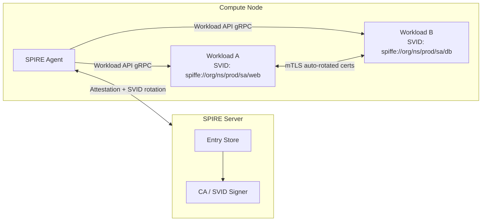
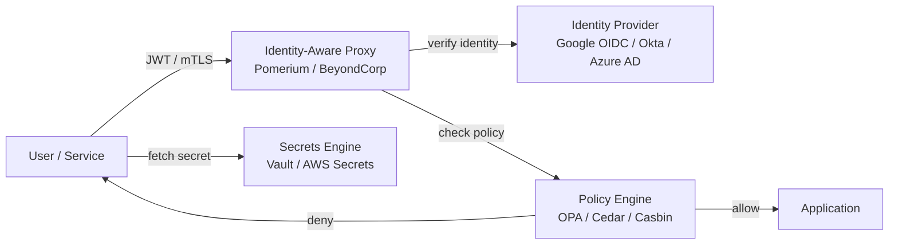

# Advanced Supply Chain Security

## Overview

While [supply-chain-security](../supply-chain-security.md) covers the fundamentals (SLSA levels 1–3, SBOMs, basic code signing), this chapter goes deeper into the infrastructure required for end-to-end software provenance: reproducible builds, Sigstore's keyless signing ecosystem, real-world supply-chain attack case studies, dependency confusion and typosquatting exploitation, CI/CD pipeline hardening, workload identity via SPIFFE/SPIRE, zero-trust networking with identity-aware proxies, and the in-toto attestation framework. These topics are critical for anyone building or securing software delivery pipelines in production environments.

```mermaid
flowchart LR
    subgraph Source[Source Integrity]
        Dev[Developer] -->|signed commit| Git[Git + GPG]
        Git -->|PR review| CI[CI Pipeline]
    end
    subgraph Build[Build Integrity]
        CI -->|hermetic| Builder[Isolated Builder]
        Builder -->|deterministic| Artifact[Binary Artifact]
        Artifact -->|SLSA provenance| Sigstore[Sigstore / Cosign]
    end
    subgraph Deploy[Deployment Integrity]
        Sigstore -->|verified| K8s[Kubernetes]
        K8s -->|SPIFFE identity| Workload[Workload]
        Workload -->|mTLS| IAP[Identity-Aware Proxy]
    end
```



## Real-World Supply Chain Attack Case Studies

### SolarWinds SUNBURST (2020)

The most consequential supply-chain attack in history. Russian APT29 (Cozy Bear) compromised the SolarWinds Orion build system and injected the SUNBURST backdoor into the Orion software build process. The malicious code was signed with SolarWinds' legitimate digital certificate and distributed to ~18,000 customers, including US government agencies (Treasury, Commerce, State Department, DHS). The attack went undetected for ~9 months.

**Attack chain**: 
1. Compromise of SolarWinds' build environment (likely via compromised developer credentials or build server access)
2. Injection of SUNBURST trojan into the Orion build pipeline
3. The trojan was compiled, signed with SolarWinds' certificate, and shipped to customers as a legitimate update
4. SUNBURST waited 12–14 days before beaconing to C2 servers, then performed reconnaissance, credential harvesting, and lateral movement

**Key takeaway**: The attack bypassed all traditional security controls because the malicious code was digitally signed by the legitimate vendor. Even signature verification would not have caught this. The only defense is build provenance — proving the build ran in a known environment from a known source — which is exactly what SLSA L3+ provides.

### Codecov Bash Uploader (2021)

Codecov's `bash-uploader` script (used by thousands of CI pipelines to upload code coverage reports) was modified to exfiltrate environment variables, CI secrets, and git credentials from build environments. The attacker compromised Codecov's infrastructure and modified the script to add a one-line curl command that sent sensitive environment data to the attacker's server.

**Attack chain**:
1. Attacker compromised Codecov's infrastructure (likely via credential theft)
2. Modified the bash-uploader script to add data exfiltration
3. Users downloading the script from Codecov's official URL got the malicious version
4. CI pipelines running the script leaked `AWS_SECRET_ACCESS_KEY`, `GITHUB_TOKEN`, `CI_*` variables

**Key takeaway**: Even scripts downloaded from official URLs can be malicious if the download infrastructure is compromised. Pinning the script by hash (not just by URL) and verifying signatures prevents this. This motivates Sigstore's artifact signing model.

### ua-parser-js (2021) and event-stream (2018)

The `ua-parser-js` npm package was compromised when the maintainer's npm account credentials were stolen. The attacker published malicious versions (0.7.29, 0.8.0) containing a cryptocurrency miner and credential-stealing payload that installed via postinstall scripts. The package had 7 million weekly downloads. The `event-stream` attack (2018) was similar: the original maintainer transferred ownership to an attacker who injected a wallet-stealing payload targeting the Copay Bitcoin wallet.

## Software Bill of Materials (SBOM)

An SBOM is a machine-readable inventory of all components in a software artifact, including transitive dependencies, versions, hashes, and relationships. SBOMs are essential for vulnerability management (rapid identification of affected systems when a vulnerability is disclosed) and for supply-chain integrity verification (ensuring no unexpected components were added during the build).

Two competing standards dominate:

| Format | Origin | Schema | Key Fields | Strengths |
|--------|--------|--------|------------|-----------|
| **CycloneDX** | OWASP | XML/JSON, BOMRef-based | `bom-ref`, `component`, `dependency`, `vulnerabilities`, `services`, `evidence` | Richer vulnerability evidence, service metadata, widely adopted by OWASP ecosystem |
| **SPDX** | Linux Foundation | JSON/RDF, SPDXRef-based | `SPDXRef-`, `packageVerificationCode`, `externalDocumentRefs`, `relationships` | ISO standard (ISO/IEC 5962:2021), deeper relationship modeling |

### SBOM Generation Tools

- **Syft** (Anchore): Scans filesystems, container images, and archives for package metadata. Outputs CycloneDX or SPDX. Supports 25+ ecosystems (npm, pip, Go modules, apt, apk, RPM, Java, etc.).
- **Trivy** (Aqua Security): Combines SBOM generation with vulnerability scanning against NVD, GitHub Advisory, Red Hat, and other databases. Also scans IaC (Terraform, CloudFormation, K8s manifests).
- **cdxgen**: Generates CycloneDX from package manifests, lock files, or container images. Supports monorepo scanning.

```bash
# Generate CycloneDX SBOM from a container image
syft alpine:3.18 -o cyclonedx-json > sbom.json

# Scan SBOM for known vulnerabilities
grype sbom:sbom.json --fail-on critical

# Generate SPDX from a directory
syft ./my-project -o spdx-json > sbom.spdx.json

# Convert between formats
cyclonedx-python-convert --input-format json --output-format xml sbom.json
```

> **Interview Angle**: "How would you enforce SBOM generation in a CI pipeline?" Answer: Run `syft` as a required CI step that produces an SBOM artifact (CycloneDX JSON), sign it with Cosign, and upload it alongside the container image to the registry. Downstream admission controllers (e.g., Kyverno, Gatekeeper/OPA) can require a valid signed SBOM as a condition for deployment. Integrate `grype` to block deployment of images with critical CVEs. Store SBOMs in a central inventory (Dependency-Track, GUAC) for continuous monitoring.

## SLSA — Supply-chain Levels for Software Artifacts

SLSA defines four levels of increasing supply-chain integrity guarantees. See [../supply-chain-security.md](../supply-chain-security.md) for L1–L3 fundamentals. This section provides implementation details and focuses on L3–L4 requirements.

### SLSA L3: Provenance Requirements

The build must run in a **hermetic** environment where all inputs are explicitly declared and non-declared inputs are inaccessible. The provenance attestation must be a cryptographically signed `in-toto` attestation that includes the builder identity, build configuration, source reference, and all material inputs.

```json
{
  "_type": "https://in-toto.io/attestation/slsa/v1",
  "predicate": {
    "builder": { "id": "https://github.com/slsa-framework/slsa-github-generator/.github/workflows/generator_generic_slsa3.yml" },
    "buildType": "https://github.com/slsa-framework/slsa-github-generator/buildtype/generic/v1",
    "invocation": {
      "configSource": { "uri": "git+https://github.com/org/repo@refs/heads/main", "digest": { "sha1": "abc123" } },
      "parameters": {},
      "environment": { "github_actor": "deploy-bot" }
    },
    "materials": [
      { "uri": "git+https://github.com/org/repo@refs/heads/main", "digest": { "sha1": "abc123" } },
      { "uri": "pkg:deb/debian/glibc@2.36", "digest": { "sha256": "def456" } }
    ]
  }
}
```

**What makes L3 hard**: Hermeticity means the build cannot reach out to the network, use undeclared environment variables, or access undeclared files. Achieving true hermeticity requires isolated build runners (Bazel remote execution, Nix builds, isolated Docker containers) and explicit declaration of every input.

### SLSA L4: Hermetic + Reproducible

Requires **reproducible builds**: any two independent builds of the same source, build environment, and build instructions produce bit-for-bit identical artifacts. This eliminates the possibility that the build system injected malicious code (as in SolarWinds).

**Achieving L4**: 
1. L3 hermetic build (isolated, all inputs declared)
2. Deterministic build toolchain (no timestamps, no random build IDs, deterministic file ordering)
3. Multiple independent builders verify the same output
4. All builders are L3-compliant and verified

## Reproducible Builds

A build is reproducible if, given the same source, build environment, and build instructions, every build produces byte-identical output. In practice, builds are non-deterministic due to numerous sources of variation:

- **Timestamps** embedded in binaries (`__DATE__`, `__TIME__` in C), archive headers, ELF sections
- **Filesystem ordering**: `find`, `tar`, `ar` traverse directories in nondeterministic inode order
- **Randomness**: Build IDs, symbol table hashes, Go's `rand` in build scripts
- **CPU/fork parallelism**: Non-deterministic ordering of concurrent compilation units
- **Locale/timezone**: String sorting, date formatting in documentation generation
- **ASLR/per-PIC**: Position-independent code may differ across builds without `-Wl,--build-id=none`
- **Filesystem metadata**: UID/GID, permissions in archives differ across build machines

### Reproducible Build Toolchain

```bash
# Debian/Ubuntu reproducible build environment
export SOURCE_DATE_EPOCH=$(git log -1 --format=%ct)  # Fixed timestamp
export TZ=UTC
export LC_ALL=C

# Use deterministic ar (no timestamps in archives)
ar -Dcr libfoo.a *.o

# Use --sort=name for deterministic archives
tar --sort=name --mtime="@${SOURCE_DATE_EPOCH}" \
    --clamp-mtime --owner=0 --group=0 --numeric-owner \
    --pax-option=exthdr.name=%d/PaxHeaders/%f,delete=atime,delete=ctime \
    -cf archive.tar inputs/

# Strip non-deterministic sections from ELF
strip --strip-debug --remove-section=.comment --remove-section=.note \
    --remove-section=.note.gnu.build-id --preserve-dates -o output_stripped output

# Python: reproducible .pyc with SOURCE_DATE_EPOCH
export PYTHONHASHSEED=0  # Deterministic hash randomization
python -m compileall -q .
```

### Verification

```bash
# diffoscope: binary comparison tool for reproducible builds
# Recursively compares files, archives, and filesystem trees
diffoscope build1/output build2/output

# If builds are reproducible, diffoscope exits 0 (no differences)
# If non-reproducible, shows meaningful diffs (timestamps, ordering, etc.)

# Debian's reproducibility tracker: https://tests.reproducible-builds.org/
```

Projects that achieve reproducible builds: Debian (90%+ packages reproducible), Tor Browser (mandatory for security), Bitcoin Core (enables binary distribution trust), Nix/NixOS (reproducibility is a first-class property via content-addressed store and fixed-output derivations), Guix System (100% bootstrappable from source).

## Sigstore

Sigstore provides **keyless code signing**: developers sign artifacts using short-lived certificates issued by a public Fulcio CA, backed by an OIDC identity (GitHub, Google, Microsoft). The certificate is only valid for 10 minutes, eliminating the risk of long-lived key compromise. The signature and certificate chain are stored in an immutable, append-only Rekor transparency log, enabling detection of any unsigned or incorrectly signed artifact.

### Architecture

```
Developer                    Sigstore Infrastructure
┌──────────┐               ┌───────────────────────────┐
│ cosign   │──OIDC token──▶│ Fulcio (CA)               │
│ sign     │               │  Issues short-lived cert  │
│          │               │  (10 min validity)         │
│          │◀──X.509 cert──│  Bound to OIDC identity    │
│          │               └───────────────────────────┘
│          │               ┌───────────────────────────┐
│          │──sig+cert───▶│ Rekor (Transparency Log)  │
│          │               │  Immutable, append-only   │
│          │               │  Merkle tree, signed by   │
│          │               │  Rekor's root key          │
│          │               │  Anyone can audit          │
└──────────┘               └───────────────────────────┘
```

### Cosign Workflow

```bash
# Sign a container image (keyless, using GitHub OIDC identity)
COSIGN_EXPERIMENTAL=1 cosign sign --yes ghcr.io/org/app:v1.2.0

# Verify: checks signature, certificate chain, OIDC identity, and Rekor log inclusion
COSIGN_EXPERIMENTAL=1 cosign verify ghcr.io/org/app:v1.2.0 \
    --certificate-identity=deploy-bot@org.iam.gserviceaccount.com \
    --certificate-oidc-issuer=https://token.actions.githubusercontent.com

# Sign with a local key pair (for air-gapped environments)
cosign generate-key-pair  # Generates cosign.key (private) and cosign.pub (public)
cosign sign --key cosign.key ghcr.io/org/app:v1.2.0

# Attach SLSA provenance attestation
COSIGN_EXPERIMENTAL=1 cosign attest --yes --predicate provenance.slsa.json \
    --type slsaprovenance ghcr.io/org/app:v1.2.0

# Verify provenance exists and is from expected builder
COSIGN_EXPERIMENTAL=1 cosign verify-attestation --type slsaprovenance \
    --certificate-identity=builder@github.com \
    ghcr.io/org/app:v1.2.0
```

### Sigstore Components

| Component | Role | Key Property |
|-----------|------|-------------|
| **Cosign** | CLI tool for signing/verifying container images and blobs | Supports keyless and key-based signing |
| **Fulcio** | Certificate Authority (CA) | Issues short-lived certs (10 min) bound to OIDC identity |
| **Rekor** | Transparency log (Merkle tree) | Immutable, append-only, publicly auditable |
| **Scaffolding** | JavaScript/Go libraries for Sigstore integration | API access to Fulcio, Rekor |
| **Gitsign** | Git commit signing with Sigstore | Keyless GPG replacement for Git commits |

### Sigstore vs. Traditional Code Signing

| Aspect | Traditional (EV Code Signing) | Sigstore (Keyless) |
|--------|-------------------------------|---------------------|
| Certificate lifecycle | Annual, expensive ($100–500/year) | 10-minute ephemeral, free |
| Key storage | Hardware token (USB dongle) | No key storage (OIDC-based) |
| Revocation | CRL/OCSP | Certificate expires in 10 min |
| Transparency | No public log | Rekor (public, auditable) |
| Integration | Manual process | Native to CI/CD (GitHub Actions OIDC) |
| Trust model | CA hierarchy | OIDC identity + Rekor log |

## Dependency Confusion

Alex Birsan's 2021 research (CVE-2021-26941) demonstrated that build systems checking both public registries and private package servers can be tricked into installing a malicious public package with the same name as an internal one. If the public registry returns a higher version number, the version resolver selects the public package. This affected Microsoft, Apple, Netflix, PayPal, and dozens of other companies.

### Attack Flow

```
1. Attacker discovers internal package name: @acme-corp/auth-lib
   (via leaked package.json, open-source repos, job postings, JS bundles)
2. Attacker publishes @acme-corp/auth-lib@99.0.0 to npmjs.com
3. CI build runs: npm install
   Resolution logic: checks internal registry → checks public registry
   Version 99.0.0 > internal 1.2.3 → selects the malicious public package
4. Build installs the malicious public package
5. Malicious postinstall script runs:
   - Exfiltrates .npmrc, .env, CI secrets
   - Adds backdoor to compiled output
   - Runs only on CI (detected via CI environment variables)
```

### Mitigations

| Mitigation | Implementation | Effectiveness |
|-----------|---------------|--------------|
| Scoped registries | `@acme-corp:registry=https://npm.internal.company.com` in `.npmrc` | High — prevents resolution from public registry for scoped packages |
| Offline builds | Air-gap CI runners from public internet | Very high — eliminates all remote package fetching |
| Package allowlists | Artifactory virtual repo that blocks internal-scoped packages from external sources | High — proxy enforces policy |
| SBOM + provenance | Reject packages without valid SLSA provenance from trusted builders | Medium — requires ecosystem adoption |
| Internal-only scope naming | Use unique org scopes unlikely to exist publicly | Medium — defense in depth |
| Build-time network monitoring | Alert on unexpected outbound connections during build | Medium — detects exfiltration |

## Typosquatting and Malicious Packages

**Typosquatting** publishes packages with names similar to popular ones (`lod-ash` instead of `lodash`, `reqeust` instead of `request`, `pyyaml` vs `PyYAML`). Attackers rely on developer typos in `install` commands or `import` statements. A 2023 study found over 200,000 typosquatting packages across npm, PyPI, and RubyGems.

**Malicious package ecosystem**:
- **npm**: ~3,000+ malicious packages reported per year (2023). Common payloads: `postinstall` scripts that exfiltrate environment variables, credential files, SSH keys, and AWS tokens. Some use sophisticated evasion (base64 encoding, DNS exfiltration, delayed execution).
- **PyPI**: `colourama` (fake `colorama`), `jeepney` variants, `pyto purse` (anagram of `pytorch`). Often include obfuscated Python that downloads a second-stage payload from a C2 server. The attacker registers the account with a stolen email and uploads packages with legitimate-looking descriptions.
- **RubyGems**: `rubocop` variants, `bootstrap-sass` clones. Less frequent than npm/PyPI but still a threat vector.

**Detection and prevention tools**:

| Tool | Approach | Coverage |
|------|----------|----------|
| `npm audit` | Vulnerability database (npm Advisory DB) | npm only, known CVEs |
| `pip-audit` | Vulnerability database (PyPI Advisory DB) | PyPI only, known CVEs |
| Socket.dev | Behavioral analysis (network, file system, process spawning) | npm, PyPI, RubyGems |
| `snyk` | Vulnerability + license scanning | All major registries |
| Phylum | Static analysis + ML classification | npm, PyPI, Maven, Go |
| `pyproject-hooks` check | Build backend verification | PyPI, catches tampered wheels |
| `grype` + `syft` | SBOM-based scanning | Any (via SBOM) |

## CI/CD Security

### Secrets Leakage in CI

The most common CI security failure: secrets in environment variables, repository variables, or hardcoded in scripts. Even masked variables can be leaked via error messages, logs, `set -x` in shell scripts, or test output. GitHub's scanning found that 100,000+ repositories had leaked secrets (API keys, database passwords, cloud credentials) in their commit history.

**Attack vectors for CI secrets**:
1. **Fork pull requests**: An attacker forks your repo, adds `echo $SECRET` to a test, and opens a PR. If the CI runs on fork PRs, secrets are leaked. GitHub's default `GITHUB_TOKEN` scope for fork PRs is read-only, but custom secrets may not be.
2. **Log injection**: Attacker-controlled input (e.g., a test string) that triggers log output containing environment variables.
3. **Action pinning**: Using `@main` instead of a tagged version allows the action maintainer to inject malicious code. A supply-chain attack on a popular GitHub Action can leak secrets from thousands of repositories.
4. **Self-hosted runner exploitation**: Vulnerabilities in CI scripts or build dependencies can lead to runner compromise, exposing all secrets available to that runner.

**Best practices**:

```yaml
# GitHub Actions: secure workflow configuration
name: deploy
on:
  push:
    branches: [main]
  # NEVER trigger on pull_request with secrets for deployment workflows

permissions:
  id-token: write  # Required for OIDC federation
  contents: read   # Minimal: don't need write access
  # NEVER use: permissions: write-all

jobs:
  deploy:
    steps:
      # ALWAYS pin actions by tag, not @main
      - uses: actions/checkout@v4  # Tagged version
      # For critical workflows, pin by SHA for maximum security:
      # - uses: actions/checkout@b4ffde65f46336ab88eb53be808477a3936bae11  # SHA

      # OIDC federation: no stored secrets needed!
      - uses: aws-actions/configure-aws-credentials@v4
        with:
          role-to-assume: arn:aws:iam::123456789012:role/GitHubDeploy
          aws-region: us-east-1
          # No access-key-id or secret-access-key — token obtained via OIDC

      # Use environment secrets, never inline
      - env:
          DB_PASSWORD: ${{ secrets.DB_PASSWORD }}  # Masked in logs
        run: deploy-script.sh
```

### Credential Rotation

Secrets must have a defined TTL and automated rotation. HashiCorp Vault's **dynamic secrets** (e.g., database credentials with 1-hour TTL, AWS STS tokens with 15-minute TTL) eliminate the need for manual rotation entirely. For static secrets (API keys, service account credentials), rotation requires updating the secret in the vault and all consuming services atomically.

**Rotation strategies**:
1. **Dual-active**: Generate new secret, deploy alongside old secret, verify new works, decommission old. Requires systems that can accept two valid secrets simultaneously.
2. **Rolling**: Rotate one secret at a time, propagate to all consumers, verify, repeat. Requires coordination across services.
3. **Emergency rotation**: Rotate all secrets simultaneously if a leak is detected. Requires pre-tested automation — manual rotation in an emergency always fails.

## in-toto: Supply Chain Layout and Attestation

in-toto is a framework for defining and verifying the software supply chain as a sequence of steps, each producing signed attestations about what they did. A "layout" file defines the expected supply chain steps, authorized functionaries (who can perform each step), and inspection criteria.

```
Developer defines Layout:
┌─────────────────────────────────────────────────────┐
│ in-toto Layout                                      │
│ Step 1: "clone" — by developer                      │
│   expected command: git clone                        │
│   authorized functionaries: [dev-key]               │
│ Step 2: "build" — by CI                             │
│   expected command: make                             │
│   authorized functionaries: [ci-key]                │
│ Step 3: "test" — by CI                              │
│   expected command: make test                        │
│   authorized functionaries: [ci-key]                │
│ Step 4: "package" — by CI                            │
│   expected command: docker build                     │
│   authorized functionaries: [ci-key]                │
│ Step 5: "publish" — by deployer                     │
│   expected command: docker push                      │
│   authorized functionaries: [deploy-key]            │
│ Inspection: verify SBOM includes expected packages    │
└─────────────────────────────────────────────────────┘
```

Each step produces a "link" metadata file (signed by the functionary) containing what materials were consumed and what products were produced. The final verifier checks that all links match the layout — proving the supply chain was executed as expected by authorized parties.

## Workload Identity: SPIFFE and SPIRE

SPIFFE (Secure Production Identity Framework for Everyone) defines a standard for workload identity: every workload receives a cryptographic identity in the form of an X.509 SVID (SPIFFE Verifiable Identity Document) with a URI-based SPIFFE ID (e.g., `spiffe://acme.org/ns/production/sa/frontend`). This eliminates the need for manual certificate management, shared secrets, or IP-based authentication.

SPIRE (SPIFFE Runtime Environment) is the reference implementation. It consists of:
- **Server**: Manages trust bundles, attests agents, signs SVIDs using a per-cluster CA
- **Agent**: Runs on each node, attests local workloads (via platform APIs like K8s API, process inspection), provisions SVIDs via the Workload API (gRPC on Unix domain socket)



### Workload Attestation Methods

| Method | Platform | How it works |
|--------|----------|-------------|
| `k8s_psat` | Kubernetes | Validates pod spec against SPIRE entry (service account, namespace, labels, pod name) |
| `k8s_sat` | Kubernetes | Uses K8s ServiceAccount token (projected volume) as attestation evidence |
| `unix` | Linux | Uses process UID, binary path, command-line args to identify the workload |
| `aws_iid` | AWS EC2 | Validates instance identity document + IAM role against SPIRE entry |
| `gcp_iit` | GCE | Validates instance identity token (signed by Google metadata service) |
| `azure_iid` | Azure | Validates managed identity token from IMDS |
| `x509pop` | Generic | Workload proves possession of a pre-registered X.509 certificate |

### SPIFFE vs. Service Mesh mTLS

| Aspect | SPIFFE/SPIRE | Istio/Envoy mTLS |
|--------|-------------|-------------------|
| Scope | Identity + credential provisioning | Traffic management + identity (via Citadel/Marvin) |
| Non-K8s | Works everywhere (VMs, bare metal, Kubernetes) | Primarily Kubernetes (VM support via Istio Ambient) |
| Certificate rotation | Automatic (default 1h TTL) | Automatic (default 24h TTL via SDS) |
| Integration | Workload API (gRPC) — any language | Sidecar proxy injection — transparent to app |
| Policy | External (OPA/Cedar) | Built-in (AuthorizationPolicy CRD) |
| Complexity | Server + Agent deployment | Control plane + sidecar per pod |

## Zero Trust Architecture

Zero Trust abandons the perimeter-based model where "inside the firewall = trusted." Every request is authenticated and authorized based on identity, device posture, and context — regardless of network location. NIST SP 800-207 defines the Zero Trust Architecture (ZTA).

### Core Principles

1. **Verify explicitly**: Authenticate and authorize every access request based on all available data points (user identity, device health, location, workload identity, data classification).
2. **Use least privilege access**: Just-in-time (JIT) and just-enough-access (JEA). Grant access for the minimum duration required. Privileged access is always time-bounded.
3. **Assume breach**: Design for blast radius minimization — segment access, verify end-to-end encryption, log and monitor everything, detect anomalous behavior in real-time.

### Identity-Aware Proxies (IAP)

An IAP sits in front of an application (or API) and makes access control decisions based on the caller's identity, not their network location. The caller's device is not required to be on a VPN or corporate network — the IAP verifies identity at the edge. Google BeyondCorp is the canonical implementation.



### Implementation Tools

| Tool | Type | Key Features |
|------|------|-------------|
| **Pomerium** | Open-source IAP | Reverse proxy, OIDC validation, per-route policies, replaces VPN for internal apps |
| **Ory Oathkeeper** | Policy-based access proxy | Translates OIDC/SAML tokens into application-level headers, extensible with custom authorizers |
| **Cloudflare Access** | Cloud-hosted IAP | Zero-trust policies, device posture checks, session recording, DDoS protection |
| **Google BeyondCorp** | Enterprise ZTA | Origin-level access control, device certificate management, context-aware policies |
| **HashiCorp Boundary** | Secure remote access | Session-based access to infrastructure, no persistent VPN, session recording |

## Interview Angle

- "How would you implement dependency confusion prevention for a company with 500 internal npm packages?"
  *Configure `.npmrc` with scoped registries: `@mycompany:registry=https://npm.internal.company.com`. Use an artifact proxy (Artifactory, Nexus) that blocks requests for internal-scoped packages from external registries. Enable `npm audit` and Socket.dev in CI. Add a pre-commit hook that scans `package.json` for internal scope packages without explicit version pins. For Python, configure `pip.conf` with `extra-index-url` pointing only to the internal registry for internal packages. Consider publishing internal packages as stubs on the public registry (version 0.0.0-internal) to squat your own namespace.*

- "Design a zero-trust architecture for a microservices deployment."
  *SPIFFE/SPIRE for workload identity (auto-rotated X.509 SVIDs, mTLS between all services). OPA or Cedar for authorization policies (check caller's SPIFFE ID against CSP-style allowlist per endpoint). Pomerium or Ory Oathkeeper as IAP for ingress (validates human user JWTs from Okta/Google). Short-lived OIDC tokens for human access (no long-lived API keys — Google Actions OIDC federation for CI). Every service-to-service call is authenticated (mTLS with SPIFFE SVIDs) and authorized (OPA policy). Network policies deny all non-mTLS traffic. Vault or AWS Secrets Manager for secrets with dynamic credentials and short TTL. Centralized audit logging to a SIEM (Grafana Loki, Datadog) with alerting on anomalous access patterns.*

- "Explain the SolarWinds attack and how SLSA L3 would have prevented it."
  *SolarWinds was a build-system compromise — the attacker modified the build process to inject malicious code. The signed binary was legitimate in every traditional sense (signed by SolarWinds' certificate, from the official update channel). SLSA L3 would have provided provenance proving the build ran in SolarWinds' authorized hermetic builder from the claimed source. If the attacker's modified build process didn't match the expected provenance (or if the provenance was generated by an unauthorized builder), downstream consumers could have detected the compromise. SLSA L4 (reproducible builds) goes further — anyone could rebuild from the same source and verify the output matches, catching injected code.*

## Key References

- SLSA Specification v1.0: https://slsa.dev/spec/v1.0
- Sigstore: https://sigstore.dev
- SPIFFE/SPIRE: https://spiffe.io
- in-toto: https://in-toto.io
- Birsan, *Dependency Confusion: How I Hacked Into Apple, Microsoft and Dozens of Other Companies* (2021)
- reproducible-builds.org: https://reproducible-builds.org
- NIST SP 800-218: Secure Software Development Framework (SSDF)
- NIST SP 800-207: Zero Trust Architecture
- SolarWinds attack analysis: CISA AA21-005A, Mandiant APT29 report
- GUAC (Graph for Understanding Artifact Composition): https://guac.sh
