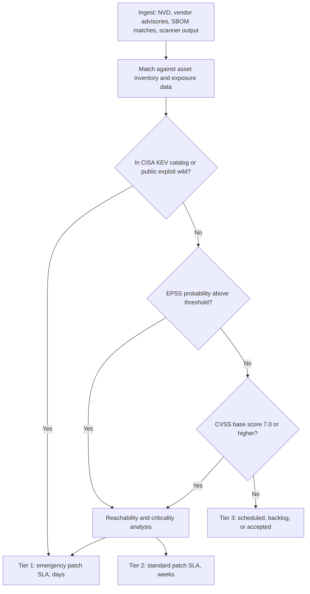
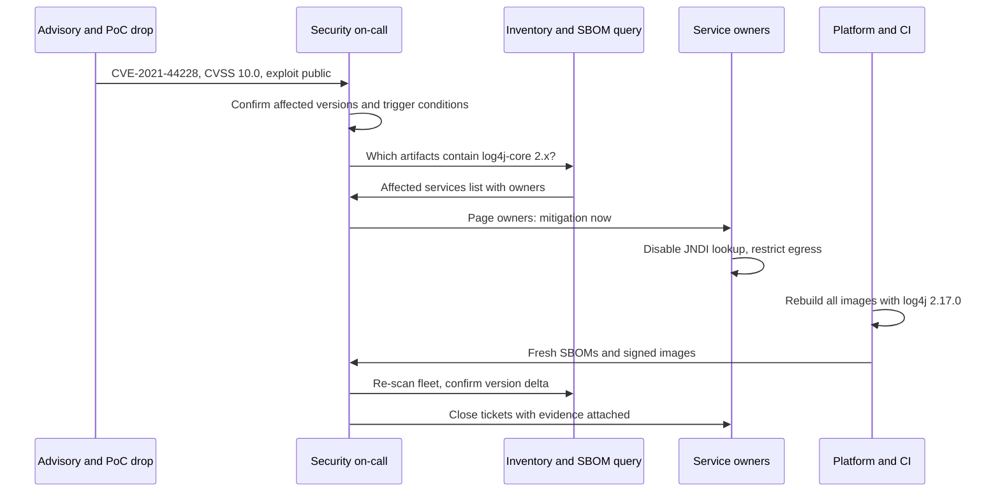

# Vulnerability & Exposure Management: CVE to Patch

## Overview

Vulnerability management is the operational pipeline from "a CVE dropped" to "patched everywhere" — asset inventory, detection, prioritization, remediation SLAs, and verification, running continuously against a feed that emits roughly 100 new CVEs a day and never pauses. Platform and security-engineering interviews probe it at the process level: how you tier patch SLAs when everything cannot be patched at once, what your 48 hours looked like when Log4Shell landed, and why your prioritization funnel does not reduce to "sort by CVSS descending." The scanner tooling that *produces* the findings is covered in [The AppSec Toolchain](./appsec-toolchain.md); this page is the factory that consumes them.

## The Data Ecosystem

Six interlocking databases form the vocabulary, and interviews expect you to know which layer each one lives at:

| Source | What it is | Role in the pipeline |
|---|---|---|
| [CVE](https://www.cve.org/) | The registry of individual vulnerability instances; IDs issued by CNAs, records maintained in the [cvelist](https://github.com/CVEProject/cvelist) git repository | The primary key everything else joins against |
| [NVD](https://nvd.nist.gov/) | NIST's curated view of every CVE: CWE mapping, CVSS score, CPE-affected ranges ([data feeds](https://nvd.nist.gov/vuln/data-feeds)) | The enrichment layer most scanners consume |
| [CWE](https://cwe.mitre.org/) | The taxonomy of weakness *classes* (CWE-79 XSS, CWE-89 SQL injection) | Aggregates instances into fixable engineering patterns |
| [CAPEC](https://capec.mitre.org/) | The catalog of attack *patterns* — how the weakness is exploited in practice | The attacker-side complement to CWE |
| [CISA KEV](https://www.cisa.gov/known-exploited-vulnerabilities-catalog/) | The catalog of vulnerabilities confirmed exploited in the wild | The "actually being used" signal that should drive SLAs |
| EPSS | FIRST's Exploit Prediction Scoring System: probability a CVE will be exploited in the next 30 days | The probabilistic tiebreaker between CVSS-equal findings |

Two operational realities about this stack are interview gold. First, **NVD enrichment lag is a fact of life**: in early 2024 NVD's analysis backlog ballooned from dozens of days to a queue exceeding 20,000 un-enriched CVEs at its worst, meaning a CVE could be public for months with no CWE mapping, no CVSS score, and no CPE ranges — while scanners built on NVD analysis silently reported nothing. Mature tooling learned to parse CVE records directly from cve.org (the authoritative registry) and to treat NVD enrichment as a best-effort accelerator; "which layer of the stack is my scanner actually consuming" is a question you should be able to answer about your own pipeline. Second, **CWE and CVE are different units of analysis**: a CVE is one instance ("this specific bug in this specific version"), a CWE is the class ("SQL injection"), and CAPEC describes the exploitation playbook. Remediation engineering targets the CWE class (parameterized queries kill every CWE-89 instance), while incident response works the CVE instances.

KEV deserves its own sentence of emphasis: it is not a severity list but a ground-truth list — entry requires confirmed exploitation, and U.S. federal agencies are mandated (BOD 22-01) to remediate KEV entries within two weeks. For prioritization purposes, "in KEV" is the single most actionable bit attached to any CVE, which is why it sits at the top of the funnel below rather than as one weighted factor among many.

### How KEV and EPSS Interact

The two signals answer different questions and fail differently. KEV is *confirmed* exploitation — binary, lagging (exploitation happened before listing), and biased toward vulnerabilities used in real campaigns against real targets, which is exactly what you want for SLA-driving. EPSS is *predicted* probability over the next 30 days — continuous (0.0-1.0), refreshed daily, model-driven, and useful for ranking the long middle of the feed that KEV will never touch. The interplay rule most programs converge on: KEV membership overrides everything; above it, EPSS thresholds do the routing, because EPSS correlates with the CVE attributes that actually drive exploitation (exploit availability, exposure of internet-facing services) far better than CVSS does — EPSS research consistently shows the base score and exploitation probability are only weakly related. The honest caveat for interviews: EPSS is a retrained model, its probabilities drift between model updates, and a finding is never "safe" because its EPSS is low today — the threshold is a resource-allocation dial, not a safety verdict.

## Scoring: CVSS v3.1 vs v4.0

CVSS is FIRST's effort to make severity communicable in a vector string. **v3.1** (2019) scores eight base metrics — Attack Vector/Complexity/Privileges/User Interaction, Scope, and Confidentiality/Integrity/Availability impacts — into a 0-10 base score, with Environmental metrics to adjust for your context and a Temporal group (Exploit Code Maturity, Remediation Level, Report Confidence) that almost nobody fills in. **v4.0** (November 2023) is a substantial redesign: the Scope concept is replaced by explicit "vulnerable system vs subsequent system" impact metrics, a new Attack Requirements metric captures precondition complexity, and — most consequentially for this page — the Threat metrics (exploit maturity, drawn from real-world signal like KEV and PoC availability) are promoted to a first-class scoring profile (CVSS-B vs CVSS-BT), acknowledging that "has someone written an exploit" is exactly the information v3.1's unused Temporal group was failing to carry. Environmental scoring is also restructured into a much larger matrix so that "we use this in a safety-critical deployment" can actually move the number.

The persistent interview question is not the version history — it is *why CVSS alone misleads*. The score measures intrinsic technical severity for a generic worst-case deployment, and three structural biases fall out: it ignores your exposure (internal vs internet-facing), it ignores exploit reality (9.8s that nobody has exploited in a decade, 7.5s exploited within days), and its qualitative bands (9.0-10.0 "Critical") encourage organizations to treat the band as the SLA. The recurring archetypes:

| Archetype | CVSS | Actual priority | Why |
|---|---|---|---|
| RCE in a library, but the vulnerable function is never called | 9.8 | Low-medium | Reachability zero; patch in normal cadence with reachability documented |
| DoS in an internal batch job behind VPN | 7.5 | Low | Attacker preconditions include VPN access and a job trigger |
| Weak TLS cipher on a legacy partner endpoint | 5.3 | High | Actual exploitability plus compliance exposure disproportionate to score |
| XSS in an admin panel only two staff can reach | 6.1 | Medium | Limited blast radius, but admin-session theft is high-impact |
| Anything in KEV, regardless of score | 3.1-10 | Tier 1 | Confirmed exploitation is worth more than any base metric |

The fix is not a better number but a funnel: CVSS as the initial coarse filter, exploit signal and reachability as the ranking layers, and SLA tiers assigned by the combination.

## MITRE ATT&CK for Defenders

ATT&CK is MITRE's matrix of adversary behavior, organized as **tactics** (the column headers: Reconnaissance, Resource Development, Initial Access, Execution, Persistence, Privilege Escalation, Defense Evasion, Credential Access, Discovery, Lateral Movement, Collection, Command and Control, Exfiltration, Impact) and **techniques/sub-techniques** (the cells: T1190 "Exploit Public-Facing Application", T1059 "Command and Scripting Interpreter", and hundreds more), with each technique documented by procedure examples from named threat groups. Its two operational uses in vulnerability management:

- **Mapping detections to coverage gaps.** List your detection controls per technique — EDR rules, WAF, SIEM correlation — and lay the results over the matrix (the ATT&CK Navigator renders exactly this heatmap). The gaps are usually not subtle: most organizations detect Initial Access reasonably and Lateral Movement badly, which is how a single phished laptop becomes a domain-wide incident. The heat-mapping exercise is a quarterly ritual precisely because coverage decays as tools and techniques change.
- **Contextualizing vulnerability risk.** A vulnerability whose exploitation path requires T1550 "Use Alternate Authentication Material" (pass-the-hash) inside a network where those techniques are well-detected is a lower-priority vulnerability than its CVSS suggests; the same CVE in an unmonitored DMZ segment is higher. ATT&CK supplies the vocabulary for arguing this precisely instead of by intuition.

**ATT&CK Evaluations** — MITRE's annual live-fire tests where vendor platforms face emulated adversary campaigns (APT29 in 2020, FIN7 and Wizard Spider in subsequent rounds) — matter to this page as a procurement sanity check: the published results show empirically that no product detects everything, which is the empirical backing for the defense-in-depth assumption the whole funnel rests on. The STIX/JSON form of the full matrix is available for tooling from [the MITRE data repository](https://github.com/mitre-attack/attack-stix-data).

## The Management Loop

The operational cycle has five stages, and the failure modes are per-stage: inventory that missed 40 services (discovery finds nothing to scan), scanning without prioritization (the noise cliff), prioritization without SLAs (findings age in a queue with no clock), remediation without verification (the "fix" never actually deployed), and verification without inventory (you never re-scan to confirm). The loop:

1. **Asset inventory** — every service, container image, VM, and third-party component with an owner. This is the stage that determines everything downstream, and it is the stage most organizations fail first: you cannot patch what you have not listed, and "unknown assets" is exactly the category that Log4Shell punished.
2. **Discovery** — authenticated scanners log into hosts with credentials and see installed package versions; unauthenticated network scanners infer from banners and fingerprints; agent-based scanners report continuously from inside hosts; container/K8s runtime scanning matches the images actually running against their SBOMs. Each mode's blind spot is another mode's strength — see the comparison below.
3. **Prioritization** — the funnel (next section) assigns each finding a tier.
4. **Remediation under SLA** — patch, mitigate, or formally accept risk, per the tier's clock.
5. **Verification** — re-scan to confirm the patch deployed, then record the closure. The verification stage is where patch management and configuration drift meet: a patched VM re-imaged from a golden image built before the patch is un-patched, and only re-scanning catches it.

Two governance artifacts hold the loop together. A **risk register** — the standing list of accepted risks with owner, justification, monitoring signal, and revisit date — is the same artifact [Threat Modeling](../threat-modeling.md) produces for design-time risks; vulnerability management just feeds it continuously instead of per-release. And **VEX** (Vulnerability Exploitability eXchange) documents, per artifact, whether a listed component is actually exploitable in *your* product — "not affected: the vulnerable code path is disabled in our configuration" — which is the machine-readable form of the reachability analysis that keeps the funnel honest. The SBOM/VEX machinery is detailed in [SBOM and SLSA](../../supply-chain/sbom-slsa.md).

The risk register deserves its concrete format, because the fields are what make acceptances auditable rather than decorative:

```yaml
# risk-register/entries/RV-2024-0117.yaml — reviewed in the same PR as the acceptance
- id: RV-2024-0117
  source: CVE-2024-XXXXX in mqtt-client 3.1.4
  affected: telemetry-ingest v2.0-2.3
  decision: accepted
  rationale: "Vulnerable parser reachable only via unauthenticated MQTT port, firewalled to plant VLAN"
  compensating_controls:
    - "Network policy: MQTT listener reachable from plant VLAN only"
    - "Anomaly alert on malformed MQTT frames"
  owner: telemetry-oncall
  accepted_by: sec-leads + telemetry-staff
  monitoring_signal: "WAF/network alert malformed-mqtt OR new EPSS above 0.5"
  revisit: 2025-06-30
```

The fields to argue for in an interview are `monitoring_signal` and `revisit`: an acceptance without a signal that would reveal the accepted risk going active is not an acceptance, it is an amnesia, and the revisit date is what converts "accepted" from a permanent state into a standing offer to re-litigate with better data. A register whose entries lack these two fields will not survive its first audit.

### Scanning Technology Trade-offs

| Mode | Sees | Blind spots | Cost profile |
|---|---|---|---|
| Network scanner (unauthenticated) | Reachable services, banner versions, TLS config | Patch level behind banners; anything not network-listening | Cheap; safe; continuous |
| Authenticated scanner | Installed packages, missing OS patches, local config | Requires credentials everywhere (and credential hygiene becomes a dependency) | Moderate; the standard for infrastructure |
| Agent-based | Everything on the host, continuously, including ephemeral hosts | Agent deployment/maintenance; fleet drift in coverage | Highest fidelity, highest ops burden |
| Container/K8s runtime | Actual running images vs deployed manifests | Only what is running right now | Low marginal cost with SBOMs at registry time |

The interview-grade observation: authenticated scanning finds *potential* exposures while runtime scanning finds *actual* ones, and a mature program runs both — potential exposures to get ahead of deployment, actual exposures to drive the SLA clock.

Cadence follows cost. Network scanning runs continuously against the external surface (the perimeter changes without your permission, and continuous external scanning is how shadow IT and forgotten test servers surface). Authenticated scans run on a 24-hour-to-weekly cycle per environment, scheduled off-peak because credential scans consume real CPU. Agents report continuously by design — the agent fleet is effectively a real-time inventory, and its coverage percentage (agents installed / assets known) is itself a first-class metric, because an agent fleet at 60% coverage means 40% of your infrastructure is dark. Container scanning shifts left to the registry: images are scanned at build and again on a schedule while they sit in the registry (so new CVE feeds re-triage already-pushed images), and the K8s runtime layer compares what is actually scheduled against the scanned inventory — a pod running an image that was patched in the registry but never redeployed is the single most common false sense of security in container platforms. Admission controllers close the loop by refusing to schedule images that fail the policy check, which moves the last verification from "someone re-scans the cluster" to "the cluster refuses unscanned images" — the same policy-as-code shift described in [Policy as Code](../../cloud/policy-as-code.md).

## The Prioritization Funnel



Reading the funnel top-down: every finding first meets the inventory (a CVE for software you do not run exits here, silently — this filter is bigger than people expect, typically half or more of raw feed volume for mature inventories). KEV membership or a live public exploit is a direct ticket to Tier 1 because it is positive evidence of exploitation, not a prediction. EPSS then routes high-probability findings to reachability analysis; low-EPSS low-CVSS findings drop to the backlog without further analysis, which is the funnel's main cost saving. Reachability plus asset criticality is where the remaining population is split between emergency and standard SLAs. The compounding effect is the point: teams report that the KEV/EPSS/reachability combination cuts the actionable queue by an order of magnitude relative to CVSS-sorting, which is what makes the 14-day Tier-1 SLA affordable.

## Patch SLAs and Org Design

SLAs only mean something with an exception process, or they become either fiction or tyranny. The workable pattern is a tiered table owned jointly by security and platform engineering:

| Tier | Trigger | SLA to remediate | Escalation on breach |
|---|---|---|---|
| Emergency | KEV-listed, exploited, or internet-facing + CVSS 9+ | 48-96 hours | Page service owner; incident process |
| High | Reachable, CVSS 7-8.9, or EPSS top decile | 14 days | Weekly leadership review of the aging list |
| Standard | CVSS 4-6.9, unreachable on critical assets | 30-90 days | Monthly burn-down report |
| Accepted | Unreachable, non-critical, or mitigated by control | Documented risk acceptance with revisit date | Re-acceptance on revisit |

Three design decisions give the table teeth. First, **exceptions are risk acceptances with owners** — a missed SLA does not silently roll over; it converts to a signed acceptance with a revisit date, or it escalates. Second, **the SLA clock is on the finding, not the ticket** — teams that let the clock restart on ticket reassignment age their queues invisibly. Third, **org design matters**: central security teams cannot remediate 400 services; they run the funnel and the metrics, while service owners own their patch execution, which is the same responsibility split as SRE error budgets (security sets the policy, teams execute within it — see [Policy as Code](../../cloud/policy-as-code.md) for the enforcement machinery).

### Case Study: Log4Shell in 48 Hours

CVE-2021-44228 (Log4Shell) is the canonical emergency-patching stress test: a CVSS 10.0 RCE in a library present in a large fraction of the world's Java services, with public PoC within hours and mass scanning (the first exploitation attempts were observed roughly ten hours after disclosure). The 48-hour shape of a competent response:



The walkthrough in operational terms: hours 0-4 confirm the vulnerability's trigger conditions (attacker-controlled string + JNDI lookup enabled) and query inventory for every artifact containing `log4j-core` — this step is only fast for organizations with SBOMs or authoritative manifests, and its slowness in December 2021 is what made SBOM programs fashionable. Hours 4-24 deploy mitigations where patching is not immediate (the `log4j2.formatMsgNoLookups=true` flag, WAF rules, egress restrictions that break exfiltration even if lookup succeeds) and start emergency rebuilds for internet-facing services. Hours 24-48 rebuild everything else, re-scan to verify version deltas, file the VEX-equivalent not-affected statements for the false positives (log4j 1.x, applications that never log user input), and hand the residual list to the standard SLA process. The retrospective lesson that interviews probe for: the response was bounded by *inventory quality and rebuild speed*, not by detection — everyone knew about the CVE within the hour, and knowing is the easy part. The follow-on CVEs in the same weeks (CVE-2021-45046, CVE-2021-45105) are the second lesson: emergency patching is a process you repeat, not an event you survive once.

## Vulnerability Disclosure

The disclosure system is the reason the pipeline has findings to manage, and its vocabulary appears in interviews as three distinctions. A **VDP** (vulnerability disclosure policy) is the public statement of how researchers should report vulnerabilities to you and what they may legally do while doing it — safe-harbor language, response timelines, scope; it is the floor and costs nothing but commitment. A **bug bounty** is a VDP plus money, scaled by severity — which converts ad-hoc reports into a managed pipeline, at the cost of significant triage load (duplicate and invalid reports routinely dominate the queue, and triage quality is the actual product you are buying from a bounty platform). A **penetration test** is a contracted, scoped engagement with a fixed deliverable — point-in-time, breadth-limited, and best understood as compliance and design validation rather than ongoing discovery. The three compose: VDP always, pen tests for regulatory and architectural coverage, bounty where the surface is large and adversarial.

| Dimension | VDP | Bug bounty | Penetration test |
|---|---|---|---|
| Cost model | Free (honor system) | Pay per accepted report, severity-scaled | Fixed fee per engagement |
| Coverage | Whoever shows up | Continuous, crowd-scaled | Scoped systems, fixed duration |
| Finding quality | Highly variable | Variable; platform triage filters | Curated, report-grade |
| Best fit | Every organization | Large public attack surface | Compliance requirements, pre-launch validation |
| Failure mode | No safe-harbor language → reports go public uncoordinated | Triage drowning → slow responses repel good researchers | Point-in-time snapshot mistaken for a program |

One economics note that lands well in interviews: bug bounty payouts are severity-scaled and competition-driven, so the marginal report arriving at a mature program tends to be low-severity or duplicate — the bounty's real output is *coverage insurance* on the surface you cannot test internally, not a cheaper substitute for the toolchain. And a disclosure program's response-time SLA is itself a vulnerability-management metric: the period between report receipt and first human response is the single biggest predictor of whether a researcher reports to you again or posts straight to social media.

**Coordinated disclosure** is the timeline contract: the researcher reports privately, the vendor gets a window to fix (90 days is the convention Google Project Zero made standard, with a public deadline from day one), and the details publish after the deadline whether or not the fix shipped — the publish-anyway clause is what keeps vendor responsiveness honest. The framework documents are ISO/IEC 29147 (disclosure) and ISO/IEC 30111 (vulnerability handling); the operational artifacts on the vendor side are a security.txt file pointing at the reporting channel and a triage SLA measured in days. The system's asymmetry is worth stating in interviews: disclosure deadlines mean the world learns about the vulnerability at roughly the same time your patch ships, so your patch SLA and the disclosure calendar are the same risk conversation viewed from two sides.

## Metrics and Maturity

The metrics that survive audit are distributions, not averages:

- **Days-to-remediate by severity tier** — p50 and p90, not mean; the p90 tail is where program failure hides, and a mean over a bimodal distribution (patched in a day, or in a year) is a number that describes nothing. Track the distribution per tier against the SLA table.
- **KEV dwell time** — how long an asset remains exposed after a CVE in it lands in KEV. This is the single most defensible metric to take to leadership because the trigger is objective and the clock is externally observable.
- **Scan-to-fix lead time** — the DORA-style decomposition: detection latency (scan cadence), triage latency, patch latency, deployment latency. Improving the sum requires knowing which stage dominates, and in most organizations triage latency dominates until it is measured.
- **Remediation ratio and backlog age** — closed-vs-open per period, and the age histogram of the open set. A backlog with a fixed age distribution and growing count is degrading slowly enough to miss on a dashboard that only shows counts.

Maturity models (CMMI-style levels, or the pragmatic three-band version) mostly compress to two questions: is the funnel prioritized by anything better than CVSS, and do SLAs have exception processes. Programs below that bar run on fear and quarterly fire drills; programs above it patch KEV entries inside two weeks and can prove it from their own data — which is also, not coincidentally, the U.S. federal BOD 22-01 requirement, making it the one external benchmark with real enforcement behind it. The pragmatic bands, for sizing where an organization actually is:

- **Reactive** — annual or ad-hoc scans, CVSS-sorted spreadsheets, patching driven by audit deadlines and news cycles. No inventory ownership, no exception process; the metric that describes this band best is "we find out what we run when a vendor asks."
- **Managed** — continuous authenticated scanning, a tiered SLA table, a working risk register, and metrics reported monthly. The tell is that exceptions exist and are documented; the risk is that the funnel still sorts mostly by severity and the backlog grows monotonically.
- **Engineered** — the funnel gates on exploit signal and reachability, SLA performance is a tracked SLO with error-budget-style escalation, registry/agent/scan data converge into one inventory, and the metrics decompose to the stage level (detection, triage, patch, deploy latency) so improvements are targeted rather than aspirational.

Moving between bands is an organizational project, not a tooling purchase — the tooling for band three is the same as for band two; what changes is that SLA breaches escalate, suppressions have expiries, and the inventory is load-bearing for more than the vulnerability program.

## Where AI Fits

Triage assist is the near-term, honest use case: LLM-assisted clustering of duplicate findings, drafting of suppression rationales for human approval, summarizing a 40-page advisory into the trigger conditions that matter for your stack, and first-pass classification of bounty reports. These are summarization and classification tasks where a wrong answer gets caught by the reviewing human. Exploit prediction is the overpromised frontier: EPSS is a trained model already (and its limitations are documented — probabilities, not verdicts, and drift between retraining windows), and LLM-based "will this be exploited" predictors add hallucination risk to an already probabilistic signal. The honest position in an interview: use models to compress human reading time in triage, treat every prioritization model as one input to the funnel rather than its replacement, and never let an unreviewed model output be the sole reason a risk acceptance is signed.

## Interview Questions

1. **A critical CVE drops for a library you use everywhere. Walk me through your first 24 hours.** Confirm the technical trigger conditions from the advisory first — Log4Shell taught that the exploit surface is often narrower than the headline (attacker-controlled input + JNDI lookup enabled). Query inventory and SBOMs for exactly which artifacts and which versions you ship; this is the step whose speed is entirely determined by work done before the CVE. Page owners of internet-facing services, deploy mitigations where patching is slower than mitigation, start emergency rebuilds, and queue the rest to the standard SLA process with an explicit tier assignment. Close with re-scanning to verify version deltas — the response is not done when the patches are built, it is done when the fleet is verified.

2. **Why is sorting by CVSS a bad prioritization strategy?** CVSS measures intrinsic severity for a generic worst-case deployment, so it ignores your exposure, exploit reality, and reachability — a 9.8 in a function you never call outranks a 7.5 being exploited in the wild, which is obviously wrong. The fix is a funnel: KEV membership as the direct-to-Tier-1 signal, EPSS as the probabilistic ranker, reachability and asset criticality as the exposure layer, and CVSS as the initial coarse filter. Teams that gate on this combination typically cut the actionable queue by an order of magnitude, which is what makes aggressive SLAs on the remaining findings affordable.

3. **What is the difference between CWE, CVE, CAPEC, and ATT&CK?** CVE is the instance registry — one identifier per specific bug in a specific product version. CWE is the weakness taxonomy — the class of bug (CWE-89, SQL injection) that many CVEs instantiate. CAPEC catalogs the attack patterns — how the weakness gets exploited. ATT&CK catalogs adversary behavior at the campaign level — tactics and techniques, including how a vulnerability fits into a broader intrusion chain. The layers join: a CVE record maps to a CWE, the CWE maps to CAPEC exploitation patterns, and ATT&CK tells you which techniques surround the exploit in a real attack — which is how ATT&CK coverage data feeds back into vulnerability prioritization.

4. **How do you design a patch SLA that people actually follow?** Tier it by exposure and exploit signal, not by CVSS alone: days for KEV-listed or internet-facing criticals, weeks for reachable highs, months for the rest. Give every SLA breach exactly two paths — convert to a signed risk acceptance with an owner and revisit date, or escalate — so nothing silently ages. Put the clock on the finding, not the ticket. And split the ownership correctly: a central security team runs the funnel and metrics while service owners execute patches, with policy enforced as code where possible. The alternative designs fail in predictable ways: one universal SLA becomes fiction, and no exception process turns the SLA into a queue nobody trusts.

5. **What is VEX and what problem does it solve that an SBOM does not?** An SBOM says which components are in an artifact; VEX is a machine-readable attestation about whether each listed vulnerability is actually exploitable in that artifact — "not affected: the vulnerable code path is disabled." The gap it closes is the false-positive mass in SCA findings: on disclosure day you want to say "our 400 services are not affected, and here is the per-artifact evidence" instead of rebuilding everything. It is the contractual form of reachability analysis — which is why it only works when the underlying analysis is real, and why a VEX statement needs the same evidence discipline as a suppression.

6. **Where do you honestly think AI helps and hurts in vulnerability management?** It helps where the task is summarization or classification with a human reviewer in the loop: clustering duplicates, drafting suppression rationales, condensing advisories to trigger conditions, first-pass bounty triage. It hurts where the output is a decision: exploit-prediction claims beyond what EPSS-style probabilistic models already provide add hallucination on top of an already noisy signal. The rule I would apply: models compress reading time, humans sign acceptances, and no prioritization model is ever the sole justification for a risk decision.

## Key Takeaways

- The pipeline is inventory → discovery → prioritization → remediation under SLA → verification; each stage has a characteristic failure mode, and inventory quality caps everything downstream.
- The data stack is layered: CVE (instances), CWE (weakness classes), CAPEC (attack patterns), ATT&CK (campaign behavior), NVD (enrichment), KEV (confirmed exploitation), EPSS (exploit probability) — know which layer your tooling consumes.
- NVD enrichment lag is real (the 2024 backlog exceeded 20,000 CVEs), so robust pipelines parse CVE records directly and treat NVD analysis as best-effort.
- CVSS measures intrinsic severity, not your risk: KEV membership, EPSS, reachability, and asset criticality are the layers between the base score and the SLA tier.
- VEX is the machine-readable "exploitable in OUR product" attestation; with SBOMs it converts disclosure-day chaos into a filtered, evidence-backed response.
- Tiered SLAs work when breaches have exactly two exits — signed risk acceptance with revisit date, or escalation — and the clock runs on the finding, not the ticket.
- Log4Shell's lesson is structural: response speed was bounded by inventory quality and rebuild capability, not detection; emergency patching is a repeatable process, not an event.
- Report remediation as distributions (p50/p90), track KEV dwell time as the externally auditable metric, and decompose scan-to-fix lead time by stage before optimizing anything.

## References

- [CVE Program](https://www.cve.org/) — the authoritative vulnerability registry and CNA program
- [CVE List source repository](https://github.com/CVEProject/cvelist) — the records as a git repository
- [NIST NVD](https://nvd.nist.gov/) — the enrichment layer (CWE, CVSS, CPE)
- [NVD developer APIs](https://nvd.nist.gov/developers/)
- [NVD vulnerability data feeds](https://nvd.nist.gov/vuln/data-feeds/)
- [CWE — Common Weakness Enumeration](https://cwe.mitre.org/) — the weakness taxonomy
- [CAPEC — Common Attack Pattern Enumeration and Classification](https://capec.mitre.org/)
- [MITRE ATT&CK](https://attack.mitre.org/) — the tactics/techniques matrix
- [ATT&CK STIX data repository](https://github.com/mitre-attack/attack-stix-data)
- [CISA Known Exploited Vulnerabilities Catalog](https://www.cisa.gov/known-exploited-vulnerabilities-catalog/) — with JSON/CSV feeds from the same page
- CVSS and EPSS are published by FIRST (the Forum of Incident Response and Security Teams); CVSS v4.0 was released November 2023 — refer to FIRST's published specifications
- ISO/IEC 29147 (vulnerability disclosure) and ISO/IEC 30111 (vulnerability handling) — the coordinated-disclosure framework documents

## Cross-References

- [The AppSec Toolchain](./appsec-toolchain.md) — the scanner stack that produces the findings this pipeline consumes.
- [Threat Modeling](../threat-modeling.md) — the design-time counterpart: the risk register format shared with accepted vulnerabilities.
- [Supply Chain Security](../supply-chain-security.md) — SLSA levels, SBOM fundamentals, and why provenance bounds rebuild speed.
- [SBOM and SLSA](../../supply-chain/sbom-slsa.md) — the Log4Shell-day exercise and the VEX/SBOM machinery in depth.
- [Policy as Code](../../cloud/policy-as-code.md) — OPA/Kyverno enforcement for the SLA and exception policies described here.
- [Incident Response](../incident-response.md) — what happens when the patch SLA loses the race; MTTD/MTTR definitions for security events.
- [Secrets Management](../secrets-management.md) — the rotation workflow for credential exposures, the secrets-scanning counterpart to CVE patching.
- [Exploit Mitigations](./exploit-mitigations.md) — why some "unpatchable" exposure tiers are survivable: the runtime mitigation stack.
- [SLOs and Error Budgets](../../sre/slo-error-budget.md) — the SRE governance pattern behind SLA tiers and burn-down targets.
