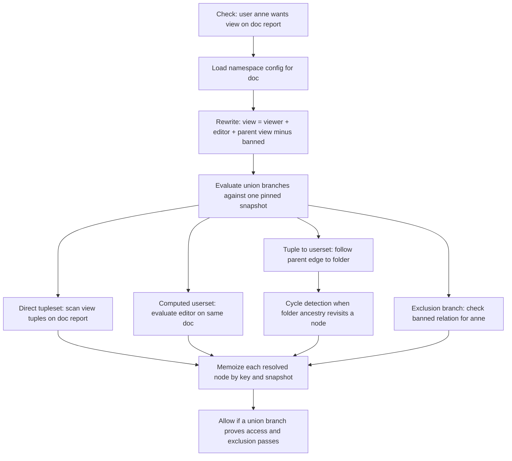
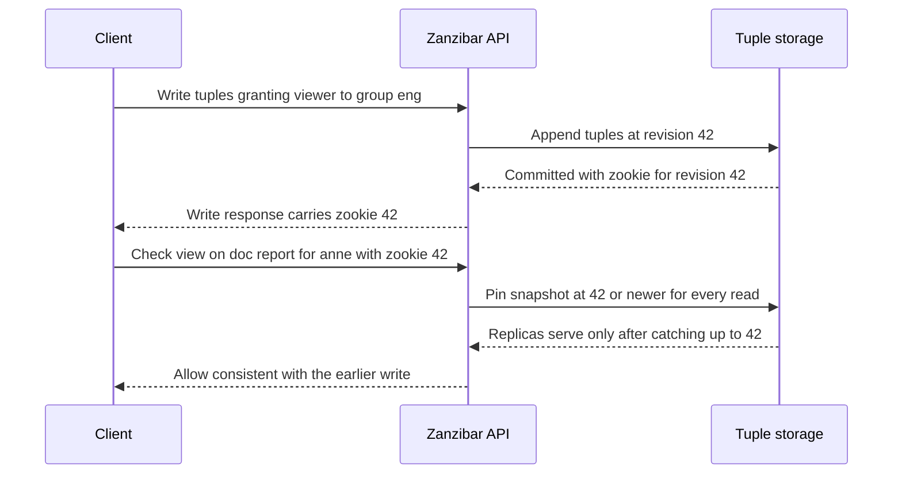
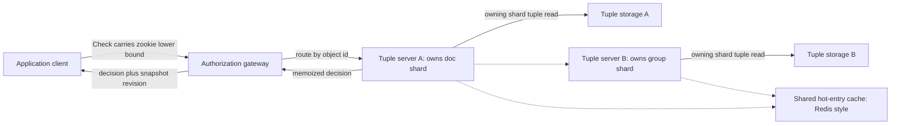

# Zanzibar and Relationship-Based Access Control

## Overview

Zanzibar is Google's globally distributed authorization system (USENIX ATC 2019) that answers one question at trillion-tuple scale: *can user X perform relation R on object Z?* Its contribution is making permissions a **graph query over stored relationships** — Relationship-Based Access Control (ReBAC) — instead of a role join, which [Authorization: RBAC and ABAC](../authorization.md) covers, or an attribute predicate evaluation. Identity comes from the layers around it: [Backend Auth: OAuth, JWT, Sessions](../../backend/auth/README.md) establishes *who* the caller is and [Zero Trust](../zero-trust.md) architecture decides where enforcement lives, while Zanzibar owns the fine-grained sharing graph (per-object grants, group nesting, folder inheritance, public links). The paper's second contribution is a consistency protocol — the zookie — that makes read-your-writes work even when permission logic includes negation. This page covers the relation-tuple data model, userset rewrite rules, the Check/Expand/Write/Watch API, consistency semantics, the scaling architecture, the open-source ecosystem (SpiceDB, OpenFGA, Ory Keto), and how to model a Drive-like system in an interview.

## Why RBAC and ABAC Fall Short for Fine-Grained Sharing

Google-Drive-style sharing combines features that no single RBAC or ABAC model handles cleanly: per-object ACLs (this one doc is shared with these three people), groups that contain groups, folders whose grants inherit into every descendant, anyone-with-the-link public access, domain-wide grants, and time-expiring invitations. Under RBAC, a role is an attribute of a user relative to a fixed resource hierarchy; here the *grants themselves are per-object data*, so "the viewer role on doc:readme" is a set that mutates with every share action, and "who can see this doc" cannot be answered by looking up the user's roles. Under ABAC, policy is code evaluated over user/resource/environment attributes; encoding Drive semantics means stuffing the entire sharing graph into attributes — an attribute per grantee, per ancestor folder, per link state — and the policy layer degenerates into an interpreter over a graph you've flattened into JSON. Two operational questions expose the difference immediately: the forward check ("can anne view this?") and the inverse audit ("*who* can view this?") are both recursive queries over stored relationships with union, intersection, and exclusion — a graph traversal, not a predicate evaluation. The scale framing makes it worse: Zanzibar serves millions of authorization checks per second over trillions of relation tuples, so the model must also be evaluable in a few milliseconds by a distributed, cached, sharded service. The inverse query hurts ABAC most: "list everyone who can see this document" with per-object attribute policies means evaluating every policy against every candidate principal, whereas a graph stores the answer's edges directly and Expand walks them. ReBAC is the answer: store the relationships as first-class data, define the permission logic as rewrite rules over them, and evaluate on demand.

## The Zanzibar Data Model: Relation Tuples and Namespaces

The entire model is one record type, the **relation tuple**:

```text
object:ID#relation@user

doc:readme#viewer@user:anne          # anne is a viewer of doc:readme
doc:readme#viewer@group:eng#member   # members of group:eng are viewers (a userset)
doc:readme#parent@folder:eng         # parent pointer used for inheritance
folder:eng#viewer@user:anne          # direct grant on the folder
```

The `@user` slot is formally a **subject**, and the trick that makes everything recursive is that a subject can itself be a **userset** — `group:eng#member` means "the set of users holding the member relation on group:eng," which is evaluated by recursively running a check. Groups, folders, teams, and public-link principals are all just objects with relations; nothing is special-cased. A **namespace** (object type) declares its relation names and the types each relation accepts — `definition doc { relation viewer: user | group#member }` type-checks every tuple write against a schema version, catching the "grant to a deleted group" class of bug at write time. Tuples are immutable, append-then-dereference records: a delete writes a tombstone, and every mutation is stamped with a globally ordered **revision number** so the system can answer questions *as of a snapshot*. Namespace configs are versioned objects too — a rewrite-rule change is a data change with its own revision, so "what could anne access yesterday at 14:00" is answerable by pinning the config and tuple snapshots to that revision, which is exactly what forensics after a compromised account requires. The write path validates twice: syntactic type-checking against the namespace declaration (rejecting `doc:readme#viewer@doc:other` when `viewer` only accepts `user | group#member`), and the revision stamp that orders it in the global log. Tuples are sharded by object ID across relation-tuple servers, while namespace configurations are replicated to every server and cached, so any server can expand rewrite rules but only the owning shard serves the tuples for a given object. This shape — tiny uniform records plus declarative config — is what lets the same system model Drive, Docs comments, Calendar events, YouTube videos, and Cloud IAM.

| Operation | Storage effect | Returns |
|---|---|---|
| Write tuple | Appended, type-checked against the namespace, stamped with a revision | zookie at that revision |
| Delete tuple | Tombstone appended; history is never rewritten | zookie at that revision |
| Namespace config change | New config revision; rules re-expand on subsequent reads | config version |
| Check | Read-only; evaluates the rewrite tree at one pinned snapshot | allow/deny plus the snapshot revision |

## Userset Rewrite Rules and the Permission Graph

A relation is computed from other relations by a **userset rewrite rule** declared in the namespace config. The paper's primitives, all combinable as arbitrarily nested trees:

| Primitive | Meaning | Canonical example |
|---|---|---|
| `_this` (direct tupleset) | Read tuples of this relation on this object | direct `viewer` grants |
| `computed_userset` | Evaluate another relation on the *same* object | `viewer = owner + editor + viewer` |
| `tuple_to_userset` | For each tuple on relation A (which points at other objects), evaluate relation B on that target | `parent->viewer` folder traversal |
| union `+` | Any branch grants | most permissions |
| intersection `&` | All branches must grant | `editor & compliant-member` |
| exclusion `-` | First branch minus second | `viewer - banned` |

A Drive-flavored config in the SpiceDB-schema dialect:

```text
definition user {}

definition group {
  relation member: user | group#member
}

definition folder {
  relation parent: folder
  relation editor: user | group#member
  relation viewer: user | group#member
  permission edit = editor + parent->edit
  permission view = viewer + edit + parent->view
}

definition doc {
  relation parent: folder
  relation editor: user | group#member
  relation viewer: user | group#member
  relation banned: user
  permission view = (viewer + editor + parent->view) - banned
}
```

`parent->view` is the tuple_to_userset: the tuples on `doc:report#parent` name folder objects, and for each one the system evaluates that folder's `view` permission, which recurses up the folder tree — that single rule implements folder inheritance. Note what this division of labor buys compared with policy-as-code: the *logic* lives in small declarative configs that are versioned, type-checked, and auditable like database schemas, while the *facts* live in tuples that application code writes at share time. A policy engine re-evaluates code over snapshot data on every request; a ReBAC engine evaluates fixed rules over indexed relationship data it can cache and invalidate precisely. The **permission graph** is the object graph (tuples) *times* the rewrite rules (config): evaluation is a recursive descent where internal nodes are rule operators and leaves are tuple lookups or nested checks. Because parents, groups, and computed relations can reference each other, the graph can contain cycles (folder A is the parent of folder B which is the parent of A), so evaluation must carry a visited set — cycle detection is a correctness requirement, not an optimization.

## The API Surface: Check, Expand, Write, Watch

Four RPCs define the system. **Check(object, relation, user, consistency-context) → allow/deny** is the hot path: it evaluates the rewrite tree recursively, memoizing each resolved `(object#relation@user, snapshot)` node so a user shared via five nested groups is only expanded once per request, and memoized subproblems are also cached *across* requests when the consistency mode allows it. **Expand(object, relation) → userset tree** computes the full effective set of users for an access review or a share dialog; it returns the userset *tree* rather than a flat list because flattening a 50,000-member group nested through ten subgroups is the caller's size problem, not the server's. **Write** (and delete) mutates tuples, type-checks them against the namespace config, stamps them with a revision, and returns a **zookie** — the consistency handle described below. Writes are transactional in batches: a single logical share that touches several tuples (add the member, attach the group to the ACL) should commit atomically so no snapshot ever shows the half-grant; implementations expose this as a transactional write API, and the paper's interwoven-writes analysis is the argument for why batch atomicity alone is not sufficient without the lower-bound read rule. A low-level Read API (list tuples by prefix) supports bulk syncs and backfills, though applications should treat it as plumbing, not as a query language. **Watch** streams the changelog of tuple mutations per namespace, which is the substrate for downstream caches, search-index ACL filters, and denormalized "who can see this" lists. The evaluation flow for a single Check:



The memoization node is doing double duty: within one request it deduplicates converging paths (anne reaches `doc:report` both directly and via `folder:eng`), and across requests it is the cache entry whose invalidation rules are the hard part — the subject of the next two sections. Production implementations also return the **snapshot revision** (or a full evaluation trace, in SpiceDB's debug mode) alongside the boolean, because callers need the revision to chain zookies and operators need the trace to answer "why was this denied" — an authorization service without explainability becomes a ticket queue. Check failures degrade one of two ways, and a design interview should name both: fail-closed on dependency errors (deny and let the retry fix it) versus stale-allow on cache-serving paths, which is precisely what the consistency dial controls.

## Consistency: Zookies, Snapshots, and the Cost of Negation

Every tuple write returns a **zookie** (the paper's "new generation token") encoding the commit revision. A client that passes that zookie back on a subsequent Check forces the system to evaluate against a snapshot **at least as fresh as the write** — a lower-bound snapshot. Crucially, the lower bound applies to *every tuple read in the recursive evaluation*, including reads served from replicas and from caches: a replica must have caught up to the zookie revision before it may serve the check, and a memoized subresult computed at revision 15 may not be reused for a check pinned at revision 42. This machinery exists because of what the paper calls the **excluded-users** and **interwoven-writes** problems, and the intuition is monotonicity: with union-only permission logic, a stale snapshot errs toward *deny* (it can only miss a grant), which converges and is operationally tolerable. Negation breaks that. Concretely, with `view = viewer - banned` and `doc:report#viewer@group:eng#member` already on disk:

```text
revision 10   group:eng#member@user:anne      # anne reaches the doc via the group
revision 20   doc:report#banned@user:anne     # revoke anne via the exclusion
```

A check for anne evaluated on a warm cache or lagging replica at snapshot 15 still answers *allow* — a fail-open revocation. Conversely, granting anne by two interwoven writes (remove her exclusion at revision 10, add her to the group at revision 20) yields a *deny* visible after both commits if the second write's lower bound is not enforced on the group read — a read-your-writes violation the client observes immediately. Intersection adds the same hazard symmetrically: an ACL like `g1 & g2` evaluates two operands living on different shards, and any mixed-revision evaluation corresponds to no serial execution of the client's writes. The design trade-off Zanzibar makes is **per-check external consistency, not global serializability**: one snapshot is pinned per check (all branches agree on the revision), concurrent checks may legitimately see different snapshots, and only clients that supply zookies get read-your-writes. Requiring every check to read the globally-latest committed state would collapse the caching and replica-serving layers for a property most checks do not need. Implementations expose this as a per-request dial — SpiceDB offers `minimize_latency`, `at_least_as_fresh: zookie`, `fully_consistent`, and `at_exact_snapshot`; OpenFGA offers `minimize_latency` vs `higher_consistency` — and the interview-grade point is that *fully consistent* bypasses caches entirely, so blanket defaulting to it quietly removes your performance architecture. One more subtlety: revision numbers come from a globally ordered clock discipline, and Zanzibar's own serving tier *never* trusts a wall-clock read to mean "latest revision" — it waits for the revision source to guarantee the bound, the same reasoning that makes Spanner-style systems wait out uncertainty; a check pinned at a revision that the storage layer has not yet confirmed is retried or routed, never answered speculatively.



## Scaling: Sharding, Caches, and Check Fan-Out

Relation tuples shard by object across servers; a check on `doc:report` lands on the shard owning that object, which evaluates the rewrite rules locally and, whenever the graph crosses an object it does not own (`parent->view` on a folder, `group:eng#member` expansion), issues a recursive subcheck to the server owning *that* object. Check is therefore a distributed RPC fan-out over the permission graph, and the architecture is two-level: per-server in-memory caches for tuple reads and subproblem results, plus a shared external cache (the paper uses Redis) for hot entries that would otherwise melt a single shard. Hot objects are the pathological case — a viral doc or an org-root folder checked by millions of users — and are absorbed by the shared cache and by memoizing the *userset* side (expanding `group:eng#member` once per snapshot, not once per requesting user). Cycle detection doubles as fan-out termination, and recursion depth is bounded in practice by schema design (folder trees, group nesting). The cache layers, and what makes each one safe:

| Layer | Keyed by | Invalidated by | Consistency guarantee |
|---|---|---|---|
| Per-request memoization | resolved `object#relation@user` nodes | request end | exactly the pinned snapshot |
| Per-server memory cache | tuple reads and subproblem results | reuse bounded to valid revision ranges | snapshot-bounded reuse |
| Shared hot cache (Redis) | hot tuples and userset expansions | Watch changelog events | bounded by invalidation lag |
| Client-side caches | check results in the app tier | Watch subscription | bounded by subscription lag |

Only the first layer is unconditionally safe; the rest exist because union-heavy workloads tolerate bounded staleness, and every negation/intersection subresult must carry a revision range that Watch events close.



The dashed edges are subcheck fan-out to the group shard and hot-entry cache probes; both dotted lookups must honor the same zookie lower bound as local reads. The alternative to on-demand evaluation is **precomputing transitive closures** — materializing the expanded effective-user set per object, so checks become a set lookup. That buys O(1) reads at the cost of write amplification and invalidation storms: adding one user to a 10,000-member group that touches 100,000 objects invalidates or rewrites 100,000 precomputed rows. Zanzibar bets on lazy evaluation plus caching because sharing graphs are read-skewed with strong locality (a handful of hot objects dominate traffic), and the bet is validated by every open-source successor: expand-on-demand, cache aggressively, invalidate via the Watch changelog.

In deployment, the authorization service sits behind a thin gateway next to the application tier: services call it synchronously on the hot path (single-digit-millisecond budgets, so deep folder trees show up directly as tail latency), while asynchronous consumers — search indexers, notification fan-out, warehouse exports — subscribe to Watch rather than polling. Application-side caches subscribe to the same changelog and drop entries whose `(object, relation)` keys see a mutation; that is how callers stay fresh without hammering the service, because TTL-only expiry silently reintroduces the negation staleness window described above.

## Open-Source Implementations: SpiceDB, OpenFGA, Ory Keto

Three open-source systems dominate the post-Zanzibar ecosystem, and interviews increasingly ask for comparative fluency:

| | SpiceDB | OpenFGA | Ory Keto |
|---|---|---|---|
| Origin | authzed, built as an open-source reimplementation of the paper | Okta FGA, donated to CNCF | Ory, Zanzibar-inspired |
| Language | Go | Go | Go |
| Model definition | `.zaml` schema: relations + permissions with `+`, `&`, `-\`, arrows | JSON authorization model: `this`, `computedUserset`, `tupleToUserset`, conditions | Relation tuples; namespace config, pragmatic subset of rewrite semantics |
| Storage | Pluggable datastores: Postgres, MySQL, CockroachDB, Spanner, and more | Memory, Postgres, MySQL | Postgres, MySQL, CockroachDB |
| Consistency | `minimize_latency`, `at_least_as_fresh`, `fully_consistent`, `at_exact_snapshot` | `minimize_latency` vs `higher_consistency` | Consistency flags per API call |
| Distinctive API | Dispatch tier: gRPC subcheck fan-out with per-node caches | `list-objects` / `list-users`: reverse queries for filtering | Deep integration with the Ory identity stack |

[SpiceDB](https://docs.authzed.com/) is the most faithful paper implementation: a cluster of nodes where a Dispatch layer routes subchecks to the node owning the relevant object shard, with per-node and shared caches mirroring the paper's two-level design. [OpenFGA](https://openfga.dev/docs) grew out of Okta's FGA service and is the CNCF-vetted option; its JSON DSL expresses the same rewrite primitives with different syntax, and its killer feature is the reverse direction — *list the objects a user can access* — which forward-Check systems make you implement yourself by walking candidate objects. [Ory Keto](https://www.ory.sh/keto/docs) implements a deliberate subset of Zanzibar semantics behind relation-tuple APIs and positions itself as the permissions component of the Ory identity platform. Also know the boundary: policy engines like OPA and Cedar evaluate *policy code* over supplied data, while these systems evaluate *stored relationships* — deployments frequently use both, with Cedar/OPA at the API edge and ReBAC for the object-sharing graph. A second axis is **where the tuples live relative to your application database**: all three keep the relation-tuple store separate from application tables, which is the point — permissions become an independently sharded, cached, and audited system of record rather than a pile of join tables — at the cost of a two-system consistency boundary your services must handle with zookie-style discipline.

## Design Interview: Modeling Drive Sharing and the Operational Reality

Given "design Google Drive sharing," start from the tuple schema above and walk one Check through the rewrite rules. Tuples: `doc:report#parent@folder:eng`, `folder:eng#parent@folder:root`, `doc:report#viewer@group:eng#member`, `group:eng#member@user:anne`, `folder:root#viewer@user:anne`. The question `view(doc:report, anne)`:

1. Rewrite `doc.view` = `(viewer + editor + parent->view) - banned`.
2. `viewer` branch: direct tuples on `doc:report#viewer` find `group:eng#member`; recursively check `member(group:eng, anne)` → direct tuple → true. One branch already proves the union.
3. `parent->view` branch (needed if step 2 had failed): follow `doc:report#parent` to `folder:eng`, evaluate `view(folder:eng, anne)` → nothing direct → recurse to `folder:root` via its parent tuple → `folder:root#viewer@user:anne` → true.
4. `banned` branch: no `doc:report#banned@user:anne` tuple, so the exclusion passes. Answer: **allow**, at a pinned snapshot, with cycle detection carrying the visited set through the folder chain.

Public links are a wildcard subject tuple (`doc:readme#viewer@user:*`); expiring shares are conditional tuples checked against wall-clock time; "anyone in my domain" is a group owned by the tenant. Mapping product actions to tuple writes keeps the design concrete: share-to-user writes one `viewer` tuple; share-to-group writes one tuple whose subject is a userset; create-a-folder writes a `parent` tuple; move-a-folder rewrites that `parent` tuple and instantly re-scopes every descendant; make-link-public writes the wildcard tuple; revoke writes the exclusion or deletes the grant. The modeling traps worth naming in an interview:

- **Relations vs permissions.** Relations are stored (`viewer`), permissions are computed (`view`); putting everything in direct tuples loses inheritance, and putting everything in rewrite rules makes every check a full traversal.
- **Exclusion overuse.** `banned` lists grow unboundedly and make every cache entry for the object fragile; prefer removing the grant when the semantics allow it.
- **Deep hierarchies.** A 30-level folder tree means a 30-hop fan-out on the cold path; Google-style systems cap and materialize the top levels.
- **ID stability.** Object IDs are shard keys; re-keying an object means rewriting every tuple that mentions it.

Then the operational discussion, where senior candidates separate:

- **Permission-change latency vs cache staleness.** Writes commit immediately, but cached subresults stay valid until invalidated by Watch events, so revocations propagate at cache-invalidation speed unless the caller demands `fully_consistent`. The emergency-revocation playbook is "write the exclusion tuple, then verify with a fully-consistent check."
- **Denormalized allowed lists.** Many products maintain a per-object "who can see this" table (feeding search filters or the share dialog) as a materialized view of Check results; it turns O(graph) reads into O(1), but its invalidation cost is the product of group members and reachable objects. Treat it as a disposable cache rebuilt from the source of truth, never as the authority.
- **Audit and compliance.** Expand enumerates the effective user set for access reviews, and reverse-index queries (OpenFGA's list-objects) answer "everything anne can see"; both are batch-shaped workloads that need separate indexes from the transactional check path, and both feed the SOC 2 / ISO access-review evidence trail.

## Interview Questions

1. **Why is Drive-style sharing a graph problem rather than a role lookup?** Grants are per-object data (direct users, groups-in-groups, folder inheritance, public links, exclusions), so "can anne view this" requires a recursive traversal over stored relationships with union, intersection, and negation. RBAC roles are user attributes; here the grant set mutates with every share action and must be queried, not joined.
2. **Write out a relation tuple and explain what a userset subject means.** `doc:readme#viewer@group:eng#member` grants the *set of users* holding `member` on `group:eng` the viewer relation on `doc:readme`. Because the subject is itself a checkable relation, permission logic recurses without any special-casing of groups versus users.
3. **Name the rewrite-rule primitives and what each buys you.** Direct tupleset, computed_userset (another relation on the same object, e.g. `viewer = owner + editor + viewer`), tuple_to_userset (follow a relation to other objects and evaluate there, e.g. `parent->view`), plus union, intersection, and exclusion combinators. Everything Drive-like — inheritance, hierarchies, revocation — compiles down to these six.
4. **What is a zookie and what guarantee does passing it back provide?** It is the new-generation token returned by tuple writes, encoding the commit revision. Passing it on a Check forces evaluation at a snapshot at least that fresh, enforced on every tuple read in the recursive evaluation, giving read-your-writes.
5. **Why does negation make eventual consistency unsafe when union-only staleness is fine?** With union, a stale snapshot can only miss a grant, so errors are denies that converge. With exclusion or intersection, staleness can flip results in the unsafe direction — an allow after a revocation — and a memoized subresult from an older revision must be invalidated rather than reused.
6. **Explain the interwoven-writes problem.** A single logical grant spans multiple tuple writes (a group-membership change and an ACL change, or two group additions under an intersection) living on different shards. A check evaluated on a snapshot between the writes, or honoring only the last write's zookie without enforcing the lower bound on every read, returns a result consistent with no serial execution of the client's writes.
7. **How does Check scale across shards?** Tuples shard by object; the owning server evaluates locally and fans out recursive subchecks to servers owning referenced objects (folders, groups), with per-request memoization, per-server caches, a shared hot-entry cache for viral objects, and cycle detection bounding the recursion. Results are cached keyed by object, relation, user, and snapshot revision.
8. **Check vs Expand: when do you use each, and why is Expand dangerous at scale?** Check answers one subject's access on the hot path; Expand computes the entire effective user set for share dialogs and access reviews. Expand can explode combinatorially through nested groups, so it returns a userset tree and belongs on batch paths with its own indexes.
9. **When would you precompute transitive closures instead of evaluating on demand?** Only when read latency must be O(1) and the write pattern is cold relative to reads. Otherwise closure materialization turns every group edit into invalidation storms across every reachable object; lazy evaluation plus snapshot-bounded caches wins for read-skewed, locality-heavy workloads.
10. **How do SpiceDB and OpenFGA differ?** SpiceDB is the most paper-faithful, with a schema DSL and a Dispatch tier doing cross-node subcheck fan-out and four consistency modes including exact snapshots. OpenFGA, from Okta via CNCF, uses a JSON authorization model and adds reverse queries (list-objects/list-users) that forward-check systems leave to you; Keto sits lighter, exposing relation tuples as part of the Ory stack.

## Key Takeaways

- ReBAC stores *relationships* (relation tuples `object#relation@user`) as the source of truth and compiles permissions into recursive rewrite rules over them — the only model that natively handles per-object sharing, nested groups, folder inheritance, and public links.
- A subject may be a userset, which makes the permission graph recursive; cycle detection and per-node memoization are correctness machinery, not optimizations.
- Check (one subject, boolean, hot path), Expand (effective user set, batch), Write (tuples + zookie), and Watch (changelog powering caches and denormalized views) are the whole API surface.
- The zookie is a lower-bound snapshot: read-your-writes holds only if *every* read in the evaluation — replicas and caches included — respects it.
- Union-only staleness errs toward deny and converges; negation and intersection can flip results in the unsafe direction, which is why external consistency is a hard requirement, negotiated per request rather than globally.
- Zanzibar pins one snapshot per check (per-check external consistency) instead of global serializability — the trade that keeps replica reads and caches viable.
- Scale comes from object sharding, recursive Check fan-out across shards, two-level caching (per-server plus shared hot cache), and lazy evaluation; transitive-closure precomputation trades read latency for invalidation storms.
- SpiceDB, OpenFGA, and Ory Keto are the production-grade open-source options; pick by fidelity to paper semantics, need for reverse queries, and ecosystem fit — and remember policy engines (OPA/Cedar) solve a complementary problem.

## Cross-References

- [Authorization: RBAC and ABAC](../authorization.md) — owns role/attribute-based models at the basics level; ReBAC is the graph-native successor for object-sharing workloads.
- [Zero Trust](../zero-trust.md) — identity-aware access at the architecture level; the policy decision point where a Zanzibar Check typically sits.
- [Backend Auth: OAuth, JWT, Sessions](../../backend/auth/README.md) — user authentication (who you are), not authorization graphs; supplies the principal identity ReBAC evaluates.
- [HLD: Security Design](../../interview/system-design/hld/security-design.md) — system-design security checklist; where "design the sharing model" questions land.
- [Microservices](../../backend/patterns/microservices.md) — service-to-service identity and boundaries; the calling pattern for a centralized authorization service.
- [SPIFFE/SPIRE Workload Identity](./spiffe-spire.md) — machine identity, complementing human authorization with cryptographic workload attestation.
- [AppSec Toolchain](./appsec-toolchain.md) — where authorization tests (BOLA, broken access control) fit in CI pipelines.

## References

- [Zanzibar: Google's Consistent, Global Authorization System (Pang et al., USENIX ATC 2019)](https://research.google/pubs/zanzibar-googles-consistent-global-authorization-system/) — the source paper: relation tuples, rewrite rules, zookie consistency protocol, and the sharded serving architecture.
- [USENIX ATC '19 presentation page](https://www.usenix.org/conference/atc19/presentation/pang) — the conference talk, slides, and recording for the paper.
- [SpiceDB documentation (authzed)](https://docs.authzed.com/) — schema language, consistency flags (`fully_consistent`, `at_exact_snapshot`), datastore support, and Dispatch architecture.
- [SpiceDB overview](https://authzed.com/spicedb) — positioning and architecture of the most paper-faithful open-source implementation.
- [OpenFGA documentation](https://openfga.dev/docs) — the CNCF authorization-model DSL, tuple writes, and API reference.
- [OpenFGA concepts (authorization model, tuples, checks)](https://openfga.dev/docs/concepts) — relationship tuples, evaluation semantics, and list-objects reverse queries.
- [Ory Keto documentation](https://www.ory.sh/keto/docs) — Zanzibar-inspired relation-tuple APIs, check/expand endpoints, and deployment model.
