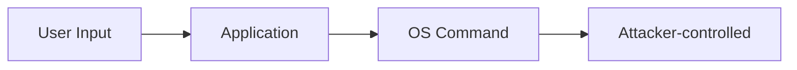

# Command Injection

## Overview

Command injection occurs when an attacker supplies data that is executed as an operating system command. It ranks #1 in the OWASP Top 10 (A03:2021 — Injection) and can lead to full system compromise.

## How It Works



```python
# VULNERABLE — directly interpolating user input
import os

def ping_host(host):
    # Attacker supplies: "8.8.8.8; cat /etc/passwd"
    return os.system(f"ping -c 3 {host}")

# Also vulnerable
filename = request.args.get('file')
os.system(f"ls {filename}")  # ; rm -rf /
```

## Shell Metacharacters

| Character | Effect | Example Payload |
-----------|--------|----------------|
| `;` | Command separator | `8.8.8.8; cat /etc/passwd` |
| `&&` | Chain on success | `8.8.8.8 && whoami` |
| `\|\|` | Chain on failure | `invalid \|\| whoami` |
| `$(...)` | Command substitution | `$(whoami)` |
| `` `...` `` | Command substitution | `` `whoami` `` |
| `>` | Redirect output | `> /tmp/evil` |
| `\n` | Newline as separator | `8.8.8.8\nwhoami` |

## Prevention

### Primary: Avoid Shell Execution

```python
# SAFE — use language libraries instead of shell commands
import subprocess

# Use list form (no shell involved)
subprocess.run(['ping', '-c', '3', host], check=True)

# If shell is truly needed, never interpolate raw input
subprocess.run(['ping', '-c', '3', sanitized_host], shell=False)
```

### Defense in Depth

| Layer | Control |
-------|---------|
| Input validation | Allowlist characters (alphanumeric + dots for IPs) |
| Parameterized execution | `subprocess` with list arguments, no `shell=True` |
| Least privilege | Run app as non-root, use containers, seccomp |
| Output encoding | Don't reflect command output back to users |
| WAF | Block common metacharacter patterns |

### Input Validation Example

```python
import re

def validate_ip(host):
    """Strict allowlist: only valid IPv4/IPv6."""
    ipv4 = r'^(\d{1,3}\.){3}\d{1,3}$'
    ipv6 = r'^([0-9a-fA-F]{0,4}:){2,7}[0-9a-fA-F]{0,4}$'
    if re.match(ipv4, host) or re.match(ipv6, host):
        return host
    raise ValueError('Invalid host')
```

## Remediation After Discovery

1. **Immediate**: Disable the vulnerable endpoint. Audit logs for exploitation.
2. **Fix**: Replace shell calls with safe APIs. Add input validation.
3. **Verify**: Add automated tests for injection payloads.
4. **Prevent**: Enable static analysis (Semgrep, CodeQL) to catch future injections.

## Interview Questions

**Q: Why is `subprocess.run` with `shell=False` safer?**
A: With `shell=False`, arguments are passed directly to `execve` — no shell interprets metacharacters. With `shell=True`, the command string goes through `/bin/sh`, where `;`, `|`, `&&`, and `$()` have special meaning.

**Q: What's the difference between command injection and code injection?**
A: Command injection executes OS commands via the shell. Code injection executes application-level code (e.g., eval injection, template injection). Both are critical but exploit different layers.

## References

- [OWASP — Command Injection](https://owasp.org/www-community/attacks/Command_Injection)
- [CWE-78: Improper Neutralization of Special Elements in OS Command](https://cwe.mitre.org/data/definitions/78.html)
- See also: [Web Security](./web-security.md), [Authentication](./authentication.md), [Interview Questions](./interview-questions.md)
