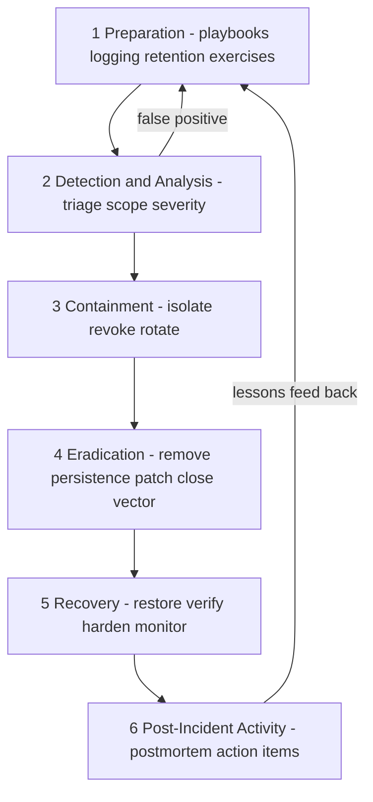

# Security Incident Response & Forensics

## Overview

Security incident response is the disciplined process of detecting, containing, eradicating, and learning from adversarial events — intrusions, credential theft, ransomware, data exfiltration. It shares command structure with operational incident response (see [Incident Response in Production Engineering](../production-engineering/incident-response.md) for severity frameworks, on-call mechanics, runbooks, and MTTR breakdowns), but differs in objective: an outage wants service restored, while a security incident wants the attacker evicted, the entry vector closed, and *evidence preserved* — restoration and evidence are in tension. NIST SP 800-61 formalizes the lifecycle; forensics (chain of custody, volatile-data acquisition, timeline reconstruction) is the discipline that makes the process legally defensible.

The interview setting is senior security and SRE-security hybrid roles, and the questions are scenario-shaped: "ransomware hits at 2 a.m. — what do you do in the first hour?" The strong answers are process answers (declare, command, preserve, contain in a defensible order with pre-agreed authority) rather than tool answers, and they cite numbers: token TTLs bounding revocation, notification clocks, dwell-time statistics. This page builds those answers on top of the ops-side fundamentals assumed from the production-engineering page.

## The NIST SP 800-61 Lifecycle

SP 800-61r2 ("Computer Security Incident Handling Guide") defines four phases: **Preparation**; **Detection and Analysis**; **Containment, Eradication, and Recovery**; and **Post-Incident Activity**, with lessons learned feeding back into preparation. The 2025 revision (SP 800-61r3) restructures the same lifecycle around the NIST Cybersecurity Framework 2.0 profiles, but the operational loop is unchanged.



Two properties distinguish the security loop from the ops loop. First, phases interleave rather than follow: containment decisions need forensic evidence that is most volatile early, so acquisition runs *during* containment, not after. Second, the loop is driven by an adaptive adversary — eradication fails silently if persistence mechanisms (a re-implanted backdoor, a forgotten scheduled task, a valid API key) survive, which is why the recovery phase includes elevated monitoring rather than an immediate return to normal.

When to declare is itself a preparation decision: declare on defined triggers (EDR high-confidence alert, leaked credential with any production scope, confirmed phishing entry, ransom note — the list is written in peacetime), not on a confidence judgment made alone at 3 a.m. Over-declaring costs a page and some good will; under-declaring costs the hours that matter most. The declaration criteria belong in the same document as the severity matrix and the containment authority matrix, and all three get revisited at every tabletop.

Preparation is where most of the real work lives, and where interviews probe maturity: logging coverage and retention targets, forensic tooling staged before it is needed (acquisition media, license keys, offline copies of Volatility/Sleuth Kit), out-of-band communication channels (assume the attacker reads your Slack if they are in your IdP), and current contact lists (legal, IR firm, cyber-insurance, regulator). An incident is the wrong time to discover your SIEM drops auth logs after 7 days.

### Logging Coverage and Retention

The detection and timeline work of the next incident is decided by what you log today. The minimum coverage set: authentication events (logins, MFA prompts, token issuance and refresh — IdP and app level), privileged actions (sudo, cloud IAM changes, database DDL), DNS and network flows from hosts and VPCs, endpoint process telemetry (EDR or eBPF-based — see [eBPF for Security](./ebpf-security.md)), and all administrative-plane audit logs (cloud control plane, source control, CI/CD, ticketing). Every source should ship off-host within minutes to append-only storage; a log that can be edited on the box that produced it is not evidence.

Retention targets worth stating numerically: 90 days searchable (hot) plus 12 months immutable (cold) as a general policy, with PCI DSS's requirement — 12 months retained, 3 months immediately available — as the regulated floor. Clock discipline belongs in the same breath: all hosts NTP-synced, everything stored in UTC with the source timezone recorded, because timeline reconstruction (below) silently fails otherwise. Coverage is auditable: pick three recent incidents, list the data you wish you had, and check whether today's pipeline collects it — that gap list *is* the preparation backlog.

### Forensic Readiness Checklist

Forensic readiness means the evidence side is prepared before any incident, because most acquisition mistakes are unrepeatable. The standing checklist: (1) golden images and acquisition media staged (write-blocked USB drives, clean evidence disks, encrypted); (2) tooling pre-licensed and offline-mirrored (Volatility, Sleuth Kit, Velociraptor — the IR firm's tools arrive slower than the evidence evaporates); (3) documented acquisition runbooks per platform (Linux memory via LiME, Windows via WinPmem, cloud disk snapshot-and-copy with hash recording); (4) named custody roles and an evidence-access log; (5) legal contacts and outside-counsel retainer confirmed, with the legal-hold procedure written down and testable. Organizations that skip this discover during SEV1 that the memory acquisition tool was never compatible with the production kernel.

## Severity Taxonomy for Security Incidents

Severity classification borrows SEV1-3 from ops (see the [production engineering page](../production-engineering/incident-response.md)), but the security version has a different axis: *adversary state* dominates user impact. Active exfiltration is SEV1 even if no user notices anything; a blocked, well-understood malware detection can be SEV3 despite antivirus drama. The response clock starts at first reliable indicator, and one question overrides everything: **are we currently losing data?**

| Sev | Definition (security-specific) | Response targets | Examples |
|---|---|---|---|
| SEV1 | Confirmed active compromise, exfiltration, or ransomware in flight | IC assigned <5 min; containment started <15 min; exec + legal notified <30 min; status/legal comms per counsel | Active data exfil, domain admin compromise, production ransomware |
| SEV2 | Confirmed compromise, contained or small blast radius; or strong indicators not yet confirmed | IC <15 min; investigation start <30 min; legal informed <1 h | Single host malware with C2, leaked API key with rotation complete, phishing campaign with 1+ successful credential entry |
| SEV3 | Indicators without compromise; policy violations; blocked attacks | Triage <4 h; batch review | Blocked brute force, commodity phishing with no clicks, vulnerability reports |

Security severity also changes *who* is in the room early: legal counsel and privacy (DPO) join at SEV1/SEV2 from the first hour, because notification clocks (GDPR's 72-hour regulator deadline, state breach statutes, PCI forensic investigator requirements) start running on facts discovered mid-investigation. Declaring SEV too low is the recurring failure — upgrading later costs nothing material, while downgrading after the fact looks like concealment in litigation.

### Upgrades, Downgrades, and the Declaration Problem

Severity in security incidents is a hypothesis, not a measurement: the initial declaration is made on partial indicators and revised as evidence arrives. The workable convention is **declare high, revise fast** — page at the severity the worst-case interpretation deserves, then downgrade explicitly with reasoning in the scribe log once triage rules the worst case out. The reverse (start low, upgrade) burns the most expensive resource an incident has: response time, because SEV3 staffing does not include the forensics and legal roles that cannot be added retroactively. Two mechanical rules help: severity is re-evaluated at every status-update interval (15-30 minutes for active incidents), and any downgrade of an incident with confirmed data access requires legal sign-off, because the notification calculus may already have started.

## Roles: Incident Command for Security Events

The command structure mirrors ops — **Incident Commander** (coordinates, decides, does not dig through hosts themselves), **Scribe** (timeline and decision log — in security incidents the scribe's log is later evidence and must record who did what, when, and on whose authority), **Comms Lead** — plus security-specific roles: **Forensics Lead** (acquisition and analysis, owns evidence integrity), **Legal/Privacy liaison** (privilege, notification obligations, law-enforcement interface), and an **executive sponsor** empowered to spend (IR firm retainer, insurance). Dual ICs (ops IC restoring service, security IC running the investigation) is a common and workable pattern in hybrid outages-as-breaches.

Three security-specific command rules. First, **assume compromise of normal comms**: move to a pre-agreed out-of-band channel early for SEV1, because the adversary may be watching incident channels. Second, **legal hold at declaration, not at conclusion**: once litigation or regulation is plausible, routine deletion (log rotation, email retention, chat retention) must be suspended immediately — this is an IC-legal joint decision and it is why the Scribe's records matter. Third, **one decision-maker for containment trade-offs** (see next section), because containment versus availability is a business decision that engineering cannot make unilaterally.

A fourth rule unique to security: know when to bring in external help, and pre-contract it. Retained IR firms (and, for ransomware, specialized negotiators) bring malware samples, threat-actor knowledge, and scale; cyber-insurance often *requires* using their panel firm, so the policy documents should be findable in minutes. Law-enforcement referral (FBI/NCA/national CERT) is a legal-and-executive decision, not an engineering one — report early where regulated (some sectors require it), and expect coordination overhead on any action that would tip off or disrupt a shared investigation. The preparation-phase contact list exists precisely so that these decisions at 3 a.m. are phone calls, not procurement.

## Containment Strategies vs Business Continuity

Containment has one goal — stop the bleeding — and three lever families, each with a different blast radius on the business:

1. **Isolate**: network-quarantine hosts (EDR network containment, VLAN moves, security-group edits), disable accounts, sinkhole domains, block C2 IPs at the edge. Isolation is reversible and evidence-preserving, which is why EDR network-containment is preferred over host wipe-and-reimage as the first move.
2. **Revoke**: kill sessions and tokens — IdP session revocation, OAuth refresh-token invalidation, SAML certificate rollover, VPN cert suspension. Revocation propagation time is bounded by token TTL and cache TTL (see [Zero Trust Architecture](./zero-trust-architecture.md)); with 15-minute tokens the attacker loses access within minutes even without perfect revocation.
3. **Rotate**: replace credentials and material — API keys, service-account passwords, SSH host keys, TLS/CA material, and any secret the attacker could have read ([Credential Rotation](./advanced/credential-rotation.md) covers the overlap-window math; [Secrets Management](./secrets-management.md) covers the vault mechanics).

The central tension: the fastest containment (shut down the payment service, kill the domain admin account, unplug the VPN) may cause an outage bigger than the breach. The framework for deciding: **blast radius of action vs blast radius of inaction, weighted by what is actively being lost**. If exfiltration is in flight (large, active transfers), aggressive containment wins even at severe availability cost — data once gone cannot be recovered, while revenue lost in an hour can. If the threat is dormant persistence, surgical isolation plus continued monitoring often beats a disruptive sweep that tips off the adversary before their infrastructure is mapped. This decision belongs to the IC with the executive sponsor, and it should be pre-debated in tabletop exercises, not improvised at 3 a.m.

### Pre-Approved Containment Authority

The fix for 3 a.m. indecision is a pre-authorization matrix agreed in peacetime: for each containment action, who can order it, under what evidence threshold, and with what notification duty afterwards. Examples that survive tabletop scrutiny: "on-call engineer may network-contain any single endpoint on EDR high-confidence alert"; "security IC may disable any single non-executive account"; "shutdown of a revenue-serving service requires exec sponsor + IC jointly". Without this matrix, SEV1 containment stalls in approval chains — or, worse, an individual engineer takes a company-level action alone and the organization later has no record of who decided what. The matrix is a living document: every tabletop and real incident revisits whether the thresholds matched reality.

Preservation cuts against every instinct trained by ops: **wipe-and-reimage destroys evidence**. Before reimaging, acquire memory and disk (next section); the trade-off between fast restoration and evidence integrity is another explicit IC decision, and the default should be "acquire first — memory in minutes, disk images in hours — then restore".

## Eradication and Recovery

Eradication removes the adversary and everything they installed: patch or remove the initial-access vector, sweep every host for the specific indicators (persistence scheduled tasks, rogue SSH keys, new IdP federation settings, unfamiliar OAuth grants — attackers love OAuth grants because users approve them without ceremony), and reset every credential the attacker could possibly have touched. The fleet-wide sweep matters because single-host eradication is theater: if the initial access was a stolen credential, the attacker's *other* sessions matter more than the one host you cleaned. Eradication ends with a verification pass — re-scan, re-hunt, and only then declare the environment clean.

Recovery restores service in a controlled order: production data paths first, from backups or rebuilt hosts proven pre-dating the compromise, with integrity verification (restore-time checksums, database consistency checks) before anything serves traffic. The recovery window then runs elevated monitoring for 30-90 days specifically for the attacker's indicators and TTPs, because re-intrusion attempts through a missed persistence mechanism typically appear within days. The trap to name out loud: green dashboards are not evidence of eviction — an attacker with a dormant beacon shows perfect availability metrics, which is why the return-to-trusted decision is a security judgment, not a metrics judgment.

### Return-to-Trusted Criteria

Define the exit conditions before the incident, in the same spirit as the containment authority matrix: no unresolved indicators on any host for N days (30 is a common floor), all credentials in the compromised scope rotated and their rotation verified, entry vector closed and regression-tested, elevated monitoring active with named owners, and regulator/customer notifications dispatched per legal's checklist. Writing these down converts the "when do we stand down?" argument — which otherwise drags on for days — into a checklist review. The stand-down decision itself belongs to the IC with the executive sponsor, and the elevated-monitoring window outlives the incident channel: monitoring action items are tracked in the postmortem, not in someone's memory.

## Forensics Fundamentals

**Chain of custody** is the documented record of who collected, transferred, analyzed, and stored each piece of evidence, with hashes proving the artifact did not change. Its legal function is authenticity: an acquisition whose hash was never recorded can be challenged as tampered. RFC 3227 ("Guidelines for Evidence Collection and Archiving") is the canonical short reference — collect in **order of volatility**, record hashes at acquisition, and store originals read-only with work done on verified copies.

| Priority | Data | Volatility rationale | Example method |
|---|---|---|---|
| 1 | CPU registers, CPU cache | Gone on context switch or power-off | Kernel debugger (rare) |
| 2 | RAM / memory image | Gone on power-off; overwritten continuously | LiME / WinPmem acquisition |
| 3 | Network state, process tables, connections | Ephemeral, minutes-scale | `ss -tunap`, EDR live response |
| 4 | Temporary file systems, swap | Overwritten on use | Collect before disk image |
| 5 | Disk / SSD image | Stable while powered | `dd`/`dc3dd`, write blocker, E01 format |
| 6 | Remote and archival logs | Stable but retention-limited | SIEM export, WORM storage |

Memory-before-disk is the rule that surprises ops folks: RAM holds the decryption keys, injected code, and live network state that never touch the disk, and pulling the power destroys it. A typical acquisition sequence on a compromised Linux host:

```bash
# 1. Memory first (order of volatility) — write to attached evidence media
insmod lime.ko "path=/mnt/evidence/host42.mem.lime format=lime"
# 2. Disk image with error recovery, then hash both originals
dc3dd if=/dev/nvme0n1 of=/mnt/evidence/host42.img hash=sha256 log=host42.acq.log
sha256sum /mnt/evidence/host42.img | tee -a /mnt/evidence/host42.acq.log
# 3. Analyze copies only — never the original
volatility3 -f host42.mem.lime windows.pslist   # process list
volatility3 -f host42.mem.lime windows.malfind  # injected code detection
```

**Log integrity** is the difference between logs as evidence and logs as an attacker's editing playground: ship logs off-host in near-real-time to append-only storage (SIEM with WORM/immutability, hash-chained entries), because an intruder with root will clear local logs first. Retention must be pre-sized — PCI DSS requires 12 months of audit-log history with at least the most recent 3 months immediately available; a reasonable general policy is 90 days hot (searchable) plus 1 year cold (immutable). **Clock skew** is the silent killer of timeline work: hosts drift by minutes-to-hours without NTP, and correlating "did the attacker's login precede or follow the malware execution?" across skewed sources produces wrong conclusions. At acquisition, record each source's offset (NTP status, `date` vs reference clock); during analysis, normalize everything to UTC and correct per-source offsets before correlating. Even with NTP, expect tens-of-milliseconds variance — sequence events with sub-second gaps cautiously.

### Windows and Linux Forensic Artifacts

Beyond the memory/disk image, persistent artifacts answer the questions the image alone cannot. On Windows: the `$MFT` (full file-system history including deleted files), registry hives `SYSTEM`/`SOFTWARE`/`SAM` (persistence via Run keys and services), `SRUM` (resource-usage history), prefetch files (program execution), and event logs `Security.evtx` (4624/4625 logons, 4672 admin logons, 4720 account creation). On Linux: `/var/log/auth.log` or `/var/log/secure` (SSH logins, sudo), shell histories (`~/.bash_history`, often tampered), cron and systemd unit files (persistence), `/etc/passwd` and `authorized_keys` changes (backdoor accounts), and journal binary logs. Cloud estates add the control-plane audit logs (AWS CloudTrail, GCP Audit Logs) — in modern intrusions the most decisive source, because attacker IAM changes and API calls are recorded there regardless of endpoint hygiene. The discipline is to collect the *set*, not cherry-pick: a logon event with no corresponding process telemetry, or a modified cron file with no login around it, is exactly the cross-source inconsistency that localization of the intrusion depends on.

### Evidence Storage and Access Control

Collected evidence needs custody infrastructure on day one: an encrypted, access-controlled evidence store where every read and copy is logged, originals mounted read-only, and analysis performed on verified working copies (verify by hash at every copy). Access is least-privilege by role — analysts get copies, the custodian holds originals, and custody transfers are signed events, which is what makes the chain-of-custody record continuous rather than a single acquisition-time hash. The store also enforces retention and destruction: evidence tied to active litigation stays under legal hold, the rest ages out on the documented schedule, and destruction is itself logged with witnesses. Skipping this layer quietly converts strong acquisitions into weak evidence — the common failure is a shared drive where anyone with the link can modify the "original".

## Timeline Reconstruction

Reconstruction answers: initial access, dwell time, actions on objectives, and current attacker state. Sources are stitched cross-layer — EDR process telemetry (which process spawned which), auth logs (logins, MFA, token issuance), network flow logs (beaconing, exfil volumes), cloud audit logs (API calls, IAM changes), and the scribe's own incident log. Each event is mapped to **MITRE ATT&CK** technique IDs (T1078 Valid Accounts, T1059 Command and Scripting Interpreter, T1567 Exfiltration Over Web Service) to keep the narrative precise and to query for sibling activity ("what else did this credential touch?").

The deliverables are: a **UTC-normalized timeline** with per-source offset corrections applied; an initial-access determination (phishing, stolen key, exposed service, supply chain — the xz-utils 2024 backdoor in [Supply Chain Security](./supply-chain-security.md) shows how long a patient intrusion can hide); a **dwell-time calculation** (initial compromise to detection); and an attacker-state checklist (persistence mechanisms, credentials assumed compromised, data confirmed exfiltrated). Every gap in the timeline is itself a finding: an unlogged hour is a logging-coverage gap to fix in the postmortem, and "we cannot determine whether X was accessed" is the answer that drives regulatory caution (US state laws and GDPR treat inability-to-rule-out as reportable risk).

## Worked Example: Reconstructing a Compromise

A condensed reconstruction from a realistic SEV2 (stolen CI credential), showing the shape of the artifact. All times UTC, per-source offsets already applied:

```text
2024-11-03 04:12  AUTH   github.com: PAT "deploy-bot" used from ASN 14061 (DigitalOcean)
                         -- anomaly: never used outside corporate ASNs  [first reliable indicator]
2024-11-03 04:14  AUTH   github.com: private repo "payments-svc" cloned via PAT
2024-11-03 04:31  CLOUD  aws: AssumeRole ci-deploy-role from new IP; no MFA context
2024-11-03 04:33  CLOUD  aws: secretsmanager:GetSecretValue payments/prod/db
                         -- pivot: CI role over-scoped to read prod secrets  [control gap]
2024-11-03 04:40  FLOW   prod-db egress to 185.x.x.x:443 begins (~2.1 GB over 40 min)
                         -- likely actions on objectives; IAM revocation ordered
2024-11-03 04:41  IR     SEV2 declared; IC assigned; legal hold issued; scribe opens log
2024-11-03 04:47  IR     containment: PAT revoked, ci-deploy-role policies tightened,
                         AWS session revocation via policy + credential rotation begun
2024-11-03 05:05  IR     egress stops; hunt over 30-day history: no earlier PAT misuse found
2024-11-03 09:30  IR     timeline review: initial access = leaked PAT in public repo fork (Nov 01)
                         -- dwell time ~2.5 days; MTTC ~35 min; detection was automated
```

Three lessons the artifact teaches. First, the timeline is built from *cross-source* correlation — auth, cloud audit, and flow logs each carry one link of the chain, and no single source tells the story. Second, the control gap surfaced (a CI role able to read production secrets) is a threat-model finding as much as an IR one; it feeds back to [Threat Modeling](./threat-modeling.md) and to the least-privilege review in the postmortem. Third, the metrics fall out naturally once the timeline exists: MTTD was under 2 minutes (first attacker action 04:12 to the ASN-anomaly alert, because a detection rule — not a human — was watching), MTTC about 35 minutes (04:12 to containment complete at 04:47), and dwell roughly 2.5 days (Nov 01 leak to Nov 03 detection) — each with a named improvement lever for the postmortem action list.

## Metrics: MTTD and MTTR for Security

Ops metrics (MTTA, MTTR breakdowns) carry over with security-specific definitions. **MTTD** (detection): adversary start to first reliable indicator. **MTTC** (containment): indicator to containment complete. **MTTR** (recovery): indicator to normal trusted operation. And the industry's favorite: **dwell time** (compromise to detection), reported by Mandiant M-Trends — global median dwell time has fallen from months (206 days in 2011-era investigations) to roughly 10 days in the 2024 report, though ransomware skews it low while patient espionage skews it high. IBM's Cost of a Data Breach 2024 report puts the mean time to identify a breach at ~194 days plus ~64 days to contain — roughly 8.5 months total — with a global average cost of $4.88M, numbers worth citing to justify detection investment.

| Metric | Security definition | Realistic target | Primary lever |
|---|---|---|---|
| MTTD | Compromise → first reliable indicator | Hours, not days (ransomware); days for stealthy intrusions | Detection engineering: Sigma rules, EDR analytics, canary tokens |
| MTTC | Indicator → containment complete | <1 h SEV1, <8 h SEV2 | Runbooks, pre-approved containment authority, EDR network containment |
| MTTR | Indicator → trusted normal ops | <24 h SEV1 | Reimage automation, rotation automation, elevated-monitoring criteria |
| Dwell time | Compromise → detection | Trending down quarter-over-quarter | Threat hunting over historical telemetry |
| Actions closed | Postmortem items completed | >90% within one quarter | Leadership tracking (see below) |

Detection engineering deserves its own note: high-value MTTD improvements come from hypothesis-driven content (Sigma rules for the ATT&CK techniques your tabletops rehearse), canary credentials (a fake `aws` config that no legitimate process should touch — any hit is a signal, near-zero false positives), and eBPF-based syscall/process telemetry (see [eBPF for Security](./ebpf-security.md)) for hosts without a full EDR. The metrics to distrust: raw alert counts (reward noise) and MTTD measured only from *detected* incidents (selection bias — the incidents you never detected have unbounded dwell time, which is exactly what threat hunting exists to probe).

### Making the Numbers Comparable

Security metrics are only useful if defined precisely enough to trend: MTTD starts at first *attacker action* (which timeline reconstruction recovers after the fact) and ends at first *reliable* indicator — not first alert, since alert storms precede the signal more often than not. MTTC ends when the adversary's access is gone (revocations verified, not just ordered), and MTTR ends at return-to-trusted, per the criteria above, not when dashboards go green. Publish the definitions next to the numbers; an MTTD that quietly shifts definition between quarters is worse than none, because leadership decisions made on it inherit the inconsistency. The honest composite to trend is containment-time distribution (p50/p95, not just mean) — one 3-week outlier dwarfs ten fast containments, and means hide exactly the incidents that teach the most.

## Blameless Postmortems, Security Edition

The blameless doctrine from [production engineering](../production-engineering/incident-response.md) carries over — the postmortem asks how the system allowed the event, not who clicked the link — with three security-specific modifications. First, **legal privilege**: breach reviews may be discoverable in litigation, so run them at the direction of counsel and mark accordingly where the jurisdiction supports it; decide this at SEV1 declaration, because you cannot un-share a candid document. Second, **adversary confidentiality**: postmortems are written knowing re-attack is likely, so they may omit indicators the attacker would recognize as detected (a public postmortem that reveals "we caught you via canary token X" burns the sensor) — split into an internal candid version and a sanitised external/regulator version. Third, **control-coverage review**: beyond process gaps, verify the *threat model* — every entry point used by the attacker should already exist in the [threat model](./threat-modeling.md), and one that does not is a modeling failure to fix, not just a patch to ship.

The 72-hour GDPR clock (Art. 33: notify the supervisory authority of personal-data breaches without undue delay and where feasible within 72 hours of awareness) interacts directly with postmortem timing: notification drafts must be ready before the full analysis is, which is why the timeline-reconstruction section above emphasizes fast, defensible facts over complete root cause. Post-incident action items follow the standard template — owner, priority, due date — with security's additions: logging-coverage gaps, rotation-scope gaps, and containment-authority pre-approvals.

### Review Meeting Mechanics

The review itself is scheduled within 48-72 hours (the production-engineering template applies as-is), chaired by someone not on-call for the incident, with the IC, forensics lead, scribe, legal, and the affected service owners present. The facilitator walks the UTC timeline first — facts before analysis, to stop the room from relitigating decisions before the shared record is established — then runs contributing-factor analysis (not a single "root cause": the leaked PAT, the over-scoped CI role, and the silent backup failures are three independent contributors that all needed fixing). Action items leave the meeting with owners and due dates, are tracked to >90% closure per quarter, and the closure rate itself is a board-visible metric — postmortems whose actions rot are compliance theater with extra steps.

## Table-Top Exercises and Communications

**Table-top exercises** rehearse the command structure without touching production: a facilitator injects scenario updates ("EDR fires on the CFO's laptop; memory acquisition shows credential dumping"), role players respond using their real runbooks, and gaps become action items. High-performing cadence: quarterly for the IC/forensics team, twice-yearly for executives (the ransom-payment and disclosure decisions), annually org-wide for phishing+ransomware. Security differs from chaos engineering (see [chaos/resilience](../production-engineering/advanced/chaos-resilience.md)): chaos tests *systems*, table-tops test *decisions and information flow* — the classic failures found are authority gaps ("nobody could authorize a $1M ransom decision") and evidence-vs-continuity conflicts nobody had pre-decided.

### A Tabletop Scenario, Scripted

A runnable two-hour ransomware tabletop, for concreteness: (1) inject — "file servers show encrypted extensions; a ransom note demands $2M in 48 hours"; observe who declares what severity and who pages whom; (2) inject — "backup jobs for the last 3 weeks failed silently"; the expected discovery is that restore-point planning shifts from IT to IC; (3) inject — "the threat actor emails a journalist claiming 40 GB of customer data"; this forces the comms/legal track with a 1-hour clock; (4) inject — "the encryptor is still executing on 12 hosts"; the expected action is invoking the pre-approved containment authority, not a fresh debate. Debrief against the checklist: who had authority, what evidence was lost, which notifications were late, and which of those failures becomes a written action item. A tabletop that produces no changes to the authority matrix or the comms templates was a theater performance, not an exercise.

**Communications** run on four tracks, each with distinct audiences and constraints: the **status page** for user-visible service impact (kept factual — "some customers may see errors" — and never pre-empting investigation conclusions); **customer breach notification** where personal data is involved (regulated wording, usually through counsel); **regulator notification** (GDPR 72 h, sector rules like PCI's PFI engagement); and **internal comms** with explicit "do not discuss outside the incident channel" hygiene for SEV1/SEV2. **Legal hold** suspends routine deletion across logs, email, chat, and tickets from the moment it is issued — the IC should trigger it reflexively at SEV1, because preserving too much is harmless and preserving too little is spoliation. Pre-drafted templates for all four tracks are preparation-phase deliverables; writing a breach notice from scratch during a SEV1 is how tone-deaf public statements happen.

### The First Customer-Facing Statement

The first statement is written under maximum uncertainty, so its template constrains rather than informs: what happened in one factual sentence, what customers should do (rotate passwords, watch for phishing — attackers piggyback on breach news within hours), what you are doing, and when the next update comes (commit to a timestamp and keep it). Never speculate on cause, attacker identity, or data volume in the first statement — every word is later quoted back in litigation and press coverage, and walk-backs cost more credibility than the delay did. Status-page updates during a security incident differ from ops outages in one way: ops updates converge on "fixed", while security updates may legitimately say "investigation continuing" for weeks — the cadence commitment is what keeps that honest.

## Interview Questions

1. **Walk me through the NIST 800-61 lifecycle and where it diverges from ops incident response.** Four phases: preparation, detection and analysis, containment/eradication/recovery, post-incident activity, with lessons feeding back. The divergence is the adversary: containment decisions must preserve volatile evidence (memory before reimage), eradication must clear persistence or the attacker returns, and recovery includes elevated monitoring. Ops optimizes restoration time; security IR optimizes eviction-plus-evidence, and the two goals are explicitly traded off by the IC.

2. **A SEV1 is declared — active exfiltration. What are your first five actions?** Declare and page the security IC, assign the scribe, notify legal (notification clocks and legal hold start now), move comms out-of-band, and start containment with evidence preservation: EDR network-contain affected hosts, acquire memory, then revoke sessions and rotate the credentials the attacker demonstrably held. The order matters — evidence before reimage, containment before eradication, legal before public comms. Business continuity trade-offs (shutting the affected service) go to the IC with the executive sponsor.

3. **Why acquire memory before disk imaging?** RAM holds injected code, C2 configuration, and full-disk-encryption keys that never touch storage, and it is destroyed by power-off — so it is the most volatile and most per-incident-unique data. Disk images are stable and can be collected after memory with a write blocker and hash logging. Analysis then runs on copies only (Volatility's pslist/malfind over the memory capture), preserving the originals' chain of custody for legal proceedings.

4. **How do you handle containment when it would take down production?** Frame it as blast-radius-of-action versus blast-radius-of-inaction, weighted by what is actively being lost: in-flight exfiltration justifies severe availability cost because stolen data is unrecoverable, while dormant persistence favors surgical isolation plus monitoring until the adversary's footprint is mapped. The decision is the IC's with the executive sponsor — not the on-call engineer's — and the right time to argue the defaults is in quarterly table-tops, not mid-incident.

5. **What makes a security postmortem different from an ops postmortem?** Same blameless doctrine and action-item discipline, plus three things: run the review at the direction of counsel for privilege, keep two versions because revealing detection methods (canary tokens, specific detections) invites re-attack, and reconcile the incident against the threat model — an attacker path absent from the model is a modeling failure. Notification timelines also invert the usual order: regulator-facing facts (what data, whose, when) must be drafted within 72 hours, long before root cause is final.

6. **How do you measure whether incident response is actually improving?** Track MTTD, MTTC, and MTTR separately with security definitions, dwell time quarter-over-quarter, and postmortem action-item closure rate (>90% per quarter is the credibility bar). Distrust raw alert counts (rewards noise) and MTTD computed only over detected incidents (survivorship bias). The honest probe of undetected compromise is hypothesis-driven threat hunting over retained telemetry — if hunts keep finding nothing, either security is excellent or logging coverage is the gap, and coverage audits tell you which.

## Key Takeaways

- NIST SP 800-61's four-phase loop (prepare → detect → contain/eradicate/recover → learn) is driven by an adaptive adversary: phases interleave, and eradication without persistence-hunting fails silently.
- Security severity is axis-shifted from ops: active exfiltration is SEV1 even with zero user-visible impact; legal and privacy join within the first hour because notification clocks start on discovery.
- Containment levers are isolate, revoke, rotate; the isolate-vs-reimage decision preserves or destroys evidence — acquire memory first, always.
- Forensics discipline: chain of custody with acquisition hashes, order of volatility (RFC 3227), analysis on copies only, off-host append-only log shipping, retention ≥12 months for regulated data, per-source clock offsets recorded and corrected to UTC.
- Timeline reconstruction normalizes sources to UTC, maps actions to MITRE ATT&CK IDs, and treats timeline gaps as logging-coverage findings.
- MTTD/MTTC/MTTR plus dwell time are the honest metrics (industry dwell ~10 days median, breach identification ~194 days mean); alert volume is a vanity metric.
- Blameless postmortems with security deltas: legal privilege, sanitised external versions, threat-model reconciliation; table-tops rehearse decisions and authority, which chaos engineering does not.
- Evidence infrastructure (custody roles, read-only originals, logged access, retention schedule) is prepared in peacetime — an acquisition without custody infrastructure is an anecdote, not evidence.

## References

- [NIST SP 800-61r2: Computer Security Incident Handling Guide](https://nvlpubs.nist.gov/nistpubs/SpecialPublications/NIST.SP.800-61r2.pdf)
- [NIST SP 800-88r1: Guidelines for Media Sanitization (secure disposal of evidence and restored media)](https://nvlpubs.nist.gov/nistpubs/SpecialPublications/NIST.SP.800-88r1.pdf)
- NIST SP 800-61r3 (2025) — Incident Response Recommendations and Considerations for Cybersecurity Risk Management (cite by title/venue).
- [RFC 3227: Guidelines for Evidence Collection and Archiving](https://www.rfc-editor.org/rfc/rfc3227)
- [RFC 2350: Expectations for Computer Security Incident Response](https://www.rfc-editor.org/rfc/rfc2350)
- [MITRE ATT&CK knowledge base](https://attack.mitre.org/)
- [Volatility Framework (memory forensics)](https://github.com/volatilityfoundation/volatility)
- [The Sleuth Kit (disk forensics)](https://www.sleuthkit.org/)
- [Sigma — generic signature format for SIEM detections](https://github.com/SigmaHQ/sigma)
- Google SRE Book — "Postmortem Culture" (blameless review doctrine): https://sre.google/sre-book/postmortem-culture/
- [PagerDuty Incident Response Documentation (roles, severity, on-call)](https://response.pagerduty.com/)
- IBM — *Cost of a Data Breach Report 2024* (cite by title/year; no stable URL).
- Mandiant — *M-Trends 2024* (dwell-time statistics; cite by title/year).

## Cross-References

- [Incident Response (Production Engineering)](../production-engineering/incident-response.md) — the ops-side twin: severity frameworks, on-call rotations, runbooks, MTTR decomposition, and the blameless postmortem template.
- [Threat Modeling](./threat-modeling.md) — preparation-phase input: threats and mitigations to reconcile incidents against.
- [Credential Rotation](./advanced/credential-rotation.md) — rotation windows and revocation mechanics used in containment.
- [Secrets Management](./secrets-management.md) — vault revocation and dynamic-credential procedures for the rotate lever.
- [eBPF for Security](./ebpf-security.md) — syscall/process telemetry that improves MTTD and feeds timeline reconstruction.
- [Supply Chain Security](./supply-chain-security.md) — real-world incidents (SolarWinds, xz-utils) with long dwell times and build-pipeline initial access.
