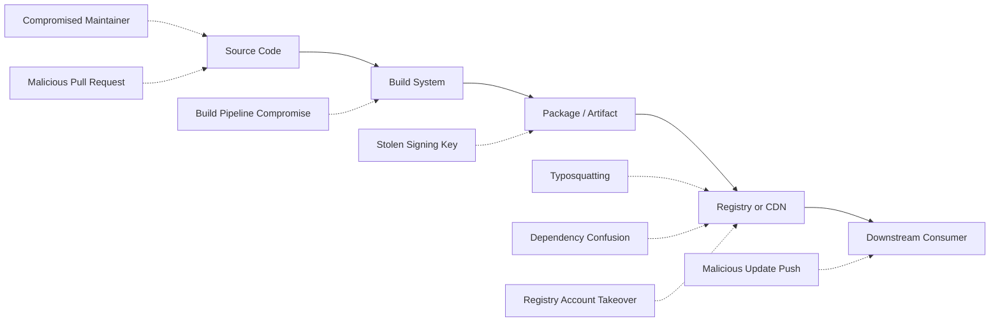
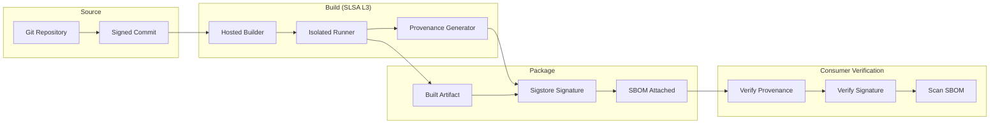
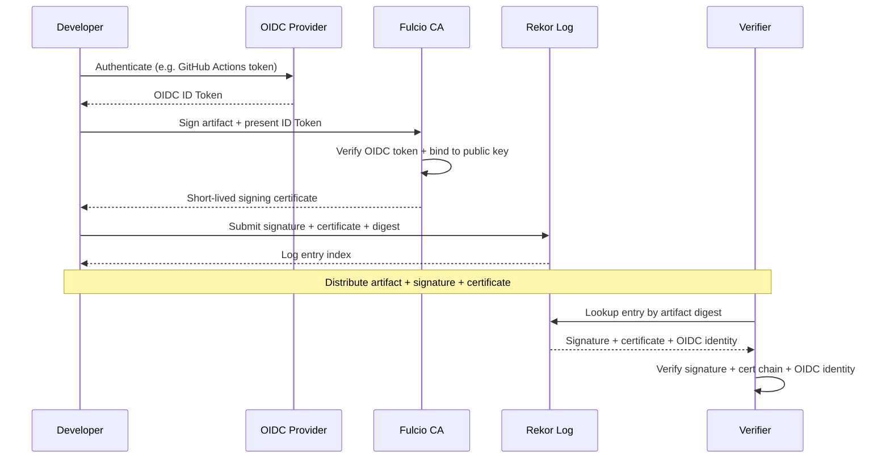

# Software Supply Chain Security

## Overview

Software supply chain attacks target the dependencies, build pipelines, and distribution mechanisms of software rather than the application code itself. The modern application is assembled, not written: a typical service pulls hundreds of transitive dependencies, is built on a hosted CI runner, packaged into an OCI image, signed by a pipeline identity, and pushed to a registry before a single downstream user pulls it. Every link in that chain is an attack surface.

The SolarWinds breach (2020) demonstrated that compromising the build process can silently backdoor thousands of downstream organizations, including US federal agencies. Log4Shell (2021) showed that a single vulnerable dependency in a logging library can break the internet overnight. The `xz-utils` backdoor (2024) proved that even a determined single actor can patiently subvert a widely used open-source project over years. Supply chain security is the discipline of making every step of that pipeline **verifiable**, **tamper-evident**, and **reproducible**.

This chapter covers the threat model, the SLSA framework, SBOMs, code signing, in-toto attestations, OpenSSF Scorecard, dependency pinning, reproducible builds, and build-environment hardening. It draws on the SLSA specification (slsa.dev), NIST SP 800-218 (Secure Software Development Framework), the CNCF Software Supply Chain Best Practices whitepaper, OpenSSF Scorecard documentation, the in-toto specification, Sigstore/Cosign documentation, the CycloneDX and SPDX specifications, and *Software Supply Chain Security* by Cassidy Bitumens.

## Threat Model

The supply chain threat model spans five asset classes: source code, dependencies, the build system, the artifact store, and the distribution channel. An attacker aims to inject malicious code (or a vulnerable version) anywhere along the chain such that downstream consumers execute it without detecting the substitution.



### Attack Taxonomy

| Attack Class | Mechanism | Real-World Example |
|--------------|-----------|--------------------|
| **Compromised build system** | Attacker tampers with CI runner, build script, or compiler to inject code absent from source | SolarWinds SUNBURST (2020) |
| **Malicious dependency** | Maintainer (or attacker who stole their credentials) publishes a hostile version of a library | `event-stream` (2018), `ua-parser-js` (2021) |
| **Typosquatting** | Attacker publishes a package whose name closely resembles a popular one (`lod-ash` vs `lodash`) | Hundreds of npm/PyPI typosquats removed yearly |
| **Dependency confusion** | Attacker registers a public package whose name matches a victim's private package; resolver picks the public one | Alex Birsan disclosure (2021) |
| **Build pipeline compromise** | Stolen CI secrets, poisoned third-party action, or compromised runner image injects backdoor | Codecov bash uploader (2021) |
| **Stolen signing keys** | Attacker obtains the project's code-signing key and ships artifacts that pass signature verification | NPM 2021 access-token incident; Stuxnet-era forged certs |
| **Account takeover** | Phished or leaked maintainer credentials used to push a malicious release | `coa`, `rc` npm packages (2021) |
| **Protestware** | Maintainer intentionally ships a destructive update to make a political point | `node-ipc` (2022) |
| **Compiler/toolchain backdoor** | Build tool itself backdoors output binaries (trusting trust) | `xz-utils` liblzma backdoor (2024) |

A useful mental model: the attacker is **indifferent to where** in the chain they inject, as long as the malicious code reaches the consumer and the consumer cannot easily detect it. Defenses therefore must cover **every** link, not just source code review.

## Real-World Incidents

### SolarWinds Orion (2020)

Attackers compromised the SolarWinds build pipeline and injected the SUNBURST backdoor into the Orion network-monitoring product's update mechanism. Approximately 18,000 organizations received the trojanized update, including multiple US federal agencies. The attackers reportedly inserted the malicious code during the build process — not in the source repository — so source-level review would not have caught it. The incident directly motivated the SLSA framework and US Executive Order 14028, which mandates SBOMs and secure-software practices for federal suppliers.

### Codecov Bash Uploader (2021)

Codecov's `bashUploader` script, used by thousands of CI pipelines to upload coverage data, was modified by an attacker who exploited a misconfigured Docker image and leaked an environment variable containing a token granting write access to the script. The modified script exfiltrated CI environment variables (including cloud credentials) from every pipeline that ran it. Lesson: any script fetched at build time from a third party is part of your supply chain.

### Log4Shell (Log4j CVE-2021-44228, 2021)

A JNDI lookup feature in the widely used `log4j` Java logging library allowed remote code execution via crafted `${jndi:ldap://...}` strings in any logged input. The vulnerability affected a huge fraction of Java applications worldwide because `log4j` is transitively pulled into nearly every Java service. Lesson: a vulnerability in a popular dependency is effectively a vulnerability in everything that depends on it, and most teams cannot quickly enumerate where the dependency even lives — hence the push for SBOMs.

### Dependency Confusion (2021)

In 2021 Alex Birsan disclosed that many companies' internal package resolution rules preferred public registries (npm, PyPI) over private ones for packages whose names matched. By registering public packages with the same names as internal ones (`company-utils`, `company-react-components`), he was able to execute arbitrary code inside the builds of dozens of major companies including Apple and Microsoft. Mitigation: always scope internal package names (e.g. `@company/...`), pin exact versions, and configure the package manager to fail closed on name collisions.

### node-ipc Protestware (2022)

The maintainer of the `node-ipc` npm package published a version that, when installed on machines with Russian or Belarusian IP addresses, attempted to delete the user's files. While politically motivated rather than financially motivated, the incident reinforced that any dependency can change behavior between versions and that pinning + lockfiles are essential.

### xz-utils Backdoor (2024)

Over several years, a single actor (`Jia Tan`) gained maintainer status on the `xz-utils` project and ultimately shipped a backdoor in liblzma that targeted OpenSSH's sshd via the systemd notification path. The backdoor was caught almost by accident before widespread deployment. It is the canonical example of a slow-burn social-engineering supply-chain attack against a critical piece of open-source infrastructure, and demonstrates why provenance, reproducible builds, and maintainer-account integrity matter.

## SLSA (Supply-chain Levels for Software Artifacts)

SLSA (`slsa.dev`) is a graduated framework that defines integrity levels for software artifacts based on how trustworthy their build process is. Each level adds requirements on **provenance** (machine-readable metadata describing how the artifact was built), **isolation** of the build platform, and **non-falsifiability** of the provenance.

### SLSA Levels

| Level | Build Provenance | Build Platform | What It Guarantees |
|-------|------------------|----------------|---------------------|
| **L1** | Documented build process exists | Any | Provenance is generated, but anyone could have written it |
| **L2** | Signed, hosted-build provenance | Hosted build platform (e.g. GitHub Actions, Cloud Build) | Provenance was generated by the hosted platform, not the developer |
| **L3** | Hardened, isolated build platform | Hardened platform with non-falsifiable provenance | Provenance cannot be forged even by the project owner |
| **L4** | Hermetic, reproducible, two-party reviewed | Hermetic builds + reproducible + two-person build override | Artifact is bitwise-identical across two independent builds; source was reviewed by two trusted persons |

L1 is essentially a documentation requirement. L2 is achievable today by most hosted CI systems that support provenance generation (GitHub Actions, Cloud Build). L3 requires a hardened build platform where the project owner cannot tamper with the provenance — typically achieved via hosted builders with audited isolation (e.g. GitHub-hosted runners with provenance, or Sigstore's `vault-falcon`). L4 is the aspirational gold standard and is rarely achieved in industry today outside of reproducible-build projects like Debian.

### Build Provenance Flow

Provenance is the central concept. A provenance attestation is a signed statement of the form: *"Artifact X with digest Y was built from source commit Z by builder B, on platform P, with build parameters Q."* Consumers verify the signature, the builder identity, and the source identity before trusting the artifact.



Consumers can configure policy: "Only accept artifacts whose provenance is signed by builder X, sourced from repository Y, on branch Z, with an SBOM that has no critical CVEs." Tools like `cosign verify-attestation` and Sigstore's policy controller implement this.

## SBOM (Software Bill of Materials)

An SBOM is a machine-readable inventory of every component in a software artifact, including transitive dependencies, their versions, and their suppliers. US Executive Order 14028 requires SBOMs for software sold to the federal government; NIST SP 800-218 (SSDF) recommends generating SBOMs as part of a mature secure development lifecycle.

### What's in an SBOM

- **Component name** and **version** (e.g. `express@4.18.2`)
- **Package URL (purl)** — a uniform identifier (`pkg:npm/express@4.18.2`)
- **Supplier / author** (e.g. the maintainer or organization)
- **License** (e.g. MIT, Apache-2.0)
- **Cryptographic hash** of the component (when known)
- **Dependencies** (graph of what depends on what)
- **Vulnerabilities** (in VEX — Vulnerability Exploitability eXchange — overlays)

### CycloneDX vs SPDX

| Property | **CycloneDX** | **SPDX** |
|----------|---------------|----------|
| Origin | OWASP, security-focused | Linux Foundation, license-compliance focused |
| Native format | JSON, XML, Protocol Buffers | RDF, JSON, YAML, XML, tag-value |
| Primary use case | Vulnerability scanning, security | License compliance, open-source audits |
| Vulnerability overlay | Built-in VEX | External VEX profile |
| Dependency graph | First-class `dependencies` field | `Relationships` between packages |
| Tooling | `syft`, `cdxgen`, `cyclonedx-cli` | `spdx-tools`, `trivy --format spdx` |
| Adoption | Modern security pipelines, OCI images | Enterprise / regulated environments |

### When to Generate an SBOM

SBOMs should be generated at the **end of the build**, not the start, because they must reflect what is actually packaged — including transitive dependencies resolved at build time. The SBOM should then be **attached to the artifact as an attestation** (e.g. via `cosign attach`) so consumers can fetch it from the registry alongside the image.

```bash
# Generate CycloneDX SBOM for a directory of source
syft dir:. -o cyclonedx-json > sbom.json

# Attach the SBOM to an OCI image as a cosign attestation
cosign attest --predicate sbom.json \
  --type cyclonedx \
  ghcr.io/org/app:v1.2.3

# Verify the attestation on the consumer side
cosign verify-attestation \
  --type cyclonedx \
  --certificate-identity-regexp 'https://github.com/org/.*' \
  --certificate-oidc-issuer https://token.actions.githubusercontent.com \
  ghcr.io/org/app:v1.2.3
```

### Consuming SBOMs for Vulnerability Scanning

The SBOM is the input to vulnerability scanning: tools like `grype`, `dependency-track`, and OWASP Dependency-Check match SBOM purls against CVE/NVD/OSV databases and report which components have known vulnerabilities. The workflow is: build → generate SBOM → attach to image → push → consumer fetches SBOM → consumer scans → consumer policy decides whether to deploy.

## Code Signing

Code signing binds an artifact to an identity. The signing key is the trust anchor: whoever controls it can vouch for any artifact. Three approaches dominate.

### Comparison of Signing Approaches

| Approach | Key Management | Identity Model | Transparency | Audit |
|----------|----------------|-----------------|--------------|-------|
| **GPG / PGP** | Long-lived private key on developer machine or HSM | Email-based, web of trust | Optional (keyservers, but no append-only log) | Weak — keys can be deleted, revoked silently |
| **Traditional PKI (X.509 + TSA)** | Long-lived private key in HSM, certificate chain to a CA | Organization identity (CN=...) | Optional timestamping | Moderate — CA audits exist but transparency is opt-in |
| **Sigstore keyless (Fulcio + Rekor)** | Ephemeral key, no long-lived signing key | OIDC identity (GitHub, Google, etc.) | All signatures written to Rekor transparency log | Strong — public append-only log, anyone can audit |

### Sigstore Keyless Signing Flow

Sigstore's keyless model eliminates long-lived signing keys entirely. The signer authenticates to an OIDC provider (e.g. GitHub Actions), receives a short-lived ID token, and presents it to Fulcio, which issues a short-lived (10-minute) certificate binding the OIDC identity to the signer's ephemeral public key. The signature and certificate are then written to Rekor, a transparency log that is publicly auditable.



The key benefits over GPG:

1. **No long-lived keys to steal.** The signing key exists only in memory for seconds.
2. **Identity is federated.** Trust is anchored in the OIDC provider (e.g. `token.actions.githubusercontent.com`), not in a personal PGP key.
3. **Transparency log.** Every signature is publicly recorded; any fraudulent signature is detectable after the fact.
4. **Auditability.** A consumer can answer "who signed this artifact, when, and from which CI workflow run?" by querying Rekor.

### Cosign in Practice

```bash
# Keyless signing in GitHub Actions (uses OIDC)
cosign sign --yes \
  --certificate-identity https://github.com/org/repo/.github/workflows/release.yml@refs/heads/main \
  --certificate-oidc-issuer https://token.actions.githubusercontent.com \
  ghcr.io/org/app:v1.2.3

# Verify on the consumer side
cosign verify \
  --certificate-identity-regexp 'https://github.com/org/.*' \
  --certificate-oidc-issuer https://token.actions.githubusercontent.com \
  ghcr.io/org/app:v1.2.3
```

## in-toto Attestations

in-toto is a framework for cryptographically attesting to **each stage** of a software supply chain, not just the final artifact. A project defines a **layout** specifying which steps are expected, who is authorized to perform them, and what materials (inputs) and products (outputs) each step should produce. Each step's executor signs an attestation linking materials to products.

Where SLSA defines *levels* of build integrity, in-toto provides the *attestation format* that SLSA provenance is often expressed in. The two are complementary: SLSA v1.0 provenance is defined as an in-toto statement.

```json
{
  "_type": "https://in-toto.io/Statement/v0.1",
  "subject": [
    {"name": "ghcr.io/org/app", "digest": {"sha256": "a1b2c3..."}}
  ],
  "predicateType": "https://slsa.dev/provenance/v1",
  "predicate": {
    "builder": {"id": "https://github.com/actions/runner"},
    "buildType": "https://github.com/org/repo/.github/workflows/release.yml",
    "source": {"uri": "git+https://github.com/org/repo", "digest": {"sha1": "deadbeef..."}},
    "invocation": {"configSource": {"uri": "git+https://...", "digest": {"sha1": "..."}}}
  }
}
```

The CNCN Software Supply Chain Best Practices whitepaper recommends in-toto layouts for high-assurance environments (financial, government) where multi-step validation (e.g. separate code-review, build, and release-signing steps performed by different identities) is required.

## OpenSSF Scorecard

OpenSSF Scorecard (`securityscorecards.dev`) is an automated tool that scores open-source projects on a 0–10 scale across a set of security-health checks. It is most useful for evaluating third-party dependencies before adopting them, and as a continuous monitor for your own repositories.

### Scorecard Checks (Selected)

| Check | What It Verifies | Score Drivers |
|-------|------------------|---------------|
| **Branch Protection** | Default branch requires review, no direct pushes | Required reviews, status checks, no admin force-push |
| **Code Review** | All commits to default branch were reviewed | % of commits with human review |
| **Maintained** | Project is actively maintained | Commit frequency in last 90 days |
| **CII Best Practices** | Has a passing OpenSSF Best Practices badge | Self-attested badge level |
| **Dangerous Workflow** | No `pull_request_target` injection, no untrusted checkout | Static scan of workflow YAML |
| **Dependency Update Tool** | Uses Dependabot or Renovate | Active config file present |
| **Binary Artifacts** | No checked-in binaries (which can hide code) | Count of binary files in tree |
| **Token Permissions** | GITHUB_TOKEN has minimal permissions | Workflow `permissions:` declarations |
| **Security Policy** | Has a `SECURITY.md` | File present at repo root or `.github/` |
| **Vulnerabilities** | No known unpatched vulnerabilities | OSV/NVD scan of dependencies |
| **Pinned Dependencies** | GitHub Actions and Docker images are pinned to SHA | % of deps pinned to commit SHA, not floating tags |
| **Signed Releases** | Release artifacts are signed | GPG/Sigstore signatures on release assets |
| **Packaging** | Project publishes packages via a CI workflow | Workflow-run published artifacts |

Running Scorecard on a public repo:

```bash
scorecard --repo=https://github.com/org/repo --format=json --checks=Branch-Protection,Code-Review,Maintained,Pinned-Dependencies
```

A common policy is to **reject new dependencies scoring below 6.0** and to file issues when existing dependencies drop below that threshold. See also [../backend/cicd/github-actions.md](../backend/cicd/github-actions.md) for hardening the workflows themselves.

## Dependency Pinning and Lockfiles

The simplest, highest-leverage supply-chain defense is to pin dependency versions and verify their hashes at install time. A floating `^1.2.3` in `package.json` means the version installed today may differ from the version installed tomorrow — including a compromised version.

### Lockfiles by Ecosystem

| Ecosystem | Lockfile | Integrity Mechanism |
|-----------|----------|---------------------|
| **npm** | `package-lock.json` | `integrity: sha512-...` per package |
| **Yarn** | `yarn.lock` | `checksum` field per resolution |
| **pnpm** | `pnpm-lock.yaml` | `integrity` + content-addressable store |
| **Python (pip)** | `requirements.txt` with hashes | `--require-hashes` enforces pinned hashes |
| **Python (Poetry)** | `poetry.lock` | SHA-256 per package |
| **Go** | `go.sum` | `h1:` hash tree root |
| **Ruby** | `Gemfile.lock` | Bundler checksums |
| **Rust** | `Cargo.lock` | SHA-256 per package |

### Practical Pinning

```bash
# npm — install exactly what the lockfile pins, fail on mismatch
npm ci

# Disable lifecycle scripts to prevent postinstall attacks
npm ci --ignore-scripts

# Python — pin hashes and refuse to install anything not pinned
pip install --require-hashes -r requirements.txt

# A line in requirements.txt with hashes:
#   flask==2.3.2 \
#       --hash=sha256:8c5d52d2b9c8df5e9f9a9f8a5e5f7c1b8d3a4f6e7c8d9a0b1c2d3e4f5a6b7c8d9

# Go — verify module checksums against go.sum
go mod verify

# Pin GitHub Actions to a SHA, not a floating tag
# uses: actions/checkout@<full-40-char-sha>  # NOT @v4
```

For GitHub Actions specifically, always pin to the **full commit SHA**, not `@v4` — a tag can be moved by a maintainer (or an attacker who stole their token). Tools like `renovate` and `dependabot` will keep these SHAs up to date via auditable PRs.

## Reproducible Builds

A reproducible build is one where given the same source, the same build environment produces a bitwise-identical artifact. Reproducibility is the foundation of SLSA L4: if two independent builders produce the same hash, then neither could have inserted a backdoor without the other noticing.

### Sources of Non-Determinism

- Timestamps embedded in binaries (`__DATE__`, `__TIME__` macros)
- Filesystem ordering (`readdir` is not guaranteed sorted)
- Embedding absolute paths (`/home/runner/work/...`)
- Locale-dependent string ordering
- Non-deterministic parallelism (race-ordered writes)
- Random seeds (GUIDs, temp file names)

### Achieving Reproducibility

```bash
# Debian reproducible builds: SOURCE_DATE_EPOCH pins timestamps
SOURCE_DATE_EPOCH=1700000000 dpkg-buildpackage -b

# Go builds are reproducible by default if you trim paths
go build -trimpath -o app ./...

# Bazel forces hermeticity via declared inputs
bazel build //:app --sandbox_debug
```

Tools like `reproducible-builds` (Debian), `diffoscope` (compare two artifacts byte-by-byte), and Bazel/Nix force hermeticity by declaring every input. The Reproducible Builds project (reproducible-builds.org) maintains the canonical guidance; see also [./advanced/supply-chain-advanced.md](./advanced/supply-chain-advanced.md) for the related problem of trusting the compiler itself.

## Build Environment Hardening

A build environment that can be tampered with can sign anything. Hardening the build platform is therefore a prerequisite for SLSA L3.

### Hardening Checklist

| Control | Why It Matters |
|---------|----------------|
| **Ephemeral runners** | Fresh VM per build; no persistent state to tamper with |
| **No network during build** | Prevents exfiltration and live fetch of malicious deps |
| **Pinned base images** | Build image digest-pinned, not `ubuntu:latest` |
| **Isolated build cache** | Cache keyed by inputs; cannot be poisoned by another project |
| **Read-only source checkout** | Build steps cannot modify the source they were invoked from |
| **Federated identity, no long-lived tokens** | Each build gets an OIDC token scoped to that workflow run |
| **Separate release-signing step** | Build and sign in different jobs with different identities |
| **Audited third-party actions** | All `uses:` pinned to SHA and reviewed |
| **No `pull_request_target`** | Avoids running workflow secrets in the context of untrusted PRs |
| **Least-privilege `GITHUB_TOKEN`** | `permissions:` set to read-only by default, escalated per job |

A hermetic build is one that accesses no network and depends only on declared inputs. Reproducibility follows from hermeticity plus determinism. Together they give the strongest practical guarantee available today.

## Defensive Strategy Summary

No single control suffices. A defense-in-depth strategy combines:

1. **Source integrity** — signed commits, branch protection, two-factor maintainer auth.
2. **Dependency hygiene** — lockfiles with hashes, no floating versions, automated CVE scanning, scope internal packages.
3. **Build hardening** — ephemeral isolated runners, no network, pinned base images, federated identity.
4. **Artifact attestation** — SLSA provenance, SBOM, in-toto attestations, all signed.
5. **Code signing** — keyless Sigstore signatures written to a transparency log.
6. **Consumption policy** — verify provenance, signature, and SBOM before deploying; reject low-Scorecard dependencies.
7. **Incident readiness** — know how to rotate all signing identities, rebuild from source, and notify downstream consumers within hours.

Cross-references: secrets used in CI live in a secrets manager — see [./secrets-management.md](./secrets-management.md). Identity and authentication of CI principals is covered in [./authentication.md](./authentication.md). Workflow hardening details are in [../backend/cicd/github-actions.md](../backend/cicd/github-actions.md). Git commit signing and object integrity is in [../git/internals.md](../git/internals.md). The deeper question of trusting the compiler itself is in [./advanced/supply-chain-advanced.md](./advanced/supply-chain-advanced.md).

## Interview Questions

### Q1: What is a dependency confusion attack and how do you prevent it?

**Answer**: An attacker publishes a public package whose name matches a company's internal private package. When the build system resolves dependencies, it queries the public registry (often with higher priority or with version preference) and pulls the malicious public package instead of the private one. Prevention: (1) scope internal package names with an org prefix (`@company/utils`), (2) pin exact versions in lockfiles, (3) configure the package manager to fail closed if a name exists in both registries, (4) use a virtual repository (e.g. JFrog Artifactory) that enforces resolution order.

### Q2: Walk me through how Sigstore's keyless signing works.

**Answer**: The signer (typically a CI workflow) authenticates to an OIDC provider (GitHub Actions, Google) and receives a short-lived ID token. The signer generates an ephemeral key pair, signs the artifact with the private key, and presents the ID token plus the public key to Fulcio (Sigstore's CA). Fulcio verifies the OIDC token and issues a short-lived (10-minute) certificate binding the OIDC identity to the public key. The signature and certificate are then submitted to Rekor, a public append-only transparency log. Verifiers fetch the certificate from Rekor by artifact digest, verify the certificate chain to Fulcio's root, check the OIDC identity matches policy, and verify the signature itself. No long-lived signing key ever exists, and every signature is publicly auditable.

### Q3: What are the SLSA levels and what does each guarantee?

**Answer**: SLSA L1 requires a documented build process with provenance — but anyone could have generated it, so it provides minimal trust. L2 requires provenance generated by a hosted build platform (e.g. GitHub Actions) — the provenance is authentic to that platform. L3 requires a hardened build platform where provenance is non-falsifiable — the project owner cannot tamper with it. L4 requires hermetic, reproducible builds with two-party review — two independent builders produce bitwise-identical artifacts, eliminating single-builder compromise. In practice L2 is widely achievable today; L3 requires a hardened builder; L4 is rare.

### Q4: CycloneDX or SPDX — which should you choose?

**Answer**: It depends on the primary use case. CycloneDX was designed by OWASP with security in mind: it has a first-class dependency graph, native VEX (Vulnerability Exploitability eXchange) support, and is the natural choice for vulnerability scanning and OCI image attestations. SPDX was designed by the Linux Foundation for license compliance: it has rich license-expression syntax and is favored in regulated/enterprise environments where license audits matter. If you are doing modern cloud-native security with cosign and `syft`, choose CycloneDX. If you are shipping to enterprise customers with strict legal review, choose SPDX. Many tools can emit both.

### Q5: How would you respond if a dependency you ship was just disclosed as vulnerable (Log4Shell-style)?

**Answer**: (1) Generate or fetch the SBOM for every shipped artifact to know exactly which versions of the dependency are in production. (2) Triage: is the vulnerable code path actually reachable in your service? Use VEX to record "not affected" with justification if so. (3) For affected artifacts, build a patched version with the updated dependency and ship immediately. (4) Notify downstream consumers with the SBOM diff so they can do the same. (5) If a patch is not yet available, apply a virtual patch (WAF rule, runtime sensor) and consider disabling the vulnerable feature. (6) Post-incident, add the vulnerable package name to continuous monitoring and require the patched version going forward. The key enabler of a fast response is having an SBOM already attached to every artifact.

### Q6: Why is pinning GitHub Actions to a SHA better than `@v4`?

**Answer**: A tag like `@v4` is mutable — the maintainer can move it (legitimately, for a new minor release) or an attacker who steals the maintainer's token can move it to a malicious commit. Pinning to a full 40-character commit SHA guarantees that the exact code reviewed is the code that runs, because SHA-1 (even with collision attacks on the chosen-prefix vector) is computationally infeasible to forge against a known commit. Tools like Dependabot and Renovate automate SHA updates via auditable PRs, so you get security updates without the risk of a silently-mutated tag.

### Q7: What does it mean for a build to be "hermetic" and why does it matter?

**Answer**: A hermetic build is one that reads only its declared inputs and accesses no network during the build. Hermeticity matters because it makes the build **reproducible** (the same inputs always produce the same output) and **auditable** (you can enumerate every input that influenced the artifact). If a build fetches dependencies over the network at build time, an attacker who controls the registry can serve different bytes to different builds, defeating reproducibility and making provenance meaningless. Hermeticity plus deterministic tooling gives bitwise reproducibility, which is the foundation of SLSA L4.

### Q8: How does OpenSSF Scorecard help secure the supply chain?

**Answer**: Scorecard runs automated checks against a repository and scores it 0–10 on security-health dimensions like branch protection, code review, maintained status, dangerous workflows, pinned dependencies, and signed releases. It helps in two ways: (1) **intake** — before adopting a new dependency, run Scorecard on it and reject anything scoring below your policy threshold (commonly 6.0); (2) **monitoring** — continuously score your own repositories and your dependencies, alerting when scores drop (e.g. a maintainer stops pushing, a workflow becomes dangerous). Scorecard is most valuable as an automated gate, not a one-time audit.

## References

- [SLSA Specification v1.0](https://slsa.dev/spec/v1.0/) — supply-chain levels for software artifacts
- [NIST SP 800-218: Secure Software Development Framework (SSDF)](https://csrc.nist.gov/pubs/sp/800/218/final) — federal secure development practices
- [CNCF Software Supply Chain Best Practices Whitepaper](https://github.com/cncf/tag-security/tree/main/supply-chain-security/supply-chain-security-paper) — cloud-native guidance
- [OpenSSF Scorecard Documentation](https://securityscorecards.dev/) — automated security-health scoring
- [in-toto Specification](https://github.com/in-toto/docs/blob/v1.0/spec.md) — attestation framework
- [Sigstore / Cosign Documentation](https://docs.sigstore.dev/) — keyless code signing
- [CycloneDX SBOM Standard](https://cyclonedx.org/) — OWASP SBOM format
- [SPDX Specification](https://spdx.dev/) — Linux Foundation SBOM format
- [US Executive Order 14028](https://www.whitehouse.gov/briefing-room/presidential-actions/2021/05/12/executive-order-on-improving-the-nations-cybersecurity/) — SBOM mandate
- Bitumens, Cassidy. *Software Supply Chain Security*. O'Reilly, 2022.
- SolarWinds postmortem: CISA Alert AA21-076A and the Senate Intelligence Committee report.
- Log4Shell postmortem: CISA Alert AA21-356A and the Apache Logging Services incident notes.
- See also: [Authentication](./authentication.md), [Secrets Management](./secrets-management.md), [Web Security](./web-security.md), [GitHub Actions Hardening](../backend/cicd/github-actions.md), [Git Internals](../git/internals.md), [Translation Validation and Bootstrapping](./advanced/supply-chain-advanced.md), [Interview Questions](./interview-questions.md)
