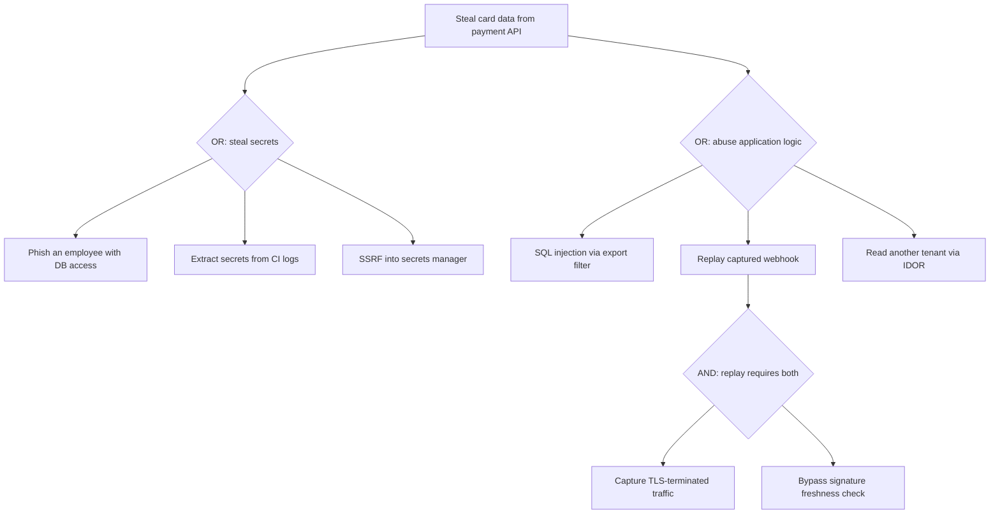
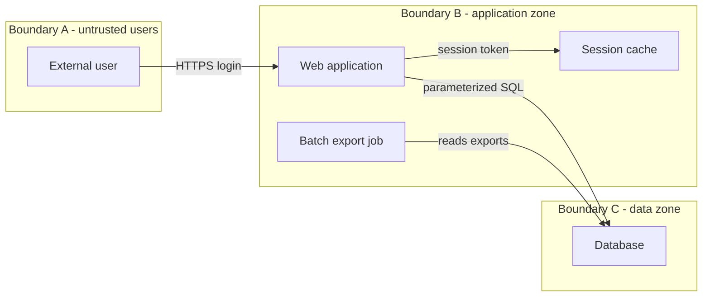
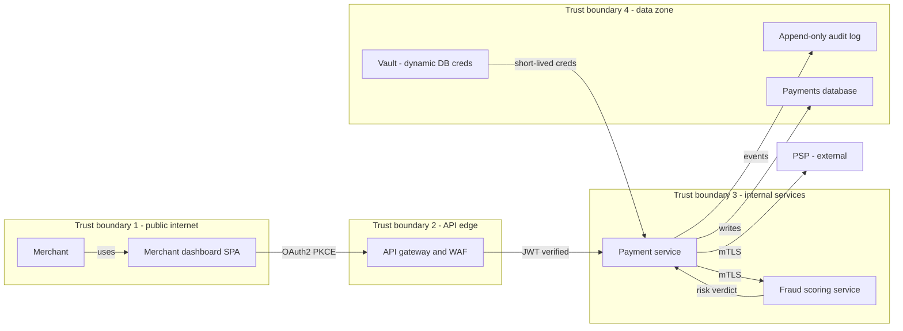

# Threat Modeling

## Overview

Threat modeling is the structured process of enumerating what an attacker could do to a system, ranking those possibilities by risk, and deciding what to do about them — ideally before any code is written. It answers four questions (Shostack's frame): what are we building, what can go wrong, what are we going to do about it, and did we do a good job. In interviews it appears in senior security and system-design rounds as "how would you reason about the security of this design?", and the expected depth is method (STRIDE/PASTA/attack trees), not trivia.

## The Four Questions and Where Modeling Fits

Threat modeling is a design-time activity, repeated whenever the architecture changes: new trust boundary, new data store, new third party. The cost asymmetry justifies the process: a flaw found on a whiteboard costs a design revision, while the same flaw found in production costs a patch, a migration, and possibly a breach notification. Industry estimates commonly place the cost of fixing a security defect in production at 15-100x the design-phase cost, and the number only grows once incident-response and compliance overhead are included.

The output of a threat model is not a document for its own sake. A usable model contains: a data-flow diagram with trust boundaries, a ranked list of threats, mitigations mapped to each accepted threat, and explicitly accepted risks with named owners. Everything else (templates, tooling, scores) exists to keep that list complete and current. A model that lives in a slide deck from 2022 and does not match the deployed architecture is worse than none, because it creates false confidence.

Cadence matters more than depth. A lightweight review at every design review (30 minutes, STRIDE-per-boundary) plus a deep pass per major release catches most issues. Teams that model only at the start of a project re-derive stale threats; teams that model only after incidents are doing forensics, not threat modeling.

## STRIDE: Threat Classification by Security Property

STRIDE (Microsoft, 1999) classifies threats by the security property each one violates. Its strength is completeness by construction: once you enumerate elements (external entity, process, data store, data flow) and cross each against the six categories, you have a systematic checklist rather than an ad-hoc brainstorm.

| Letter | Threat | Property violated | Typical example |
|---|---|---|---|
| **S** | Spoofing | Authenticity | Stolen bearer token replayed against an API |
| **T** | Tampering | Integrity | Modified webhook payload skips signature check |
| **R** | Repudiation | Non-repudiation | Admin action with no audit trail, user denies it |
| **I** | Information disclosure | Confidentiality | Verbose error leaks connection string |
| **D** | Denial of service | Availability | Unauthenticated endpoint that triggers CPU-heavy work |
| **E** | Elevation of privilege | Authorization | IDOR lets a normal user read another tenant's data |

The Microsoft guidance (Security Development Lifecycle, "Agile Threat Modeling") maps categories to element types, which turns STRIDE into a per-element interrogation. External entities are subject to Spoofing and Repudiation ("can this identity be forged, and can it deny having acted?"). Data flows are subject to Tampering, Information disclosure, and Denial of service (an attacker can intercept, modify, or flood anything in transit). Processes are subject to all six. Data stores are subject to Tampering, Repudiation, Information disclosure, and Denial of service.

Two practical notes. First, STRIDE finds *classes* of threats, not instances — "spoofing" must be instantiated as "spoof the webhook caller by replaying a captured signature" before a mitigation can be designed. Second, Microsoft has largely deprecated DREAD-style scoring in favor of a bug bar (fixed severity per threat class), because per-threat numeric scoring was inconsistent between raters.

### Running STRIDE in a 30-Minute Design Review

The framework earns its keep only when applied fast and often. A workable review loop for a single design change: (1) update the DFD — one new boundary or element is enough to trigger the session; (2) walk every crossing and ask the six STRIDE questions per element touched; (3) for each candidate threat, write the concrete abuse case or mark it "not applicable, because ..." — the because clauses are where hidden assumptions surface; (4) rank survivors, assign mitigations or owners. Ten minutes per boundary keeps the cadence sustainable, and a rotating facilitator (not always the security person) spreads the skill across the team.

The most common session failure is solving threats during enumeration — a twenty-minute debate about JWT versus sessions while three boundaries remain unexamined. The mitigation belongs in the register, not in the meeting; enumeration must finish first or it never finishes at all. A second failure is enumerating only the happy path: cron jobs, admin break-glass scripts, and data-repair backdoors generate some of the highest-value STRIDE findings because they bypass the normal controls entirely.

## PASTA, DREAD, and Other Scoring Approaches

**PASTA** (Process for Attack Simulation and Threat Analysis — Uceda Véla & Morana, 2015) is a risk-centric seven-stage process, often abbreviated as the "7 A's": (1) define objectives, (2) define technical scope, (3) decompose the application, (4) analyze threats, (5) analyze vulnerabilities, (6) assess risks, (7) choose countermeasures. PASTA's distinguishing feature is that it starts from business impact and adversary motivation (stage 1) rather than from the diagram, so the output is ranked by business risk instead of by vulnerability count. It is heavier than STRIDE and fits regulated, high-value systems.

**DREAD** scores each threat on five axes — Damage, Reproducibility, Exploitability, Affected users, Discoverability — typically 0-10 each, with the risk being the average. Its virtue is forcing a conversation about impact; its flaw is that the axes are neither independent nor calibrated (two engineers rarely agree on "7 vs 8 for Exploitability"), and Discoverability rewards hiding flaws rather than fixing them.

| Axis | Question asked | Example score (replayed webhook) |
|---|---|---|
| Damage | How bad if exploited? | 8 — fraudulent orders, direct financial loss |
| Reproducibility | How easy to repeat? | 9 — replay is deterministic |
| Exploitability | How skilled must the attacker be? | 7 — needs one captured request |
| Affected users | What fraction is impacted? | 6 — any merchant account |
| Discoverability | How easy to find? | 5 — requires traffic inspection |

Other frameworks complete the toolbox: **LINDDUN** specializes in privacy threats (linkability, identifiability, non-repudiation, detectability, disclosure, unawareness, non-compliance), **OCTAVE** is an organization-scale risk exercise from CMU/SEI, and **CVSS** scores individual *known* vulnerabilities (not design threats) on a 0-10 vector. A common production stack is STRIDE for enumeration, DREAD or a 5x5 likelihood-impact matrix for ranking, and CVSS for incoming third-party CVEs.

## Attack Trees

An attack tree models attacker goals as a root node, decomposed with **OR** branches (any one path suffices) and **AND** branches (all sub-goals required, e.g. "steal key" AND "bypass rotation"). Annotating leaves with cost, probability, or required privilege turns the tree into a quantitative tool: the cheapest complete path is your real security posture, not the threat you personally find most interesting.



Reading the tree: B1 and B3 are single-step paths, so both need dedicated mitigations (parameterized queries — see [Web Security](./web-security.md) — and per-tenant authorization checks). The AND branch under B2 says that replaying a captured webhook requires *both* capturing traffic (C1) *and* bypassing the signature freshness check (C2); removing either prerequisite collapses the whole path. In practice you mitigate C2 (short signature freshness windows, idempotency keys) because C1 — capturing TLS-terminated traffic — is the attacker's cost, not your control. This is the standard way attack trees guide investment: cut every OR path, and cut one edge of every AND path.

## Trust Boundaries and Data-Flow Diagrams

The data-flow diagram (DFD) is the substrate of every threat model, with four element types: external entities (people or systems you do not control), processes (running code), data stores (persistence), and data flows (movement between the others). A **trust boundary** is any line where the level of control or privilege changes: user-to-app, app-to-database, service-to-service across namespaces, your VPC to a payment provider, CI to production. Every crossing is a candidate threat point, because on the far side you no longer control the code, the memory, or the identity.

The rule of thumb: **every element outside the boundary is untrusted until proven otherwise, and every flow crossing a boundary needs explicit authentication, validation, and rate limiting**. When drawing DFDs, boundaries that are frequently forgotten: CI/CD pipeline to production, browser extensions to your pages, email to internal parsers, and the AI/LLM tool-call boundary.



Reading this minimal DFD as an attacker: Boundary A↔B carries spoofing and denial-of-service threats (credential stuffing, login floods). Inside Boundary B the batch job is the classic overlooked element — anything that reads the database and writes files (exports, backups) is an exfiltration channel with no human watching it. The B↔C crossing concentrates information disclosure: who can run the export job, what its output permissions are, and whether the session cache is network-reachable are all decisions made at that boundary, not inside the database.

Common DFD mistakes that hollow out the model: drawing only the request path and forgetting response/data-return flows; collapsing the trust boundary between CI and production into a single "deployment" box; omitting human actors with privileged access (DBAs, SREs) as external entities; and drawing the diagram of the *intended* architecture rather than the deployed one — shadow services and forgotten test endpoints exist precisely because the two diverged.

## Abuse Cases

Where a user story says "as a customer, I transfer money to a friend", an abuse case says "as a fraudster, I replay a captured transfer request to double-spend" — the same feature, viewed through attacker intent. Writing abuse cases forces the team to define what "abuse" means for each feature, which often surfaces missing product decisions (is a $10,000 transfer to a brand-new account suspicious? by what rule?) in addition to missing security controls.

A practical recipe: for each feature, list the assets it touches, then write one abuse case per STRIDE category that is physically meaningful, phrased as an attacker story with a concrete end state. Keep the ones you mitigate and the ones you accept in the same document; the accepted ones with named owners are what auditors and future engineers actually need. Abuse cases pair naturally with the threat model's diagram — each crossing in the DFD should map to at least one abuse case or an explicit "not applicable".

## Risk Scoring: Likelihood x Impact

Qualitative scoring uses a 5x5 matrix: likelihood (1 = requires nation-state effort and years, 5 = script-kiddie tooling, minutes) times impact (1 = cosmetic, 5 = regulatory or existential), giving a 1-25 score with bands: 1-6 accept or track, 8-12 schedule, 15-25 fix before launch. The value is less in the numbers than in forcing likelihood and impact to be argued separately — teams chronically inflate impact and ignore likelihood.

\\[ \\text{Risk} = \\text{Likelihood} \\times \\text{Impact} \\]

For money-weighted decisions, the actuarial version is Annualized Loss Expectancy:

\\[ \\text{ALE} = \\text{SLE} \\times \\text{ARO} \\]

where Single Loss Expectancy is the cost of one incident and Annual Rate of Occurrence is incidents per year. If a payment-API breach costs an estimated $2M and the modeled attack path has a 0.05 yearly probability, ALE is $100k — a $30k/year control (e.g., a managed WAF plus HSM-backed key custody) is justified, a $400k one is not. FAIR (Factor Analysis of Information Risk) formalizes this with calibrated ranges; the interview-relevant point is that likelihood x impact is the common denominator between the qualitative matrix and quantitative FAIR-style analysis.

## Threat Model as Code

Storing the model as versioned artifacts next to the code — rather than in a wiki — keeps it reviewable in the same PR that changes the architecture. The common formats: OWASP Threat Dragon saves JSON (`.json` model files with diagram, threat, and mitigation records), Microsoft TMT saves `.tm7`/`.tmx`, and tooling-agnostic teams keep the DFD as source (Mermaid/PlantUML) plus a YAML table of threats, mitigations, and status.

```yaml
# threats/payments-api.yaml — reviewed in the same PR as the design change
- id: TM-014
  boundary: user-to-gateway
  stride: [Spoofing, Repudiation]
  threat: "Bearer token stolen from a merchant device is replayed"
  impact: high
  likelihood: medium
  mitigations:
    - "15-minute access tokens, rotating refresh tokens"   # oauth2-internals.md
    - "jti claim checked against revocation list"          # jwt-internals.md
    - "device-bound tokens (DPoP) for payout endpoints"
  status: mitigated
  owner: payments-oncall
```

Automation hooks make the model durable: CI can fail a PR if a new trust boundary appears in the DFD without a linked mitigation row, or if a `status: accepted` risk has no named owner. Threat-Dragon models can be diffed as JSON in reviews, and Microsoft's TMT supports re-running generated threats when the expected-state of the diagram changes. The anti-pattern to avoid: a PDF exported once, attached to a Jira epic, and never opened again — if the model cannot be grep'd and diffed, it will rot.

## Tooling: OWASP Threat Dragon and Microsoft TMT

**Microsoft Threat Modeling Tool (TMT)** implements the SDL methodology: you draw a DFD with its stencils, it applies its built-in threat templates per element type and boundary, and produces a tracked list with mitigation fields. Its strengths are the template database (Azure-onwards templates encode cloud-service-specific threats) and low cost of entry; its weaknesses are Windows-only tooling and a model format that does not diff well in git.

**OWASP Threat Dragon** is the open-source counterpart: browser or desktop app, JSON models stored in your repository, and a GitHub integration that can open models straight from a PR. For teams that already keep diagrams as code (Mermaid in the repo), Threat Dragon's JSON plus a CI lint is the most git-friendly combination. Adjacent tooling worth knowing: **PyMT** (Microsoft's programmatic threat-modeling library for generating TMT-compatible models from code), and the OWASP Cheat Sheet Series' threat-modeling entry, which catalogs the process steps and tool list.

## Worked Example: Threat-Modeling a Payment API End-to-End

System: a merchant-facing payments API. Card data is tokenized at the client by the PSP's SDK, so PANs never touch our servers (PCI scope: SAQ A-EP). Authentication is OAuth 2.0 authorization-code + PKCE with 15-minute access tokens (see [OAuth 2.0 Internals](./oauth2-internals.md)); service-to-service calls use mTLS with short-lived certificates (see [Mutual TLS](./mtls.md)); secrets live in a vault with dynamic DB credentials (see [Secrets Management](./secrets-management.md)).



Every arrow crossing a boundary is where STRIDE is applied. The ranked model below is the deliverable — note that each mitigation points at a control documented elsewhere in this book, which is how the model ties to the actual codebase:

| # | Boundary / element | STRIDE | Threat (abuse case) | Sev | Mitigation (control) |
|---|---|---|---|---|---|
| 1 | B1→B2 (dashboard→GW) | S | Attacker with a stolen access token acts as a merchant | High | 15-min tokens + rotating refresh tokens, revoke on anomaly; [OAuth 2.0 Internals](./oauth2-internals.md) |
| 2 | B1→B2 | T, I | Tampered amount in a captured request; PAN sniffing on redirect | High | TLS 1.2+ with HSTS, signed request bodies; [Cryptography/TLS](../cryptography/tls.md) |
| 3 | B2→B3 | E | Gateway bypass: direct pod-to-pod call skipping policy checks | High | Default-deny network policy, SPIFFE identity required; [Zero Trust](./zero-trust.md) |
| 4 | B3 (PAY→FRD, PSP) | T, S | Forged fraud verdict or spoofed PSP callback approves a payment | High | mTLS both directions + HMAC-signed, timestamped, idempotent webhooks; [Mutual TLS](./mtls.md) |
| 5 | B4 (DB) | I, T | SQL injection via export filter exfiltrates tokens | Critical | Parameterized queries, least-privilege DB user, dynamic creds; [Web Security](./web-security.md), [Secrets Management](./secrets-management.md) |
| 6 | AUD | R | Insider deletes refund records to hide fraud | Medium | Append-only log, hash-chained entries, 12-month retention |
| 7 | All processes | D | Card-testing attack: 10k tiny charges to validate stolen cards | Medium | Per-card velocity limits (e.g. 5 attempts/15 min), PSP-side fraud rules, WAF rate limits |
| 8 | B1→B2 | E | Normal merchant reads another tenant's payouts | High | Authorization checks scoped by tenant on every handler, not at the gateway |

Two decisions this model drives immediately: mitigations #1 and #4 gate launch (direct financial loss, medium-high likelihood), while #7 ships with monitoring thresholds and a runbook instead of a new control, because PSP-side velocity rules already cover most of the risk. That trade-off — fix, transfer to a provider, or accept with monitoring — is the actual output of threat modeling.

### Residual Risk and Sign-Off

After mitigations land, the model is re-scored: the residual rating is what leadership signs, not the pre-mitigation rating. Residual risk is dominated by the threats you transferred (PSP fraud liability) and the ones accepted with monitoring (#7), and each acceptance needs three fields to be defensible later: the named owner, the monitoring signal that would reveal the accepted threat going active, and a revisit date. "Accepted" without a revisit date silently becomes "forgotten" — most of the value of re-running the model at the next release is checking whether old acceptances still hold under the new architecture.

The sign-off artifact is deliberately small: the DFD, the ranked register, and the acceptance list with owners. Everything else (PASTA worksheets, DREAD scoring history, tool exports) is working material. If a future engineer cannot reconstruct the reasoning from those three artifacts alone, the model failed its own audit — the same standard you would apply to any design document.

## Interview Questions

1. **Walk me through threat-modeling a system you built.** Sketch the DFD first: entities, processes, stores, and every trust boundary. Then apply STRIDE per crossing, instantiating each category into a concrete abuse case ("spoof the webhook caller", not just "spoofing"). Score each threat likelihood x impact, map mitigations to named controls, and mark accepted risks with owners. Closing with "the model lives in the repo and updates per design review" signals you treat it as a living artifact rather than compliance theater.

2. **Why did Microsoft move away from DREAD scoring?** The five axes are subjective and non-independent — two reviewers rarely agree on a 7 vs 8 for Exploitability — so scores were noisy across raters. Discoverability also perversely rewarded not documenting vulnerabilities. Microsoft replaced it with a per-class bug bar (e.g., all elevation-of-privilege findings on a trust boundary are "must fix"), which trades fine-grained ranking for consistency; many teams now use a simple likelihood x impact matrix instead.

3. **What is a trust boundary and why do threats concentrate there?** It is any transition where control or privilege changes: user to app, app to database, your VPC to a third party, CI to production. On the far side you no longer control code, memory, or identity, so every crossing needs explicit authentication, input validation, and rate limiting. A DFD without trust boundaries drawn is the most common threat-modeling failure, because the threats live exactly on those edges.

4. **When would you choose PASTA over STRIDE?** STRIDE is enumeration-focused: fast, diagram-driven, ideal for design reviews and iterating on a specific feature. PASTA is risk-centric: its seven stages start from business objectives and adversary motivation, producing rankings grounded in business impact — the better fit for regulated, high-value systems and annual planning. In practice teams enumerate with STRIDE and then prioritize with a PASTA-style risk assessment.

5. **How do attack trees change prioritization?** They make the cheapest complete attacker path visible, which is usually not the vulnerability the team finds most interesting. For OR branches every path needs a mitigation; for AND branches cutting any single prerequisite collapses the whole path, so you pick the cheapest edge to break. Annotating leaves with attacker cost or probability lets you compare controls by risk reduction per dollar rather than by intuition.

6. **What does "threat model as code" mean in practice?** The DFD and the threat register live in the repository as diffable artifacts (Mermaid DFD, Threat-Dragon JSON, or a YAML register), reviewed in the same PR as the architectural change. CI can enforce that a new boundary has mitigations and that accepted risks have owners. This keeps the model synchronized with the system it describes — the failure mode of document-based modeling is a stale artifact nobody trusts.

## Key Takeaways

- Threat modeling answers four questions: what are we building, what can go wrong, what do we do about it, did we do a good job — and it is repeated per design change, not once per project.
- STRIDE maps threats to violated properties (Spoofing, Tampering, Repudiation, Information disclosure, Denial of service, Elevation of privilege); per-element application makes enumeration systematic.
- PASTA is risk-centric (objectives → decomposition → risk assessment → countermeasures); DREAD scores each threat on five 0-10 axes but suffers rater inconsistency, which is why bug bars and likelihood x impact matrices replaced it.
- Trust boundaries — every change of control or privilege level — are where threats concentrate; every crossing needs explicit authn, validation, and rate limiting.
- Attack trees expose the cheapest complete attacker path: cut every OR branch, cut one edge of every AND branch.
- Risk = likelihood x impact; ALE = SLE x ARO gives the dollar figure that justifies or kills a control.
- The deliverable is a ranked threat list with mitigations mapped to real controls and accepted risks with named owners, stored as code so it can be diffed in PRs.

## References

- [NIST SP 800-154: Guide to Data-Centric System Threat Modeling](https://nvlpubs.nist.gov/nistpubs/SpecialPublications/NIST.SP.800-154.pdf)
- [OWASP: Application Threat Modeling](https://owasp.org/www-community/Threat_Modeling)
- [OWASP Threat Dragon (open-source threat modeling tool)](https://owasp.org/www-project-threat-dragon/)
- [Microsoft Threat Modeling Tool — Azure Security docs](https://learn.microsoft.com/en-us/azure/security/develop/threat-modeling-tool)
- Shostack, A. — *Threat Modeling: Designing for Security*, Wiley, 2014 (the "four questions" frame).
- Uceda Véla, T. & Morana, M. — *Risk-Centric Threat Modeling: Cases for Security Analysts*, Wiley, 2015 (PASTA).
- [OWASP Cheat Sheet Series (mitigation catalog referenced by models)](https://cheatsheetseries.owasp.org/)

## Cross-References

- [Web Security](./web-security.md) — concrete mitigations (injection, XSS, CSRF) for the Tampering/EoP rows of any STRIDE table.
- [OAuth 2.0 Internals](./oauth2-internals.md) — PKCE, bearer-token risks, and introspection used to mitigate Spoofing on API boundaries.
- [Mutual TLS (mTLS)](./mtls.md) — service-to-service Tampering/Spoofing mitigation at internal trust boundaries.
- [Secrets Management](./secrets-management.md) — vaulting and dynamic credentials for Information-disclosure mitigations.
- [Zero Trust Network Access](./zero-trust.md) — the architectural stance (per-request authorization) that removes "trusted internal" boundaries entirely.
- [Cryptography](../cryptography/tls.md) — TLS configuration details for in-transit disclosure and tampering mitigations.
