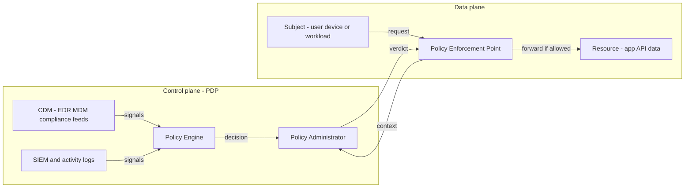

# Zero Trust Architecture (NIST SP 800-207)

## Overview

NIST SP 800-207 (Rose et al., 2020) turns "zero trust" from a slogan into a reference architecture: no implicit trust is granted based on network location or asset ownership, and every access request is authenticated, authorized, and encrypted per session. This page covers the formal model — the Policy Decision Point / Policy Enforcement Point split, trust algorithms, and deployment flavors — plus the parts the formal spec leaves open: workload identity with SPIFFE/SPIRE, policy-engine design with OPA/Rego, and continuous evaluation. It is the architecture-side companion to [Zero Trust Network Access](./zero-trust.md), which covers the practical ZTNA product category (IAP, SASE, VPN replacement) — read that page for the deployment-pragmatics angle and this one for the NIST formalism and design trade-offs.

## The Seven Tenets of SP 800-207

The spec defines zero trust through seven tenets (§2.1), and interviewers frequently probe the ones teams actually violate. Restated compactly:

1. **All data sources and computing services are resources.** A printer, a metrics API, and a database are equally resources requiring explicit access policy — "infrastructure" is not a trust exemption.
2. **All communication is secured regardless of network location.** Internal-to-internal traffic gets the same TLS/authentication as internet traffic; "inside" is not a property.
3. **Access to individual resources is granted on a per-session basis.** Least privilege in time: a session is scoped to one resource, not to "the network".
4. **Access is determined by dynamic policy.** Client identity, application/service identity, device state, behavioral attributes, and environmental attributes (time, geo, observed risk) all feed the decision.
5. **The enterprise monitors and measures the integrity and security posture of all owned and associated assets.** No asset is inherently trusted; posture is continuously assessed (patch level, EDR health, attestation).
6. **All resource authentication and authorization are dynamic and strictly enforced before access.** Re-authentication and re-authorization happen continuously; this is a process, not a one-time gate.
7. **The enterprise collects as much information as possible about the current state of assets, network, and communications** to improve the security posture and policy.

Tenets 3 and 6 do most of the architectural work: per-session scoping is what makes lateral movement infeasible, and continuous re-evaluation is what makes stolen credentials a bounded problem rather than an epoch. The common failure in real deployments is implementing tenet 2 with a VPN rebrand ("managed device = trusted everywhere"), which preserves the lateral-movement property tenet 3 exists to kill.

## The PDP/PEP Model

SP 800-207 splits the decision from the enforcement. The **Policy Decision Point (PDP)** contains the Policy Engine (computes allow/deny from signals and policy) and the Policy Administrator (translates decisions into session establishment commands). The **Policy Enforcement Point (PEP)** sits in the data path, terminates connections, and forwards only authorized traffic. Supporting data sources — Continuous Diagnostics & Mitigation (CDM), compliance systems, activity logs, data-access policy, PKI, identity management, SIEM — feed the PDP.



The critical property is the **separation of control plane from data plane**: the PEP is a per-application or per-workload enforcement point (reverse proxy, sidecar, host agent), never a network-wide concentrator. If the PDP is down, the PEP's cached-verdict TTL (typically seconds to a few minutes) determines how long enforcement continues autonomously, which is why break-glass access paths are mandatory in every real deployment. The spec's trust algorithms come in two flavors: **criteria-based** (explicit allow rules over principal + resource + context) and **confidence-level/scoring-based** (a weighted sum of signals compared against a per-resource threshold); production systems blend both.

### Break-Glass and PDP Resilience

Centralizing decisions creates a new single point of failure, and SP 800-207 is explicit that policy decisions must be strictly enforced *before* access — which makes PDP availability a security property, not just an SLO. Real deployments handle this in layers: PEP-side verdict caching (enforcement continues for the TTL even with the PDP dark), PEP-embedded fallback policy (a minimal default-deny rule set compiled into the enforcement point), and sealed break-glass credentials for humans (offline, hardware-token-protected, alarm on use). The break-glass account that nobody has tested is a rumor, not a control — exercising it quarterly is part of preparation, and its use must page the security team unconditionally, because a stolen break-glass credential is the highest-value target in a zero-trust estate.

| Component | Role | Concrete instance |
|---|---|---|
| Policy Engine | Evaluates policy against signals, computes verdict | OPA server, IAP policy backend |
| Policy Administrator | Establishes/cuts sessions per verdict | Session manager in the access broker |
| PEP | Terminates TLS, enforces verdict in the data path | Envoy sidecar, Cloudflare Access edge, host agent |
| CDM / posture feeds | Device and asset state signals | CrowdStrike/Falco, Intune/Jamf, attestation service |
| SIEM / activity logs | Behavioral and historical signals | Splunk/BigQuery over auth + access logs |

## Identity as the Perimeter

Zero trust replaces the network perimeter with two identity planes: **human identity** and **workload identity**. Human identity is handled by the IdP (OIDC/SAML), ideally with phishing-resistant MFA (FIDO2/WebAuthn — see [Authentication](./authentication.md) for the factor taxonomy and [FIDO2/WebAuthn](./advanced/fido2-webauthn.md) for the protocol), because phishing remains the dominant initial-access vector. Tokens must be short-lived — 5-15 minutes for access tokens with rotating refresh tokens — otherwise a stolen bearer token defeats the per-session tenet; the mechanics of rotation windows are covered in [Credential Rotation](./advanced/credential-rotation.md).

Workload identity is the harder half and the one SP 800-207 under-specifies. The ambient alternative — "whatever is in this subnet is service X" — is exactly the implicit trust zero trust forbids, and it is what SPIFFE eliminates: a cryptographic identity minted from attestation, not network location. A SPIFFE ID names the workload (`spiffe://prod.example.org/ns/payments/sa/payments-service`), and an SVID (SPIFFE Verifiable Identity Document) carries it as an X.509 certificate or JWT with a short TTL (SPIRE's default X.509 SVID lifetime is 1 hour, rotated at roughly half-life). The full attestation chain — SPIRE server, agents, node and workload attestation — is covered in [SPIFFE/SPIRE](./advanced/spiffe-spire.md); the ZTA-relevant point is that PEPs enforce on SVID identity, so policy reads `caller == spiffe://...payments-service`, not `caller in corporate-CIDR`.

### Workload Identity in Practice

Operationally, a SPIRE deployment trades a one-time bootstrap cost for the elimination of static service credentials: no more shared API keys in config maps, no more credential-scanning tools firing on every config repo. The agent bootstrap is the security-critical step — the agent must prove *where it is running* (node attestation: Kubernetes PSAT, AWS Instance Identity Document, TPM) before it receives trust, and each workload proves *what it is* (workload attestation: pod labels, service account, Unix user) before the agent hands it an SVID:

```bash
# Server: define the registration entry that maps attested
# selectors to a SPIFFE ID (the policy, versioned in git)
spire-server entry create \
  -spiffeID spiffe://prod.example.org/ns/payments/sa/payments-service \
  -parentID spiffe://prod.example.org/spire/agent/k8s-node-42 \
  -selector k8s:ns:payments -selector k8s:sa:payments-sa

# Workload side: fetch the current SVID via the Workload API (no secret material)
spire-agent api fetch x509
#   SPIFFE ID:  spiffe://prod.example.org/ns/payments/sa/payments-service
#   Validity:   60 minutes, auto-rotated by the agent
```

The failure mode to design for is attestation ambiguity: two workloads matching the same selectors, or selectors loose enough (namespace-only, no service account) that a compromised pod in the namespace mints an SVID belonging to its neighbor. Selectors should be as narrow as the platform allows, and the trust domain should be per-environment (`prod`, `staging`) so a staging SVID is structurally invalid in production. Federation — one trust domain verifying another's identities — is the SPIFFE answer to cross-org zero trust; without it, every third-party integration collapses back to shared static credentials.

Device identity is the third leg: MDM-issued device certificates (per-device keys, short validity, renewed automatically) let the PEP distinguish "managed, compliant laptop" from "random browser". Google's BeyondCorp built exactly this device-inventory-plus-certificate pattern; without it, a ZTNA degrades to user-identity-only, and credential theft becomes a full compromise.

## Device Posture and Trust Tiers

Posture signals are collected by device agents/EDR/MDM and cross-checked server-side (a compromised agent can lie; the MDM and EDR APIs cannot be tampered with by the device — the defense-in-depth point made in the [ZTNA page](./zero-trust.md)). The BeyondCorp pattern organizes posture into **trust tiers**: each device gets a tier from its inventory state, and each resource declares the minimum tier it accepts.

| Tier | Device state | Example gate | Typical resources |
|---|---|---|---|
| 0 | Unknown / unmanaged | none — treated as untrusted | Public site only |
| 1 | Managed, compliant (encrypted, patched ≤30 days) | valid device cert + MDM attestation | Internal wiki, low-risk tools |
| 2 | Tier 1 + healthy EDR + hardware-backed keys | EDR API "healthy" + TPM-backed cert | Source control, CI, analytics |
| 3 | Tier 2 + JIT elevation + step-up MFA | approval workflow + FIDO2 re-auth | Production DBs, secrets, payout APIs |

Design decisions that matter in interviews: tier assignment must be derived from server-side inventories (a device cannot self-assert tier 2), thresholds are per-resource (the wiki and the secrets manager must not share a gate), and tier changes must revoke live sessions — an EDR "compromised" event should flip the device to tier 0 and have the PEP drop its sessions within seconds. The cost of getting this wrong is the classic ZTNA-anti-pattern: policy that says "managed = trusted for everything", which is a VPN with extra latency.

The cold-start problem is the operational bottleneck: a brand-new device has no inventory record, so it is tier 0 by construction, and the enrollment flow (certificate issuance, MDM registration, first posture scan) is the one path where user friction concentrates. Mature deployments treat enrollment as a product surface — automated, time-bounded, and monitored for abuse (an enrollment spike is either onboarding week or an attacker enrolling stolen machines; velocity limits and helpdesk verification distinguish the two). The inventory itself decays continuously: devices leave the fleet, MDM agents are uninstalled, certificates expire — so tier computation must be a rolling job, not an enrollment-time snapshot, or tier 2 quietly becomes "was tier 2 sometime last year".

## BeyondCorp Case Study

Google's BeyondCorp (papers 2014-2018) is the canonical industrial implementation of zero trust, built because remote work and cloud services had dissolved the meaningfulness of the corporate perimeter. The architecture: an **Access Proxy (AP)** fleet in front of internal apps (the PEP), a **central policy engine** deciding per-request from a **trust tier** computed by a **Device Inventory Service** (fed by asset management, MDM, and vulnerability scanners), **device certificates** issued from a corporate CA binding requests to known devices, and a **single sign-on bridge** integrating apps that cannot speak OIDC natively.

The papers document the hard-won operational lessons: legacy applications needed the SSO bridge because they could not authenticate users themselves; the AP had to enforce not just user identity but the device certificate, because user-only auth still allowed stolen-credential access from unmanaged machines; and rollout was a multi-year, percentage-based traffic shift — the 2018 paper ("BeyondCorp: Design to Deployment at Google", IEEE Security & Privacy) describes migrating roughly 1,000+ applications and ~100,000 employees gradually, app by app, with legacy VPN access retained only as break-glass until the long tail was on the AP.

Two BeyondCorp ideas are directly reusable at any scale. First, **policy as (subject, resource, expected-tier)**: application owners declare "admins console requires tier 2", and the central engine enforces it — this decouples app teams from security plumbing. Second, **inventory before policy**: BeyondCorp invested heavily in knowing what devices exist and their state, because trust tiers are only as good as the inventory beneath them. Teams that skip the inventory investment end up with tiers nobody can compute.

## Policy Engine Design (OPA/Rego)

The PDP needs a policy language that is decoupled from application code. **Open Policy Agent (OPA)** evaluates policy written in **Rego** against structured input (request context, device posture, identity claims), and runs as a sidecar, a library, or a central service; bundles distribute policy, and decision logs record every evaluation for audit. A minimal ZTA-style policy for a payout endpoint:

```rego
package zta.access

default allow := false

device_ok {
    input.device.mdm_managed == true
    input.device.disk_encrypted == true
    input.device.edr_health == "healthy"
}

identity_ok {
    input.token.aud == "payouts-api"
    input.token.mfa_time_since_seconds < 900   # step-up within 15 min
    input.user.role == "payout-operator"
}

allow {
    device_ok
    identity_ok
    input.resource.min_trust_tier <= 3
}
```

Three engineering properties matter more than syntax. **Latency**: local evaluation is sub-millisecond; a central OPA service adds a network hop (~1-5 ms) per decision, which is why PEPs cache verdicts with short TTLs and why the cache-invalidation path (on posture change) must be designed, not bolted on. **Distribution**: policy is versioned and rolled out like code (staged bundles, canary evaluation with shadow mode — log what *would* be denied before enforcing). **Auditability**: decision logs with inputs, policy version, and verdict are the compliance artifact that makes per-request authorization provable to SOC 2/ISO auditors; the same logs are the detection source for [eBPF-based monitoring](./ebpf-security.md) at the network layer.

## Continuous Evaluation and Session Re-auth

Point-in-time auth (log in at 9:00, trusted until 17:00) contradicts tenet 6. Continuous evaluation re-runs policy on three triggers: **per-request** (every PEP hit re-checks a cached verdict whose TTL is 30-90 seconds), **on signal change** (EDR compromise event, impossible-travel detection, or device tier drop causes immediate session revocation), and **on policy change** (a bundle rollout that narrows access should evaluate open sessions against the new policy).

Session mechanics follow from this: short-lived tokens (5-15 minutes) issued via token exchange (RFC 8693), refresh tokens rotating on every use, and **step-up re-authentication** when the request exceeds the session's current assurance — e.g., accessing a tier-3 resource mid-session demands a fresh FIDO2 ceremony even though the session is technically valid. The user-visible goal is imperceptibility for normal work (cached verdicts) and hard failure within seconds when risk changes; the engineering goal is that revocation propagation is bounded by token TTL plus PEP cache TTL, a number you can state and measure (e.g., worst case 2-3 minutes, typical <60 seconds).

### Revocation Propagation, Made Concrete

Worst-case attacker access after a revoke decision decomposes into three terms: outstanding token validity (up to the access-token TTL, say 15 min), PEP verdict-cache remainder (up to its TTL, say 60 s), and detection latency (whatever the EDR/analytics took to raise the signal — minutes to days, and the dominant term in practice). The first two are engineering budgets you choose; the third is why posture signals (EDR, behavioral) feed the PDP directly instead of waiting for humans. The design exercise worth doing in interviews: given "attacker credential use must stop within 5 minutes of EDR detection", choose token TTL ≤ 5 min, cache TTL ≤ 60 s, and a signal-to-PEP revocation path that bypasses human triage — then verify the numbers with a drill, because a revocation path that has never been fired in production is untested in exactly the way incidents expose.

The observability cost is real but is also a feature: every decision is a log line with subject, device, resource, policy version, and verdict. Compared with VPN logs ("user connected at 9:00"), this is the difference between guessing what an attacker touched and reconstructing it exactly — the forensic payoff is covered in [Security Incident Response](./incident-response.md).

## Deployment Models (SP 800-207 §3)

The spec describes three canonical PDP/PEP deployment patterns, and knowing which one you are building decides most downstream engineering.

### Device Agent / Gateway-Based

An agent on every managed device pairs with a gateway PEP in front of resources. The agent collects posture and can also enforce egress (only approved gateways reachable), making it the strongest model for fully-managed fleets — this is the classic ZTNA product shape and the BeyondCorp pattern at Google. Costs: agent lifecycle management across OS versions, the trust question of what the agent itself can do (it is privileged software on the endpoint), and the cold-start enrollment problem described above. Fit: enterprises with mostly-managed devices and legacy apps that cannot do modern auth themselves.

### Enclave-Based

Resources are grouped into enclaves (VPCs, clusters) behind a gateway; the client device needs no agent, and the enclave gateway enforces policy. Weakest property: everything inside the enclave shares the gateway's trust decision, which partially re-creates a perimeter — the model is really "smaller perimeters" rather than zero trust. Fit: brownfield environments segmenting a flat network as a first step, and third-party/vendor access where you cannot install agents.

### Resource Portal-Based

The resource sits behind a portal PEP (a reverse proxy or an application-level gateway), reached by browser — no agent, no network access, only application sessions. This is the model of Cloudflare Access-style IAP deployments and gives the cleanest per-request authorization, at the price of limited support for non-HTTP protocols and rich desktop apps. Fit: HTTP-first estates and contractor/partner access where installing agents is a non-starter.

Most real architectures are hybrids: portal-based for SaaS-like internal apps, agent/gateway for privileged engineering access, enclave-based for the legacy long tail. The architecture decision to record is not the product but the **mapping**: which resource class gets which enforcement model, and what tier each requires.

## Microsegmentation for Workload Traffic

East-west traffic (service to service) is where perimeter models hide their largest implicit-trust gap, and microsegmentation is the zero-trust answer: every workload pair is denied unless policy allows it, enforced by sidecars, host firewalls, or eBPF — not by the datacenter firewall. Identity comes from the workload plane (SPIFFE IDs or cloud IAM roles), and the policy is expressed as intent:

```yaml
# Default-deny: any pod not matching an explicit ALLOW rule cannot talk
apiVersion: networking.k8s.io/v1
kind: NetworkPolicy
metadata:
  name: default-deny-egress
  namespace: payments
spec:
  podSelector: {}
  policyTypes: ["Egress"]
  egress:
    - to:
        - namespaceSelector:
            matchLabels: { "kubernetes.io/metadata.name": "fraud" }
      ports:
        - protocol: TCP
          port: 8443
```

The scale problem is the real engineering challenge: a 500-service estate generates tens of thousands of potential edges, and hand-writing policy per edge does not scale. The workable progression is (1) default-deny with logging (observe what would break, and what genuinely talks to what), (2) generate allow-policies from observed flows, reviewed like code, (3) tighten gradually, starting with the highest-value data stores. CNI-level tools (Cilium) and mesh mTLS (see [Mutual TLS](./mtls.md)) both implement this; the mesh adds cryptographic identity, the CNI adds kernel-level enforcement — mature estates run both. The measurable payoff is lateral-movement cost: an attacker who compromises one pod reaches only the edges policy allows, and every reachable edge is visible in the policy repository as an auditable decision.

## Migration Anti-Patterns

| Anti-pattern | Symptom | Fix |
|---|---|---|
| Big-bang cutover | All apps behind PEP on day one, helpdesk flooded | Percentage-based rollout per app tier; legacy path kept as break-glass |
| ZTNA-as-VPN | Policy = "all managed devices → all apps" | Least-privilege per-resource policy; tier gates per resource |
| Client-asserted posture | Trusting the device agent's self-report | Cross-check MDM/EDR server APIs; derive tier from inventory |
| Shadow ingress | Backends still reachable via SSH jump hosts / old LBs | Only-PEP network paths; default-deny network policy |
| Long-lived tokens | 8-hour tokens issued after login | 5-15 min tokens, RFC 8693 exchange, rotating refresh |
| Ignoring service-to-service | Humans behind PEP, east-west traffic unauthenticated | SPIFFE/SVID mTLS everywhere; policy on workload identity |
| No break-glass | PDP outage = total outage | Sealed emergency credentials, tested quarterly |
| Tool-first migration | Buying a ZTNA product before use-case inventory | Enumerate apps/data, assign tiers, then pick enforcement points |

The two most expensive in practice are the big-bang cutover (Google's own papers credit gradual percentage-based migration for making the program survivable) and shadow ingress (any forgotten path that accepts "trusted internal" traffic silently re-creates the perimeter you just paid to remove). Both are process failures, not product failures: the products enforce what you configure, and both anti-patterns are configuration disciplines. A related trap is measuring success by tool deployment instead of by policy coverage — the metric that matters is "fraction of resources with per-resource tier gates and default-deny paths", not "licenses sold".

## Interview Questions

1. **Explain the PDP/PEP split and why the control plane is separated from the data plane.** The PDP (Policy Engine + Policy Administrator) decides; the PEP enforces in the data path, terminating sessions and forwarding only allowed traffic. Separation lets policy change without touching data-path code and lets many heterogeneous PEPs (sidecars, proxies, host agents) share one decision logic. The PEP caches verdicts for seconds so enforcement survives brief PDP outages, but the cache TTL bounds your revocation latency — a deliberate, measurable trade-off.

2. **What does "identity as the perimeter" mean for machine traffic?** Service-to-service calls authenticate with cryptographic workload identity — SPIFFE SVIDs (X.509 with ~1h TTL) minted from attestation rather than network location — and PEPs authorize on the caller's SPIFFE ID. This removes the last implicit-trust assumption ("same VPC = trusted"), which is precisely the assumption lateral movement abuses. Human identity (IdP + phishing-resistant MFA) and device identity (MDM certificates + posture) complete the three-legged subject that policy evaluates.

3. **Design the trust algorithm for a zero-trust deployment. Where do you start?** Start criteria-based, not scoring-based: enumerate resources, assign each a minimum trust tier, and express policy as explicit rules over subject + device + context — scoring weights are untunable before you have decision logs to calibrate against. Add a risk-score input later (impossible travel, EDR signals) for step-up rather than deny decisions, so false positives degrade gracefully to re-authentication. Every verdict is logged with inputs and policy version for audit and tuning.

4. **Your EDR flags a laptop as compromised at t=0. What happens in a well-built ZTA?** The posture signal flips the device's tier to 0, the policy engine marks affected sessions revoked, and PEP caches flush — worst-case propagation is token TTL plus PEP cache TTL, so roughly 2-3 minutes with 15-minute tokens and 60-second caches. Unmanaged personal devices were never granted sessions to tier-2+ resources, so blast radius is the resources that tier-1/2 policy let this device reach. This scenario is why revocation paths, not login flows, are the part to test.

5. **What made BeyondCorp's migration succeed where many ZTNA rollouts stall?** Gradual, percentage-based app-by-app migration with the legacy path retained as break-glass; a Device Inventory Service built before policy depended on it; and the SSO bridge pattern for legacy apps that could not do modern auth. The lesson is organizational as much as technical: trust tiers are a product of inventory quality, and policy coverage grows only as fast as apps are onboarded behind the access proxy.

6. **Where does OPA fit, and what are its operational pitfalls?** OPA evaluates Rego policy as a sidecar, library, or central service, with bundles for distribution and decision logs for audit. Pitfalls: treating policy as config rather than code (no staging, no canary — enforce shadow mode first), unbounded input payloads that slow evaluation, and missing cache-invalidation on posture change. Local evaluation is sub-millisecond; the central-service hop (~1-5 ms) is why PEP-side verdict caching exists.

## Key Takeaways

- NIST SP 800-207 defines zero trust through seven tenets; the operative ones are per-session resource access (tenet 3) and continuous, strictly-enforced re-authorization (tenet 6).
- The PDP/PEP split separates decision (Policy Engine + Administrator) from enforcement (proxy/sidecar/agent); PEP verdict caching trades revocation latency for PDP-outage resilience.
- Identity replaces the network perimeter on three legs: human (IdP + phishing-resistant MFA), device (MDM certs + posture tiers), and workload (SPIFFE SVIDs with ~1h TTLs).
- Trust tiers must be computed from server-side inventories (MDM, EDR APIs), never self-asserted by the device; tier changes must revoke live sessions within seconds.
- BeyondCorp's reusable lessons: inventory before policy, per-resource expected tiers, SSO bridge for legacy apps, and gradual percentage-based cutover with break-glass retention.
- Policy engines (OPA/Rego) make decisions auditable and code-reviewable; ship policies with shadow mode, decision logs, and short token TTLs (5-15 minutes).
- The migration killers are big-bang cutovers and shadow ingress — both process failures that re-create implicit trust despite zero-trust tooling.

## References

- [NIST SP 800-207: Zero Trust Architecture (Rose et al., 2020)](https://nvlpubs.nist.gov/nistpubs/SpecialPublications/NIST.SP.800-207.pdf)
- Ward, R. & Beyer, B. — "BeyondCorp: A New Approach to Enterprise Security", ;login:, vol. 39, no. 6, 2014. ([research.google/pubs/pub43223](https://research.google/pubs/pub43223/))
- Osman, M. et al. — "BeyondCorp: Design to Deployment at Google", IEEE Security & Privacy, 2018 (no stable public URL; cite by title/venue).
- [SPIFFE — Secure Production Identity Framework for Everyone](https://spiffe.io/)
- [Open Policy Agent documentation](https://www.openpolicyagent.org/docs/)
- [RFC 8693: OAuth 2.0 Token Exchange](https://datatracker.ietf.org/doc/html/rfc8693)
- [MITRE ATT&CK — tactic/technique catalog used as a policy and detection vocabulary](https://attack.mitre.org/)

## Cross-References

- [Zero Trust Network Access (ZTNA)](./zero-trust.md) — the practical/product angle: IAP, SASE, VPN-vs-ZTNA trade-offs, and operational realities.
- [SPIFFE/SPIRE](./advanced/spiffe-spire.md) — cryptographic workload identity: SVIDs, attestation chain, federation, failure modes.
- [Mutual TLS (mTLS)](./mtls.md) — the transport mechanism that carries workload identity between PEPs and resources.
- [Authentication](./authentication.md) — human identity plane: factors, sessions, tokens, and phishing-resistant options.
- [Credential Rotation](./advanced/credential-rotation.md) — rotation windows and revocation mechanics that bound breach blast radius.
- [Remote Attestation](./advanced/remote-attestation.md) — hardware-backed evidence that a device is in a known-good state.
