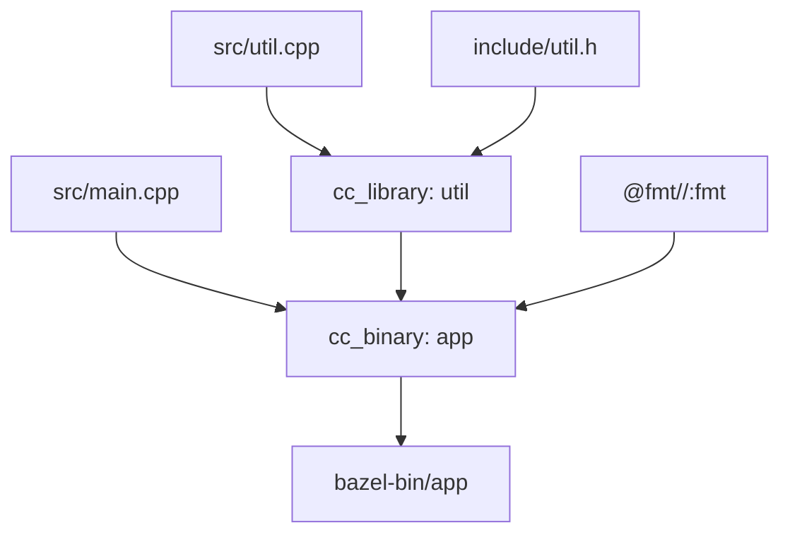
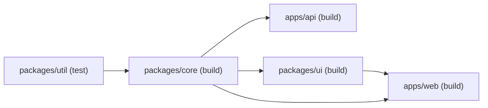

# Build Systems

## Table of Contents

- [Why Build Systems Matter](#why-build-systems-matter)
- [Core Concepts](#core-concepts)
- [The Make Family — Declarative Rules](#the-make-family--declarative-rules)
- [CMake — Meta-Build Generator](#cmake--meta-build-generator)
- [Ninja — Fast Execution Engine](#ninja--fast-execution-engine)
- [Bazel — Hermetic, Content-Addressed, Remote](#bazel--hermetic-content-addressed-remote)
- [Buck2 — Rust-Based, Lazy Evaluation](#buck2--rust-based-lazy-evaluation)
- [Meson — Fast and User-Friendly](#meson--fast-and-user-friendly)
- [JVM Build Tools — Gradle, Maven, sbt](#jvm-build-tools--gradle-maven-sbt)
- [Cargo — Rust's All-in-One](#cargo--rusts-all-in-one)
- [JavaScript Package Managers and Task Runners](#javascript-package-managers-and-task-runners)
- [Monorepo Build Orchestration](#monorepo-build-orchestration)
- [JavaScript Bundlers](#javascript-bundlers)
- [Hermetic Builds, Caching, and Remote Execution](#hermetic-builds-caching-and-remote-execution)
- [Common Mistakes](#common-mistakes)
- [Interview Questions](#interview-questions)
- [References](#references)

---

## Why Build Systems Matter

A build system translates a source tree into runnable artifacts — binaries,
packages, bundles, container images. Beyond compilation, it answers three
questions for every input: **what to rebuild**, **in what order**, and **how to
make the result reproducible**. A good build system is invisible: changes go
in, correct artifacts come out, the same inputs always yield the same outputs.

At one file, `gcc main.c` is enough. At ten thousand files with cross-language
dependencies, shared caches, and CI fleets, the build system is the project's
nervous system: it decides developer productivity, CI cost, and the blast
radius of every change. Three forces shape modern tools: **correctness**
(incremental builds must not skip work whose inputs changed), **speed** (large
monorepos need caching, parallelism, remote execution), and **reproducibility**
(same source → same binary, the foundation of supply-chain trust).

> A build system is a function from sources and tools to artifacts. Making
> that function pure, cacheable, and parallel is most of what "modern build
> systems" are about. (Paraphrased from the Bazel design docs.)

## Core Concepts

| Concept | Definition | Why it matters |
|---|---|---|
| **Dependency graph** | DAG of targets where each edge means "I need you first" | Correct ordering and parallelism |
| **Incremental build** | Rebuild only targets whose inputs changed | O(changes) work instead of O(repo) |
| **Content-addressed cache** | Cache key is a hash of inputs + command | Sharing across machines and developers |
| **Hermetic build** | Reads only declared inputs, no host access | Same result on laptop, CI, coworker's machine |
| **Reproducible build** | Bit-identical output for bit-identical inputs | Auditable, attested binaries |
| **Sandboxing** | Filesystem/network isolation per action | Enforces hermeticity; surfaces hidden deps |
| **Remote execution** | Run actions on a shared cluster | Scales beyond one machine; shared cache |
| **Remote cache** | Store action outputs by content hash | Avoids re-running work already done |

An incremental build is correct only if **every** input that affects an output
is part of that output's dependency key. Two classic failure modes:
**under-tracking** — the compiler reads a system header you didn't declare;
change the header, nothing rebuilds, you ship a stale binary — and
**over-tracking** — include the whole repo as an input; every change rebuilds
everything, so developers disable incremental builds. Make trusts the author
to list every dependency. Bazel and Buck2 **discover** dependencies by
sandboxing the action and observing what it reads (Bazel's Skyframe, Buck2's
DICE).

## The Make Family — Declarative Rules

**Make** (Stuart Feldman, 1976) is the grandparent of build systems. Its
model is elegantly simple: targets depend on prerequisites, and a shell
recipe produces the target from them.

```makefile
CC      := gcc
CFLAGS  := -Wall -O2 -MMD -MP
sources := $(wildcard src/*.c)
objects := $(sources:.c=.o)

app: $(objects)
        $(CC) $(CFLAGS) -o $@ $^

%.o: %.c
        $(CC) $(CFLAGS) -c -o $@ $<

-include $(objects:.o=.d)
```

Key ideas: declarative rules (`target: prereqs` + recipe), pattern rules
(`%.o: %.c`), automatic dependency generation (`-MMD -MP` makes the
compiler emit a `.d` file listing headers it actually read), and
**timestamp-based** freshness — Make decides by mtime, not content, so
touching a file with no change still triggers a rebuild. Make's strength is
ubiquity (every Unix has it); its weaknesses — no hermeticity, no remote
cache, slow on huge graphs — are exactly what Bazel, Buck2, and Meson fix.
The GNU Make Manual is canonical; Feldman's 1978 Bell Labs paper is the
historical root.

## CMake — Meta-Build Generator

**CMake** does not build anything itself. It is a *meta-build* system: you
write `CMakeLists.txt`, CMake generates a build graph for a backend —
typically **Ninja** or **Make** — which performs the actual compilation.

```cmake
cmake_minimum_required(VERSION 3.20)
project(app VERSION 1.0 LANGUAGES C CXX)
set(CMAKE_CXX_STANDARD 20)

add_executable(app src/main.cpp src/util.cpp)
target_include_directories(app PRIVATE include)
target_link_libraries(app PRIVATE fmt::fmt)
```

Why a meta-build? No single backend fits every team: Ninja is fastest,
Make is universal, Xcode/Visual Studio projects integrate with IDEs, Ninja
Multi-Config supports Debug and Release in one directory. Modern idioms:
**targets, not variables** (`target_link_libraries` propagates usage
requirements across the graph), **out-of-source builds**
(`cmake -B build -S . && cmake --build build`), **generator expressions**
(`$<CONFIG:Debug>` varies flags per build type), and **presets**
(`CMakePresets.json` commits configure options). CMake is the *de facto*
C/C++ build system — Qt, LLVM, OpenCV, and most game engines use it.

## Ninja — Fast Execution Engine

**Ninja** (Evan Martin, 2010, born inside Chrome) is a deliberately minimal
build tool: it reads a flat list of build statements and executes them as
fast as possible. It exists because Make was too slow on Chrome's ~40k-file
build.

```ninja
rule cc
  command = gcc -MMD -MF $out.d -c $in -o $out
  depfile = $out.d

build src/main.o: cc src/main.c
build src/util.o: cc src/util.c
build app: link src/main.o src/util.o
```

Design: **generated, not authored** (humans write CMake/Meson; tools emit
Ninja), **minimal syntax** (no conditionals or string manipulation), **fast
scheduling** (loads the graph into memory and dispatches ready actions in
parallel), **content-aware restat** (re-stats outputs to avoid spurious
downstream rebuilds), and **dry-run analysis** (`ninja -t targets`). Ninja
is the backend for CMake, Meson, and Fuchsia's GN; its speed comes from
doing less, not from doing clever things.

## Bazel — Hermetic, Content-Addressed, Remote

**Bazel** (Google, open-sourced 2015) is the open-source descendant of
Google's internal Blaze. Three pillars: **hermeticity** (actions declare
every input; sandboxing enforces it), **content addressing** (the cache key
is the hash of all inputs and the command, not the path or timestamp), and
**remote execution** (actions run on a shared cluster; results are shared
via a content-addressed remote cache).

```python
load("@rules_cc//cc:defs.bzl", "cc_binary", "cc_library")

cc_library(
    name = "util",
    srcs = ["src/util.cpp"],
    hdrs = ["include/util.h"],
    copts = ["-Wall", "-O2"],
)

cc_binary(
    name = "app",
    srcs = ["src/main.cpp"],
    deps = [":util"],
)
```

Key concepts: **MODULE.bazel** (new Bzlmod system replaces legacy
`WORKSPACE`), **BUILD files** (one per package; declare targets using
Starlark rules), **rules** (`cc_binary`, `java_library`, `py_test`,
`genrule`, custom Starlark), **actions** (the primitive unit — a command
with declared inputs, outputs, environment), **Skyframe** (the in-memory
evaluation graph supporting lazy evaluation and incremental rebuilds at
the file level), and **Remote Build Execution (RBE)** (gRPC protocol for
shipping actions to a cluster). Hermeticity is enforced by sandboxing
(Linux namespaces, macOS `sandbox-exec`, Windows job objects) — if an
action reads an undeclared file, the sandbox denies it, turning a silent
correctness bug into a loud one.

### Bazel Build Graph



The graph is a DAG. Bazel walks it bottom-up, parallelising every action
whose inputs are ready, and skips any action whose content hash is already
in the cache — local or remote.

## Buck2 — Rust-Based, Lazy Evaluation

**Buck2** (Meta, 2023) is the Rust rewrite of Buck. Like Bazel it is
hermetic and content-addressed, but its evaluation engine is built on
**DICE** (Deferred Indexing and Caching Engine), inspired by incremental
query systems like Rust's `salsa`. The result: dramatically faster analysis
on huge graphs.

Buck2 separates **analysis** (figuring out what to do) from **action
execution** (doing it). Analysis runs in Starlark; the analysis graph is
lazily evaluated, so changing one target only re-analyses the targets that
actually depend on it. `BUILD` files look like Bazel's — `cc_library`,
`cc_binary`, `deps` — but Buck2's evaluation engine is what differs.

Where Buck2 shines: **lazy materialisation** (only the part of the graph
needed for the requested target is computed), **distributed caching**
(content-addressed cache shared across Meta's fleet), **Starlark rules in
Rust** (easier than Buck1's Python), and **`buck2 bxl`** (a scripting layer
for custom graph queries — "what tests would this change affect?"). Buck2's
primary use case is enormous monorepos (Meta-scale); for most projects
Bazel's ecosystem is broader, and Buck2 wins when graph analysis time
dominates.

## Meson — Fast and User-Friendly

**Meson** (Jussi Pakkanen, 2013) was created to bring Ninja's speed to a
human-friendly DSL. It targets C, C++, Fortran, Rust (via wrap), and D, and
is the build system of choice for GNOME, Xorg, systemd, and Mesa.

```meson
project('app', 'c', 'cpp',
  version : '1.0',
  default_options : ['warning_level=2', 'cpp_std=c++20'])

srcs = ['src/main.cpp', 'src/util.cpp']
deps = [dependency('fmt')]

executable('app', srcs, dependencies : deps,
  include_directories : 'include')
```

Meson's pitch: **human-readable** (no generator expressions, no `target_*`
boilerplate), **Ninja backend** (fast, parallel), **first-class
cross-compilation** via `cross_file.txt`, **WrapDB** (source-based package
manager that falls back to system libraries), and **subprojects** (composes
multiple Meson projects into one build). Meson occupies the same niche as
CMake but trades expressiveness for clarity.

## JVM Build Tools — Gradle, Maven, sbt

**Maven** (Apache, 2004) is declarative and convention-based. A `pom.xml`
describes the project, its coordinates (`groupId:artifactId:version`), and
its dependencies. Maven's **lifecycle** (`validate`, `compile`, `test`,
`package`, `install`, `deploy`) is fixed; plugins bind to phases. Strengths:
reproducible by default, strict dependency versions, vast central
repository. Weakness: rigid; custom logic means writing a plugin in Java.

**Gradle** (2008) is the flexible successor: a Groovy/Kotlin DSL on a task
graph with incremental execution and a build cache.

```kotlin
plugins { kotlin("jvm") version "1.9.22"; application }
dependencies {
    implementation("org.jetbrains.kotlinx:kotlinx-coroutines-core:1.8.0")
    testImplementation(kotlin("test"))
}
application { mainClass.set("com.example.App") }
```

Gradle's innovations: **configuration cache** (avoids re-evaluating the
build script on every invocation), **build cache** (content-addressed,
shareable via `gradle-build-cache-node`), **daemon** (long-lived JVM reuses
classloaders), and **composite builds** (includes other Gradle builds as if
they were subprojects, enabling multi-repo development).

**sbt** is the standard build tool for Scala: a task graph with a Scala DSL,
incremental compilation (Zinc), and an interactive shell. It is powerful
but notorious for configuration complexity; Scala 3's `scala-cli` and
**mill** are alternatives targeting smaller scopes.

## Cargo — Rust's All-in-One

**Cargo** is Rust's build system, package manager, and test runner. Its
opinionated design makes most projects' build configuration trivial:

```toml
[package]
name = "app"
version = "0.1.0"
edition = "2021"

[dependencies]
serde = { version = "1.0", features = ["derive"] }
tokio = { version = "1", features = ["full"] }

[profile.release]
lto = true
codegen-units = 1
```

Design choices: **one canonical layout** (`src/main.rs`, `src/lib.rs`,
`tests/`, `benches/`), **semver resolver** (`^1.0` means `>=1.0.0, <2.0.0`;
`Cargo.lock` pins exact versions for binaries), **crates.io** registry with
easy mirrors, **workspaces** (multiple crates share `Cargo.lock` and
`target/`), **build scripts** (`build.rs` for codegen or linking to C), and
**incremental compilation** (per-crate, fingerprint of inputs). Cargo's
biggest limitation is that it is single-language — for polyglot projects
mixing Rust with C++, teams usually wrap Cargo inside Bazel or CMake.

## JavaScript Package Managers and Task Runners

JS tooling splits into **package managers** (resolve, fetch, link) and
**task runners** (orchestrate `build`, `test`, `lint`). npm does both;
modern tools specialise.

| Tool | Lockfile | Install strategy | Strength |
|---|---|---|---|
| **npm** | `package-lock.json` | Flat `node_modules` | Default; ubiquitous |
| **yarn (classic)** | `yarn.lock` | Flat `node_modules` | Workspaces, plugs |
| **yarn (berry)** | `yarn.lock` | PnP (no `node_modules`) | Zero-install, PnP |
| **pnpm** | `pnpm-lock.yaml` | Content-addressed store + symlinks | Disk-efficient, strict |

**pnpm** uses a global content-addressed store; projects get symlinks into
it, so 100 projects sharing `react@18` store it once. This also makes
hoisting explicit — you cannot accidentally import a package you didn't
declare. The `scripts` block in `package.json` (`build`, `test`, `lint`)
turns these tools into ad-hoc task runners, but with no scheduling or
caching — that gap is what turborepo and nx fill at the orchestration
layer, and what Bazel-based rules (`rules_js`, `aspect_rules_js`) fill at
the action layer. None of these is a true build system in the Bazel sense:
no content addressing, no sandboxing, no remote execution by default.

## Monorepo Build Orchestration

A **monorepo** keeps many projects in one versioned tree. The build problem
is **task orchestration**: given a change to package `A`, which `build`,
`test`, and `lint` tasks across which packages must run, in what order, and
how do we cache them?

### Monorepo Task Graph



A change to `packages/util` invalidates the cache for `core`, which cascades
to `ui`, `api`, and `web`. A change to `apps/web` only re-runs `apps/web`'s
tasks.

**Turborepo** (Vercel, written in Rust) is a high-performance task runner
for JS monorepos. It reads `turbo.json`, builds a task DAG from package
dependencies, and executes tasks in parallel with **content-hash caching**.
A `build` task in `turbo.json` declares `dependsOn: ["^build"]` (build
upstream packages first) and `outputs: ["dist/**", ".next/**"]` (what to
cache). The cache key is the hash of the task's input files plus its
upstream outputs; hits are restored from a local cache or a remote one
(Vercel Remote Cache, or self-hosted).

**Nx** (Nrwl) is a richer but heavier orchestrator. It adds: **project
graph** (static analysis of imports to derive dependencies), **affected
commands** (`nx affected -t build` runs only tasks reachable from changed
projects), **generators** (codegen for components, libraries, migrations),
**plugins** (first-class support for React, Angular, Node, NestJS, Expo),
and **distributed task execution** (`nx-cloud` distributes tasks across
agents). Turborepo optimises for speed and simplicity; Nx optimises for
tooling breadth and enforced conventions.

## JavaScript Bundlers

A **bundler** takes a module graph (ESM, CommonJS, TypeScript) and emits one
or more output bundles for browsers, Node, or other runtimes. The pipeline
is roughly: **resolve → load → transform → bundle → optimize → emit**.

### Bundler Pipeline


| Bundler | Language | Strength | Typical use |
|---|---|---|---|
| **webpack** | JS | Mature plugin ecosystem, code-splitting | Large SPAs, legacy config |
| **Rollup** | JS | ESM-first, clean output | Libraries, framework tooling |
| **esbuild** | Go | 10–100× faster than JS bundlers | Dev servers, quick builds |
| **Vite** | TS/JS | Native ESM dev server + Rollup prod | Modern SPAs (Vue, React, Svelte) |
| **swc** | Rust | Compiler/transpiler (not full bundler) | Next.js, Parcel, transforms |
| **Parcel** | JS/Rust | Zero-config | Quick prototypes |
| **Rspack** | Rust | webpack-compatible, fast | webpack migration |

**webpack** (Tobias Koppers, 2012) was the dominant bundler for a decade.
Its concepts — **entry**, **output**, **loaders**, **plugins**,
**splitChunks** — shape how the JS ecosystem thinks about bundling. Its
weakness is speed (a large build can take minutes) and config verbosity;
its plugin model and `ModuleFederationPlugin` keep it relevant for
micro-frontends.

**Rollup** (Rich Harris, 2015) prioritises small, tree-shaken ESM output.
It is the default bundler for most published npm libraries and for Vite's
production builds. Its scope-based tree-shaking (using acorn's AST)
produces tighter bundles than webpack's CommonJS-aware algorithm.

**esbuild** (Evan Wallace, 2020) is written in Go and parallelises
parsing, transforming, and minifying across cores. Its design sacrifices
extensibility (limited plugin API, no full AST introspection) for raw
speed: typical builds finish in milliseconds.

**Vite** (Evan You, 2020) splits the developer experience: **dev** serves
source files untransformed over native ESM — the browser requests each
module on demand, Vite transforms only what is needed; **prod** bundles
with Rollup with optimisations pre-configured. The dev model eliminates the
"wait 30 s for a bundle before the page reloads" problem that plagued
webpack-dev-server.

**swc** (Đỗ Vinh, 2017) is a Rust-based platform for JS/TS transformation
(TypeScript stripping, JSX, minification, polyfill injection) — not a
bundler but a faster `babel`/`tsc` replacement used inside Next.js, Parcel,
Deno. **Turbopack** (Vercel, Rust) builds on swc to provide a
webpack-successor bundler with finer incremental caching than esbuild.

## Hermetic Builds, Caching, and Remote Execution

The "modern build system" pitch converges on three properties that turn a
build from a local ritual into a distributed, reproducible function.

**Hermeticity.** An action is **hermetic** if its outputs depend only on its
declared inputs: all source files declared, all tools pinned (toolchain,
not `/usr/bin/gcc`), no network/home-directory/`$PATH` access, and
deterministic execution (same inputs → same outputs byte-for-byte).
Enforcement: Linux namespaces (Bazel, Buck2), `sandbox-exec` on macOS,
containers, or WASM sandboxes.

**Reproducible Builds.** A build is **reproducible** if anyone, given the
same source, can produce a bit-identical artifact. This requires pinned
inputs and no non-determinism in outputs (no timestamps, random IDs,
filesystem-order-dependent iteration, or embedded paths). The
[Reproducible Builds project](https://reproducible-builds.org/) provides
`diffoscope` and `reprotest`, and patches toolchains to remove sources of
non-determinism. Debian, F-Droid, and Bitcoin Core publish reproducible
binaries verifiable by third parties.

**Build Caching.** A **content-addressed cache** stores `(hash of inputs +
command) → output`. On a hit, the build skips the action and materialises
the output from the cache. The cache can be **local** (on-disk — Bazel
`--disk_cache`, Gradle local cache), **remote** (shared HTTP/gRPC cache —
Bazel remote cache, Gradle build cache node, Turborepo remote cache), or
**federated** across organisations (rare). Caches compose: Bazel checks
local first, then remote, then runs the action and writes back to both. A
fresh CI run that fetches a 95% cache hit finishes in seconds instead of
minutes.

**Remote Execution.** **Remote Build Execution (RBE)** goes further:
actions themselves run on a shared cluster. Workers pull actions from a
queue, execute them in sandboxes, and upload outputs to the cache.
Benefits: parallelism far beyond one machine, specialised workers (GPU,
large memory, ARM, x86), and developers don't need the full toolchain
locally. Deployments: **Bazel RBE** (Google-hosted or self-hosted via
BuildBuddy/Buildbarn/EngFlow), **BuildBuddy** (open-source RBE + cache),
**Gradle Enterprise / Develocity** for JVM, **Nx Cloud** for JS.

**Distributed Builds.** Distributed builds predate RBE: **distcc** (2002)
ships individual `gcc` invocations across machines; **Icecream** (SUSE)
extends this with a scheduler. These are "embarrassingly parallel"
approaches that don't share state. RBE combines distribution with
content-addressed caching and sandboxing, which is why it has largely
displaced `distcc` for new projects. Google's **goma** is a distributed
C/C++ compiler frontend used by Chromium; it sits between distcc and full
RBE in sophistication.

## Common Mistakes

| Mistake | Consequence |
|---|---|
| Trusting mtime for freshness (Make) | Wrong builds after `touch` or clock skew |
| Not declaring header deps | Stale binaries after a header edit |
| Non-hermetic actions (reading `/usr/include`) | Works on dev laptop, fails on CI |
| Pinning toolchain to host | "It builds on my machine" forever |
| Rebuilding artifacts per CI stage | Slow pipelines, drift between stages |
| No remote cache | Every CI run pays full build cost |
| Over-broad cache keys | Cache thrash, low hit rate |
| Committing `node_modules` or `target/` | Repo bloat, false cache hits |
| Mixing package manager and bundler concerns | Confusing dependency graph |
| Ignoring reproducibility (timestamps in artifacts) | Unverifiable binaries, supply-chain risk |

## Interview Questions

### Beginner
- What does a build system do that a compiler alone does not?
- Why does Make use timestamps, and what goes wrong when it does?
- What is the difference between CMake and Make? Why is CMake called a "meta-build" system?
- What does `npm` do that `webpack` does not, and vice versa?

### Intermediate
- Explain hermeticity. Why is it valuable, and how do Bazel and Buck2 enforce it?
- Compare Turborepo and Nx. When would you choose each?
- What is content-addressed caching, and how does it enable remote caching?
- Why is esbuild so much faster than webpack? What trade-offs does it make?

### Advanced
- Design a remote build execution system. What protocols, components, and failure modes do you handle?
- A 30-minute CI build is dominated by a 5-minute "configure" step. How would you diagnose and fix it across Bazel, Gradle, and Turborepo?

### Common Traps
- Claiming npm/yarn/pnpm are "build systems" in the Bazel sense — they are package managers and task runners, not hermetic, content-addressed build systems.
- Confusing remote cache with remote execution; the former shares outputs, the latter shares compute.
- Saying "Bazel is just a faster Make" — hermeticity and content addressing are the real wins, not speed alone.
- Treating Vite as a bundler only; its dev-server native-ESM model is the actual innovation.

## References

- [GNU Make Manual](https://www.gnu.org/software/make/manual/)
- [CMake Reference Documentation](https://cmake.org/cmake/help/latest/)
- [Ninja Build System](https://ninja-build.org/manual.html)
- [Bazel — Build System Concepts](https://bazel.build/start/cpp)
- [Bazel — Remote Execution and Caching](https://bazel.build/remote/remote-execution-intro)
- [Buck2 Documentation](https://buck2.build/)
- [Meson Build System Tutorial](https://mesonbuild.com/Tutorial.html)
- [Gradle — Build Cache](https://docs.gradle.org/current/userguide/build_cache.html)
- [Maven — Introduction to the POM](https://maven.apache.org/guides/introduction/introduction-to-the-pom.html)
- [Cargo Book](https://doc.rust-lang.org/cargo/)
- [pnpm — Motivation](https://pnpm.io/motivation)
- [Turborepo — Caching](https://turbo.build/repo/docs/core-concepts/caching)
- [Nx — Project Graph](https://nx.dev/concepts/how-nx-works)
- [webpack — Concepts](https://webpack.js.org/concepts/)
- [esbuild — Design](https://esbuild.github.io/)
- [Vite — Why Vite](https://vitejs.dev/guide/why.html)
- [swc — Documentation](https://swc.rs/)
- [Reproducible Builds](https://reproducible-builds.org/)
- [BuildBuddy — Remote Execution](https://www.buildbuddy.io/)
- Software Build Systems — Peter Smith, Addison-Wesley, 2011
- BazelCon talks (annual): <https://www.youtube.com/playlist?list=PLxNYxgaZJoqtt9ZOdGBfGzS8jsqPh9jfv>
